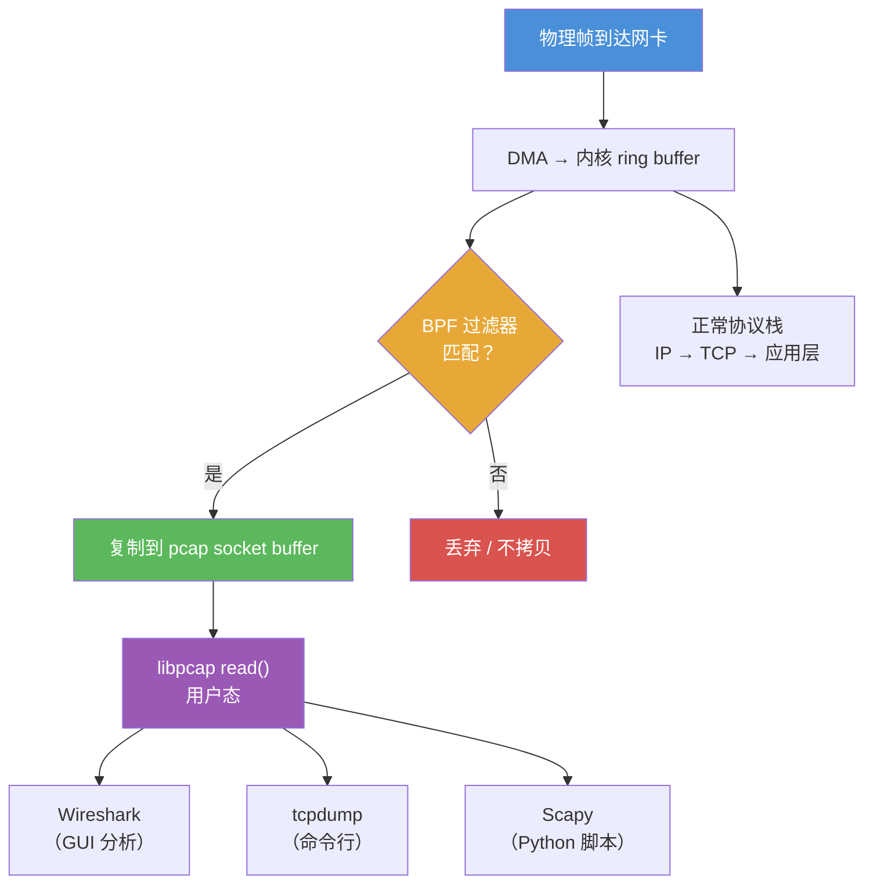

---
tags:
  - network
  - protocol-analysis
  - tier3
  - libpcap
  - bpf
  - pcapng
---
# 网络协议栈与抓包原理

> [!abstract] TL;DR
> 抓包的本质是将网卡置于混杂模式（promiscuous mode），借助 AF_PACKET socket 或等价机制把帧复制一份给用户态程序。BPF 在内核层提前过滤，避免无关帧被拷贝。libpcap 封装了这一差异，让 Wireshark/tcpdump 共享同一底层接口。pcapng 在经典 .pcap 基础上引入块结构，支持多接口注释与元数据。

## 概述与定位

网络抓包（packet capture）横跨 OSI 七层与 TCP/IP 四层两套模型。理解抓包工具必须先搞清楚：数据帧在哪一层被"拦截"、谁来决定哪些帧进入用户态、以及文件格式如何保存捕获结果。

**OSI 与 TCP/IP 对照**

| OSI 层 | 名称 | TCP/IP 层 | 典型协议 |
|--------|------|-----------|----------|
| 7 | 应用层 | 应用层 | HTTP、DNS、SMTP |
| 6 | 表示层 | 应用层 | TLS、XDR |
| 5 | 会话层 | 应用层 | RPC |
| 4 | 传输层 | 传输层 | TCP、UDP |
| 3 | 网络层 | 网络层 | IP、ICMP |
| 2 | 数据链路层 | 网络接口层 | Ethernet、Wi-Fi |
| 1 | 物理层 | 网络接口层 | PHY、Cable |

抓包工具通常工作在**第 2 层**（数据链路层），拿到完整以太帧，然后由各层 dissector 逐层解包直至应用层。

## 原理与机制

### 混杂模式（Promiscuous Mode）

正常情况下网卡只接收目标 MAC 地址匹配本机或广播地址的帧，其余帧在 DMA 阶段被丢弃。开启混杂模式后，网卡将**所有到达的帧**都上交给操作系统，无论目标 MAC 是否是本机。

```
# Linux 手动开启混杂模式
ip link set eth0 promisc on

# 查看当前模式
ip link show eth0 | grep PROMISC
```

### AF_PACKET socket（Linux）

Linux 通过 `AF_PACKET` 类型的原始套接字将帧副本递交给用户态进程：

```c
int fd = socket(AF_PACKET, SOCK_RAW, htons(ETH_P_ALL));
// ETH_P_ALL 表示捕获所有以太类型的帧
```

内核在帧进入协议栈**之前**将其克隆，因此抓包不影响正常数据通路。

### BPF 内核级过滤工作流

BPF（Berkeley Packet Filter，1993年，Steven McCanne & Van Jacobson）是一套运行于内核的虚拟机，用于在帧到达用户态**之前**过滤。其核心价值：**减少内核→用户态的内存拷贝**。

```
帧到达网卡
    │
    ▼
DMA 到内核 ring buffer
    │
    ├─── BPF 程序判断：匹配？
    │         ├─ 是 → 复制到捕获 socket buffer → 用户态读取
    │         └─ 否 → 丢弃（不拷贝）
    │
    ▼
正常协议栈处理（IP/TCP/应用层）
```

BPF 虚拟机有两个寄存器（A 累加器、X 索引）和一个临时内存区，指令集极简。现代 Linux 内核使用 eBPF（extended BPF）大幅扩展，但 libpcap 仍生成 classic BPF 字节码注入内核。

### libpcap 架构

```
用户程序 (Wireshark/tcpdump)
        │
        ▼
  libpcap API
  pcap_open_live()
  pcap_compile()  ← 把 BPF 字符串编译为字节码
  pcap_setfilter() ← 注入内核
  pcap_loop() / pcap_next()
        │
        ▼
OS 抽象层
  Linux: AF_PACKET + BPF
  macOS: BPF device (/dev/bpf*)
  Windows: WinPcap/Npcap (NDIS 驱动)
        │
        ▼
  网络接口驱动 / 混杂模式
```

libpcap 的跨平台价值在于：Wireshark、tcpdump、Scapy、tshark 都只需调用同一套 API，底层差异被完全屏蔽。

### 高速抓包：PF_RING 与 DPDK

当流量速率超过 10 Gbps，标准 AF_PACKET 的系统调用开销和内存拷贝成为瓶颈：

- **PF_RING**：零拷贝（zero-copy）内核模块，把帧直接映射到用户态共享内存环形缓冲区
- **DPDK**（Data Plane Development Kit）：完全绕过内核，用户态轮询模式驱动（PMD），适合 40/100 Gbps 场景

## 结构/算法/伪代码详解

### 协议封装叠加示意

```
┌─────────────────────────────────────────────────────┐
│ Ethernet Header (14 bytes)                          │
│  dst_mac(6) | src_mac(6) | ethertype(2: 0x0800=IP) │
├─────────────────────────────────────────────────────┤
│ IP Header (20 bytes minimum)                        │
│  ver(4b) | IHL(4b) | DSCP | total_len | id | flags │
│  frag_offset | TTL | proto(1: 6=TCP) | checksum    │
│  src_ip(4) | dst_ip(4)                              │
├─────────────────────────────────────────────────────┤
│ TCP Header (20 bytes minimum)                       │
│  src_port(2) | dst_port(2) | seq(4) | ack(4)       │
│  offset(4b) | flags(9b) | window(2) | checksum(2)  │
├─────────────────────────────────────────────────────┤
│ HTTP Request                                        │
│  GET /index.html HTTP/1.1\r\n                       │
│  Host: example.com\r\n\r\n                         │
└─────────────────────────────────────────────────────┘
```

### BPF 指令集简介

BPF 字节码由固定长度指令组成，每条指令 8 字节：

```
struct bpf_insn {
    u_int16_t code;   // 操作码
    u_int8_t  jt;     // 条件为真时跳过的指令数
    u_int8_t  jf;     // 条件为假时跳过的指令数
    int32_t   k;      // 通用常数字段
};
```

示例：捕获所有 TCP SYN 包的 BPF 字节码（人类可读形式）：

```
# 等价于: tcp[13] & 0x02 != 0  (SYN flag)
(000) ldh  [12]          # 加载以太类型字段
(001) jeq  #0x800  jt 2  # 是 IPv4？
(002) ldb  [23]          # 加载 IP proto 字段
(003) jeq  #0x6   jt 4  # 是 TCP？
(004) ldb  [47]          # 加载 TCP flags 字节（以太14+IP20+TCP13=47）
(005) jset #0x02  jt 6  # SYN bit 是否置位？
(006) ret  #65535        # 匹配，捕获整个包
(007) ret  #0            # 不匹配，丢弃
```

### pcapng 块类型表

pcapng（PCAP Next Generation，RFC 草案）使用**块**（block）结构，每个块有类型、长度和可选选项：

| 块类型 | 缩写 | 类型值 | 用途 |
|--------|------|--------|------|
| Section Header Block | SHB | 0x0A0D0D0A | 文件起点，含字节序魔数、版本 |
| Interface Description Block | IDB | 0x00000001 | 描述捕获接口（名称/LinkType/快照长度）|
| Enhanced Packet Block | EPB | 0x00000006 | 主要分组块，含时间戳/接口索引/数据 |
| Simple Packet Block | SPB | 0x00000003 | 无时间戳的简化分组块 |
| Name Resolution Block | NRB | 0x00000004 | IP→主机名映射（类似 hosts 文件）|
| Interface Statistics Block | ISB | 0x00000005 | 接口统计（收包数/丢包数）|
| Decryption Secrets Block | DSB | 0x0000000A | 嵌入 TLS 密钥日志（Wireshark 4.0+）|

EPB 是最常用的块，结构如下：

```
┌─────────────────────────────────┐
│ Block Type (4)      = 0x06     │
│ Block Total Length (4)          │
│ Interface ID (4)                │
│ Timestamp High (4)              │
│ Timestamp Low (4)               │
│ Captured Packet Length (4)      │
│ Original Packet Length (4)      │
│ Packet Data (variable, padded)  │
│ Options (variable)              │
│ Block Total Length (4) [repeat] │
└─────────────────────────────────┘
```

## 工具视角与实战

### 安装

```bash
# Ubuntu/Debian
sudo apt install wireshark tcpdump

# macOS
brew install wireshark tcpdump

# 安装后无需 sudo 运行 Wireshark：将用户加入 wireshark 组
sudo usermod -aG wireshark $USER
```

### 混杂模式开关

```bash
# Wireshark 捕获对话框中勾选 "Capture in promiscuous mode"

# tcpdump 默认开启混杂模式，显式禁用：
tcpdump -p -i eth0

# 验证是否已开启
cat /sys/class/net/eth0/flags  # 0x100 表示 IFF_PROMISC
```

### 捕获权限

```bash
# 方法1：以 root 运行（不推荐）
sudo tcpdump -i eth0

# 方法2：赋予 CAP_NET_RAW 能力
sudo setcap cap_net_raw,cap_net_admin=eip $(which tcpdump)
tcpdump -i eth0  # 普通用户即可运行

# 方法3：Wireshark dumpcap（推荐，已由 wireshark 组管理）
ls -la /usr/bin/dumpcap  # 应有 cap_net_raw+eip
```

### 第一个抓包示例

```bash
# 抓取 eth0 上所有 HTTP 流量，保存为 pcapng
tcpdump -i eth0 -n -s 0 -w /tmp/http_capture.pcapng 'tcp port 80'

# 用 Wireshark 打开
wireshark /tmp/http_capture.pcapng

# 或用 tshark 命令行查看
tshark -r /tmp/http_capture.pcapng -Y 'http' -T fields -e frame.number -e ip.src -e http.request.uri
```

## 安全性与正确使用

### 抓包对网络隐私的影响

混杂模式允许捕获**同一广播域**内所有设备的未加密流量，包括他人的明文密码、Cookie 等敏感信息。在共享以太网（集线器/共享 Wi-Fi）环境中，一台被攻陷的机器可以被动监听整个子网。

**交换机环境的缓解**：现代交换机基于 MAC 地址转发，混杂模式仅能捕获广播帧和发往本机的帧。但 ARP 欺骗（ARP spoofing）可以绕过这一保护，让目标流量经过攻击者机器。

### 合规要求

- **授权**：只对自己拥有权限的网络/设备抓包。在企业环境中，必须获得书面授权
- **数据保留**：捕获文件含有个人数据（密码、证书、个人信息），应在分析完成后及时删除或加密存储
- **法律边界**：在大多数司法管辖区，未经授权拦截网络通信属于违法行为（如美国 CFAA、中国网络安全法）
- **测试环境**：在生产环境抓包可能触发 IDS/IPS 告警，建议在隔离测试环境操作

## 小结

- 抓包通过混杂模式 + AF_PACKET socket 实现，BPF 在内核层过滤减少拷贝开销
- libpcap 统一了跨平台接口，是 Wireshark/tcpdump/Scapy 的共同依赖
- pcapng 相比 .pcap 支持多接口、块结构和嵌入元数据（含 TLS 密钥）
- 高速场景（10G+）需要 PF_RING 或 DPDK 绕过标准内核路径
- 抓包操作必须在授权范围内进行，捕获文件需妥善保管

## 相关阅读

- libpcap 官方文档：https://www.tcpdump.org/manpages/pcap.3pcap.html
- RFC 草案：PCAP Next Generation (pcapng) File Format
- McCanne & Jacobson 原始 BPF 论文（1993 USENIX）
- Linux `packet(7)` man page：AF_PACKET socket 详细说明
- Wireshark 开发者指南：Dissector 编写与 pcapng 扩展



[[00.抓包与协议分析实战总览|⬆ 系列总览]] | [[01.网络协议栈与抓包原理|← 上一章]] | [[02.Wireshark深度使用与过滤器语法|→ 下一章]]
