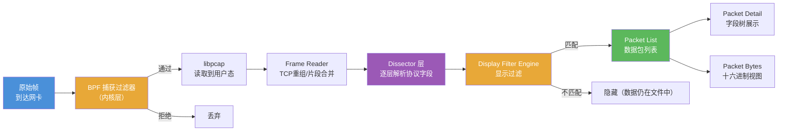

---
tags:
  - network
  - protocol-analysis
  - tier3
  - wireshark
  - display-filter
  - tshark
---
# Wireshark 深度使用与过滤器语法

> [!abstract] TL;DR
> Wireshark 的核心是两套独立过滤系统：BPF **捕获过滤器**（决定什么帧进文件）和 **显示过滤器**（决定已捕获的帧中显示哪些）。两者语法完全不同，混淆是新手最常见的错误。tshark 将 Wireshark 的解析能力带到命令行，可输出任意协议字段的结构化数据。

## 概述与定位

Wireshark 是目前最主流的图形化协议分析工具，底层依赖 libpcap/Npcap 捕获，通过数百个内置 **dissector** 解析协议层，最终以树状结构展示每个字段的含义。

**架构层次：**

```
┌──────────────────────────────┐
│     Qt GUI / GTK GUI         │  ← 用户交互层
├──────────────────────────────┤
│   Display Filter Engine      │  ← 显示过滤（用户态）
│   Dissector Layer            │  ← 协议解析（数百个 .so 插件）
│   Frame Reader / Assembler   │  ← TCP 流重组、片段合并
├──────────────────────────────┤
│   libpcap / Npcap            │  ← 捕获抽象层
│   BPF Capture Filter         │  ← 内核级过滤
└──────────────────────────────┘
```

tshark 是 Wireshark 的命令行前端，共享同一套 dissector 和过滤引擎，适合批量分析、CI 集成和自动化脚本。

## 原理与机制

### 两种过滤器对比

| 维度 | 捕获过滤器（BPF） | 显示过滤器 |
|------|------|------|
| 作用时机 | 捕获时，内核层 | 已捕获后，用户态 |
| 语法体系 | libpcap/BPF 语法 | Wireshark 专有语法 |
| 性能影响 | 减少写入磁盘的数据量 | 仅影响显示，不改变文件 |
| 精确度 | 只能访问固定偏移字段 | 可访问任意解析后的命名字段 |
| 可修改性 | 修改需重新开始捕获 | 随时修改，即时生效 |
| 示例 | `tcp port 80` | `tcp.port == 80` |
| 出错影响 | 可能丢失需要的包 | 仅改变显示，数据不丢失 |

### Dissector 自动识别机制

Wireshark 通过以下顺序自动选择 dissector：

1. **端口号启发**：目标端口 80 → 尝试 HTTP dissector
2. **链路类型**：pcap 文件记录的 DLT_EN10MB → 从 Ethernet dissector 开始
3. **Heuristic dissector**：对负载做特征识别（如 SSL 握手魔数）
4. **用户强制指定**：右键 → Decode As → 强制用特定 dissector

当协议运行在非标准端口（如 HTTP on 8080），可手动指定：`Analyze → Decode As → TCP port 8080 → HTTP`

## 结构/算法/伪代码详解

### 显示过滤器完整语法

**比较运算符：**

```
==  eq    等于
!=  ne    不等于
>   gt    大于
<   lt    小于
>=  ge    大于等于
<=  le    小于等于
~=  matches  正则匹配（POSIX ERE）
contains  包含子串
```

**逻辑运算符：**

```
&&  and   逻辑与
||  or    逻辑或
!   not   逻辑非
```

**成员运算符与范围：**

```
# 检查字段是否在集合中
tcp.port in {80 443 8080}

# 字节范围切片（偏移:长度）
tcp[0:2]  # TCP 头前两个字节（源端口）

# 字段存在性检查
http.request  # 等价于 http.request exists
```

### 常用显示过滤器速查表

**HTTP 系列：**

```
http                                    # 所有 HTTP 流量
http.request                            # 仅请求
http.response                           # 仅响应
http.request.method == "GET"            # GET 请求
http.request.method == "POST"           # POST 请求
http.response.code == 200               # 200 OK
http.response.code >= 400               # 错误响应
http.host contains "example.com"        # 特定主机
http.request.uri matches "/api/.*"      # URI 正则匹配
```

**TLS/SSL 系列：**

```
tls                                     # 所有 TLS 流量
tls.handshake                           # TLS 握手帧
tls.handshake.type == 1                 # ClientHello
tls.handshake.type == 2                 # ServerHello
tls.handshake.extensions.server_name contains "example.com"  # SNI
ssl.record.content_type == 21           # Alert 记录
```

**DNS 系列：**

```
dns                                     # 所有 DNS
dns.qry.name == "example.com"           # 特定域名查询
dns.flags.response == 0                 # 仅请求
dns.flags.response == 1                 # 仅响应
dns.qry.type == 1                       # A 记录查询
dns.qry.type == 28                      # AAAA 记录查询
dns.flags.rcode != 0                    # DNS 错误（非 NOERROR）
```

**TCP 系列：**

```
tcp.flags.syn == 1 && tcp.flags.ack == 0   # SYN（连接建立）
tcp.flags.rst == 1                          # RST（连接重置）
tcp.flags.fin == 1                          # FIN（正常关闭）
tcp.analysis.retransmission                 # TCP 重传
tcp.analysis.duplicate_ack                  # 重复 ACK
tcp.analysis.zero_window                    # 零窗口（接收方缓冲满）
tcp.port == 443                             # 目标或源端口 443
tcp.dstport == 80                           # 目标端口 80
ip.addr == 192.168.1.100                    # 任意方向 IP
ip.src == 10.0.0.1 && ip.dst == 10.0.0.2   # 特定方向
```

**ICMP 系列：**

```
icmp                                    # 所有 ICMP
icmp.type == 8                          # Echo Request（ping 发出）
icmp.type == 0                          # Echo Reply（ping 回复）
icmp.type == 3                          # Destination Unreachable
```

### tshark 字段提取示例

```bash
# 提取所有 HTTP 请求的主机名和 URI
tshark -r capture.pcapng \
  -Y 'http.request' \
  -T fields \
  -e frame.number \
  -e ip.src \
  -e http.host \
  -e http.request.method \
  -e http.request.uri \
  -E header=y \
  -E separator=,

# 统计各响应码数量
tshark -r capture.pcapng \
  -Y 'http.response' \
  -T fields \
  -e http.response.code \
  | sort | uniq -c | sort -rn

# 提取 DNS 查询域名（去重）
tshark -r capture.pcapng \
  -Y 'dns.flags.response == 0' \
  -T fields \
  -e dns.qry.name \
  | sort -u

# 实时捕获并输出 TLS SNI
tshark -i eth0 \
  -Y 'tls.handshake.type == 1' \
  -T fields \
  -e ip.src \
  -e tls.handshake.extensions.server_name

# 统计每分钟 HTTP 请求数（-z io,stat）
tshark -r capture.pcapng \
  -z io,stat,60,'http.request' \
  -q
```

## 工具视角与实战

### Follow Stream（流追踪）

Follow Stream 是 Wireshark 最实用的功能之一，可以重组 TCP/UDP/HTTP 流并以可读格式展示完整会话内容。

**操作步骤：**
1. 右键点击任意属于目标会话的帧
2. 选择 `Follow → TCP Stream`（或 UDP/HTTP/TLS）
3. 弹窗显示双向数据，客户端→服务器用红色，服务器→客户端用蓝色
4. 可切换显示格式：ASCII / C arrays / Raw（hex） / UTF-8

**自动生成的显示过滤器：**`tcp.stream eq 5`（流编号从 0 开始）

### 着色规则（Coloring Rules）

`View → Coloring Rules` 可为匹配特定过滤器的帧设置背景/前景色：

| 默认颜色 | 匹配条件 |
|----------|----------|
| 黑底红字 | `tcp.analysis.flags && !tcp.analysis.window_update` |
| 黄底黑字 | `arp` |
| 绿背景 | `http` |
| 紫背景 | `dns` |

自定义规则示例：高亮所有 POST 请求：
- 名称：`HTTP POST`
- 过滤器：`http.request.method == "POST"`
- 背景色：橙色

### IO Graph 绘制

`Statistics → IO Graph` 可绘制流量随时间变化的折线图：

- X 轴：时间（可调精度：秒/毫秒）
- Y 轴：数据包数/字节数/bit rate
- 支持叠加多条过滤器曲线，便于对比 TCP 重传率与总流量

**实用场景**：定位流量突增时刻，结合时间戳找到问题帧

### Conversations 矩阵

`Statistics → Conversations` 显示所有通信对之间的统计：

| 列 | 含义 |
|----|------|
| Address A / Address B | 通信双方 IP |
| Packets A→B / B→A | 各方向包数 |
| Bytes A→B / B→A | 各方向字节数 |
| Rel Start | 相对开始时间 |
| Duration | 会话持续时间 |

支持按 Ethernet / IPv4 / IPv6 / TCP / UDP 分级过滤，可右键选择 `Apply as Filter`。

### 统计命令（tshark -z）

```bash
# 协议层级统计
tshark -r capture.pcapng -z io,phs -q

# TCP/UDP 会话统计
tshark -r capture.pcapng -z conv,tcp -q

# HTTP 请求-响应时间统计
tshark -r capture.pcapng -z http,tree -q

# DNS 统计
tshark -r capture.pcapng -z dns,tree -q

# IO 按秒统计字节数
tshark -r capture.pcapng -z io,stat,1 -q
```

## 安全性与正确使用

### Lua Dissector 安全边界

Wireshark 支持用 Lua 编写自定义 dissector（`~/.config/wireshark/plugins/*.lua`），但需注意：

- **代码执行风险**：`.pcapng` 文件可内嵌触发 Lua dissector 的自定义数据，理论上存在载荷注入风险。不要用生产环境 Wireshark 打开来源不明的 pcap 文件
- **权限隔离**：Wireshark 以普通用户权限运行（通过 dumpcap 子进程获取 CAP_NET_RAW），Lua 代码在同等权限下执行
- **来源验证**：只加载来自可信源的 Lua 插件，`.lua` 文件不要从公共论坛直接复制粘贴

### 大文件性能

- 超过 1 GB 的 pcap 文件，Wireshark 加载时全量建立帧索引，可能耗时数分钟且内存占用高
- **建议**：先用 `editcap` 切割，或用 `tshark -Y` 过滤后写出子集再打开
- 显示过滤器对大文件进行二次过滤时，Wireshark 需要线性扫描，可配合 `Statistics → Expert Information` 快速定位异常

## 小结

- Wireshark 的架构由 GUI、Display Filter Engine、Dissector Layer 和 libpcap 四层组成
- 捕获过滤器（BPF）和显示过滤器是两套完全不同的语法体系，不可混用
- 显示过滤器支持比较、逻辑、成员、正则等丰富运算，可直接访问解析后的命名字段
- tshark 通过 `-T fields -e` 可提取任意字段为结构化输出，适合自动化分析
- Follow Stream、IO Graph、Conversations 是日常分析最高频的三个功能

## 相关阅读

- Wireshark 官方用户手册：https://www.wireshark.org/docs/wsug_html/
- Wireshark Display Filter Reference：https://www.wireshark.org/docs/dfref/
- tshark 手册页：`man tshark`
- Wireshark Lua API 文档：https://www.wireshark.org/docs/wsdg_html/wsluarm.html



[[00.抓包与协议分析实战总览|⬆ 系列总览]] | [[01.网络协议栈与抓包原理|← 上一章]] | [[03.tcpdump与命令行抓包|→ 下一章]]
