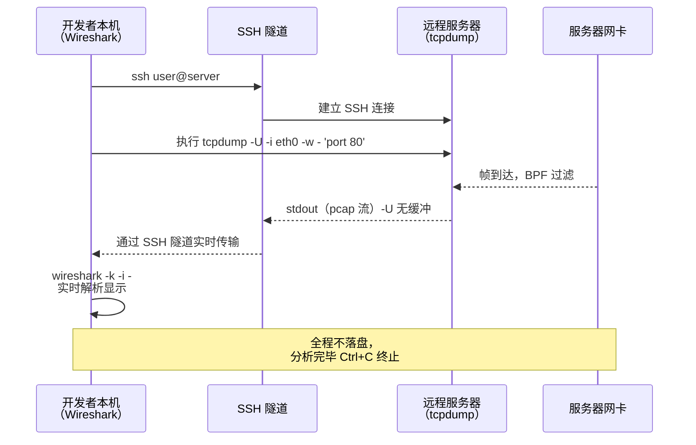

---
tags:
  - network
  - protocol-analysis
  - tier3
  - tcpdump
  - bpf
  - remote-capture
---
# tcpdump 与命令行抓包

> [!abstract] TL;DR
> tcpdump 秉持 Unix 哲学：做好一件事，输出文本，与其他工具组合。在无 GUI 的服务器、容器、嵌入式设备上，tcpdump 是首选抓包工具。它直接生成标准 .pcap 文件，可通过 SSH 管道实时传到本机 Wireshark 分析。BPF 过滤器让它只捕获关心的流量，`-G`/`-C` 实现日志旋转，`mergecap`/`editcap` 完成后处理。

## 概述与定位

tcpdump 由 Van Jacobson、Craig Leres、Steven McCanne 在 1988 年编写于 Lawrence Berkeley National Laboratory，与 libpcap 同源，是历史上第一个实用的开源抓包工具。

**适用场景对比：**

| 场景 | 推荐工具 | 原因 |
|------|----------|------|
| 桌面分析、协议学习 | Wireshark | GUI 更直观 |
| 无 GUI 生产服务器 | tcpdump | 仅需 CLI，无 X11 |
| Docker/Kubernetes Pod | tcpdump | 容器内几乎无 GUI |
| CI 流水线自动化 | tcpdump + tshark | 可脚本化 |
| 远程捕获+本地分析 | tcpdump + SSH 管道 | 组合使用 |
| 高速流量（10G+） | PF_RING/DPDK | 内核旁路 |

## 原理与机制

### BPF 表达式如何编译成字节码

tcpdump 接受人类可读的 BPF 过滤表达式，内部调用 `pcap_compile()` 把它编译成 cBPF 字节码，再通过 `pcap_setfilter()` 注入内核。整个编译过程分三步：

**第一步：词法与语法分析**——tcpdump 使用 flex/yacc 生成的解析器，把表达式文本解析成抽象语法树（AST）。`tcp port 80` 被解析为"协议=TCP 且（源端口=80 或目标端口=80）"的逻辑树。

**第二步：代码生成**——AST 被遍历，产生 cBPF 指令序列。对于每个协议层条件，代码生成器需要知道对应字段在帧中的字节偏移（这些偏移是硬编码的常量，基于以太网/IP/TCP 头部的固定布局）。例如 IP 协议字段在以太网帧偏移 23 处，TCP 目标端口在偏移 36 处（14+20+2）。

**第三步：优化与注入**——生成的 cBPF 指令序列通过 `setsockopt(SO_ATTACH_FILTER)` 传入内核。内核的 BPF 验证器（verifier）检查程序合法性（无环、无越界访问、必定终止），然后 JIT 编译器把它翻译成 x86-64 机器码。

```bash
# 查看编译后的 cBPF 指令（人类可读形式）
tcpdump -d 'tcp port 80'

# 输出示例：
# (000) ldh      [12]       # 加载以太类型
# (001) jeq      #0x86dd  jt 6  # IPv6 跳到 6
# (002) jeq      #0x800   jt 3  # IPv4 跳到 3
# (003) ldb      [23]       # 加载 IP proto
# (004) jeq      #0x6    jt 5  # 是 TCP？
# (005) jmp      #13        # 不是，丢弃
# ...

# C 数组格式（可直接用于 setsockopt）
tcpdump -dd 'tcp port 80'
```

这种"先编译再注入"的设计意味着：即使流量速率是每秒百万级，过滤也几乎是零开销（JIT 后的过滤代码速度接近 C）。

### snaplen（-s）对性能与信息完整性的影响

`-s` 参数（snaplen，快照长度）控制每帧被捕获的最大字节数。默认值在不同版本有差异：

- 早期 tcpdump 默认 `snaplen=68`（足够捕获 IP+TCP 头，但不含数据）
- 现代版本（1.x）默认 `snaplen=262144`（几乎等价于完整帧）
- `-s 0` 是明确指定"捕获完整帧"（实际上映射到平台最大值）

snaplen 影响两个维度：
1. **写入速度/磁盘占用**：snaplen 越小，每帧写入的字节越少，I/O 压力越小。在分析 TCP 握手、延迟等纯头部问题时，`-s 96` 已足够（14+60+20），可以大幅降低磁盘开销。
2. **信息完整性**：如果 snaplen 小于实际帧长，帧数据被截断。Wireshark 会在 Packet Details 中显示 `[Packet size limited during capture]` 警告。分析 HTTP 响应体、TLS 载荷内容时，截断会导致信息丢失，甚至破坏 TCP 流重组（因为重组需要完整的 payload 字节）。

**实战建议**：
- 排查连接问题（SYN/RST/延迟）：`-s 128`，只需头部
- 分析应用层内容：`-s 0`（完整帧），或根据已知 MTU 设置略大于 1500
- 高流量下尽量减少 snaplen，避免因写盘速度不足导致内核层丢帧

### pcap 文件格式写入细节

tcpdump 用 `-w` 写出的 `.pcap` 文件（经典格式，区别于 pcapng）结构简单但值得了解：

```
全局文件头（24 字节，写入时一次性写出）：
  magic_number  = 0xa1b2c3d4（小端字节序标志）
  version_major = 2
  version_minor = 4
  thiszone      = 0（时区，通常为 0 即 UTC）
  sigfigs       = 0（时间戳精度，通常为 0）
  snaplen       = 262144（或 -s 指定的值）
  network       = 1（DLT_EN10MB，以太网）

每帧记录头（16 字节，每帧前写出）：
  ts_sec   = Unix 时间戳（秒）
  ts_usec  = 微秒部分（pcapng 支持纳秒，pcap 不支持）
  incl_len = 本帧实际写入字节数（min(帧长, snaplen)）
  orig_len = 帧的原始长度（超过 snaplen 时 orig_len > incl_len）

帧数据（incl_len 字节）
```

`-U`（unbuffered）参数让每帧写出后立即 `fflush()`，避免数据停留在 C 标准库缓冲区——这是 SSH 管道传输时的关键，没有 `-U` 数据会在写够 4KB 后才传出，Wireshark 端会看到数据以"块"的方式到达。

### 环形缓冲（-C/-W/-G）与丢包

长期运行 tcpdump 面临磁盘写满的风险。三个参数组合实现环形（rolling）文件：

- **`-C size`**：当前文件超过 size MB 时创建新文件（`file.1`、`file.2` ...）
- **`-W count`**：最多保留 count 个文件，超过后覆盖最旧的（真正的"环"）
- **`-G seconds`**：每隔 seconds 秒创建新文件，文件名通过 `strftime` 格式（`%Y%m%d_%H%M%S`）自动包含时间戳

三者可以组合使用：`-C 100 -W 24 -G 3600` 表示每小时或每 100MB 创建新文件，最多保留 24 个文件（约 24 小时滚动窗口）。

**丢包的根本原因**：`packets dropped by kernel` 计数器指的是 AF_PACKET socket 的 ring buffer 满了，新到的帧找不到可用槽位被丢弃。这发生在**内核层**——帧通过了 BPF 过滤，但 ring buffer 已满，用户进程（tcpdump 主循环）消费帧的速度跟不上帧到达速度。常见触发场景：突发大流量、磁盘 I/O 拥塞（写盘慢导致主循环阻塞在 write 系统调用）、过多帧匹配了 BPF 过滤器。

缓解措施：
- 缩小 snaplen（减少每帧写入量）
- 用 SSD 或内存 tmpfs 作为捕获目标（减少 I/O 延迟）
- 用更精确的 BPF 过滤器减少匹配帧数
- 增大 ring buffer：`setsockopt(SO_RCVBUF)` 或 `/proc/sys/net/core/rmem_max`

### BPF 语法完整说明

tcpdump BPF 过滤表达式由**基元（primitive）**和**组合运算符**构成：

**类型限定词（type）：**
```
host 1.2.3.4          # 主机（源或目标）
net 192.168.0.0/24    # 网络（CIDR）
port 80               # 端口（源或目标）
portrange 8000-8100   # 端口范围
```

**方向限定词（dir）：**
```
src host 1.2.3.4      # 仅源地址
dst port 443          # 仅目标端口
src or dst port 80    # 任意方向（默认）
```

**协议限定词（proto）：**
```
tcp                   # 仅 TCP
udp                   # 仅 UDP
icmp                  # 仅 ICMP
arp                   # 仅 ARP
ip6                   # 仅 IPv6
```

**字节级访问（proto[offset:size]）：**
```
tcp[13] & 0x02 != 0   # TCP SYN 标志（第13字节 flags，bit1 是 SYN）
tcp[13] & 0x12 == 0x12  # SYN+ACK（三次握手第二包）
tcp[13] & 0x01 != 0   # FIN 标志
tcp[13] & 0x04 != 0   # RST 标志
ip[9] == 6            # IP proto 字段 = 6（TCP）
```

**组合运算符：**
```
and  &&    # 逻辑与
or   ||    # 逻辑或
not  !     # 逻辑非
( )        # 括号分组（在 shell 中需要转义或引号）
```

### 文件旋转：-G 与 -C

```bash
# -G 60：每 60 秒新建一个文件（文件名包含时间戳）
# -C 100：文件大小超过 100 MB 时新建（-G 和 -C 可同时使用）
# -W 10：最多保留 10 个文件（环形，旧文件被覆盖）

tcpdump -i eth0 -w /tmp/capture_%Y%m%d_%H%M%S.pcap \
  -G 60 -W 100 'not port 22'
```

`strftime` 格式字符串在 `-w` 文件名中自动展开（如 `%Y%m%d_%H%M%S`）。

## 结构/算法/伪代码详解

### 完整命令示例集

**基础抓包：**

```bash
# 抓取 eth0 所有流量，完整帧，不解析主机名，保存文件
tcpdump -i eth0 -n -s 0 -w /tmp/all.pcap

# 抓取任意接口（-i any，Linux 专有）
tcpdump -i any -n -s 0 -w /tmp/any.pcap

# 限制抓包帧数后退出（抓 100 个包）
tcpdump -i eth0 -n -c 100 -w /tmp/first100.pcap
```

**按协议/端口过滤：**

```bash
# HTTP 流量（80 端口）
tcpdump -i eth0 -n -s 0 -w /tmp/http.pcap 'tcp port 80'

# HTTPS 流量（443 端口）
tcpdump -i eth0 -n -s 0 -w /tmp/https.pcap 'tcp port 443'

# DNS 查询（UDP 53）
tcpdump -i eth0 -n -s 0 -w /tmp/dns.pcap 'udp port 53'

# 所有 DNS（TCP+UDP，区域传输用 TCP）
tcpdump -i eth0 -n -s 0 -w /tmp/dns.pcap 'port 53'
```

**按主机/网络过滤：**

```bash
# 特定主机（双向）
tcpdump -i eth0 -n -s 0 'host 192.168.1.100'

# 特定源到特定目标
tcpdump -i eth0 -n -s 0 'src 10.0.0.1 and dst 8.8.8.8'

# 子网流量
tcpdump -i eth0 -n -s 0 'net 192.168.0.0/24'

# 排除 SSH，避免捕获自身管理流量
tcpdump -i eth0 -n -s 0 -w /tmp/nossh.pcap 'not port 22'
```

**抓 TCP 握手相关：**

```bash
# 只抓 SYN 包（连接建立请求）
tcpdump -i eth0 -n 'tcp[13] & 2 != 0 and tcp[13] & 16 == 0'

# SYN 或 FIN 或 RST（连接状态变化）
tcpdump -i eth0 -n 'tcp[13] & 7 != 0'

# RST 包（连接重置，排查连接失败）
tcpdump -i eth0 -n 'tcp[13] & 4 != 0'
```

**环形文件（轮转）：**

```bash
# 每 300 秒轮转一次，保留最新 24 个文件（覆盖最旧的）
tcpdump -i eth0 -n -s 0 \
  -w '/tmp/capture_%Y%m%d_%H%M%S.pcap' \
  -G 300 -W 24 \
  'not port 22'
```

### tcpdump 输出格式解析

```
13:45:22.123456 IP 192.168.1.5.54321 > 93.184.216.34.80: Flags [S], seq 1234567890, win 65535, options [mss 1460,sackOK,TS val 100 ecr 0,nop,wscale 7], length 0
```

| 字段 | 含义 |
|------|------|
| `13:45:22.123456` | 本地时间戳（微秒精度） |
| `IP` | 网络层协议（IPv4，IPv6 显示 IP6） |
| `192.168.1.5.54321` | 源 IP.源端口 |
| `>` | 方向箭头 |
| `93.184.216.34.80` | 目标 IP.目标端口 |
| `Flags [S]` | TCP 标志（S=SYN, A=ACK, F=FIN, R=RST, P=PSH）|
| `seq 1234567890` | 序列号 |
| `win 65535` | 接收窗口大小 |
| `options [...]` | TCP 选项（MSS/SACK/时间戳/窗口缩放）|
| `length 0` | 载荷长度（SYN 包无载荷）|

**常见 Flags 组合：**

```
[S]      SYN                  # 连接请求
[S.]     SYN-ACK              # 连接确认
[.]      ACK                  # 纯 ACK
[P.]     PSH-ACK              # 数据推送
[F.]     FIN-ACK              # 正常关闭
[R.]     RST-ACK              # 强制关闭
[R]      RST                  # 立即重置
```

### BPF 组合语法进阶

```bash
# HTTP 或 HTTPS 流量
tcpdump -i eth0 -n '(tcp port 80 or tcp port 443)'

# 特定主机的非 SSH 流量
tcpdump -i eth0 -n '(host 10.0.0.50) and (not port 22)'

# TCP 连接建立三步握手
tcpdump -i eth0 -n 'tcp[13] & 0x17 == 2'   # SYN only（不含 ACK）

# 大于 1400 字节的 IP 包（疑似大帧问题）
tcpdump -i eth0 -n 'ip[2:2] > 1400'
```

## 工具视角与实战

### 与 Wireshark 联动：SSH 远程实时抓包

这是 tcpdump 最强大的用法之一：在远程服务器抓包，实时传输到本机 Wireshark 分析，全程不落盘：

```bash
# 基本形式
ssh user@remote-host 'tcpdump -U -i eth0 -n -s 0 -w - "not port 22"' | wireshark -k -i -

# 参数说明：
# -U：每个包立即写出（无缓冲），而非积累后批量写
# -w -：输出到 stdout（而非文件）
# wireshark -k：立即开始捕获
# wireshark -i -：从 stdin 读取

# 带压缩（节省带宽，适合慢连接）
ssh user@remote-host 'tcpdump -U -i eth0 -n -s 0 -w - "port 80"' | \
  gzip -dc | wireshark -k -i -
# 注意：压缩本身也会增加 CPU 和延迟，视情况使用

# 也可以先保存到本地再打开
ssh user@remote-host 'tcpdump -i eth0 -n -s 0 -w - "port 80"' > /tmp/remote.pcap
wireshark /tmp/remote.pcap
```

**SSH 管道的工作原理**：tcpdump 在远端以无缓冲模式（`-U`）将 pcap 格式写入 stdout，SSH 把 stdout 通过加密隧道传输到本机 stdin，Wireshark 从 stdin 读取。关键在于 pcap 格式是流式的——Wireshark 读到全局文件头后就知道后续都是帧记录，不需要先知道文件大小。`-U` 确保每帧写出后立即通过管道发送，否则 C stdio 的 4KB 块缓冲会造成 Wireshark 接收出现明显延迟。

### mergecap 合并多个 pcap

```bash
# 合并多个捕获文件为一个（时间戳排序）
mergecap -w merged.pcapng file1.pcap file2.pcap file3.pcap

# 合并并强制转为 pcapng 格式
mergecap -F pcapng -w merged.pcapng *.pcap
```

### editcap 切割与处理

```bash
# 按时间范围切割（提取特定时间段）
editcap -A "2024-01-15 14:30:00" -B "2024-01-15 14:45:00" \
  input.pcap output_window.pcap

# 按帧数切割（每 10000 帧一个文件）
editcap -c 10000 input.pcap output.pcap
# 生成 output_00000_20240115.pcap, output_00001_...

# IP 地址匿名化（将 IP 替换为随机化但一致的地址）
editcap --anonymize input.pcap anonymized.pcap

# 删除重复帧（时间窗口内相同内容）
editcap -d input.pcap dedup.pcap

# 转换格式（pcap → pcapng）
editcap -F pcapng input.pcap output.pcapng
```

### capinfos 查看 pcap 文件信息

```bash
capinfos capture.pcap
# 输出：文件类型、接口数、帧数、字节数、时间范围、平均速率等
```

## 安全性与正确使用

### 只抓自有/授权流量

tcpdump 作为强力的流量捕获工具，必须严格限制在**自有或明确书面授权**的网络范围内使用。在他人网络或对他人设备发起的抓包属于未授权监听，在绝大多数国家和地区均属违法。即便是企业内网，也需要相应的授权和合规要求。

```bash
# 检查当前用户是否有权限运行 tcpdump
getcap $(which tcpdump)
# 应显示: /usr/bin/tcpdump = cap_net_admin,cap_net_raw+eip

# 不要用 root 长期运行 tcpdump，推荐用 capability
sudo setcap cap_net_raw,cap_net_admin=eip /usr/bin/tcpdump
```

在容器环境中，需要 `--cap-add=NET_RAW` 或 `--privileged`（后者过于宽泛，生产不推荐）：

```bash
docker run --cap-add=NET_RAW --cap-add=NET_ADMIN alpine tcpdump -i eth0
```

### -w 和 -r 安全边界

- **写文件 (-w)**：pcap 文件包含完整载荷，含明文密码、Session Cookie 等敏感信息。应写入权限受限的目录（`chmod 700 /data/captures/`），分析完毕后立即删除或加密
- **读文件 (-r)**：tcpdump 解析 pcap 时有历史上的多个 CVE（如缓冲区溢出），应避免用 root 权限打开不可信 pcap 文件，优先用普通用户运行
- **环形文件**：使用 `-W` 限制最大文件数量，防止磁盘写满造成业务中断

### 生产环境最佳实践

```bash
# 1. 最小化捕获范围（只抓必要的流量）
tcpdump -i eth0 -n -s 0 -w /tmp/capture.pcap 'host 10.0.0.50 and port 8080'

# 2. 设置超时自动停止（避免遗忘导致磁盘写满）
timeout 300 tcpdump -i eth0 -n -s 0 -w /tmp/capture.pcap 'port 80'

# 3. 捕获后立即压缩
tcpdump -i eth0 -n -s 0 -w - 'port 80' | gzip > /tmp/capture.pcap.gz

# 4. 使用 systemd-run 限制资源
systemd-run --scope -p MemoryMax=512M \
  tcpdump -i eth0 -n -s 0 -w /tmp/capture.pcap
```

## 小结

- tcpdump 的 Unix 哲学体现在：与 SSH/gzip/Wireshark 管道组合，无需 GUI 即可完成远程抓包分析全流程
- BPF 过滤表达式由 libpcap 编译成 cBPF 字节码注入内核 JIT 执行；`-d/-dd` 可查看编译结果，理解过滤机制
- snaplen（`-s`）兼顾性能与完整性：排查头部问题用小 snaplen，分析载荷用 `-s 0`
- pcap 文件格式简单高效，全局头 + 逐帧记录头 + 数据；`-U` 无缓冲模式是 SSH 实时管道的关键
- `-G`/`-C`/`-W` 三个选项组合实现环形文件，适合长期监控；丢包根本原因是 ring buffer 满，应从减少匹配帧数和加速写盘两个方向改善
- SSH + tcpdump + Wireshark 管道是生产环境排查网络问题的黄金搭档
- `editcap`/`mergecap`/`capinfos` 是 Wireshark 套件中的命令行后处理工具，与 tcpdump 紧密配合
- 所有抓包操作必须仅对自有/授权流量进行，严禁在未获许可的网络中捕获他人数据

## 相关阅读

- tcpdump 手册：`man tcpdump` / https://www.tcpdump.org/manpages/tcpdump.1.html
- pcap-filter BPF 语法手册：`man pcap-filter`
- editcap 手册：https://www.wireshark.org/docs/man-pages/editcap.html
- mergecap 手册：https://www.wireshark.org/docs/man-pages/mergecap.html
- BPF 原始论文：McCanne & Jacobson, "The BSD Packet Filter", USENIX 1993



[[00.抓包与协议分析实战总览|⬆ 系列总览]] | [[02.Wireshark深度使用与过滤器语法|← 上一章]] | [[04.HTTP与HTTPS抓包与中间人分析|→ 下一章]]
