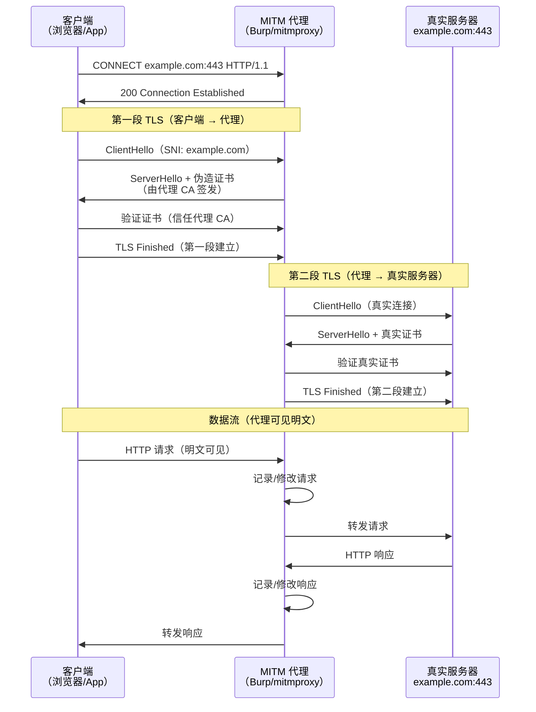

---
tags:
  - network
  - protocol-analysis
  - tier3
  - mitmproxy
  - burp-suite
  - https-mitm
  - charles
---
# HTTP 与 HTTPS 抓包与中间人分析

> [!abstract] TL;DR
> HTTP 明文流量用 tcpdump/Wireshark 直接抓即可；HTTPS 需要在 TLS 终止处介入。三条路径：①MITM 代理（mitmproxy/Burp/Charles）颁发伪造证书并将其加入系统信任；②通过 SSLKEYLOGFILE 导出会话密钥后解密；③在受控设备上安装 CA 证书（Android/iOS 测试）。代理方式最直观，但 Android 7+ 应用不再信任用户 CA，需借助 `network_security_config.xml` 或 root 绕过。

## 概述与定位

HTTP/1.1、HTTP/2、HTTP/3 的抓包挑战各有不同：

| 协议版本 | 传输层 | 抓包难点 |
|----------|--------|----------|
| HTTP/1.1 | TCP（明文） | 无，直接 Wireshark |
| HTTP/1.1 over TLS | TCP+TLS | 需解密 |
| HTTP/2 (h2) | TCP+TLS | 需解密+HPACK头部解压 |
| HTTP/2 (h2c) | TCP（明文） | 无 TLS，Wireshark 可解 |
| HTTP/3 (QUIC) | UDP+TLS 1.3 | QUIC 加密，需 SSLKEYLOGFILE |

**HTTPS 抓包的三种方式：**
1. **MITM 代理**（最常用）：在客户端和服务器之间插入代理，各自建立独立 TLS 连接
2. **SSLKEYLOGFILE 密钥导出**：从客户端导出会话密钥，Wireshark 离线解密（需控制客户端）
3. **CA 证书安装**：在受控设备上安装自签 CA，配合透明代理（适合移动端测试）

## 原理与机制

### MITM 代理工作原理

```
客户端 ←──TLS1──→ MITM 代理 ←──TLS2──→ 真实服务器
                     │
                  明文可见
```

代理持有自签 CA 证书，为每个目标域名**即时签发**伪造的叶证书。客户端验证证书时，信任链追溯到用户安装的 CA，因此不报警告。代理同时与真实服务器建立独立的 TLS 连接，转发明文请求/响应。

**CONNECT 隧道协议：**

浏览器通过 HTTP CONNECT 方法告知代理建立 TCP 隧道，然后在此隧道上进行 TLS 握手：

```
客户端 → 代理: CONNECT example.com:443 HTTP/1.1
代理 → 客户端: HTTP/1.1 200 Connection established
客户端 → 代理: [TLS ClientHello]   ← 代理截获此握手
代理 → 客户端: [TLS ServerHello + 伪造证书]
```

### 透明代理 vs 显式代理

| 类型 | 客户端感知 | 配置方式 | 适用场景 |
|------|-----------|----------|----------|
| 显式代理（Explicit） | 需手动配置代理 IP:Port | 浏览器/系统代理设置 | 桌面浏览器测试 |
| 透明代理（Transparent）| 无感知，流量被重定向 | iptables/路由重定向 | 移动设备/IoT 测试 |

**iptables 透明重定向（Linux 网关）：**

```bash
# 将目标 80/443 端口的流量重定向到 mitmproxy 的 8080 端口
iptables -t nat -A PREROUTING -i eth1 -p tcp --dport 80 \
  -j REDIRECT --to-port 8080
iptables -t nat -A PREROUTING -i eth1 -p tcp --dport 443 \
  -j REDIRECT --to-port 8080

# 启动 mitmproxy 透明模式
mitmproxy --mode transparent --listen-port 8080
```

## 结构/算法/伪代码详解

### mitmproxy 完整示例

**安装与基本启动：**

```bash
pip install mitmproxy

# 交互式 TUI（最常用）
mitmproxy --listen-port 8080

# 命令行无交互（mitmdump，类似 tcpdump）
mitmdump --listen-port 8080 -w /tmp/capture.mitm

# Web UI（需浏览器）
mitmweb --listen-port 8080
```

**mitmproxy Addon（内联脚本）示例：**

```python
# addon_example.py
from mitmproxy import http
import json
import logging

class RequestLogger:
    """记录所有 HTTP 请求，修改特定响应"""

    def request(self, flow: http.HTTPFlow) -> None:
        """每个请求到达时调用"""
        logging.info(f"[REQ] {flow.request.method} {flow.request.pretty_url}")
        
        # 修改请求头（注入自定义头）
        flow.request.headers["X-Debug-Proxy"] = "mitmproxy"
        
        # 拦截并直接返回响应（不转发给服务器）
        if flow.request.pretty_url == "https://example.com/flag":
            flow.response = http.Response.make(
                200,
                b'{"flag": "intercepted"}',
                {"Content-Type": "application/json"}
            )

    def response(self, flow: http.HTTPFlow) -> None:
        """每个响应返回时调用"""
        logging.info(
            f"[RSP] {flow.response.status_code} "
            f"{flow.request.pretty_url} "
            f"({len(flow.response.content)} bytes)"
        )
        
        # 修改 JSON 响应内容
        if "application/json" in flow.response.headers.get("content-type", ""):
            try:
                data = json.loads(flow.response.content)
                data["_injected"] = True
                flow.response.content = json.dumps(data).encode()
            except json.JSONDecodeError:
                pass

addons = [RequestLogger()]
```

```bash
# 加载 addon 运行
mitmdump -s addon_example.py --listen-port 8080

# 过滤特定域名
mitmdump --listen-port 8080 -f '~d example.com'
```

**mitmproxy 过滤语法速查：**

```
~d example.com          # 按域名过滤
~m GET                  # 按 HTTP 方法
~u /api/                # 按 URL 子串
~s 200                  # 按响应状态码
~t application/json     # 按 Content-Type
~b "password"           # 按响应 body 关键词
~hq Authorization       # 请求头包含 Authorization
```

### Burp Suite 配置

**CA 证书导入（浏览器/设备）：**

```
1. 启动 Burp Suite，默认监听 127.0.0.1:8080
2. 浏览器访问 http://burp（或 http://127.0.0.1:8080）
3. 下载 "CA Certificate"（DER 格式）
4. 浏览器/操作系统 → 证书管理 → 导入为受信任根 CA
5. 设置系统代理：127.0.0.1:8080
```

**上游代理配置（Burp → 企业代理）：**

```
Project options → Connections → Upstream Proxy Servers
→ Add: Destination host: *, Proxy host: corp-proxy.internal, Port: 3128
```

**Intruder Sniper 模式：**

```
1. 在 Proxy → HTTP history 中找到目标请求
2. 右键 → Send to Intruder
3. Positions → Attack type: Sniper
4. 在请求体中用 § 标记注入点：
   username=admin&password=§test123§
5. Payloads → 从字典文件加载密码列表
6. Start attack → 按状态码/响应长度排序异常项
```

### Charles Map Remote 规则

Charles 常用于移动端 API 调试，`Map Remote` 可将请求重定向到测试服务器：

```
Tools → Map Remote → Add
Match:
  Protocol: https
  Host: api.production.com
  Path: /v1/*
Redirect To:
  Protocol: https
  Host: api-staging.internal
  Path: /v1/<path>   ← <path> 是通配符引用
```

## 工具视角与实战

### mitmproxy Addon 进阶：修改响应

```python
# patch_response.py：将生产 API 响应中的特定字段替换
from mitmproxy import http
import json, re

class ResponsePatcher:
    def response(self, flow: http.HTTPFlow) -> None:
        # 只处理特定 API 端点
        if not re.search(r'/api/user/\d+', flow.request.path):
            return
        
        ct = flow.response.headers.get("content-type", "")
        if "application/json" not in ct:
            return
        
        try:
            body = json.loads(flow.response.text)
            # 将 isPremium 强制为 true（绕过付费墙测试）
            if "isPremium" in body:
                body["isPremium"] = True
            flow.response.text = json.dumps(body)
        except Exception as e:
            pass

addons = [ResponsePatcher()]
```

### 证书固定（Certificate Pinning）绕过

当应用实现了证书固定，即使设备信任了 CA，应用仍会拒绝 MITM 代理的证书。

**常见绕过方法：**

```
1. Frida 动态插桩（最通用）：
   frida -U -f com.example.app -l ssl_pinning_bypass.js
   # 使用 frida-codeshare 的 universal-ssl-pinning-bypass

2. Objection（Frida 封装）：
   objection -g com.example.app explore
   >> android sslpinning disable

3. Apktail + 重打包（非 root 方案）：
   # 修改 network_security_config.xml 后重签名 APK
```

## 安全性与正确使用

### Android 7+ 证书信任链

Android 7.0（API 24）之后，应用默认**不再信任用户安装的 CA**（只信任系统 CA），导致安装 mitmproxy/Burp CA 到用户证书存储后，大多数应用仍然拒绝连接。

**解决方案一：`network_security_config.xml`（需重打包或控制应用）**

```xml
<!-- res/xml/network_security_config.xml -->
<?xml version="1.0" encoding="utf-8"?>
<network-security-config>
    <!-- 允许明文 HTTP（仅调试） -->
    <base-config cleartextTrafficPermitted="true">
        <trust-anchors>
            <!-- 信任系统 CA -->
            <certificates src="system" />
            <!-- 信任用户安装的 CA（关键！） -->
            <certificates src="user" />
        </trust-anchors>
    </base-config>
    
    <!-- 针对特定域名的精细配置 -->
    <domain-config>
        <domain includeSubdomains="true">api.example.com</domain>
        <trust-anchors>
            <!-- 仅信任内嵌的特定证书（证书固定）-->
            <certificates src="@raw/my_ca_cert" />
        </trust-anchors>
    </domain-config>
</network-security-config>
```

在 `AndroidManifest.xml` 的 `<application>` 标签中引用：

```xml
<application
    android:networkSecurityConfig="@xml/network_security_config"
    ...>
```

**解决方案二：将 mitmproxy CA 推入系统证书存储（需 root）**

```bash
# 转换 mitmproxy CA 为系统信任格式
openssl x509 -inform PEM -subject_hash_old \
  -in ~/.mitmproxy/mitmproxy-ca-cert.pem | head -1
# 输出: e5c3944b（哈希值）

# 重命名并推入系统目录
cp ~/.mitmproxy/mitmproxy-ca-cert.pem e5c3944b.0
adb root
adb remount
adb push e5c3944b.0 /system/etc/security/cacerts/
adb shell chmod 644 /system/etc/security/cacerts/e5c3944b.0
adb reboot
```

### HTTPS 证书固定绕过的法律与道德边界

- 仅对**自己拥有**或**有书面授权**的应用进行安全测试
- 在企业 Bug Bounty 范围内操作，遵守各计划的条款
- 不得对第三方服务（银行 App、支付应用等）进行未授权的 MITM 测试

## 小结

- HTTP 明文抓包无需特殊处理，HTTPS 需要 MITM 代理或密钥导出
- mitmproxy 的 Addon 机制提供了强大的 Python 脚本化能力，可实现请求修改、响应注入、自动化测试
- Burp Suite 是 Web 安全测试的行业标准工具，Intruder 和 Repeater 是最高频的两个模块
- Android 7+ 应用不信任用户 CA，需通过 `network_security_config.xml` 或 root 安装系统 CA 解决
- 所有 MITM 操作必须在授权范围内，生产用户的 HTTPS 流量严禁拦截

## 相关阅读

- mitmproxy 官方文档：https://docs.mitmproxy.org/
- Burp Suite 用户手册：https://portswigger.net/burp/documentation
- Android Network Security Configuration：https://developer.android.com/training/articles/security-config
- RFC 7230：HTTP/1.1 Message Syntax and Routing
- OWASP 移动测试指南 (MSTG)：证书固定章节



[[00.抓包与协议分析实战总览|⬆ 系列总览]] | [[03.tcpdump与命令行抓包|← 上一章]] | [[05.TLS握手与解密分析|→ 下一章]]
