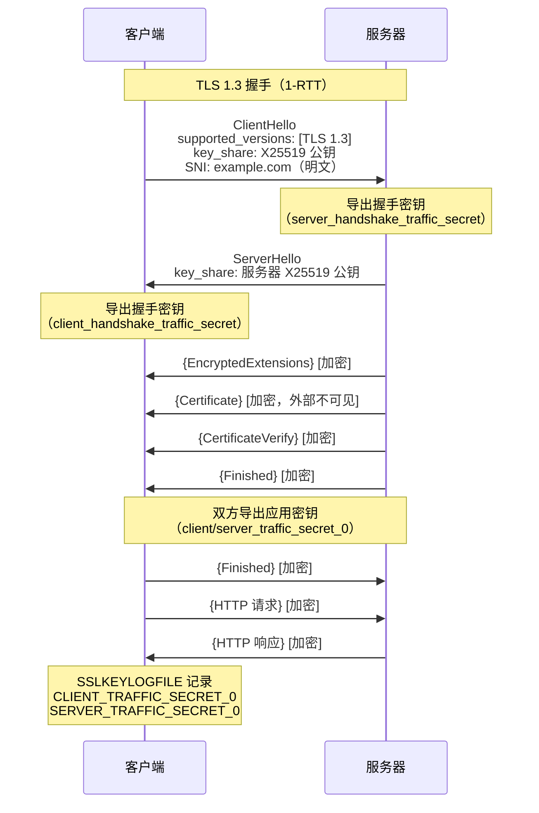

---
tags:
  - network
  - protocol-analysis
  - tier3
  - tls
  - sslkeylogfile
  - wireshark-decrypt
---
# TLS 握手与解密分析

> [!abstract] TL;DR
> TLS 1.3 将握手压缩为 1-RTT（ClientHello 直接携带 key_share），握手消息在 Finished 后即加密，无法从网络层观察证书。TLS 1.2 四步握手明文可见证书但支持 RSA 静态密钥解密。实战解密首选 SSLKEYLOGFILE：NSS 格式日志导出客户端侧会话密钥，Wireshark 导入即可解密，且不依赖服务器私钥，兼容 PFS（前向保密）。

## 概述与定位

TLS（Transport Layer Security）是 HTTPS、SMTPS、DoT 等协议的安全层。从抓包分析角度，TLS 带来了三个核心挑战：

1. **加密**：载荷不可见，需密钥才能解密
2. **握手复杂性**：TLS 1.2 和 1.3 握手流程差异显著
3. **前向保密（PFS）**：TLS 1.3 强制使用 ECDHE，服务器私钥泄露不能解密历史流量

**Wireshark TLS 解密的两种方式：**

| 方法 | 适用 TLS 版本 | 需要条件 | 缺点 |
|------|-------------|----------|------|
| 服务器 RSA 私钥 | TLS 1.2（无 PFS）| 持有服务器私钥 | 不支持 ECDHE/DHE（PFS）|
| SSLKEYLOGFILE | TLS 1.2 + 1.3 | 控制客户端进程 | 需在客户端配置环境变量 |

## 原理与机制

### TLS 1.2 握手详解（四次握手）

TLS 1.2 握手需要 2-RTT（不含 TCP 握手）：

```
客户端                            服务器
   │                                │
   │──── ClientHello ──────────────▶│  版本/随机数/密码套件列表/扩展
   │◀─── ServerHello ───────────────│  选定版本/随机数/选定密码套件
   │◀─── Certificate ───────────────│  服务器证书链（明文可见！）
   │◀─── ServerKeyExchange ─────────│  DHE/ECDHE 参数（若使用 PFS）
   │◀─── ServerHelloDone ───────────│
   │                                │
   │──── ClientKeyExchange ────────▶│  加密的 Pre-Master Secret（RSA）
   │                                │  或 ECDHE 客户端公钥
   │──── ChangeCipherSpec ─────────▶│  通知：后续启用加密
   │──── Finished ─────────────────▶│  首个加密消息（验证握手完整性）
   │◀─── ChangeCipherSpec ───────────│
   │◀─── Finished ───────────────────│
   │                                │
   │══════ 应用数据（加密） ════════│
```

**RSA 密钥交换（无 PFS）vs ECDHE（PFS）：**

- **RSA**：客户端生成 Pre-Master Secret，用服务器公钥加密后发送。持有私钥可解密历史流量
- **ECDHE**：双方各生成临时密钥对，通过 Diffie-Hellman 协商共享密钥。私钥不上网，历史流量安全

### TLS 1.3 握手详解（1-RTT）

TLS 1.3 将密钥交换合并入 Hello 消息，大幅减少往返：

```
客户端                            服务器
   │                                │
   │──── ClientHello ──────────────▶│  
   │     supported_versions: [1.3]  │
   │     key_share: X25519 公钥     │  ← 直接携带 ECDHE 公钥
   │     supported_groups: [x25519, │
   │       secp256r1, secp384r1]    │
   │     signature_algorithms: ...  │
   │     server_name: example.com   │  ← SNI 扩展（明文！）
   │     ....（其他扩展）           │
   │                                │
   │◀─── ServerHello ───────────────│  
   │     key_share: 服务器 X25519   │  ← 双方现在可导出握手密钥
   │◀─── {EncryptedExtensions} ─────│  ← 后续握手消息全部加密！
   │◀─── {Certificate} ─────────────│  证书在加密中，抓包不可见
   │◀─── {CertificateVerify} ───────│
   │◀─── {Finished} ────────────────│
   │                                │
   │──── {Finished} ───────────────▶│
   │══════ 应用数据（加密） ════════│
```

**TLS 1.3 的密钥派生（HKDF）：**

```
ECDHE 共享密钥
    │
    ▼ HKDF-Extract
Early Secret
    │
    ▼ Derive
Handshake Secret
    ├── client_handshake_traffic_secret
    └── server_handshake_traffic_secret
    │
    ▼ Derive
Master Secret
    ├── client_application_traffic_secret_0
    └── server_application_traffic_secret_0
```

### 前向保密（PFS，Perfect Forward Secrecy）

TLS 1.3 强制所有密码套件使用 ECDHE，临时私钥在握手后丢弃。即使攻击者：
1. 录制了所有加密流量
2. 之后获得了服务器私钥

也无法解密历史流量，因为 ECDHE 临时私钥已经不存在。

TLS 1.2 的 ECDHE 套件（如 `ECDHE-RSA-AES256-GCM-SHA384`）同样支持 PFS；不支持 PFS 的是纯 RSA 套件（如 `RSA-AES256-CBC-SHA`，TLS 1.3 已完全移除）。

## 结构/算法/伪代码详解

### SSLKEYLOGFILE 格式说明

NSS Key Log 格式（Chrome、Firefox、curl 等支持）每行记录一个密钥材料：

```
# TLS 1.2
CLIENT_RANDOM <client_random_hex> <master_secret_hex>

# TLS 1.3（每个流量方向各一行）
CLIENT_HANDSHAKE_TRAFFIC_SECRET <client_random_hex> <secret_hex>
SERVER_HANDSHAKE_TRAFFIC_SECRET <client_random_hex> <secret_hex>
CLIENT_TRAFFIC_SECRET_0 <client_random_hex> <secret_hex>
SERVER_TRAFFIC_SECRET_0 <client_random_hex> <secret_hex>

# TLS 1.3 密钥更新（0-RTT 或密钥轮换）
CLIENT_TRAFFIC_SECRET_1 <client_random_hex> <secret_hex>
```

各标签说明：

| 标签 | 用途 |
|------|------|
| `CLIENT_RANDOM` | TLS 1.2 主密钥（master secret） |
| `CLIENT_HANDSHAKE_TRAFFIC_SECRET` | TLS 1.3 客户端握手流量密钥 |
| `SERVER_HANDSHAKE_TRAFFIC_SECRET` | TLS 1.3 服务器握手流量密钥 |
| `CLIENT_TRAFFIC_SECRET_0` | TLS 1.3 客户端应用数据密钥（初始） |
| `SERVER_TRAFFIC_SECRET_0` | TLS 1.3 服务器应用数据密钥（初始） |
| `EARLY_TRAFFIC_SECRET` | TLS 1.3 0-RTT Early Data 密钥 |

### TLS 报文字段逐层解析

以 ClientHello 为例（TLS Record 层 → Handshake 层）：

```
TLS Record Layer:
  Content Type: 22 (Handshake)          ← 1 字节
  Version: 0x0301 (TLS 1.0)             ← 2 字节（历史兼容，实际版本在扩展中）
  Length: xxxx                           ← 2 字节

Handshake:
  Handshake Type: 1 (ClientHello)       ← 1 字节
  Length: xxxxxx                         ← 3 字节

ClientHello:
  Legacy Version: 0x0303 (TLS 1.2)     ← 2 字节（固定，实际版本在 supported_versions）
  Random: [32 bytes]                    ← 32 字节（client_random，SSLKEYLOGFILE 的索引键）
  Session ID Length: xx                 ← 1 字节
  Session ID: [variable]               ← 0-32 字节
  Cipher Suites Length: xxxx           ← 2 字节
  Cipher Suites: [list]                ← 每个 2 字节
  Compression Methods: 0x00            ← 1 字节（TLS 1.3 禁用压缩）
  Extensions Length: xxxx              ← 2 字节
  Extensions: [...]                    ← 各扩展
```

### TLS 扩展表

| 扩展类型 | 类型值 | 说明 |
|----------|--------|------|
| server_name (SNI) | 0x0000 | 目标域名，明文！抓包可见 |
| max_fragment_length | 0x0001 | 最大片段长度 |
| status_request (OCSP) | 0x0005 | 在线证书状态请求 |
| supported_groups | 0x000a | 支持的椭圆曲线组（x25519/P-256/P-384）|
| signature_algorithms | 0x000d | 支持的签名算法 |
| alpn | 0x0010 | 应用层协议协商（h2/http/1.1）|
| signed_cert_timestamp | 0x0012 | CT 签名时间戳 |
| extended_master_secret | 0x0017 | 增强主密钥派生 |
| session_ticket | 0x0023 | TLS 1.2 会话恢复票据 |
| supported_versions | 0x002b | 支持的 TLS 版本（TLS 1.3 核心扩展）|
| psk_key_exchange_modes | 0x002d | PSK 模式（TLS 1.3）|
| key_share | 0x0033 | ECDHE 密钥共享（TLS 1.3 核心）|
| pre_shared_key | 0x0029 | PSK 标识（TLS 1.3 0-RTT）|

## 工具视角与实战

### 配置 SSLKEYLOGFILE

**Chrome / Edge：**

```bash
# Linux/macOS
SSLKEYLOGFILE=/tmp/ssl_keys.log google-chrome --ssl-key-log-file=/tmp/ssl_keys.log

# Windows（PowerShell）
$env:SSLKEYLOGFILE = "C:\tmp\ssl_keys.log"
Start-Process "chrome.exe"

# 或者通过系统环境变量（持久化，所有支持 NSS 的程序均生效）
# Windows: 系统属性 → 高级 → 环境变量 → 新建 SSLKEYLOGFILE
```

**Firefox：**

```
about:config → 搜索 security.tls.loglevel
# 或者设置同名环境变量后重启 Firefox
SSLKEYLOGFILE=/tmp/ssl_keys.log firefox
```

**curl：**

```bash
curl --tls-max 1.3 \
     --tlsv1.3 \
     -v \
     https://example.com \
     --ssl-key-log-file /tmp/curl_keys.log
```

**Python（ssl 模块钩子）：**

```python
import ssl
import socket

def setup_keylog(keylog_file="/tmp/python_ssl.log"):
    """为 Python ssl 连接配置 SSLKEYLOGFILE"""
    ctx = ssl.create_default_context()
    
    # Python 3.8+ 支持 keylog_filename
    ctx.keylog_filename = keylog_file
    return ctx

# 使用示例
ctx = setup_keylog()
with socket.create_connection(("example.com", 443)) as sock:
    with ctx.wrap_socket(sock, server_hostname="example.com") as ssock:
        ssock.send(b"GET / HTTP/1.1\r\nHost: example.com\r\n\r\n")
        print(ssock.recv(4096))

# 对于 requests 库，通过 urllib3 注入
import urllib3
urllib3.util.ssl_.DEFAULT_CIPHERS = "..."
# 注：requests 不直接支持 keylog，推荐用 mitmproxy 替代
```

### Wireshark 配置 TLS 解密步骤

```
1. 打开捕获文件（或已有实时抓包）

2. 菜单：Edit → Preferences → Protocols → TLS
   （或在 TLS 帧上右键 → Protocol Preferences → TLS）

3. (Pre)-Master-Secret log filename → 浏览选择 ssl_keys.log

4. 若用 RSA 私钥（仅 TLS 1.2 无 PFS）：
   Edit → Preferences → Protocols → TLS → RSA keys list → Add
   填写: IP地址, 端口, 协议(http), 私钥文件路径, 密码

5. 点击 OK，Wireshark 自动尝试用密钥解密已捕获的包

6. 显示过滤器：http（若成功解密，HTTPS 流量现在显示为 HTTP）
```

验证是否解密成功的方法：在 TLS 数据包的 Packet Details 中，若看到 "Decrypted TLS" 层，说明解密成功。

## 安全性与正确使用

### 私钥泄露风险

SSLKEYLOGFILE 包含所有 TLS 会话的密钥材料，一旦泄露，对应时间段内的所有加密流量均可被解密：

- **文件权限**：`chmod 600 /tmp/ssl_keys.log`，仅当前用户可读
- **生命周期**：使用完毕立即删除，不要提交到代码仓库（`.gitignore` 中添加 `*.log`）
- **生产禁用**：绝对不在生产服务器上设置 `SSLKEYLOGFILE`，仅在本地开发/测试环境使用
- **隔离**：建议在虚拟机或容器中进行 TLS 调试，避免影响其他应用的密钥安全

### SSLKEYLOGFILE 的合规边界

- 只对**自己控制**的客户端进程设置密钥日志
- 不对第三方应用注入 NSS hook 导出其密钥（可能违反相关法律）
- 企业环境中，若需监控员工 HTTPS 流量，必须有明确的法律授权和员工知情同意

### CT（Certificate Transparency）与 HSTS/HPKP

- **CT（证书透明度）**：所有 CA 签发的证书必须提交到公开日志（CT Log），可用于检测未经授权的证书颁发。工具：https://crt.sh
- **HSTS（HTTP Strict Transport Security）**：通过响应头 `Strict-Transport-Security: max-age=31536000` 要求浏览器永远使用 HTTPS，防止 SSL strip 攻击
- **HPKP（HTTP Public Key Pinning，已废弃）**：固定证书公钥哈希，Chromium 已于 2018 年移除支持，但概念在移动端 App 中仍广泛使用

## 小结

- TLS 1.3 强制 1-RTT + ECDHE + 握手加密，抓包只能看到 SNI 和握手类型，证书不可见
- TLS 1.2 支持两种密钥交换：RSA（私钥可解密历史流量，无 PFS）和 ECDHE（PFS，私钥无法解历史流量）
- SSLKEYLOGFILE 是解密自己流量的黄金方案，兼容 TLS 1.2/1.3 和 PFS，Chrome/Firefox/curl/Python 均支持
- Wireshark 通过 `Preferences → TLS → (Pre)-Master-Secret log` 导入密钥文件，无需改动抓包流程
- 密钥日志文件属于高度敏感信息，需严格控制权限和生命周期

## 相关阅读

- RFC 8446：The Transport Layer Security (TLS) Protocol Version 1.3
- RFC 5246：The TLS Protocol Version 1.2（参考，已被 1.3 取代）
- NSS Key Log Format：https://firefox-source-docs.mozilla.org/security/nss/legacy/key_log_format/
- Wireshark TLS 解密指南：https://wiki.wireshark.org/TLS
- CT 证书查询：https://crt.sh



[[00.抓包与协议分析实战总览|⬆ 系列总览]] | [[04.HTTP与HTTPS抓包与中间人分析|← 上一章]] | [[06.自定义协议逆向分析|→ 下一章]]
