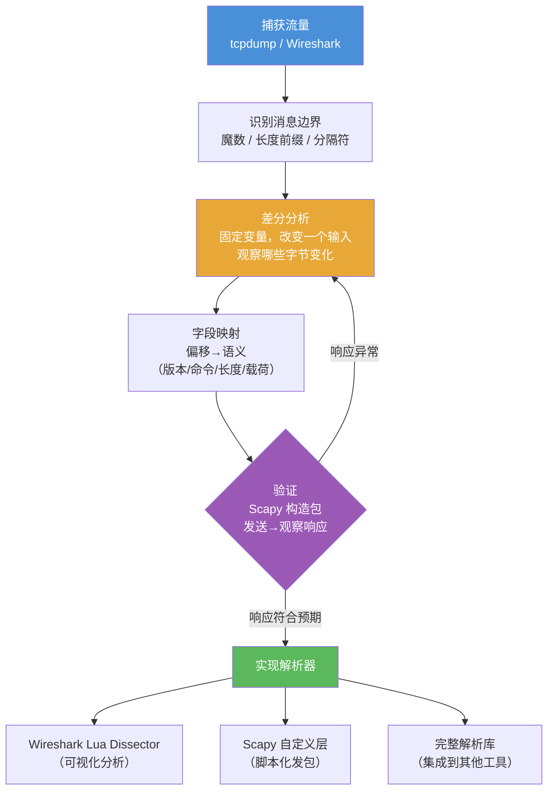

---
tags:
  - network
  - protocol-analysis
  - tier3
  - protocol-reversing
  - scapy
  - lua-dissector
---
# 自定义协议逆向分析

> [!abstract] TL;DR
> 私有协议逆向的核心方法论是**差分分析**：固定其他变量，只改变一个输入，观察哪些字节随之变化，从而推断字段边界和含义。识别协议结构后，用 Wireshark Lua dissector 将字节解析为可读字段，用 Scapy 自定义层复现和发送协议包。整个过程遵循：捕获→识别边界→字段映射→验证→实现解析器五步闭环。

## 概述与定位

私有（私有/专有）协议逆向分析的主要应用场景：

| 场景 | 目的 |
|------|------|
| IoT 设备固件分析 | 理解设备通信协议，发现安全漏洞 |
| 游戏客户端分析 | 理解游戏协议，安全研究（不用于作弊）|
| 企业软件互操作 | 为遗留系统实现开源客户端 |
| 工控系统（ICS/SCADA）| 解析 Modbus/DNP3 等工业协议 |
| 恶意软件 C2 分析 | 识别命令与控制协议，提取 IoC |
| 安全测试（授权范围内）| 模糊测试自定义协议寻找漏洞 |

## 原理与机制

### 字段边界识别方法论

逆向一个未知协议，首要任务是**切割**——把连续字节流切成语义独立的字段。以下是系统化的识别方法：

**1. 长度前缀（Length-prefixed）**

最常见的二进制协议边界模式：消息开头有固定字节数表示后续数据长度。

```
[ 4字节 长度 ][ N字节 载荷 ]
  00 00 00 2A    ... (42字节数据) ...
```

识别技巧：发送不同长度的消息，观察前几个字节是否等于消息体长度。注意字节序（大端/小端）和长度语义（是否包含头部本身）。

**2. 魔数（Magic Number）**

协议以固定字节序列开头，用于同步或识别协议类型：

```
0xCAFEBABE  Java class file
0x504B0304  ZIP 文件（PK..)
0xDEADBEEF  某些私有协议头
```

**3. 固定偏移字段**

版本号、命令码、序列号通常在固定偏移位置，值域有限（容易识别）。

**4. 校验和/CRC**

消息末尾（或固定偏移处）有校验字段：修改单个字节后，某个固定位置的值也随之变化，但非线性变化。可通过 CRC 反向计算验证。

**5. 熵分析（Entropy Analysis）**

通过分析每个字节区域的香农熵来判断数据性质：
- **高熵区域（H≈8 bits/byte）**：通常是加密或压缩数据，字节分布接近均匀，无规律可循
- **低熵区域（H接近0）**：全零填充、固定魔数、版本号等常量字段
- **中等熵区域**：ASCII 文本（英文约 4-5 bits/byte）、人类可读的结构化数据

`binwalk -E firmware.bin` 输出熵曲线图：水平段（熵突变为高）往往对应加密/压缩块的起止边界。这在固件逆向中尤其有用，可以直接定位加密固件区段和明文配置区段的边界。

**6. 差分分析（Differential Analysis）**

差分分析的核心思想：**控制变量，观察变化**。

```
步骤一：基线捕获
  操作: 登录用户 "alice"，密码 "pass123"
  包: AA BB CC 00 05 61 6C 69 63 65  [CRC]
            
步骤二：改变用户名长度
  操作: 登录用户 "bob"，密码 "pass123"  
  包: AA BB CC 00 03 62 6F 62  [CRC]
            │     └── "bob" ASCII
            └── 长度从 05 变为 03 → 偏移3是用户名长度字段

步骤三：改变密码
  操作: 登录用户 "alice"，密码 "xyz"
  包: AA BB CC 00 05 61 6C 69 63 65 00 03 78 79 7A  [CRC]
                                     │     └── "xyz" ASCII
                                     └── 密码长度字段
```

差分分析的精髓在于系统性：每次只改变**一个**输入变量，记录对应的字节变化。多次实验后，可以建立输入→字节位置的映射表。对于序列号、时间戳等自动递增字段，连续多次捕获相同操作的数据包，观察哪些字节在递增，也是识别这类字段的手段。

**7. 状态机恢复**

复杂协议往往有状态机：客户端必须按特定顺序发送消息才能完成操作。从多次会话的捕获数据中重建状态机：
- 识别每类消息的"类型"字段（命令码）
- 观察消息序列：哪些消息总是在某条消息之后出现
- 构建状态转换图：状态（如"未认证""已认证""数据传输中"）+ 转换（消息类型触发）+ 动作

工具提示：可以用 Wireshark 的 I/O Graph 按消息类型字段过滤，时间轴上可视化消息顺序；tshark 脚本可以提取消息序列生成 CSV，再用 Python 自动化构建状态转换频率矩阵。

### 模糊输入变量（Fuzzing）

在已知字段含义后，对长度字段、命令码字段进行模糊测试，寻找解析异常：

```python
# 简单长度字段 fuzzer
import socket, struct

TARGET = ("192.168.1.100", 9000)
MAGIC = b'\xCA\xFE\xBA\xBE'

for length in [0, 1, 100, 0xFFFF, 0xFFFFFF, -1]:
    try:
        s = socket.socket()
        s.connect(TARGET)
        # 发送畸形长度
        pkt = MAGIC + struct.pack('>I', length & 0xFFFFFFFF) + b'A' * 10
        s.send(pkt)
        resp = s.recv(1024)
        print(f"len={length}: {resp.hex()}")
        s.close()
    except Exception as e:
        print(f"len={length}: ERROR {e}")
```

### 主动探测辅助逆向

有时通过抓包被动观察不够，主动向目标发送畸形或变异数据包并观察反应，能更快揭示协议结构：

- **输入变异（Mutation Fuzzing）**：以已知的有效数据包为模板，随机变异单个字段或字节，观察服务器是否崩溃/返回不同错误码
- **枚举命令码**：对命令码字段遍历 0x00-0xFF，观察服务器对未知命令的响应（有些会返回"不支持的命令"错误，间接揭示已知命令列表）
- **探测分隔符**：对字符串字段发送各种特殊字节（`\x00`、`\n`、`\r\n`）观察是否触发不同行为，推断字符串边界机制

注意：主动探测会产生异常流量，可能触发目标的 IDS 告警或自保机制。只在**自有/授权**目标上进行。

## 结构/算法/伪代码详解

### 协议逆向完整五步流程

```
步骤1: 捕获流量
  ├── tcpdump/Wireshark 抓取目标程序的网络通信
  ├── 记录不同操作对应的数据包
  └── 区分 TCP 流（Follow TCP Stream 获取原始字节）

步骤2: 识别边界
  ├── 观察 TCP 流中消息的起止边界
  ├── 寻找魔数/分隔符/长度前缀
  └── 确认消息是否有固定头部结构

步骤3: 字段映射（差分分析）
  ├── 针对已知操作（登录/查询/心跳）反复捕获
  ├── 逐字节对比不同消息，标注变化/不变字段
  └── 结合应用行为推断字段语义

步骤4: 验证
  ├── 用 Scapy 或 socket 手工构造协议包
  ├── 发送到服务器，观察响应是否符合预期
  └── 尝试修改字段值验证其含义

步骤5: 实现解析器
  ├── Wireshark Lua dissector（可视化分析）
  ├── Scapy 自定义层（脚本化发包/接收）
  └── 完整解析库（供其他程序调用）
```

### Lua Dissector 编写要点与完整示例

Lua dissector 的工作原理：Wireshark 将每帧的 TCP payload（已重组的字节序列）传给 dissector，dissector 通过 `buffer(offset, length)` 访问字节，通过 `tree:add(field, buffer(offset, length))` 向解析树添加字段，通过 `pinfo.cols.protocol` 和 `pinfo.cols.info` 设置 Packet List 的显示列。

关键要素：
- **字段注册（ProtoField）**：在文件顶层声明所有字段，类型包括 `uint8/uint16/uint32`、`bytes`、`string` 等，支持值映射表（enum_table）
- **子树（subtree）**：`tree:add(proto, buffer())` 创建一个可折叠节点，子字段挂在其下
- **启发式检测**：用 `register_heuristic()` 注册基于 payload 内容的自动识别函数，当已知端口无法匹配时自动尝试

目标协议假设格式：

```
[魔数 2B: 0xCAFE][版本 1B][命令 1B][长度 2B][载荷 N B][CRC32 4B]
```

```lua
-- myproto.lua
-- 放置于 ~/.config/wireshark/plugins/ 或 Wireshark 插件目录

-- 声明协议
local myproto = Proto("myproto", "My Custom Protocol")

-- 声明协议字段
local f_magic   = ProtoField.uint16("myproto.magic",   "Magic",   base.HEX)
local f_version = ProtoField.uint8 ("myproto.version", "Version", base.DEC)
local f_cmd     = ProtoField.uint8 ("myproto.cmd",     "Command", base.HEX,
    {[0x01]="LOGIN", [0x02]="QUERY", [0x03]="HEARTBEAT", [0xFF]="ERROR"})
local f_len     = ProtoField.uint16("myproto.length",  "Length",  base.DEC)
local f_payload = ProtoField.bytes ("myproto.payload", "Payload")
local f_crc     = ProtoField.uint32("myproto.crc",     "CRC32",   base.HEX)

myproto.fields = {f_magic, f_version, f_cmd, f_len, f_payload, f_crc}

-- 解析函数
function myproto.dissector(buffer, pinfo, tree)
    -- 最小包长度检查
    if buffer:len() < 10 then return end
    
    -- 魔数检查
    local magic = buffer(0, 2):uint()
    if magic ~= 0xCAFE then return end
    
    -- 设置协议列信息
    pinfo.cols.protocol = "MYPROTO"
    
    -- 构建协议树
    local subtree = tree:add(myproto, buffer(), "My Custom Protocol")
    
    subtree:add(f_magic,   buffer(0, 2))
    subtree:add(f_version, buffer(2, 1))
    
    local cmd = buffer(3, 1):uint()
    subtree:add(f_cmd, buffer(3, 1))
    
    local payload_len = buffer(4, 2):uint()
    subtree:add(f_len, buffer(4, 2))
    
    if buffer:len() >= 6 + payload_len + 4 then
        subtree:add(f_payload, buffer(6, payload_len))
        subtree:add(f_crc, buffer(6 + payload_len, 4))
    end
    
    -- 设置 Info 列显示
    local cmd_name = ({[0x01]="LOGIN", [0x02]="QUERY",
                       [0x03]="HEARTBEAT", [0xFF]="ERROR"})[cmd] or
                     string.format("CMD:0x%02X", cmd)
    pinfo.cols.info = string.format("%s len=%d", cmd_name, payload_len)
end

-- 注册到 TCP 端口 9000
local tcp_port = DissectorTable.get("tcp.port")
tcp_port:add(9000, myproto)

-- 也可以用 heuristic 自动识别（基于魔数）
local function heuristic_check(buffer, pinfo, tree)
    if buffer:len() < 2 then return false end
    if buffer(0, 2):uint() ~= 0xCAFE then return false end
    myproto.dissector(buffer, pinfo, tree)
    return true
end
myproto:register_heuristic("tcp", heuristic_check)
```

### Kaitai Struct 声明式协议描述

Kaitai Struct 是一种用 YAML 声明协议结构的工具，可以从单一 `.ksy` 文件生成多种语言（Python、Java、C++、JavaScript 等）的解析器：

```yaml
# myproto.ksy
meta:
  id: myproto
  file-extension: bin
  endian: be

seq:
  - id: magic
    type: u2
    valid: 0xCAFE
    doc: "魔数，固定为 0xCAFE"
  - id: version
    type: u1
  - id: cmd
    type: u1
    enum: command_type
  - id: payload_len
    type: u2
  - id: payload
    size: payload_len
  - id: crc32
    type: u4

enums:
  command_type:
    0x01: login
    0x02: query
    0x03: heartbeat
    0xff: error
```

```bash
# 编译生成 Python 解析器
kaitai-struct-compiler --target python myproto.ksy

# 生成 Wireshark Lua dissector（实验性支持）
kaitai-struct-compiler --target wireshark_lua myproto.ksy
```

Kaitai 的优势在于：一份描述文件，多语言复用；支持条件字段（`if` 表达式）、循环结构（`repeat-until`）、引用其他类型（`type: some_other_type`），适合描述复杂嵌套协议。

### Scapy 自定义层示例

```python
from scapy.all import *
from scapy.fields import *
import struct, binascii

class MyProto(Packet):
    """自定义协议 Scapy 层"""
    name = "MyProto"
    fields_desc = [
        XShortField("magic",   0xCAFE),
        ByteField("version",   1),
        ByteEnumField("cmd",   0x01, {
            0x01: "LOGIN",
            0x02: "QUERY",
            0x03: "HEARTBEAT",
            0xFF: "ERROR"
        }),
        FieldLenField("length", None, length_of="payload", fmt="H"),
        StrLenField("payload", b"", length_from=lambda p: p.length),
        XIntField("crc", 0),
    ]
    
    def post_build(self, pkt, pay):
        """自动计算 CRC32"""
        # CRC 覆盖除最后4字节（CRC本身）之外的所有字段
        crc_data = pkt[:-4]
        crc_val = binascii.crc32(crc_data) & 0xFFFFFFFF
        pkt = pkt[:-4] + struct.pack(">I", crc_val)
        return pkt + pay

# 注册绑定：TCP 9000 端口的载荷 → MyProto
bind_layers(TCP, MyProto, dport=9000)
bind_layers(TCP, MyProto, sport=9000)

# 发送一个 LOGIN 请求
def send_login(target_ip, username, password):
    payload = struct.pack(">B", len(username)) + username.encode()
    payload += struct.pack(">B", len(password)) + password.encode()
    
    pkt = IP(dst=target_ip) / TCP(dport=9000, flags="PA") / \
          MyProto(cmd=0x01, payload=payload)
    
    resp = sr1(pkt, timeout=3)
    if resp:
        resp.show()
    return resp

# 从 pcap 文件中解析自定义协议
def analyze_pcap(filename):
    packets = rdpcap(filename)
    for pkt in packets:
        if pkt.haslayer(TCP) and (pkt[TCP].dport == 9000 or pkt[TCP].sport == 9000):
            if len(pkt[TCP].payload) > 2:
                raw = bytes(pkt[TCP].payload)
                if raw[:2] == b'\xCA\xFE':
                    mp = MyProto(raw)
                    print(f"Cmd: {mp.cmd}, Len: {mp.length}, "
                          f"Payload: {mp.payload.hex()}")

# 保存构造的包到 pcap
pkts = [
    IP(dst="192.168.1.100") / TCP(dport=9000) / MyProto(cmd=0x03, payload=b""),
    IP(dst="192.168.1.100") / TCP(dport=9000) / MyProto(cmd=0x01, payload=b"\x05alice\x06pass123"),
]
wrpcap("/tmp/myproto_test.pcap", pkts)
```

## 工具视角与实战

### binwalk 字节模式识别与熵分析

```bash
# 扫描二进制文件，识别已知文件格式特征
binwalk firmware.bin

# 提取所有识别到的文件
binwalk -e firmware.bin

# 只搜索特定特征（如 TLS 证书）
binwalk -R "\x30\x82" firmware.bin  # DER 编码证书头

# 熵分析（高熵区域通常是加密/压缩数据）
binwalk -E firmware.bin
```

熵分析技巧：在 binwalk 的熵折线图中，熵值从 ~4 bits（低熵，如 ASCII 文本）骤升至 ~8 bits（高熵）的边界，通常是加密/压缩数据块的起点；骤降则是块的终点或另一种低熵结构的起点。识别这些边界后，配合 `binwalk -R` 在边界附近搜索已知的文件头，可以快速定位内嵌的可执行文件、压缩包或证书。

### 010 Editor 模板

010 Editor 支持用模板语言（类 C 语法）解析二进制格式：

```c
// MyProto.bt - 010 Editor 模板

typedef struct {
    uint16 magic  <format=hex, comment="Must be 0xCAFE">;
    uint8  version;
    uint8  cmd    <comment=EnumCmd(this)>;
    uint16 length;
    uchar  payload[length];
    uint32 crc    <format=hex>;
} MyProtoPacket;

string EnumCmd(uint8 cmd) {
    switch (cmd) {
        case 0x01: return "LOGIN";
        case 0x02: return "QUERY";
        case 0x03: return "HEARTBEAT";
        default:   return Str("UNKNOWN(0x%02X)", cmd);
    }
}

// 解析连续的多个包
while (!FEof()) {
    MyProtoPacket packet;
}
```

### Wireshark Follow Stream 提取二进制

```bash
# 通过 tshark 提取 TCP 流的原始字节
tshark -r capture.pcap \
  -z "follow,tcp,raw,0" \
  -q | xxd | head -100

# 或者提取为十六进制，保存到文件
tshark -r capture.pcap \
  -Y 'tcp.stream eq 0' \
  -T fields \
  -e tcp.payload \
  | tr -d '\n' | xxd -r -p > /tmp/stream0.bin
```

### hexdump 快速查看

```bash
# 标准 hexdump，16字节每行
hexdump -C /tmp/stream0.bin | head -50

# 仅显示 ASCII 可打印字符
strings /tmp/stream0.bin

# xxd 格式（可编辑后用 xxd -r 还原）
xxd /tmp/stream0.bin > /tmp/stream0.hex
# 修改 hex 文件后还原
xxd -r /tmp/stream0.hex > /tmp/modified.bin
```

## 安全性与正确使用

### 合规边界——仅对自有/授权系统逆向分析

协议逆向工程在不同司法管辖区的合法性差异很大：

- **DMCA（美国）**：1201 条款禁止规避"有效的技术保护措施"，但安全研究豁免条款（Security Research Exemption）允许出于安全研究目的的逆向工程
- **CFAA（美国）**：未授权访问计算机系统属于违法，即使只是观察流量
- **中国《网络安全法》**：未经授权的漏洞挖掘和系统测试受限
- **欧盟软件指令（Directive 2009/24/EC）**：允许为实现互操作性（interoperability）而进行逆向工程

**无论是流量捕获、差分分析、主动探测还是模糊测试，都必须仅对自有系统或有明确书面授权的目标进行。对未经授权的系统发送构造数据包、进行模糊测试，可能构成非法入侵行为。**

**安全操作原则：**

```
✅ 允许：
- 对自己开发的系统进行协议分析
- 在 Bug Bounty 计划授权范围内测试
- 在学术研究且不公开利用漏洞的前提下分析
- 分析无加密保护的协议（如明文工控协议）

❌ 禁止：
- 对不拥有权限的系统进行未授权访问
- 利用发现的漏洞进行攻击
- 将逆向成果用于规避 DRM 获取未授权内容
- 对生产系统进行未经书面许可的模糊测试
```

## 小结

- 字段边界识别的核心方法论是差分分析（控制变量观察字节变化）、熵分析（高熵=加密/压缩）、长度前缀推断；三者结合可系统化地拆解未知协议
- 状态机恢复从多次会话的消息序列中归纳协议行为模型，是理解复杂协议的关键
- Wireshark Lua dissector 编写的核心要素：ProtoField 注册、buffer 访问、subtree 构建、heuristic 检测
- Kaitai Struct 提供声明式协议描述，一份 .ksy 文件可生成多语言解析器
- Scapy 自定义层提供了 Python 原生的协议构造、发送、解析能力，与 Wireshark 互补
- 010 Editor 模板适合对单个二进制文件做静态解析，binwalk 熵分析适合固件中的结构定位
- 协议逆向、主动探测和模糊测试必须严格限定在自有或明确授权的目标范围内，不得对非授权系统执行

## 相关阅读

- Wireshark Lua 解析器开发指南：https://wiki.wireshark.org/LuaAPI
- Scapy 官方文档：https://scapy.readthedocs.io/
- 010 Editor 模板语法：https://www.sweetscape.com/010editor/manual/
- 《The Art of Network Protocol Reverse Engineering》— ERNW Research
- binwalk GitHub：https://github.com/ReFirmLabs/binwalk
- Kaitai Struct 官网：https://kaitai.io/



[[00.抓包与协议分析实战总览|⬆ 系列总览]] | [[05.TLS握手与解密分析|← 上一章]] | [[07.WebSocket与HTTP2分析|→ 下一章]]
