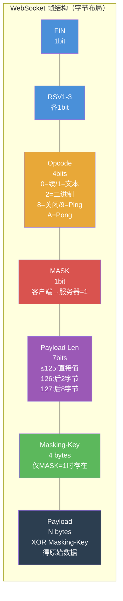

---
tags:
  - network
  - protocol-analysis
  - tier3
  - websocket
  - http2
  - hpack
---
# WebSocket 与 HTTP/2 分析

> [!abstract] TL;DR
> WebSocket 和 HTTP/2 都在 HTTP 生命周期内"升级"为新协议，给抓包工具带来特殊挑战。WebSocket 帧带掩码（MASK），客户端发出的数据必须用 Masking-Key 做 XOR 才能读取；HTTP/2 使用 HPACK 头部压缩（静态表 61 条 + 动态表），头部字段不再以明文字符串出现。Wireshark 能自动识别两者并解析帧结构，HTTPS 版本同样需要 SSLKEYLOGFILE 解密 TLS 层。

## 概述与定位

**WebSocket** 和 **HTTP/2** 对抓包的特殊挑战：

| 协议 | 挑战 | Wireshark 支持 |
|------|------|--------------|
| WebSocket（明文） | 客户端→服务器帧带 MASK | 自动解掩码，显示原始载荷 |
| WebSocket over TLS | 需先解密 TLS | 配合 SSLKEYLOGFILE |
| HTTP/2（h2，TLS）| HPACK 压缩头部 | 自动解压，需先解密 TLS |
| HTTP/2（h2c，明文）| HPACK 压缩（但明文传输）| 自动解析 |
| HTTP/3（QUIC）| UDP + TLS 1.3，QPACK 压缩 | Wireshark 4.x 支持，需密钥 |

### HTTP/3 与 QUIC（详见第 14 章）

HTTP/3 基于 QUIC 协议（over UDP）运行，传输层内置 TLS 1.3 加密，使用 QPACK 进行头部压缩。由于 QUIC 运行在 UDP 之上，抓包与解密流程和 TCP-based 协议有本质区别，帧结构也完全不同——具体的抓包方法、密钥导出、QPACK 解码及帧分析详见 [[14.HTTP3与QUIC抓包解密]]。

**与 HTTP/1.1 的关键差异：**
- WebSocket：持久化全双工，帧级别数据而非请求/响应
- HTTP/2：多路复用流（stream），流 ID 区分并发请求，头部压缩减少冗余

## 原理与机制

### WebSocket 掩码为何强制——防中间设备缓存投毒

WebSocket RFC 6455 明确要求：**客户端发送到服务器的所有帧必须掩码（MASK=1）**，而服务器发送到客户端的帧不得掩码（MASK=0）。这个看似不对称的设计背后有一段有趣的安全历史。

WebSocket 掩码的设计目的**不是加密**（XOR 掩码不提供任何保密性，因为 Masking-Key 就在帧头明文传输），而是**防止中间设备（透明代理/缓存）被投毒**。2011 年安全研究人员发现，恶意 JavaScript 代码可以通过如下路径攻击企业内网：

1. 恶意网页在浏览器中用 WebSocket 连接到目标 IP（如内网服务器）
2. 由于没有 CORS 对原始套接字的限制，连接可以发出任意字节序列
3. 如果字节序列被设计成看起来像 HTTP 请求（如 `GET /malicious HTTP/1.0\r\n\r\n`），则透明 HTTP 缓存/代理会把它误解为 HTTP 请求
4. 缓存可能用恶意内容"毒化"合法 URL 的缓存条目

强制 XOR 掩码的效果：用随机 Masking-Key 掩码后，`GET /` 等 HTTP 方法的 ASCII 字节被随机化，中间设备无法把 WebSocket 流量误解为 HTTP 请求。服务器到客户端方向的帧不强制掩码，因为服务器是可信端，不存在注入风险。

### WebSocket 分片机制

单个 WebSocket 消息可以被分割成多个帧传输（类似 TCP 分片，但在 WebSocket 层面）：

- **第一帧**：FIN=0，Opcode=消息类型（1=文本/2=二进制）
- **中间帧**：FIN=0，Opcode=0（续帧，Continuation）
- **最后一帧**：FIN=1，Opcode=0（续帧），标志消息结束

分片的典型用途：发送大型消息时，发送方不需要提前知道总长度，可以流式发送。Wireshark 能识别分片消息并在显示时合并——在 Packet Details 中会看到 `[Reassembled WebSocket message]` 节点。

**注意边界**：控制帧（Opcode 8-10：Close/Ping/Pong）**不能被分片**，必须在单帧内完成。这意味着控制帧的 payload 长度不能超过 125 字节（7 位 payload length 字段最大直接表示值）。

### WebSocket 帧格式（RFC 6455）

WebSocket 在 HTTP 握手（101 Switching Protocols）后启动，共享同一 TCP 连接：

```
客户端:  GET /ws HTTP/1.1
         Upgrade: websocket
         Connection: Upgrade
         Sec-WebSocket-Key: dGhlIHNhbXBsZSBub25jZQ==
         Sec-WebSocket-Version: 13

服务器:  HTTP/1.1 101 Switching Protocols
         Upgrade: websocket
         Connection: Upgrade
         Sec-WebSocket-Accept: s3pPLMBiTxaQ9kYGzzhZRbK+xOo=
```

`Sec-WebSocket-Accept` 的计算方式：`Base64(SHA1(Sec-WebSocket-Key + "258EAFA5-E914-47DA-95CA-C5AB0DC85B11"))`，用于防止非 WebSocket 客户端意外触发升级（服务器必须知道这个固定 GUID）。

**WebSocket 帧结构（字节级）：**

```
 0                   1                   2                   3
 0 1 2 3 4 5 6 7 8 9 0 1 2 3 4 5 6 7 8 9 0 1 2 3 4 5 6 7 8 9 0 1
├─┼─┼─┼─┼─────────┼─┼─────────────────────────────────────────────┤
│F│R│R│R│ Opcode  │M│         Payload Length (7/16/64 bits)       │
│I│S│S│S│(4 bits) │A│                                             │
│N│V│V│V│         │S│                                             │
│ │1│2│3│         │K│                                             │
└─┴─┴─┴─┴─────────┴─┴─────────────────────────────────────────────┘
```

**字段说明：**

| 字段 | 大小 | 含义 |
|------|------|------|
| FIN | 1 bit | 1=最后一帧（分片消息的最后一片）|
| RSV1/RSV2/RSV3 | 各 1 bit | 保留位，扩展使用（如 permessage-deflate 压缩用 RSV1）|
| Opcode | 4 bits | 帧类型（见下表）|
| MASK | 1 bit | 1=载荷已掩码（客户端→服务器必须为 1）|
| Payload Length | 7/7+16/7+64 bits | 载荷长度（0-125 直接表示；126=后两字节为长度；127=后八字节）|
| Masking-Key | 4 bytes | 仅在 MASK=1 时存在，用于 XOR 解码 |
| Payload Data | 可变 | 实际数据（若有 MASK，需与 Masking-Key XOR 后才是明文）|

**Opcode 表：**

| Opcode | 十六进制 | 类型 | 含义 |
|--------|----------|------|------|
| 0 | 0x0 | 数据帧 | 续帧（分片消息中间帧）|
| 1 | 0x1 | 数据帧 | 文本帧（UTF-8 文本）|
| 2 | 0x2 | 数据帧 | 二进制帧 |
| 3-7 | 0x3-0x7 | — | 保留（数据帧）|
| 8 | 0x8 | 控制帧 | 关闭（可带关闭码和原因）|
| 9 | 0x9 | 控制帧 | Ping |
| 10 | 0xA | 控制帧 | Pong（响应 Ping）|
| 11-15 | 0xB-0xF | — | 保留（控制帧）|

**掩码解码：**

```python
def unmask(payload: bytes, masking_key: bytes) -> bytes:
    """WebSocket 掩码是简单的 XOR：payload[i] ^ masking_key[i % 4]"""
    return bytes(payload[i] ^ masking_key[i % 4] for i in range(len(payload)))
```

### HTTP/2 HPACK——静态表、动态表与 Huffman 编码

HPACK（RFC 7541）是 HTTP/2 的头部压缩机制，彻底改变了头部字段在网络上的传输方式，使得明文字符串不再出现。这对抓包分析有显著影响：在未解密的 HTTP/2 流量中，即使能看到明文帧，也需要理解 HPACK 才能解析出 `:method: GET` 这样的头部。

**静态表（61 条，固定不变，双方各持一份副本）**

静态表收录了最高频的 61 个 header 字段+值组合，索引 1-61，在 HPACK 编码中用 1 字节就能表示（因为整数用变长编码，1 字节可以表示 0-127）：

| 索引 | 头部名 | 头部值 |
|------|--------|--------|
| 1 | `:authority` | — |
| 2 | `:method` | `GET` |
| 3 | `:method` | `POST` |
| 4 | `:path` | `/` |
| 5 | `:path` | `/index.html` |
| 6 | `:scheme` | `http` |
| 7 | `:scheme` | `https` |
| 8 | `:status` | `200` |
| 13 | `:status` | `404` |
| 14 | `:status` | `500` |
| 23 | `cache-control` | — |
| 25 | `content-encoding` | — |
| 27 | `content-type` | — |
| 32 | `host` | — |
| 58 | `user-agent` | — |
| 61 | `www-authenticate` | — |

**动态表（Dynamic Table）**

动态表是 HPACK 的运行时状态，按 LIFO（后进先出）顺序维护历史头部条目。索引从 62 开始，接续静态表末尾。`SETTINGS_HEADER_TABLE_SIZE`（HTTP/2 SETTINGS 帧中的参数）控制动态表最大占用字节数，默认 4096 字节。

当一个头部字段（名+值）被以"增量索引（Literal with Incremental Indexing）"方式发送时，它被加入动态表，后续请求可以用单个索引引用它。典型例子是 `user-agent` 头：第一个请求用字面量发送完整的 UA 字符串（可能 100+ 字节），同时加入动态表；后续所有请求只需 1-2 字节的索引来引用——这就是 HTTP/2 为什么能把头部压缩到几分之一的原因。

**三种编码形式**：

```
1. 完全索引（Indexed Header Field）：
   ┌─┬───────────┐
   │1│  Index    │  1字节，直接引用静态/动态表中的完整条目
   └─┴───────────┘

2. 增量索引（Literal with Incremental Indexing）：
   ┌─┬─┬───────────┐
   │0│1│  Index    │  引用名字，值用字面量，并将条目加入动态表
   └─┴─┴───────────┘
   + 值（Huffman 编码或原始字节串）

3. 不加索引字面量（Literal without Indexing）：
   ┌─┬─┬─┬─┬───────┐
   │0│0│0│0│ Index │  引用名字，值字面量，不加入动态表
   └─┴─┴─┴─┴───────┘  （敏感头部如 Cookie 通常用此形式）
```

第三种"Never Indexed"变体（前缀为 `0001`）更进一步：它明确告知中间节点此头部字段永远不加入任何动态表，防止基于压缩侧信道的攻击（类似 CRIME/BREACH——压缩率泄露被猜中的 secret 信息）。敏感头部如 `Cookie`、CSRF Token 应使用此编码。

**Huffman 编码**：HPACK 内置了一张固定的 Huffman 码表（根据 HTTP 流量中字节频率统计得到），对常见字节（如 ASCII 字母）用较短的码字，平均可把字符串长度再压缩约 30%。Huffman 编码是可选的（由发送方决定是否使用），但实现中几乎总是启用。

### HTTP/2 流多路复用如何消除队头阻塞

HTTP/1.1 的一个根本性限制是**队头阻塞（Head-of-Line Blocking）**：同一 TCP 连接上的请求必须严格有序（请求→响应→请求→响应...），即使后一个请求的数据已经准备好，也必须等前一个响应完成。浏览器通过同时建立 6-8 个 TCP 连接来缓解这个问题，但这带来了 TCP 握手开销和资源消耗。

HTTP/2 的**流（stream）多路复用**从协议层面解决了这个问题：

- 每个 HTTP 请求/响应被分配一个**流 ID（stream identifier）**：客户端发起的流用奇数 ID（1, 3, 5...），服务器推送用偶数 ID（2, 4, 6...）
- 同一 TCP 连接上可以同时有**多个活跃的流**，每个流的 HEADERS/DATA 帧交错传输
- 响应的到达**不需要按请求顺序**——流 3 的响应可以在流 1 的响应之前返回

但 HTTP/2 的多路复用只消除了**应用层**的队头阻塞。在 TCP 层，仍然是顺序字节流：如果某个 TCP 段丢失，后续所有字节（包括其他流的数据）都会被缓冲等待重传，所有流都被阻塞。HTTP/3（QUIC）在 UDP 上实现多路复用，丢包只影响该流，彻底解决了这个问题。

**流优先级和依赖树（RFC 7540，已废弃）**：HTTP/2 原有一套复杂的优先级机制（`PRIORITY` 帧和 `HEADERS` 帧的优先级字段），允许指定流间的依赖关系和权重，服务器据此安排帧的发送顺序。但在实践中这套机制实现差异大、收益有限，RFC 9218 提出了全新的 Extensible Prioritization Scheme，HTTP/2 的优先级字段在实践中已基本被忽略。

**流量控制窗口**：HTTP/2 在连接级和流级各有独立的流量控制窗口。接收方通过 `WINDOW_UPDATE` 帧通知发送方可以再发多少字节。初始窗口大小默认 65535 字节（16 位）。这意味着即使有多路复用，如果接收方处理速度跟不上，发送方也会被反压停止——在 Wireshark 中可以观察到 `http2.window_update` 帧频繁出现时，往往是性能瓶颈的信号。

### h2c（明文升级）与抓包可见性

h2c 是 HTTP/2 在非 TLS TCP 上运行的变体，通过 HTTP/1.1 的 `Upgrade` 机制协商：

```http
GET / HTTP/1.1
Host: example.com
Connection: Upgrade, HTTP2-Settings
Upgrade: h2c
HTTP2-Settings: AAMAAABkAAQAAP__
```

`HTTP2-Settings` 字段包含 Base64url 编码的 SETTINGS 帧内容，告知服务器客户端的初始参数（最大帧大小、初始窗口等）。服务器若支持 h2c，回复 `101 Switching Protocols`，后续通信切换为 HTTP/2 二进制帧。

从抓包可见性角度，h2c 比 h2（over TLS）**更容易分析**：所有 HEADERS/DATA 帧都是明文，Wireshark 的 http2 dissector 直接解析，无需密钥。但 h2c 在公网几乎不使用（主要用于内网服务间通信或 localhost），主流浏览器只支持 h2（over TLS）。

另一种获取 HTTP/2 连接而不经过 Upgrade 的方式是 **Prior Knowledge（先验知识）**：客户端直接发送 HTTP/2 连接前言（Connection Preface，`PRI * HTTP/2.0\r\n\r\nSM\r\n\r\n` 后跟 SETTINGS 帧），适用于已知目标支持 h2c 的场景（用 curl 的 `--http2-prior-knowledge` 参数触发）。

## 结构/算法/伪代码详解

### Wireshark WebSocket 过滤器

```
# 所有 WebSocket 流量
websocket

# WebSocket 数据帧（非控制帧）
websocket.payload

# 文本帧（Opcode=1）
websocket.opcode == 1

# 二进制帧（Opcode=2）
websocket.opcode == 2

# 控制帧：关闭/Ping/Pong
websocket.opcode == 8    # Close
websocket.opcode == 9    # Ping
websocket.opcode == 10   # Pong

# 按载荷内容过滤（需先解掩码）
websocket.payload contains "login"

# 带 MASK 的帧（客户端→服务器）
websocket.mask == 1

# 分片消息（FIN=0）
websocket.fin == 0
```

### Wireshark HTTP/2 过滤器

```
# 所有 HTTP/2 流量
http2

# 特定帧类型
http2.type == 0    # DATA
http2.type == 1    # HEADERS
http2.type == 4    # SETTINGS
http2.type == 5    # PUSH_PROMISE

# 特定流 ID（流 ID 是多路复用的关键）
http2.streamid == 1
http2.streamid == 3

# 请求头（伪头部）
http2.headers.method == "GET"
http2.headers.path == "/api/data"
http2.headers.status == "200"

# 特定 Host
http2.headers.authority contains "example.com"

# 服务器推送
http2.type == 5 && http2.flags.end_headers == 1
```

### HPACK 解码示意

以 `GET /api/users HTTP/2` 请求头的 HPACK 编码为例：

```
编码字节序列（十六进制）：
82 86 44 88 2f 91 d3 5d 05 5c 87 a7 7a 8b 9d 6a 4f

解码过程：
82  → 索引 2（:method = GET）          ← 静态表索引
86  → 索引 6（:scheme = https）        ← 静态表索引
44  → 0x44 = 01 00 0100 → 增量索引，名字索引=4（:path）
    后接字面量值（Huffman）：/api/users
88  → 索引 8（:status = 200）          ← 静态表（响应中）
...
```

### h2c（明文 HTTP/2）分析

h2c 是 HTTP/2 在不加密 TCP 上运行的形式，通过 HTTP/1.1 Upgrade 头升级：

```http
GET / HTTP/1.1
Host: example.com
Connection: Upgrade, HTTP2-Settings
Upgrade: h2c
HTTP2-Settings: AAMAAABkAAQAAP__

HTTP/1.1 101 Switching Protocols
Connection: Upgrade
Upgrade: h2c
```

Wireshark 对 h2c 抓包：

```bash
# 抓取明文 HTTP/2 流量
tcpdump -i eth0 -w h2c.pcap 'tcp port 80'

# 或者用 curl 测试 h2c
curl --http2-prior-knowledge http://example.com/
```

Wireshark 过滤：`http2` 直接生效，无需 TLS 解密。

## 工具视角与实战

### Wireshark Follow WebSocket Stream

操作步骤：
1. 在 Wireshark 中找到 WebSocket 帧
2. 右键 → `Follow → WebSocket Stream`
3. 弹窗显示完整双向 WebSocket 消息（Wireshark 已自动解掩码）
4. 文本消息（Opcode=1）显示为 UTF-8，二进制帧显示为 hex

### nghttp2 工具

```bash
# 安装
apt install nghttp2-client  # 包含 nghttp 和 h2load

# 发送 HTTP/2 请求并显示帧细节
nghttp -v https://example.com/

# 多请求（多路复用测试）
nghttp -v https://example.com/ https://example.com/api/data

# h2load 并发压测
h2load -n 1000 -c 10 -m 10 https://example.com/
# -n: 总请求数  -c: 并发连接  -m: 每连接最大并发流

# 查看服务器支持的 SETTINGS
nghttp --get-response -v https://example.com/ 2>&1 | grep SETTINGS
```

### Burp Suite HTTP/2 支持

Burp Suite 2020.8 起支持 HTTP/2 代理：

```
Proxy → Options → HTTP/2 → 勾选 "Enable HTTP/2 support"

注意：
- Repeater 中可手动切换 HTTP/1 / HTTP/2 发送
- HTTP/2 请求显示时，伪头部（:method/:path/:scheme/:authority）
  显示在请求头顶部
- Burp 会自动在 HTTP/2 和 HTTP/1 之间转换（下游 HTTP/2，上游 HTTP/1）
```

### curl 相关命令

```bash
# 强制 HTTP/2
curl --http2 https://example.com/

# 强制 HTTP/2 Prior Knowledge（h2c）
curl --http2-prior-knowledge http://example.com/

# 显示协商到的 HTTP 版本
curl -v --http2 https://example.com/ 2>&1 | grep "< HTTP"

# 同时测试 HTTP/1.1 和 HTTP/2 性能对比
time curl -s https://example.com/ > /dev/null
time curl -s --http2 https://example.com/ > /dev/null

# 配合 SSLKEYLOGFILE 解密 HTTP/2 over TLS
SSLKEYLOGFILE=/tmp/h2_keys.log curl --http2 https://example.com/
# 然后在 Wireshark 中导入 /tmp/h2_keys.log 即可查看 HEADERS 和 DATA 帧
```

## 安全性与正确使用

### WebSocket 认证绕过场景

WebSocket 握手时（HTTP Upgrade 阶段）浏览器不发送 `Authorization` 头，也不强制 Same-Origin Policy 的所有限制：

**CSRF via WebSocket：**

```javascript
// 恶意页面可以发起 WebSocket 连接到其他域（如果服务器不检查 Origin）
const ws = new WebSocket("wss://victim.example.com/ws");
ws.onopen = () => ws.send(JSON.stringify({action: "transfer", amount: 1000}));
```

**防御**：服务端必须验证 `Origin` 头，或在 WebSocket 握手后立即要求通过消息层认证（不能依赖 Cookie 作为唯一认证）。

### HTTP/2 HPACK 注入（CVE-2023-44487 相关）

HTTP/2 Rapid Reset 攻击（2023年10月披露）：

- 攻击者快速发送 `HEADERS`（开启流）紧接 `RST_STREAM`（重置流）
- 利用服务器在处理 RST 之前已分配资源的窗口
- 单连接可产生大量并发流的开销
- 防御：限制每连接每秒最大流数；及时升级服务器（Nginx/Apache 均已发补丁）

**HPACK 动态表泄露（TIME 攻击）：**

响应时间可能揭示某个头部是否命中动态表（类似 CRIME/BREACH 攻击），对高度敏感头部（如 Cookie、CSRF Token）应使用"不加索引字面量"编码（Never Indexed，HPACK 0x1X）。

### 分析生产 WebSocket/HTTP2 流量的合规边界

- 生产 WebSocket 连接可能传输敏感业务数据（实时报价、用户操作流）；HTTP/2 流量可能含有认证凭据、个人信息——抓包需获得明确授权，仅对自有/授权流量进行
- 解密 HTTPS/WebSocket over TLS 需要 SSLKEYLOGFILE，同样适用于 HTTP/2；密钥文件须严格保管，使用后立即删除
- 不得对他人的 WebSocket 服务或 HTTP/2 后端进行未授权分析，即使技术上可行（如在共享网络上截包）

## 小结

- WebSocket 帧的 MASK 字段（客户端→服务器强制置位）是为了防止中间设备缓存投毒，而非加密；Wireshark 自动 XOR 解码展示原文
- WebSocket 分片允许流式发送大消息，控制帧不可分片；RSV1 位可被 `permessage-deflate` 扩展用于压缩
- HTTP/2 使用二进制帧 + HPACK 头部压缩，多路复用通过 stream ID 区分并发请求，消除了应用层队头阻塞；TCP 层队头阻塞仍存在，HTTP/3/QUIC 才彻底解决
- HPACK 静态表 61 条（预置高频头部）+ 动态表（运行时累积）实现高效压缩；敏感头部应强制用 Never Indexed 编码防止侧信道泄露
- h2c（明文 HTTP/2）在内网服务间通信中使用，对抓包分析完全透明；公网实际流量几乎都是 h2（over TLS），需 SSLKEYLOGFILE 解密
- Wireshark 对 WebSocket（`websocket.*`）和 HTTP/2（`http2.*`）均有完整 dissector 支持
- nghttp2、curl --http2、Burp Suite 是 HTTP/2 测试的三大工具
- 所有对生产流量的分析须仅在自有/授权范围内进行，获取的密钥材料须妥善保管

## 相关阅读

- RFC 6455：The WebSocket Protocol
- RFC 7540：HTTP/2（含 HPACK）
- RFC 7541：HPACK - Header Compression for HTTP/2
- RFC 9113：HTTP/2（更新版）
- RFC 9000：QUIC Transport Protocol（HTTP/3 基础）
- CVE-2023-44487（HTTP/2 Rapid Reset）：https://www.cve.org/CVERecord?id=CVE-2023-44487



[[00.抓包与协议分析实战总览|⬆ 系列总览]] | [[06.自定义协议逆向分析|← 上一章]] | [[07.WebSocket与HTTP2分析|→ 下一章]]
