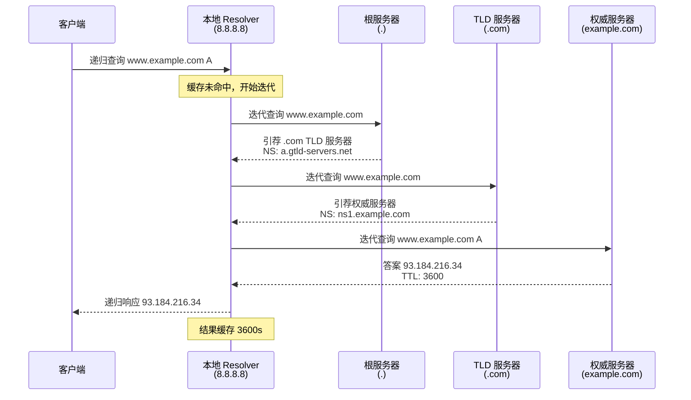

---
tags:
  - network
  - protocol-analysis
  - tier3
  - dns
  - dns-security
  - doh
  - dnssec
---
# DNS协议分析与操纵

> [!abstract] TL;DR
> DNS 是互联网最核心的基础设施协议，每次网络请求背后都藏着 DNS 查询。掌握 DNS 报文结构、Wireshark 过滤语法与 Scapy 构造技巧，能让安全研究者识别 DGA 域名、发现 DNS 隧道、检测恶意解析，是协议分析工具箱中不可或缺的一环。

## 概述与定位

DNS（Domain Name System）将人类可读的域名解析为 IP 地址，承担着互联网的"电话簿"角色。从安全研究视角看，DNS 流量携带大量情报价值：

- **恶意软件行为特征**：C2 回连域名、DGA（Domain Generation Algorithm）生成的随机域名
- **数据渗漏信道**：DNS 隧道（dnscat2、iodine）将数据藏在 TXT/NULL 记录中
- **横向移动痕迹**：内网 DNS 查询序列揭示攻击者的侦察路径
- **基础设施关联**：PDNS（被动 DNS）数据库关联 APT 基础设施

DNS 工作于 UDP 53 端口（响应超过 512 字节时自动切换 TCP），现代变体包括 DoH（DNS over HTTPS，RFC 8484）和 DoT（DNS over TLS，RFC 7858，端口 853），为传统明文 DNS 提供加密保护。

## 原理与机制

### 查询类型：迭代 vs 递归

**递归查询**：客户端委托本地 Resolver（如 8.8.8.8）全权代劳，Resolver 一路追查到权威服务器返回最终答案。

**迭代查询**：Resolver 每次只向上级询问"下一步问谁"，自己驱动整个查询链。实际的递归解析器内部使用迭代查询与根/TLD 服务器通信。

### UDP vs TCP 的选择逻辑

| 条件 | 传输层 |
|---|---|
| 响应 ≤ 512 字节（RFC 1035 原始限制） | UDP |
| 响应 > 512 字节（现代扩展 EDNS0 允许更大，但超限时） | TCP |
| DNSSEC 响应（携带签名记录，通常较大） | TCP |
| 区域传输（AXFR/IXFR） | TCP |

### DNS 报文头 FLAGS 字段详解

FLAGS 字段共 16 位，结构如下：

```
 0  1  2  3  4  5  6  7  8  9 10 11 12 13 14 15
QR  Opcode(4)   AA TC RD RA  Z  AD CD   RCODE(4)
```

| 位域 | 含义 |
|---|---|
| QR | 0=Query，1=Response |
| AA | Authoritative Answer，权威服务器直接回答 |
| TC | TrunCated，响应被截断（触发 TCP 重试） |
| RD | Recursion Desired，客户端请求递归 |
| RA | Recursion Available，服务器支持递归 |
| AD | Authenticated Data（DNSSEC） |
| RCODE | 0=NOERROR，2=SERVFAIL，3=NXDOMAIN，5=REFUSED |

### DNS 记录类型速查

| 类型 | 用途 |
|---|---|
| A | IPv4 地址 |
| AAAA | IPv6 地址 |
| CNAME | 别名（Canonical Name） |
| MX | 邮件交换记录 |
| NS | 权威名称服务器 |
| TXT | 文本记录（SPF/DKIM/DMARC 均藏于此） |
| PTR | 反向解析（IP→域名） |
| SOA | Start of Authority，区域元数据 |
| SRV | 服务定位记录（格式：`_service._proto.name TTL IN SRV priority weight port target`） |
| DS / DNSKEY / RRSIG | DNSSEC 信任链记录 |

## 结构/算法/伪代码详解

### DNS 报文完整结构

```
+---------------------------+
|      Transaction ID       |  2 bytes，客户端随机生成，响应复用
+---------------------------+
|          FLAGS            |  2 bytes，见上方位域说明
+---------------------------+
|       QDCOUNT (1)         |  Question 计数
+---------------------------+
|       ANCOUNT             |  Answer 计数
+---------------------------+
|       NSCOUNT             |  Authority 计数
+---------------------------+
|       ARCOUNT             |  Additional 计数
+---------------------------+
|       QUESTION section    |  QNAME + QTYPE + QCLASS
+---------------------------+
|       ANSWER section      |  RR 列表
+---------------------------+
|       AUTHORITY section   |  NS 记录
+---------------------------+
|       ADDITIONAL section  |  A/AAAA 粘附记录（glue records）
+---------------------------+
```

QNAME 采用**长度标注编码**：每个标签前缀一个长度字节，末尾以 `\x00` 结束。`www.example.com` 编码为 `\x03www\x07example\x03com\x00`。

### Wireshark DNS 过滤器

```wireshark
# 仅显示 DNS 流量
dns

# 查询特定域名（支持正则）
dns.qry.name contains "evil"
dns.qry.name matches "^[a-z0-9]{20,}\."

# 仅查询报文（QR=0）
dns.flags.response == 0

# 仅响应报文（QR=1）
dns.flags.response == 1

# NXDOMAIN 响应（RCODE=3，常见于 DGA 域名）
dns.flags.rcode == 3

# 特定记录类型（TXT 常见于 DNS 隧道）
dns.qry.type == 16

# 响应包含多个 Answer（可能是 DNS 放大攻击流量特征）
dns.count.answers > 5
```

### Scapy DNS 构造示例

```python
from scapy.all import *

# 1. 构造 DNS 查询报文
dns_query = IP(dst="8.8.8.8") / UDP(dport=53) / \
    DNS(rd=1, qd=DNSQR(qname="example.com", qtype="A"))

# 2. 发送并接收响应
response = sr1(dns_query, verbose=0, timeout=2)
if response and response.haslayer(DNS):
    print(response[DNS].show())

# 3. 枚举 DNS 记录（ANY 查询）
any_query = IP(dst="8.8.8.8") / UDP(dport=53) / \
    DNS(rd=1, qd=DNSQR(qname="example.com", qtype="ANY"))

# 4. PTR 反向解析（反解析 8.8.8.8）
ptr_query = IP(dst="8.8.8.8") / UDP(dport=53) / \
    DNS(rd=1, qd=DNSQR(qname="8.8.8.8.in-addr.arpa", qtype="PTR"))

# 5. 批量查询一批域名（DGA 检测场景：向外部解析测试域名列表）
domains = ["google.com", "facebook.com", "xkcd.com"]
pkts = []
for i, domain in enumerate(domains):
    pkt = IP(dst="8.8.8.8") / UDP(dport=53, sport=50000+i) / \
        DNS(id=i, rd=1, qd=DNSQR(qname=domain))
    pkts.append(pkt)

answered, unanswered = sr(pkts, verbose=0, timeout=3)
for snt, rcv in answered:
    print(f"{snt[DNS].qd.qname.decode()} -> {rcv[DNS].an.rdata if rcv[DNS].an else 'NXDOMAIN'}")
```

### dig 完整用法速查

```bash
# 基础查询（默认 A 记录）
dig example.com

# 指定 DNS 服务器
dig @8.8.8.8 example.com

# 查询特定类型
dig example.com MX
dig example.com TXT
dig example.com NS
dig example.com ANY

# 简洁输出
dig @8.8.8.8 example.com ANY +short

# 反向解析
dig -x 8.8.8.8

# 追踪完整查询链（迭代模式）
dig +trace example.com

# DoH 查询（curl 方式）
curl -s -H 'accept: application/dns-json' \
  'https://dns.google/resolve?name=example.com&type=A' | python3 -m json.tool

# DoH POST（RFC 8484 wire format）
curl -s -X POST https://dns.google/dns-query \
  -H 'content-type: application/dns-message' \
  --data-binary @<(python3 -c "
import struct
# 最小化 DNS 查询 wire format
query = bytes([0x00,0x01,0x01,0x00,0x00,0x01,0x00,0x00,0x00,0x00,0x00,0x00,
               0x07,0x65,0x78,0x61,0x6d,0x70,0x6c,0x65,0x03,0x63,0x6f,0x6d,0x00,
               0x00,0x01,0x00,0x01])
import sys; sys.stdout.buffer.write(query)
") | xxd

# DoT 测试（需要 kdig，来自 knot-dnsutils）
kdig -d @853 +tls-ca +tls-host=dns.google example.com A

# DNSSEC 验证
dig +dnssec example.com
```

## 工具视角与实战

### 工具链对比

| 工具 | 用途 | 特点 |
|---|---|---|
| `dig` | 交互式 DNS 查询 | 功能全面，+trace 追踪完整链路 |
| `nslookup` | 简单查询（跨平台） | 交互/非交互两种模式 |
| `dnspy` | Python DNS 库 | 适合脚本化批量查询 |
| `dnsdbq` | 查询 PDNS 数据库 | 关联历史解析记录（需 API key） |
| `massdns` | 高速批量解析 | 每秒数十万次查询，DNS 侦察首选 |
| Wireshark | 流量捕获分析 | 实时/离线，GUI 分析 DNS 报文 |
| Scapy | 报文构造与重放 | 精确控制每个字段 |

### DNS 隧道检测实战

```bash
# 用 tshark 统计 DNS 查询域名长度分布（DNS 隧道的 QNAME 通常超长）
tshark -r traffic.pcap -Y "dns.flags.response == 0" \
  -T fields -e dns.qry.name 2>/dev/null | \
  awk '{print length($0)}' | sort -n | uniq -c | sort -rn | head -20

# 提取所有 TXT 记录内容（DNS 隧道常用 TXT 传数据）
tshark -r traffic.pcap -Y "dns.qry.type == 16" \
  -T fields -e dns.qry.name -e dns.txt 2>/dev/null

# 统计唯一子域名数量（DGA 特征：大量不同的子域名对同一父域查询）
tshark -r traffic.pcap -Y "dns" -T fields -e dns.qry.name 2>/dev/null | \
  sed 's/^[^.]*\.//' | sort | uniq -c | sort -rn | head -10
```

### DNSSEC 验证链分析

```bash
# 查看完整 DNSSEC 信任链
dig +dnssec +multiline example.com A

# 验证 DS 记录（子区域到父区域的信任锚）
dig DS example.com @8.8.8.8

# 查看 DNSKEY（区域签名密钥）
dig DNSKEY example.com +short

# 检查 RRSIG（记录集签名）
dig +dnssec example.com A | grep RRSIG
```

## 安全性与正确使用

### DNS 分析的合规场景

**合法用途：**
- 自有网络中的 DNS 流量基线建立与异常告警
- 安全研究中的恶意域名识别（结合 VirusTotal/Shodan）
- 渗透测试授权范围内的 DNS 侦察（dig/massdns）
- CTF 比赛中的 DNS 隧道题目解题
- 蜜罐 DNS 服务器记录攻击者查询行为

**DGA 域名识别特征：**
1. 子域名字符集随机（熵值高，接近随机字符串）
2. 大量 NXDOMAIN 响应（域名不存在）
3. 短 TTL（快速更换 C2 地址）
4. 域名长度分布集中在 16-30 字符

**DNS 隧道检测特征：**
1. TXT/NULL 记录过多且内容经 Base64/Hex 编码
2. QNAME 长度异常（超过 50 字符的子域名）
3. 同一父域下子域名数量爆发性增长
4. 单个会话内 DNS 查询频率远超正常（>100 次/分钟）

> [!warning] 边界说明
> DNS 报文构造技术（如 Scapy 示例）仅用于**自有环境测试、授权渗透测试、协议研究**。对他人 DNS 服务器发起 DNS 放大攻击（利用 ANY 查询的流量放大效应）是 DDoS 攻击行为，在多数国家/地区构成违法犯罪。

## 小结

DNS 协议表面简单（UDP 53 一问一答），但其内部结构（FLAGS 位域、QNAME 编码、多 Section 布局）和生态（DNSSEC 信任链、DoH/DoT 加密变体）构成了完整的知识体系。从安全研究视角，DNS 流量是**最廉价的情报来源**——无需解密即可分析，Wireshark 的 `dns.qry.name matches` 正则过滤配合 tshark 批量提取，能快速定位 DGA/隧道流量。Scapy 的 DNS 层支持精确构造查询报文，是协议测试和 DNS 服务行为验证的利器。

## 相关阅读

- [[05.TLS握手与解密分析|← ch05：TLS握手与解密分析]]
- [[07.WebSocket与HTTP2分析|← ch07：WebSocket与HTTP2分析]]
- [[11.Zeek协议分析框架|→ ch11：Zeek协议分析框架]]
- RFC 1035 — Domain Names Implementation and Specification
- RFC 8484 — DNS Queries over HTTPS (DoH)
- RFC 7858 — DNS over TLS (DoT)
- RFC 4033/4034/4035 — DNSSEC



[[00.抓包与协议分析实战总览|⬆ 系列总览]] | [[07.WebSocket与HTTP2分析|← 上一章]] | [[09.移动端抓包Android与iOS|→ 下一章]]
