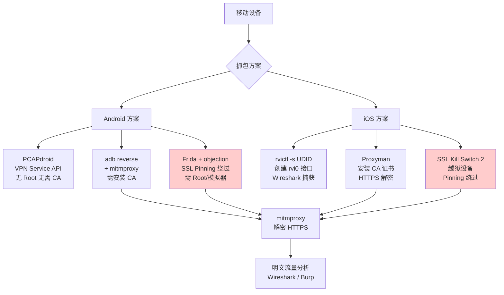

---
tags:
  - network
  - protocol-analysis
  - tier3
  - mobile
  - android
  - ios
  - ssl-pinning
  - mitm
---
# 移动端抓包：Android与iOS

> [!abstract] TL;DR
> 移动端抓包面临三重挑战：SSL Pinning 拒绝用户安装的 CA 证书、VPN 检测绕过代理、Root 检测阻止调试工具注入。Android 通过 PCAPdroid（VPN Service API，无需 Root）或 mitmproxy 透明代理实现抓包；iOS 通过 rvictl 创建虚拟网络接口配合 Wireshark 捕获原始流量。绕过 SSL Pinning 需要 Frida/objection 或修改 network_security_config.xml。

## 概述与定位

移动端 App 的网络流量分析是安全审计、漏洞挖掘和逆向工程的关键环节，但与 PC 端抓包相比，存在独特的技术障碍：

**Android 特殊挑战：**
- Android 7.0（API 24）起，用户安装的 CA 证书默认不受应用信任（须明确在 `network_security_config.xml` 中声明）
- 部分 App 内置 SSL Pinning（公钥/证书 Hash 白名单），拒绝非预期证书
- Root 检测（SafetyNet/Play Integrity）阻止 Frida 注入

**iOS 特殊挑战：**
- iOS 应用沙盒隔离，无法在设备上直接安装 tcpdump（非越狱）
- ATS（App Transport Security）强制 HTTPS
- SSL Pinning 通过 `NSURLSessionDelegate` 或第三方库（如 TrustKit）实现

正确理解这些机制，才能选择最合适的抓包方案。

## 原理与机制

### Android VPN Service API（PCAPdroid 原理）

Android 提供 `VpnService` API，允许普通 App（无需 Root）创建一个用户空间 VPN，将设备所有网络流量路由到该 App 处理。PCAPdroid 正是利用这一 API：

1. App 调用 `VpnService.Builder` 建立 TUN 接口
2. 所有出站流量被路由到 PCAPdroid 的用户空间
3. PCAPdroid 解析 IP/TCP/UDP 报文，写入 pcap 文件或实时转发
4. 无需 Root，无需证书安装，适合捕获**明文流量**

限制：对于加密 TLS 流量，PCAPdroid 只能记录密文，无法解密（除非配合 mitmproxy 透明代理模式）。

### iOS rvictl 虚拟网络接口

Apple 提供 `rvictl`（Remote Virtual Interface）工具，通过 USB 在 Mac 上创建与 iOS 设备绑定的虚拟网络接口：

```
Mac                          iOS 设备
┌──────────────────┐   USB   ┌──────────────────┐
│  rvi0 虚拟接口   │ ←────── │  所有网络流量    │
│  Wireshark 捕获  │         │  (Wi-Fi + 蜂窝)  │
└──────────────────┘         └──────────────────┘
```

该接口镜像设备所有网络流量（包括 Wi-Fi 和蜂窝），Wireshark 对 `rvi0` 接口抓包即可获得完整流量，是**非越狱 iOS 抓包的官方方案**。

### TLS 证书验证链与 SSL Pinning

标准 TLS 验证：设备验证服务器证书是否由受信任 CA 签发。MITM 代理插入自签 CA，通常需要在设备安装该 CA。

SSL Pinning 分两类：
- **证书 Pinning**：校验服务器证书的完整 DER 内容
- **公钥 Pinning**（HPKP/自实现）：校验证书中公钥的 SHA-256 Hash

绕过途径：
1. **系统级**：将代理 CA 安装到系统存储（需 Root）
2. **编译时**：修改 APK 中的 `network_security_config.xml`（需重新签名）
3. **运行时**：Frida hook TLS 验证函数，跳过 Pinning 检查

## 结构/算法/伪代码详解

### Android：adb + mitmproxy 透明代理配置

```bash
# 1. 启动 mitmproxy（透明模式，监听 8080）
mitmproxy --mode transparent --listen-port 8080

# 2. adb 反向端口映射（设备 8080 → 宿主机 8080）
adb reverse tcp:8080 tcp:8080

# 3. 在设备上配置 Wi-Fi 代理为 127.0.0.1:8080
# 或通过 adb shell 设置全局代理（需 Root 或 ADB over USB）
adb shell settings put global http_proxy 127.0.0.1:8080

# 4. 安装 mitmproxy CA 证书（Android 7 以下）
# 访问 http://mitm.it 下载 CA 证书
# 在设置 > 安全 > 安装证书中安装

# 5. 查看实时流量
# mitmproxy 交互界面中直接浏览所有请求/响应
```

### Android：network_security_config.xml 修改（APK 重打包）

```xml
<!-- res/xml/network_security_config.xml -->
<?xml version="1.0" encoding="utf-8"?>
<network-security-config>
    <!-- 信任用户安装的 CA（Android 7+ 的关键配置）-->
    <base-config cleartextTrafficPermitted="true">
        <trust-anchors>
            <!-- 信任系统 CA -->
            <certificates src="system" />
            <!-- 信任用户安装的 CA（mitmproxy/Burp 证书）-->
            <certificates src="user" />
        </trust-anchors>
    </base-config>

    <!-- 针对特定域名禁用 Pinning（调试专用）-->
    <domain-config>
        <domain includeSubdomains="true">api.example.com</domain>
        <trust-anchors>
            <certificates src="system" />
            <certificates src="user" />
        </trust-anchors>
        <!-- 注释掉或删除原有的 <pin-set> 节点 -->
    </domain-config>
</network-security-config>
```

```bash
# APK 重打包流程（需 apktool + apksigner）
apktool d target.apk -o target_decompiled/
# 编辑 res/xml/network_security_config.xml
# 确保 AndroidManifest.xml 中引用了该文件：
# android:networkSecurityConfig="@xml/network_security_config"
apktool b target_decompiled/ -o target_patched.apk
# 重新签名
keytool -genkey -v -keystore debug.keystore -alias androiddebugkey \
  -keyalg RSA -keysize 2048 -validity 10000 -storepass android -keypass android
apksigner sign --ks debug.keystore --ks-key-alias androiddebugkey \
  --ks-pass pass:android --key-pass pass:android target_patched.apk
adb install target_patched.apk
```

### Frida + objection SSL Pinning 绕过

```bash
# 1. 安装 frida-server 到 Android 设备（需 Root 或模拟器）
# 从 https://github.com/frida/frida/releases 下载对应架构的 frida-server
adb push frida-server-16.x.x-android-arm64 /data/local/tmp/frida-server
adb shell chmod 755 /data/local/tmp/frida-server
adb shell /data/local/tmp/frida-server &

# 2. 安装 objection
pip install objection

# 3. 列出设备上运行的进程
frida-ps -U

# 4. 附加到目标 App 并禁用 SSL Pinning
objection -g com.target.app explore

# 在 objection shell 中执行：
# android sslpinning disable
# 效果：hook 所有常见 SSL Pinning 实现（OkHttp3/Retrofit/原生 X509TrustManager）

# 5. Frida 脚本方式（更精细控制）
frida -U -f com.target.app --no-pause -l ssl_bypass.js
```

```javascript
// ssl_bypass.js — 绕过 Android SSL Pinning 的通用 Frida 脚本
Java.perform(function() {
    // 绕过 OkHttp3 CertificatePinner
    try {
        var CertificatePinner = Java.use('okhttp3.CertificatePinner');
        CertificatePinner.check.overload('java.lang.String', 'java.util.List')
            .implementation = function(hostname, peerCertificates) {
                console.log('[+] OkHttp3 CertificatePinner.check bypassed for: ' + hostname);
                return;  // 直接返回，不执行 Pinning 检查
            };
    } catch(e) { console.log('OkHttp3 not found'); }

    // 绕过系统 TrustManager
    try {
        var TrustManager = Java.use('javax.net.ssl.X509TrustManager');
        var SSLContext = Java.use('javax.net.ssl.SSLContext');
        var TrustManagerImpl = Java.registerClass({
            name: 'com.custom.TrustManagerImpl',
            implements: [TrustManager],
            methods: {
                checkClientTrusted: function(chain, authType) {},
                checkServerTrusted: function(chain, authType) {},
                getAcceptedIssuers: function() { return []; }
            }
        });
        var ctx = SSLContext.getInstance('TLS');
        ctx.init(null, [TrustManagerImpl.$new()], null);
        SSLContext.getDefault.implementation = function() { return ctx; };
        console.log('[+] TrustManager bypassed');
    } catch(e) { console.log('TrustManager bypass failed: ' + e); }
});
```

### iOS：rvictl + Wireshark 实战

```bash
# macOS 上执行以下步骤

# 1. 连接 iOS 设备（USB），获取 UDID
idevice_id -l
# 或
instruments -s devices

# 2. 创建 rvi 虚拟接口（用设备 UDID 替换）
rvictl -s 00008020-000XXXXXXXXXX

# 预期输出：
# Starting device 00008020-000XXXXXXXXXX [SUCCEEDED] with interface rvi0

# 3. 验证接口创建成功
ifconfig rvi0

# 4. 用 tcpdump 捕获（命令行）
sudo tcpdump -i rvi0 -w ios_traffic.pcap

# 5. 或直接用 Wireshark 捕获
# 打开 Wireshark → 选择 rvi0 接口 → 开始捕获

# 6. 捕获完成后停止 rvi 接口
rvictl -x 00008020-000XXXXXXXXXX

# iOS SSL Pinning 绕过（需越狱或企业签名）
# 方案1：SSL Kill Switch 2（越狱插件，Cydia 安装）
# 方案2：Frida hook NSURLSession
```

```javascript
// iOS SSL Pinning 绕过（Frida + ObjC）
if (ObjC.available) {
    // Hook NSURLSession delegate
    try {
        var NSURLSessionDelegate = ObjC.classes.NSURLSession;
        Interceptor.attach(
            ObjC.classes.NSURLSession['- URLSession:didReceiveChallenge:completionHandler:'].implementation,
            {
                onEnter: function(args) {
                    var completionHandler = new ObjC.Block(args[4]);
                    completionHandler.implementation = function(disposition, credential) {
                        // NSURLSessionAuthChallengeUseCredential = 0
                        // 直接接受服务器提供的凭证
                        this(0, ObjC.classes.NSURLCredential
                            .credentialForTrust_(args[3]));
                    };
                }
            }
        );
        console.log('[+] NSURLSession SSL Pinning bypassed');
    } catch(e) {
        console.log('Hook failed: ' + e);
    }
}
```

### iOS：Proxyman 配置（非越狱方案）

```
1. Mac 上安装 Proxyman（https://proxyman.io）
2. 在 Proxyman 中：Certificate → Install Certificate on iOS
3. 按提示在 iOS 设备上：
   a. 设置 → Wi-Fi → 配置代理（HTTP，指向 Mac IP:9090）
   b. Safari 访问 http://proxy.man/ssl 下载 CA 证书
   c. 设置 → 通用 → VPN与设备管理 → 安装描述文件
   d. 设置 → 通用 → 关于本机 → 证书信任设置 → 开启完全信任
4. 在 Proxyman 中启用 SSL Proxying：右键域名 → Enable SSL Proxying
```

> [!caution] 授权边界：SSL Pinning 绕过的合规范围
> SSL Pinning 绕过技术**仅适用于以下场景**：
> - **自有 App 开发调试**：开发者对自己开发的应用进行接口联调和问题排查
> - **授权安全审计**：已获书面授权的渗透测试或安全评估项目
> - **自有设备上的自有 App**：用户对自己账号下的 App 进行个人研究
>
> **严禁以下行为**：
> - 绕过第三方 App 的 SSL Pinning 以截获其他用户数据
> - 利用抓包结果破解 App 的 API 协议进行商业竞争
> - 在未获授权的情况下对 App 服务器发起请求或进行自动化攻击
>
> 在大多数国家/地区，未授权的网络截获属于违法行为（中国《网络安全法》第 27 条，美国 CFAA 等）。

## 工具视角与实战

### Android 抓包工具对比

| 工具 | Root 需求 | SSL 解密 | 适用场景 |
|---|---|---|---|
| PCAPdroid | 无需 | 否（明文流量） | 快速捕获明文协议流量 |
| adb + mitmproxy | 无需（proxy配置） | 是（需安装CA） | 调试 HTTP/S 接口 |
| Frida + objection | 模拟器/Root | 是（Pinning绕过） | 安全审计，Pinning 绕过 |
| Charles Proxy | 无需 | 是（需安装CA） | 商业工具，GUI友好 |
| Burp Suite Mobile | 无需 | 是（需安装CA） | Web安全测试 |

### iOS 抓包工具对比

| 工具 | 越狱需求 | SSL 解密 | 适用场景 |
|---|---|---|---|
| rvictl + Wireshark | 无需 | 否（看密文） | 原始流量捕获，协议分析 |
| Proxyman | 无需 | 是（需安装CA） | HTTPS 流量调试，GUI优秀 |
| SSL Kill Switch 2 | 需越狱 | 是 | 安全审计，Pinning 绕过 |
| Frida（iOS） | 企业签名/越狱 | 是 | 动态分析，精细 Hook |

### 常用 adb 命令速查

```bash
# 查看已连接设备
adb devices

# 反向端口映射（设备→宿主机）
adb reverse tcp:8080 tcp:8080

# 清除反向映射
adb reverse --remove-all

# 安装 APK
adb install -r app.apk

# 查看设备 logcat（过滤网络相关日志）
adb logcat -s "OkHttp" "Volley" "HttpClient"

# 推送文件到设备
adb push local_file /sdcard/Download/

# 截图
adb exec-out screencap -p > screen.png
```

## 安全性与正确使用

### 合规测试清单

在进行移动端抓包分析前，确认以下事项：

- [ ] 测试对象是自己开发/拥有的 App，或已获得书面授权
- [ ] 测试设备是专用测试设备，不包含真实用户数据
- [ ] 若为企业安全审计，已签署 NDA 和授权协议
- [ ] 抓包数据在项目结束后按约定销毁
- [ ] 不将 SSL Pinning 绕过工具（frida-server）留在生产设备上

### 防御侧：加固 SSL Pinning 实现

了解攻击路径有助于构建更强壮的防御：

```java
// 更难被 Frida Hook 绕过的 Pinning 实现（使用 native 层）
// 在 JNI 层实现证书验证，增加逆向难度
// 使用 OkHttp CertificatePinner 配合代码混淆
OkHttpClient client = new OkHttpClient.Builder()
    .certificatePinner(new CertificatePinner.Builder()
        .add("api.example.com",
             "sha256/AAAAAAAAAAAAAAAAAAAAAAAAAAAAAAAAAAAAAAAAAAA=")
        .build())
    .build();
```

## 小结

移动端抓包是安全研究的核心技能，需要根据平台（Android/iOS）、Root 状态和 SSL Pinning 实现选择合适的工具链。Android 的 VPN Service API 使得 PCAPdroid 成为无侵入性的明文流量捕获方案；`adb reverse` + mitmproxy 是 HTTPS 调试的黄金组合；iOS 的 rvictl 提供官方的非越狱抓包路径。SSL Pinning 绕过是安全审计的必要技能，但必须在明确授权范围内使用。

## 相关阅读

- [[08.DNS协议分析与操纵|← ch08：DNS协议分析与操纵]]
- [[10.Scapy网络包构造与重放|→ ch10：Scapy网络包构造与重放]]
- [[04.HTTP与HTTPS抓包与中间人分析|← ch04：HTTP与HTTPS抓包]]
- [[05.TLS握手与解密分析|← ch05：TLS握手与解密分析]]
- PCAPdroid GitHub: https://github.com/emanuele-f/PCAPdroid
- Frida 官方文档: https://frida.re/docs/
- objection: https://github.com/sensepost/objection
- Apple rvictl 文档: https://developer.apple.com/library/archive/qa/qa1176/



[[00.抓包与协议分析实战总览|⬆ 系列总览]] | [[08.DNS协议分析与操纵|← 上一章]] | [[10.Scapy网络包构造与重放|→ 下一章]]
