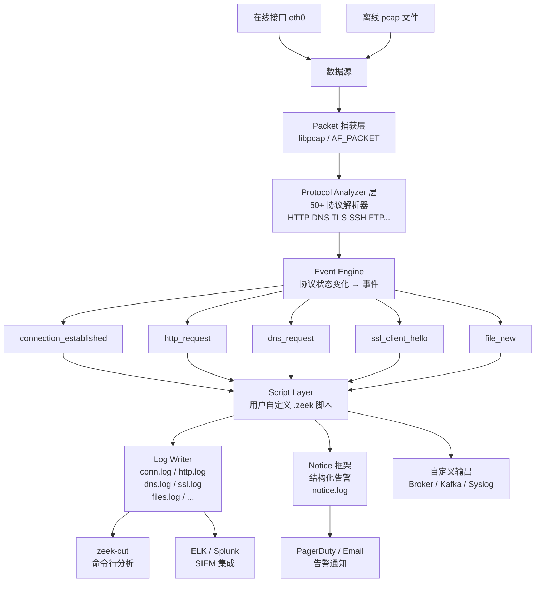

---
tags:
  - network
  - protocol-analysis
  - tier3
  - zeek
  - nsm
  - ids
  - log-analysis
---
# Zeek协议分析框架

> [!abstract] TL;DR
> Zeek（原 Bro）是专为网络安全监控（NSM）设计的流量分析框架，区别于 Wireshark（报文级交互分析）和 Snort/Suricata（特征规则匹配），Zeek 以事件驱动脚本语言将流量转化为结构化日志（conn.log/http.log/dns.log/ssl.log），是 SOC 和威胁猎杀的核心工具。

## 概述与定位

### Zeek 在安全工具链中的位置

```
原始流量 → [Zeek] → 结构化日志 → [SIEM/ELK] → 告警/可视化
原始流量 → [Wireshark] → 报文级交互分析（调试/取证）
原始流量 → [Snort/Suricata] → 规则匹配告警（IDS/IPS）
```

Zeek 的核心价值：**将海量原始流量转化为可查询的结构化元数据**，而非存储原始报文（节省存储 10-100x）。

### 与 Snort/Suricata 的定位差异

Snort/Suricata 是**签名型 IDS**（Intrusion Detection System），其工作模式是将每个数据包与规则库（如 Snort Rules、ET Open）中的特征进行匹配，一旦匹配则立即产生告警。这种范式的优点是检测速度快、低误报（已知威胁），但对未知威胁无感知，且无法做跨报文的有状态分析（如"同一 IP 在 5 分钟内发起了多少 SYN"需要额外的状态跟踪插件）。

Zeek 是**协议感知的行为分析框架**，它不关注单个报文的内容匹配，而是将整个 TCP 会话（甚至跨会话的 IP 行为）理解为有状态的协议交互，产生语义级别的日志——"这个 HTTP 请求的 URI 是什么"而不是"这个数据包的第 X 字节是 Y"。

| 工具 | 范式 | 输出 | 适合场景 |
|---|---|---|---|
| Wireshark | 被动分析，报文级 | pcap + GUI 解析 | 协议调试、取证分析 |
| tcpdump | 被动过滤，命令行 | pcap | 快速捕获、条件过滤 |
| Snort/Suricata | 规则匹配，IDS/IPS | 告警事件 | 已知威胁检测 |
| **Zeek** | **事件驱动，协议解析** | **结构化 TSV 日志** | **NSM、威胁猎杀、行为分析** |
| Scapy | 主动构造/嗅探 | Python 对象 | 协议研究、渗透测试 |

**Zeek 的独特优势：**
- 理解应用层协议（HTTP/DNS/TLS/FTP/SSH 等 50+ 协议）
- 脚本语言可编程（非仅规则匹配），可实现复杂统计和关联
- Notice 框架提供结构化告警
- 天生适合离线 pcap 分析和在线流量监控两种模式

## 原理与机制

### 事件引擎：从数据流到语义事件

Zeek 的处理管道本质上是一个**协议状态机驱动的事件总线**：

```
网络流量 (pcap/NIC)
       ↓
   Packet层
   (libpcap 捕获)
       ↓
   Protocol Analyzer层
   (协议状态机解析 HTTP/DNS/TLS/...)
       ↓
   Event Engine层
   (将协议状态变化转化为事件)
       ↓
   Script Layer层
   (用户定义的 .zeek 脚本处理事件)
       ↓
   ┌──────────────────────────────┐
   │  Log (conn.log/http.log/...) │
   │  Notice (告警框架)            │
   │  Output (自定义输出)          │
   └──────────────────────────────┘
```

协议分析器（Protocol Analyzer）是 Zeek 的核心。以 HTTP 分析器为例：它维护一个状态机，跟踪 HTTP 请求/响应对的配对。当它看到 `GET /index.html HTTP/1.1` 时，状态机从 IDLE 转换到 REQUEST_RECEIVED，提取 method（GET）、URI（/index.html）、version（1.1）等字段；当随后的响应到达时，状态机转换到 RESPONSE_RECEIVED，提取 status_code（200）、content-type 等字段。每一次状态转换都会触发一个或多个**事件**（如 `http_request`、`http_reply`、`http_entity_data`）。

这与 Wireshark 的解析器不同：Wireshark 对每个报文独立解析，而 Zeek 的分析器是**有状态的**，在整个连接生命周期内跟踪协议交互，能检测到需要跨报文才能识别的异常（如不正确的请求/响应配对、过长的响应体等）。

Zeek 脚本响应**事件**而非报文，例如：
- `connection_established` — TCP 三次握手完成
- `http_request` — HTTP 请求报文到达
- `dns_request` — DNS 查询报文
- `ssl_client_hello` — TLS ClientHello
- `file_new` — 检测到新文件传输

### 脚本执行模型：事件驱动与全局状态

Zeek 脚本是**事件驱动**的：开发者定义事件处理器（`event xxx() {}`），Zeek 的事件引擎在对应事件发生时调用这些处理器。事件处理器是同步执行的——在当前事件处理器返回之前，下一个事件不会被处理（类似 Node.js 的单线程事件循环）。

Zeek 脚本的全局状态通过全局变量（`global`）和 `table`/`set` 数据结构维护。这使得跨连接的有状态分析成为可能——例如，维护一个 `table[addr] of count` 记录每个 IP 的 NXDOMAIN 计数，跨越多个 DNS 连接做累计统计。

Zeek 脚本没有显式的并发原语（非集群模式下是单线程的），这简化了状态管理，但也意味着处理器中的复杂计算会增加处理延迟。对于高吞吐量的生产环境，Zeek 通过集群架构（worker 进程）实现水平扩展。

### Notice 框架

Notice 框架是 Zeek 的结构化告警机制，允许脚本生成带类型、优先级和处置建议的告警：

```zeek
# 定义 Notice 类型
redef enum Notice::Type += {
    DGA_Suspicion,
    PortScan_Detected,
    LargeDNSTXT_Transfer
};

# 在事件处理器中触发 Notice
NOTICE([$note=DGA_Suspicion,
        $msg=fmt("可疑 DGA 域名: %s", domain),
        $conn=c,
        $identifier=cat(c$id$orig_h, domain),
        $suppress_for=5 min]);
```

`$suppress_for` 是 Notice 框架的重要特性：它在指定时间内抑制相同 `$identifier` 的重复告警，防止对同一行为的告警风暴。`$identifier` 是告警去重的键，通常由源 IP + 事件特征组合而成。

### 日志框架：Log::Stream 与 TSV 输出

Zeek 的日志系统基于 `Log::Stream` 概念——每种日志（conn.log、http.log 等）对应一个流，流定义了字段名称和类型。默认输出格式是 TSV（制表符分隔值），首行是 `#fields` 注释行列出字段名，便于 `zeek-cut` 等工具按名称提取列。

TSV 格式的优势在于读写效率高、人类可读性好，且与标准 Unix 工具链（cut/awk/sort）天然兼容。缺点是查询时需要先确定字段位置，`zeek-cut` 工具解决了这个问题——它读取 `#fields` 注释行来确定列位置，提供按名称访问列的能力。

Zeek 也支持 JSON 格式输出（`@load policy/tuning/json-logs.zeek`），便于与 Elasticsearch 等需要 JSON 输入的 SIEM 系统集成。

### 集群架构（manager/worker/proxy）

在生产环境中，单个 Zeek 进程无法处理高速网络（10Gbps+）的全流量。Zeek 的集群架构将功能分散到多个进程：

- **Manager**：集群的协调者，聚合各 worker 产生的日志和 Notice，维护全局的 Notice 抑制状态，与 ZeekControl 通信
- **Worker**：实际处理流量的进程，每个 Worker 处理一个或多个网络接口/RSS（Receive Side Scaling）队列，运行完整的协议分析器和脚本
- **Proxy**：可选的数据聚合中间层，在大型集群中减少 Manager 的负载，通常处理跨 Worker 的状态共享（通过 Zeek 的 Broker 框架）
- **Logger**（可选）：专门负责日志写入的进程，避免 I/O 操作影响 Worker 的包处理延迟

这种架构允许 Zeek 通过增加 Worker 进程线性扩展处理能力，前提是流量能被均匀分发到各 Worker（通常通过内核的 RSS 或 PF_RING 实现）。

## 结构/算法/伪代码详解

### Zeek 脚本语法要点

```zeek
# 基本结构：事件处理器
event zeek_init() {
    print "Zeek 初始化完成";
}

event zeek_done() {
    print "分析结束";
}

# 连接建立事件
event connection_established(c: connection) {
    # c 包含连接的完整元数据
    print fmt("新连接: %s:%d -> %s:%d",
              c$id$orig_h,   # 源 IP
              c$id$orig_p,   # 源端口
              c$id$resp_h,   # 目标 IP
              c$id$resp_p);  # 目标端口
}

# HTTP 请求事件（参数类型由 Zeek 自动提供）
event http_request(c: connection, method: string, original_URI: string,
                   unescaped_URI: string, version: string) {
    local host = c$http$host ?? "-";
    print fmt("[HTTP] %s %s%s HTTP/%s",
              method, host, original_URI, version);
}
```

### 完整示例1：HTTP User-Agent 统计

```zeek
# http_ua_stats.zeek
# 功能：统计所有 HTTP 请求的 User-Agent 分布

module HTTPStats;

export {
    # 全局 User-Agent 计数表
    global ua_count: table[string] of count &default=0;
}

event http_request(c: connection, method: string, original_URI: string,
                   unescaped_URI: string, version: string) {
    if (c$http?$user_agent) {
        local ua = c$http$user_agent;
        ua_count[ua] += 1;
    }
}

event zeek_done() {
    print "=== HTTP User-Agent 统计 ===";
    # 将表按值排序输出（Zeek 无内置排序，用 vector 手动排）
    for (ua, cnt in ua_count) {
        print fmt("  %5d  %s", cnt, ua);
    }
}
```

### 完整示例2：DNS 异常检测

```zeek
# dns_anomaly.zeek
# 功能：检测 DNS 隧道（过长的 QNAME）和 DGA（大量 NXDOMAIN）

module DNSAnomalies;

export {
    redef enum Notice::Type += {
        DNS_LongQuery,        # 异常长的 DNS 查询名
        DNS_HighNXDOMAIN      # 高 NXDOMAIN 率
    };

    # 配置阈值
    const max_query_len = 50 &redef;
    const nxdomain_threshold = 20 &redef;
}

# 每 IP 的 NXDOMAIN 计数
global nxdomain_count: table[addr] of count &default=0;

event dns_request(c: connection, msg: dns_msg, query: string,
                  qtype: count, qclass: count) {
    # 检测过长 QNAME（DNS 隧道特征）
    if (|query| > max_query_len) {
        NOTICE([$note=DNS_LongQuery,
                $msg=fmt("异常长的 DNS 查询 (%d 字符): %s",
                         |query|, query),
                $conn=c,
                $identifier=cat(c$id$orig_h)]);
    }
}

event dns_message(c: connection, is_orig: bool, msg: dns_msg,
                  len: count) {
    # 检测 NXDOMAIN 响应（RCODE=3）
    if (!is_orig && msg$rcode == 3) {
        local src = c$id$orig_h;
        nxdomain_count[src] += 1;

        if (nxdomain_count[src] == nxdomain_threshold) {
            NOTICE([$note=DNS_HighNXDOMAIN,
                    $msg=fmt("%s 产生 %d 个 NXDOMAIN 响应（可能为 DGA）",
                             src, nxdomain_count[src]),
                    $src=src]);
        }
    }
}
```

### 完整示例3：TLS 证书到期告警

```zeek
# cert_expiry.zeek
# 功能：检测即将到期的 TLS 服务器证书

module CertExpiry;

export {
    redef enum Notice::Type += {
        Cert_Expiring_Soon
    };

    # 提前多少天告警
    const warn_days_before = 30 &redef;
}

event ssl_established(c: connection) {
    if (!c$ssl?$cert_chain || |c$ssl$cert_chain| == 0) return;

    local cert = c$ssl$cert_chain[0]$x509$certificate;
    local not_after = cert$not_valid_after;
    local days_left = (not_after - network_time()) / 1day;

    if (days_left < warn_days_before) {
        NOTICE([$note=Cert_Expiring_Soon,
                $msg=fmt("证书将在 %.0f 天后到期: %s (主机: %s)",
                         days_left,
                         cert$subject,
                         c$id$resp_h),
                $conn=c]);
    }
}
```

### conn.log 字段详解

```bash
# conn.log 字段（TSV 格式，首行为字段名）
# 用 cat conn.log | head -2 查看字段列表

ts          # Unix 时间戳（连接开始时间）
uid         # 唯一连接 ID（跨日志关联的关键字段）
id.orig_h   # 源 IP
id.orig_p   # 源端口
id.resp_h   # 目标 IP
id.resp_p   # 目标端口
proto       # 协议（tcp/udp/icmp）
service     # 应用层协议（http/dns/ssl/ssh/...）
duration    # 连接持续时间（秒）
orig_bytes  # 客户端发送字节数（应用层，不含头）
resp_bytes  # 服务器响应字节数
conn_state  # 连接状态（见下方说明）
local_orig  # 源 IP 是否为本地地址
local_resp  # 目标 IP 是否为本地地址
missed_bytes # 丢失字节数（gap 估算）
history     # 连接历史序列（S=SYN, A=ACK, D=Data, F=FIN, R=RST）
orig_pkts   # 客户端包数
orig_ip_bytes # 客户端 IP 层字节数（含头）
resp_pkts   # 服务器包数
resp_ip_bytes # 服务器 IP 层字节数（含头）
tunnel_parents # 隧道关联 UID

# conn_state 含义速查
# S0: SYN 无响应（SYN 扫描常见）
# S1: 建立连接，正常关闭
# SF: 正常全连接
# REJ: 连接被拒绝（RST）
# RSTO: 客户端发 RST 关闭
# RSTR: 服务端发 RST 关闭
# OTH: 中途截获，无 SYN
```

`uid`（唯一连接 ID）是 Zeek 日志体系的核心设计之一。同一条 TCP 连接产生的 conn.log、http.log、ssl.log、files.log 记录共享同一个 uid，使得跨日志的关联分析成为可能：给定一个 `uid`，可以从所有日志中提取该连接的全部信息——TCP 四元组（从 conn.log）、HTTP 请求详情（从 http.log）、TLS 证书信息（从 ssl.log）、传输的文件哈希（从 files.log）。这是 Zeek 日志设计与传统 syslog 的根本差异。

### files.log 与文件提取

```bash
# files.log 记录所有经 Zeek 检测到的文件传输
# 关键字段：
# fuid      文件唯一 ID
# tx_hosts  发送方 IP
# rx_hosts  接收方 IP
# mime_type MIME 类型（如 application/pdf, image/jpeg）
# filename  文件名（若 Content-Disposition 头包含）
# md5/sha1/sha256 文件哈希（需启用 hash 插件）

# 提取文件（需在 local.zeek 中启用）
# @load frameworks/files/extract-all-files
# 提取到 extract_files/ 目录

# 只提取特定 MIME 类型
cat files.log | zeek-cut mime_type fuid filename md5 | \
  grep "application/pdf"
```

### zeek-cut 命令行工具

```bash
# zeek-cut：类似 cut，但理解 Zeek TSV 格式（含注释头）

# 提取 conn.log 中的关键字段
zeek-cut ts id.orig_h id.resp_h id.resp_p proto service duration \
  < conn.log | head -20

# 统计最多连接的目标端口
zeek-cut id.resp_p < conn.log | sort | uniq -c | sort -rn | head -10

# 统计 HTTP 请求的目标主机
zeek-cut host < http.log | sort | uniq -c | sort -rn | head -20

# 提取所有 TLS 连接的 SNI（服务器名指示）
zeek-cut server_name < ssl.log | sort -u

# 按 uid 关联 conn.log 和 http.log
zeek-cut uid id.orig_h id.resp_h < conn.log > /tmp/conn_uids.txt
zeek-cut uid host uri < http.log > /tmp/http_uids.txt
# 然后用 awk/python 按 uid join
```

## 工具视角与实战

### Zeek 基本命令

```bash
# 离线分析 pcap 文件（加载本地策略）
zeek -r capture.pcap local

# 在线监控网络接口
zeek -i eth0 local

# 加载特定脚本
zeek -r capture.pcap scripts/my_detection.zeek

# 不加载 local.zeek（最小化分析）
zeek -r capture.pcap

# 指定输出目录
zeek -r capture.pcap -C LogAscii::logdir=/tmp/zeek_output

# 多 pcap 文件批处理
for pcap in *.pcap; do
    mkdir -p "output_${pcap%.pcap}"
    zeek -r "$pcap" local LogAscii::logdir="output_${pcap%.pcap}/"
done
```

### ZeekControl 集群管理

```bash
# ZeekControl 用于管理多节点 Zeek 集群
zeekctl

# ZeekControl 交互命令
> deploy      # 部署新配置并重启
> start       # 启动所有节点
> stop        # 停止所有节点
> status      # 查看各节点运行状态
> check       # 检查配置合法性
> logs        # 查看日志

# 集群配置（/etc/zeek/node.cfg）
# [manager]
# type=manager
# host=192.168.1.100
#
# [logger]
# type=logger
# host=192.168.1.100
#
# [proxy-1]
# type=proxy
# host=192.168.1.101
#
# [worker-1]
# type=worker
# host=192.168.1.102
# interface=eth0
```

### ELK 集成

```bash
# Filebeat 收集 Zeek JSON 日志（需在 local.zeek 启用 JSON 输出）
# @load policy/tuning/json-logs.zeek

# filebeat.yml 配置片段
# filebeat.inputs:
#   - type: log
#     paths:
#       - /var/log/zeek/current/*.log
#     fields:
#       type: zeek
#     json.keys_under_root: true
#     json.add_error_key: true

# Elasticsearch 写入
# Kibana 中创建 index pattern: zeek-*
# 使用 Security 模块内置 Zeek 仪表盘
```

### 实用查询脚本

```bash
# 查找大流量连接（可能的数据外泄）
zeek-cut id.orig_h id.resp_h id.resp_p orig_bytes resp_bytes < conn.log | \
  awk '$5 > 10485760' | sort -k5 -rn | head -20
# 注：10485760 = 10MB

# 检测 SSH 暴力破解（短时间大量 SSH 连接）
zeek-cut ts id.orig_h id.resp_h service duration < conn.log | \
  awk '$4 == "ssh" && $5 < 5' | \
  awk '{count[$2]++} END {for(ip in count) if(count[ip]>20) print count[ip], ip}' | \
  sort -rn

# 提取所有下载的可执行文件
zeek-cut mime_type filename md5 < files.log | \
  grep "application/x-dosexec\|application/x-executable"

# DNS 查询统计（找高频查询域名）
zeek-cut query < dns.log | sort | uniq -c | sort -rn | head -30
```

## 安全性与正确使用

### 日志中的隐私问题

Zeek 日志包含网络元数据，可能涉及用户隐私：
- `http.log` 中的 URI 可能包含敏感参数（密码、Token）
- `ssl.log` 中的 SNI 揭示用户访问的网站
- `conn.log` 中的通信关系可用于用户行为分析

**数据管理建议：**
1. 限制 Zeek 日志访问权限（仅 SOC/安全团队可读）
2. 对 URI 中的认证参数进行脱敏（Zeek 脚本过滤 `password=`/`token=`）
3. 日志保留期限遵从合规要求（如 GDPR 要求最小化数据保留）
4. 不在 Zeek 日志中记录完整 TLS 载荷（Zeek 默认只记录元数据，符合最小化原则）

在高度隐私敏感的环境（如医院网络、法律服务机构），Zeek 的部署需要经过隐私评估，明确哪些字段可以记录、哪些需要脱敏或不记录。

```zeek
# 对 HTTP URI 中的敏感参数脱敏
event http_request(c: connection, method: string, original_URI: string, ...) {
    # 将 password=xxx 替换为 password=REDACTED
    local sanitized_uri = gsub(original_URI,
                                /[Pp]assword=[^&]*/, "password=REDACTED");
    # 记录脱敏后的 URI（需自定义日志写入逻辑）
}
```

## 小结

Zeek 的事件驱动架构体现了一个深刻的设计哲学：将流量分析从"字节级报文匹配"提升到"协议语义级行为理解"。协议分析器（Protocol Analyzer）是这一哲学的技术基石——它们维护协议状态机，在整个连接生命周期内跟踪交互，将原始字节序列转化为有意义的语义事件（`http_request`、`dns_request`、`ssl_established`）。事件驱动脚本模型则使得用户可以在这些语义层面编写检测逻辑，而无需处理底层的 TCP 重组、协议解析等复杂问题。`uid` 作为跨日志关联的主键，使得多维度分析（连接→HTTP→TLS→文件）成为可能。集群架构（manager/worker/proxy/logger）通过角色分离实现了水平扩展，能处理 10Gbps+ 的骨干网流量。与 SIEM（ELK/Splunk）集成后，Zeek 成为网络层的数据采集层，补齐了纯告警型 IDS 在行为分析上的缺陷——检测"明天的威胁"而非只能应对"昨天的规则"。

## 相关阅读

- [[10.Scapy网络包构造与重放|← ch10：Scapy网络包构造与重放]]
- [[12.流量特征分析与检测绕过|→ ch12：流量特征分析与检测绕过]]
- [[08.DNS协议分析与操纵|← ch08：DNS协议分析与操纵]]
- Zeek 官方文档: https://docs.zeek.org/
- Zeek 脚本语言参考: https://docs.zeek.org/en/master/scripting/
- RITA（基于 Zeek 日志的威胁猎杀工具）: https://github.com/activecm/rita



[[00.抓包与协议分析实战总览|⬆ 系列总览]] | [[10.Scapy网络包构造与重放|← 上一章]] | [[12.流量特征分析与检测绕过|→ 下一章]]
