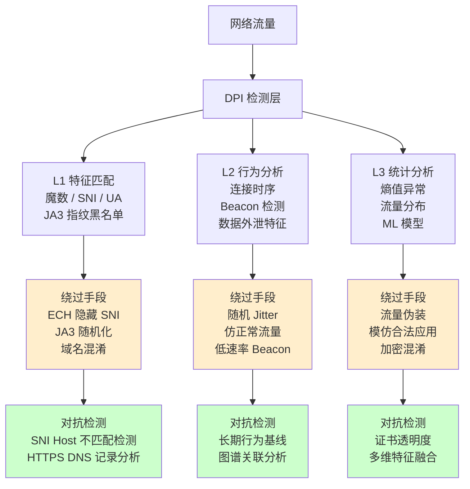

---
tags:
  - network
  - protocol-analysis
  - tier3
  - dpi
  - traffic-fingerprinting
  - ja3
  - domain-fronting
  - ech
---
# 流量特征分析与检测绕过

> [!abstract] TL;DR
> DPI（深度包检测）通过特征匹配、行为分析、统计检测三层机制识别流量。JA3 指纹基于 TLS ClientHello 字段的 MD5 可识别 TLS 客户端工具；Domain Fronting 和 ECH 是常见的流量混淆技术。理解这些攻防对抗机制是构建有效网络检测体系的前提。

## 概述与定位

流量特征分析是防御侧的核心能力——网络安全设备（防火墙、IDS/IPS、DLP）通过分析流量特征来识别威胁、执行访问控制。攻击者则不断发展绕过这些检测机制的技术，形成持续的对抗循环。

**防御侧需要了解绕过技术的原因：**
- 了解攻击面才能构建有效的检测规则
- 红队演练中复现攻击者 TTP（战术、技术、程序）
- 评估现有安全控制的覆盖范围与盲区
- 在受限网络环境中（如 VPN 出口、企业代理）理解流量行为

## 原理与机制

### DPI（深度包检测）三层检测机制

**第一层：特征匹配（Signature-based）**
- **魔数/协议标识**：HTTP 的 `GET/POST`、TLS 的 `\x16\x03`（Record 类型 + 版本）、BitTorrent 的 `\x13BitTorrent protocol`
- **SNI（Server Name Indication）**：TLS ClientHello 中明文包含的域名，是目前最主要的 DPI 识别点
- **HTTP User-Agent/Host**：明文 HTTP 头的应用指纹
- **DNS 域名**：基于域名的访问控制（DNSF）

**第二层：行为分析（Behavioral）**
- **流量时序特征**：数据包大小分布、间隔时间、突发性
- **连接模式**：C2 流量的心跳包（固定间隔的小包）、P2P 的多对多连接模式
- **协议合规性**：是否符合 RFC 定义（畸形报文可能是隧道工具特征）

**第三层：统计检测（Statistical）**
- **熵值分析**：加密/压缩数据的字节熵值接近 8，区别于明文（熵值 3-5）
- **流量比例**：双向流量字节比（C2 往往客户端上传极少）
- **连接持续时间分布**：Beacon 连接的固定间隔产生特征性时间序列

### JA3/JA3S TLS 指纹

JA3 由 Salesforce 的 John Althouse 等人开发，基于 TLS ClientHello 的以下字段生成 MD5 哈希：

```
JA3 字符串 = TLS版本,Cipher列表,Extension列表,EC曲线列表,EC点格式列表
```

**字段提取规则：**
- 去除 GREASE 值（0x0a0a, 0x1a1a, 0x2a2a, ... 这类探针值）
- 各字段内用 `-` 分隔，字段间用 `,` 分隔
- 最终对字符串计算 MD5

JA3S 是服务器响应版本（基于 ServerHello 字段），用于识别 TLS 服务器实现。

**JA3 数据库：**
- Salesforce `ja3er.com`（历史数据库，已归档）
- `tls.peet.ws` — 在线查询自己的 JA3 指纹
- Zeek 的 `ja3` 脚本（社区维护）输出到 `ssl.log` 的 `ja3` 字段

### Domain Fronting 原理

Domain Fronting 利用 CDN 的特性，将流量"藏"在合法域名后面：

```
客户端 SNI=cdn-front.cloudflare.com   ← DPI 看到的是 Cloudflare
      Host=actual-c2.cloudflare.com   ← CDN 内部路由到真实目的地

DPI 设备看到: TLS SNI = cdn-front.cloudflare.com (白名单)
CDN 内部路由: HTTP Host = actual-c2.cloudflare.com
实际目的地: actual-c2.cloudflare.com 的后端服务器
```

**现状：** 主要 CDN 厂商（Google/Cloudflare/AWS CloudFront）已通过 SNI 与 Host 一致性验证来封堵 Domain Fronting，但部分小型 CDN 仍存在此问题。

### ESNI/ECH（Encrypted Client Hello）

**ESNI（Encrypted SNI，已废弃）：** 将 SNI 字段用 CDN 公钥加密，DPI 无法读取目标域名。

**ECH（Encrypted Client Hello，RFC 草案）：** 更完整的解决方案，将整个 ClientHello 的内层（Inner ClientHello）加密，外层（Outer ClientHello）仅暴露代理域名（public_name）：

```
Outer ClientHello: SNI = public.example.com (ECH 代理入口)
Inner ClientHello: SNI = actual-private.com (加密，DPI 不可见)
```

ECH 需要客户端、服务器和 DNS（HTTPS 记录存储 ECH 配置）三方配合。

## 结构/算法/伪代码详解

### JA3 指纹计算示例

```python
import hashlib
from scapy.all import *

def extract_ja3(pkt):
    """
    从 TLS ClientHello 提取 JA3 字符串
    """
    # GREASE 值集合（RFC 8701）
    GREASE = {0x0a0a, 0x1a1a, 0x2a2a, 0x3a3a, 0x4a4a, 0x5a5a,
              0x6a6a, 0x7a7a, 0x8a8a, 0x9a9a, 0xaaaa, 0xbaba,
              0xcaca, 0xdada, 0xeaea, 0xfafa}

    if not pkt.haslayer(TLS):
        return None

    # 需要 Scapy 的 TLS 层（pip install scapy[crypto]）
    try:
        tls = pkt[TLS]
        if not hasattr(tls, 'msg') or len(tls.msg) == 0:
            return None

        ch = tls.msg[0]  # ClientHello
        if ch.msgtype != 1:  # 1 = ClientHello
            return None

        # 1. TLS 版本（ClientHello 中的 legacy_version）
        version = ch.version

        # 2. Cipher Suites（去除 GREASE）
        ciphers = [c for c in ch.ciphers if c not in GREASE]

        # 3. Extensions 类型列表（去除 GREASE）
        ext_types = []
        ec_curves = []
        ec_point_formats = []

        for ext in (ch.ext or []):
            ext_type = ext.type
            if ext_type in GREASE:
                continue
            ext_types.append(ext_type)

            # Extension 43 = supported_versions（提取实际协商版本）
            if ext_type == 43 and hasattr(ext, 'versions'):
                for v in ext.versions:
                    if v not in GREASE:
                        version = v  # 使用 supported_versions 中最高版本
                        break

            # Extension 10 = supported_groups (EC 曲线)
            if ext_type == 10 and hasattr(ext, 'groups'):
                ec_curves = [g for g in ext.groups if g not in GREASE]

            # Extension 11 = ec_point_formats
            if ext_type == 11 and hasattr(ext, 'ecpl'):
                ec_point_formats = list(ext.ecpl)

        # 4. 拼接 JA3 字符串
        ja3_str = ",".join([
            str(version),
            "-".join(str(c) for c in ciphers),
            "-".join(str(e) for e in ext_types),
            "-".join(str(g) for g in ec_curves),
            "-".join(str(p) for p in ec_point_formats)
        ])

        # 5. 计算 MD5
        ja3_hash = hashlib.md5(ja3_str.encode()).hexdigest()
        return ja3_str, ja3_hash

    except Exception as e:
        return None


# 从 pcap 文件中提取所有 JA3 指纹
def analyze_ja3_from_pcap(pcap_file):
    pkts = rdpcap(pcap_file)
    ja3_counter = {}

    for pkt in pkts:
        result = extract_ja3(pkt)
        if result:
            ja3_str, ja3_hash = result
            if ja3_hash not in ja3_counter:
                ja3_counter[ja3_hash] = {
                    'count': 0,
                    'string': ja3_str,
                    'sources': set()
                }
            ja3_counter[ja3_hash]['count'] += 1
            if pkt.haslayer(IP):
                ja3_counter[ja3_hash]['sources'].add(pkt[IP].src)

    # 输出统计（按出现次数排序）
    for ja3_hash, info in sorted(ja3_counter.items(),
                                  key=lambda x: x[1]['count'], reverse=True):
        print(f"JA3: {ja3_hash}")
        print(f"  次数: {info['count']}")
        print(f"  来源: {', '.join(sorted(info['sources']))}")
        print(f"  字符串: {info['string'][:80]}...")
        print()
```

### tshark 提取 JA3 字段

```bash
# tshark 内置 JA3 提取（Wireshark 3.0+）
tshark -r capture.pcap \
  -Y "tls.handshake.type == 1" \
  -T fields \
  -e ip.src \
  -e ip.dst \
  -e tls.handshake.ja3 \
  -e tls.handshake.extensions_server_name

# 统计 JA3 指纹分布
tshark -r capture.pcap \
  -Y "tls.handshake.type == 1" \
  -T fields -e tls.handshake.ja3 2>/dev/null | \
  sort | uniq -c | sort -rn

# 对比已知恶意 JA3 数据库
MALICIOUS_JA3="e7d705a3286e19ea42f587b344ee6865"
tshark -r capture.pcap \
  -Y "tls.handshake.ja3 == \"${MALICIOUS_JA3}\""
```

### Zeek JA3 检测脚本

```zeek
# ja3_detection.zeek
# 功能：记录 JA3 指纹并对已知恶意指纹告警

@load base/protocols/ssl

module JA3Detection;

export {
    redef enum Notice::Type += { Malicious_JA3 };

    # 已知恶意工具的 JA3 指纹（示例，实际从威胁情报更新）
    const malicious_ja3: set[string] = {
        "e7d705a3286e19ea42f587b344ee6865",  # Metasploit Meterpreter
        "6734f37431670b3ab4292b8f60f29984",  # CobaltStrike 默认
        "da4ab3e6f5748b74d0b8d6d3c13b2c73",  # 某 RAT 特征
    } &redef;
}

# 需要加载 ja3 脚本（Zeek 社区脚本）
# @load ja3

event ssl_client_hello(c: connection, version: count, record_version: count,
                       possible_ts: time, client_random: string,
                       session_id: string, ciphers: index_vec,
                       comp_methods: index_vec) {
    # 注：实际 ja3 计算需要 extension 信息，
    # 建议使用 https://github.com/salesforce/ja3 的 Zeek 脚本
    if (c$ssl?$ja3 && c$ssl$ja3 in malicious_ja3) {
        NOTICE([$note=Malicious_JA3,
                $msg=fmt("已知恶意 JA3 指纹: %s (来自 %s)",
                         c$ssl$ja3, c$id$orig_h),
                $conn=c,
                $identifier=c$ssl$ja3]);
    }
}
```

### Domain Fronting 检测

```python
# 检测 Domain Fronting：SNI 与 HTTP Host 不匹配
from scapy.all import *

def detect_domain_fronting(pcap_file):
    """
    检测 Domain Fronting：
    - 捕获 TLS ClientHello 中的 SNI
    - 关联同一 TCP 连接中的 HTTP Host 头
    - 若 SNI != Host，可能存在 Domain Fronting
    """
    # 实际实现需要完整的 TCP 流重组
    # 此处展示逻辑框架
    connections = {}  # uid -> {sni, host}

    pkts = rdpcap(pcap_file)
    for pkt in pkts:
        if pkt.haslayer(TCP):
            flow_id = f"{pkt[IP].src}:{pkt[TCP].sport}-{pkt[IP].dst}:{pkt[TCP].dport}"

            # 提取 SNI（TLS ClientHello Extension type=0）
            # 实际需要解析 TLS 层，此处简化
            if pkt.haslayer(Raw):
                payload = bytes(pkt[Raw])
                # TLS ClientHello 标识：0x16 0x03 xx 00 xx 01
                if len(payload) > 5 and payload[0] == 0x16 and payload[5] == 0x01:
                    # 简化：实际需完整解析 ClientHello
                    pass

    return connections
```

> [!caution] 责任边界：流量混淆技术的合规使用
> 本章描述的技术（Domain Fronting、ECH、JA3 随机化、流量混淆）具有双重属性：
>
> **合法用途：**
> - 防御研究：了解攻击者使用的混淆技术，以构建更有效的检测规则
> - 红队演练：在**已获书面授权**的渗透测试中复现 APT 的 C2 通信技术
> - 隐私保护研究：学术研究中评估 TLS 指纹的隐私泄露风险
> - 网络安全课程/CTF：在受控环境中学习和验证检测技术
>
> **严禁以下行为：**
> - 使用流量混淆技术规避合法的企业/运营商安全监控（未经授权改变受监管网络的流量行为）
> - 利用 Domain Fronting 等技术传播恶意软件或建立未授权的 C2 信道
> - 绕过国家/地区依法建立的网络安全检测基础设施
>
> 安全研究的发现应通过负责任披露（Responsible Disclosure）途径报告给相关厂商，而非直接公开可利用的绕过工具。

## 工具视角与实战

### JA3 分析工具链

```bash
# python-ja3 库（离线计算）
pip install pyja3
python -m ja3 capture.pcap

# 在线查询自己的 JA3 指纹
curl -s https://tls.peet.ws/api/all | python3 -m json.tool | grep ja3

# mlget —— 下载 Malware Traffic Analysis 公开 pcap 进行分析
# （学习目的，在隔离环境中操作）

# zeek-community-id —— 为 Zeek 日志添加 Community ID
# Community ID 是跨工具的流量唯一标识符（RFC 草案）
pip install communityid
```

### 随机化 JA3 指纹（防御评估用）

了解 JA3 随机化有助于评估基于 JA3 检测的有效性：

```bash
# curl 使用不同 TLS 配置（模拟不同 JA3）
curl --tlsv1.2 --tls-max 1.2 -k https://tls.peet.ws/api/all | grep ja3
curl --tlsv1.3 -k https://tls.peet.ws/api/all | grep ja3

# Golang 自定义 TLS 配置（不同 Cipher Suite 顺序）
# Python requests 配合 ssl 模块自定义 TLS 配置
# 这些技术用于验证：若攻击者随机化 JA3，检测会有多少误判
```

### DPI 规避技术总结（检测视角）

| 规避技术 | 原理 | 检测手段 |
|---|---|---|
| SNI 隐藏（ECH） | 加密 ClientHello | 检测 HTTPS DNS 记录 + ECH 扩展的流量模式 |
| Domain Fronting | SNI 与 Host 不一致 | SNI/Host 不匹配检测 |
| JA3 随机化 | 改变 Cipher 顺序 | 行为检测（连接时序/目标 IP 聚集度） |
| TLS over WebSocket | 协议封装 | 端口异常 + 流量熵值 |
| 端口跳转（Port Hopping） | 随机使用端口 | 行为分析，非端口特征 |
| 流量分片（IP 分片） | 规避基于报文的检测 | 重组后检测 |
| 域名生成算法（DGA） | 动态 C2 域名 | DNS NXDOMAIN 率 + 域名熵值 |

## 安全性与正确使用

### 构建有效的检测层次

基于对抗技术的了解，有效的网络检测体系应分层设计：

```
检测层次（由易绕过到难绕过）
┌─────────────────────────────────────────────┐
│ L1: 特征匹配（最易绕过）                    │
│   · 已知 C2 IP/域名黑名单                  │
│   · 已知恶意 JA3 指纹                      │
├─────────────────────────────────────────────┤
│ L2: 行为分析（中等难度绕过）                │
│   · Beacon 时序检测（RITA）                 │
│   · DNS 异常（高 NXDOMAIN、长 QNAME）       │
│   · 数据外泄特征（上传字节异常）            │
├─────────────────────────────────────────────┤
│ L3: 统计/ML 检测（最难绕过）               │
│   · 流量熵值异常                            │
│   · 连接图谱异常（新连接聚集）              │
│   · TLS 证书透明度异常                     │
└─────────────────────────────────────────────┘
```

## 小结

DPI 检测与流量混淆的对抗是网络安全领域持续演化的核心矛盾。JA3 指纹为 TLS 流量提供了工具指纹能力，Domain Fronting 和 ECH 代表了流量混淆技术的演进方向。有效的防御体系需要将特征匹配（L1）、行为分析（L2）和统计检测（L3）分层叠加，才能应对不断演进的绕过技术。

## 相关阅读

- [[11.Zeek协议分析框架|← ch11：Zeek协议分析框架]]
- [[13.抓包实战CTF与漏洞分析|→ ch13：抓包实战CTF与漏洞分析]]
- [[05.TLS握手与解密分析|← ch05：TLS握手与解密分析]]
- JA3 原始论文: https://github.com/salesforce/ja3
- ECH 规范（草案）: https://datatracker.ietf.org/doc/draft-ietf-tls-esni/
- RITA（基于 Zeek 的 C2 Beacon 检测）: https://github.com/activecm/rita



[[00.抓包与协议分析实战总览|⬆ 系列总览]] | [[11.Zeek协议分析框架|← 上一章]] | [[13.抓包实战CTF与漏洞分析|→ 下一章]]
