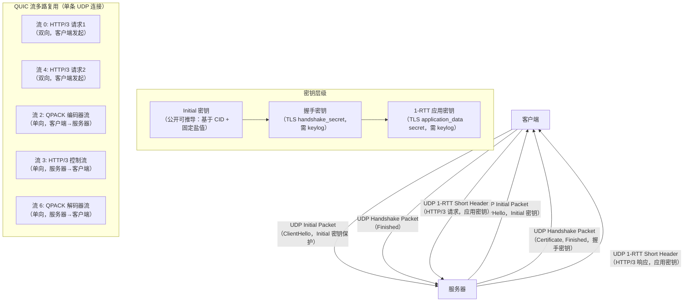
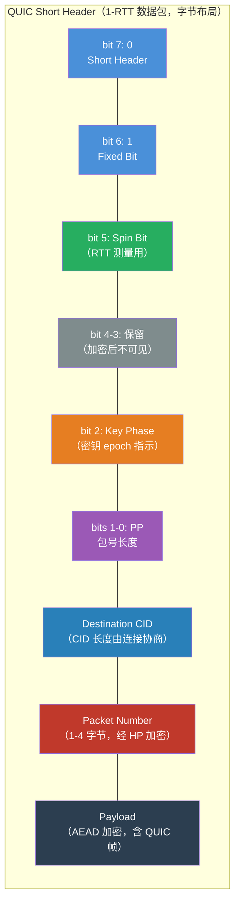

---
tags:
  - network
  - protocol-analysis
  - tier3
  - HTTP3
  - QUIC
---
# HTTP/3 与 QUIC 抓包解密

> [!abstract] TL;DR
> HTTP/3 将传输层从 TCP 换成 QUIC（RFC 9000），QUIC 跑在 UDP 上并将 TLS 1.3 握手内置于传输协议本身。结果是：连接建立最快 0-RTT、流级别独立有序消除了 TCP 的队头阻塞、支持 Connection ID 驱动的连接迁移。代价是：QUIC 数据包头也被加密，Wireshark 若无密钥连包边界都难辨；需要 `SSLKEYLOGFILE` 导出 QUIC 密钥后才能在 Wireshark 4.x 中完整解密。头部压缩从 HPACK 换成 QPACK，用两条单向 QUIC 流异步传递动态表更新，彻底消除了 HPACK 的队头阻塞风险。

## 概述与定位

### 为什么 HTTP/3 要换掉 TCP

HTTP/2 相对 HTTP/1.1 是巨大进步：多路复用流消除了应用层的队头阻塞（Head-of-Line Blocking，HOL blocking），HPACK 压缩减少了头部冗余。但 HTTP/2 有一个无法在不改变传输层的情况下修复的根本缺陷：**TCP 层的 HOL 阻塞**。

TCP 是字节顺序流，操作系统内核保证字节按发送顺序交付给应用层。如果第 N 号 TCP 段丢失，内核缓冲区会把后续所有已到达的段（N+1, N+2…）扣押，直到 N 号重传到达并拼接成完整序列。在 HTTP/2 的语境下，这意味着：就算丢失的那几个字节只属于流 3 的一帧数据，流 1、流 5、流 7 的数据也全部被阻塞，因为它们在 TCP 层是同一个字节流。

**QUIC 选择 UDP 的核心原因**：UDP 不提供顺序交付，每个 QUIC 数据包独立传输。QUIC 在 UDP 之上自己实现可靠性和有序交付，但以**流**为粒度：某个流的数据包丢失只阻塞该流，其他流的数据包继续向上递交。这才是真正消除了 HOL 阻塞。

### gQUIC 与 IETF QUIC 的历史分野

这是很多人搞混的一个点：QUIC 有两个不同的东西。

**gQUIC（Google QUIC）**：2013 年 Google 在 Chrome 和自家服务器之间实验性部署，协议细节是私有的，版本号用 Q039、Q046 等形式表示。它最重要的贡献是证明了"QUIC 这条路可行"，并为 IETF 标准化提供了大量实践数据。Wireshark 有独立的 gQUIC dissector（`quic` 过滤器下可见 `QUIC (Google)`）。

**IETF QUIC**：2016 年 QUIC 工作组成立，经过 34 个草案版本的迭代，2021 年 5 月发布 RFC 9000（QUIC Transport Protocol）、RFC 9001（Using TLS 1.3 with QUIC）、RFC 9002（QUIC Loss Detection and Congestion Control）。HTTP/3 对应 RFC 9114，QPACK 对应 RFC 9204。IETF QUIC 与 gQUIC 不兼容，是全新设计。本文除非特别说明，QUIC 均指 IETF QUIC。

**鉴别方法**：gQUIC 的 Long Header 中版本字段是 `Q046`、`Q050` 等（ASCII Q + 3 位数字），IETF QUIC 的版本字段是 `0x00000001`（版本 1）或草案版本号 `0xff000XXX`。抓到包后看版本字段即可区分。

### 主流部署现状

截至 2025 年，HTTP/3 在公网的覆盖率已超过 30%（各类统计来源不同，大致在 25%-35% 区间）。主要 CDN 和大型网站均已支持：Cloudflare、Akamai、Google（YouTube、搜索）、Meta（Facebook、Instagram）、Apple CDN 等。主流浏览器（Chrome 87+、Firefox 88+、Safari 14+、Edge）均已默认启用 HTTP/3。

对抓包分析的影响：以前抓到明文 TCP 流量有相当比例是可读的，现在越来越多的流量不仅加密，连传输层包结构都被 QUIC 的头加密遮蔽。理解 QUIC 成为网络分析的必备技能。

---

## 原理与机制

### QUIC 握手：TLS 1.3 内置于传输层

传统 HTTPS 连接的握手分两个独立阶段：TCP 三次握手（1-RTT），然后 TLS 握手（1-RTT 或 1.5-RTT）。两者加在一起，从发起连接到能发送第一个 HTTP 请求至少需要 2 RTT。这是 HTTP/2 over HTTPS 的固有延迟。

QUIC 把 TLS 1.3 深度集成到传输层：**QUIC 没有独立的传输层握手，TLS 握手就是 QUIC 连接建立的过程**。

#### 1-RTT 握手流程

```
客户端                                    服务器
  │                                          │
  │── Initial (CRYPTO: ClientHello) ────────>│
  │                                          │  服务器处理 ClientHello
  │<─── Initial (CRYPTO: ServerHello)  ──────│
  │<─── Handshake (CRYPTO: EncryptedExt,     │
  │               Certificate,               │
  │               CertVerify, Finished) ─────│
  │                                          │
  │── Handshake (CRYPTO: Finished)  ────────>│
  │── Short Header (1-RTT: HTTP/3 请求)  ───>│
  │                                          │  ← 第1个RTT内服务器可接收1-RTT数据
  │<── Short Header (1-RTT: HTTP/3 响应) ────│
```

第 1 RTT：客户端发 Initial 包，服务器收到后既能完成 TLS 密钥协商，又在同一 RTT 内回复 Handshake 包。客户端收到后就可以用 1-RTT 密钥发送 HTTP/3 请求，**无需等待第二次握手**。比较 TCP+TLS1.3 的 2 RTT，QUIC 节省了 1 RTT。

#### 0-RTT 握手（重连加速）

如果客户端曾经与服务器成功建立 QUIC 连接，服务器会在 NewSessionTicket 消息中提供会话票据和 `early_data` 参数（0-RTT 开放大小、ALPN 等）。下次连接时：

```
客户端                                    服务器
  │── Initial (CRYPTO: ClientHello,          │
  │            0-RTT_EARLY_DATA flag)        │
  │── 0-RTT (CRYPTO: HTTP/3 请求)  ─────────>│  ← 发出即可，无需等回复
  │                                          │
  │<── Initial (CRYPTO: ServerHello) ────────│
  │<── Handshake (CRYPTO: EncryptedExt...)   │
  │<── 1-RTT 响应                            │
```

0-RTT 请求在握手完成之前就随 ClientHello 一同发出，理论上 0 RTT 延迟。代价是**重放风险**（见"安全性"小节）。

#### 包类型与密钥层级

QUIC 握手过程中使用多种密钥保护不同阶段的数据包：

| 包类型 | 密钥来源 | 用途 |
|--------|----------|------|
| Initial Packet | 固定推导（基于 Connection ID，RFC 9001 §5.2）| 承载 TLS ClientHello/ServerHello、CRYPTO 帧 |
| 0-RTT Packet | 会话票据中的 early_secret | 承载 0-RTT 数据（HTTP/3 请求）|
| Handshake Packet | TLS handshake_secret | 承载 Certificate、CertVerify、Finished |
| Short Header (1-RTT) | TLS application_data secret | 承载实际 HTTP/3 数据 |

**Initial Packet 的"公开加密"**：Initial 包的密钥是从 Destination Connection ID 用固定盐值（`0x38762cf7f55934b34d179ae6a4c80cadccbb7f0a`，RFC 9001 §A.1）推导的，任何人都能计算。这意味着 Wireshark 无需任何额外密钥就能解密 Initial 包，可以看到 TLS ClientHello/ServerHello 的完整内容（包括 SNI、ALPN、支持的密码套件等）。但 Handshake 和 1-RTT 包需要 TLS 会话密钥，这正是 `SSLKEYLOGFILE` 的价值所在。

### Connection ID 与连接迁移

TCP 连接由 4 元组（源 IP、源端口、目的 IP、目的端口）唯一标识，任何一个元素变化都会导致连接断开。移动设备从 Wi-Fi 切换到 4G 时，源 IP 变化，所有 TCP 连接必须重建。对于 HTTP/2 的长连接（如视频流），这意味着明显的卡顿。

QUIC 引入了 **Connection ID（连接 ID，CID）** 机制。QUIC 连接在网络层面不是绑定到 4 元组，而是绑定到 Connection ID。CID 由对端分配，以 Long/Short Header 中的字段携带。当底层 UDP 4 元组发生变化（IP 切换、NAT 重绑定等），只要 QUIC 包中携带的 CID 不变，接收端就能识别出这是同一个连接，**无需重新握手**。

CID 有几个细节值得注意：
- 每端各自分配自己的 CID，用于标识"我方视角下的连接"
- 为防止路径上的被动观察者追踪用户路径迁移，QUIC 支持在迁移时更换 CID（配合 NEW_CONNECTION_ID 帧），新旧 CID 之间的关联对路径中间设备不可见
- Short Header 中只有 Destination CID，没有 Source CID（握手后通信只需目的方 CID）
- CID 长度可变（0-20 字节），实际部署中 Cloudflare 用 8 字节，Google 用 16 字节

### QUIC 包结构详解

QUIC 包有两类 Header 格式，由第一个字节的最高位（Header Form bit）区分：

#### Long Header（握手阶段）

Long Header 用于 Initial、0-RTT、Handshake、Retry 包类型，结构如下：

```
 0                   1                   2                   3
 0 1 2 3 4 5 6 7 8 9 0 1 2 3 4 5 6 7 8 9 0 1 2 3 4 5 6 7 8 9 0 1
┌─┬─┬─┬─┬─┬─┬─┬─┬─────────────────────────────────────────────────┐
│1│F│T│T│ │ │ │ │          Version (32 bits)                      │
└─┴─┴─┴─┴─┴─┴─┴─┴─────────────────────────────────────────────────┘
│ Destination Connection ID Length (8 bits)                       │
├─────────────────────────────────────────────────────────────────┤
│ Destination Connection ID (0..160 bits, 0-20 bytes)            │
├─────────────────────────────────────────────────────────────────┤
│ Source Connection ID Length (8 bits)                            │
├─────────────────────────────────────────────────────────────────┤
│ Source Connection ID (0..160 bits, 0-20 bytes)                  │
├─────────────────────────────────────────────────────────────────┤
│ Type-Specific Fields...                                         │
│ （Initial: Token Length + Token + Length + Packet Number）      │
└─────────────────────────────────────────────────────────────────┘
```

关键字段：
- **Header Form (bit 7)**：1 = Long Header
- **Fixed Bit (bit 6)**：固定为 1（用于版本协商检测）
- **Long Packet Type (bits 4-5)**：00=Initial, 01=0-RTT, 10=Handshake, 11=Retry
- **Version**：`0x00000001` 表示 QUIC v1（RFC 9000）；`0x00000000` 是 Version Negotiation 特殊值
- **Token**（仅 Initial 包）：地址验证用的令牌（Retry Token 或 NEW_TOKEN 帧提供的令牌），服务器通过 Retry 包要求客户端携带，防止 IP 欺骗 / DDoS 放大

#### Short Header（数据传输阶段，1-RTT）

握手完成后，通信切换到 Short Header 以减少开销：

```
 0                   1   ...
 0 1 2 3 4 5 6 7 8 9 0
┌─┬─┬─┬─┬─┬─┬─┬─┬─────────────────────────────────┐
│0│1│S│R│R│K│P│P│ Destination Connection ID       │
└─┴─┴─┴─┴─┴─┴─┴─┴─────────────────────────────────┘
│ Packet Number (1-4 bytes, encrypted)            │
├─────────────────────────────────────────────────┤
│ Payload (encrypted)                             │
└─────────────────────────────────────────────────┘
```

- **Header Form (bit 7)**：0 = Short Header
- **Spin Bit (bit 2, S)**：用于被动 RTT 测量，路径监控设备可以据此估算 RTT，而无需解密载荷（这是 QUIC 在加密化的同时主动暴露给网络可观测性的有限信息之一）
- **Key Phase (bit 2, K)**：指示当前使用的密钥 epoch，用于密钥更新（Key Update，RFC 9001 §6）
- **Packet Number Length (bits 0-1, PP)**：包号占几个字节（1/2/3/4）
- **没有 Source CID**：握手阶段双方已协商好 CID，数据阶段只需目的 CID

#### 包号保护（Header Protection）

这是 QUIC 与 TLS-over-TCP 的一个重要区别：QUIC 不仅加密 Payload，还对 Header 的**包号（Packet Number）字段**和 Long Header 的部分标志位进行加密（Header Protection，RFC 9001 §5.4）。

保护原因：包号如果明文，路径上的中间设备可以推断包的丢失/重传模式（类似 TCP 序号分析），泄露连接的传输层状态。QUIC 用 AEAD 密文的一部分作为掩码对包号做 XOR，使其不可直接读取。

Wireshark 解密 QUIC 时需要先去除 Header Protection，再解密 Payload，顺序不能颠倒。这也是 QUIC 解密比 TLS-over-TCP 更复杂的原因。

### QUIC 流（Stream）

QUIC 流是连接内的独立有序字节序列，流之间完全并行，不存在 TCP 那种全局字节顺序约束。

**流 ID 编码**：流 ID 是 62 位整数，由两个低位标识属性：

| 低 2 位 | 发起方 | 方向 | 典型用途 |
|---------|--------|------|----------|
| `0b00` (0) | 客户端 | 双向 | HTTP/3 请求/响应 |
| `0b01` (1) | 服务器 | 双向 | 服务器主动的双向流 |
| `0b10` (2) | 客户端 | 单向 | HTTP/3 QPACK 编码器流 |
| `0b11` (3) | 服务器 | 单向 | HTTP/3 QPACK 解码器流、控制流 |

客户端发起的第一个双向流 ID 为 0，第二个为 4，第三个为 8——每次加 4（低两位固定为 `00`）。

**流量控制**：QUIC 在连接级和流级各维护独立的流量控制窗口，通过 `MAX_DATA` 帧（连接级）和 `MAX_STREAM_DATA` 帧（流级）通告接收窗口。发送方不能超过接收方通告的窗口发送数据，否则被对端视为协议违规。

**帧类型**：QUIC 帧承载于 QUIC 包的 Payload 中，一个 Payload 可以包含多个帧。主要帧类型：

| 帧类型 | 功能 |
|--------|------|
| `STREAM` | 携带流数据（Stream ID + Offset + Data）|
| `CRYPTO` | 握手阶段 TLS 消息（不属于任何流）|
| `ACK` | 确认收到的包号范围 |
| `RESET_STREAM` | 中止发送方向的流 |
| `STOP_SENDING` | 要求对端中止发送 |
| `MAX_DATA` | 增加连接级接收窗口 |
| `MAX_STREAM_DATA` | 增加流级接收窗口 |
| `NEW_CONNECTION_ID` | 提供新的 CID 供对端使用 |
| `RETIRE_CONNECTION_ID` | 通知废弃某个 CID |
| `PATH_CHALLENGE/PATH_RESPONSE` | 路径验证（连接迁移时使用）|
| `CONNECTION_CLOSE` | 关闭连接（带错误码）|
| `HANDSHAKE_DONE` | 服务器通知握手完成（仅服务器发）|

### HTTP/3 帧结构

HTTP/3（RFC 9114）是运行在 QUIC 之上的应用层协议，将 HTTP 语义映射到 QUIC 流。一个 HTTP/3 请求/响应对使用一条双向 QUIC 流。

HTTP/3 帧格式（在 QUIC STREAM 帧的 data 字段中）：

```
Type (Variable-Length Integer)
Length (Variable-Length Integer)
Payload (Length bytes)
```

主要帧类型：

| 帧类型 | 类型值 | 含义 |
|--------|--------|------|
| `DATA` | 0x00 | HTTP 消息体 |
| `HEADERS` | 0x01 | HTTP 头部（QPACK 编码）|
| `CANCEL_PUSH` | 0x03 | 取消服务器推送 |
| `SETTINGS` | 0x04 | 连接参数协商（通过控制流发送）|
| `PUSH_PROMISE` | 0x05 | 服务器推送承诺 |
| `GOAWAY` | 0x07 | 优雅关闭连接 |
| `MAX_PUSH_ID` | 0x0d | 客户端控制最大推送 ID |

**HTTP/3 控制流**：服务器和客户端各自用一条单向 QUIC 流（服务器 ID 通常为 3，客户端 ID 通常为 2）作为控制流，发送 SETTINGS 帧。控制流上的帧不对应特定 HTTP 请求，是连接级配置。

**无服务器推送的实际情况**：HTTP/3 虽然保留了 Push 相关帧，但主流实现（Chrome、Firefox）已禁用服务器推送（浏览器方面认为其实际性能收益不如预期），实际抓包中几乎看不到 PUSH_PROMISE 帧。

### QPACK：HPACK 的无 HOL 阻塞继承者

HTTP/2 的 HPACK 在单个 TCP 连接上工作良好，但 HTTP/3 的多流特性带来了新问题：如果流 A 的 HEADERS 帧引用了一个新增到动态表的条目，而流 B 的 HEADERS 帧在流 A 的动态表更新到达接收端之前就需要使用同一条目，流 B 就必须等待——这是**头部压缩层面的 HOL 阻塞**。

QPACK（RFC 9204）用两条专用单向流解决了这个问题：

**Encoder Stream（编码器流）**：发送方（如客户端）将动态表更新（`Insert With Name Reference`、`Insert With Literal Name`、`Duplicate`）通过这条单向流异步发送给接收方。编码器流上的消息不与任何具体的 HTTP 请求绑定。

**Decoder Stream（解码器流）**：接收方通过这条单向流发送 `Section Acknowledgment`（确认特定请求头部已被处理）和 `Insert Count Increment`（确认动态表条目已插入），让编码器知道动态表同步进度。

**Required Insert Count**：每个 HEADERS 帧携带一个 `Required Insert Count` 字段，声明解码这组头部所需的最小动态表条目数。接收端收到 HEADERS 帧后，如果当前动态表条目数少于 Required Insert Count，将该 HEADERS 帧放入**阻塞等待队列**，待编码器流上的动态表更新到达、条目数满足要求后再解码。这样一来，头部解码的等待被限制在单个流内部，不会蔓延到其他流。

**Literal vs 引用**：QPACK 支持用"字面量不需要动态表引用"的方式编码头部，避免对编码器流同步的依赖。代价是压缩率略低，但避免了任何阻塞风险。

**与 HPACK 对比：**

| 特性 | HPACK（HTTP/2）| QPACK（HTTP/3）|
|------|---------------|---------------|
| 动态表更新方式 | 内嵌于 HEADERS 帧（同流同步）| 独立编码器流（异步）|
| HOL 阻塞风险 | 存在（动态表更新必须有序）| 无（独立流解耦）|
| 阻塞机制 | 无显式阻塞控制 | Required Insert Count + 阻塞队列 |
| 静态表 | 61 条 | 99 条（更完整，含常见 cookie/content-type 值）|
| 适用传输层 | TCP（有序字节流）| QUIC（多路复用流）|

---

## 结构/算法/伪代码详解

### Initial 包密钥推导（RFC 9001 §5.2）

Initial 包的密钥是唯一无需 `SSLKEYLOGFILE` 就能计算的，推导流程：

```python
import hmac, hashlib, struct

# HKDF-Extract 和 HKDF-Expand-Label 简化实现（实际用 cryptography 库）

INITIAL_SALT = bytes.fromhex(
    "38762cf7f55934b34d179ae6a4c80cadccbb7f0a"  # QUIC v1 固定盐值
)

def hkdf_extract(salt: bytes, ikm: bytes) -> bytes:
    """HKDF-Extract: 用盐值和初始密钥材料生成伪随机密钥"""
    return hmac.new(salt, ikm, hashlib.sha256).digest()

def hkdf_expand_label(secret: bytes, label: str, context: bytes, length: int) -> bytes:
    """TLS 1.3 HKDF-Expand-Label"""
    label_bytes = b"tls13 " + label.encode()
    hkdf_label = (
        struct.pack(">H", length) +
        bytes([len(label_bytes)]) + label_bytes +
        bytes([len(context)]) + context
    )
    # HKDF-Expand(secret, info=hkdf_label, length=length)
    # 此处省略 HMAC 迭代细节，参考 RFC 5869
    ...

def derive_initial_secrets(client_dst_conn_id: bytes):
    """从 Client 的 Destination Connection ID 推导 Initial 包密钥"""
    # 1. HKDF-Extract 生成 initial_secret
    initial_secret = hkdf_extract(INITIAL_SALT, client_dst_conn_id)
    
    # 2. 分别推导客户端和服务器的 Initial secret
    client_initial = hkdf_expand_label(initial_secret, "client in", b"", 32)
    server_initial = hkdf_expand_label(initial_secret, "server in", b"", 32)
    
    # 3. 从各自 Initial secret 推导加密密钥、IV、HP 密钥
    client_key = hkdf_expand_label(client_initial, "quic key", b"", 16)   # AES-128-GCM
    client_iv  = hkdf_expand_label(client_initial, "quic iv",  b"", 12)
    client_hp  = hkdf_expand_label(client_initial, "quic hp",  b"", 16)   # Header Protection
    
    return client_key, client_iv, client_hp
```

Wireshark 内置了这套推导逻辑，因此无需任何密钥文件就能解密 Initial 包，在包详情中可以展开看到完整的 TLS ClientHello/ServerHello 内容，包括 `quic_transport_parameters` 扩展（承载 QUIC 的 `max_streams`、`initial_max_data` 等传输参数）。

### Handshake 和 1-RTT 包解密流程

Handshake 和 1-RTT 包使用 TLS 1.3 密钥交换协商出的密钥，这些密钥无法离线推导。Wireshark 通过 `SSLKEYLOGFILE` 获取：

```
# SSLKEYLOGFILE 格式（NSS Key Log Format，每行一条）
CLIENT_HANDSHAKE_TRAFFIC_SECRET <client_random_hex> <secret_hex>
SERVER_HANDSHAKE_TRAFFIC_SECRET <client_random_hex> <secret_hex>
CLIENT_TRAFFIC_SECRET_0 <client_random_hex> <secret_hex>
SERVER_TRAFFIC_SECRET_0 <client_random_hex> <secret_hex>

# QUIC 特有行（有些实现会区分导出）
QUIC_CLIENT_HANDSHAKE_TRAFFIC_SECRET ...
QUIC_SERVER_HANDSHAKE_TRAFFIC_SECRET ...
QUIC_CLIENT_TRAFFIC_SECRET_0 ...
QUIC_SERVER_TRAFFIC_SECRET_0 ...
```

Wireshark 用这些 secret 重新执行 HKDF-Expand-Label，推导出各 epoch 的 AEAD 密钥和 IV，以及 Header Protection 密钥，然后：

1. 用 HP 密钥对包头的 Packet Number 字段和部分标志位进行解保护（XOR 掩码还原）
2. 用 AEAD 密钥（AES-128-GCM 或 ChaCha20-Poly1305）解密 Payload

两步缺一不可，且必须顺序执行。

### Header Protection 的 AES-ECB 掩码机制

```
# 从 Payload 密文中取 Sample（跳过包号后 4 字节，取接下来 16 字节）
sample_offset = packet_number_offset + 4
sample = payload_ciphertext[sample_offset : sample_offset + 16]

# 用 HP 密钥对 Sample 做 AES-ECB 加密，得到掩码
mask = AES_ECB_encrypt(hp_key, sample)

# 还原 Long Header 的包类型标志位（低两位）
first_byte = first_byte ^ (mask[0] & 0x0f)

# 还原包号（1-4 字节，取决于包号长度指示位）
pn_length = (first_byte & 0x03) + 1  # 包号还原后的长度
for i in range(pn_length):
    packet_number[i] = packet_number[i] ^ mask[1 + i]
```

ChaCha20-Poly1305 变体用 ChaCha20 keystream 替代 AES-ECB 生成掩码，但原理相同。

### QPACK 编解码伪代码

```python
class QpackDecoder:
    def __init__(self):
        self.static_table = build_static_table()  # 99 条预设条目
        self.dynamic_table = []  # LIFO，从编码器流更新
        self.blocked_streams = {}  # 等待动态表的流
        self.insert_count = 0  # 当前动态表已插入条目数
    
    def on_encoder_stream_data(self, data: bytes):
        """处理编码器流传来的动态表更新指令"""
        instruction = parse_encoder_instruction(data)
        if instruction.type == "Insert With Name Reference":
            name = self.static_table[instruction.name_index].name
            self.dynamic_table.insert(0, HeaderField(name, instruction.value))
            self.insert_count += 1
        elif instruction.type == "Insert With Literal Name":
            self.dynamic_table.insert(0, HeaderField(instruction.name, instruction.value))
            self.insert_count += 1
        # 检查是否有之前阻塞的流可以继续解码
        self._unblock_streams()
    
    def decode_headers(self, encoded: bytes, stream_id: int) -> list:
        """解码 HTTP/3 HEADERS 帧中的 QPACK 编码头部"""
        required_insert_count, sign, delta_base = parse_required_insert_count(encoded)
        
        if self.insert_count < required_insert_count:
            # 动态表条目还不足，暂存等待
            self.blocked_streams[stream_id] = (encoded, required_insert_count)
            return None  # 稍后通过 _unblock_streams 触发解码
        
        base = compute_base(required_insert_count, sign, delta_base)
        headers = []
        for field_repr in parse_field_representations(encoded[...]):
            if field_repr.indexed:
                index = field_repr.index
                if index < 0:  # 相对于 base 的负索引
                    header = self.dynamic_table[base - 1 - index]
                else:
                    header = self.static_table[index]
                headers.append(header)
            else:
                headers.append(HeaderField(field_repr.name, field_repr.value))
                if field_repr.with_post_base_indexing:
                    self.dynamic_table.insert(0, headers[-1])
                    self.insert_count += 1
        return headers
    
    def _unblock_streams(self):
        """尝试解除因动态表不足而阻塞的流"""
        to_unblock = [sid for sid, (_, ric) in self.blocked_streams.items()
                      if self.insert_count >= ric]
        for sid in to_unblock:
            encoded, _ = self.blocked_streams.pop(sid)
            self.decode_headers(encoded, sid)  # 重新触发解码
```

### QUIC 版本协商机制

当服务器不支持客户端请求的 QUIC 版本时（例如客户端发 QUIC v2，服务器只支持 QUIC v1），服务器发 Version Negotiation 包：

```
Version Negotiation Packet:
  Header Form = 1 (Long Header)
  Version = 0x00000000 (特殊标志)
  Destination Connection ID = 客户端的 Source CID（回显）
  Source Connection ID = 服务器的 CID
  Supported Versions:
    0x00000001  (QUIC v1)
    0x709a50c4  (QUIC v2, RFC 9369)
    ...
```

Version Negotiation 包本身不加密（无 Payload 保护），Wireshark 无需密钥即可解析。

---

## 工具视角与实战

### 为何 QUIC 流量"难抓"

比起 TCP/TLS，QUIC 抓包有几个额外障碍：

**1. UDP 路由问题**：许多家用路由器、防火墙和企业代理对 UDP 的长连接处理不佳，会主动超时 UDP 映射（NAT 超时通常 30 秒，而 TCP 超时 5 分钟）。部分防火墙直接封堵 443/UDP。浏览器遇到这种情况会回退到 TCP（通过 Alt-Svc 响应头，服务器广播支持 HTTP/3，浏览器尝试并发起 QUIC 连接，若失败自动降级）。抓包时若怀疑 QUIC 被阻断，先确认 `udp port 443` 有无流量。

**2. 传输层头也被加密**：TCP 的序号、ACK 号、标志位都是明文，任何中间设备都能看到。QUIC 的包号被 Header Protection 加密，Short Header 更是只有 Destination CID 可见。没有密钥的抓包者甚至难以确认 Payload 边界（多个 QUIC 包可能合并在一个 UDP 报文中，解析需要先解 Header Protection）。

**3. 连接 ID 轮换干扰追踪**：连接迁移时 CID 可能更换，Wireshark 的"Follow QUIC Stream"功能需要依赖 CID 关联包归属，CID 轮换可能导致流追踪断裂。

**4. 0-RTT 顺序**：0-RTT 包在握手完成之前发出，重放场景下可能出现包的时间顺序与逻辑顺序不一致，分析时需注意。

### 环境准备：SSLKEYLOGFILE 配置

#### 浏览器

```bash
# Linux / macOS
export SSLKEYLOGFILE=/tmp/quic_keys.log
google-chrome --enable-quic --quic-version=h3 &
# 或 Firefox
firefox &

# Windows（PowerShell）
$env:SSLKEYLOGFILE = "C:\tmp\quic_keys.log"
Start-Process "C:\Program Files\Google\Chrome\Application\chrome.exe"
```

Firefox 可在 `about:config` 中设置 `security.tls.nss_key_log_file` 为日志路径，无需环境变量（更稳定）。

#### curl（libcurl 编译了 NSS 或 BoringSSL 时支持）

```bash
SSLKEYLOGFILE=/tmp/curl_keys.log curl --http3-only https://cloudflare-quic.com/
# --http3-only 强制 HTTP/3，若服务器不支持则报错（与 --http3 区别：后者允许降级）
```

#### Python（aioquic）

```python
import os
os.environ["SSLKEYLOGFILE"] = "/tmp/aioquic_keys.log"
# aioquic 会自动调用 SSL_CTX_set_keylog_callback 写入 keylog
```

#### Wireshark 配置密钥

菜单：`Edit → Preferences → Protocols → TLS → (Pre)-Master-Secret log filename`，填入 keylog 文件路径。

**重要**：QUIC 密钥通过同一入口配置（Wireshark 4.x 将 QUIC 密钥解密集成在 TLS 首选项下）。配置后在 QUIC 包详情中应能看到 `[QUIC Layer Decrypted]` 标记。

### Wireshark 4.x QUIC 实战操作

#### 基础过滤器

```
# 所有 QUIC 流量
quic

# 按包类型过滤
quic.header_form == 1          # Long Header（握手阶段）
quic.long.packet_type == 0     # Initial 包
quic.long.packet_type == 1     # 0-RTT 包
quic.long.packet_type == 2     # Handshake 包
quic.header_form == 0          # Short Header（1-RTT 数据）

# 按 Connection ID 过滤（16 进制字符串）
quic.dcid == "a1b2c3d4e5f6a7b8"

# 按 QUIC 版本
quic.version == 0x00000001     # QUIC v1

# HTTP/3 帧（需先解密）
http3
http3.type == 0x01             # HEADERS 帧
http3.type == 0x00             # DATA 帧

# 结合追踪
# 右键某个 QUIC 包 → Follow → QUIC Stream（选择流 ID）
```

#### 查看 TLS ClientHello（Initial 包，无需密钥）

Initial 包不需要 keylog 即可解密，点击任意 Initial 包展开 Packet Details：

```
QUIC IETF
  [Packet Length: 1200]       ← Initial 包通常填充到 1200 字节（PMTUD 友好）
  Long Header Packet (QUIC v1)
    1... .... = Header Form: Long Header (1)
    .1.. .... = Fixed Bit: True
    ..00 .... = Long Packet Type: Initial Packet (0)
    Destination Connection ID: a1b2c3d4e5f6a7b8 (8 bytes)
    Source Connection ID: (0 bytes)
    Token Length: 0
    Packet Number: 0
    [Decrypted Payload: ...]
      CRYPTO frame
        TLS: TLSv1.3 Record Layer: Handshake Protocol: Client Hello
          Extension: quic_transport_parameters
            initial_max_stream_data_bidi_local: 262144
            initial_max_data: 1048576
            max_idle_timeout: 30000ms
```

#### 密钥导入后的 HTTP/3 解密

导入 keylog 后，Short Header 包的 Payload 解密为 HTTP/3 帧：

```
Short Header Packet (QUIC v1)
  [Decrypted Payload]
    HTTP3
      Type: HEADERS (1)
      Length: 47
      [Decoded Header Fields]
        :method: GET
        :scheme: https
        :authority: example.com
        :path: /api/data
        accept-encoding: gzip, br, zstd
        user-agent: Mozilla/5.0 ...
```

#### 常见问题排查

| 现象 | 原因 | 解决 |
|------|------|------|
| QUIC 包显示 `[Encrypted Payload]`，无法展开 | 未配置 keylog 或文件路径错误 | 检查 Wireshark TLS 首选项中的 keylog 路径 |
| Initial 包也无法解密 | 可能是 gQUIC 而非 IETF QUIC | 查看版本字段，gQUIC 用独立 dissector |
| 抓不到 UDP 443 包 | 防火墙封堵 QUIC，流量走 TCP | 检查 `tcp port 443` 是否有对应流量 |
| Wireshark 报 `QUIC: Failed to decrypt` | keylog 中缺少该连接的密钥行 | 确认程序在抓包前/同时启动，keylog 已写入 |
| Follow QUIC Stream 追踪中断 | CID 轮换导致流追踪断裂 | 尝试手动合并，或关闭连接迁移特性测试 |

### qlog 与 qvis：QUIC 可视化分析

Wireshark 展示的是 UDP 包级别的 QUIC 解析，对于分析连接迁移、拥塞控制、0-RTT 时序等高层行为，**qlog**（RFC 9473）是更强大的工具。

qlog 是 QUIC 实现导出的结构化日志格式（JSON 行，`.sqlog` 或 `.qlog` 扩展名），记录每个事件：

```json
{"time": 0, "name": "transport:packet_sent", "data": {
  "header": {"packet_type": "initial", "packet_number": 0},
  "frames": [{"frame_type": "crypto", "offset": 0, "length": 245}]
}}
{"time": 12.3, "name": "transport:packet_received", "data": {
  "header": {"packet_type": "initial", "packet_number": 0},
  "frames": [{"frame_type": "ack", "acked_ranges": [[0, 0]]}]
}}
{"time": 12.3, "name": "transport:packet_received", "data": {
  "header": {"packet_type": "handshake", "packet_number": 0},
  ...
}}
```

主流 QUIC 实现的 qlog 开关：

```bash
# aioquic（Python）
python3 http3_client.py --quic-log /tmp/quic_log https://example.com/

# quiche（Rust/C，Cloudflare 使用）
SSLKEYLOGFILE=keys.log RUST_LOG=trace ./quiche-client https://example.com/ 2>quic.qlog

# ngtcp2 / nghttp3
ngtcp2_client --qlog-file=/tmp/client.qlog https://example.com/

# Node.js（--experimental-quic，实验特性）
# picoquic、msquic、quic-go 等均有 qlog 支持
```

**qvis**（https://qvis.quictools.info/）是配套的在线可视化工具，上传 qlog 文件后可以看到：
- **序列图**：包发送/接收的时序，ACK 确认帧，丢包重传
- **拥塞控制图**：拥塞窗口随时间变化，cwnd 大小，丢包事件
- **流利用率**：各流数据量随时间分布
- **RTT 图**：min RTT、smoothed RTT 趋势

对于诊断 QUIC 性能问题（如拥塞窗口突然收缩、某流被阻塞）,qlog + qvis 比 Wireshark 更直观。

### 命令行工具实战

#### curl 测试 HTTP/3

```bash
# 检查 curl 是否编译了 HTTP/3 支持
curl --version | grep -i quic
# 输出应包含类似：Features: ... HTTP3 ...

# 基础 HTTP/3 请求
curl -v --http3 https://cloudflare-quic.com/
# -v 显示协议协商过程，注意看 "Using HTTP/3 Stream ID: 0"

# 强制 HTTP/3（不降级）
curl --http3-only https://quic.nginx.org/

# 查看 QUIC 传输参数（Chrome DevTools Network 也能看）
curl -v --http3 https://quic.aiortc.org/ 2>&1 | head -50

# 同时导出 keylog
SSLKEYLOGFILE=/tmp/curl_quic.log curl --http3-only https://cloudflare-quic.com/
```

#### aioquic 客户端

```bash
pip install aioquic

# 基础 HTTP/3 客户端请求
python3 -m aioquic.examples.http3_client \
    --quic-log /tmp/quic.qlog \
    https://quic.aiortc.org/

# 0-RTT 测试（第二次连接使用 session ticket）
python3 -m aioquic.examples.http3_client \
    --session-ticket /tmp/session.ticket \
    --quic-log /tmp/quic_0rtt.qlog \
    https://quic.aiortc.org/
# 观察 qlog 中是否出现 0-RTT 包类型
```

#### tcpdump 抓 QUIC

```bash
# 抓取 UDP 443 端口的 QUIC 流量
tcpdump -i eth0 -w quic_capture.pcap 'udp port 443'

# 结合 keylog 在命令行解析（tshark）
tshark -r quic_capture.pcap \
    -o "tls.keylog_file:/tmp/quic_keys.log" \
    -Y "http3" \
    -T fields \
    -e http3.headers.method \
    -e http3.headers.path \
    -e http3.headers.status
```

#### Scapy 构造 QUIC 初始包

```python
# 注意：Scapy 对 QUIC 的支持仍在开发中（2024 版本起逐渐完善）
# 以下为概念示例，实际操作建议用 aioquic 或 picoquic

from scapy.layers.quic import QUIC, QUICInitial  # 需要 Scapy ≥ 2.5.x

# 手动构造 Initial 包演示（不含完整 TLS ClientHello）
pkt = (
    IP(dst="1.2.3.4") /
    UDP(dport=443) /
    QUICInitial(
        version=0x00000001,
        dcid=b"\xa1\xb2\xc3\xd4\xe5\xf6\xa7\xb8",
        scid=b"\x00" * 8,
    )
)
# 发送前需要手动填充 CRYPTO 帧（TLS ClientHello）和 PADDING
```

### 实战场景：分析某网站的 HTTP/3 握手

**目标**：观察 `cloudflare-quic.com` 的完整 QUIC 握手，分析 QUIC transport parameters。

**步骤**：

1. 开启抓包：
   ```bash
   tcpdump -i eth0 -w cloudflare_quic.pcap 'udp port 443'
   ```

2. 设置 keylog 并访问：
   ```bash
   SSLKEYLOGFILE=/tmp/cf_keys.log curl --http3-only https://cloudflare-quic.com/
   ```

3. 停止抓包，在 Wireshark 中配置 keylog 路径，打开 pcap。

4. 过滤 `quic`，找到第一个 Initial 包，展开看：
   - Destination CID：Cloudflare 分配的 CID
   - TLS ClientHello 中的 `quic_transport_parameters` 扩展：客户端声明的 `initial_max_streams_bidi`（并发双向流上限）、`initial_max_data`（连接级流量控制初始窗口）、`max_idle_timeout`（空闲超时）

5. 找到服务器的 Initial 包（ServerHello）：
   - 观察服务器的 QUIC transport parameters：通常 `initial_max_streams_bidi = 100`（Cloudflare 的常见配置），`ack_delay_exponent`（ACK 延迟指数，影响 ACK 帧的时延计算）

6. 找到 Handshake 包：
   - Certificate 帧（Cloudflare 的证书链）
   - CertificateVerify、Finished

7. 切换到 Short Header 包，观察 HTTP/3 HEADERS 帧：
   - 响应状态码 `:status: 200`
   - `alt-svc: h3=":443"; ma=86400`（广播 HTTP/3 支持，ma=max-age）
   - `cf-ray`、`cf-cache-status` 等 Cloudflare 特有头部

---

## 安全性与正确使用

### 0-RTT 重放风险

0-RTT 数据在密码学上是**不前向安全**的，且存在**重放攻击**风险。这是 TLS 1.3 0-RTT 的固有问题，QUIC 继承了此风险。

**重放场景**：攻击者截获包含 0-RTT HTTP 请求的 QUIC 包，将这些包重新发送给服务器（或重新发送给另一台服务器副本）。如果 0-RTT 请求是幂等的（如 GET 请求），重放通常无害；但若 0-RTT 携带的是非幂等操作（转账、提交表单），重放可能导致操作被执行多次。

**服务器端防御**：

- **Replay Cache**：服务器维护一个短时间窗口内已见 0-RTT 包的随机数（nonce）集合，拒绝重复的 0-RTT 数据。代价是需要共享状态（分布式场景下所有节点需同步 cache），Cloudflare 等 CDN 通常将 0-RTT 局限在单数据中心节点有效。
- **拒绝处理非安全 0-RTT 方法**：服务器可以在 QUIC `NewSessionTicket` 的 `max_early_data_size` 中限制 0-RTT 数据量，或完全不提供 0-RTT 能力（不发 NewSessionTicket 中的 early_data 扩展）。
- **HTTP 语义限制**：RFC 9114 明确指出，服务器应只接受幂等的 0-RTT 请求，非幂等请求（POST/PATCH/DELETE 等）不应在 0-RTT 中处理。

**分析人员注意**：测试 0-RTT 重放时，直接重放 QUIC UDP 包无法成功——服务器会以不同的随机数回应，导致 MAC 校验失败。需要使用 aioquic 等库在应用层实现重放测试。

### keylog 文件的安全管理

`SSLKEYLOGFILE` 导出的密钥文件是极为敏感的材料，持有它的人可以解密该浏览器/程序在其有效期内产生的所有 TLS/QUIC 流量：

- **仅在自有/授权的测试环境中启用**：生产浏览器实例、携带真实用户数据的流量不应启用 keylog
- **权限控制**：keylog 文件应设置为仅当前用户可读（`chmod 600`）
- **及时删除**：分析完成后立即删除，不应长期保留
- **不要提交到版本库**：确认 `.gitignore` 覆盖 `*.log`、`keys.log` 等模式
- **不要在截图/报告中包含**：密钥文件内容（尤其是 `CLIENT_TRAFFIC_SECRET` 行）不应出现在截图、文档或公开报告中

### 合规抓包范围

- 只对**自有流量**（自己的浏览器、自己的服务器）或**明确授权的测试目标**进行 QUIC 抓包解密
- 在企业网络中抓包需符合信息安全政策，通常需要明确的授权和记录
- QUIC 的连接迁移特性意味着一个逻辑连接的包可能跨越多个 IP 地址；分析时注意不要将不相关连接的包混入分析范围
- 0-RTT 测试中涉及的任何重放行为，应只在明确授权的靶机上执行，不得对第三方服务测试

### QUIC 对网络监控的影响

QUIC 加密了大量之前在 TCP 层可见的元数据，给企业安全监控带来新挑战：

- **DPI 失效**：传统深度包检测依赖明文 TCP 流特征，QUIC 的加密传输层使其大部分规则失效
- **Spin Bit 的有限可观测性**：RFC 9000 保留了 Spin Bit 作为给网络设备的有限可观测性接口，允许路径设备估算 RTT，但不泄露任何内容信息。发送方可以选择随机化 Spin Bit（禁用此功能）以增强隐私
- **QUIC Greasing**：QUIC 协议保留了版本字段的 Greasing 机制，客户端有时会发送随机版本号触发 Version Negotiation，防止中间设备对特定版本产生硬编码依赖
- **ECN（显式拥塞通知）**：QUIC 支持 ECN（在 IP 头的 ECT/CE 标记），允许路由器在不丢包的情况下通知拥塞；Wireshark 可以在 IP 层看到 ECN 标记，QUIC 的 ACK 帧也有专门的 ACK_ECN 变体记录 CE 标记计数

---

## 小结

- **QUIC = UDP + TLS 1.3 + 可靠多路复用**：选择 UDP 的根本原因是消除 TCP 的传输层 HOL 阻塞，TLS 内置于协议本身而非叠加其上，握手从 TCP+TLS 的 2 RTT 缩短至 1 RTT（重连 0-RTT）
- **包结构两类**：握手阶段用 Long Header（含版本、双方 CID、包类型），数据阶段用 Short Header（仅目的 CID + 加密包号），包号和部分标志位通过 Header Protection 加密
- **Initial 包密钥公开可计算**：基于固定盐值和 Destination CID 推导，Wireshark 无需 keylog 即可解密，可直接看到 TLS ClientHello/ServerHello 和 QUIC transport parameters
- **Handshake/1-RTT 需要 SSLKEYLOGFILE**：浏览器通过环境变量 `SSLKEYLOGFILE` 导出 TLS 会话密钥；在 Wireshark TLS 首选项中配置路径后，4.x 版本支持完整解密 HTTP/3 帧
- **Connection ID 驱动连接迁移**：网络切换（Wi-Fi → 4G）时 IP 变化，只要 CID 不变连接持续，无需重新握手；CID 可在迁移时轮换以防追踪
- **HTTP/3 头部压缩用 QPACK**：将动态表更新与请求解耦，通过独立的编码器流/解码器流异步同步，彻底消除 HPACK 在多路复用场景下的 HOL 阻塞；静态表扩展至 99 条
- **0-RTT 重放风险**：0-RTT 数据不提供前向安全，服务器应通过 Replay Cache 或限制接受的方法来防御重放攻击；分析时只在授权靶机上测试
- **qlog + qvis 是性能分析利器**：比 Wireshark 更适合分析 QUIC 拥塞控制、RTT 趋势、流利用率等高层行为
- **合规边界**：只对自有/授权流量进行解密分析；keylog 文件属于高度敏感材料，使用后立即删除，不得泄露

---

## 相关阅读

- RFC 9000：QUIC: A UDP-Based Multiplexed and Secure Transport
- RFC 9001：Using TLS to Secure QUIC
- RFC 9002：QUIC Loss Detection and Congestion Control
- RFC 9114：HTTP/3
- RFC 9204：QPACK: Field Compression for HTTP/3
- RFC 9221：An Unreliable Datagram Extension to QUIC（QUIC Datagram 扩展）
- RFC 9369：QUIC Version 2
- RFC 9473：A Structured Approach to Protocol Design（qlog 基础）
- QUIC Interop Runner：https://interop.seemann.io/（各实现互操作性测试矩阵）
- qvis 可视化工具：https://qvis.quictools.info/
- Cloudflare 博客：The Road to QUIC（gQUIC 到 IETF QUIC 演进历史）
- Wireshark QUIC Wiki：https://wiki.wireshark.org/QUIC





[[00.抓包与协议分析实战总览|⬆ 系列总览]] | [[13.抓包实战CTF与漏洞分析|← 上一章]] | [[15.gRPC与Protobuf流量分析|→ 下一章]]
