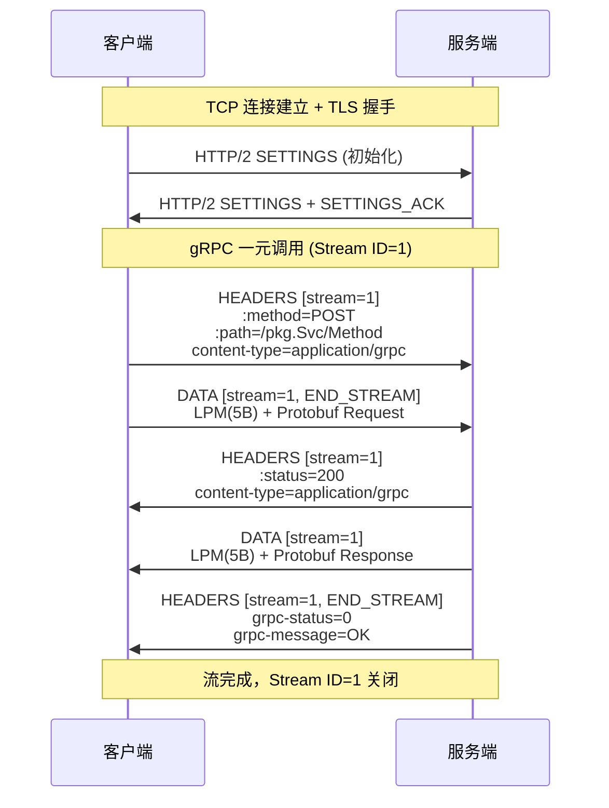

---
tags:
  - network
  - protocol-analysis
  - tier3
  - gRPC
  - protobuf
---
# gRPC 与 Protobuf 流量分析

> [!abstract] TL;DR
> gRPC 是基于 HTTP/2 承载二进制 Protocol Buffers 的高性能 RPC 框架，广泛用于微服务、云原生后端与移动 App API。抓包分析面临双重壁垒：第一层是 TLS 加密（用 SSLKEYLOGFILE 或代理解密），第二层是 Protobuf 二进制编码（需 .proto Schema 或反射服务才能还原字段语义）。本章从协议栈原理出发，覆盖四种调用模式的帧结构、Protobuf wire 格式与 varint 编码，深入讲解 `protoc --decode_raw`、blackboxprotobuf 等无 Schema 逆向手段，以及 Wireshark Protobuf dissector、grpcurl、grpc-dump 的实战配置，最终以移动端与微服务 API 审计场景收尾。

## 概述与定位

### gRPC 在现代体系中的位置

2015 年 Google 开源 gRPC 时，REST/JSON 仍主导 API 设计。彼时 JSON 的人类可读性是优势，但在高吞吐量的微服务内部调用中，文本序列化开销、HTTP/1.1 队头阻塞、缺乏强类型约束等缺陷日益明显。gRPC 以 Protocol Buffers（Protobuf）作为序列化格式、以 HTTP/2 作为传输层，同时提供代码生成工具链（`protoc`）与跨语言支持，一举解决了上述痛点。

时至今日，gRPC 已成为云原生生态（Kubernetes、Envoy、Istio、gRPC-Gateway）的默认 RPC 协议。Kubernetes API Server 的 etcd 通信、Google 内部服务间调用、各类移动端后端 BFF 层，都大量使用 gRPC。对安全研究员和抓包分析师来说，无法读懂 gRPC 流量意味着在现代微服务攻面上实际上是"半盲"的状态。

### 与 REST/JSON 的本质区别

| 维度 | REST/JSON | gRPC/Protobuf |
|------|-----------|--------------|
| 传输层 | HTTP/1.1 或 HTTP/2 | 强制 HTTP/2 |
| 序列化 | 文本 JSON | 二进制 Protobuf |
| Schema | 可选（OpenAPI） | 强制（.proto 文件） |
| 流式支持 | 不原生支持 | 四种模式原生支持 |
| 可读性 | Wireshark 直读 | 需 Schema 或逆向 |
| 代码生成 | 可选 | 官方工具链 protoc |

这种差异决定了分析策略：抓到 gRPC 流量后，"解密 TLS"只是第一步，得到的仍然是二进制负载；"还原 Protobuf 字段"才是第二步，这需要 `.proto` 文件、gRPC 反射服务，或者暴力逆向。

### 系列定位

在本系列中，第 05 章讲解了 TLS 握手与 SSLKEYLOGFILE 解密，第 07 章覆盖了 HTTP/2 多路复用与 HPACK，第 09 章讨论了移动端抓包。本章在这些基础上叠加 gRPC 协议语义层与 Protobuf 二进制解码，是三章内容的综合应用场景。

---

## 原理与机制

### 四种调用模式

gRPC 在 `.proto` 文件中以 `rpc` 关键字定义服务方法，支持四种调用语义：

**一元调用（Unary RPC）**：最接近传统 HTTP 请求的模式。客户端发送一个请求，服务端返回一个响应，然后通信结束。底层对应一次 HTTP/2 流（Stream）的完整生命周期：客户端发 HEADERS 帧 + DATA 帧（携带 END_STREAM 标志），服务端回 HEADERS 帧 + DATA 帧 + Trailers。

```protobuf
service UserService {
  rpc GetUser(GetUserRequest) returns (GetUserResponse);
}
```

**服务端流（Server Streaming RPC）**：客户端发送一个请求，服务端可以返回任意数量的响应消息，然后服务端关闭流。典型场景是日志推送、实时状态订阅。底层表现为客户端 HEADERS + DATA（END_STREAM），服务端持续发送多个 DATA 帧，最后发送带 END_STREAM 的 Trailers。

```protobuf
rpc WatchEvents(WatchRequest) returns (stream Event);
```

**客户端流（Client Streaming RPC）**：客户端持续发送多个请求消息，服务端在客户端完成后返回一个响应。适合文件分块上传、批量写入等场景。

```protobuf
rpc UploadChunks(stream Chunk) returns (UploadResult);
```

**双向流（Bidirectional Streaming RPC）**：双方都可以独立地发送任意数量的消息，读写顺序完全自由。底层维持一条长连接的 HTTP/2 流，双方并发地推送 DATA 帧。在 Wireshark 中，这类流的抓包分析最为复杂，需要按帧序号重组两个方向的消息序列。

```protobuf
rpc Chat(stream Message) returns (stream Message);
```

### gRPC over HTTP/2 的帧映射

gRPC 消息封装在 HTTP/2 DATA 帧的负载中，但不是直接裸放 Protobuf 字节，而是多了一个 **5 字节的 Length-Prefixed Message（LPM）首部**：

```
+-------------------+---------------------+
| Compressed-Flag   |  Message-Length     |
| (1 byte, 0 or 1)  |  (4 bytes, uint32)  |
+-------------------+---------------------+
| Message Body (Protobuf bytes)           |
+-----------------------------------------+
```

- **Compressed-Flag**：0 表示未压缩，1 表示使用 `grpc-encoding` 指定的压缩算法（通常是 gzip 或 zstd）。
- **Message-Length**：消息体的字节长度，大端序 uint32。
- **Message Body**：序列化后的 Protobuf 二进制。

这个 5 字节首部让 gRPC 能在单条 HTTP/2 流上传输多个逻辑消息（尤其是流式调用时），接收方通过 LPM 边界拆分每条消息。

### HTTP/2 伪头部与路径规范

gRPC 调用路径遵循严格规范，体现在 HTTP/2 HEADERS 帧的伪头部字段（Pseudo-Header）中：

```
:method = POST
:scheme = https
:path = /package.ServiceName/MethodName
:authority = api.example.com
content-type = application/grpc
grpc-encoding = identity (或 gzip)
te = trailers
```

`:path` 的格式固定为 `/{package}.{Service}/{Method}`，这是 gRPC 协议规范（gRPC over HTTP/2 spec）强制要求的。在 Wireshark 抓包时，这个字段是识别 gRPC 调用目标的关键线索，即使 Protobuf 内容还未解码，仅凭路径即可判断调用的服务与方法。

### Trailer 与 gRPC 状态码

与普通 HTTP 响应不同，gRPC 将最终状态码放在 HTTP/2 Trailer 帧（即携带 `END_STREAM` 的 HEADERS 帧）中，而非响应头部。关键字段：

| Trailer 字段 | 含义 |
|-------------|------|
| `grpc-status` | 数字状态码，0 = OK |
| `grpc-message` | URL 编码的错误描述（可选） |
| `grpc-status-details-bin` | Base64 编码的 `google.rpc.Status` Protobuf（包含详细错误信息） |

常见 gRPC 状态码：

| 码值 | 名称 | 对应 HTTP 类比 |
|-----|------|--------------|
| 0 | OK | 200 |
| 1 | CANCELLED | — |
| 2 | UNKNOWN | 500 |
| 3 | INVALID_ARGUMENT | 400 |
| 5 | NOT_FOUND | 404 |
| 7 | PERMISSION_DENIED | 403 |
| 16 | UNAUTHENTICATED | 401 |

在 Wireshark 中，分析 gRPC 调用是否成功，必须追踪到该流的最后一个 HEADERS 帧（Trailer），看 `grpc-status` 的值，而不能仅凭 HTTP/2 帧本身的状态。

### Protocol Buffers Wire 格式深解

Protobuf 的核心思想是通过字段编号（Field Number）而非字段名称来识别数据，这使得序列化格式极为紧凑，但同时也使得在没有 `.proto` Schema 的情况下只能看到"编号 + 原始字节"，无法还原语义。

**字段 Tag 编码规则**：每个字段在序列化时先编码一个 Tag，Tag 是一个 varint，其值为：

```
tag = (field_number << 3) | wire_type
```

wire_type 决定了紧随其后的数据如何解读：

| Wire Type | 值 | 对应类型 |
|-----------|---|---------|
| Varint | 0 | int32, int64, uint32, uint64, sint32, sint64, bool, enum |
| 64-bit | 1 | fixed64, sfixed64, double |
| Length-delimited | 2 | string, bytes, embedded message, repeated fields |
| Start group | 3 | 已废弃 |
| End group | 4 | 已废弃 |
| 32-bit | 5 | fixed32, sfixed32, float |

**示例**：假设 .proto 定义了 `string name = 1;`，序列化 `"Alice"` 后的字节序列为：

```
0x0A  0x05  0x41 0x6C 0x69 0x63 0x65
```

- `0x0A` = tag：`field_number=1, wire_type=2`，即 `(1 << 3) | 2 = 10 = 0x0A`
- `0x05` = 字符串长度 5（varint 编码）
- `0x41 0x6C 0x69 0x63 0x65` = "Alice" 的 ASCII

### Varint 编码与 ZigZag 编码

**Varint 编码**是 Protobuf 压缩整数的核心机制：每个字节的最高位（MSB）是"继续位"，1 表示还有后续字节，0 表示这是最后一个字节；低 7 位是实际数据，小端序组合。

```
数值 300 的 varint 编码：
300 = 0x12C = 0001 0010 1100

拆分为 7-bit 组（从低位开始）：
1010110 0  (低7位: 0101100 = 0x2C, 接下来还有数据，MSB=1)
0000010    (高位: 0000010 = 0x02, 最后字节, MSB=0)

结果: 0xAC 0x02
```

这意味着小整数（0~127）只占 1 个字节，而最坏情况下 64 位整数可能占 10 个字节。

**ZigZag 编码**（`sint32`/`sint64`）解决了负数用 varint 编码低效的问题。普通 int32 的 -1 在 varint 中需要 10 个字节（符号位扩展到 64 位），而 ZigZag 将有符号整数映射到无符号整数：

```
ZigZag(n) = (n << 1) XOR (n >> 31)   // sint32
ZigZag(n) = (n << 1) XOR (n >> 63)   // sint64

示例：
  0  →  0
 -1  →  1
  1  →  2
 -2  →  3
  2  →  4
```

这样绝对值小的负数映射到小正数，varint 编码效率恢复正常。在逆向时，区分 `int32` 和 `sint32` 非常重要——同样的字节流，两种解读方式会得到完全不同的数值。

### gRPC-Web：浏览器场景的变体

gRPC-Web 是 gRPC 的浏览器兼容版本，用于解决浏览器 JavaScript 无法直接使用 HTTP/2 Trailer 的问题。与标准 gRPC 的区别：

- **Content-Type**：使用 `application/grpc-web` 或 `application/grpc-web+proto`
- **Trailer 处理**：Trailer 被编码为特殊格式的 DATA 帧（`frame type = 0x80`），附在响应体末尾，而非真正的 HTTP Trailer
- **帧格式**：同样使用 5 字节 LPM 前缀，但最高位用于区分数据帧（`0x00`）和 Trailer 帧（`0x80`）

在 Wireshark 中，gRPC-Web 流量经过 HTTP/1.1 代理（如 Envoy）时，外层是 HTTP/1.1，内层是经过特殊封装的 gRPC-Web 帧，分析时需要两层剥离。

---

## 结构/算法/伪代码详解

### Protobuf 反序列化算法

不依赖 `.proto` Schema 的原始解析流程（`--decode_raw` 的内部逻辑）：

```
function decode_raw(bytes):
    pos = 0
    while pos < len(bytes):
        tag_varint, pos = read_varint(bytes, pos)
        field_number = tag_varint >> 3
        wire_type    = tag_varint & 0x07
        
        if wire_type == 0:   // Varint
            value, pos = read_varint(bytes, pos)
            output(field_number, "varint", value)
        
        elif wire_type == 1: // 64-bit
            value = bytes[pos:pos+8]  // little-endian
            pos += 8
            output(field_number, "64bit", value)
        
        elif wire_type == 2: // Length-delimited
            length, pos = read_varint(bytes, pos)
            data = bytes[pos:pos+length]
            pos += length
            // 尝试递归解析（可能是嵌套 message）
            if is_valid_protobuf(data):
                output(field_number, "message", decode_raw(data))
            else:
                output(field_number, "bytes/string", data)
        
        elif wire_type == 5: // 32-bit
            value = bytes[pos:pos+4]  // little-endian
            pos += 4
            output(field_number, "32bit", value)
        
        else:
            raise ParseError("unknown wire type")
```

varint 读取子程序：

```
function read_varint(bytes, pos):
    result = 0
    shift  = 0
    while True:
        byte = bytes[pos]
        pos += 1
        result |= (byte & 0x7F) << shift
        if (byte & 0x80) == 0:  // 最高位为0，结束
            break
        shift += 7
        if shift >= 64:
            raise ParseError("varint too long")
    return result, pos
```

### gRPC LPM 帧解析

从 HTTP/2 DATA 帧负载中提取 gRPC 消息的伪代码（适用于流式调用场景，一个 DATA 帧可能包含多条 LPM 消息）：

```
function extract_grpc_messages(data_frame_payload):
    messages = []
    pos = 0
    while pos < len(data_frame_payload):
        if pos + 5 > len(data_frame_payload):
            break  // 不完整的帧头，可能跨 DATA 帧，需要缓冲
        
        compressed_flag = data_frame_payload[pos]
        msg_length = unpack_uint32_big_endian(data_frame_payload[pos+1:pos+5])
        pos += 5
        
        if pos + msg_length > len(data_frame_payload):
            break  // 消息体不完整，跨帧情况
        
        msg_body = data_frame_payload[pos:pos+msg_length]
        pos += msg_length
        
        if compressed_flag == 1:
            msg_body = decompress(msg_body)  // 根据 grpc-encoding 解压
        
        messages.append(decode_protobuf(msg_body))
    
    return messages
```

### Wireshark Protobuf Dissector 配置流程

Wireshark 的 Protobuf dissector 需要知道 `.proto` 文件的位置，以及如何将 gRPC `:path` 映射到具体的 message 类型。配置步骤：

```
1. 菜单 Edit → Preferences → Protocols → Protobuf
   → "Protobuf search paths" 添加存放 .proto 文件的目录（含子目录递归搜索）

2. 菜单 Edit → Preferences → Protocols → gRPC
   → 确认 "Decode gRPC messages" 已勾选
   → 如有自定义端口，在 "gRPC/HTTP2 port(s)" 中添加

3. 解密 TLS（如已配置 SSLKEYLOGFILE）后，
   在 gRPC DATA 帧上右键 → "Decode As" → 选择 "Protobuf"
   （Wireshark 会自动匹配 .proto 中对应的 message）
```

若 gRPC 服务使用了 Package 前缀（如 `com.example.api`），Wireshark 在匹配时需要完整的包路径，确保 .proto 文件中的 `package` 声明与 `:path` 中的 package 名称一致。

### gRPC 调用完整帧序列（Mermaid）



---

## 工具视角与实战

### 环境准备：TLS 解密

gRPC 几乎总是运行在 TLS 之上，因此第一步是解密。方法按优先级排列：

**方案一：SSLKEYLOGFILE（最无侵入性）**

对 gRPC 客户端（通常是 Go/Java/Python 实现）设置 TLS 密钥导出：

```bash
# Go gRPC 客户端（libssl 底层）
export SSLKEYLOGFILE=/tmp/grpc_keys.log
./grpc_client

# 在 Wireshark 中加载
Edit → Preferences → Protocols → TLS → (Pre)-Master-Secret log filename
```

**方案二：mitmproxy/Burp Suite 代理**

对 gRPC-Web 流量（经过 Envoy 或 grpc-gateway 转换为 HTTP/1.1 的流量），mitmproxy 可以直接截获：

```bash
# mitmproxy 模式
mitmproxy --mode transparent --ssl-insecure -p 8080

# 查看 gRPC 内容（mitmproxy 内置了基础的 Protobuf 解码）
# 在请求详情中按 Tab 切换 Content-Type 视图
```

**方案三：grpc-dump（专用 gRPC 代理）**

grpc-dump 是专门为 gRPC 流量拦截设计的工具，以 gRPC 代理方式工作：

```bash
# 安装
go install github.com/rmedvedev/grpc-dump/cmd/grpc-dump@latest

# 运行：监听 50051，转发到真实服务的 50052
grpc-dump -port 50051 -upstream localhost:50052 \
          -output dump.json

# 若有 .proto 文件，指定解码 schema
grpc-dump -port 50051 -upstream localhost:50052 \
          -proto-set descriptor.pb -output dump.json
```

dump.json 中的每条记录包含完整的 metadata、方向（请求/响应）、解码后的 JSON 格式消息。

### protoc --decode_raw：零 Schema 原始解析

当完全没有 `.proto` 文件时，可以用 `protoc --decode_raw` 将 Protobuf 二进制解析为"field_number: value"的原始形式：

```bash
# 从 Wireshark 导出 DATA 帧负载（去掉前5字节 LPM 头部）
# 假设已提取到 payload.bin（纯 Protobuf 字节）

protoc --decode_raw < payload.bin
```

输出示例：

```
1: "alice@example.com"
2: 12345
3 {
  1: "Administrator"
  2: 1
}
4: 1719849600
```

可以看到字段编号、wire type 对应的值，但无法知道字段名称（name/id/role 等），也无法区分 `int32` 与 `sint32`（解读方式不同），更无法区分 `string` 与 `bytes`（都是 length-delimited）。这是逆向分析的起点，需要结合业务上下文猜测语义。

### blackboxprotobuf：交互式逆向

blackboxprotobuf 是一个 Python 库，专为在没有 .proto 的情况下交互式地推断 Protobuf Schema 而设计，同时也有 Burp Suite 插件版本：

```python
import blackboxprotobuf

# 解析原始 Protobuf 字节
raw_bytes = open("payload.bin", "rb").read()
message, typedef = blackboxprotobuf.decode_message(raw_bytes)

print(message)
# 输出: {'1': b'alice@example.com', '2': 12345, '3': {'1': b'Administrator', '2': 1}}

# 修改 typedef 来指定字段类型
typedef['1']['type'] = 'string'  # 将 bytes 解读为 UTF-8 字符串
typedef['2']['type'] = 'uint64'  # 指定为无符号整数

message, typedef = blackboxprotobuf.decode_message(raw_bytes, typedef)
print(message)
# 输出: {'1': 'alice@example.com', '2': 12345, ...}

# 重新编码（用于修改后重放）
new_message = message.copy()
new_message['2'] = 99999  # 篡改 ID
reencoded = blackboxprotobuf.encode_message(new_message, typedef)
```

blackboxprotobuf 的 Burp Suite 插件允许在 Burp Repeater 中直接以可读 JSON 方式编辑 Protobuf 请求并重发，是 Web/API 渗透测试中修改 gRPC 请求的最实用工具之一。

### protobuf-inspector：深度类型推断

protobuf-inspector 通过启发式规则（字节范围检测、UTF-8 有效性检测、嵌套消息递归检测）对 Protobuf 二进制进行更深度的类型推断：

```bash
pip install protobuf-inspector

# 基础解析
python -m protobuf_inspector < payload.bin

# 输出示例（推断出字段类型）
# Field #1 (string): "alice@example.com"
# Field #2 (uint32): 12345
# Field #3 (message):
#   Field #1 (string): "Administrator"
#   Field #2 (bool): True
```

protobuf-inspector 特别擅长识别时间戳（`google.protobuf.Timestamp`）、枚举、嵌套 message 等常见 Protobuf 模式，减少人工猜测工作量。

### grpcurl：服务反射与测试

当服务端开启了 gRPC Server Reflection（gRPC 的服务发现机制，类似 REST 的 OpenAPI 端点），可以完全不需要 `.proto` 文件：

```bash
# 安装
go install github.com/fullstorydev/grpcurl/cmd/grpcurl@latest

# 列出服务（要求服务端开启反射）
grpcurl -plaintext localhost:50051 list
# 输出: com.example.UserService
#       com.example.OrderService
#       grpc.reflection.v1.ServerReflection

# 列出指定服务的方法
grpcurl -plaintext localhost:50051 list com.example.UserService
# 输出: com.example.UserService.GetUser
#       com.example.UserService.UpdateUser

# 查看方法的 protobuf 定义
grpcurl -plaintext localhost:50051 describe com.example.UserService.GetUser

# 调用方法（JSON 格式输入）
grpcurl -plaintext \
        -d '{"user_id": 12345}' \
        localhost:50051 \
        com.example.UserService/GetUser

# 带 TLS 调用（使用证书）
grpcurl -cacert ca.crt \
        -cert client.crt -key client.key \
        -d '{"user_id": 12345}' \
        api.example.com:443 \
        com.example.UserService/GetUser
```

若服务端未开启反射，可以手动提供 `.proto` 文件：

```bash
grpcurl -proto user_service.proto \
        -d '{"user_id": 12345}' \
        localhost:50051 \
        com.example.UserService/GetUser
```

或提供预编译的 FileDescriptorSet（`descriptor.pb`）：

```bash
# 编译 .proto 为 descriptor
protoc --descriptor_set_out=descriptor.pb \
       --include_imports \
       user_service.proto

# 使用 descriptor
grpcurl -protoset descriptor.pb \
        -d '{"user_id": 12345}' \
        localhost:50051 \
        com.example.UserService/GetUser
```

### Wireshark 实战：完整抓包分析流程

以下是抓取并分析 gRPC 一元调用的完整步骤：

**步骤一：捕获流量**

```bash
# 方式A：tshark 命令行（适合自动化）
tshark -i eth0 -f "tcp port 50051" -w grpc_capture.pcap

# 方式B：Wireshark GUI（适合交互分析）
# 开启捕获，应用 BPF 过滤 "tcp port 50051"
```

**步骤二：配置 TLS 解密**

```
Wireshark: Edit → Preferences → Protocols → TLS
→ (Pre)-Master-Secret log filename: /tmp/grpc_keys.log
```

**步骤三：配置 Protobuf Dissector**

```
Edit → Preferences → Protocols → Protobuf
→ Search paths: /path/to/proto/files
```

**步骤四：过滤 gRPC 帧**

```
# Wireshark 显示过滤器
grpc                          # 所有 gRPC 帧
grpc.message_length > 0       # 只看有 payload 的帧
http2.headers.path contains "/UserService/"  # 过滤特定服务
grpc.status_code != 0         # 找出错误的调用
```

**步骤五：追踪完整流**

```
右键任意 gRPC 帧 → Follow → HTTP/2 Stream
可以看到该 Stream 的完整请求/响应序列
```

**步骤六：导出 Protobuf 负载**

```
# 在 DATA 帧上，展开 "Data" 字段
# 右键 Protobuf 负载 → Export Packet Bytes
# 保存为 .bin 文件，配合 protoc --decode_raw 进一步分析
```

### 移动端 gRPC 抓包实战

移动 App（尤其是 Android）使用 gRPC 时通常还有 SSL Pinning。结合第 09 章的方法，完整流程为：

```bash
# Android 设备（已 root 或使用 PCAPdroid）
# 方式一：系统代理 + 证书安装（适合调试版 App）
# 方式二：Frida 绕过 SSL Pinning
frida -U -l ssl_pinning_bypass.js -f com.example.app --no-pause

# 方式三：直接通过 PCAPdroid 在设备层面抓包
# 配置 MitmProxy 为上游，提取 TLS 密钥

# 抓包后，提取 SSLKEYLOGFILE（需要 Frida hook TLS 密钥导出）
# 脚本示例（hook OpenSSL SSL_CTX_set_keylog_callback）
```

对于 gRPC-Web（在 Flutter/React Native 中更常见），因为底层是 HTTP/1.1，Charles Proxy 或 mitmproxy 可以直接截获并显示，无需特殊配置。

---

## 安全性与正确使用

### 授权测试范围

gRPC 流量分析应仅在以下场景中进行：

- 本人开发或授权测试的 gRPC 服务
- 渗透测试合同明确覆盖的微服务 API
- CTF 竞赛题目或授权靶场环境
- 自有设备上安装的应用程序（用于安全研究）

生产环境的 gRPC 服务通常承载敏感业务数据，未经授权的拦截与解码可能违反相关法律法规。

### 常见安全问题与分析方法

**问题一：无 TLS 的明文 gRPC**

在微服务内部网络（如 Kubernetes 集群内 Pod 间通信）中，有时为了性能而不加 TLS（即 `grpc+insecure://` 方案）。这种配置可以直接抓包读取所有 Protobuf 内容，无需解密。识别方法：

```
# Wireshark 过滤
tcp.port == 50051 && !tls
# 如果能直接看到 HTTP/2 帧，说明是明文 gRPC
```

从安全角度看，这意味着同一网络段内的任何节点都能读取所有服务间通信内容，是典型的零信任网络缺陷。

**问题二：gRPC Server Reflection 暴露**

生产服务若开启了 Server Reflection（通常是开发/调试阶段默认开启而忘记关闭），攻击者无需 `.proto` 文件即可通过 `grpcurl list` 枚举所有服务方法，相当于 API 文档完全暴露。

审计方法：

```bash
# 检测目标是否开启反射
grpcurl -plaintext target.host:50051 list 2>&1
# 若返回服务列表，说明反射已暴露
# 若返回 "failed to list services: server does not support the reflection API"，则已关闭
```

**问题三：Protobuf 字段级别的越权**

Protobuf message 可能包含客户端不应传入的管理员字段（如 `is_admin=true`），但若服务端未在验证层过滤，直接信任了 Protobuf 反序列化后的完整消息，就会产生越权。这类漏洞通过 blackboxprotobuf 修改字节重放可以检测：

```python
# 在 Burp Suite 使用 blackboxprotobuf 插件
# 在 Repeater 中找到可疑的 boolean 或 int 字段
# 修改值后重放，观察响应变化
```

**问题四：gRPC 错误信息泄露**

`grpc-status-details-bin` Trailer 包含的 `google.rpc.Status` Protobuf 中可能包含详细的内部错误信息（堆栈跟踪、内部 IP 等）。分析方法：

```bash
# 解码 grpc-status-details-bin（Base64 → Protobuf）
echo "CgZ7bWVzc30=" | base64 -d | protoc --decode_raw
```

**问题五：压缩侧信道**

当 gRPC 使用 gzip 压缩时，响应体长度可能泄露内容信息（CRIME/BREACH 类攻击的变体）。分析时注意：若 `grpc-encoding: gzip`，需先解压再分析 Protobuf 内容，同时记录压缩前后的体积比率。

### 敏感字段处理

在实际分析工作中，gRPC 流量可能包含大量敏感个人信息（JWT Token、身份证号、手机号等被 Protobuf 编码）。导出的 pcap 文件和 dump.json 应视同明文凭据处理：

- 不上传到 VirusTotal 等公共服务
- 分析完毕后安全删除
- 在报告中对敏感字段做脱敏处理（如 `user_id: 12***5`）

### 微服务审计工作流

针对云原生微服务 API 的完整 gRPC 审计流程：

```
阶段1：发现
  → grpcurl list（枚举服务，检测反射暴露）
  → Wireshark 抓包 + TLS 解密（掌握流量全貌）
  → .proto 文件收集（代码仓库、APK 资源、Maven 制品）

阶段2：分析
  → protoc --decode_raw（快速看结构）
  → blackboxprotobuf（交互式类型推断）
  → Wireshark Protobuf dissector（结合 .proto 可读化）

阶段3：测试
  → grpcurl（重放与篡改测试）
  → Burp Suite + blackboxprotobuf 插件（拦截修改重放）
  → 检查 grpc-status-details-bin 错误信息

阶段4：报告
  → 记录已枚举的服务/方法列表
  → 标注发现的安全问题（反射暴露、越权字段、明文传输）
  → 敏感字段脱敏
```

---

## 小结

gRPC 流量分析是现代 API 安全审计不可回避的技能，其难点在于 TLS 加密与 Protobuf 二进制编码的双重壁垒。本章覆盖了：

- **协议原理层**：四种调用模式（一元/服务端流/客户端流/双向流）的帧结构；HTTP/2 伪头部 `:path` 的 `/{package}.{Service}/{Method}` 规范；5 字节 LPM 封装机制；`grpc-status` Trailer 状态语义；gRPC-Web 的浏览器适配变体。

- **编码层**：Protobuf wire 格式的字段 Tag 编码（`field_number << 3 | wire_type`）；六种 wire type 的数据解读；varint 的变长编码算法；ZigZag 编码对负数的处理；无 Schema 时各类型的歧义问题。

- **工具链**：SSLKEYLOGFILE 解密 TLS；`protoc --decode_raw` 零 Schema 解析；blackboxprotobuf 交互式类型推断与报文重放；grpcurl 服务发现与功能调用；grpc-dump 代理层截获；Wireshark Protobuf dissector 配置与过滤语法。

- **安全视角**：明文 gRPC 识别；Server Reflection 暴露审计；Protobuf 字段级越权检测；错误信息泄露；压缩侧信道分析；敏感数据处理规范；移动端 gRPC 抓包与 SSL Pinning 绕过。

掌握这些技能后，面对云原生微服务架构的 API 审计，才能真正做到"所见即所传"，而非在二进制流量面前止步不前。

---

## 相关阅读

- gRPC 官方协议规范：[gRPC over HTTP/2](https://github.com/grpc/grpc/blob/master/doc/PROTOCOL-HTTP2.md)
- Protocol Buffers 编码指南：[Encoding — Protocol Buffers Documentation](https://protobuf.dev/programming-guides/encoding/)
- Wireshark Protobuf Dissector 官方文档：[Wireshark User's Guide — Protobuf](https://wiki.wireshark.org/Protobuf)
- blackboxprotobuf 项目：[GitHub — nccgroup/blackboxprotobuf](https://github.com/nccgroup/blackboxprotobuf)
- grpcurl 项目：[GitHub — fullstorydev/grpcurl](https://github.com/fullstorydev/grpcurl)
- protobuf-inspector 项目：[GitHub — jmendeth/protobuf-inspector](https://github.com/jmendeth/protobuf-inspector)
- gRPC-Web 规范：[GitHub — grpc/grpc-web/blob/master/doc/browser-features.md](https://github.com/grpc/grpc-web)
- 第 05 章：TLS 握手与解密分析（SSLKEYLOGFILE 详细配置）
- 第 07 章：WebSocket 与 HTTP/2 分析（HTTP/2 帧结构基础）
- 第 09 章：移动端抓包 Android 与 iOS（SSL Pinning 绕过方法）

---

[[00.抓包与协议分析实战总览|⬆ 系列总览]] | [[14.HTTP3与QUIC抓包解密|← 上一章]] | [[16.TLS指纹进阶JA4与JARM与HASSH|→ 下一章]]
