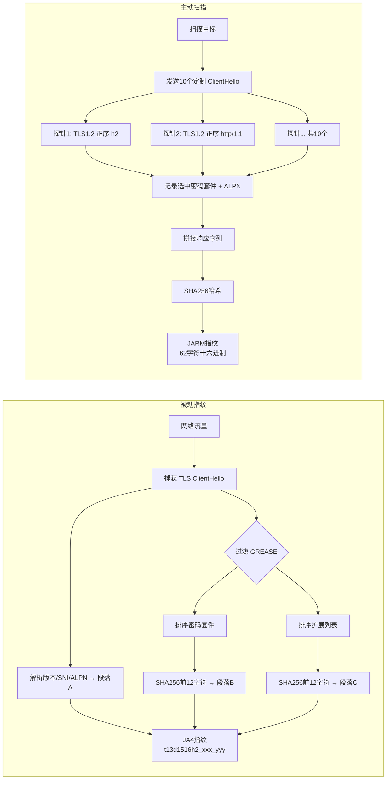
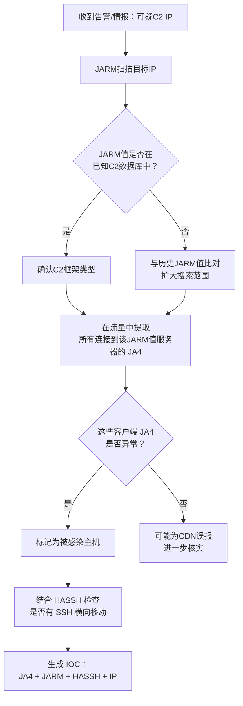

---
tags:
  - network
  - protocol-analysis
  - tier3
  - TLS指纹
  - 威胁狩猎
---
# TLS 指纹进阶：JA4、JARM 与 HASSH

> [!abstract] TL;DR
> JA3 是第一代 TLS 客户端指纹，但因密码套件随机化、GREASE 注入等手段已被大量规避。JA4（2023，FoxIO/Cloudflare）重新设计了更抗混淆的指纹体系，并扩展为 JA4+ 套件覆盖客户端 TLS、服务端 TLS、HTTP、证书、TCP 和延迟等多个维度。JARM 是主动式服务器端 TLS 指纹——通过发送 10 个特制 ClientHello 探针来唯一标识服务器 TLS 栈，常用于 C2 基础设施溯源。HASSH 则将同样的握手指纹思路引入 SSH 协议，通过 KEX/加密/MAC 算法列表生成客户端和服务器指纹。三者共同构成当代 SOC/威胁猎杀（Threat Hunting）的核心被动/主动识别工具链，可与 Zeek、Suricata、Arkime 深度集成。

## 概述与定位

### 为什么 JA3 已经不够用

第 12 章介绍的 JA3 于 2017 年由 Salesforce 团队提出，其核心思路是：将 TLS ClientHello 中的 TLS 版本、密码套件列表、扩展类型列表、椭圆曲线列表和椭圆曲线点格式列表拼接后取 MD5，作为客户端 TLS 指纹。在早期，这一方法能够有效区分不同的 TLS 库（OpenSSL、NSS、Schannel、BoringSSL），因为各库维护着自己独特的偏好列表。

但随着时间推移，JA3 出现了两类主要的规避路径：

**第一类：GREASE（Generate Random Extensions And Sustain Extensibility）**。RFC 8701 定义的 GREASE 机制会在密码套件、扩展类型、命名组等字段中插入随机保留值，用于探测中间设备是否能正确忽略未知值。现代 Chrome（BoringSSL）默认启用 GREASE，这意味着每次 TLS 握手的 GREASE 值随机变化，使得同一浏览器版本在不同连接中产生不同的 JA3 哈希——JA3 作为稳定标识符失效。

**第二类：主动混淆**。恶意软件（如 Cobalt Strike 4.x 以后版本）或专门的 TLS 混淆工具（如 uTLS 库）可以模拟特定目标浏览器的 TLS 握手指纹，只需复制其密码套件列表和扩展顺序即可。这让 JA3 指纹从"检测工具"变成了"待仿制的公开靶子"。

**第三类：排序不稳定性**。部分 TLS 实现会根据会话状态或系统配置动态调整密码套件排序，导致同一客户端产生多个不同 JA3 值，增加误报率。

这三类问题促使了 JA4 的诞生——它不是简单修补 JA3，而是重新设计了指纹的计算规则，同时将指纹体系扩展到协议栈的多个层面。

### JA4+ 套件的整体格局

JA4+ 不是单个指纹，而是一套针对不同协议层面的指纹方案集合：

| 指纹 | 全称 | 协议层 | 方向 | 核心特征 |
|------|------|--------|------|---------|
| JA4 | JA4 TLS Client Fingerprint | TLS | 客户端 | ClientHello 结构 |
| JA4S | JA4 TLS Server Fingerprint | TLS | 服务端 | ServerHello 结构 |
| JA4H | JA4 HTTP Client Fingerprint | HTTP/1 & HTTP/2 | 客户端 | 请求头顺序和 Cookie |
| JA4X | JA4 X.509 Certificate Fingerprint | X.509/TLS | 证书 | 证书字段结构 |
| JA4T | JA4 TCP Fingerprint | TCP | 客户端 | TCP 选项、窗口大小 |
| JA4L | JA4 Latency Fingerprint | 网络层 | 被动 | RTT 测量（地理位置代理检测）|
| JA4SSH | JA4 SSH Client Fingerprint | SSH | 客户端 | KEX_INIT 结构 |

本章重点讲解 JA4（核心 TLS 客户端指纹）、JARM（主动服务端指纹）和 HASSH（SSH 指纹）三个在安全运营中最常用的方案，并辅以 JA4S、JA4H 等的简介。

## 原理与机制

### JA4 的设计原则

JA4 由 John Althouse（FoxIO）于 2023 年发布，并很快获得 Cloudflare 的支持并推广。其设计有三个核心原则：

**原则一：排序规范化（Sorted Normalization）**。在计算指纹之前，JA4 会对密码套件列表和 TLS 扩展类型列表分别进行**升序排序**，然后过滤掉所有 GREASE 值（0x?a?a 格式的值，如 0x0a0a、0x1a1a 等）。排序消除了因实现差异或随机注入导致的顺序变化，使得同一客户端 TLS 库无论如何调整顺序都会产生相同指纹。

**原则二：可读性优先（Human Readability）**。JA4 指纹的格式设计为可人工解读的分段结构，而不是不透明的哈希字符串。一个典型的 JA4 指纹如 `t13d1516h2_8daaf6152771_b0da82dd1658` 中每个段落都有明确含义，分析师可以直接从指纹字符串中获取协议版本、密码套件数量、扩展数量等信息，无需查表。

**原则三：截断而非省略（Truncated Hash）**。JA4 对密码套件列表和扩展列表分别计算 SHA-256 哈希后取前 12 个字符（十六进制），形成两个子哈希。这比 JA3 的 MD5 哈希更难碰撞，同时截断至 12 字符也在唯一性和可读性间取得平衡。

### JA4 的字段解析

JA4 指纹由三个段落组成，用下划线分隔：`{A}_{B}_{C}`

**段落 A（10 字符，可读前缀）**：
- 字符 1：协议类型（`t` = TLS，`q` = QUIC，`d` = DTLS）
- 字符 2-3：TLS 版本（`13` = TLS 1.3，`12` = TLS 1.2，`10` = TLS 1.0）
- 字符 4：是否有 SNI（`d` = 有域名/domain，`i` = 无/IP 或空）
- 字符 5-6：密码套件数量（两位十进制数，过滤 GREASE 后）
- 字符 7-8：TLS 扩展数量（两位十进制数，过滤 GREASE 后）
- 字符 9-10：ALPN 协议首个值的前两个字母（如 `h2`、`h1`、`dt`）

**段落 B（12 字符，密码套件哈希）**：
对**排序后**的密码套件列表（过滤 GREASE，以逗号分隔的十进制值字符串）计算 SHA-256，取前 12 个字符。

**段落 C（12 字符，扩展哈希）**：
对**排序后**的扩展类型列表（过滤 GREASE，以逗号分隔的十进制值）计算 SHA-256，**然后再附加 signature_algorithms 扩展（类型 13）中的签名算法列表**（同样排序），一并哈希后取前 12 字符。注意：签名算法列表不排序，但扩展类型列表排序。实际上 JA4 规范对此有细化：扩展列表排序，而 SNI 和 ALPN 这两个扩展会被从哈希输入中移除（因为它们与服务器相关，不代表客户端特征），但仍计入扩展数量。

### 与 JA3 的对比

```
JA3 计算流程：
  ClientHello → 按原始顺序拼接字段 → MD5 → 32字符十六进制

JA4 计算流程：
  ClientHello → 过滤GREASE → 密码套件排序 → 扩展排序
              → 移除SNI/ALPN后的扩展列表哈希
              → 构造可读前缀 + 两个截断SHA256
              → 格式：{协议}{版本}{SNI}{套件数}{扩展数}{ALPN}_{套件哈希}_{扩展哈希}
```

JA3 面对 GREASE 随机化完全失效，而 JA4 在过滤 GREASE 后对同一 Chrome 版本的所有连接生成相同指纹。实测表明，Chrome 115、116、117 等连续版本因密码套件变化而产生不同 JA4，而同一版本在不同平台（Windows/macOS/Linux）上则基本产生相同 JA4（因为 BoringSSL 行为一致），这正是希望达到的效果——指纹区分库版本，而非区分连接。

### JA4S：服务端 TLS 指纹

JA4S 对 TLS ServerHello 进行指纹计算，格式为 `{A}_{B}`：
- 段落 A（7 字符）：协议类型（1字符）+ TLS 版本（2字符）+ 扩展数量（2字符）+ ALPN（2字符）
- 段落 B（12 字符）：选中的密码套件（1个，十进制）+ 排序后扩展列表，取 SHA-256 前 12 字符

JA4S 的意义在于：结合 JA4（客户端）和 JA4S（服务端），可以建立握手对（handshake pair）指纹，更精确地识别特定的 C2 服务器软件栈。例如 Metasploit 的 meterpreter handler、Cobalt Strike 的 TeamServer 等会产生特定的 JA4S。

### JA4H：HTTP 客户端指纹

JA4H 对 HTTP/1.1 或 HTTP/2 请求头进行指纹计算，捕获以下特征：
- HTTP 方法（GET/POST 等，2字符）
- HTTP 版本（`11`=HTTP/1.1，`20`=HTTP/2，`2s`=HTTP/2 with SETTINGS）
- 是否携带 Cookie（`c` 或 `n`）
- 是否携带 Referer（`r` 或 `n`）
- 请求头数量（两位十进制）
- Accept-Language 前两个字符（如 `en`、`zh`）
- 请求头名称列表（排序后）的 SHA-256 前 12 字符
- Cookie 字段名列表的 SHA-256 前 12 字符

JA4H 在检测爬虫、恶意软件 C2 HTTP 通信时尤为有用——同一 C2 框架的 HTTP beacon 往往有固定的请求头顺序，即使修改了 User-Agent 也无法改变头部顺序指纹。

### JA4X：X.509 证书指纹

JA4X 对 X.509 证书结构进行指纹计算，不依赖证书内容（如域名、公钥），而是关注证书的字段结构——哪些扩展被使用、Subject/Issuer 字段的 OID 组合。这对于识别使用自签名证书的 C2 服务器（其证书结构往往由工具自动生成，具有固定结构）非常有效。

### JARM：主动服务端 TLS 指纹

JARM（2020，Salesforce 团队，John Althouse 等）是 JA3/JA4 的"对立面"——JA3/JA4 被动分析客户端 ClientHello，而 JARM 则**主动向目标服务器发送精心设计的 ClientHello 探针**，根据服务器响应（ServerHello 或 Alert）来推断服务器的 TLS 实现。

JARM 发送 10 个不同的 ClientHello，变化维度包括：
1. TLS 版本（TLS 1.0、1.2、1.3）
2. 密码套件列表（按特定顺序排列，测试服务器的偏好响应）
3. 扩展的有无和顺序
4. 椭圆曲线列表的顺序
5. ALPN 值（h2/http1.1 等）

对于每个探针，JARM 记录服务器回应的**选中密码套件**和**ALPN 值**（如果服务器发送 Alert 则记录为 `|||`）。10 次探测形成一个 30 字符的原始响应序列，再经过 SHA-256 哈希取前 30 字符（但前 30 字符是原始序列，后 32 字符是哈希——实际 JARM 指纹格式是 62 字符十六进制字符串）。

JARM 指纹对以下因素不敏感（稳定）：
- 证书内容（JARM 不看证书）
- IP 地址（同一软件栈指纹相同）
- 域名

JARM 指纹对以下因素敏感（可区分）：
- TLS 库的版本（OpenSSL 1.0.x vs 1.1.x vs 3.x）
- TLS 库的编译配置（密码套件支持范围）
- 服务器软件的 TLS 配置（某些框架会限制 ALPN 或密码套件集合）

### HASSH：SSH 握手指纹

HASSH 由 Ben Reardon（Salesforce）在 2018 年发布，将握手指纹思路应用于 SSH 协议。SSH 连接建立时，客户端和服务器分别发送 `SSH_MSG_KEXINIT` 消息，其中包含各方支持的算法列表：
- Key Exchange（KEX）算法列表（如 `curve25519-sha256,diffie-hellman-group14-sha256,...`）
- 服务器主机密钥算法（Host Key Algorithm）
- 客户端到服务器加密算法（Encryption cipher c→s）
- 服务器到客户端加密算法（Encryption cipher s→c）
- 客户端到服务器 MAC 算法
- 服务器到客户端 MAC 算法
- 压缩算法列表

**HASSH（客户端指纹）**的计算：
将客户端 `SSH_MSG_KEXINIT` 中的 KEX 算法、加密算法（c→s）、MAC 算法（c→s）、压缩算法用分号拼接，取 MD5 哈希。

**HASSHServer（服务端指纹）**的计算：
同理，使用服务器 `SSH_MSG_KEXINIT` 中的对应字段（服务器支持的算法列表）取 MD5 哈希。

不同的 SSH 客户端实现（OpenSSH、PuTTY、Paramiko、Dropbear、libssh2）由于默认算法集和优先级不同，会产生不同的 HASSH 值。恶意工具（如 Metasploit、Impacket 的 smbexec、C2 框架的 SSH 模块）往往使用特定的 SSH 库，其 HASSH 值可作为识别依据。

## 结构/算法/伪代码详解

### JA4 计算伪代码

```python
import hashlib

def compute_ja4(client_hello):
    """
    参数：client_hello 是解析后的 TLS ClientHello 字典结构
    """
    # 1. 确定协议类型
    if client_hello.transport == "QUIC":
        proto = "q"
    elif client_hello.transport == "DTLS":
        proto = "d"
    else:
        proto = "t"

    # 2. 确定 TLS 版本
    # 优先看 supported_versions 扩展（TLS 1.3 必须用此扩展）
    supported_versions = client_hello.extensions.get(43, [])  # type 43 = supported_versions
    if 0x0304 in supported_versions:
        tls_ver = "13"
    elif 0x0303 in supported_versions:
        tls_ver = "12"
    elif client_hello.version == 0x0301:
        tls_ver = "10"
    else:
        tls_ver = "12"  # 默认

    # 3. SNI 标志
    sni_ext = client_hello.extensions.get(0, None)  # type 0 = SNI
    sni_flag = "d" if sni_ext else "i"

    # 4. 过滤 GREASE 值（0x?a?a 格式）
    def is_grease(val):
        return (val & 0x0F0F) == 0x0A0A and (val >> 8) == (val & 0xFF)

    ciphers_filtered = [c for c in client_hello.cipher_suites
                        if not is_grease(c)]
    # 过滤 TLS_EMPTY_RENEGOTIATION_INFO_SCSV (0x00FF)
    ciphers_filtered = [c for c in ciphers_filtered if c != 0x00FF]

    ext_types = [e.type for e in client_hello.extensions
                 if not is_grease(e.type)]

    # 5. 获取 ALPN
    alpn_ext = client_hello.extensions.get(16, None)  # type 16 = ALPN
    if alpn_ext and alpn_ext.protocols:
        alpn = alpn_ext.protocols[0][:2].lower()  # 取第一个协议前两字符
    else:
        alpn = "00"

    # 6. 构造段落 A
    num_ciphers = min(len(ciphers_filtered), 99)
    num_exts = min(len(ext_types), 99)
    seg_a = f"{proto}{tls_ver}{sni_flag}{num_ciphers:02d}{num_exts:02d}{alpn}"

    # 7. 构造段落 B：排序后密码套件列表的哈希
    ciphers_sorted = sorted(ciphers_filtered)
    cipher_str = ",".join(str(c) for c in ciphers_sorted)
    seg_b = hashlib.sha256(cipher_str.encode()).hexdigest()[:12]

    # 8. 构造段落 C：排序后扩展列表（移除 SNI=0 和 ALPN=16）的哈希
    #    再附加 signature_algorithms 扩展的内容
    ext_for_hash = sorted([e for e in ext_types if e not in (0, 16)])
    ext_str = ",".join(str(e) for e in ext_for_hash)

    # 附加 signature_algorithms（不排序，保留原始顺序）
    sig_alg_ext = client_hello.extensions.get(13, None)
    if sig_alg_ext:
        sig_str = ",".join(str(s) for s in sig_alg_ext.schemes)
        full_str = ext_str + "_" + sig_str
    else:
        full_str = ext_str

    seg_c = hashlib.sha256(full_str.encode()).hexdigest()[:12]

    return f"{seg_a}_{seg_b}_{seg_c}"
```

### JARM 探针矩阵与计算

JARM 的 10 个探针按照固定序列设计，以下是其变化维度的核心矩阵（简化版）：

```
探针 | TLS版本  | 密码套件顺序 | 扩展包含 | ALPN
-----|---------|------------|--------|------
1    | TLS 1.2 | 正序       | 全部    | h2
2    | TLS 1.2 | 正序       | 全部    | http/1.1
3    | TLS 1.2 | 逆序       | 全部    | h2
4    | TLS 1.2 | 逆序       | 全部    | http/1.1
5    | TLS 1.3 | 正序       | 全部    | h2
6    | TLS 1.3 | 逆序       | 全部    | http/1.1
7    | TLS 1.2 | 仅基础套件  | 最小集  | 无
8    | TLS 1.3 | 仅最新套件  | 全部    | h2
9    | TLS 1.0 | 正序       | 全部    | 无
10   | TLS 1.2 | 弱套件优先  | 全部    | 无
```

```python
def compute_jarm(target_host, target_port=443):
    probes = build_jarm_probes()  # 生成10个ClientHello字节序列
    raw_fingerprint = []

    for probe in probes:
        resp = send_tls_probe(target_host, target_port, probe)
        if resp is None or resp.is_alert():
            raw_fingerprint.append("|||")
        else:
            # 提取服务器选中的密码套件（4位十六进制）
            cipher = f"{resp.cipher_suite:04x}"
            # 提取 ALPN 响应值（如有）
            alpn = resp.extensions.get(16, {}).get("protocol", "")
            raw_fingerprint.append(f"{cipher}|{alpn}")

    # 构造62字符指纹：前30字符是原始序列拼接，后32字符是SHA256前32字符
    raw_str = ",".join(raw_fingerprint)
    hash_part = hashlib.sha256(raw_str.encode()).hexdigest()[:32]

    # 实际JARM指纹是将raw_str中的|和,编码后截断为30字符 + 32字符SHA256
    # 具体实现参见官方Python实现
    jarm_fingerprint = encode_raw(raw_fingerprint) + hash_part
    return jarm_fingerprint
```

### HASSH 计算伪代码

```python
import hashlib

def compute_hassh(kex_init_message):
    """
    解析 SSH_MSG_KEXINIT 并计算 HASSH 客户端指纹
    """
    # SSH_MSG_KEXINIT 字段（RFC 4253 Section 7.1）
    kex_algorithms        = kex_init_message.kex_algorithms        # 如 "curve25519-sha256,ecdh-sha2-nistp256,..."
    encryption_c2s        = kex_init_message.encryption_algorithms_client_to_server
    mac_c2s               = kex_init_message.mac_algorithms_client_to_server
    compression_c2s       = kex_init_message.compression_algorithms_client_to_server

    # HASSH 的输入字符串：四个字段用分号拼接（保留原始顺序，不排序）
    hassh_input = ";".join([
        kex_algorithms,
        encryption_c2s,
        mac_c2s,
        compression_c2s
    ])

    # HASSH 值：MD5 哈希（32字符十六进制）
    hassh = hashlib.md5(hassh_input.encode()).hexdigest()
    return hassh, hassh_input  # 同时返回原始字符串便于调试


def compute_hassh_server(kex_init_message):
    """
    计算 HASSHServer（服务端指纹）
    """
    # 使用服务器支持的方向（s→c 方向的算法列表）
    kex_algorithms        = kex_init_message.kex_algorithms
    encryption_s2c        = kex_init_message.encryption_algorithms_server_to_client
    mac_s2c               = kex_init_message.mac_algorithms_server_to_client
    compression_s2c       = kex_init_message.compression_algorithms_server_to_client

    hassh_server_input = ";".join([
        kex_algorithms,
        encryption_s2c,
        mac_s2c,
        compression_s2c
    ])
    return hashlib.md5(hassh_server_input.encode()).hexdigest()
```

### JA4 与 JARM 的核心差异图示



### 实际指纹示例对比

**Chrome 115 的 JA4**：
```
t13d1516h2_8daaf6152771_b0da82dd1658
```
解读：
- `t` = TLS over TCP
- `13` = TLS 1.3（supported_versions 扩展中最高为 0x0304）
- `d` = 有 SNI（连接到域名）
- `15` = 15 个密码套件（过滤 GREASE 后）
- `16` = 16 个 TLS 扩展（过滤 GREASE 后）
- `h2` = ALPN 首选 HTTP/2
- `8daaf6152771` = 排序后密码套件列表的哈希前12字符
- `b0da82dd1658` = 排序后扩展列表（不含 SNI/ALPN）+ 签名算法的哈希前12字符

**Cobalt Strike 4.8（默认配置）的 JARM**：
```
07d14d16d21d21d07c42d41d00041d24a458a375eef0c576d23a7bab9a9fb1
```

**OpenSSH 8.x 客户端的 HASSH**：
```
ec7378c1a92f5a8dde7f8a8ad25e4f6b
```
HASSH 输入字符串：
```
curve25519-sha256,curve25519-sha256@libssh.org,ecdh-sha2-nistp256,ecdh-sha2-nistp384,ecdh-sha2-nistp521,diffie-hellman-group-exchange-sha256,diffie-hellman-group16-sha512,diffie-hellman-group18-sha512,diffie-hellman-group14-sha256;chacha20-poly1305@openssh.com,aes128-ctr,aes192-ctr,aes256-ctr,aes128-gcm@openssh.com,aes256-gcm@openssh.com;umac-64-etm@openssh.com,umac-128-etm@openssh.com,hmac-sha2-256-etm@openssh.com,hmac-sha2-512-etm@openssh.com,hmac-sha1-etm@openssh.com,umac-64@openssh.com,umac-128@openssh.com,hmac-sha2-256,hmac-sha2-512,hmac-sha1;none,zlib@openssh.com,zlib
```

## 工具视角与实战

### Zeek 集成

Zeek 是目前集成 JA4、JARM、HASSH 最完善的 NSM（网络安全监控）平台。

**JA4 的 Zeek 集成**：

Zeek 4.x 以后版本通过官方包 `zeek/spicy-analyzers` 或 `corelight/zeek-spicy-tls` 支持 JA4 计算。计算结果写入 `ssl.log` 的 `ja4` 字段：

```bash
# 安装 JA4 Zeek 包（要求 Zeek 5.x+）
zkg install zeek/corelight/zeek-ja4

# 启用后 ssl.log 会包含以下新字段：
# ja4         – 客户端 JA4 指纹
# ja4s        – 服务端 JA4S 指纹
# ja4_raw     – 未哈希的原始字符串（调试用）
```

典型的 `ssl.log` 行（选取相关字段）：
```
ts          uid              id.orig_h    id.resp_h    ...  ja4                          ja4s
1720000000  Ck1j2Kabcde123  10.0.0.5     1.2.3.4      ...  t13d1516h2_8daaf6152771_b0da82dd1658  s13_002f_00f3...
```

**HASSH 的 Zeek 集成**：

```bash
# 安装 HASSH 脚本包
zkg install salesforce/hassh

# 结果写入 ssh.log 的以下字段：
# hassh           – 客户端 HASSH
# hassh_algs      – 客户端算法原始字符串
# hassh_server    – 服务端 HASSHServer
# hassh_server_algs – 服务端算法原始字符串
```

对 `ssh.log` 的威胁猎杀 Zeek 脚本示例：

```zeek
# detect-malicious-hassh.zeek
# 检测已知恶意工具的 HASSH 值

event ssh_client_version(c: connection, version: string) {
    # 在 ssh.log 写入完成后触发
}

event zeek_done() {
    # 处理完成后可以做汇总
}

# 更实用的方式：配合 Intel Framework
# 将恶意 HASSH 值加入 Zeek Intel 数据源
```

配合 Zeek Intel Framework 检测恶意 HASSH：

```
#fields indicator   indicator_type   meta.source   meta.desc
ec7378c1a92f5a8dde7f8a8ad25e4f6b  Intel::SSH_HASSH  internal  Paramiko default
5c0f0f1c0a7b9e8d6b3f2a1c9d4e5b7a  Intel::SSH_HASSH  internal  Metasploit SSH module
```

### Suricata 规则中的 JA4

Suricata 7.x 实验性支持 JA4 关键字（需编译启用）：

```
# Suricata 规则：匹配特定 JA4 的 C2 流量
alert tls any any -> any any (
    msg:"Cobalt Strike C2 TLS - JA4 match";
    ja4:"t12d190900_xxxxxxxxxxxxxx_xxxxxxxxxxxx";
    threshold: type limit, track by_src, count 1, seconds 60;
    sid:9001001; rev:1;
)

# 匹配 JARM（需要 JARM 扫描器配合离线分析或 Suricata JARM 插件）
# 注意：JARM 是主动扫描，Suricata 本身是被动的，
# 通常需要将 JARM 扫描结果与 IP 情报结合使用
```

### tshark/Wireshark 提取 JA4

目前 Wireshark/tshark 的原生 JA3 支持（`tls.handshake.ja3`）较为成熟，JA4 需要借助额外工具：

```bash
# 方法1：使用 ja4 命令行工具直接分析 pcap
# 项目：https://github.com/FoxIO-LLC/ja4
ja4 -r capture.pcap

# 方法2：使用 tshark 提取原始字段，脚本计算 JA4
tshark -r capture.pcap -Y "tls.handshake.type == 1" \
    -T fields \
    -e ip.src \
    -e tls.handshake.version \
    -e tls.handshake.ciphersuite \
    -e tls.handshake.extension.type \
    -e tls.handshake.extensions_alpn_str \
    -e tls.handshake.sig_hash_alg \
    > raw_clienthello.tsv

# 方法3：使用 ja4ts（tshark 插件）
# 安装后 tshark -e tls.ja4 直接输出 JA4 字段
```

### JARM 扫描实战

JARM 扫描通常用于对已知 C2 IP 的确认或对大量可疑 IP 的批量扫描：

```bash
# 安装官方 JARM 工具
pip install jarm

# 扫描单个目标
python jarm.py 1.2.3.4 443
# 输出：1.2.3.4:443, JARM: 07d14d16d21d21d07c42d41d00041d24a458a375eef0c576d23a7bab9a9fb1

# 批量扫描
cat suspicious_ips.txt | while read ip; do
    python jarm.py $ip 443 2>/dev/null
done > jarm_results.txt

# 与已知 C2 框架的 JARM 数据库对比
# 常见框架 JARM 值（部分，可能因版本不同而变化）：
# Cobalt Strike 4.x:   07d14d16d21d21d07c42d41d00041d24a458a375eef0c576d23a7bab9a9fb1
# Metasploit:          07d19d1ad21d21d07c42d43d000000f50d155305214cf247147c43c0f1a823
# Covenant:            29d29d15d29d29d00029d29d29d29d1d44b0a526f7ca3fb7d2fb5e38f56721
# Sliver C2:           3fd21b20d00000021c43d43d00041d6e47f763bcf63b3f0a14a8f80b8a79af
```

### Arkime（前 Moloch）中的综合指纹

Arkime 是全包捕获（PCAP 存储）+ 元数据搜索的企业级 NSM 平台，原生支持 JA3，并可通过插件扩展 JA4：

```bash
# Arkime 自带 JA3 字段（ssl.ja3）
# 搜索特定 JA3 的所有会话
ssl.ja3 == "e7d705a3286e19ea42f587b6ddc01e40"

# 配合 Zeek 导出的 ja4 字段进行联动搜索：
# 在 Arkime 的 notice.log 导入中关联 Zeek 输出
# 或使用 Arkime 的 wise（威胁情报）插件与 JARM 数据对比
```

### Python 实时捕获与 JA4 计算

在没有专业 NSM 平台的情况下，可以用 Scapy + 自定义解析器实现实时 JA4 计算：

```python
from scapy.all import sniff, TCP, Raw
import struct
import hashlib

def is_grease(val):
    return (val & 0x0f0f) == 0x0a0a and (val >> 8) == (val & 0xff)

def parse_tls_client_hello(payload):
    """简化的 TLS ClientHello 解析器"""
    try:
        if len(payload) < 5:
            return None
        # TLS 记录头：类型(1) + 版本(2) + 长度(2)
        rec_type = payload[0]
        if rec_type != 0x16:  # Handshake
            return None
        record_len = struct.unpack("!H", payload[3:5])[0]
        handshake = payload[5:]
        if handshake[0] != 0x01:  # ClientHello
            return None

        # 跳过握手头（4字节）+ 版本（2字节）+ 随机数（32字节）
        offset = 4 + 2 + 32
        # Session ID
        sid_len = handshake[offset]
        offset += 1 + sid_len
        # 密码套件
        cs_len = struct.unpack("!H", handshake[offset:offset+2])[0]
        offset += 2
        ciphers = []
        for i in range(0, cs_len, 2):
            c = struct.unpack("!H", handshake[offset+i:offset+i+2])[0]
            if not is_grease(c) and c != 0x00FF:
                ciphers.append(c)
        # ... 继续解析扩展（略）
        return {"ciphers": ciphers}
    except Exception:
        return None

def packet_handler(pkt):
    if TCP in pkt and pkt[TCP].dport == 443 and Raw in pkt:
        result = parse_tls_client_hello(bytes(pkt[Raw]))
        if result:
            # 计算 JA4（完整实现见 FoxIO 官方库）
            ciphers_sorted = sorted(result["ciphers"])
            print(f"ClientHello from {pkt.src}: ciphers={ciphers_sorted}")

sniff(filter="tcp dst port 443", prn=packet_handler)
```

### Arkime 与 HASSH 联动

```bash
# 在 Zeek 产出的 ssh.log 中搜索特定 HASSH
# 导入 Zeek 日志到 Arkime 的方式（zeek2moloch 工具）：
zeek2moloch -r zeek_logs/

# Arkime WISE 插件配置：将 HASSH 情报库对接
# wise.ini 配置片段：
[cache]
# ...
[hassh]
type=dump
file=/data/intel/malicious_hassh.txt
column=ssh.hassh
```

## 安全性与正确使用

### 防御性应用

**C2 检测与溯源**是 JARM 最主要的应用场景。Shodan、Censys 等网络空间搜索引擎对互联网上所有监听 443 端口的服务器进行过 JARM 扫描，建立了大规模的"服务器 JARM 指纹数据库"。安全团队可以：

1. 对组织内部检测到的可疑 IP 运行 JARM 扫描
2. 在 Shodan 中查询该 JARM 值，获取所有持有相同指纹的服务器列表
3. 结合 IP 地理分布、ASN 分布、注册时间等信息判断是否为 C2 基础设施家族

这种方法的有效性在于：即使 C2 运营者频繁换 IP 和域名，只要 TLS 栈配置不变，JARM 就会保持稳定，从而揭示整个基础设施的规模。

**威胁猎杀（Threat Hunting）工作流**：



**误报控制**：JA4 指纹的一个常见误报来源是 CDN 和安全设备——负载均衡器（如 F5 BIG-IP、Nginx Plus）、WAF（如 Cloudflare Worker）会终止 TLS 后重新建立连接，其 JA4 会取代原始客户端的 JA4。分析时需要注意：
- 在出站流量检测中，如果检测到大量来自同一内网 IP 的相同 JA4，需确认该 IP 不是透明代理或 TLS 检测设备
- JARM 扫描到的某些服务器可能是使用了相同 TLS 库的合法服务（如 CDN 节点），不能仅凭 JARM 值断定为恶意

### 指纹数据库与情报共享

几个重要的公共 JA4/JARM/HASSH 数据库：

| 数据库 | 内容 | 访问方式 |
|--------|------|---------|
| JA4+ Database（FoxIO）| JA4 与应用程序映射 | GitHub，CSV 格式 |
| Shodan JARM | 互联网 JARM 普查 | Shodan API，`filter:jarm=xxx` |
| Censys JARM | 互联网 JARM 普查 | Censys API |
| HASSH Database（Salesforce）| HASSH 与 SSH 实现映射 | GitHub |
| ThreatFox | IOC 平台，支持 JA4/JARM 类型 | api.threatfox.abuse.ch |
| MISP | 威胁情报共享平台，支持 JA3/JA4 属性 | 自建或社区实例 |

在 MISP 中使用 JA4 属性：
```json
{
  "type": "ja4-fingerprint-md5",
  "category": "Network activity",
  "value": "t13d1516h2_8daaf6152771_b0da82dd1658",
  "comment": "Cobalt Strike beacon JA4 observed 2024-Q1"
}
```

### 规避与对抗手段

了解规避手段对于正确评估指纹可靠性至关重要。

**针对 JA4/JA3 的规避**：

1. **uTLS 库**（Go 语言）：允许应用程序精确仿制特定浏览器的 TLS 握手，包括密码套件列表、扩展顺序和扩展内容。使用 uTLS 的 C2 框架（如 某些版本的 Brute Ratel）可以生成与 Chrome 完全相同的 JA4，使指纹失效。
   
   防御对策：JA4H（HTTP 头顺序）+ JA4T（TCP 指纹）组合——即使 TLS 完全仿制，HTTP 头顺序和 TCP 选项往往仍暴露差异。

2. **TLS 库配置随机化**：通过每次运行时随机化密码套件顺序。JA4 的排序规范化使这一策略无效（因为 JA4 会在计算前排序），但如果恶意软件随机化**选择哪些密码套件**而非顺序，仍可产生不同 JA4。

3. **TLS 终止代理**：在合法代理（如 Tor、商业 VPN）后面运行 C2，代理会用自己的 TLS 栈重新建立连接，JA4 反映的是代理而非 C2。

**针对 JARM 的规避**：

JARM 规避相对困难，因为它测试的是服务器端行为：

1. **动态 TLS 栈切换**：检测到 JARM 探针模式（10 个快速发出的特殊 ClientHello）后切换响应策略，但这需要主动防御逻辑，实现复杂。

2. **使用 CDN/反向代理**：将 C2 流量路由到 CDN（如 Cloudflare），JARM 扫描到的是 CDN 的指纹而非 C2 服务器。这也是"域前置（Domain Fronting）"和"CDN 隧道"对抗 JARM 的原理。

   防御对策：CDN 的 JARM 值大量出现且稳定，可建立"已知 CDN JARM 白名单"；若某 IP 的 JARM 与已知 CDN 不符但声称来自 CDN，则高度可疑。

**针对 HASSH 的规避**：

1. **修改 SSH 客户端算法列表**：在代码层面调整 SSH 库的默认算法顺序，这对 Paramiko 等 Python 库相对容易实现（修改 `paramiko/transport.py` 中的算法列表常量）。

2. **使用 OpenSSH 包装**：用 OpenSSH 客户端作为跳板，其 HASSH 是"合法"值，但需要 C2 框架能够通过 OpenSSH 转发通信。

### 隐私考量

从防御视角而言，指纹是追踪恶意行为的工具；但从隐私视角，JA4 可以在没有 Cookie 或 IP 的情况下跨会话追踪用户的 TLS 库版本组合，具有一定的浏览器识别能力。

主要隐私考量：
- **JA4 + JA4H 组合**（TLS 指纹 + HTTP 头顺序）可以显著提高跨会话用户识别准确率
- JA4T（TCP 指纹）进一步添加操作系统特征，使组合指纹更具唯一性
- 从用户角度，使用 Tor 浏览器（统一 TLS 栈）或调整浏览器 TLS 设置（Firefox 支持 `security.tls.version.max` 等参数）可降低 JA4 唯一性

这一两用性（dual-use）特征是指纹技术固有的。在企业安全场景中，内部 NSM 对员工流量的 JA4 采集应有明确的数据治理政策，区分安全监控与用户追踪，并限制数据保留期限。

## 小结

TLS 指纹的演进反映了攻防双方的持续博弈：JA3 开创了握手指纹的思路，但迅速被 GREASE 随机化和 uTLS 模拟所击败。JA4 通过排序规范化和可读性设计重新夺回优势，并将指纹体系扩展为 JA4+ 多维套件，覆盖 TLS、HTTP、证书、TCP、SSH 等多个协议层面。JARM 将被动观察翻转为主动探测，使得服务器端的 TLS 实现也难以遁形。HASSH 则将同样的思路复用到 SSH 协议，填补了加密管理通道的指纹空白。

在实际部署中，三者往往形成互补：
- **JA4 用于识别客户端**（beacon、僵尸程序、恶意脚本）
- **JARM 用于识别服务器**（C2、恶意基础设施）
- **HASSH 用于检测异常 SSH 工具**（横向移动、持久化）

任何单一指纹都有被规避的可能，真正有效的威胁猎杀方案需要将指纹与行为分析（连接频率、数据量、时序模式）、网络情报（ASN 声誉、域名年龄、BGP 历史）和终端遥测（进程、亲缘关系、代码签名）结合起来，构建多维度的检测体系。

## 相关阅读

- 系列第 12 章：流量特征分析与检测绕过（JA3 基础）
- 系列第 5 章：TLS 握手与解密分析（ClientHello 结构原理）
- 系列第 11 章：Zeek 协议分析框架（Zeek 脚本与日志体系）
- FoxIO JA4+ 规范文档：https://github.com/FoxIO-LLC/ja4/blob/main/technical_details/
- Salesforce JARM 论文：https://engineering.salesforce.com/easily-identify-malicious-servers-on-the-internet-with-jarm-e095edac525a/
- Salesforce HASSH 论文：https://engineering.salesforce.com/open-sourcing-hassh-abed3ae5044c/
- uTLS 项目（规避参考）：https://github.com/refraction-networking/utls
- Shodan JARM 搜索 API：https://help.shodan.io/the-basics/what-information-does-shodan-collect#jarm

---

[[00.抓包与协议分析实战总览|⬆ 系列总览]] | [[15.gRPC与Protobuf流量分析|← 上一章]] | [[17.IoT消息协议MQTT与CoAP与AMQP|→ 下一章]]
