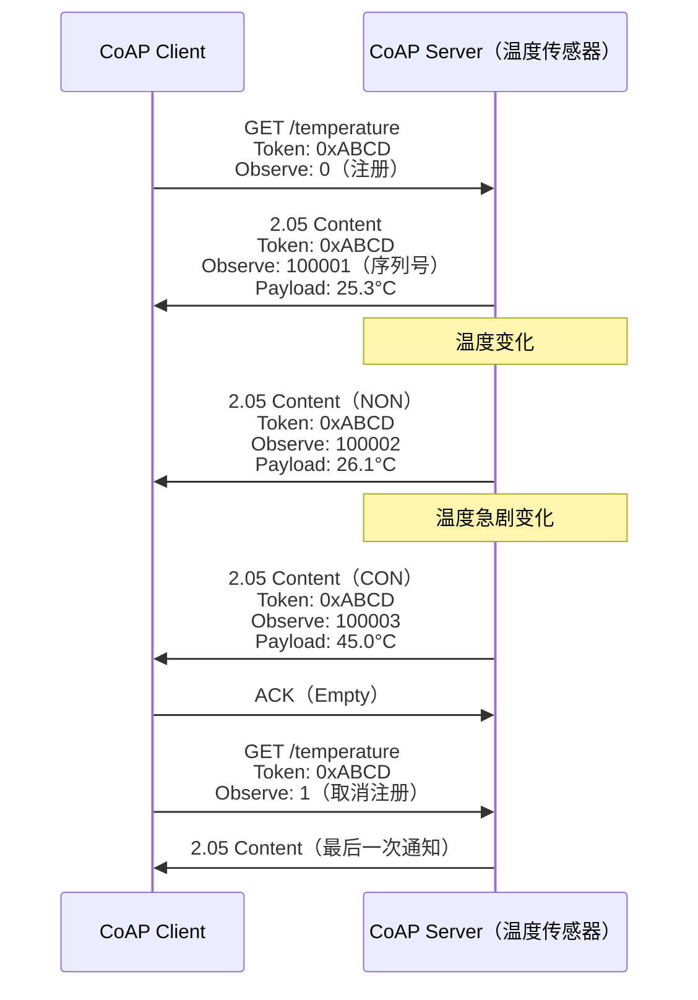

---
tags:
  - network
  - protocol-analysis
  - tier3
  - MQTT
  - IoT协议
---

# IoT 消息协议：MQTT、CoAP 与 AMQP

> [!abstract] TL;DR
> 物联网消息层由三大协议支撑：MQTT（发布/订阅，TCP，极低开销）、CoAP（RESTful，UDP，受限设备）、AMQP（企业消息总线，TCP，功能完备）。三者均有 Wireshark 内置 dissector，但安全现状堪忧——默认明文无认证的 MQTT broker 在 Shodan 上大量可见。本章从协议设计原理出发，覆盖报文结构、QoS 机制、抓包分析方法，以及安全加固路径（TLS/mTLS + ACL）。

## 概述与定位

### IoT 消息协议全景

物联网设备数量在 2025 年已超过 150 亿，它们运行于嵌入式 MCU、受限传感器节点或工业网关之上，共同的挑战是：

- **计算资源受限**：RAM 可能只有几十 KB，无法承载 HTTP 的头部开销
- **网络质量不稳定**：低带宽、高延迟、频繁断线（NB-IoT、LoRa、Zigbee 回传链路）
- **大规模并发**：一个平台可能同时管理数百万设备
- **异步消息语义**：传感器上报数据、平台下发控制指令，双向异步

针对这些约束，工业界分化出三条技术路线：

| 协议 | 传输层 | 模式 | 诞生背景 | 典型端口 |
|------|--------|------|---------|---------|
| MQTT | TCP | 发布/订阅（经由 broker） | 1999 IBM，卫星 SCADA | 1883（明文）、8883（TLS） |
| MQTT-SN | UDP | 发布/订阅（经由 gateway） | 传感器网络，MQTT 的 UDP 适配版 | 无标准端口，通常 1884 |
| CoAP | UDP | RESTful 请求/响应 | IETF RFC 7252，受限节点互联网 | 5683（明文）、5684（DTLS） |
| AMQP | TCP | 消息队列（exchange/queue） | 2003 JPMorgan，金融中间件 | 5672（明文）、5671（TLS） |

MQTT 在消费级 IoT（智能家居、智能穿戴）和车联网中占绝对主导地位，CoAP 在工业传感器和 M2M 场景中有稳固份额，AMQP 则是企业级消息总线（RabbitMQ、Azure Service Bus）的基础，偶尔出现在工业物联网的数据汇聚层。

### 与本系列其他章节的关联

- 第 06 章讲二进制协议逆向，MQTT 和 CoAP 的固定头部是典型的紧凑二进制格式，逆向手法高度相关
- 第 05 章讲 TLS 解密，MQTT over TLS（端口 8883）的分析流程与之完全相同
- 系列 39（固件逆向）中，嵌入式 MQTT 客户端的 broker 地址和 topic 常硬编码于固件，是信息收集的重要来源

## 原理与机制

### MQTT 发布/订阅模型

MQTT 的核心是 **broker**（消息代理），所有设备不直接通信，而是通过 broker 路由消息。

```
[温度传感器] --PUBLISH--> [Broker] --PUBLISH--> [手机 App]
                                   --PUBLISH--> [数据中心记录器]
[手机 App]   --SUBSCRIBE--> [Broker]（订阅 home/+/temperature）
```

**Topic（主题）** 是 MQTT 的路由键，采用层级结构，分隔符为 `/`：

```
home/living-room/temperature
home/bedroom/humidity
factory/line-A/machine-01/rpm
factory/line-A/machine-02/rpm
```

通配符有两种：
- `+`（单层通配）：`home/+/temperature` 匹配 `home/living-room/temperature` 和 `home/bedroom/temperature`，但不匹配 `home/floor1/room2/temperature`
- `#`（多层通配，只能放末尾）：`factory/line-A/#` 匹配该前缀下所有层级的 topic

通配符订阅是遍历攻击的核心手段：如果 broker 允许未授权客户端订阅 `#`，攻击者可以接收平台上所有设备的所有消息。

### MQTT QoS 三个级别

QoS（服务质量）是 MQTT 最复杂也最常被误解的机制：

**QoS 0（At most once，最多一次）**：
- PUBLISH 包单向发送，不做任何确认
- 等价于"尽力而为"，网络丢包则消息丢失
- 适合：高频传感器数据（丢一帧无所谓），遥测日志

**QoS 1（At least once，至少一次）**：
- 发送方保存消息，等待 PUBACK；超时重传
- 接收方可能收到重复消息（需业务层去重）
- 适合：控制指令、告警事件

**QoS 2（Exactly once，恰好一次）**：
- 四次握手：PUBLISH → PUBREC → PUBREL → PUBCOMP
- 保证消息恰好送达一次，无重复
- 适合：金融交易、计费事件，代价是延迟最高

QoS 1 和 QoS 2 的重传依赖 **Packet Identifier**（2 字节，QoS 0 无此字段）。在 Wireshark 中追踪一次 QoS 2 完整交换，可以看到四个报文的 Packet ID 完全一致。

### MQTT 报文类型完整表

MQTT 固定头部第一字节高 4 位为报文类型，低 4 位为标志位（QoS/Retain/Dup）：

| 类型值 | 名称 | 方向 | 描述 |
|-------|------|------|------|
| 1 | CONNECT | 客户端→Broker | 建立连接，携带认证信息 |
| 2 | CONNACK | Broker→客户端 | 连接确认，Return Code 指示结果 |
| 3 | PUBLISH | 双向 | 发布消息，含 topic、payload、QoS |
| 4 | PUBACK | 双向 | QoS 1 确认 |
| 5 | PUBREC | 双向 | QoS 2 第一步确认 |
| 6 | PUBREL | 双向 | QoS 2 释放 |
| 7 | PUBCOMP | 双向 | QoS 2 完成 |
| 8 | SUBSCRIBE | 客户端→Broker | 订阅 topic |
| 9 | SUBACK | Broker→客户端 | 订阅确认，返回每个 topic 的最大 QoS |
| 10 | UNSUBSCRIBE | 客户端→Broker | 取消订阅 |
| 11 | UNSUBACK | Broker→客户端 | 取消订阅确认 |
| 12 | PINGREQ | 客户端→Broker | 心跳请求（Keep Alive 机制） |
| 13 | PINGRESP | Broker→客户端 | 心跳响应 |
| 14 | DISCONNECT | 客户端→Broker | 优雅断开（3.1.1 单向，5.0 双向） |
| 15 | AUTH | 双向（5.0 新增） | 扩展认证握手 |

### MQTT CONNECT 报文解析

CONNECT 是所有抓包分析中最有价值的报文，其可变头部和负载包含：

**可变头部（Variable Header）**：
```
协议名称长度  : 0x00 0x04
协议名称      : "MQTT"（v3.1.1）或 "MQIsdp"（v3.1）
协议级别      : 0x04（v3.1.1）、0x05（v5.0）
连接标志      : 1 字节位掩码
               [7] UsernameFlag
               [6] PasswordFlag
               [5] WillRetain
               [4:3] WillQoS
               [2] WillFlag
               [1] CleanSession
               [0] Reserved
Keep Alive    : 2 字节（秒），0 表示禁用心跳
```

**负载（Payload，顺序固定）**：
1. Client ID（必须）：设备唯一标识符
2. Will Topic（若 WillFlag=1）：遗嘱消息 topic
3. Will Message（若 WillFlag=1）：遗嘱消息内容
4. Username（若 UsernameFlag=1）
5. Password（若 PasswordFlag=1）

遗嘱消息（Last Will and Testament，LWT）：当客户端异常断线（TCP RST，非正常 DISCONNECT），broker 自动将此消息发布到 Will Topic，告知订阅者设备离线。这是 MQTT 实现设备在线状态管理的标准模式。

### MQTT 5.0 核心新增特性

MQTT 5.0（2019 年正式发布）在 3.1.1 基础上增加：

- **属性字段（Properties）**：可变头部和负载中引入 TLV 格式属性，包括消息过期时间（Message Expiry Interval）、内容类型（Content Type，用于标记 JSON/Protobuf）、响应 Topic（实现请求/响应模式）、相关数据（Correlation Data）
- **原因码（Reason Codes）**：CONNACK、DISCONNECT 等报文中引入精细化的状态码（超过 3.1.1 的 5 种错误码，扩展到数十种）
- **订阅选项（Subscription Options）**：每个订阅可单独设置 No Local（不收到自己发布的消息）、Retain As Published、Retain Handling
- **共享订阅（Shared Subscriptions）**：格式 `$share/{GroupName}/{Filter}`，实现消费者组负载均衡，类似 Kafka consumer group
- **双向 DISCONNECT**：broker 现在可以主动向客户端发送 DISCONNECT 并附带原因码
- **认证交换（Extended Authentication）**：AUTH 报文支持 SASL 风格的多步骤认证（如 SCRAM-SHA-256）

### MQTT-SN：传感器网络适配

MQTT-SN（MQTT for Sensor Networks）运行于 UDP 之上，为无法建立 TCP 长连接的设备（ZigBee 节点、蓝牙 mesh）设计：

关键差异：
- Topic 用 **2 字节 Topic ID**（整数）替代字符串，通过 REGISTER/REGACK 协商
- 引入 **GWINFO**（网关广播）和 **SEARCHGW** 协议，支持设备动态发现网关
- **SLEEP/AWAKE** 状态，节点可进入深度睡眠，网关缓存离线消息，节点醒来后发送 AWAKE 拉取
- 经由 MQTT-SN Gateway 转换为标准 MQTT 再接入 broker

### CoAP：受限网络的 RESTful

CoAP（Constrained Application Protocol，RFC 7252）将 HTTP 的 REST 语义移植到 UDP，设计极为精简：

**消息类型**：
- **CON（Confirmable）**：可靠消息，必须得到 ACK（类似 TCP，但只有一次重试逻辑）
- **NON（Non-confirmable）**：不可靠消息，单向发送
- **ACK（Acknowledgement）**：对 CON 的确认，可携带响应（Piggybacked Response）或为空（Empty ACK）
- **RST（Reset）**：拒绝或无法处理收到的消息

**方法码**：GET（0.01）、POST（0.02）、PUT（0.03）、DELETE（0.04），与 HTTP 语义基本一致，响应码格式为 `c.dd`（如 2.05 = Content，4.04 = Not Found）。

**Observe 扩展（RFC 7641）**：客户端 GET 时带 `Observe: 0` 选项，服务端将持续推送资源变化，客户端发 `Observe: 1` 取消注册。这是 CoAP 对 MQTT 发布/订阅模式的替代实现。

**Block-wise 传输（RFC 7959）**：针对 UDP MTU 限制，将大资源分块：`Block2` 选项用于 GET 响应分块，`Block1` 选项用于 POST/PUT 请求分块，每块默认 1024 字节，支持指数退避重传。

**CoAP 固定头部**（4 字节）：
```
 0                   1                   2                   3
 0 1 2 3 4 5 6 7 8 9 0 1 2 3 4 5 6 7 8 9 0 1 2 3 4 5 6 7 8 9 0 1
+-+-+-+-+-+-+-+-+-+-+-+-+-+-+-+-+-+-+-+-+-+-+-+-+-+-+-+-+-+-+-+-+
|Ver| T |  TKL  |      Code     |          Message ID           |
+-+-+-+-+-+-+-+-+-+-+-+-+-+-+-+-+-+-+-+-+-+-+-+-+-+-+-+-+-+-+-+-+
|   Token (if any, TKL bytes) ...
+-+-+-+-+-+-+-+-+-+-+-+-+-+-+-+-+-+-+-+-+-+-+-+-+-+-+-+-+-+-+-+-+
|   Options (if any) ...
+-+-+-+-+-+-+-+-+-+-+-+-+-+-+-+-+-+-+-+-+-+-+-+-+-+-+-+-+-+-+-+-+
|1 1 1 1 1 1 1 1|    Payload (if any) ...
+-+-+-+-+-+-+-+-+-+-+-+-+-+-+-+-+-+-+-+-+-+-+-+-+-+-+-+-+-+-+-+-+
```

- Ver：固定 01
- T：消息类型（2 位，CON/NON/ACK/RST）
- TKL：Token 长度（0-8 字节，用于匹配请求与响应）
- Code：3 位 class + 5 位 detail
- Message ID：2 字节，用于去重和确认匹配

**Token 与 Message ID 的区别**：
- Message ID 用于 CON/ACK 的传输层匹配（重传去重）
- Token 用于应用层的请求/响应匹配（一个 Token 可对应多个 Observe 通知）

### AMQP：企业消息总线

AMQP（Advanced Message Queuing Protocol）设计目标是互操作性和企业级可靠投递，比 MQTT 复杂得多。

**AMQP 0-9-1 核心概念**（RabbitMQ 实现的版本）：

```
Producer --> [Exchange] --> [Binding] --> [Queue] --> Consumer
                |                          |
            routing-key               消息存储
```

- **Exchange（交换机）**：接收生产者消息，根据规则路由到队列
  - **direct**：routing-key 精确匹配
  - **fanout**：广播到所有绑定队列（类似 MQTT `#` 订阅）
  - **topic**：routing-key 模式匹配（`*` 匹配一个词，`#` 匹配零或多个词）
  - **headers**：根据消息头部属性路由
- **Queue（队列）**：消息的持久化存储，消费者从队列拉取或推送
- **Binding（绑定）**：Exchange 到 Queue 的路由规则，含 binding-key

**AMQP 1.0**（ISO/IEC 19464，OASIS 标准）与 0-9-1 是**不兼容的两个协议**：
- 1.0 移除了 exchange/queue 等拓扑概念，只定义传输层（frame 格式、会话、链路）
- Azure Service Bus、ActiveMQ Artemis、AWS Amazon MQ 实现 AMQP 1.0
- RabbitMQ 默认 0-9-1，通过插件支持 1.0

**AMQP 帧结构**：

```
[8 字节帧头]
  大小    : 4 字节（含帧头本身）
  DOFF    : 1 字节（数据偏移，最小 2）
  类型    : 1 字节（0=AMQP帧，8=SASL帧）
  通道号  : 2 字节
[帧体 (AMQP 1.0 用 AMQP 类型编码)]
```

AMQP 的 SASL 握手（在 TCP 连接建立后、AMQP 协议握手前）携带明文或 SCRAM 认证，是抓包分析中凭证提取的主要来源。

## 结构/算法/伪代码详解

### MQTT 报文完整解析示例

以一个真实的 MQTT CONNECT 报文字节序列为例：

```
原始字节（十六进制）：
10 3A 00 04 4D 51 54 54 04 C2 00 3C 00 0E 6D79
2D 64 65 76 69 63 65 2D 30 30 31 00 04 75 73 65
72 00 08 70 61 73 73 77 6F 72 64

解析：
固定头部：
  10 = 0001 0000 → 报文类型 1 (CONNECT)，标志位 0000
  3A = 58 → 剩余长度 58 字节

可变头部：
  00 04 = 协议名长度 4
  4D 51 54 54 = "MQTT"
  04 = 协议级别 4 (v3.1.1)
  C2 = 1100 0010 →
       [7]=1 Username Flag
       [6]=1 Password Flag
       [5]=0 WillRetain=0
       [4:3]=00 WillQoS=0
       [2]=0 WillFlag=0
       [1]=1 CleanSession=1
       [0]=0 Reserved
  00 3C = Keep Alive = 60 秒

负载：
  00 0E = Client ID 长度 14
  6D 79 2D 64 65 76 69 63 65 2D 30 30 31 = "my-device-001"  ← 含 0x00 0x0E 头
  00 04 = Username 长度 4
  75 73 65 72 = "user"
  00 08 = Password 长度 8
  70 61 73 73 77 6F 72 64 = "password"
```

如果抓到此报文，在 Wireshark 中展开 MQTT 协议树即可直接读取 Client ID、Username、Password（明文）。

### MQTT 剩余长度编码（Variable-Length Integer）

MQTT 使用 Base-128 可变长度整数编码剩余长度，最多 4 字节，能表示 0–268,435,455：

```python
def encode_remaining_length(value: int) -> bytes:
    """MQTT 剩余长度编码"""
    encoded = bytearray()
    while True:
        encoded_byte = value % 128
        value = value // 128
        if value > 0:
            encoded_byte |= 0x80  # 设置续位
        encoded.append(encoded_byte)
        if value == 0:
            break
    return bytes(encoded)

def decode_remaining_length(data: bytes, offset: int) -> tuple[int, int]:
    """返回 (value, bytes_consumed)"""
    multiplier = 1
    value = 0
    i = 0
    while True:
        byte = data[offset + i]
        value += (byte & 0x7F) * multiplier
        multiplier *= 128
        i += 1
        if (byte & 0x80) == 0:
            break
        if i > 4:
            raise ValueError("Remaining Length 超过 4 字节")
    return value, i

# 示例
# 长度 321 = 0x141 → 编码为 C1 02
# 0x141 = 321
# 321 % 128 = 65, 321 // 128 = 2 → 65 | 0x80 = 0xC1
# 2 % 128 = 2, 2 // 128 = 0 → 2
# 结果: C1 02
```

这与 LEB128 编码（Protocol Buffers 中也使用）完全相同，是一种常见的紧凑整数编码，在固件逆向中常遇到。

### QoS 2 四次握手状态机

```
发送方状态                          接收方状态
─────────────────────────────────────────────────────
IDLE
  │ store(msg, PUBLISH_SENT)
  │ ───────── PUBLISH(id=42) ──────────────────────→
  │                                                  RECEIVED
  │                                                    store(id=42)
  │ ←─────── PUBREC(id=42) ────────────────────────
  │ store(PUBREL_SENT), delete PUBLISH_SENT
  │ ───────── PUBREL(id=42) ───────────────────────→
  │                                                  COMPLETED
  │                                                    deliver(msg)
  │                                                    delete(id=42)
  │ ←─────── PUBCOMP(id=42) ───────────────────────
  │ delete(PUBREL_SENT)
IDLE
─────────────────────────────────────────────────────
```

任何阶段断线重连，发送方从持久化状态恢复重传（PUBLISH 设 DUP=1，PUBREL 直接重发）。接收方凭 Packet ID 幂等处理。

### CoAP 可靠传输算法

CoAP 对 CON 消息的重传使用指数退避：

```python
import random

ACK_TIMEOUT = 2.0        # 初始超时（秒）
ACK_RANDOM_FACTOR = 1.5  # 随机因子
MAX_RETRANSMIT = 4       # 最大重传次数
NSTART = 1               # 同时进行的交互数量限制

def coap_send_con(message, send_fn, recv_fn):
    """CON 消息可靠发送"""
    # 初始随机超时：ACK_TIMEOUT * [1.0, ACK_RANDOM_FACTOR)
    timeout = ACK_TIMEOUT * (1 + random.random() * (ACK_RANDOM_FACTOR - 1))
    
    for attempt in range(MAX_RETRANSMIT + 1):
        send_fn(message)
        try:
            response = recv_fn(timeout=timeout)
            if response.message_id == message.message_id:
                if response.type == 'ACK':
                    return response
                elif response.type == 'RST':
                    raise CoAPResetException()
        except TimeoutError:
            if attempt == MAX_RETRANSMIT:
                raise CoAPTransmissionError("超过最大重传次数")
            timeout *= 2  # 指数退避
    
# MAX_TRANSMIT_SPAN = ACK_TIMEOUT * (2^MAX_RETRANSMIT - 1) * ACK_RANDOM_FACTOR
# = 2.0 * 15 * 1.5 = 45 秒（最长等待时间）
```

CoAP 的 Piggyback 模式（即时响应）与 Separate Response（延迟响应）：
- **Piggyback**：服务端立即处理完毕，在 ACK 中直接携带响应，Token 和 Message ID 与请求相同
- **Separate**：服务端先发空 ACK（Empty ACK，Code=0.00）确认收到，处理完后再发 CON 类型的响应，客户端对此 CON 发 ACK

### CoAP Observe 事件流



Observe 序列号用于检测丢包和乱序（接收方丢弃序列号回退的通知，除非序列号差超过 2^23）。

### AMQP 0-9-1 方法帧层次

```
TCP 连接
  └─ AMQP 连接（Connection）
       ├─ Channel 1
       │    ├─ Exchange.Declare（创建交换机）
       │    ├─ Queue.Declare（创建队列）
       │    ├─ Queue.Bind（绑定）
       │    ├─ Basic.Publish（发布消息）
       │    │    ├─ Method Frame（Basic.Publish，含 exchange、routing-key）
       │    │    ├─ Content Header Frame（属性：content-type、delivery-mode 等）
       │    │    └─ Content Body Frame（实际 payload，可多帧）
       │    └─ Basic.Consume（订阅）
       └─ Channel 2
            └─ ...
```

一条 AMQP 消息由三个帧组成：方法帧（路由信息）+ 内容头帧（元数据）+ 内容体帧（payload）。在 Wireshark 中追踪一次 `Basic.Publish` 需要关联这三个帧。

## 工具视角与实战

### Wireshark MQTT 抓包实战

**捕获过滤器**（在 BPF 层过滤，减少抓包量）：
```
tcp port 1883 or tcp port 8883
```

**显示过滤器**（分析阶段）：
```wireshark
# 仅显示 MQTT 流量
mqtt

# 过滤特定类型报文
mqtt.msgtype == 1          # CONNECT
mqtt.msgtype == 3          # PUBLISH
mqtt.msgtype == 8          # SUBSCRIBE

# 过滤特定 topic
mqtt.topic == "home/sensor/temperature"
mqtt.topic contains "sensor"

# 过滤有用户名的 CONNECT
mqtt.username_flag == 1

# 过滤带 will 的连接
mqtt.will_flag == 1

# 过滤特定 QoS
mqtt.qos == 2
```

**统计→协议层级（Statistics→Protocol Hierarchy）**：可以直观看到流量中 MQTT 占比。

**跟踪 TCP 流**：右键 MQTT 包 → Follow → TCP Stream，可看到完整的 CONNECT/CONNACK/PUBLISH 序列。

**提取 MQTT payload**：File → Export PDUs to File（选 OSI Layer 7），可将所有 MQTT payload 导出为独立文件，配合 `tshark` 更方便：

```bash
# 提取所有 PUBLISH 报文的 topic 和 payload
tshark -r capture.pcap \
  -Y "mqtt.msgtype == 3" \
  -T fields \
  -e mqtt.topic \
  -e mqtt.msg \
  -E separator="|"

# 输出示例：
# home/sensor/temp|{"value":25.3,"unit":"C"}
# factory/pump/01/rpm|{"rpm":1450}
```

### mosquitto_sub 在线协议分析

`mosquitto_sub`（Eclipse Mosquitto 客户端）常用于测试和实时监控：

```bash
# 连接到 broker，订阅所有 topic（需要 broker 允许）
mosquitto_sub -h 192.168.1.100 -p 1883 -t '#' -v

# 带认证
mosquitto_sub -h broker.example.com -p 8883 \
  --cafile /etc/ssl/certs/ca-certificates.crt \
  -u username -P password \
  -t 'home/#' -v

# 同时订阅多个 topic
mosquitto_sub -h localhost -t 'sensors/+/temperature' \
              -t 'sensors/+/humidity' -v

# 输出带时间戳
mosquitto_sub -h localhost -t '#' -v \
  | while IFS= read -r line; do echo "$(date -u +%Y-%m-%dT%H:%M:%SZ) $line"; done

# 输出 payload 的十六进制（适合二进制 payload）
mosquitto_sub -h localhost -t '#' -F "%t %x\n"
```

`mosquitto_pub` 发布测试消息：

```bash
# 发布简单消息
mosquitto_pub -h localhost -t 'test/hello' -m '{"status":"ok"}'

# 发布带遗嘱的连接（需要配合订阅验证 LWT）
mosquitto_pub -h localhost -t 'device/001/data' -m 'payload' \
  --will-topic 'device/001/status' \
  --will-payload 'offline' \
  --will-qos 1 \
  --will-retain

# 发布保留消息
mosquitto_pub -h localhost -t 'system/config' -m '{"mode":"auto"}' -r
```

### CoAP 抓包分析

**Wireshark CoAP 显示过滤器**：
```wireshark
coap                          # 所有 CoAP 流量
coap.type == 0                # CON (Confirmable)
coap.type == 2                # ACK
coap.code == 2.05             # 2.05 Content 响应
coap.code == 0.01             # GET 请求
coap.opt.observe              # 含 Observe 选项的报文
coap.opt.uri_path == "temperature"  # 特定 URI
```

**CoAP 客户端工具**：

```bash
# libcoap 工具套件
# 发送 GET 请求
coap-client -m get coap://192.168.1.50:5683/temperature

# 订阅 Observe（持续接收推送）
coap-client -m get -s 60 coap://192.168.1.50:5683/temperature

# PUT 控制
coap-client -m put -e '{"relay":1}' coap://192.168.1.50:5683/relay/1

# DTLS 加密请求
coap-client -m get -u user -k secret coaps://192.168.1.50:5684/temperature

# californium（Java CoAP 库）的命令行工具
cf-client get coap://[::1]/test
```

### AMQP 抓包分析

**Wireshark AMQP 显示过滤器**：
```wireshark
amqp                           # 所有 AMQP
amqp.method.method-id == 10   # Connection.Start（握手，含 SASL mechanism）
amqp.method.method-id == 40   # Basic.Publish
amqp.method.method-id == 72   # Basic.Deliver（消费者接收）
amqp.method.class-id == 60    # Basic 类（消息传输相关）
```

RabbitMQ 管理插件提供 HTTP API，可以辅助分析：

```bash
# 列出所有 exchange
curl -u guest:guest http://localhost:15672/api/exchanges/%2F

# 列出队列及消息数
curl -u guest:guest http://localhost:15672/api/queues

# 查看绑定关系
curl -u guest:guest http://localhost:15672/api/bindings/%2F

# 获取队列中的消息（不消费，用于分析）
curl -u guest:guest -H "content-type:application/json" \
  -X POST http://localhost:15672/api/queues/%2F/my-queue/get \
  -d '{"count":5,"ackmode":"ack_requeue_true","encoding":"auto"}'
```

### Python 脚本：MQTT 流量自动化分析

```python
#!/usr/bin/env python3
"""
分析 pcap 文件中的 MQTT 流量
依赖: pip install scapy
"""
from scapy.all import rdpcap, TCP
from scapy.contrib.mqtt import MQTT, MQTTConnect, MQTTPublish, MQTTSubscribe


def analyze_mqtt_pcap(pcap_file: str):
    packets = rdpcap(pcap_file)
    
    connections = {}     # client_id -> {username, password, will}
    publishes = []       # [{topic, payload, qos, retain}]
    subscriptions = {}   # client_id -> [topic_filters]
    
    for pkt in packets:
        if not (pkt.haslayer(TCP) and pkt.haslayer(MQTT)):
            continue
        
        mqtt = pkt[MQTT]
        
        # CONNECT
        if mqtt.type == 1 and pkt.haslayer(MQTTConnect):
            conn = pkt[MQTTConnect]
            client_id = conn.clientId.decode('utf-8', errors='replace')
            record = {
                'client_id': client_id,
                'username': None,
                'password': None,
                'will_topic': None,
                'keep_alive': conn.keepAlive,
                'clean_session': bool(conn.flags & 0x02),
            }
            if conn.flags & 0x80:  # Username Flag
                record['username'] = conn.username.decode('utf-8', errors='replace')
            if conn.flags & 0x40:  # Password Flag
                record['password'] = conn.password.decode('utf-8', errors='replace')
            if conn.flags & 0x04:  # Will Flag
                record['will_topic'] = conn.willTopic.decode('utf-8', errors='replace')
            connections[client_id] = record
        
        # PUBLISH
        elif mqtt.type == 3 and pkt.haslayer(MQTTPublish):
            pub = pkt[MQTTPublish]
            publishes.append({
                'topic': pub.topic.decode('utf-8', errors='replace'),
                'payload': pub.value,
                'qos': (mqtt.QOS),
                'retain': bool(mqtt.RETAIN),
            })
    
    return connections, publishes, subscriptions


def main():
    import sys
    if len(sys.argv) < 2:
        print("用法: mqtt_analyze.py <file.pcap>")
        sys.exit(1)
    
    conns, pubs, subs = analyze_mqtt_pcap(sys.argv[1])
    
    print("=== 发现的 MQTT 连接 ===")
    for cid, info in conns.items():
        print(f"  Client ID: {cid}")
        print(f"    Username: {info['username']}")
        print(f"    Password: {info['password']}")
        print(f"    Keep Alive: {info['keep_alive']}s")
        print()
    
    print("=== PUBLISH 消息摘要 ===")
    topics = {}
    for pub in pubs:
        topics[pub['topic']] = topics.get(pub['topic'], 0) + 1
    for topic, count in sorted(topics.items()):
        print(f"  [{count:4d}次] {topic}")
    
    if conns:
        print("\n[!] 发现明文认证凭据，建议检查是否使用 TLS")

if __name__ == '__main__':
    main()
```

### 固件内 MQTT 参数提取

在嵌入式固件逆向场景（与系列 39 呼应），MQTT 客户端常将连接参数硬编码于 Flash：

```bash
# 在固件 binary 中搜索 MQTT 相关字符串
strings firmware.bin | grep -E '(mqtt|broker|1883|8883|mosquitto)'

# 搜索常见 IoT 平台 broker 地址
strings firmware.bin | grep -E '(aliyuncs\.com|tencentdevices\.com|azure-devices\.net|amazonaws\.com)'

# 搜索 topic 模式（通常包含设备 ID 占位符）
strings firmware.bin | grep -E '^[a-zA-Z0-9_/]+(\$\{|%s|%d)' | head -20

# 用 binwalk 提取文件系统后在配置文件中搜索
binwalk -e firmware.bin
grep -r "mqtt\|broker\|1883" _firmware.bin.extracted/

# 用 Ghidra 搜索 MQTTClient_connect 函数调用
# 关注函数参数中的字符串引用：broker addr、port、clientID、credentials
```

典型发现：许多设备使用设备序列号作为 Client ID 和 password，可从标签或固件中提取，实现针对该设备的伪造连接。

### MQTT 5.0 属性抓包

MQTT 5.0 引入属性后，PUBLISH 报文结构扩展：

```
可变头部：
  Topic Name: "home/temp"
  Packet Identifier: 0x0001（QoS 1/2）
  Properties Length: N 字节
  Properties:
    0x01 = Payload Format Indicator（1 = UTF-8 文本）
    0x02 = Message Expiry Interval（4 字节 = 3600 秒）
    0x03 = Content Type（"application/json"）
    0x08 = Response Topic（"home/temp/response"）
    0x09 = Correlation Data（用于关联请求-响应）
    0x26 = User Property（自定义 KV，可多个）
```

Wireshark 4.x 对 MQTT 5.0 的 dissector 已完整支持这些属性字段。

## 安全性与正确使用

### 威胁模型：为什么 IoT 协议攻击面如此广

IoT 设备的部署特性导致安全短板系统性存在：

1. **默认无认证**：MQTT 3.1.1 规范允许 username/password 字段为空，broker 默认配置（如 Mosquitto）通常接受匿名连接
2. **默认无加密**：端口 1883（MQTT）和 5683（CoAP）均为明文，大量设备因证书管理复杂而放弃 TLS
3. **长期不更新**：IoT 设备生命周期长（5-10 年），固件更新困难，协议栈漏洞长期驻留
4. **直接暴露公网**：工业网关、家庭路由器后的 IoT 设备通过 NAT 穿透或直接接入公网

### Shodan 暴露的 MQTT broker 现状

Shodan 是发现公网暴露 IoT 服务的标准工具。搜索方法：

```
# Shodan 搜索语法（在 shodan.io 上执行）
port:1883           # 找所有开放 1883 的主机
port:1883 mqtt      # 过滤确认是 MQTT 的
mqtt product:"Mosquitto"  # 指定 broker 实现
mqtt country:CN     # 按国家过滤
```

Shodan 对 MQTT 有专门的 banner 抓取，可识别 broker 版本和特性。统计数据显示，任意时刻公网上都有数万个 MQTT broker 接受匿名连接，其中不乏暴露工业设备数据的 broker。

**安全测试限定范围**：只对自己拥有或明确授权的 broker 进行测试。连接陌生 broker 的行为不仅在伦理上不可接受，在大多数法域下也构成未经授权的计算机访问。

### topic 遍历攻击

当 broker 允许匿名连接或弱认证时，攻击者可进行 topic 遍历：

```python
import paho.mqtt.client as mqtt
import json

discovered_topics = set()

def on_message(client, userdata, msg):
    topic = msg.topic
    if topic not in discovered_topics:
        discovered_topics.add(topic)
        print(f"[新 Topic] {topic}")
        try:
            payload = json.loads(msg.payload)
            print(f"  Payload: {json.dumps(payload, ensure_ascii=False)[:200]}")
        except Exception:
            print(f"  Payload (raw): {msg.payload[:100]}")

def on_connect(client, userdata, flags, rc):
    if rc == 0:
        print("[+] 连接成功")
        client.subscribe('#')  # 订阅所有 topic
    else:
        print(f"[-] 连接失败：{rc}")

# 仅对授权目标执行
TARGET_BROKER = "your-own-broker.local"

client = mqtt.Client()
client.on_connect = on_connect
client.on_message = on_message
client.connect(TARGET_BROKER, 1883, 60)
client.loop_forever()
```

防御措施：配置 broker 的 ACL（访问控制列表），禁止通配符订阅，或限制到特定客户端。

### CONNACK 返回码识别

连接失败时，CONNACK 返回码泄露信息：

| 返回码（3.1.1） | 含义 | 信息泄露 |
|---------------|------|---------|
| 0x00 | 连接接受 | 认证成功 |
| 0x01 | 不可接受的协议版本 | broker 版本信息 |
| 0x02 | 标识符被拒绝 | Client ID 非法 |
| 0x03 | 服务端不可用 | broker 内部错误 |
| 0x04 | 用户名或密码错误 | 区分用户名和密码错误（部分 broker） |
| 0x05 | 未授权 | 认证系统拒绝 |

返回码 0x04 vs 0x05 的区别可能被用于用户名枚举攻击（类似 HTTP 401 vs 403）。高安全要求的 broker 对所有认证失败统一返回 0x05。

### CoAP 的安全问题

**DTLS 不可选**：CoAP 规范（RFC 7252）将 DTLS 定义为可选，导致大量实现忽略它。默认端口 5683 完全明文，5684 才是 DTLS 端口。

**CoAP 放大攻击**：CoAP 运行在 UDP 上，且多播地址（FF0X::FD）用于服务发现，精心构造的请求可获得放大响应，用于 UDP 放大 DDoS 攻击（放大因子通常 10-50x）。

**Token 预测**：Token 用于匹配请求响应，若随机性不足，攻击者可能伪造响应（适用于 NON 消息）。

### TLS/mTLS 加固方案

**MQTT over TLS（端口 8883）配置示例**（Mosquitto broker 端）：

```conf
# /etc/mosquitto/mosquitto.conf

# 关闭明文端口
# listener 1883   ← 注释掉这行

# 开启 TLS 端口
listener 8883
cafile   /etc/mosquitto/ca.crt
certfile /etc/mosquitto/server.crt
keyfile  /etc/mosquitto/server.key

# mTLS：要求客户端证书
require_certificate true
use_identity_as_username false  # 不使用证书 CN 作为 username

# TLS 版本限制
tls_version tlsv1.3

# 禁止匿名连接
allow_anonymous false
password_file /etc/mosquitto/passwd
```

**客户端 mTLS 连接**（Python paho-mqtt）：

```python
import paho.mqtt.client as mqtt
import ssl

client = mqtt.Client(client_id="device-001")

# 配置 TLS
tls_context = ssl.create_default_context(ssl.Purpose.SERVER_AUTH)
tls_context.load_verify_locations('/etc/ssl/certs/ca.crt')
tls_context.load_cert_chain(
    certfile='/etc/device/device.crt',
    keyfile='/etc/device/device.key'
)
tls_context.minimum_version = ssl.TLSVersion.TLSv1_3

client.tls_set_context(tls_context)
client.connect("broker.example.com", 8883)
```

**CoAP DTLS 配置**（libcoap 服务端）：

```bash
# 生成 PSK（预共享密钥，比证书更适合受限设备）
coap-server -A 0.0.0.0 -p 5684 -k "shared-secret-key" -u "device-user"

# 客户端连接
coap-client -m get -u "device-user" -k "shared-secret-key" \
  coaps://192.168.1.50:5684/temperature
```

### ACL 配置与最小权限原则

Mosquitto ACL 文件示例（每个设备只能操作自己的 topic）：

```conf
# /etc/mosquitto/acl.conf

# 全局默认：拒绝所有
# （通过 acl_file 配置后，未匹配规则默认拒绝）

# 设备 device-001：只能发布到自己的 sensor topic，读取自己的 command topic
user device-001
topic write devices/device-001/sensors/#
topic read  devices/device-001/commands/#

# 设备 device-002
user device-002
topic write devices/device-002/sensors/#
topic read  devices/device-002/commands/#

# 管理员：可以读所有、写 command topic
user admin
topic readwrite #

# 监控系统：只读
user monitor
topic read #
```

关键原则：
- 每个设备用独立的证书或密码，不共用凭据
- 设备只能发布/订阅自己的 topic 命名空间
- 禁止设备订阅其他设备的 topic 或通配符
- 平台侧管理 API 走独立的管理连接，不走 MQTT

### Wireshark 解密 MQTT over TLS

与解密 HTTPS 相同（第 05 章），需要 SSLKEYLOGFILE：

```bash
# 在客户端侧设置环境变量后运行 MQTT 客户端
export SSLKEYLOGFILE=/tmp/mqtt-keys.log
python3 my-mqtt-client.py

# 在 Wireshark 中加载密钥文件
# 编辑 → 首选项 → Protocols → TLS → (Pre)-Master-Secret log filename
# 指定 /tmp/mqtt-keys.log
# 之后 8883 端口流量将自动解密显示 MQTT 报文
```

对于使用硬件 TPM 或安全元件存储私钥的设备，SSLKEYLOGFILE 方法失效，需要在代理层（类似移动端抓包的方案）或直接分析固件中的 TLS 实现。

## 小结

本章系统梳理了 IoT 消息层的三大协议族：

**MQTT**：发布/订阅模型，broker 居中路由，QoS 0/1/2 覆盖不同可靠性需求，CONNECT 报文包含明文凭据是抓包分析的黄金目标。MQTT 5.0 的属性机制、共享订阅、双向 DISCONNECT 使其向企业级消息中间件靠拢。MQTT-SN 以 UDP + Topic ID 替代字符串适配传感器网络。

**CoAP**：RESTful 语义移植到 UDP，CON/NON/ACK/RST 四种消息类型实现可靠/不可靠两种投递模式，Observe 扩展提供推送能力，Block-wise 解决 MTU 限制。DTLS 是 CoAP 的安全传输层，但现实中大量设备省略。

**AMQP**：exchange/queue/binding 的三级路由模型比 MQTT topic 更灵活，但协议复杂度更高。0-9-1（RabbitMQ）和 1.0（OASIS 标准）实际上是两个不兼容的协议。SASL 握手阶段是凭据提取的关键位置。

抓包视角：三者在 Wireshark 均有成熟 dissector，MQTT 的 `mqtt.topic`、`mqtt.username`、`mqtt.password` 等字段可直接过滤提取。`tshark` 配合字段提取适合批量离线分析。

安全视角：默认明文+匿名是 IoT 协议安全现状的核心问题，正确路径是强制 TLS（MQTT 8883 / CoAP DTLS 5684 / AMQP 5671）+ 设备证书（mTLS）+ 严格 ACL 三层叠加。固件逆向中，MQTT 连接参数是高价值目标，常以硬编码字符串形式存在于固件 .rodata 段。

关键工具链总结：

| 任务 | 工具 |
|------|------|
| 被动抓包分析 | Wireshark（mqtt/coap/amqp dissector）、tshark |
| MQTT 主动测试 | mosquitto_pub、mosquitto_sub、paho-mqtt |
| CoAP 主动测试 | coap-client（libcoap）、californium |
| AMQP 管理 | RabbitMQ Management UI、rabbitmqadmin |
| IoT 设备发现 | Shodan（仅用于已授权目标的研究） |
| 固件分析 | binwalk、strings、Ghidra |
| 流量解密 | SSLKEYLOGFILE + Wireshark |

## 相关阅读

- [MQTT 5.0 规范（OASIS）](https://docs.oasis-open.org/mqtt/mqtt/v5.0/mqtt-v5.0.html)
- [CoAP RFC 7252](https://datatracker.ietf.org/doc/html/rfc7252)
- [CoAP Observe RFC 7641](https://datatracker.ietf.org/doc/html/rfc7641)
- [CoAP Block-wise RFC 7959](https://datatracker.ietf.org/doc/html/rfc7959)
- [AMQP 1.0 OASIS 标准](https://www.amqp.org/resources/specifications)
- [Eclipse Mosquitto 文档](https://mosquitto.org/documentation/)
- [Wireshark MQTT dissector 源码](https://gitlab.com/wireshark/wireshark/-/blob/master/epan/dissectors/packet-mqtt.c)
- [MQTT Security Fundamentals（HiveMQ）](https://www.hivemq.com/tags/mqtt-security/)
- [Shodan MQTT 研究报告](https://www.shodan.io/search?query=port%3A1883)
- 系列第 05 章：TLS 握手与解密分析（MQTT over TLS 解密前置知识）
- 系列第 06 章：自定义协议逆向分析（二进制报文格式解析方法论）
- 系列第 39 章：固件逆向（从固件提取 MQTT 连接参数）

---

[[00.抓包与协议分析实战总览|⬆ 系列总览]] | [[16.TLS指纹进阶JA4与JARM与HASSH|← 上一章]] | [[18.eBPF与XDP高性能抓包|→ 下一章]]
