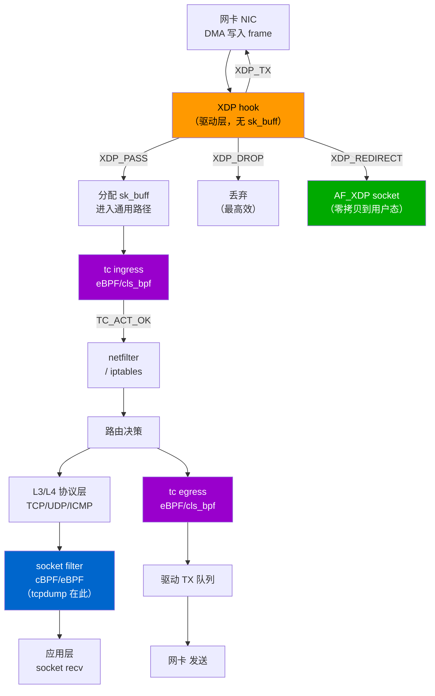

---
tags:
  - network
  - protocol-analysis
  - tier3
  - eBPF
  - XDP
---
# eBPF 与 XDP 高性能抓包

> [!abstract] TL;DR
> eBPF（扩展伯克利包过滤器）是 Linux 内核内置的可编程虚拟机，允许用户在内核态安全地运行自定义逻辑，无需修改内核源码或加载内核模块。XDP（eXpress Data Path）是 eBPF 在网络驱动层最早的 hook 点，在数据包刚离开网卡硬件、尚未分配 `sk_buff` 的瞬间即可决策处理。两者合力使得高性能零拷贝抓包、进程级流量关联以及容器/Kubernetes 网络可观测性成为可能，是传统 libpcap/AF_PACKET 方案在 10 Gbps+ 场景下的现代替代。

## 概述与定位

### 传统抓包的性能瓶颈

第 01 章介绍过经典 BPF（cBPF）的抓包原理：用户空间程序通过 `socket(AF_PACKET, SOCK_RAW, ...)` 打开原始套接字，内核将匹配 BPF 过滤器的数据包从内核 `sk_buff` 结构**复制**一份到用户空间的 libpcap 环形缓冲区。这一流程在低速链路下工作良好，但在高速网络场景下暴露出三类根本性瓶颈：

1. **逐包内存拷贝开销**：每个到达内核的数据包，都要经历网卡 DMA → 内核 `sk_buff` → 用户空间 mmap 缓冲区的两次拷贝（或至少一次显式 copy_to_user）。在 10 Gbps 链路上，单核每秒需处理约 1400 万个 64 字节小包，拷贝本身即成为瓶颈。
2. **sk_buff 分配开销**：Linux 协议栈在数据包到达时必须分配 `sk_buff` 元数据结构（通常 ≥256 字节），而小包场景下元数据与载荷之比极不划算，加剧 CPU 缓存压力。
3. **系统调用陷入开销**：AF_PACKET 的 MMAP 模式（`PACKET_MMAP`、`PACKET_RX_RING`）虽减少了 copy_to_user 频率，但用户态仍需轮询或 `poll()` 系统调用，在高 PPS（packets per second）场景下 syscall 开销不可忽略。

DPDK（Data Plane Development Kit）通过绕过内核完全在用户态轮询网卡 DMA 队列解决了这一问题，但代价是独占网卡、语言生态受限、与 Linux 标准网络栈完全割裂。eBPF/XDP 方案则在保留内核网络栈兼容性的前提下，将处理逻辑下推到内核态最早路径，做到了"不绕过内核却绕过拷贝"。

### eBPF 在抓包领域的定位

eBPF 抓包并不是单一产品或单一工具，而是一组技术能力的组合：

- **在 XDP 层**：以零拷贝速度在驱动层截获数据包，适合高速 IDS 传感器、流量镜像、DDoS 防御。
- **在 tc（Traffic Control）层**：在 ingress/egress 两个方向都能观测，适合容器网络策略、带宽限速、L7 可观测性。
- **在 socket filter 层**：eBPF 程序替代 cBPF 过滤器附加到 `AF_PACKET` 套接字，是 tcpdump 的现代内核侧实现。
- **在 kprobe/tracepoint 层**：追踪内核函数调用，关联数据包与发送进程（PID/comm/cgroup），实现"进程级网络归因"。

对于云原生/Kubernetes 环境，eBPF 的价值尤其突出：传统工具在容器内看到的是 veth 对一端，eBPF 能在宿主机内核层面同时观测所有命名空间的流量，并将数据包与容器 ID、Pod 名称关联，Cilium/Hubble 和 Pixie 正是基于这一能力构建的。

## 原理与机制

### eBPF 内核可编程虚拟机

eBPF 是一个运行在 Linux 内核内部的**受限 RISC 虚拟机**，与经典 BPF（cBPF，即 tcpdump 使用的 BPF）共享名称但已彻底重新设计：

| 维度 | cBPF | eBPF |
|------|------|------|
| 寄存器数 | 2（A、X）| 11（R0–R10，64 位）|
| 栈大小 | 无独立栈 | 512 字节 |
| 程序大小 | ~4096 指令 | 100 万指令（内核 5.2+）|
| Maps | 不支持 | 支持多种类型（hash/array/ringbuf...）|
| 调用内核辅助函数 | 极少 | 丰富的 helper 集合 |
| JIT 编译 | 部分平台 | x86_64/arm64/s390x/MIPS 全支持 |
| Hook 点 | socket filter | 几乎整个内核 |

eBPF 程序的生命周期：

```
用户空间源代码(.c)
    ↓ clang -target bpf 编译
BPF 字节码(.o ELF)
    ↓ bpf() 系统调用 BPF_PROG_LOAD
内核 Verifier 静态分析
    ↓ 验证通过
JIT 编译器 → 本机机器码
    ↓ bpf() BPF_PROG_ATTACH / XDP / TC attach
Hook 点挂载运行
```

**Verifier（验证器）** 是 eBPF 安全性的核心保障机制。它在程序加载时对 BPF 字节码执行严格的静态分析：

- **无界循环禁止**：通过有向无环图（DAG）遍历确保程序必然终止（内核 5.3+ 引入 bounded loop 支持，需可证明循环有上界）。
- **内存访问边界检查**：追踪每个寄存器的类型和值范围，确保指针访问不越界、不使用未初始化值。
- **栈深度限制**：512 字节栈，不允许动态栈分配。
- **指针运算限制**：指针只能与已知标量相加，且加法结果必须仍在合法内存范围内。
- **返回值类型验证**：辅助函数的返回值必须经过 NULL 检查才能解引用（模拟 Rust 的 Option 语义）。

Verifier 拒绝任何无法静态证明安全性的程序，用户程序无法触发内核崩溃或访问任意内核内存。这是 eBPF 能以 root 权限运行却不需要内核模块信任级别的根本原因。

**JIT（即时编译器）** 将验证通过的 BPF 字节码直接编译为宿主架构（x86_64、arm64 等）的本机机器码，消除虚拟机解释开销。启用 JIT 后，eBPF 程序的执行性能接近原生 C 代码。

```bash
# 查看并启用 JIT
cat /proc/sys/net/core/bpf_jit_enable
# 0=禁用, 1=启用, 2=启用并调试输出
sysctl -w net.core.bpf_jit_enable=1
```

### eBPF Maps：内核态与用户态的共享数据结构

eBPF 程序是无状态的（每次调用独立），跨调用的状态存储和用户态通信依赖 **eBPF Maps**。Maps 是内核管理的键值存储，通过文件描述符从用户空间访问。

常用 Map 类型：

| Map 类型 | 描述 | 典型用途 |
|----------|------|----------|
| `BPF_MAP_TYPE_HASH` | 哈希表，O(1) 查找 | 连接状态追踪、IP 黑名单 |
| `BPF_MAP_TYPE_ARRAY` | 固定大小数组 | 计数器、索引表 |
| `BPF_MAP_TYPE_PERF_EVENT_ARRAY` | 每 CPU perf ring buffer | 早期事件上送用户态 |
| `BPF_MAP_TYPE_RINGBUF` | 单一共享 ring buffer（内核 5.8+）| 现代事件上送，更高效 |
| `BPF_MAP_TYPE_LRU_HASH` | LRU 淘汰哈希 | 高频流表（自动驱逐旧条目）|
| `BPF_MAP_TYPE_PERCPU_HASH` | 每 CPU 独立哈希 | 计数器无锁并发 |
| `BPF_MAP_TYPE_PROG_ARRAY` | 存储 BPF 程序 FD | tail call 链式调用 |
| `BPF_MAP_TYPE_XSKMAP` | AF_XDP socket 映射 | XDP 零拷贝重定向 |

**Ring Buffer vs Perf Buffer**：早期 eBPF 工具普遍使用 `BPF_MAP_TYPE_PERF_EVENT_ARRAY`（每 CPU 一个独立 ring buffer），缺点是多 CPU 上送的事件在用户空间需要合并排序，且内存利用率低。内核 5.8 引入的 `BPF_MAP_TYPE_RINGBUF` 共享单一缓冲区，支持 `bpf_ringbuf_reserve/commit` 两阶段写入，允许原子预留-填充-提交，天然保序且内存高效，是新代码的推荐选择。

### 数据包路径上的 eBPF Hook 点

理解 eBPF 抓包必须首先理解 Linux 内核的数据包接收路径：

```
网卡硬件 → DMA → NIC 驱动 RX 队列
    │
    ├─ [XDP hook: 最早，sk_buff 尚未分配]
    │       XDP_PASS / XDP_DROP / XDP_TX / XDP_REDIRECT
    │
    ↓ 分配 sk_buff，通用网络层处理
    │
    ├─ [tc ingress hook: eBPF/cBPF/u32 filter]
    │
    ↓ netfilter/iptables → 路由决策
    │
    ↓ 协议层（IP → TCP/UDP/...）
    │
    ├─ [socket filter: AF_PACKET + BPF, tcpdump 在此]
    │
    ↓ 应用层 socket 接收缓冲区
```

发送路径（egress）类似，tc egress hook 在数据包离开协议栈进入驱动队列前介入。

**各 Hook 点的抓包特性对比**：

| Hook 点 | 时机 | 是否有 sk_buff | 可见内容 | 典型工具 |
|---------|------|--------------|----------|---------|
| XDP | 驱动 RX 最早 | 否（原始 DMA 帧）| L2 原始帧 | AF_XDP、Katran |
| tc ingress | IP 层前 | 是 | L2-L7 | Cilium、iproute2 |
| tc egress | 驱动队列前 | 是 | L2-L7 | Cilium、带宽控制 |
| socket filter | 套接字层 | 是 | 完整包 | tcpdump/Wireshark |
| kprobe/tracepoint | 任意内核函数 | 视函数参数 | 包+进程上下文 | bpftrace、pwru |

### XDP：eXpress Data Path

XDP 是 eBPF 在网络驱动层的专用 hook，于 Linux 4.8（2016）正式合入主线。其核心设计目标是在**数据包进入内核通用路径之前**提供可编程处理能力，避免 sk_buff 的分配开销。

XDP 程序的输入上下文是 `struct xdp_md`，只包含数据指针，不是 `sk_buff`：

```c
struct xdp_md {
    __u32 data;          // 数据起始偏移（相对于 frame headroom）
    __u32 data_end;      // 数据结束偏移
    __u32 data_meta;     // 元数据区起始（可用于传递给 tc 的批注）
    __u32 ingress_ifindex; // 入接口索引
    __u32 rx_queue_index;  // RX 队列索引
};
```

XDP 程序的**返回值**决定数据包命运：

| 返回值 | 含义 |
|--------|------|
| `XDP_PASS` | 放行，继续进入内核协议栈 |
| `XDP_DROP` | 丢弃，立即释放内存（最高效的防火墙/DDoS 缓解手段）|
| `XDP_TX` | 从同一网卡原路发回（适合反射放大攻击缓解、ICMP 响应）|
| `XDP_REDIRECT` | 重定向到另一网卡、CPU 队列或 AF_XDP socket |
| `XDP_ABORTED` | 程序异常，触发 tracepoint 后丢包（调试用）|

**XDP 的三种运行模式**：

1. **Native XDP（驱动模式）**：网卡驱动原生支持 XDP hook，程序在 NAPI poll 回调中、DMA buffer 未离开驱动前执行。性能最高，延迟最低（< 1 μs/packet），需驱动支持（`mlx5`、`i40e`、`ixgbe`、`virtio_net`、`veth`、`tun` 等主流驱动均已支持）。
2. **Generic XDP（skb 模式）**：在 sk_buff 已分配后的早期路径运行，兼容所有网卡，但丧失了不分配 sk_buff 的性能优势，主要用于不支持 native 的硬件或开发测试。
3. **Offload XDP（硬件卸载）**：将 XDP 程序编译下推到支持的智能网卡（SmartNIC，如 Netronome Agilio）的 FPGA/NPU 上执行，包处理完全离开主机 CPU，性能极限取决于网卡线速，理论可达 100 Gbps+。

查看驱动是否支持 native XDP：

```bash
# 内核 5.7+ 可通过 ip link 查看 xdp 标志
ip link show eth0
# 输出中若有 xdp-offload、xdp-drv、xdp-generic 标记说明支持情况
ethtool -i eth0  # 查看驱动名称，对照内核文档确认 native 支持
```

### AF_XDP：用户态零拷贝高速套接字

AF_XDP 是基于 XDP 重定向能力构建的**用户态零拷贝套接字**，于 Linux 4.18 正式稳定。其设计思路：

1. 用户程序在用户空间分配一大块连续内存，称为 **UMEM（User Memory）**，通过 `setsockopt(SO_BINDTODEVICE)` 注册给内核。
2. 内核将 UMEM 分割为固定大小的 **frames**（通常 4096 字节）。
3. 用户态与内核态之间有四个共享 lock-free 环形队列（ring）通过 mmap 共享：
   - `FILL RING`：用户态放入空 frame 地址，告知内核"这些帧可供接收使用"。
   - `RX RING`：内核将已接收的数据包 frame 地址放入，用户态消费。
   - `TX RING`：用户态放入待发送的 frame 地址。
   - `COMPLETION RING`：内核告知用户态哪些 TX frame 已发送完毕可回收。
4. XDP 程序通过 `bpf_redirect_map()` 将匹配的数据包重定向到 AF_XDP socket，而不是 `XDP_PASS`。

整个路径中数据包只发生一次 DMA 写入（网卡写入 UMEM），**内核与用户态之间零拷贝**，完全通过共享内存和环形队列协调。

```
网卡 DMA ──→ UMEM frame（内核 + 用户共享内存）
                │
        XDP redirect
                │
            AF_XDP socket
                │
         ┌──────┴──────┐
       RX RING       FILL RING
       (内核写入)    (用户填充)
         │
      用户态消费（直接访问 UMEM 指针，零拷贝）
```

AF_XDP 吞吐量基准（Linus Torvalds 团队测试，Intel i40e 40G 网卡）：
- **AF_PACKET（MMAP 模式）**：~4 Mpps（单核）
- **AF_XDP native 模式**：~18–24 Mpps（单核）
- **DPDK**：~25–35 Mpps（单核，绕过内核）

AF_XDP 以 70% 接近 DPDK 性能的同时，保留了与内核网络栈的协作能力（未被 XDP 捕获的包仍走正常协议栈）。

## 结构/算法/伪代码详解

### eBPF 程序类型与抓包相关类型

Linux 内核定义了多种 eBPF 程序类型（`enum bpf_prog_type`），与网络/抓包相关的主要类型：

```c
BPF_PROG_TYPE_SOCKET_FILTER  // AF_PACKET 套接字过滤（替代 cBPF，tcpdump）
BPF_PROG_TYPE_XDP            // XDP hook
BPF_PROG_TYPE_SCHED_CLS      // tc classifier（ingress/egress）
BPF_PROG_TYPE_SCHED_ACT      // tc action
BPF_PROG_TYPE_KPROBE         // kprobe/kretprobe 动态追踪
BPF_PROG_TYPE_TRACEPOINT     // 内核静态追踪点
BPF_PROG_TYPE_PERF_EVENT     // perf 事件采样
BPF_PROG_TYPE_SK_SKB         // sockmap 流处理
BPF_PROG_TYPE_CGROUP_SKB     // cgroup 包过滤（容器网络策略）
```

### XDP 抓包程序最小示例（libbpf + CO-RE）

以下是一个完整的 XDP 镜像（捕获所有包并上送用户态）程序，用 libbpf CO-RE 风格编写：

**内核侧（xdp_capture.bpf.c）**：

```c
// SPDX-License-Identifier: GPL-2.0
#include <linux/bpf.h>
#include <bpf/bpf_helpers.h>
#include <linux/if_ether.h>
#include <linux/ip.h>

// Ring buffer map，用于向用户态上送包元数据
struct {
    __uint(type, BPF_MAP_TYPE_RINGBUF);
    __uint(max_entries, 256 * 1024);  // 256 KB ring buffer
} rb SEC(".maps");

// 上送给用户态的元数据结构
struct pkt_meta {
    __u32 src_ip;
    __u32 dst_ip;
    __u16 pkt_len;
    __u8  proto;
    __u8  pad;
};

SEC("xdp")
int xdp_capture(struct xdp_md *ctx)
{
    void *data     = (void *)(long)ctx->data;
    void *data_end = (void *)(long)ctx->data_end;

    // 解析以太网头
    struct ethhdr *eth = data;
    if ((void *)(eth + 1) > data_end)
        return XDP_PASS;  // 不合法，放行
    if (eth->h_proto != bpf_htons(ETH_P_IP))
        return XDP_PASS;  // 非 IPv4，放行

    // 解析 IP 头
    struct iphdr *ip = (void *)(eth + 1);
    if ((void *)(ip + 1) > data_end)
        return XDP_PASS;

    // 向 ring buffer 预留空间（两阶段：reserve → commit）
    struct pkt_meta *meta;
    meta = bpf_ringbuf_reserve(&rb, sizeof(*meta), 0);
    if (!meta)
        return XDP_PASS;  // ring buffer 满，放行但不记录

    meta->src_ip  = ip->saddr;
    meta->dst_ip  = ip->daddr;
    meta->pkt_len = bpf_ntohs(ip->tot_len);
    meta->proto   = ip->protocol;
    meta->pad     = 0;

    bpf_ringbuf_submit(meta, 0);  // 提交，唤醒用户态

    return XDP_PASS;  // 所有包放行，仅镜像元数据
}

char _license[] SEC("license") = "GPL";
```

关键点说明：
- `SEC("xdp")` 宏告知 libbpf 此程序应作为 XDP 类型加载。
- `bpf_ringbuf_reserve/submit` 是两阶段提交：reserve 原子预留内存（失败返回 NULL），填充后 submit 通知用户态，避免了 perf buffer 的逐包 copy 模式。
- 所有指针访问前必须做边界检查（`> data_end`），否则 verifier 拒绝加载。
- 返回 `XDP_PASS` 让数据包继续进入内核协议栈，实现纯镜像语义。

**用户侧（伪代码骨架）**：

```c
// 加载并附加 XDP 程序
struct bpf_object *obj = bpf_object__open("xdp_capture.bpf.o");
bpf_object__load(obj);

struct bpf_program *prog = bpf_object__find_program_by_name(obj, "xdp_capture");
int prog_fd = bpf_program__fd(prog);

// 附加到网卡（native 模式，失败则 fallback generic）
bpf_xdp_attach(ifindex, prog_fd, XDP_FLAGS_DRV_MODE, NULL);

// 获取 ring buffer map fd
struct bpf_map *map = bpf_object__find_map_by_name(obj, "rb");
int map_fd = bpf_map__fd(map);

// 轮询 ring buffer 消费事件
struct ring_buffer *rb_handle = ring_buffer__new(map_fd, handle_event, NULL, NULL);
while (true) {
    ring_buffer__poll(rb_handle, 100 /* timeout ms */);
}
```

### tc 程序：ingress/egress 双向抓包

XDP 只能在 ingress 方向工作（数据包进入），而 `tc`（Traffic Control）框架支持 ingress 和 egress 双向，且程序上下文是完整的 `sk_buff`，可访问更多内核元数据。

```bash
# 加载 tc eBPF 程序（需要 libbpf 或 iproute2 tc）
# 创建 clsact qdisc（同时支持 ingress 和 egress）
tc qdisc add dev eth0 clsact

# 附加 eBPF classifier 到 ingress
tc filter add dev eth0 ingress bpf da obj my_capture.o sec tc_ingress

# 附加到 egress
tc filter add dev eth0 egress bpf da obj my_capture.o sec tc_egress

# 查看当前附加的 filter
tc filter show dev eth0 ingress
```

tc eBPF 程序返回值使用 `TC_ACT_*` 而非 `XDP_*`：
- `TC_ACT_OK`（0）：放行
- `TC_ACT_SHOT`（2）：丢弃
- `TC_ACT_REDIRECT`（7）：重定向

### kprobe 程序：进程级流量归因

纯包过滤无法将数据包与发送进程关联（内核收包路径上 sk_buff 不携带进程上下文）。通过在 `tcp_sendmsg`、`udp_sendmsg` 等系统调用内核函数上挂载 kprobe，可在数据尚在进程上下文中时捕获 PID、进程名与目标地址的关联：

```c
// kprobe 程序（伪代码）
SEC("kprobe/tcp_sendmsg")
int probe_tcp_sendmsg(struct pt_regs *ctx)
{
    // 此时仍在发送进程的内核线程上下文中
    __u32 pid  = bpf_get_current_pid_tgid() >> 32;
    char  comm[16];
    bpf_get_current_comm(&comm, sizeof(comm));
    
    // 从 socket 中提取目标 IP/Port
    struct sock *sk = (struct sock *)PT_REGS_PARM1(ctx);
    __u32 dst_ip;
    bpf_probe_read_kernel(&dst_ip, sizeof(dst_ip), &sk->__sk_common.skc_daddr);
    
    // 写入 map 供用户态读取
    struct conn_info info = { .pid = pid, .dst_ip = dst_ip };
    bpf_map_update_elem(&conn_map, &pid, &info, BPF_ANY);
    return 0;
}
```

这种方式被 `pwru`（packet, where are you）和 Cilium Hubble 大量采用。

### 内核态过滤减少上送

高速场景下不应将所有包都上送用户态，应在 eBPF 内核态程序中完成过滤，只上送感兴趣的包。BPF 程序可以用 Maps 实现复杂的过滤逻辑：

```c
// 只上送特定目标端口的 TCP 包（内核态过滤示例）
SEC("xdp")
int xdp_selective_capture(struct xdp_md *ctx)
{
    // ... 解析 eth/ip/tcp 头 ...
    
    // 检查是否在目标端口集合中
    __u16 dport = bpf_ntohs(tcp->dest);
    __u8 *interested = bpf_map_lookup_elem(&port_filter_map, &dport);
    if (!interested)
        return XDP_PASS;  // 不感兴趣，直接放行（不记录）
    
    // 只对感兴趣端口上送 ring buffer
    // ...
    return XDP_PASS;
}
```

内核态过滤的意义在于：即使链路速率 40 Gbps，只要感兴趣流量占比低（如仅看某个服务的 80/443 端口），用户态处理压力仍可控。这是 eBPF 抓包相对 libpcap 的核心优势之一：**过滤在数据包进入用户空间之前完成，而非之后**。

### AF_XDP UMEM 环形队列详解

AF_XDP 的四个共享队列的操作流程（生产者/消费者模式）：

```
初始化阶段:
  用户态: 分配 UMEM → 注册给内核 → 预填 FILL RING（全部空帧地址）

接收数据包:
  内核（NIC 中断/NAPI）:
    从 FILL RING 取出空帧地址
    网卡 DMA 写入该帧
    将帧地址和包长放入 RX RING

  用户态:
    轮询 RX RING
    取出帧地址 → 直接访问 UMEM（零拷贝！）
    处理完毕 → 将帧地址放回 FILL RING

发送数据包:
  用户态:
    在 UMEM 帧中写入数据
    将帧地址放入 TX RING

  内核:
    从 TX RING 取出帧地址
    驱动 DMA 发送
    将已发送帧地址放入 COMPLETION RING

  用户态:
    消费 COMPLETION RING → 回收帧到 UMEM 池
```

所有队列操作都是无锁的（基于内存屏障和原子指针），内核与用户态的同步只通过 `recvfrom()` 或 `poll()` 的唤醒机制。

### eBPF 程序在数据包路径上的整合关系



## 工具视角与实战

### BCC（BPF Compiler Collection）

BCC 是最早被广泛使用的 eBPF 工具框架，提供 Python/Lua 绑定，允许将 BPF C 代码嵌入 Python 字符串中在运行时编译。对于快速原型开发非常方便：

```python
# BCC Python 示例：追踪所有 TCP 连接（类似 tcptracer）
from bcc import BPF

prog = """
#include <net/sock.h>
#include <bcc/proto.h>

BPF_HASH(currsock, u32, struct sock *);
BPF_PERF_OUTPUT(events);

struct event_t {
    u32 pid;
    u32 daddr;
    u16 dport;
};

int kprobe__tcp_connect(struct pt_regs *ctx, struct sock *sk)
{
    u32 pid = bpf_get_current_pid_tgid();
    currsock.update(&pid, &sk);
    return 0;
}

int kretprobe__tcp_connect(struct pt_regs *ctx)
{
    int ret = PT_REGS_RC(ctx);
    if (ret != 0) return 0;

    u32 pid = bpf_get_current_pid_tgid();
    struct sock **skpp = currsock.lookup(&pid);
    if (!skpp) return 0;

    struct event_t ev = {};
    ev.pid   = pid;
    ev.daddr = (*skpp)->__sk_common.skc_daddr;
    ev.dport = (*skpp)->__sk_common.skc_dport;
    events.perf_submit(ctx, &ev, sizeof(ev));
    currsock.delete(&pid);
    return 0;
}
"""

b = BPF(text=prog)
b["events"].open_perf_buffer(lambda cpu, data, size: print(b["events"].event(data)))
while True:
    b.perf_buffer_poll()
```

BCC 的缺点：每次运行时在目标机器上用 LLVM 编译 BPF C，需要内核头文件和编译器，部署开销大。这是 CO-RE 出现的动因。

### libbpf + CO-RE（Compile Once – Run Everywhere）

CO-RE 是 eBPF 程序的"可移植性"解决方案，由 libbpf 和 BTF（BPF Type Format）共同实现：

- **BTF**（BPF Type Format）：内核编译时嵌入的精简 DWARF 类型信息，存放在 `/sys/kernel/btf/vmlinux`。用户通过 `bpftool btf dump file /sys/kernel/btf/vmlinux format c > vmlinux.h` 生成包含所有内核类型的头文件。
- **CO-RE 重定位**：eBPF 程序在编译时记录所有字段访问的类型信息（通过 `bpf_core_read()` 宏）；libbpf 在加载程序时对照目标内核的 BTF，自动修正字段偏移，无需内核头文件，支持跨内核版本运行。

实际开发流程：

```bash
# 1. 生成 vmlinux.h（包含所有内核类型定义）
bpftool btf dump file /sys/kernel/btf/vmlinux format c > vmlinux.h

# 2. 编写 eBPF C 程序（包含 vmlinux.h，不依赖内核头）
clang -g -O2 -target bpf -D__TARGET_ARCH_x86 \
    -I/usr/include/x86_64-linux-gnu \
    -c xdp_capture.bpf.c -o xdp_capture.bpf.o

# 3. 生成用户态框架代码（skeleton）
bpftool gen skeleton xdp_capture.bpf.o > xdp_capture.skel.h

# 4. 用户态程序引入 skeleton，无需手动处理 map/prog fd
gcc -o xdp_capture xdp_capture.c -lbpf -lelf -lz
```

CO-RE 编译出的二进制可在不同版本 Linux 内核上直接运行（前提：目标内核开启 CONFIG_DEBUG_INFO_BTF），真正实现了"一次编译，到处运行"。

### bpftrace：单行追踪脚本

bpftrace 是 eBPF 的高级追踪语言，语法类似 awk/DTrace，适合快速探索性分析：

```bash
# 打印所有 TCP 连接（进程名+目标 IP+端口）
bpftrace -e '
kprobe:tcp_connect {
    $sk = (struct sock *)arg0;
    printf("%-16s → %s:%d\n",
        comm,
        ntop($sk->__sk_common.skc_daddr),
        $sk->__sk_common.skc_dport >> 8 | $sk->__sk_common.skc_dport << 8 & 0xffff
    );
}'

# 统计每个进程的 send() 字节数（直方图）
bpftrace -e '
kretprobe:tcp_sendmsg {
    @bytes[comm] = sum(retval);
}'

# 追踪 DNS 查询（UDP 53 端口的 sendmsg）
bpftrace -e '
kprobe:udp_sendmsg {
    $sk = (struct sock *)arg0;
    if ($sk->__sk_common.skc_dport == 0x3500) {  // 53 in big-endian
        printf("DNS query from PID %d (%s)\n", pid, comm);
    }
}'
```

bpftrace 程序编译为 eBPF 字节码加载到内核，脚本本身无需提前编译到目标机器，灵活性极高。

### pwru：数据包的内核旅程追踪

`pwru`（packet, where are you，Cilium 社区开发）是一个专为网络调试设计的 eBPF 工具，通过在所有内核网络函数（`netif_receive_skb`、`ip_rcv`、`tcp_v4_rcv` 等数百个函数）批量挂载 kprobe，追踪指定五元组（src/dst IP、src/dst port、proto）的数据包在内核中流经的每一个函数及其调用栈，精确定位丢包或网络策略问题：

```bash
# 安装（预编译二进制或 go install）
go install github.com/cilium/pwru@latest

# 追踪目标地址 1.1.1.1 的所有包的内核路径
pwru --filter-dst-ip=1.1.1.1 --output-meta --output-stack

# 追踪特定容器命名空间的流量（通过 netns inode）
pwru --filter-netns=$(docker inspect -f '{{.NetworkSettings.SandboxKey}}' my_container | xargs ls -i | awk '{print $1}')
```

pwru 的输出示例（每行一个内核函数调用+时间戳+包元数据）：

```
TIME           SKB                  NETWORK-NS     PID      PROCESS          FUNC
13:42:01.001   0xffff888106a2c000   4026531992     1234     curl             ip_output
13:42:01.001   0xffff888106a2c000   4026531992     1234     curl             ip_finish_output2
13:42:01.001   0xffff888106a2c000   4026531992     1234     curl             dev_queue_xmit
```

pwru 对于 Kubernetes CNI 问题排查（iptables 规则误匹配、XDP 误丢包、网络策略阻断）具有无可替代的价值。

### Cilium + Hubble：容器网络可观测性

Cilium 是 Kubernetes 的 eBPF 原生 CNI 插件，Hubble 是其内置的网络可观测性组件。Hubble 通过 eBPF 在 tc ingress/egress 层采集每个 Pod 之间的流量元数据（流量统计、HTTP 方法/状态码、gRPC 方法、DNS 查询），提供无侵入式的 L7 可观测性：

```bash
# 安装 Hubble CLI
hubble observe --namespace production --follow

# 输出（包含 L7 HTTP 解析）
TIMESTAMP        SOURCE            DESTINATION       TYPE    REASON        SUMMARY
13:42:01.001     prod/frontend:80  prod/backend:8080 L7      FORWARDED     HTTP/1.1 GET /api/users 200 2ms
13:42:01.002     prod/backend:8080 10.0.0.1:5432     TRACE   FORWARDED     TCP SYN → PostgreSQL

# 可视化流量图（Hubble UI）
hubble observe --output jsonpb | hubble ui
```

Hubble 不安装任何 sidecar 代理（如 Istio 的 Envoy），纯粹依靠宿主机内核 eBPF 程序，对应用性能影响接近零（< 2% CPU overhead），是服务网格可观测性的轻量化替代方案。

### Katran：Facebook 的 XDP 负载均衡与流量采样

Meta（Facebook）开源的 Katran 是 XDP 技术在生产规模的标杆实现：使用 XDP 在 L3/L4 层实现 ECMP 负载均衡，同时可在 XDP 程序中内嵌包采样逻辑，以极低开销实现大规模流量观测。Katran 处理 40 Gbps 链路时 CPU 开销不超过单核，相比之前基于 IPVS 的方案节省 10 倍 CPU 资源。

### 实战：在 Kubernetes Node 上用 eBPF 追踪 Pod 流量

以下是一个实战场景：在 Kubernetes worker node 上无需进入 Pod，使用宿主机 bpftrace 追踪某个 Pod 的对外 HTTP 请求：

```bash
# 1. 找到 Pod 对应的 veth 接口和网络命名空间
kubectl get pod my-pod -o jsonpath='{.status.hostIP}'
kubectl debug -it my-pod --image=busybox -- ip link  # 获取 Pod 内 eth0 的 ifindex

# 2. 宿主机侧找到对应 veth
ip link | grep -A1 "veth"  # 找到对应的宿主机 veth 接口

# 3. 使用 bpftrace 追踪该 veth 上的 TCP 连接（无需进入 Pod）
VETH_IFINDEX=15  # 替换为实际 ifindex
bpftrace -e "
kprobe:tcp_sendmsg {
    \$sk = (struct sock *)arg0;
    if (\$sk->__sk_common.skc_bound_dev_if == ${VETH_IFINDEX}) {
        printf(\"Pod send: %s → %s:%d\\n\",
            ntop(AF_INET, \$sk->__sk_common.skc_rcv_saddr),
            ntop(AF_INET, \$sk->__sk_common.skc_daddr),
            bswap16(\$sk->__sk_common.skc_dport));
    }
}"
```

### 工具选型矩阵

| 场景 | 推荐工具 | 理由 |
|------|---------|------|
| 快速原型/探索性分析 | bpftrace | 单行脚本，无需编译 |
| 高速镜像抓包（>1 Gbps）| AF_XDP + libbpf | 零拷贝，高吞吐 |
| 容器流量可观测性 | Cilium/Hubble | L7 感知，无 sidecar |
| 内核包路径调试 | pwru | 函数级追踪，定位丢包 |
| 生产环境可移植工具 | libbpf + CO-RE | 一次编译，跨内核运行 |
| 负载均衡/DDoS 缓解 | Katran / XDP_DROP | 驱动层最高效处理 |
| Python 快速开发 | BCC | 运行时编译，无需预构建 |
| 全链路网络策略 | Cilium（网络层）| eBPF 原生 K8s CNI |

## 安全性与正确使用

### 权限要求与最小权限原则

eBPF 程序加载需要 `CAP_BPF` 权限（Linux 5.8 引入的独立 capability，5.8 之前需要 `CAP_SYS_ADMIN`）。在生产环境中：

- 不应将整个服务以 root 身份运行仅为了使用 eBPF。推荐做法是在服务启动时通过具有 `CAP_BPF + CAP_NET_ADMIN + CAP_PERFMON` 权限的辅助进程完成 eBPF 程序的加载和 map 创建，随后服务以普通权限通过 pinned map 文件描述符（`/sys/fs/bpf/`）访问 map 数据，程序本身已由内核持有引用。
- Kubernetes 环境下，eBPF 工具通常以特权 DaemonSet 形式运行（`privileged: true` 或明确的 capability 列表），避免对业务 Pod 授权。

### Verifier 安全边界与规避不当写法

eBPF Verifier 虽然提供强安全保证，但有若干场景需注意：

- **数据包数据访问**：XDP 程序访问包数据必须在 `data` 和 `data_end` 之间做显式边界检查，不能"聪明地"利用逻辑推断跳过检查（verifier 不具备 full symbolic execution 能力，需要在代码结构上配合）。
- **辅助函数返回值**：`bpf_map_lookup_elem()` 返回指针可能为 NULL（键不存在时），必须检查后才能解引用，未检查 NULL 的程序会被 verifier 拒绝。
- **循环安全性**：内核 5.3+ 支持有界 for 循环（`for (int i = 0; i < MAX; i++)`，MAX 为编译时常量），但 while 循环除非可静态证明终止条件否则拒绝。复杂迭代应使用 tail call（`bpf_tail_call()`）拆分。
- **栈溢出**：512 字节栈限制在复杂程序中容易触发，大型本地变量应通过 `BPF_MAP_TYPE_PERCPU_ARRAY` 以 per-CPU map 模拟"堆"分配。

### 数据隐私与合规

eBPF 抓包工具运行于内核态，天然能访问主机上所有进程的网络流量，包括来自不同容器、不同租户 Pod 的数据包，在多租户 Kubernetes 集群中存在数据隔离风险：

- 仅在已授权的受控主机上运行 eBPF 抓包工具，不能以 DaemonSet 形式在所有节点默认开启（除非是 Cilium 这类专为此设计并有严格 RBAC 的系统）。
- 生产抓包应有审批流程和时间窗口控制，结合 audit log 记录 `bpf()` 系统调用的使用。
- AF_XDP 应用在接收原始帧时能看到跨 VLAN 的完整链路层数据，需确保操作人员仅在授权范围内的接口上操作。
- 对于合规敏感环境（PCI-DSS、HIPAA），eBPF 抓包工具的使用应纳入"特权访问"控制体系，与 SSH root 登录受同等管控。

### 内核版本兼容性与生产稳定性

eBPF 特性依赖内核版本：

| 功能 | 最低内核版本 |
|------|------------|
| XDP | 4.8 |
| AF_XDP | 4.18（稳定）|
| BTF | 4.18 |
| CO-RE（libbpf）| 5.2（推荐 5.4 LTS+）|
| Ring Buffer | 5.8 |
| Bounded loops | 5.3 |
| CAP_BPF（独立 capability）| 5.8 |

在生产环境升级内核前，应测试 eBPF 程序的 verifier 兼容性（不同内核版本 verifier 规则有微调，可能导致同一程序在新版内核通过但在旧版拒绝，或反之）。建议使用 CI pipeline 在目标内核版本上运行 `bpftool prog load` 进行兼容性测试。

## 小结

eBPF 与 XDP 为网络抓包和可观测性带来了根本性的范式转变：

1. **性能维度**：XDP 在网卡驱动层介入，AF_XDP 实现用户态零拷贝，单核 18–24 Mpps 吞吐量缩小了与 DPDK 的差距，10 Gbps+ 高速抓包不再是专用硬件或旁路内核的专利。

2. **可观测性维度**：kprobe/tracepoint 类型 eBPF 程序将数据包与 PID、进程名、cgroup、网络命名空间关联，实现了传统抓包工具无法做到的"进程级网络归因"，这对容器化环境尤为关键。

3. **效率维度**：内核态过滤在数据包进入用户空间之前完成，精准上送只减少用户态处理压力，无论链路多宽，用户态处理量始终与感兴趣流量成正比。

4. **工具生态**：BCC（Python 快速原型）→ libbpf+CO-RE（生产可移植工具）→ bpftrace（单行脚本探索）→ pwru（内核路径追踪）→ Cilium/Hubble（云原生全栈可观测性）形成了完整的能力梯次，覆盖从开发调试到生产监控的全场景。

5. **安全性**：Verifier 提供内核内置的安全边界，CAP_BPF 实现最小权限运行，但数据隐私和合规仍需运维层面的授权管控，不能因"有 verifier"就忽视访问控制。

相比第 01 章介绍的经典 cBPF（socket filter），eBPF/XDP 是一个维度完全不同的跃升：不仅是性能上的量变，更是可编程性、可观测性深度和部署灵活性上的质变。对于需要分析云原生环境网络行为、构建高速包处理管道或实现进程级网络审计的工程师，eBPF 是当前不可绕过的核心技术。

## 相关阅读

- **Linux 内核文档**：`Documentation/bpf/` — eBPF 程序类型、map 类型、helper 函数官方参考
- **libbpf 文档**：https://libbpf.readthedocs.io — CO-RE 开发指南和 API 参考
- **BPF Performance Tools**（Brendan Gregg 著）— 系统性的 eBPF/bpftrace 实战书籍，覆盖网络、CPU、内存可观测性
- **Cilium 官方文档**：https://docs.cilium.io — Hubble、NetworkPolicy、XDP 负载均衡实战
- **pwru 项目**：https://github.com/cilium/pwru — 数据包内核路径追踪工具源码和使用案例
- **AF_XDP 内核文档**：`Documentation/networking/af_xdp.rst` — UMEM、ring 队列、零拷贝接口详细规范
- **XDP 项目**：https://github.com/xdp-project — XDP 示例程序、教程和基准测试
- **Katran 源码**：https://github.com/facebookincubator/katran — Meta 生产级 XDP 负载均衡实现参考
- **bpftrace 手册**：https://github.com/bpftrace/bpftrace/blob/master/docs/reference_guide.md — 完整语法和 probe 类型参考

[[00.抓包与协议分析实战总览|⬆ 系列总览]] | [[17.IoT消息协议MQTT与CoAP与AMQP|← 上一章]] | [[19.网络取证与流重组|→ 下一章]]
