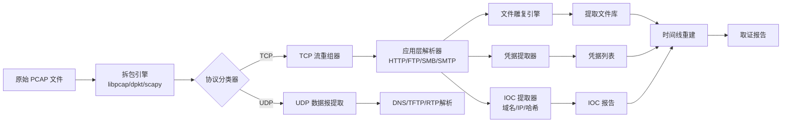
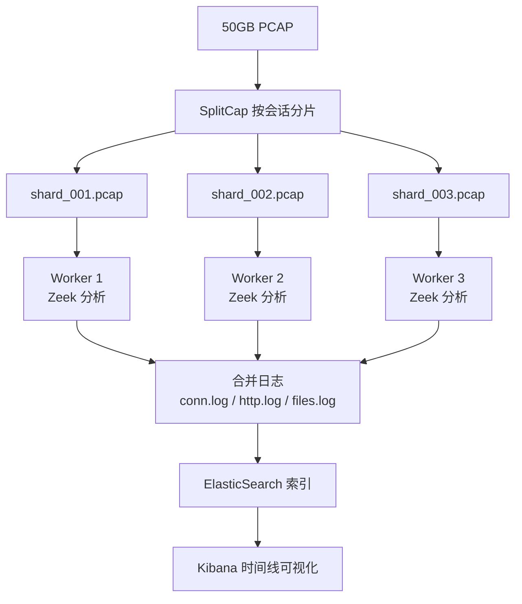
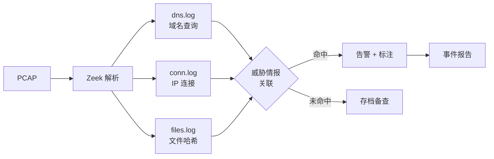

---
tags:
  - network
  - protocol-analysis
  - tier3
  - 网络取证
  - 流重组
---
# 网络取证与流重组

> [!abstract] TL;DR
> 网络取证（NFAT）将原始 PCAP 文件转化为可呈堂的证据：通过 TCP 流重组还原会话字节流，通过文件雕复从流中提取传输的文件，通过凭据提取发现明文认证，通过时间线重建还原事件全貌。NetworkMiner、Wireshark 导出对象、tcpflow、Zeek 和 tshark 是工具链核心。与 CTF 解题不同，真实 IR 场景要求证据链完整性、操作授权合规和可重现的分析流程。

## 概述与定位

### 什么是网络取证

网络取证分析（Network Forensic Analysis Tool，NFAT）是数字取证的一个子领域，聚焦于从网络流量中获取、保全和分析证据，以支持事件响应（Incident Response，IR）、法律诉讼或安全审计。与磁盘取证处理静止数据不同，网络取证处理的是流动中的或已捕获的数据——其核心载体是 PCAP 文件（libpcap 格式）或 PCAPNG（下一代格式）。

网络取证的典型触发场景包括：

- **数据泄露调查**：需要确认哪些数据在何时通过哪条路径被传输到外部，传输了什么文件；
- **恶意软件感染分析**：还原恶意软件的 C2（Command and Control）通信、横向移动路径、载荷投递方式；
- **内部威胁调查**：发现员工通过邮件、FTP、云存储等渠道外传敏感文档；
- **APT 溯源**：通过 IOC（Indicator of Compromise）提取域名、IP、哈希，关联威胁情报；
- **合规审计**：验证通信是否符合安全策略（如是否使用了明文认证、是否存在违规外联）。

### 与 CTF 取证的本质差异

第 13 章「抓包实战 CTF 与漏洞分析」中，PCAP 取证是解谜游戏：输入是精心设计的挑战包，目标是提取 flag 字符串，正确与否由自动评分系统判定。

真实 IR 场景中，差异体现在以下维度：

| 维度 | CTF 场景 | 真实 IR 场景 |
|------|----------|--------------|
| 数据来源 | 题目提供的 PCAP | 网络传感器、IDS、防火墙日志、全流量镜像 |
| 规模 | 通常数 MB | 数 GB 至数 TB，需分片处理 |
| 证据链要求 | 无 | 哈希存档、操作日志、监管链（Chain of Custody） |
| 分析目标 | 找到隐藏内容 | 还原攻击时间线、提取 IOC、支持法律诉讼 |
| 工具约束 | 随意 | 需使用经过法庭认可的工具流程 |
| 误报代价 | 重做一题 | 错误结论可能误导响应决策 |

### 网络取证的分析层次

网络取证从底层到顶层可分为五个分析层次：

1. **包层（Packet Level）**：原始帧，包括 IP 头、TCP/UDP 头；
2. **流层（Flow Level）**：五元组（src IP、dst IP、src port、dst port、protocol）标识的连接统计；
3. **会话层（Session Level）**：TCP 流重组后的字节流，是应用层分析的基础；
4. **应用层（Application Level）**：HTTP 请求/响应、文件传输、邮件内容；
5. **内容层（Content Level）**：从应用层提取的文件、图片、凭据、IOC。

本章聚焦第 3-5 层的技术实现。

---

## 原理与机制

### TCP 流重组原理

TCP 是面向字节流的协议，数据被拆分为多个段（Segment）传输，接收方必须按序列号重新排列才能还原原始数据。PCAP 中捕获的是乱序到达的包，流重组（Stream Reassembly）正是这一还原过程。

#### 序列号与确认号机制

每个 TCP 段携带 32 位序列号（Sequence Number），标识该段第一个字节在发送方字节流中的偏移位置。三次握手时：

- 客户端发送 SYN，携带随机初始序列号 ISN_c；
- 服务端回复 SYN-ACK，携带 ISN_s，确认号为 ISN_c+1；
- 客户端确认，确认号为 ISN_s+1。

后续数据段的序列号在 ISN 基础上递增。流重组器需要记录每条流的 ISN，将各段的绝对序列号减去 ISN 得到相对偏移，按偏移排序后拼接载荷字节。

#### 处理乱序（Out-of-Order）

网络路径不稳定时，后发送的包可能先到达。重组器维护一个等待队列（Hole Buffer），将已到达但前驱尚未到达的段暂存。当缺失的段最终到达时，触发队列中后续段的提交。

```
接收顺序：[Seq=1000] [Seq=3000] [Seq=2000] [Seq=4000]
排序后：  [Seq=1000][Seq=2000][Seq=3000][Seq=4000]
重组字节流：offset=0 的数据...
```

#### 处理重传（Retransmission）

TCP 在超时或收到三次重复 ACK 时重传未确认的段。重组器需识别重传包（相同序列号和载荷）并去重，避免内容重复。更复杂的情况是**选择性重传（SACK）**，只重传丢失的段而非整个窗口。

#### 处理重叠（Overlap）

攻击者可能故意发送序列号重叠但内容不同的段（TCP Overlap Attack），以欺骗 NIDS。不同操作系统对重叠的处理策略不同（Linux 倾向于保留第一个包，Windows 倾向于保留最新包）。Wireshark 和 Zeek 的处理策略可能与端点系统不一致，导致分析者看到与目标系统实际接收内容不同的字节流——这是取证分析中需特别注意的歧义点。

#### 会话跟踪

一条 TCP 会话由四元组（src IP、src port、dst IP、dst port）唯一标识（也可加 VLAN tag）。流重组器需要为每个活跃会话维护独立的状态机，跟踪：

- 两个方向的序列号状态（客户端→服务端、服务端→客户端）；
- 连接状态（SYN_SENT / ESTABLISHED / FIN_WAIT / CLOSED）；
- 乱序缓冲区；
- 已重组的有序字节流。

当捕获文件从中间开始（缺少握手包）时，重组器需要猜测初始序列号，或等待第一个有效数据段推断偏移，这种情况称为 **mid-stream pickup**。

### 文件雕复原理

文件雕复（File Carving）是从原始字节流中识别并提取文件的技术，分为两大策略：

#### 魔数扫描（Magic Number Scanning）

每种文件格式都有固定的文件头标记（Magic Number）。雕复工具预存这些签名，对字节流进行滑动扫描：

| 文件类型 | 文件头（Hex） | 文件尾（Hex） |
|---------|-------------|-------------|
| JPEG | `FF D8 FF` | `FF D9` |
| PNG | `89 50 4E 47 0D 0A 1A 0A` | `49 45 4E 44 AE 42 60 82` |
| PDF | `25 50 44 46` (`%PDF`) | `%%EOF` |
| ZIP | `50 4B 03 04` | `50 4B 05 06` |
| EXE/PE | `4D 5A` (`MZ`) | 无固定尾 |
| DOCX/XLSX | `50 4B 03 04` (ZIP 容器) | `50 4B 05 06` |

魔数扫描的局限性：若文件被分片（fragmented）跨多个非连续内存块，仅靠文件头无法确定边界；压缩传输（gzip/deflate）也会掩盖原始魔数。

#### 应用层协议感知导出

更精确的方式是在理解协议语义的基础上提取文件。例如：

- **HTTP**：解析 `Content-Type` 头和 `Content-Length` 头，直接提取响应体，自动解压 gzip/deflate 编码；
- **FTP**：识别 RETR/STOR 命令，将对应的数据连接（PORT/PASV 模式）字节流作为文件内容；
- **SMB/CIFS**：解析 SMB2 Write/Read 请求，关联文件名（来自 NTCreate 请求）与文件内容；
- **SMTP/IMAP**：解码 MIME 多部分消息，提取附件（处理 Base64 编码）；
- **TFTP**：识别 DATA 包序列，按块序号重组。

应用层感知导出精度远高于纯魔数扫描，但要求协议解析器正确实现。

### 凭据提取原理

明文认证协议在 PCAP 中直接暴露凭据：

- **HTTP Basic Auth**：`Authorization: Basic <base64(user:pass)>`，Base64 解码即可；
- **HTTP Form POST**：`POST /login`，请求体中含 `username=xxx&password=yyy`；
- **FTP**：`USER xxx\r\nPASS yyy\r\n` 明文传输；
- **Telnet**：逐字符回显，流重组后可见用户名/密码；
- **POP3/IMAP**：`USER`/`PASS` 命令（非 STARTTLS 模式）；
- **SMTP AUTH PLAIN**：Base64 编码的 `\0user\0pass`；
- **LDAP Simple Bind**：绑定请求中含明文密码；
- **SNMPv1/v2c**：Community String 明文。

NTLMv2 和 Kerberos 等挑战-响应协议不直接暴露密码，但 PCAP 中的握手信息可被提取并离线爆破（使用 Hashcat 等工具）。

---

## 结构/算法/伪代码详解

### TCP 流重组算法

以下是简化的流重组器核心逻辑：

```python
# 伪代码：TCP 流重组器核心数据结构
class TCPStream:
    def __init__(self, src_ip, src_port, dst_ip, dst_port):
        self.key = (src_ip, src_port, dst_ip, dst_port)
        self.isn = None                # 初始序列号
        self.next_seq = None           # 期望的下一个序列号
        self.ooo_buffer = {}           # 乱序缓冲区 {seq: payload}
        self.reassembled = bytearray() # 已重组的字节流
        self.state = "SYN_WAIT"        # 状态机

    def process_segment(self, seq, flags, payload):
        # 处理 SYN，记录 ISN
        if flags & SYN:
            self.isn = seq
            self.next_seq = seq + 1
            self.state = "ESTABLISHED"
            return

        # 相对序列号
        rel_seq = seq - self.isn

        # 去除已处理的重传
        if seq < self.next_seq:
            overlap = self.next_seq - seq
            payload = payload[overlap:]   # 截断重叠部分
            seq = self.next_seq
            if not payload:
                return  # 纯重传，无新数据

        if seq == self.next_seq:
            # 按序到达，直接提交
            self.reassembled.extend(payload)
            self.next_seq += len(payload)
            # 检查 ooo_buffer 中是否有可以提交的段
            self._flush_ooo_buffer()
        elif seq > self.next_seq:
            # 乱序，暂存
            self.ooo_buffer[seq] = payload

    def _flush_ooo_buffer(self):
        while self.next_seq in self.ooo_buffer:
            payload = self.ooo_buffer.pop(self.next_seq)
            self.reassembled.extend(payload)
            self.next_seq += len(payload)
```

### 文件雕复状态机

```
魔数扫描文件雕复状态机：

[SCANNING] ─── 匹配到文件头 ──→ [IN_FILE]
                                    │
                              匹配到文件尾或
                              超过最大文件大小
                                    │
                                    ▼
                               [CARVE_OUT] ──→ 写入文件 ──→ [SCANNING]
```

### PCAP 处理管道架构



### 大 PCAP 并行处理架构



### IOC 提取与关联流程



---

## 工具视角与实战

### NetworkMiner：被动式取证工具

NetworkMiner 是一款专为取证设计的被动式网络分析工具，区别于 Wireshark 的「包级分析」，它直接面向取证人员关心的问题：**哪些主机通信了什么内容，传输了哪些文件**。

#### 核心功能模块

**Hosts 标签页**：自动从 PCAP 中发现所有主机，显示：
- IP 地址、MAC 地址（用于识别设备厂商）；
- 主机名（从 DNS 反向查询、NetBIOS、DHCP 等推断）；
- 操作系统指纹（基于 TCP 时间戳、TTL、窗口大小等被动 OS 指纹）；
- 开放端口（从观察到的连接推断）。

**Files 标签页**：自动提取从网络流量中传输的文件，支持：
- HTTP 对象（网页、脚本、图片、下载的二进制文件）；
- FTP 传输文件；
- SMB 文件传输；
- SMTP/POP3 邮件附件（MIME 解码后的原始文件）；
- TFTP 传输。

每个文件记录：源主机、目标主机、时间戳、文件名（从协议头提取）、MD5 哈希。提取后可直接右键提交到 VirusTotal。

**Credentials 标签页**：自动提取明文凭据，包括 HTTP Basic Auth、FTP USER/PASS、Telnet 输入序列、POP3/IMAP 认证。

**Sessions 标签页**：按会话视图展示所有 TCP/UDP 通信，类似 Wireshark Conversations，但强调取证视角（时间戳、数据量、协议）。

**Keywords 标签页**：对重组后的流量内容进行关键词搜索，支持正则表达式。这对搜索信用卡号、身份证号、特定文档标题非常有用。

**Messages 标签页**：提取 SMTP 邮件完整内容，包括邮件头、正文和附件列表。

#### 使用 NetworkMiner 的工作流

```bash
# 命令行版本（NetworkMinerCLI，跨平台）
mono NetworkMinerCLI.exe -r evidence.pcap -w /output/dir/

# 输出目录结构：
# /output/dir/
#   AssembledFiles/     ← 所有提取的文件，按 IP 分目录
#   Hosts/              ← 主机信息 CSV
#   Keywords/           ← 关键词命中
#   Sessions/           ← 会话列表
#   Credentials.txt     ← 凭据汇总
```

### Wireshark 导出对象

Wireshark 内置了应用层对象导出功能，支持对已重组的流量直接按协议导出文件。

#### HTTP 对象导出

菜单路径：`File → Export Objects → HTTP`

Wireshark 会列出所有 HTTP 响应中识别为文件的对象，显示数据包号、主机名、内容类型、文件大小、文件名。可选择单个或全部保存。

关键细节：
- 自动处理 `Transfer-Encoding: chunked`（重组分块传输）；
- 自动解压 `Content-Encoding: gzip` 或 `deflate`；
- 文件名来自 `Content-Disposition: attachment; filename=xxx` 或 URL 路径末尾；
- 对于流媒体或 WebSocket，导出可能不完整。

#### SMB/SMB2 对象导出

`File → Export Objects → SMB` 和 `File → Export Objects → SMB2`

对于文件共享传输，SMB 导出可还原被传输的原始文件。取证中常见场景：攻击者通过 SMB 横向移动时传输工具（如 PsExec、Mimikatz）。

#### FTP 对象导出

`File → Export Objects → FTP-DATA`

注意 FTP 的主动（PORT）和被动（PASV）模式数据连接需要被正确关联。Wireshark 通过解析控制连接的 PORT/PASV 响应自动关联数据连接。

#### IMF（Internet Message Format）邮件导出

`File → Export Objects → IMF`

用于 SMTP 明文传输的邮件，导出为标准 `.eml` 格式，可直接用邮件客户端打开查看附件。

#### Follow Stream（跟踪流）

对于不支持对象导出的协议，`Analyze → Follow → TCP Stream`（快捷键：右键某包 → Follow → TCP Stream）是万能武器。

功能：
- 将选中包所属 TCP 流的所有重组数据以可读格式展示；
- 支持 ASCII、Hex Dump、UTF-8、YAML、Raw（保存为二进制）；
- 可仅显示客户端到服务端或服务端到客户端方向；
- 可保存原始字节流（Raw）用于后续分析。

Follow Stream 的 Wireshark Filter：当你跟踪一条流时，Wireshark 自动生成对应的过滤器 `tcp.stream eq N`，可用于后续精确过滤。

### tshark 命令行取证

tshark 是 Wireshark 的命令行版本，适合批量处理和脚本集成。

#### 跟踪 TCP 流（-z follow）

```bash
# 列出所有 TCP 流的摘要
tshark -r capture.pcap -z "conv,tcp" -q

# 提取第 N 条 TCP 流的内容（ASCII 格式）
tshark -r capture.pcap -z "follow,tcp,ascii,N" -q

# 提取第 N 条 TCP 流（原始二进制，保存到文件）
tshark -r capture.pcap -z "follow,tcp,raw,N" -q | xxd -r -p > stream_N.bin

# 提取所有 TCP 流（结合 shell 循环）
STREAM_COUNT=$(tshark -r capture.pcap -z "conv,tcp" -q 2>/dev/null | grep -c "^[0-9]")
for i in $(seq 0 $((STREAM_COUNT - 1))); do
    tshark -r capture.pcap -z "follow,tcp,raw,$i" -q 2>/dev/null | \
        xxd -r -p > "streams/stream_${i}.bin"
done
```

#### 导出对象（--export-objects）

```bash
# 导出所有 HTTP 对象到目录
tshark -r capture.pcap --export-objects "http,/output/http_objects/"

# 导出所有 SMB 对象
tshark -r capture.pcap --export-objects "smb,/output/smb_objects/"

# 导出所有 SMB2 对象
tshark -r capture.pcap --export-objects "smb2,/output/smb2_objects/"

# 导出 FTP 数据
tshark -r capture.pcap --export-objects "ftp-data,/output/ftp_objects/"

# 导出 IMF 邮件
tshark -r capture.pcap --export-objects "imf,/output/imf_objects/"

# 组合：导出 + 对提取文件计算哈希（取证工作流）
tshark -r evidence.pcap --export-objects "http,/output/http/" && \
    find /output/http/ -type f -exec md5sum {} \; > /output/http_hashes.txt
```

#### 提取字段用于 IOC 分析

```bash
# 提取所有 DNS 查询域名（去重排序）
tshark -r capture.pcap -Y "dns.flags.response == 0" \
    -T fields -e dns.qry.name | sort -u > dns_queries.txt

# 提取所有 HTTP Host 头
tshark -r capture.pcap -Y "http.request" \
    -T fields -e http.host -e http.request.uri | sort -u > http_hosts.txt

# 提取所有唯一 IP 对（src → dst）
tshark -r capture.pcap -T fields -e ip.src -e ip.dst | sort -u > ip_pairs.txt

# 提取 User-Agent（识别恶意软件特征）
tshark -r capture.pcap -Y "http.request" \
    -T fields -e http.user_agent | sort | uniq -c | sort -rn > user_agents.txt

# 提取 TLS SNI（识别加密流量中访问的域名）
tshark -r capture.pcap -Y "tls.handshake.type == 1" \
    -T fields -e tls.handshake.extensions_server_name | sort -u > tls_sni.txt

# 提取 HTTP 响应中的文件哈希（如 Content-MD5 头）
tshark -r capture.pcap -Y "http.response" \
    -T fields -e http.content_md5_header > content_md5.txt
```

#### 统计分析

```bash
# 查看协议层次统计（快速了解流量构成）
tshark -r capture.pcap -z "io,phs" -q

# 按端点 IP 统计流量（发现大量外发的可疑主机）
tshark -r capture.pcap -z "endpoints,ip" -q

# 查看 HTTP 请求统计
tshark -r capture.pcap -z "http,tree" -q

# 查看 DNS 统计
tshark -r capture.pcap -z "dns,tree" -q
```

### tcpflow：流级别重组与存储

tcpflow 是专注 TCP 流重组的工具，将每条 TCP 会话的两个方向分别保存为独立文件。

```bash
# 基本用法：从 PCAP 提取所有 TCP 流
tcpflow -r capture.pcap -o /output/flows/

# 生成 report.xml（包含流摘要）
tcpflow -r capture.pcap -o /output/ -AJ

# 按 BPF 过滤再重组（只提取 HTTP 流）
tcpflow -r capture.pcap -o /output/ "tcp port 80"

# 带 VLAN 支持
tcpflow -r capture.pcap -o /output/ -e tc

# 实时捕获并重组（取证监控场景）
tcpflow -i eth0 -o /output/ -B 100M
```

tcpflow 输出文件命名格式：`src_ip.src_port-dst_ip.dst_port`，例如 `192.168.1.100.54321-10.0.0.1.00080`（客户端→服务端方向）。这种命名使得用 `ls -la` 即可直观看出哪条流数据量大（文件大小）。

### Zeek：工业级流量分析框架

Zeek（原 Bro）是专为网络安全监控设计的框架，对 PCAP 或实时流量生成结构化日志，是大规模取证分析的基石。

#### 对 PCAP 离线分析

```bash
# 分析单个 PCAP，生成所有日志
zeek -r capture.pcap local

# 禁用检测脚本（仅生成协议日志，速度更快）
zeek -r capture.pcap -C

# 只运行协议分析脚本
zeek -r capture.pcap protocols/ftp protocols/http protocols/smtp

# 分析后日志目录结构：
# conn.log    - 所有连接摘要（五元组、字节数、持续时间、状态）
# http.log    - HTTP 请求/响应详情（URL、method、status、user-agent、referer）
# dns.log     - DNS 查询/响应（查询类型、答案、TTL）
# files.log   - 所有提取的文件（MIME 类型、大小、MD5/SHA1/SHA256）
# ssl.log     - TLS 握手详情（证书、SNI、JA3 指纹）
# smtp.log    - 邮件传输（发件人、收件人、主题、附件 MIME 类型）
# ftp.log     - FTP 命令序列
# weird.log   - 协议异常（值得重点关注）
# notice.log  - 检测告警
```

#### 利用 Zeek 提取文件

```bash
# 启用文件提取策略
zeek -r capture.pcap /usr/local/zeek/share/zeek/policy/frameworks/files/extract-all-files.zeek

# 提取的文件保存在 extract_files/ 目录，文件名为内容哈希
# files.log 中记录每个文件的 MIME 类型、大小、MD5/SHA1/SHA256

# 自定义只提取 PE 文件（恶意软件取证常用）
cat > extract-pe.zeek << 'EOF'
@load base/frameworks/files
@load base/protocols/http

event file_new(f: fa_file) {
    if ( f?$mime_type && f$mime_type == "application/x-dosexec" ) {
        Files::add_analyzer(f, Files::ANALYZER_EXTRACT,
            [$extract_filename=fmt("pe_%s", f$id)]);
    }
}
EOF
zeek -r capture.pcap extract-pe.zeek
```

#### conn.log 分析（快速定位异常）

```bash
# 找出数据外发量最大的连接（数据泄露检测）
cat conn.log | zeek-cut id.orig_h id.resp_h id.resp_p proto orig_bytes resp_bytes | \
    awk '{print $6, $0}' | sort -rn | head -20

# 找出连接时间最长的会话（长连接 C2 特征）
cat conn.log | zeek-cut id.orig_h id.resp_h id.resp_p duration | \
    awk '{print $4, $0}' | sort -rn | head -20

# 找出 Beacon 特征（固定间隔连接）
# 先提取到同一目标的连接时间序列，再用 Python 计算标准差
```

### SplitCap：大 PCAP 预处理

对于数 GB 甚至数 TB 的 PCAP 文件，直接用 Wireshark 或 Zeek 处理会消耗大量内存。SplitCap 可按会话将大 PCAP 拆分为小文件，便于并行处理。

```bash
# 按 TCP/UDP 会话拆分（最常用）
SplitCap.exe -r bigcapture.pcap -o /output/splits/ -s session

# 按时间窗口拆分（每 60 秒一个文件）
SplitCap.exe -r bigcapture.pcap -o /output/splits/ -s seconds -p 60

# 按源 IP 拆分（调查特定主机时有用）
SplitCap.exe -r bigcapture.pcap -o /output/splits/ -s srcip

# 拆分后并行处理（Linux/macOS）
ls /output/splits/*.pcap | xargs -P 8 -I {} zeek -r {} local -C
```

对于 Linux 环境，`editcap`（Wireshark 附带）也可按时间窗口拆分：

```bash
# 每 100,000 包一个文件
editcap -c 100000 bigcapture.pcap /output/chunk_.pcap

# 每 300 秒一个文件
editcap -i 300 bigcapture.pcap /output/interval_.pcap
```

### 时间线重建

取证分析的最终产物是时间线——按时间顺序排列的事件序列，回答「什么时间，什么主机，做了什么事」。

#### 多源时间线合并

现实 IR 场景中，需要将以下多种数据源合并为统一时间线：

1. **PCAP 时间戳**（微秒级精度）；
2. **防火墙/IDS 日志**；
3. **Web 服务器访问日志**；
4. **系统 Syslog**；
5. **Windows 事件日志**（EVTX）；
6. **EDR 遥测数据**。

时间戳对齐是关键挑战：不同设备可能有时钟偏差（Clock Skew），需要通过共同事件（如某个 TCP 握手）来校准。

```bash
# 使用 Zeek 的 conn.log 生成时间线基础
cat conn.log | zeek-cut ts id.orig_h id.resp_h id.resp_p service | \
    awk '{printf "%s %s → %s:%s [%s]\n", $1, $2, $3, $4, $5}' | \
    sort > network_timeline.txt

# 合并多个 PCAP 文件（preserves timestamps）
mergecap -w merged.pcap capture1.pcap capture2.pcap capture3.pcap

# 验证合并后时间戳连续性
capinfos merged.pcap
```

#### PCAP 元数据提取

```bash
# 查看 PCAP 基本信息（时间范围、包数量、文件大小）
capinfos -M capture.pcap

# 输出示例：
# File name:           capture.pcap
# File type:           Wireshark/tcpdump/... - pcap
# File encapsulation:  Ethernet
# Packet size limit:   file hdr: 65535 bytes
# Number of packets:   1,234,567
# File size:           2.3 GB
# Data size:           2.2 GB
# Capture duration:    3600.123456 seconds
# First packet time:   2024-03-15 08:00:00.123456
# Last packet time:    2024-03-15 09:00:00.246912
```

---

## 安全性与正确使用

### 法律授权要求

网络取证必须建立在合法授权的基础上。未经授权的流量捕获在绝大多数司法管辖区构成犯罪（如美国《电子通信隐私法》ECPA、中国《网络安全法》第 22 条等）。合法取证的授权来源包括：

- **企业内部调查**：网络管理员在企业网络上的取证通常受《可接受使用政策》（AUP）授权，且员工入职时已被告知监控政策；
- **事件响应合同**：IR 顾问与客户签订的授权书（Statement of Work）明确授权取证范围；
- **法院令**：执法机关凭搜查令获取网络记录；
- **法规合规要求**：如 PCI-DSS 要求持卡人数据环境的流量日志保留。

在开始取证前，应以书面形式确认授权范围，包括：可捕获的网段、可保留数据的时间范围、可查阅数据的人员列表。

### 证据链完整性（Chain of Custody）

在可能涉及法律诉讼的取证中，PCAP 文件必须建立完整的监管链：

```bash
# 对原始证据文件计算多种哈希（增强抗碰撞性）
md5sum evidence.pcap > evidence.pcap.md5
sha256sum evidence.pcap > evidence.pcap.sha256
sha512sum evidence.pcap > evidence.pcap.sha512

# 所有后续分析操作应在副本上进行，永不修改原始文件
cp evidence.pcap working_copy.pcap

# 分析操作日志
echo "$(date -u +%Y-%m-%dT%H:%M:%SZ) Analyst: John Doe, Action: Opened working_copy.pcap in NetworkMiner" >> analysis_log.txt

# 提取的文件也应计算哈希并记录来源
md5sum extracted_file.exe
# 记录：提取自 working_copy.pcap，包编号 12345，TCP 流 #42
```

在取证报告中，每个发现都应追溯到具体的包编号、时间戳和 PCAP 哈希，确保可重现性。

### 隐私合规与数据最小化

即使在授权范围内，取证分析也应遵循数据最小化原则：

- **提取与分析内容最小化**：仅提取与调查目标相关的数据，避免大规模分析无关员工通信；
- **数据保留期限**：明确取证数据的保留期限，到期后按规程销毁（安全擦除或物理销毁媒介）；
- **GDPR/个人信息保护法合规**：欧盟 GDPR 和中国《个人信息保护法》对网络通信中包含的个人数据处理有明确要求，IP 地址在很多管辖区被视为个人数据；
- **访问控制**：取证数据应加密存储，仅授权人员可访问，访问操作应审计。

### 分析环境隔离

取证分析应在隔离的分析环境中进行，防止恶意文件（如从流量中提取的可执行文件）感染分析工作站：

- 使用专用取证工作站或虚拟机；
- 分析网络应与生产网络物理隔离或采用严格的网络分段；
- 提取的可执行文件直接提交沙箱或 VirusTotal，不在工作站本地运行；
- 使用只读挂载点处理证据文件（Linux：`mount -o ro`）。

### PCAP 中的敏感信息处理

取证 PCAP 可能包含密码、会话 Token、个人通信等高度敏感内容。在分享 PCAP 用于外部协助分析之前：

```bash
# 使用 tcpdump 过滤掉无关流量
tcpdump -r full_capture.pcap -w filtered.pcap "host 10.0.0.1 and port 443"

# 使用 BitTwiste 修改 IP 地址（匿名化处理）
# 注意：匿名化后的 PCAP 可能无法用于法庭证据

# 使用 TraceWrangler 进行专业的 PCAP 匿名化（保留结构完整性）
TraceWrangler.exe -r sensitive.pcap -w anonymized.pcap \
    --anonymize-ip --anonymize-mac --remove-payload
```

### 重叠/重传歧义的取证影响

如前文原理部分所述，TCP 重叠段在不同实现中处理不一致。在取证分析中，若怀疑攻击者利用 TCP 重叠规避 NIDS：

```bash
# 使用 tcpreplay 配合不同操作系统策略重放
# 用 Wireshark 的 TCP 分析设置切换重叠处理策略
# Edit → Preferences → Protocols → TCP → Overlap Handling

# Zeek 的 TCP 重叠处理策略（默认与 Linux 一致）
# 可通过 Zeek 脚本修改
```

---

## 小结

网络取证与流重组是事件响应的核心能力，将原始比特流转化为可理解的事件证据。本章涵盖的技术栈形成一条完整的取证流水线：

1. **TCP 流重组**是一切应用层分析的基础——必须理解序列号排序、乱序缓冲、重传去重和重叠处理的原理，才能正确解读重组结果，尤其在面对对抗性流量时避免被误导；

2. **文件雕复**从两个维度展开：魔数扫描适用于无协议上下文的原始字节流，应用层协议感知导出在精度上显著优于前者，NetworkMiner 和 Wireshark 导出对象均属后者；

3. **工具链选择**应根据规模和场景：小型 PCAP（< 1GB）首选 NetworkMiner + Wireshark，大规模 PCAP（> 10GB）必须采用 SplitCap 预分片 + Zeek 并行处理的管道架构；

4. **tshark 命令行**是连接取证工具与自动化脚本的关键桥梁，`--export-objects` 和 `-z follow` 是高频使用的两个能力；

5. **时间线重建**是取证输出的核心交付物，需要将 PCAP 时间戳与其他日志源（系统日志、EDR、防火墙）对齐，Zeek 的结构化日志格式在此环节价值突出；

6. **证据链完整性**和**合法授权**是区分取证工作与普通分析的根本边界——哈希存档、操作日志、最小化原则不是可选项，而是专业取证的基本要求。

与第 13 章 CTF 场景的本质区别在于：CTF 的目标是「发现答案」，而真实 IR 的目标是「可重现、可验证、经得起法律审查地证明发生了什么」。这一目标差异驱动了取证工作流程中每一个额外的规范性步骤。

---

## 相关阅读

- [[72.抓包与协议分析实战/13.抓包实战CTF与漏洞分析|第 13 章：抓包实战 CTF 与漏洞分析]]（取证技能的 CTF 应用基础）
- [[72.抓包与协议分析实战/11.Zeek协议分析框架|第 11 章：Zeek 协议分析框架]]（Zeek 的完整使用指南）
- [[72.抓包与协议分析实战/03.tcpdump与命令行抓包|第 3 章：tcpdump 与命令行抓包]]（tshark 的工具链基础）
- RFC 793：TCP 协议规范（序列号与重传机制的根本来源）
- NIST SP 800-86：网络取证指南（Guide to Integrating Forensic Techniques）
- NetworkMiner 官方文档：https://www.netresec.com/?page=NetworkMiner
- Zeek 文档：https://docs.zeek.org/
- The Art of Network Forensics（技术书籍参考）

---

[[00.抓包与协议分析实战总览|⬆ 系列总览]] | [[18.eBPF与XDP高性能抓包|← 上一章]] | [[20.VoIP协议分析SIP与RTP|→ 下一章]]
