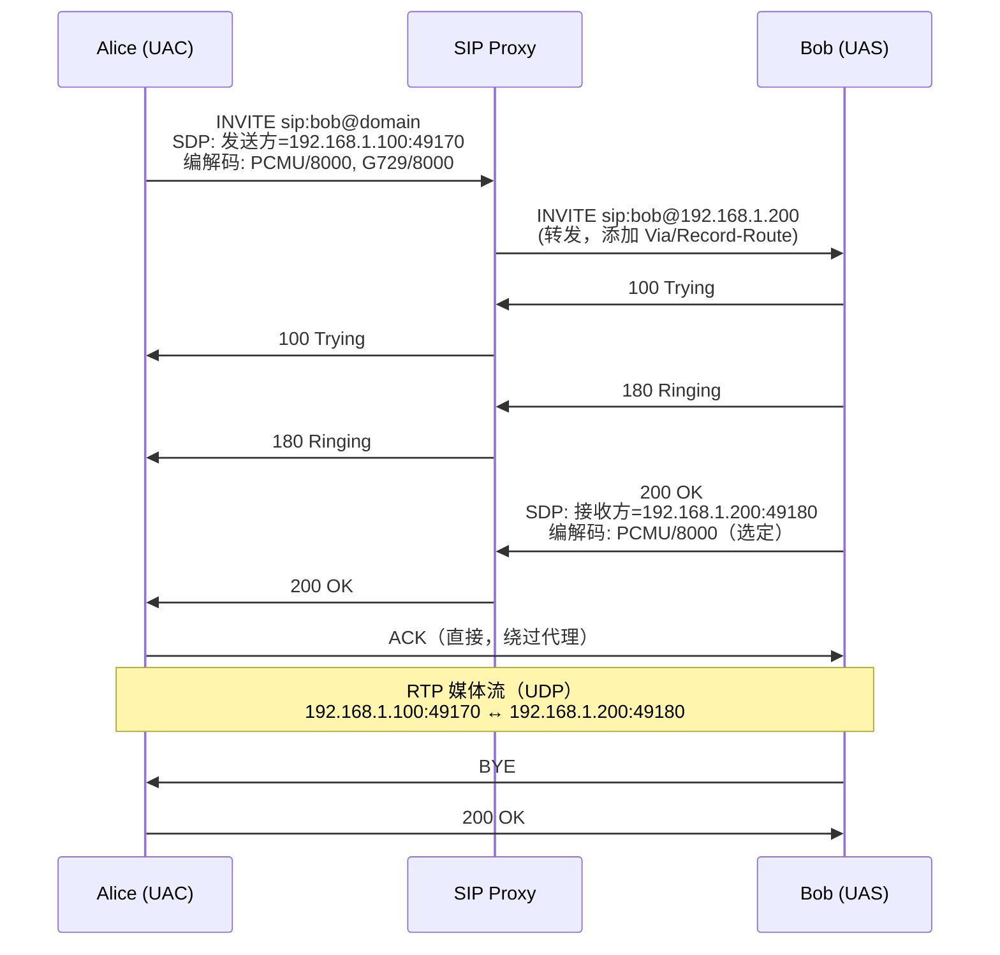
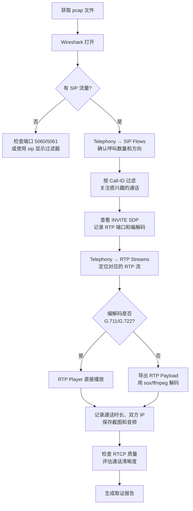

---
tags:
  - network
  - protocol-analysis
  - tier3
  - VoIP
  - SIP
---
# VoIP 协议分析：SIP 与 RTP

> [!abstract] TL;DR
> VoIP 通话由两个独立协议层协作完成：SIP（会话发起协议）负责信令——呼叫建立、协商、拆除；RTP（实时传输协议）负责媒体数据——语音/视频比特流的时序传输。两者均以明文 UDP 运行，因此 Wireshark 可从一段 pcap 直接还原完整通话音频。本章深度解析协议结构、Wireshark 实战操作、编解码机制，以及企业环境中的安全威胁面与防御措施。

---

## 概述与定位

### VoIP 在企业网络中的位置

VoIP（Voice over IP）已成为企业通信的默认基础设施。传统 PSTN 中继通过 IP 化改造汇聚到 IP-PBX（如 Asterisk、FreePBX、Cisco CUCM），分支机构的 SIP Trunk 直连 ITSP（互联网电话服务商），软电话（Zoiper、MicroSIP）和 IP 话机同时并存。这一架构意味着：

- **通话信令和媒体数据都在企业以太网/Wi-Fi 中传输**，与业务流量共享同一网络路径
- 渗透测试人员在内网抓包时极易捕获 VoIP 流量
- 取证场景中，pcap 文件可以被直接还原为可播放的通话录音
- 安全配置不足（缺少 SRTP/SIPS）的部署等同于在局域网广播通话内容

### VoIP 协议栈全景

VoIP 架构从信令到媒体可分为清晰的分层结构：

```
┌─────────────────────────────────────────────────────┐
│            应用层：SIP / H.323 / XMPP               │
│         （呼叫控制、注册、会话协商）                │
├─────────────────────────────────────────────────────┤
│          会话描述：SDP（Session Description Protocol）│
│         （嵌入 SIP 消息体，协商媒体参数）            │
├─────────────────────────────────────────────────────┤
│     媒体传输：RTP（Real-time Transport Protocol）    │
│         （承载实际音视频数据流）                     │
├─────────────────────────────────────────────────────┤
│      质量反馈：RTCP（RTP Control Protocol）          │
│         （统计丢包、抖动、往返时延）                 │
├─────────────────────────────────────────────────────┤
│            传输层：UDP（主路径）/ TCP                │
├─────────────────────────────────────────────────────┤
│                  IP / 以太网                        │
└─────────────────────────────────────────────────────┘
```

SIP 本身不传输音频，它只是"约好在哪里见面"；RTP 才是实际的"搬运工"。理解这一分离是后续所有分析的基础。

### SIP 与 H.323 的历史背景

H.323（ITU-T，1996）是 VoIP 的早期标准，基于 ASN.1 二进制编码，结构复杂，多用于早期视频会议。SIP（IETF RFC 3261，2002）仿照 HTTP 设计，使用文本格式，扩展性强，已成为现代 VoIP 的统治性协议。本章以 SIP 为核心，H.323 仅在对比场景中提及。

---

## 原理与机制

### SIP 协议基础

#### 协议特征与端口

SIP 是应用层文本协议，默认端口：

| 传输方式 | 端口 | 备注 |
|---------|------|------|
| UDP | 5060 | 无加密，最常见部署 |
| TCP | 5060 | 大消息体时自动降级 |
| TLS (SIPS) | 5061 | 加密信令 |
| WebSocket | 80/443 | WebRTC 场景 |

SIP 采用**请求-响应**模型，语法上刻意模仿 HTTP/1.1，请求行格式为：

```
METHOD sip:user@domain SIP/2.0
```

响应格式为：

```
SIP/2.0 STATUS_CODE Reason-Phrase
```

#### 核心请求方法

| 方法 | RFC | 作用 |
|------|-----|------|
| INVITE | 3261 | 发起呼叫，携带 SDP 描述媒体参数 |
| ACK | 3261 | 确认最终响应（三次握手第三步）|
| BYE | 3261 | 终止已建立的会话 |
| CANCEL | 3261 | 取消尚未建立的 INVITE 事务 |
| REGISTER | 3261 | 向注册服务器登记联系地址 |
| OPTIONS | 3261 | 查询对端能力（心跳检测常用）|
| REFER | 3515 | 呼叫转移 |
| SUBSCRIBE / NOTIFY | 3265 | 事件订阅机制（如存在状态）|
| MESSAGE | 3428 | 即时消息 |
| UPDATE | 3311 | 更新会话参数（不重建对话）|
| INFO | 2976 | 带内应用信息（DTMF）|
| PRACK | 3262 | 临时响应可靠确认 |

#### 响应码体系

SIP 响应码与 HTTP 类似但语义不同：

| 范围 | 类型 | 典型示例 |
|------|------|---------|
| 1xx | 临时（Provisional）| 100 Trying, 180 Ringing, 183 Session Progress |
| 2xx | 成功 | 200 OK, 202 Accepted |
| 3xx | 重定向 | 301 Moved Permanently, 302 Moved Temporarily |
| 4xx | 客户端错误 | 401 Unauthorized, 403 Forbidden, 404 Not Found, 408 Request Timeout, 486 Busy Here, 487 Request Terminated |
| 5xx | 服务器错误 | 500 Server Internal Error, 503 Service Unavailable |
| 6xx | 全局失败 | 600 Busy Everywhere, 603 Decline |

**安全分析关键点**：
- `401 Unauthorized` 触发摘要认证挑战，携带 `WWW-Authenticate` 头
- `403 Forbidden` 表示认证失败（密码错误或账号被禁用）
- `486 Busy Here` vs `600 Busy Everywhere`：前者表示被叫终端忙，后者表示任何终端都不接受

#### 关键头字段详解

**Via**：记录请求经过的每个 SIP 跳，用于响应路由回源。每个代理添加一个 Via，响应按反序经过同一路径返回。

```
Via: SIP/2.0/UDP 192.168.1.100:5060;branch=z9hG4bK776asdhds
```

`branch` 参数（以 `z9hG4bK` 开头）是事务 ID，唯一标识一个 SIP 事务。

**From / To**：标识逻辑端点（用户意图），不影响路由：

```
From: "Alice" <sip:alice@example.com>;tag=1928301774
To: <sip:bob@biloxi.com>
```

`tag` 参数是对话（Dialog）的关键标识符——From 的 tag 由 UAC 生成，To 的 tag 由 UAS 在响应中添加，两者共同组成对话 ID 的一部分。

**Call-ID**：全局唯一对话标识符，由发起方生成，整个呼叫生命周期不变：

```
Call-ID: 70710@192.168.1.100
```

在取证分析中，Call-ID 是关联同一通话所有消息的主键。

**CSeq**（Command Sequence）：单调递增序列号，用于区分同一对话中的事务：

```
CSeq: 314159 INVITE
```

方法名必须与请求方法匹配。重传的请求保持相同 CSeq；新的 INVITE（如重协商）递增 CSeq。

**Contact**：UAC 的直接可达地址，后续请求可直接发送到此地址（绕过代理）：

```
Contact: <sip:alice@192.168.1.100:5060>
```

**Record-Route / Route**：代理服务器插入自身地址（Record-Route），后续请求通过 Route 头沿同一路径路由（确保代理保持在信令路径上，常见于 SBC）。

**Max-Forwards**：类似 IP TTL，防止信令环路，初始值通常为 70。

**Content-Type / Content-Length**：消息体类型（如 `application/sdp`）和长度，用于消息边界解析。

### SIP 事务与对话

SIP 定义了两个关键的状态机层级：

**事务（Transaction）**：单个请求和所有响应构成一个事务，由 Via 分支参数标识。INVITE 事务包含三次握手（INVITE → 1xx/2xx → ACK），非 INVITE 事务只需最终响应。

**对话（Dialog）**：一个持续的点对点 SIP 会话，由 `Call-ID + From-tag + To-tag` 三元组唯一标识。对话在收到包含 To-tag 的 2xx 或 101-199 响应后建立，持续到 BYE 事务完成。一个 Call-ID 下可以存在多个对话（例如 REFER 导致的并行分支）。

### 典型呼叫流程

以 Alice 呼叫 Bob 为例，通过代理服务器路由：



**关键细节**：
1. INVITE 携带 SDP，列出 Alice 支持的所有编解码及 RTP 端口
2. 200 OK 的 SDP 是 Bob 的应答，选定一种编解码并告知 Bob 的 RTP 端口
3. ACK 完成三次握手，**ACK 直接发送给 Bob 而非代理**（如果有 Record-Route 则通过代理）
4. RTP 流在 ACK 之后即可开始（实际上早期媒体 183 + SDP 可更早开始）

### REGISTER 流程与认证

注册是 SIP 安全中最重要的操作——它将一个逻辑地址（AOR，Address of Record）与当前位置绑定：

```
→ REGISTER sip:domain SIP/2.0
  From: <sip:alice@domain>
  To: <sip:alice@domain>
  Contact: <sip:alice@192.168.1.100:5060>
  Expires: 3600

← 401 Unauthorized
  WWW-Authenticate: Digest realm="domain",
    nonce="84a4cc6f3082121f32b084919f73"

→ REGISTER sip:domain SIP/2.0
  Authorization: Digest username="alice",
    realm="domain",
    nonce="84a4cc6f3082121f32b084919f73",
    uri="sip:domain",
    response="7587245234b3434cc3412213e5f113a5"
    algorithm=MD5

← 200 OK
```

摘要认证使用 MD5（RFC 2617），`response` = MD5(MD5(用户名:realm:密码) + ":" + nonce + ":" + MD5(方法:URI))。**问题在于 MD5 弱，nonce 如果可预测，离线爆破密码可行**。

### SDP 会话描述协议

SDP 不是独立协议，它是嵌入 SIP 消息体的文本格式，描述媒体会话参数：

```
v=0                                    # 版本
o=alice 2890844526 2890842807 IN IP4 192.168.1.100  # 发起方
s=VoIP Call                            # 会话名
c=IN IP4 192.168.1.100                 # 连接地址（RTP 目标 IP）
t=0 0                                  # 时间（0=永久）
m=audio 49170 RTP/AVP 0 8 18           # 媒体：audio，端口 49170，payload type 列表
a=rtpmap:0 PCMU/8000                   # PT 0 = G.711 μ-law，8000 Hz 采样
a=rtpmap:8 PCMA/8000                   # PT 8 = G.711 A-law，8000 Hz 采样
a=rtpmap:18 G729/8000                  # PT 18 = G.729，8000 Hz 采样
a=ptime:20                             # 每包音频时长 20ms
a=sendrecv                             # 双向媒体
```

**`m=` 行中 payload type 的顺序即优先级**，被叫方从中选择一种（或多种）在应答 SDP 中返回。

SRTP 场景下，`m=audio 49170 RTP/SAVP 0` 中 `SAVP` 表示安全音视频 profile，并附加 `a=crypto:` 行描述密钥材料（SDES 机制）或使用 DTLS-SRTP 协商密钥。

### RTP 协议深度解析

#### RTP 报头结构

RTP 固定报头 12 字节：

```
 0                   1                   2                   3
 0 1 2 3 4 5 6 7 8 9 0 1 2 3 4 5 6 7 8 9 0 1 2 3 4 5 6 7 8 9 0 1
+-+-+-+-+-+-+-+-+-+-+-+-+-+-+-+-+-+-+-+-+-+-+-+-+-+-+-+-+-+-+-+-+
|V=2|P|X|  CC   |M|     PT      |       Sequence Number         |
+-+-+-+-+-+-+-+-+-+-+-+-+-+-+-+-+-+-+-+-+-+-+-+-+-+-+-+-+-+-+-+-+
|                           Timestamp                           |
+-+-+-+-+-+-+-+-+-+-+-+-+-+-+-+-+-+-+-+-+-+-+-+-+-+-+-+-+-+-+-+-+
|           Synchronization Source (SSRC) identifier           |
+-+-+-+-+-+-+-+-+-+-+-+-+-+-+-+-+-+-+-+-+-+-+-+-+-+-+-+-+-+-+-+-+
|            Contributing source (CSRC) identifiers            |
|                             ....                              |
+-+-+-+-+-+-+-+-+-+-+-+-+-+-+-+-+-+-+-+-+-+-+-+-+-+-+-+-+-+-+-+-+
```

各字段含义：

| 字段 | 位宽 | 作用 |
|------|------|------|
| V | 2 | 版本，固定为 2 |
| P | 1 | 填充标志，1 表示末尾有填充字节 |
| X | 1 | 扩展头标志，1 表示 12 字节后跟扩展头 |
| CC | 4 | CSRC 计数，混音场景下源数量 |
| M | 1 | 标记位（Marker），语义依 PT 而定；音频中通常标记静音后的首个数据包 |
| PT | 7 | Payload Type，标识编解码格式 |
| Sequence Number | 16 | 单调递增序列号，0–65535 循环；用于检测丢包和重排序 |
| Timestamp | 32 | 采样时钟，单位为编解码的采样率倒数；音频 8kHz 时每 20ms 增加 160 |
| SSRC | 32 | 同步源标识符，随机初始化，唯一标识一个 RTP 流；同一通话两个方向有不同 SSRC |
| CSRC | 0–60 字节 | 混音器场景下参与源的 SSRC 列表 |

**SSRC 的重要性**：在取证时，一个通话会产生两条 RTP 流（主叫→被叫和被叫→主叫），各有独立 SSRC。正确关联双向流才能还原完整对话。

#### RTP Payload Type 常用值

| PT | 编解码 | 采样率 | 典型码率 | 备注 |
|----|--------|--------|---------|------|
| 0 | PCMU (G.711 μ-law) | 8000 Hz | 64 kbps | 北美/日本标准 |
| 8 | PCMA (G.711 A-law) | 8000 Hz | 64 kbps | 欧洲/中国标准 |
| 9 | G.722 | 16000 Hz | 64 kbps | 宽带音频 |
| 18 | G.729 | 8000 Hz | 8 kbps | 带宽高效，有专利（已到期）|
| 96–127 | 动态 PT | — | — | 在 SDP a=rtpmap 中定义，如 Opus |

**Opus（PT 动态分配）**：WebRTC 的首选编解码，支持 8–48kHz 采样率，6–510 kbps 可变码率，能在恶劣网络条件下自适应。Wireshark 4.x 可识别但不能直接播放（需导出为 Opus 文件）。

#### 抖动缓冲机制

UDP 无序到达是 VoIP 的核心问题。接收端维护**抖动缓冲（Jitter Buffer）**：

- 固定缓冲：固定延迟（如 60ms），简单但高延迟
- 自适应缓冲：根据实测抖动动态调整深度（现代设备主流）

从 pcap 分析角度，**到达间隔的标准差**即为观测到的抖动值。Wireshark 的 RTP Stream Analysis 对话框会计算这一值。

### RTCP 质量反馈协议

RTCP 与 RTP 共享相同 IP/端口范围（通常 RTP 端口+1 或 RTP 端口+5001），以固定比例（通常 5%）占用带宽发送统计报告。

**SR（Sender Report）**：发送方定期发送，包含：
- NTP 时间戳（绝对时钟，用于跨流同步）
- RTP 时间戳（与媒体时钟对应）
- 发送包总数、发送字节总数
- 接收报告块（可选，包含对收到流的统计）

**RR（Receiver Report）**：接收方发送，包含：
- 对应 SSRC 的丢包分数（上一统计周期的丢包率，以 256 为分母的分数）
- 累计丢包总数
- 扩展最大序列号
- 抖动（以采样时钟单位表示的到达间隔方差）
- 最后收到 SR 的时间戳（LSR）
- 自上次 SR 到现在的延迟（DLSR）：LSR + DLSR 可计算 RTT

**SDES（Source Description）**：携带 CNAME（规范名称，用于跨 SSRC 关联同一端点）、NAME、EMAIL 等元数据。

---

## 结构/算法/伪代码详解

### G.711 编解码原理

G.711 是最简单也最常见的 VoIP 编解码，直接对 PCM 样本进行对数量化：

**μ-law（PCMU，北美/日本）压缩算法**：

```python
def pcm_to_ulaw(pcm_sample: int) -> int:
    """
    将 14 位线性 PCM 样本压缩为 8 位 μ-law
    pcm_sample: -8192 ~ +8191
    返回: 0~255 的 μ-law 编码值
    """
    MULAW_BIAS = 33
    MULAW_MAX = 0x1FFF  # 8191

    # 提取符号位
    if pcm_sample < 0:
        pcm_sample = -pcm_sample
        sign = 0x80
    else:
        sign = 0

    # 加偏置并限幅
    pcm_sample = min(pcm_sample + MULAW_BIAS, MULAW_MAX)

    # 确定指数（找最高有效位）
    exp = 7
    for i in range(7, -1, -1):
        if pcm_sample & (1 << (i + 3)):
            exp = i
            break

    # 提取 4 位尾数
    mantissa = (pcm_sample >> (exp + 3)) & 0x0F

    # 组合结果并取反（μ-law 规范要求取反）
    return ~(sign | (exp << 4) | mantissa) & 0xFF
```

**A-law（PCMA，欧洲/中国）**：算法类似但使用不同的对数曲线，奇数位取反（用于帧同步）。两种编码均将 13 位动态范围的线性 PCM 压缩为 8 位，码率固定 64 kbps（8000 样本/秒 × 8 bits/样本）。

### G.729 算法概述

G.729 是低码率算法（8 kbps），使用 CS-ACELP（共轭结构代数码激励线性预测）：

```
输入 PCM（8kHz，每 10ms 80 个样本）
    │
    ▼
┌──────────────────────────────────┐
│  LP 分析（线性预测）               │
│  → 10 阶 LPC 滤波器系数           │
└──────────────┬───────────────────┘
               │
    ▼
┌──────────────────────────────────┐
│  量化 LPC → LSP（线谱对）         │
│  → 18 bits/帧                    │
└──────────────┬───────────────────┘
               │
    ▼
┌──────────────────────────────────┐
│  开环音高分析（粗估）              │
└──────────────┬───────────────────┘
               │
    ▼
┌──────────────────────────────────┐
│  闭环分析（自适应码本 + 固定码本）  │
│  → 每 5ms 子帧: 音调延迟 + 增益    │
│  → 代数码本索引 + 增益             │
└──────────────┬───────────────────┘
               │
    ▼
输出比特流（80 bits/10ms = 8 kbps）
```

每帧 10ms，输出 80 bits。G.729A 是简化版本，运算量降低 50% 但质量略有下降，是实际部署中的主流变体。

### 从 pcap 重建 RTP 音频

以下为 Python 伪代码，展示从 pcap 提取并解码 G.711 音频的逻辑（实际 Wireshark 内置了等效功能）：

```python
import struct
import audioop
from scapy.all import rdpcap, UDP, Raw

def extract_rtp_audio(pcap_file: str, target_ssrc: int, output_wav: str):
    """
    从 pcap 中提取指定 SSRC 的 RTP 流并解码为 WAV（PCMU）
    """
    packets = rdpcap(pcap_file)
    rtp_payloads = []     # (timestamp, payload_bytes)
    prev_seq = None
    missing_count = 0

    for pkt in packets:
        if not pkt.haslayer(UDP):
            continue
        raw = bytes(pkt[Raw].load) if pkt.haslayer(Raw) else b''
        if len(raw) < 12:
            continue

        # 解析 RTP 固定头
        first_byte, second_byte = raw[0], raw[1]
        version = (first_byte >> 6) & 0x3
        if version != 2:
            continue

        has_ext = (first_byte >> 4) & 0x1
        csrc_count = first_byte & 0xF
        marker = (second_byte >> 7) & 0x1
        payload_type = second_byte & 0x7F
        seq_num = struct.unpack('>H', raw[2:4])[0]
        timestamp = struct.unpack('>I', raw[4:8])[0]
        ssrc = struct.unpack('>I', raw[8:12])[0]

        if ssrc != target_ssrc:
            continue
        if payload_type != 0:  # 仅处理 PCMU
            continue

        # 计算头部长度（扩展头 + CSRC）
        header_len = 12 + 4 * csrc_count
        if has_ext and len(raw) > header_len + 4:
            ext_len = struct.unpack('>H', raw[header_len+2:header_len+4])[0]
            header_len += 4 + 4 * ext_len

        payload = raw[header_len:]

        # 检测丢包（序列号不连续则插入静音）
        if prev_seq is not None:
            expected = (prev_seq + 1) % 65536
            if seq_num != expected:
                gap = (seq_num - expected) % 65536
                # 插入丢失帧的静音（每帧 160 字节 = 20ms @ 8kHz）
                for _ in range(min(gap, 10)):  # 最多填补 10 帧
                    rtp_payloads.append((None, bytes(160)))  # 静音
                missing_count += gap

        prev_seq = seq_num
        rtp_payloads.append((timestamp, payload))

    print(f"共提取 {len(rtp_payloads)} 帧，检测到丢包约 {missing_count} 帧")

    # 按时间戳排序（处理乱序）
    rtp_payloads.sort(key=lambda x: x[0] if x[0] is not None else 0)

    # 解码 μ-law → 线性 PCM
    pcm_data = b''
    for ts, payload in rtp_payloads:
        linear = audioop.ulaw2lin(payload, 2)  # 2 = 16位输出
        pcm_data += linear

    # 写入 WAV 文件
    import wave
    with wave.open(output_wav, 'wb') as wf:
        wf.setnchannels(1)      # 单声道
        wf.setsampwidth(2)      # 16位
        wf.setframerate(8000)   # 8kHz
        wf.writeframes(pcm_data)
    print(f"音频已保存至 {output_wav}")
```

### SIP 摘要认证哈希计算

理解认证机制对于评估离线爆破可行性至关重要：

```python
import hashlib

def compute_sip_digest_response(
    username: str,
    realm: str,
    password: str,
    method: str,
    uri: str,
    nonce: str,
    qop: str = None,
    nc: str = None,
    cnonce: str = None
) -> str:
    """
    计算 SIP Digest Authentication 的 response 字段
    按 RFC 3261 / RFC 2617 规范
    """
    # HA1 = MD5(username:realm:password)
    ha1 = hashlib.md5(
        f"{username}:{realm}:{password}".encode()
    ).hexdigest()

    # HA2 = MD5(method:uri)
    ha2 = hashlib.md5(
        f"{method}:{uri}".encode()
    ).hexdigest()

    # response 计算
    if qop in ('auth', 'auth-int'):
        # 有 qop 时加入 nc 和 cnonce
        response = hashlib.md5(
            f"{ha1}:{nonce}:{nc}:{cnonce}:{qop}:{ha2}".encode()
        ).hexdigest()
    else:
        # 无 qop（RFC 2617 基础模式）
        response = hashlib.md5(
            f"{ha1}:{nonce}:{ha2}".encode()
        ).hexdigest()

    return response
```

**实际攻击意义**：若攻击者抓到 401 挑战（含 nonce、realm）和带 response 的第二次 REGISTER，可以对 `MD5(username:realm:password)` 进行字典攻击——因为 nonce、realm 和 uri 均为明文已知量，只有密码未知。hashcat 规则 `-m 11400`（SIP Digest MD5）专为此场景优化。

---

## 工具视角与实战

### Wireshark VoIP 分析全流程

#### 捕获过滤器

针对 SIP/RTP 流量，推荐的 BPF 捕获过滤器：

```
# 仅抓 SIP（5060/5061）
udp port 5060 or tcp port 5060 or tcp port 5061

# 抓 SIP + 高端口 RTP（常见范围 10000-20000）
udp port 5060 or (udp portrange 10000-20000)

# 针对特定 PBX 的所有 VoIP 流量
host 192.168.1.50 and (udp port 5060 or udp portrange 10000-20000)
```

#### 显示过滤器

```
# 所有 SIP 消息
sip

# 仅 INVITE 请求
sip.Method == "INVITE"

# 含 SDP 的消息
sip && sdp

# 特定 Call-ID 的所有消息
sip.Call-ID == "70710@192.168.1.100"

# 失败的认证（401/403）
sip.Status-Code == 401 or sip.Status-Code == 403

# 所有 RTP 流
rtp

# 特定 SSRC
rtp.ssrc == 0xdeadbeef

# RTCP 统计包
rtcp
```

#### Telephony 菜单操作

Wireshark 的 Telephony 菜单是 VoIP 分析的核心入口：

**Telephony → SIP Flows（SIP 流程）**

打开后显示所有检测到的 SIP 会话，以流程图形式展现每通电话的信令序列。可以：
- 点击任意消息查看完整 SIP 头
- 右键 → "Follow SIP Call" 自动过滤该 Call-ID 的所有包
- 统计视图：总呼叫数、成功率、响应码分布

**Telephony → RTP → RTP Streams**

列出所有检测到的 RTP 流，每行包含：

| 列 | 含义 |
|----|------|
| Source IP:Port | RTP 发送方 |
| Destination IP:Port | RTP 接收方 |
| SSRC | 流标识符（十六进制）|
| Payload | 编解码格式 |
| Packets | 包总数 |
| Lost | 丢失包数和百分比 |
| Max Jitter | 最大抖动（毫秒）|
| Duration | 通话时长 |

**Telephony → RTP → RTP Stream Analysis**

选中一条 RTP 流后，显示逐包统计：
- 序列号变化（可检测乱序、重传）
- 到达间隔抖动曲线
- 丢包位置标记（红色高亮）
- 导出 CSV 供后续统计分析

**Telephony → RTP → RTP Player（播放音频）**

这是取证分析最强大的功能——**直接从 pcap 播放通话音频**：

1. 打开 RTP Streams 对话框
2. 选中同一通话的两条 RTP 流（主叫方向和被叫方向）
3. 点击 "Analyze"（分析），再点击 "Play Streams"（播放流）
4. Wireshark 会解码 G.711/G.722 并通过系统音频设备播放
5. 可将两条流分配到左/右声道，同步播放完整对话
6. 支持导出为 AU 格式（可用 ffmpeg 转 WAV/MP3）

**注意**：G.729/Opus 等有专利或复杂算法的编解码可能无法直接播放，需导出原始 RTP payload 后用专用工具（如 FreeSWITCH、ffmpeg）解码。

#### tshark 命令行提取

命令行场景下，tshark 可批量处理大量 pcap 文件：

```bash
# 列出所有 SIP INVITE 及其 Call-ID
tshark -r capture.pcap -Y "sip.Method==INVITE" \
    -T fields -e sip.from.user -e sip.to.user \
    -e sip.Call-ID -e frame.time

# 提取所有 SDP 中协商的媒体端口
tshark -r capture.pcap -Y sdp \
    -T fields -e sdp.media

# 统计 SIP 响应码分布
tshark -r capture.pcap -Y sip.Status-Code \
    -T fields -e sip.Status-Code | sort | uniq -c | sort -rn

# 导出特定 SSRC 的 RTP 流到文件
# （需要 Wireshark 自带的 reordercap 或 editcap）
tshark -r capture.pcap -Y "rtp.ssrc == 0x12345678" -w rtp_stream.pcap

# 提取认证信息（用于离线分析）
tshark -r capture.pcap -Y "sip.Authorization" \
    -T fields \
    -e sip.auth.username \
    -e sip.auth.realm \
    -e sip.auth.nonce \
    -e sip.auth.uri \
    -e sip.auth.response
```

#### sngrep：SIP 专用 TUI 分析工具

`sngrep` 是 Linux 下专为 SIP 设计的终端 UI 工具，功能独特：

```bash
# 实时抓包并显示 SIP 流（类似 Wireshark SIP Flows 但可实时）
sngrep

# 从 pcap 文件分析
sngrep -I capture.pcap

# 过滤特定用户的呼叫
sngrep -f user@domain

# 显示 SIP 消息详情（进入界面后按 Enter）
# 界面功能：
# - 上下键：选择通话
# - Enter：展开 SIP 消息流
# - F6：保存为 pcap
# - F7：过滤
```

sngrep 对于实时监控 PBX 服务器上的 SIP 流量尤为实用，占用资源极低。

#### RTP 提取与音频重建

使用 Wireshark 命令行工具提取 RTP payload：

```bash
# 方法一：Wireshark GUI
# Telephony → RTP → RTP Streams → 选择流 → Save Payload
# 选择 "Raw" 格式，得到原始 μ-law/A-law 数据

# 方法二：tshark 提取 RTP payload（16进制）
tshark -r capture.pcap -Y "rtp.ssrc==0x12345678" \
    -T fields -e rtp.payload | \
    xxd -r -p > rtp_payload.raw

# 将 raw μ-law 转 WAV（使用 sox）
sox -t raw -r 8000 -e mu-law -b 8 -c 1 rtp_payload.raw output.wav

# 将 raw A-law 转 WAV
sox -t raw -r 8000 -e a-law -b 8 -c 1 rtp_payload.raw output.wav

# 使用 ffmpeg 转换（支持更多格式）
ffmpeg -f mulaw -ar 8000 -ac 1 -i rtp_payload.raw output.wav
```

#### 分析 RTCP 质量报告

```bash
# 显示 RTCP 发送方报告
tshark -r capture.pcap -Y rtcp \
    -T fields \
    -e rtcp.ssrc \
    -e rtcp.fraction_lost \
    -e rtcp.cumulative_number_of_packets_lost \
    -e rtcp.interarrival_jitter \
    -e rtcp.timestamp

# 典型 RTCP RR 分析指标判断标准：
# fraction_lost > 5%：明显丢包，通话质量受影响
# interarrival_jitter > 30ms（单位：采样时钟）@ 8kHz = 30 * 1/8000s
# 实际抖动ms = jitter_value / 采样率 * 1000
```

#### Asterisk 服务器上的 SIP 调试

在授权的 IP-PBX 上进行调试分析：

```bash
# Asterisk CLI 实时 SIP 调试
asterisk -r
# 进入 CLI 后：
sip set debug on          # 开启所有 SIP 调试
sip set debug peer alice  # 仅调试特定 peer
core set verbose 5        # 提高详细级别

# 查看注册状态
sip show peers
sip show registry

# 查看活跃通话
core show channels

# 查看 RTP 统计
rtp show statistics
```

### 完整取证工作流

对于事件响应场景，处理 VoIP pcap 的推荐流程：



---

## 安全性与正确使用

### 威胁模型概述

明文 VoIP 部署面临的主要威胁来自**获得内网访问权的攻击者**（包括恶意内部人员、已立足内网的外部攻击者）以及**公共网络上暴露的 SIP 端口**。

### 威胁一：通话窃听（RTP 劫持）

**原理**：在没有 SRTP 的网络中，攻击者只需在内网任意位置嗅探到 RTP UDP 包，即可完整还原通话音频。整个过程被动、无痕，不触发任何 IDS/IPS 规则（因为 RTP 流量看起来完全正常）。

**操作步骤（授权测试场景）**：
1. Wireshark 抓包 5–10 分钟
2. 观察是否存在高端口 UDP 小包（RTP 特征：每 20ms 一个约 200 字节的 UDP 包）
3. 用显示过滤器 `rtp` 确认
4. Telephony → RTP Player 播放

**严重性**：极高。无需任何凭证，仅需内网抓包权限，即可获取所有通话内容。在企业渗透测试中，这类发现通常直接被评为关键（Critical）等级。

### 威胁二：SIP 账号枚举

**原理**：SIP 注册服务器（Registrar）在处理不存在的用户名和错误密码时，可能返回不同响应码（403 vs 404），从而暴露用户名是否存在。

**枚举方法**：
```
# 枚举用户名（目标：识别 404 Not Found vs 401/403）
for user in wordlist:
    发送: REGISTER sip:domain SIP/2.0
          From: <sip:user@domain>
    
    响应 404: 用户不存在
    响应 401/403: 用户存在，但需要认证

# 枚举用 OPTIONS（不触发认证，更隐蔽）
    发送: OPTIONS sip:user@domain SIP/2.0
    
    响应 200 OK: 用户存在且在线
    响应 404: 用户不存在
```

**常用工具**：
- `svwar`（SIPVicious 套件）：专为 SIP 枚举设计
- `sipvicious`：枚举 + 爆破一体化
- `Metasploit`：`auxiliary/scanner/sip/enumerator`

**防御**：配置 SIP 服务器对不存在用户和密码错误返回相同响应（统一返回 403），增加枚举难度。

### 威胁三：密码离线爆破

**前提条件**：捕获到包含 401 + Authorization 的 REGISTER 交换（两个包）。

**工具**：
```bash
# hashcat 模式 11400（SIP Digest Authentication）
# 首先提取哈希到文件（格式：hashcat 要求的 SIP 格式）
# 用 tshark 提取各字段后拼接

# hashcat 爆破
hashcat -m 11400 sip_hash.txt /usr/share/wordlists/rockyou.txt -r rules/best64.rule

# sipdump + sipcrack（SIPVicious 配套工具）
sipdump -p capture.pcap -o sip_hashes.txt
sipcrack sip_hashes.txt -w /usr/share/wordlists/passwords.txt
```

**防御**：使用强密码（≥12位，复杂度高）、配置账号锁定策略、SIPS+双因素认证。

### 威胁四：INVITE 洪水（Toll Fraud）

**原理**：攻击者向 PBX 发送大量外拨 INVITE 请求，如果 PBX 配置允许匿名拨出或账号被劫持，将产生大量国际长途话费（通常拨打高费率目的地，攻击者从中获利）。

**特征（pcap 中可见）**：
- 短时间内大量 INVITE 请求
- 目标号码为高收费目的地（某些非洲/太平洋岛国号码）
- From 字段可能伪造

**防御**：
- 配置严格的发出呼叫权限（按账号限制可拨打号码范围）
- IP 白名单（仅允许特定 IP 发出 INVITE）
- 每账号每分钟并发呼叫数限制
- 异常费用实时告警

### 威胁五：SIP REGISTER 劫持

**原理**：攻击者伪造一个 SIP REGISTER 请求，将受害者账号（AOR）的联系地址改为攻击者控制的设备，从而接收发往受害者的所有呼入。

**条件**：需要绕过认证（弱密码、已知密码、服务器不要求认证）。

**场景**：攻击者监听到合法 REGISTER 包，重放或在认证失效前注入修改后的 Contact 地址。

**防御**：SIP over TLS（SIPS）防止中间人嗅探；服务端验证注册来源 IP。

### 合法监听（Lawful Intercept）的边界

企业 IT/安全团队在自有基础设施上进行 VoIP 分析需注意：

- **授权范围**：仅限自有 PBX 和自管网络，不得截听个人通话（即使在企业网络内，员工通话具有一定隐私保护权利）
- **数据保留**：录音数据必须有明确的保留期限和访问控制
- **法律合规**：不同国家/地区对通话录音有不同法规（如 GDPR 第 6 条、中国《网络安全法》第 21 条），企业录音通常需提前告知员工
- **渗透测试**：必须在书面授权范围内进行，音频重建仅用于证明问题存在，不得保留或传播通话内容

### SRTP 与 SIPS：正确的安全架构

**SRTP（Secure RTP，RFC 3711）**：

SRTP 对 RTP payload 进行加密（AES-CTR 模式）和消息认证（HMAC-SHA1），同时使用 ROC（Rollover Counter）解决 32 位时间戳回绕问题：

```
SRTP 包结构:
[RTP Header（明文）][加密 Payload][认证标签（10字节）]

密钥材料来源（三种方式）:
1. SDES（SDP Security Descriptions）：密钥在 SDP 明文传输 → 需要 SIPS 保护 SDP
2. DTLS-SRTP（RFC 5764）：DTLS 握手协商，WebRTC 标准方式
3. ZRTP（RFC 6189）：端到端 DH 协商，无需依赖信令安全
```

**SIPS（SIP over TLS）**：

SIPS URI（`sips:user@domain`）要求整个信令路径使用 TLS，SDP 中的密钥材料得到保护：

```
# 标准部署配置（Asterisk 示例）
[general]
tlsenable=yes
tlsbindaddr=0.0.0.0:5061
tlscertfile=/etc/asterisk/keys/server.crt
tlsprivatekey=/etc/asterisk/keys/server.key
tlscafile=/etc/asterisk/keys/ca.crt

# 对 peer 启用 SRTP
[alice]
encryption=yes              # 要求 SRTP
transport=tls               # 信令走 TLS
```

**SBC（Session Border Controller）的作用**：

SBC 是企业 VoIP 安全的核心组件，位于 PBX 与 PSTN/互联网的边界：
- 媒体 anchoring：所有 RTP 流经 SBC，可实施录音和监控
- 拓扑隐藏：对外隐藏内部 PBX 地址
- 访问控制：IP 白名单、速率限制、Toll Fraud 检测
- 协议规范：修正不合规的 SIP 消息（修复 Via/Contact 中的私网地址）
- TLS/SRTP 终止：向互联网侧加密，向内网侧可选明文

### Wireshark 解密 SRTP（已知密钥）

在授权测试中，如果通过 SDP 或其他方式获取了 SRTP 密钥：

```
Wireshark → Edit → Preferences → Protocols → SRTP
→ Add Decryption Key
    Master Key (hex): [32字节十六进制]
    Master Salt (hex): [14字节十六进制]
```

或通过 DTLS-SRTP 场景：导出 DTLS 会话密钥（类似 SSLKEYLOGFILE）后，Wireshark 可自动解密 SRTP。

---

## 小结

VoIP 分析涵盖两个层面：**信令层（SIP）**和**媒体层（RTP/RTCP）**。

**SIP 核心要点**：
- 文本协议，逻辑上仿照 HTTP，易于人工阅读和 Wireshark 解析
- Call-ID + From-tag + To-tag 三元组唯一标识对话，是关联分析的主键
- INVITE → 100/180 → 200 OK → ACK 构成呼叫建立三次握手
- SDP 协商决定 RTP 将使用的 IP、端口和编解码
- 摘要认证使用 MD5，离线爆破可行，是 VoIP 安全的薄弱环节

**RTP 核心要点**：
- SSRC 唯一标识一条媒体流，一通电话产生两个方向、两个 SSRC
- 序列号用于检测乱序和丢包；时间戳用于播放计时和同步
- Payload Type 指向编解码格式；G.711 最简单，Wireshark 可直接播放
- RTCP 提供质量反馈，`fraction_lost` 和 `interarrival_jitter` 是关键指标

**安全要点**：
- 明文 RTP = 通话可被任意内网节点还原为音频，无需任何凭证
- SIP REGISTER 抓包 = 可离线爆破账号密码
- 正确防御：SIPS 保护信令 + SRTP 保护媒体 + SBC 隔离边界
- 合法分析范围：自有 PBX、授权渗透测试环境

**Wireshark 操作速查**：

| 需求 | 操作路径 |
|------|---------|
| 查看所有通话 | Telephony → SIP Flows |
| 分析 RTP 质量 | Telephony → RTP → RTP Streams → Analyze |
| 播放通话音频 | Telephony → RTP → RTP Player |
| 过滤单通电话 | 显示过滤 `sip.Call-ID == "xxx"` |
| 提取认证信息 | 显示过滤 `sip.Authorization` |

---

## 相关阅读

- RFC 3261 — SIP: Session Initiation Protocol（核心规范）
- RFC 4566 — SDP: Session Description Protocol
- RFC 3550 — RTP: A Transport Protocol for Real-Time Applications
- RFC 3711 — The Secure Real-time Transport Protocol (SRTP)
- RFC 2617 — HTTP Authentication: Basic and Digest Access Authentication（SIP 摘要认证基础）
- RFC 6189 — ZRTP: Media Path Key Agreement for Unicast Secure RTP
- [[Wireshark Wiki: VoIP](https://wiki.wireshark.org/VoIP_calls)] — 官方 VoIP 分析文档
- [[SIPVicious 工具集](https://github.com/EnableSecurity/sipvicious)] — SIP 安全测试工具
- [[Asterisk Security Guide](https://docs.asterisk.org/Deployment/Secure-Calling/)] — PBX 加固实践

---

[[00.抓包与协议分析实战总览|⬆ 系列总览]] | [[19.网络取证与流重组|← 上一章]] | [[21.工业协议Modbus与S7|→ 下一章]]
