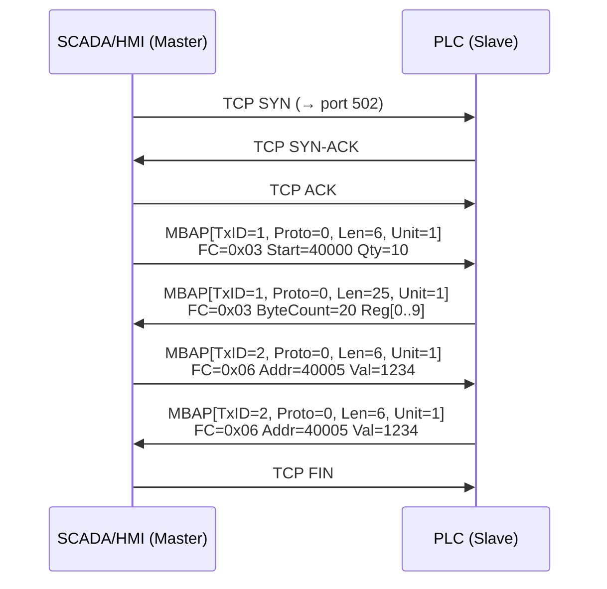
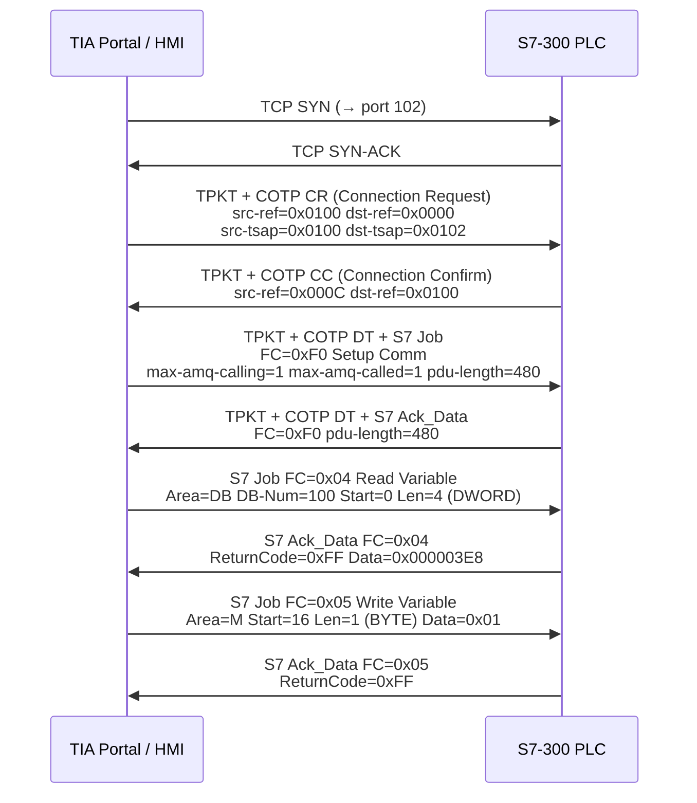

---
tags:
  - network
  - protocol-analysis
  - tier3
  - 工业协议
  - ICS
---
# 工业协议抓包：Modbus 与 S7

> [!abstract] TL;DR
> Modbus TCP 和西门子 S7comm 是工业控制网络（OT/ICS）中最常见的两类协议。Modbus 结构极简、完全明文无认证，通过 MBAP 头携带功能码操控 PLC 的寄存器与线圈；S7comm 基于 ISO-on-TCP（端口 102），分 TPKT/COTP/S7 PDU 三层封装，操作 DB 块、M 区、I/Q 区变量。本篇从协议格式到 Wireshark 实战，再到 OT 流量监控与工控 IDS，全程以被动监听为核心视角，绝不触碰生产系统。

## 概述与定位

### OT 网络与 IT 网络的根本差异

传统 IT 网络以数据保密性（Confidentiality）为首要目标；而运营技术（Operational Technology，OT）网络——即控制物理过程的工业网络——将可用性（Availability）放在第一位。一台在产 PLC 的网络中断哪怕只有几百毫秒，都可能引发生产线停线甚至安全事故。正因如此，工业协议在设计之初几乎不考虑加密或认证，认为"物理隔离即安全"。

现代 ICS（工业控制系统）/SCADA（监控与数据采集）体系通常包括：
- **Level 0/1**：传感器、执行器、PLC/RTU，与现场设备直连
- **Level 2**：SCADA 服务器、HMI（人机界面），汇聚现场数据
- **Level 3**：历史数据库、MES（制造执行系统），连接到 Level 4 企业网络
- **DMZ**：Purdue 模型中的隔离区，控制 OT 与 IT 之间的数据流

本篇的抓包视角定位在 Level 1–2 之间的 OT 网络流量，使用被动监听手段：镜像端口（SPAN）或 TAP 接入，**不发送任何报文到生产网络**。

### 为什么要抓 OT 流量

1. **安全态势感知**：检测异常命令（如写线圈、改定值），在实际物理影响发生前告警
2. **事件调查取证**：一旦发生事故或入侵，pcap 是最直接的证据
3. **协议理解与合规**：NERC CIP（电力）、IEC 62443 等标准要求持续监控
4. **漏洞评估**：在离线测试环境中理解暴露面，不依赖主动扫描

### 本篇与系列其他章节的互补关系

- 第 6 章（自定义协议逆向）：从未知二进制协议逆推字段含义，适用于闭源工业设备
- 第 11 章（Zeek 框架）：本篇实战部分使用 Zeek 的工业协议插件
- 第 13 章（pcap 取证）：pcap 基础操作在此默认已掌握
- 系列 39 第 18 章（协议逆向，若存在）：深入逆向工程层面；本篇聚焦已知协议的流量解析

---

## 原理与机制

### Modbus 协议族

Modbus 由 Modicon（现施耐德电气）于 1979 年发布，是历史最悠久的工业协议之一。它定义了三个物理/传输层变体：

| 变体 | 物理层 | 封装 | 端口/介质 |
|------|--------|------|-----------|
| Modbus RTU | RS-232/RS-485 | 二进制帧 + CRC16 | 串口 |
| Modbus ASCII | RS-232/RS-485 | ASCII + LRC | 串口 |
| Modbus TCP | 以太网 | MBAP + PDU over TCP | 502/tcp |

本章重点是可用以太网抓包工具捕获的 **Modbus TCP**，但也会讲解 RTU 的帧格式，因为大量 OT 流量在串口到以太网的协议网关处仍保留 RTU 语义。

#### Modbus 数据模型

Modbus 协议操作四种对象类型，每种都有 1–65536 的地址空间：

| 对象类型 | 数据类型 | 访问方式 | 典型用途 |
|----------|----------|----------|----------|
| Coil（线圈）| 单比特（0/1）| 读写 | 数字输出，如电磁阀开关 |
| Discrete Input（离散输入）| 单比特（只读）| 只读 | 数字输入，如接近传感器 |
| Input Register（输入寄存器）| 16 位无符号整数（只读）| 只读 | 模拟输入，如温度传感器 ADC 值 |
| Holding Register（保持寄存器）| 16 位无符号整数 | 读写 | 配置参数、设定值、模拟输出 |

地址空间在不同厂商实现中存在 0-based 和 1-based 两种惯例（Modbus 规范使用 1-based，但 MBAP 帧中传输的是 0-based 偏移量），分析时需注意。

#### Modbus TCP MBAP 头

Modbus TCP 的应用数据单元（ADU）= MBAP 头（7 字节）+ PDU（功能码 + 数据）。

```
 0               1               2               3
 0 1 2 3 4 5 6 7 0 1 2 3 4 5 6 7 0 1 2 3 4 5 6 7 0 1 2 3 4 5 6 7
+-+-+-+-+-+-+-+-+-+-+-+-+-+-+-+-+-+-+-+-+-+-+-+-+-+-+-+-+-+-+-+-+
|        Transaction ID         |         Protocol ID           |
+-+-+-+-+-+-+-+-+-+-+-+-+-+-+-+-+-+-+-+-+-+-+-+-+-+-+-+-+-+-+-+-+
|           Length              |   Unit ID     |  Function Code |
+-+-+-+-+-+-+-+-+-+-+-+-+-+-+-+-+-+-+-+-+-+-+-+-+-+-+-+-+-+-+-+-+
|                         Data ...                               |
+-+-+-+-+-+-+-+-+-+-+-+-+-+-+-+-+-+-+-+-+-+-+-+-+-+-+-+-+-+-+-+-+
```

字段详解：

- **Transaction ID**（2 字节）：请求/响应配对标识符，主站为每个请求递增，从站在响应中回显。用于在同一 TCP 连接上匹配异步请求，类似 HTTP/2 的 Stream ID
- **Protocol ID**（2 字节）：恒为 `0x0000`，标识 Modbus 协议（Modbus TCP 的固定标识）
- **Length**（2 字节）：从 Unit ID 字段开始到 PDU 结束的字节数，即 `1（Unit ID）+ 1（FC）+ data_len`
- **Unit ID**（1 字节）：目标从站地址。在直连 TCP 时通常为 `0xFF` 或 `0x01`；通过串口网关访问下游 RTU 设备时，此字段指示 RS-485 总线上的从站地址（1–247）

PDU 由**功能码**（Function Code，FC）和紧随其后的数据区构成。

#### 核心功能码

| FC（十六进制）| 名称 | 操作对象 | 说明 |
|---------------|------|----------|------|
| 0x01 | Read Coils | 线圈 | 读多个线圈状态，返回位压缩字节 |
| 0x02 | Read Discrete Inputs | 离散输入 | 同上，只读 |
| 0x03 | Read Holding Registers | 保持寄存器 | 读连续寄存器，最常见 |
| 0x04 | Read Input Registers | 输入寄存器 | 读模拟量，只读 |
| 0x05 | Write Single Coil | 线圈 | 写单个线圈：`0xFF00`=ON，`0x0000`=OFF |
| 0x06 | Write Single Register | 保持寄存器 | 写单个保持寄存器 |
| 0x0F | Write Multiple Coils | 线圈 | 批量写线圈 |
| 0x10 | Write Multiple Registers | 保持寄存器 | 批量写寄存器，最危险 |
| 0x14 | Read File Record | 文件 | 扩展存储，较少见 |
| 0x17 | Read/Write Multiple Registers | 保持寄存器 | 一次事务内同时读写 |
| 0x2B | Encapsulated Interface Transport | 设备信息 | MEI 子功能，可读取设备厂商型号 |

#### 异常响应

当从站无法执行命令时，返回异常响应：功能码最高位置 1（即 `FC | 0x80`），后跟 1 字节异常码：

| 异常码 | 名称 | 含义 |
|--------|------|------|
| 0x01 | ILLEGAL FUNCTION | 从站不支持该功能码 |
| 0x02 | ILLEGAL DATA ADDRESS | 地址超出从站范围 |
| 0x03 | ILLEGAL DATA VALUE | 数据值超出允许范围 |
| 0x04 | SERVER DEVICE FAILURE | 从站硬件故障 |
| 0x05 | ACKNOWLEDGE | 已接受，异步处理中 |
| 0x06 | SERVER DEVICE BUSY | 从站忙 |

在 Wireshark 中，异常响应的 FC 列会显示为原 FC 加 128，例如 FC 03 的异常响应显示为 FC 0x83（131）。

#### Modbus RTU 帧格式

```
[Device Address 1B] [Function Code 1B] [Data N B] [CRC16 2B]
```

RTU 帧没有 MBAP 头，用 CRC-16（多项式 0xA001，LSB-first）做完整性校验，无纠错能力。帧边界通过串口上的沉默间隔（3.5 个字符时间）检测，不是显式长度字段。

CRC16 计算伪代码：
```
function crc16_modbus(data: bytes) -> uint16:
    crc = 0xFFFF
    for byte in data:
        crc ^= byte
        for _ in range(8):
            if crc & 0x0001:
                crc = (crc >> 1) ^ 0xA001
            else:
                crc >>= 1
    return crc  # little-endian 追加到帧尾
```

在 OT 网络中，串口 RTU 设备往往通过 Modbus TCP-to-RTU 网关连接到以太网，此时 MBAP 头中的 Unit ID 对应 RTU 的从站地址，网关负责在两种帧格式之间透明转换。

---

### S7comm 协议

S7comm 是西门子为其 SIMATIC S7 系列 PLC（S7-300/400/1200/1500）设计的专有协议，运行在 ISO-on-TCP 之上（RFC 1006），使用端口 **102/tcp**。

#### 分层封装模型

```
TCP (port 102)
  └── TPKT (RFC 1006, 4 bytes)
        └── COTP (ISO 8073/X.224)
              └── S7 PDU (Parameter + Data)
```

**TPKT 头**（4 字节）：

```
[Version=3 1B] [Reserved=0 1B] [Length 2B (big-endian, 含本头)]
```

Version 固定为 3，Length 包含 TPKT 头自身 4 字节。

**COTP（Connection-Oriented Transport Protocol）**：

- **CR TPDU**（Connection Request）：客户端发起连接，携带 Source Reference、TSAP（Transport Service Access Point）等参数。TSAP 在 S7 中具有特殊语义，不同 TSAP 值对应不同的 PLC CPU 编号或机架/槽位
- **CC TPDU**（Connection Confirm）：服务端确认连接
- **DT TPDU**（Data Transfer）：数据传输，包含 S7 PDU。DT 头仅 3 字节，`EOT=1` 表示最后一帧（S7 PDU 超过 TPKT 最大负载时分片）

**S7 PDU 结构**：

```
[Header 10B+] [Parameter NB] [Data NB]
```

S7 头部包含：
- `Protocol ID`：固定 `0x32`，标识 S7 协议
- `ROSCTR`（Message Type）：
  - `0x01` = Job（请求，客户端发出）
  - `0x02` = Ack（确认，无数据，当前较少见）
  - `0x03` = Ack_Data（响应，服务端发出，携带数据）
  - `0x07` = Userdata（扩展功能，如读取 CPU 信息、时钟、块目录）
- `Reserved`：2 字节，`0x0000`
- `PDU Reference`：2 字节，请求/响应配对 ID（类似 Modbus Transaction ID）
- `Parameter Length`：2 字节
- `Data Length`：2 字节
- `Error Class` + `Error Code`：仅在 Ack_Data 中出现

#### S7 功能（函数码）

S7 Parameter 区的第一个字节是功能码：

| 功能码 | 名称 | 说明 |
|--------|------|------|
| 0xF0 | Setup Communication | 建立 S7 会话，协商 PDU 大小和并发请求数（必须先于任何数据操作）|
| 0x04 | Read Variable | 读取一个或多个变量，支持多地址聚合 |
| 0x05 | Write Variable | 写入一个或多个变量 |
| 0x1A | Request Download | 程序下载（上传程序块到 PLC）|
| 0x1B | Download Block | 下载数据块 |
| 0x1C | Download Ended | 下载结束 |
| 0x1D | Start Upload | 从 PLC 上传程序块 |
| 0x1E | Upload Block | 上传数据块 |
| 0x1F | End Upload | 上传结束 |
| 0x28 | PLC Control | 启停 CPU（RUN/STOP/COLD_RESTART）|
| 0x29 | PLC Stop | 强制停机 |

#### S7 变量区（Area）

S7 协议的 Read/Write Variable 请求中，每个变量项指定三个关键字段：

| 区域代码 | 名称 | 说明 |
|----------|------|------|
| 0x81 | I（Inputs）| 过程输入映像，对应现场传感器状态 |
| 0x82 | Q（Outputs）| 过程输出映像，控制执行器 |
| 0x83 | M（Memory/Merkers）| 内部标志位区，程序中间状态 |
| 0x84 | DB（Data Block）| 数据块，最常用，结构化存储 |
| 0x85 | DI（Instance DB）| 功能块的实例数据块 |
| 0x86 | L（Local Data）| 局部数据，堆栈变量 |
| 0x87 | V（Previous Local）| 上层 FC 的局部数据 |

变量地址格式：`Area + TransportSize + BitAddress`。BitAddress 以比特为单位（字节号 × 8 + 位偏移），例如 `DB100.DBW0` 对应 DB 100，地址 0，传输类型 WORD（0x04）。

#### S7comm-Plus（S7-1200/1500）

自 S7-1200 和 S7-1500 固件版本 2.x/3.x 起，西门子引入了 S7comm-Plus 协议（有时称为 S7+），在原 S7comm 之上增加了：

1. **完整性保护**：早期版本使用基于时间戳的认证令牌，较易绕过；较新固件（FW4.x+）引入更强的质询-响应机制
2. **加密会话**：S7-1500 TIA Portal V16+ 支持配置加密传输，密钥通过设备绑定的证书协商
3. **对象模型变更**：不再使用经典的 DB/M/I/Q 区地址，改用对象 ID 和属性 ID 访问，地址映射不公开

在 Wireshark 中，S7comm-Plus 流量仍能在端口 102 上被识别，但解析深度有限——加密段只能看到密文长度，无法还原变量值。这与 S7-300/400 上的经典 S7comm 形成鲜明对比（后者完全明文，Wireshark 可全解析）。

---

## 结构/算法/伪代码详解

### Modbus TCP 会话生命周期



观察要点：
- SCADA 通常保持长连接，轮询周期从 50ms 到 10s 不等
- Transaction ID 单调递增，超过 65535 后回绕
- 响应 Length 字段比请求大（包含返回数据）

### S7 连接建立与变量读取完整流程



TSAP 语义：目标 TSAP `0x0102` 中，高字节 `0x01` 表示 CPU 机架 0 槽 1（标准 S7-300 CPU 位置）。不同型号、不同槽位的 PLC 有不同 TSAP 值，这是识别目标 CPU 的关键字段。

### 用 Python 解析 Modbus TCP 帧

```python
import struct

def parse_modbus_tcp(raw_bytes: bytes) -> dict:
    """
    解析 Modbus TCP ADU（MBAP + PDU）
    raw_bytes: 从 TCP 流中读取的完整 ADU 字节
    """
    if len(raw_bytes) < 8:
        raise ValueError(f"帧过短: {len(raw_bytes)} 字节")
    
    # 解析 MBAP 头（7 字节）
    transaction_id, protocol_id, length, unit_id = struct.unpack(">HHHB", raw_bytes[:7])
    
    if protocol_id != 0:
        raise ValueError(f"非 Modbus 协议 ID: {protocol_id:#06x}")
    
    # PDU 从第 7 字节开始
    pdu = raw_bytes[7:]
    function_code = pdu[0]
    
    result = {
        "transaction_id": transaction_id,
        "unit_id": unit_id,
        "function_code": function_code,
        "is_exception": bool(function_code & 0x80),
    }
    
    if result["is_exception"]:
        result["original_fc"] = function_code & 0x7F
        result["exception_code"] = pdu[1]
        return result
    
    # 按功能码解析数据区
    if function_code == 0x03:  # Read Holding Registers 请求
        if len(pdu) == 5:      # 请求帧
            start, qty = struct.unpack(">HH", pdu[1:5])
            result.update({"type": "request", "start_addr": start, "quantity": qty})
        else:                   # 响应帧
            byte_count = pdu[1]
            regs = struct.unpack(f">{byte_count // 2}H", pdu[2:2 + byte_count])
            result.update({"type": "response", "registers": list(regs)})
    
    elif function_code == 0x06:  # Write Single Register
        addr, value = struct.unpack(">HH", pdu[1:5])
        result.update({"type": "request/echo", "address": addr, "value": value})
    
    elif function_code == 0x10:  # Write Multiple Registers
        if len(pdu) > 6:
            start, qty = struct.unpack(">HH", pdu[1:5])
            byte_count = pdu[5]
            values = struct.unpack(f">{qty}H", pdu[6:6 + byte_count])
            result.update({"type": "request", "start_addr": start, "values": list(values)})
    
    return result


def format_register_value(raw: int, interpretation: str = "uint16") -> str:
    """将 16 位寄存器原始值格式化为不同类型"""
    if interpretation == "uint16":
        return f"{raw} (0x{raw:04X})"
    elif interpretation == "int16":
        signed = raw if raw < 32768 else raw - 65536
        return f"{signed}"
    elif interpretation == "bool":
        return "True" if raw else "False"
    return f"0x{raw:04X}"
```

---

## 工具视角与实战

### Wireshark 中的 Modbus 分析

#### 加载与过滤

Wireshark 内置 Modbus TCP dissector，无需额外配置，只要捕获端口 502 的流量即可自动解析。

常用显示过滤器：

```
# 只看 Modbus TCP 流量
modbus

# 只看请求帧（不含响应）
modbus.func_code && tcp.dstport == 502

# 查看特定功能码（Read Holding Registers）
modbus.func_code == 3

# 查看写操作（高风险）
modbus.func_code == 6 || modbus.func_code == 16 || modbus.func_code == 15

# 查看异常响应
modbus.exception_code

# 查看特定 Unit ID 的流量
modbus.unit_id == 5

# 特定寄存器地址范围的写操作
modbus.func_code == 16 && modbus.reference_num >= 0 && modbus.reference_num < 100
```

#### Wireshark Statistics 辅助分析

- `Statistics → Conversations`：按 TCP 五元组查看 OT 流量分布，异常新连接会在此暴露
- `Statistics → I/O Graph`：对 `modbus.func_code == 16` 画时间轴，观察写操作频率突变
- `Analyze → Follow TCP Stream`：查看单条 Modbus 连接的完整请求响应序列

#### tshark 提取寄存器值

```bash
# 提取所有 FC03 响应中的寄存器值，输出为 CSV
tshark -r capture.pcap \
  -Y "modbus.func_code == 3 && tcp.srcport == 502" \
  -T fields \
  -e frame.time \
  -e ip.src \
  -e modbus.unit_id \
  -e modbus.regnum16 \
  -e modbus.data \
  -E separator=, \
  -E header=y \
  > modbus_registers.csv

# 统计各功能码出现次数
tshark -r capture.pcap \
  -Y "modbus" \
  -T fields -e modbus.func_code \
  | sort | uniq -c | sort -rn

# 提取写操作详情（FC06/FC16）
tshark -r capture.pcap \
  -Y "modbus.func_code == 6 || modbus.func_code == 16" \
  -T fields \
  -e frame.number \
  -e frame.time \
  -e ip.src \
  -e modbus.unit_id \
  -e modbus.func_code \
  -e modbus.reference_num \
  -e modbus.word_cnt \
  -E separator=, \
  -E header=y
```

### Wireshark 中的 S7comm 分析

#### 解析前提

Wireshark 默认将端口 102 解析为 ISO-on-TCP，自动尝试 S7comm dissector。若未自动识别，右键帧 → Decode As → S7comm。

常用显示过滤器：

```
# 所有 S7 流量
s7comm

# S7comm-Plus（1200/1500）
s7comm-plus

# 变量读取操作
s7comm.param.func == 0x04

# 变量写入操作（高关注）
s7comm.param.func == 0x05

# Setup Communication（会话建立）
s7comm.param.func == 0xf0

# CPU 控制命令（启停）
s7comm.param.func == 0x28 || s7comm.param.func == 0x29

# 特定 DB 块的读写
s7comm.param.item.db_num == 100

# 按变量区过滤（M 区写）
s7comm.param.func == 0x05 && s7comm.param.item.area == 0x83

# 响应中包含错误的帧
s7comm.header.errcls != 0x00
```

#### 解读 S7 PDU 字段

在 Wireshark 中展开 S7 层，关键字段：
- `Parameter → Function`：操作类型（读/写/Setup/PLC-Stop）
- `Parameter → Item count`：多变量聚合读写时的变量数量
- `Parameter → Item [n] → Area`：DB/M/I/Q 区标识
- `Parameter → Item [n] → DB number`：仅 DB 区有效
- `Parameter → Item [n] → Bit address`：变量在区内的位地址（字节×8+位）
- `Parameter → Item [n] → Transport size`：BIT/BYTE/WORD/DWORD/REAL 等
- `Data → Return code`：0xFF 表示成功，其他值表示错误

#### 识别 S7 CPU 启停事件

在实际的 OT 安全事件（如乌克兰电网事件分析、Triton 恶意软件分析）中，S7 CPU 停机命令（FC 0x29）是关键攻击步骤。过滤：

```
s7comm.param.func == 0x29
```

如果在正常运营期间发现此类流量，必须立即告警。

### 在 OT 网络中部署被动抓包

#### 物理接入方式

**SPAN（Switched Port Analyzer，端口镜像）**：

在工业以太网交换机上配置 SPAN，将监控端口（连接 PLC 或 HMI 的端口）的流量复制到一个监控端口，分析机器接在监控端口上。SPAN 的优点是不需要断线操作，缺点是通常只支持单个交换机且可能丢帧（交换机负载高时镜像优先级低）。

```
# 示例：在工业 Cisco 交换机上配置 SPAN
monitor session 1 source interface gi0/1, gi0/2 both
monitor session 1 destination interface gi0/10
```

**网络 TAP（Test Access Point）**：

硬件 TAP 在链路中串联，将原始流量无损复制到监控口。物理 TAP 不能被远程关闭，不会引入延迟，是生产 OT 网络最推荐的接入方式。常见品牌：Garland Technology、IXIA、Net Optics。

#### 捕获注意事项

```bash
# 在监控机上捕获，指定接口，限制帧大小
tcpdump -i eth1 -s 0 -w /captures/ot_$(date +%Y%m%d_%H%M%S).pcap \
  "tcp port 502 or tcp port 102"

# 按文件大小滚动（每 100MB 一个文件，保留最近 10 个）
tcpdump -i eth1 -s 0 -C 100 -W 10 \
  -w /captures/ot_rolling.pcap \
  "tcp port 502 or tcp port 102"

# 使用 tshark 实时输出摘要同时写文件
tshark -i eth1 -w /captures/live.pcap \
  -f "tcp port 502 or tcp port 102" \
  -T fields -e frame.time -e ip.src -e ip.dst \
  -e modbus.func_code -e s7comm.param.func
```

### Zeek 工业协议插件分析

Zeek（原 Bro）通过插件机制支持工业协议解析，主要插件：

- **icsnpp-modbus**（CISA/NCCIC 开源）：解析 Modbus TCP，生成 `modbus.log`
- **icsnpp-s7comm**：解析 S7comm，生成 `s7comm.log`
- **icsnpp-enip**（EtherNet/IP）：用于罗克韦尔/AB PLC
- **icsnpp-dnp3**：DNP3 协议（电力系统）

安装与使用：

```bash
# 安装 icsnpp-modbus
zkg install icsnpp-modbus

# 对 pcap 文件离线分析
zeek -Cr capture.pcap icsnpp-modbus

# 生成的 modbus.log 字段
# ts uid id.orig_h id.orig_p id.resp_h id.resp_p func exception
cat modbus.log | zeek-cut ts uid id.orig_h func exception \
  | grep -v "-$" | head -20

# 检测写操作
cat modbus.log | zeek-cut -d ts func \
  | awk '$2 == "WRITE_MULTIPLE_REGISTERS" {print $0}'
```

Zeek 的优势在于将协议事件转化为结构化日志，方便后续用 ELK/Splunk 做时序分析和异常检测。

### 工控 IDS：Snort/Suricata ICS 规则

Snort 3 和 Suricata 均支持 Modbus TCP 预处理器，可以基于功能码和地址范围写规则。

```
# Suricata：检测对任意 PLC 的 Modbus 写命令
alert tcp any any -> any 502 (
  msg:"OT MODBUS Write Multiple Registers detected";
  flow:established,to_server;
  modbus_func:WRITE_MULTIPLE_REGISTERS;
  classtype:protocol-command-decode;
  sid:9000001; rev:1;
)

# 检测来自非授权 IP 的 Modbus 读操作
alert tcp !192.168.10.0/24 any -> any 502 (
  msg:"OT MODBUS unauthorized source";
  flow:established,to_server;
  modbus;
  classtype:policy-violation;
  sid:9000002; rev:1;
)

# 检测 S7 PLC-Stop 命令（极高危）
alert tcp any any -> any 102 (
  msg:"OT S7 PLC-STOP command detected";
  flow:established,to_server;
  content:"|32 01 00 00|";  # S7 Job header
  content:"|00 29|";         # FC = PLC Stop
  classtype:attempted-dos;
  priority:1;
  sid:9000003; rev:1;
)
```

实际部署时，IDS 规则应与白名单结合：在基线期记录正常通信对（哪些 HMI IP 与哪些 PLC IP 通信、正常的功能码集合），然后对偏离基线的流量告警，而不是单纯基于特征匹配，这样可以大幅降低误报率。

### Malcolm 与 Security Onion 工控支持

**Malcolm**（CISA 开源，基于 Zeek + Arkime + OpenSearch）专为 OT/ICS 网络设计，内置上述所有 icsnpp 插件，提供开箱即用的工控协议仪表板。

**Security Onion 2.4+** 集成了 Malcolm 的 OT 功能，在 `so-ics` 模式下自动加载工业协议 Zeek 插件，适合需要更完整 SIEM 功能的场景。

---

## 安全性与正确使用

### OT 抓包的铁律：被动监听

工业生产环境与实验室/互联网完全不同：

**绝对禁止的操作**：
- 向生产 PLC 发送任何 Modbus 写命令（FC 05/06/15/16）——即使是"测试"
- 在生产网络上运行主动扫描工具（nmap、plcscan、metasploit）
- 向 PLC 发送 S7 PLC-Stop 或程序下载命令
- 在没有正式变更审批的情况下修改任何工控设备配置

一个错误的 Modbus 写操作可能导致：液压泵反转、安全阀误开/误关、生产参数（温度、压力）超限，造成设备损坏、产品报废乃至人身安全事故。

**正确的 OT 安全评估流程**：

1. 在隔离测试环境（测试 PLC + 模拟 HMI）中复现协议行为，不接触生产网络
2. 在生产网络上只使用被动 TAP/SPAN 接入，只读流量，不发包
3. 所有抓包行为须经过生产安全（HSE）和运维部门书面批准
4. 捕获的 pcap 文件可能包含过程数据（温度、压力、产量），按数据分级要求保管

### 明文协议的安全隐患

Modbus TCP 的安全弱点一览：

| 弱点 | 具体表现 |
|------|----------|
| 无认证 | 任何能访问端口 502 的主机都可以读写 PLC |
| 无加密 | 所有寄存器值、线圈状态完全明文 |
| 无完整性保护 | MBAP 头的 Transaction ID 可预测，无法防重放 |
| 无访问控制 | 协议层无法区分"谁"在操作，只有 IP 地址 |
| 功能码无验证 | PLC 不验证请求来源，只要格式合法就执行 |

S7comm（S7-300/400）同样完全明文。S7comm-Plus 在新固件上有改善，但互联网暴露的老旧设备仍是重灾区（Shodan 搜索 `port:102` 可以找到数以千计的暴露 PLC）。

### 防御措施

**网络层隔离**：
- 实施 Purdue 模型分层，OT 网络通过单向数据二极管或防火墙与 IT 网络隔离
- 工业防火墙（如 Fortinet FortiGate Rugged、Cisco Industrial Network Director）可做应用层 Modbus/S7 深度包检测，按功能码和地址范围白名单过滤

**单向网关（Data Diode）**：
- 光学单向网关（如 Waterfall Security、Owl Cyber Defense）确保数据只能从 OT 流向 IT，物理上不可能反向传输
- 适用于历史数据上传（OT → IT 方向的传感器数据）

**深度包检测（DPI）**：
- 工业防火墙在 Modbus 层面实现：只允许已知 Master IP 使用已知功能码访问已知地址范围
- 例如：允许 HMI(192.168.10.5) 对 PLC(192.168.10.100) 使用 FC01/FC03/FC04（读），拒绝所有写操作；写操作只允许来自工程师站特定 IP

**流量基线与异常检测**：

正常 OT 流量的特征极为规律：SCADA 以固定周期轮询同一组寄存器，通信对几乎不变。基线建立后，以下模式应触发告警：
- 新出现的源 IP 访问 PLC
- 非轮询时间出现的请求（如深夜的写操作）
- 功能码超出基线集合（正常只有读，突然出现写）
- 扫描特征：短时间内访问连续地址范围（侦察行为）
- Transaction ID 不规律（非正常客户端行为）

---

## 小结

本篇系统梳理了工业控制网络中最常见的两类协议：

**Modbus TCP**：结构极简（7 字节 MBAP 头 + PDU），功能码直接映射到线圈和寄存器操作，完全明文无认证。Wireshark 内置完整 dissector，tshark 可批量提取寄存器时序数据，Zeek icsnpp-modbus 插件生成结构化日志供 SIEM 消费。

**S7comm**：西门子专有协议，ISO-on-TCP（端口 102）三层封装（TPKT/COTP/S7 PDU），操作 DB/M/I/Q 变量区，需理解 TSAP 和功能码语义才能读懂抓包。S7-300/400 完全明文；S7-1200/1500 新固件的 S7comm-Plus 有加密但覆盖不完整。

**OT 抓包核心原则**：被动监听（TAP/SPAN），绝不主动干扰。工控 IDS（Suricata ICS 规则 + Zeek 插件 + Malcolm）提供持续监控能力；防御方案以网络隔离和 DPI 白名单为核心，明文协议不可能通过应用层加固彻底解决，隔离才是根本。

掌握 Modbus 和 S7 的流量特征，是进入 OT 安全领域的敲门砖；从 pcap 中读懂一次 PLC 写操作的完整上下文，是判断"正常维护"还是"攻击注入"的必要基础。

---

## 相关阅读

- Modbus 官方规范：[Modbus Application Protocol Specification V1.1b3](https://modbus.org/specs.php)
- CISA ICS-CERT 工控安全指南与 Malcolm 项目：[https://github.com/cisagov/Malcolm](https://github.com/cisagov/Malcolm)
- Zeek icsnpp 插件集合：[https://github.com/cisagov/icsnpp-modbus](https://github.com/cisagov/icsnpp-modbus)
- Wireshark Modbus dissector 文档：`Help → Contents → Supported Protocols → modbus`
- IEC 62443 工业网络安全标准系列（网络隔离和区域划分要求）
- Dragos、Claroty、Nozomi 等厂商的 OT 威胁情报年报（包含真实 ICS 攻击流量分析案例）
- 《Hacking Exposed Industrial Control Systems》（Clint Bodungen 等）：附带 pcap 样本的实战参考
- NERC CIP-005（网络安全——电子安全边界）：适用于电力行业 OT 网络隔离要求

[[00.抓包与协议分析实战总览|⬆ 系列总览]] | [[20.VoIP协议分析SIP与RTP|← 上一章]] | [[22.蓝牙BLE与USB抓包|→ 下一章]]
