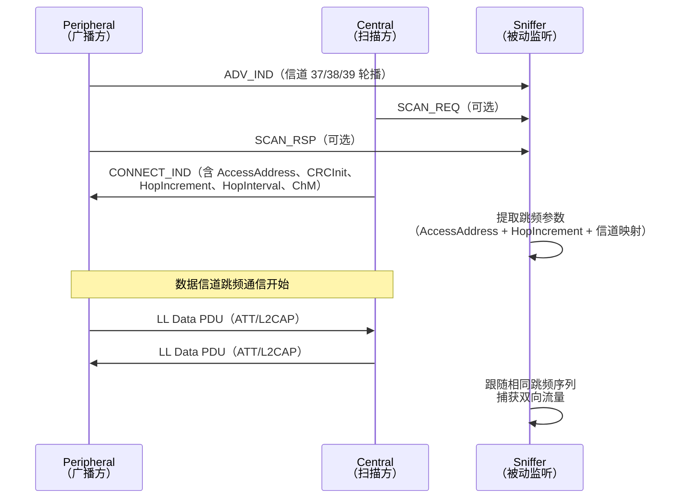
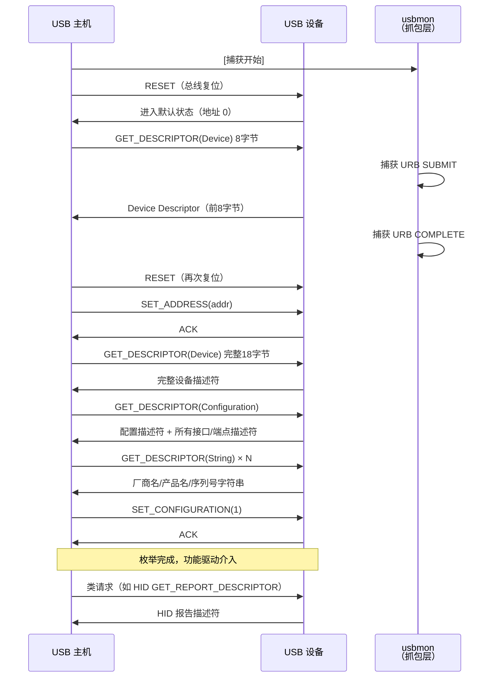

---
tags:
  - network
  - protocol-analysis
  - tier3
  - 蓝牙
  - USB抓包
---
# 蓝牙 BLE 与 USB 抓包

> [!abstract] TL;DR
> 蓝牙低功耗（BLE）和 USB 是两类典型的"非 IP 物理介质"——流量永远不会流经以太网接口，因此 tcpdump/Wireshark 的 AF_PACKET 路径完全失效。BLE 抓包依赖专用无线电硬件（Nordic nRF Sniffer、Ubertooth One、TI CC2540、Sniffle）捕获 2.4 GHz 跳频信道，再通过 Wireshark 插件或 HCI 日志进行协议解析；USB 抓包在 Linux 依靠内核 `usbmon` 驱动，在 Windows 依靠 USBPcap 内核过滤驱动，两者都能输出标准 `.pcap` 文件，让 Wireshark 的 USB dissector 还原出设备描述符、控制传输和 HID 报告。掌握这两类抓包技术是 IoT 设备逆向、智能硬件安全评估和 HID 协议分析的基础能力。

## 概述与定位

### 非 IP 介质抓包与传统网络抓包的本质差异

本系列前 21 章的分析对象，无论是以太网帧、Wi-Fi 802.11 管理帧还是工业 Modbus TCP 报文，最终都运行在某种形态的 IP 网络之上——即便是工业协议，也经由以太网封装传输。这意味着 `libpcap`/`AF_PACKET` 的捕获路径、BPF 过滤语言、以及 Wireshark 基于链路层类型（DLT）的 dissector 分发机制，都能在同一框架内统一处理。

蓝牙 BLE 和 USB 打破了这一假设：

| 维度 | 传统以太网/IP 抓包 | BLE 抓包 | USB 抓包 |
|------|------------------|----------|---------|
| 物理介质 | 铜线/光纤/802.11 | 2.4 GHz ISM 无线电 | USB 差分总线（D+/D-） |
| 捕获路径 | AF_PACKET 原始套接字 | 专用 dongle + 串口/USB 桥接 | usbmon 内核驱动 / USBPcap |
| 协议栈根 | Ethernet II / 802.3 | BLE LL（链路层） | USB 主机控制器接口 |
| 跳频 | 无 | 37/38/39 广播信道 + AFH 跳频 | 无 |
| 加密 | TLS（应用层） | LE Legacy Pairing / LE Secure Connections（链路层） | 无标准加密 |
| 主流工具 | Wireshark + libpcap | nRF Sniffer + Wireshark、btmon | Wireshark + usbmon/USBPcap |

对研究者和安全工程师而言，这意味着需要在 **硬件层面** 介入——无论是选择能同时监听多个 BLE 信道的专用嗅探器，还是在主机内核中插入 USB 流量钩子，都不是"打开一个网卡混杂模式"就能解决的问题。理解这一差异是本章一切内容的出发点。

### 应用场景与本系列的衔接

BLE 和 USB 抓包在以下领域具有核心地位：

- **IoT 设备安全研究**：智能锁、手环、体温计等设备通常通过 BLE 与手机 App 通信，抓包是分析鉴权协议、发现重放漏洞的第一步（与系列第 39 章硬件/固件逆向呼应）。
- **HID 设备协议逆向**：键盘、鼠标、游戏手柄、无线注入设备的 USB HID 报告格式需要通过 USB 抓包还原，是恶意外设分析的基础。
- **智能家居与可穿戴安全**：BLE 是低功耗传感器网络的主导协议，GATT 服务的读写权限不当、配对机制薄弱往往是漏洞入口。
- **固件更新协议分析**：许多设备通过 BLE OTA 或 USB DFU（设备固件升级）推送固件，捕获这些过程能揭示协议格式，辅助固件提取。

## 原理与机制

### BLE 协议栈架构

蓝牙低功耗（Bluetooth Low Energy，BLE，也称 Bluetooth Smart）自蓝牙 4.0 规范引入，专为低功耗传感器和可穿戴设备设计。其协议栈架构如下：

```
┌─────────────────────────────────────────┐
│           应用层（App Profile）           │
├─────────────────────────────────────────┤
│    GATT（通用属性配置文件）                │  ← 服务/特征/描述符
├─────────────────────────────────────────┤
│    ATT（属性协议）                        │  ← 读/写/通知/指示
├─────────────────────────────────────────┤
│    SMP（安全管理协议）                    │  ← 配对/加密/绑定
│    L2CAP（逻辑链路控制适配层）             │  ← 信道复用/分片
├─────────────────────────────────────────┤
│    GAP（通用访问配置文件）                 │  ← 广播/扫描/连接管理
├─────────────────────────────────────────┤
│    HCI（主机控制器接口）                   │  ← 主机/控制器分界
├─────────────────────────────────────────┤
│    链路层（Link Layer）                   │  ← 跳频、CRC、加密
├─────────────────────────────────────────┤
│    物理层（PHY）1M / 2M / Coded          │  ← 无线电，2.4 GHz
└─────────────────────────────────────────┘
```

每层的抓包关键点各有不同：

**物理层（PHY）**：BLE 工作在 2.4000–2.4835 GHz ISM 频段，划分为 40 个 2 MHz 信道（信道 0–39）。其中 37（2402 MHz）、38（2426 MHz）、39（2480 MHz）为广播信道，其余 37 个为数据信道。物理层有三种速率模式：1 Mbps（BLE 4.x 默认）、2 Mbps（BLE 5.0，LE 2M PHY，更快更耗电）、Coded PHY（BLE 5.0，S=2/S=8，低速但长距，最远可达 1 km）。

**链路层（LL）**：负责跳频序列生成、CRC 校验、ACK/NACK 重传、流量控制和加密。连接建立后，链路层依据 `HopIncrement` 和 `HopInterval` 参数跳频，外部嗅探器必须跟随相同的跳频序列才能捕获完整连接流量。

**GAP（Generic Access Profile）**：定义了设备角色（Central/Peripheral、Observer/Broadcaster）和广播/扫描过程。广播包（Advertising PDU）分为多种类型：
- `ADV_IND`：可连接的无向广播（最常见）
- `ADV_DIRECT_IND`：可连接的定向广播（针对已知地址）
- `ADV_NONCONN_IND`：不可连接广播（仅信标）
- `SCAN_RSP`：扫描响应（对扫描请求的回复，携带额外数据）
- BLE 5.0 引入扩展广播（Extended Advertising），允许更大的广播载荷（最大 255 字节，通过 AUX 信道承载）

广播 PDU 的基本格式：

```
┌──────┬──────────┬─────────────────────────┐
│ PDU  │  长度    │  载荷（AdvA + AdvData）  │
│ 类型 │ (6 bit)  │  （最大 37 字节）        │
│(4bit)│          │                         │
└──────┴──────────┴─────────────────────────┘
```

**ATT（Attribute Protocol）**：所有 GATT 交互底层都通过 ATT 操作码（Opcode）实现。ATT 定义了一个属性（Attribute）模型：每个属性由 16 位句柄（Handle）、UUID 类型、值（Value）和权限（Permission）组成。常用操作码：

| Opcode | 含义 |
|--------|------|
| `0x02` | ATT_EXCHANGE_MTU_REQ |
| `0x03` | ATT_EXCHANGE_MTU_RSP |
| `0x08` | ATT_READ_BY_TYPE_REQ |
| `0x0B` | ATT_READ_REQ |
| `0x0C` | ATT_READ_RSP |
| `0x12` | ATT_WRITE_REQ |
| `0x13` | ATT_WRITE_RSP |
| `0x1B` | ATT_HANDLE_VALUE_NTF（通知，无确认）|
| `0x1D` | ATT_HANDLE_VALUE_IND（指示，需确认）|
| `0x52` | ATT_WRITE_CMD（无响应写）|

**GATT（Generic Attribute Profile）**：在 ATT 之上定义了服务（Service）、特征（Characteristic）、描述符（Descriptor）的层次结构。

- **服务（Service）**：一组逻辑上相关的特征，有标准 UUID（如 `0x180D` = Heart Rate Service）和自定义 128 位 UUID 两类。
- **特征（Characteristic）**：携带单个数据值，由声明（Declaration）、值（Value）和可选描述符（Descriptor）三个属性组成。
- **描述符（Descriptor）**：为特征提供附加元数据，最重要的是 CCCD（Client Characteristic Configuration Descriptor，UUID `0x2902`），客户端写入 `0x0001` 即可订阅通知（Notify），写入 `0x0002` 订阅指示（Indicate）。

### BLE 连接过程详解

理解连接过程对抓包至关重要——嗅探器需要在连接请求（CONNECT_IND）被捕获的瞬间提取跳频参数，才能在后续连接中跟踪流量。



`CONNECT_IND` 包的关键字段：

```
CONNECT_IND {
  InitA:       6字节   ← Central 地址（可为随机地址）
  AdvA:        6字节   ← Peripheral 地址
  AccessAddr:  4字节   ← 连接专属访问地址（嗅探跟踪的关键）
  CRCInit:     3字节   ← CRC 初始值
  WinSize:     1字节   ← 发射窗口大小
  WinOffset:   2字节   ← 发射窗口偏移
  Interval:    2字节   ← 连接间隔（1.25ms 单位，典型值 6-3200）
  Latency:     2字节   ← 外设潜伏期
  Timeout:     2字节   ← 监控超时
  ChM:         5字节   ← 信道映射（37位，标记使用中的数据信道）
  Hop:         5bits   ← 跳频增量（HopIncrement，5-16）
  SCA:         3bits   ← 睡眠时钟精度
}
```

跳频算法（BLE 4.x）：

```
下一信道 = (当前信道 + HopIncrement) mod 37
```

若计算结果对应的信道在 ChM 中被标记为不可用，则通过映射算法寻找最近可用信道。BLE 5.0 引入了 Channel Selection Algorithm #2（CSA#2），使用随机化更强的伪随机跳频，对嗅探器的要求更高（Sniffle 等工具已支持 CSA#2）。

**自适应跳频（AFH，Adaptive Frequency Hopping）**：链路层持续监测各信道的误包率，通过 `LL_CHANNEL_MAP_IND` 动态更新信道映射，规避与 Wi-Fi（主要占用 2.4 GHz 的 1/6/11 信道）的干扰。嗅探器必须同步接收这些控制 PDU 以维持跟踪。

### BLE 配对与加密机制

BLE 的安全机制是抓包分析中最复杂的部分，直接决定了能否解密捕获的密文流量。

**LE Legacy Pairing（BLE 4.x）**：
使用临时密钥（TK）生成短期密钥（STK），STK 再用于派生长期密钥（LTK）。配对方法：
- **Just Works**：TK = 0，安全性极低，中间人可实时破解
- **Passkey Entry**：TK = 6 位 PIN（000000–999999），仅 100 万种可能，暴力破解可行
- **OOB（Out of Band）**：TK 通过 NFC 等带外信道传输，嗅探者无法获取

关键问题：LE Legacy Pairing 的加密密钥协商过程使用 TK 加密传输，若 TK 已知（如 Just Works 或 Passkey Entry），攻击者**在捕获完整配对交互后**可离线计算 LTK，从而解密后续连接流量。Wireshark 支持在协议首选项中输入 LTK 以解密 BLE 数据。

**LE Secure Connections（BLE 4.2+）**：
基于椭圆曲线 Diffie-Hellman（ECDH，P-256 曲线）进行密钥交换，生成 DHKey，再派生 LTK。即便攻击者捕获了完整配对过程，也无法在不知道私钥的情况下计算 LTK——LE Secure Connections 提供前向保密（Forward Secrecy）。这意味着针对已配对设备的被动嗅探实际上**无法解密数据层**，除非能通过其他途径（设备固件提取、内存转储）获取 LTK。

**LTK 的实际获取途径**：
1. Android HCI snoop log（`/sdcard/btsnoop_hci.log`）：Android 开发者选项中启用后，HCI 层的所有数据均被记录，包含密钥材料，直接可导入 Wireshark 解密
2. iOS PacketLogger（macOS + `PacketLogger.app`）：类似机制
3. 设备固件提取（参见系列第 39 章）：从 Flash 中读取已存储的 LTK
4. 中间人（MITM）：在配对过程中插入攻击者控制的设备，仅对 Just Works/Passkey Entry 有效

### USB 协议栈架构

USB（Universal Serial Bus）是一种主机主导（Host-Centric）的层次化协议，与蓝牙的对等通信模式不同——USB 总线上所有事务均由主机（Host Controller）发起，设备（Device/Function）被动响应。

**USB 协议层次**：

```
┌───────────────────────────────────────────┐
│     设备功能驱动（如 HID、Mass Storage）   │  ← 用户空间/内核驱动
├───────────────────────────────────────────┤
│     USB 设备框架（Chapter 9 协议）         │  ← 描述符、配置、接口
├───────────────────────────────────────────┤
│     USB 传输类型（Control/Bulk/Interrupt/Iso）│  ← URB（USB Request Block）
├───────────────────────────────────────────┤
│     USB 事务（Token/Data/Handshake）       │  ← 总线级协议
├───────────────────────────────────────────┤
│     USB 物理层（D+/D-差分信号）            │  ← NRZI编码、位填充
└───────────────────────────────────────────┘
```

**USB 设备描述符体系**（Chapter 9，USB 规范核心部分）：

设备描述符是枚举过程（Enumeration）的基础，主机通过控制传输读取一套嵌套描述符树来了解设备能力：

```
设备描述符（Device Descriptor）          ← 整个设备唯一一个
  ├── 配置描述符（Configuration Descriptor）← 可有多个配置
  │     ├── 接口描述符（Interface Descriptor）← 每个功能一个接口
  │     │     ├── 端点描述符（Endpoint Descriptor）← 端点地址/类型/包大小
  │     │     └── HID 描述符（可选，HID 类专用）
  │     └── 另一接口描述符...
  └── 字符串描述符（String Descriptor）   ← 厂商/产品/序列号可读名称
```

设备描述符关键字段：

```c
struct usb_device_descriptor {
    uint8_t  bLength;           // 描述符长度（18字节）
    uint8_t  bDescriptorType;   // 0x01（DEVICE）
    uint16_t bcdUSB;            // USB 规范版本（如 0x0200 = USB 2.0）
    uint8_t  bDeviceClass;      // 设备类代码（0x00=由接口定义，0x09=HUB）
    uint8_t  bDeviceSubClass;
    uint8_t  bDeviceProtocol;
    uint8_t  bMaxPacketSize0;   // 端点 0 最大包大小（8/16/32/64）
    uint16_t idVendor;          // VID，厂商 ID（USB-IF 分配）
    uint16_t idProduct;         // PID，产品 ID（厂商自定义）
    uint16_t bcdDevice;         // 设备版本号
    uint8_t  iManufacturer;     // 厂商名字符串索引
    uint8_t  iProduct;          // 产品名字符串索引
    uint8_t  iSerialNumber;     // 序列号字符串索引
    uint8_t  bNumConfigurations;// 配置数量
};
```

**USB 四种传输类型**：

| 类型 | 用途 | 特性 | 典型设备 |
|------|------|------|---------|
| 控制（Control）| 设备枚举、配置 | 可靠、双向、端点 0 独占 | 所有 USB 设备 |
| 批量（Bulk）| 大数据传输 | 可靠（重传）、无带宽保证 | USB 存储、打印机 |
| 中断（Interrupt）| 低延迟小数据 | 周期性轮询、有延迟保证 | 键盘、鼠标、HID |
| 同步（Isochronous）| 实时流媒体 | 不可靠（无重传）、带宽保证 | 音频、视频摄像头 |

USB 请求块（URB，USB Request Block）是内核 USB 子系统的核心数据结构，封装了一次 USB 传输请求。`usbmon` 捕获的正是 URB 提交和完成事件，Wireshark 的 USB dissector 将其还原为可读的传输序列。

## 结构/算法/伪代码详解

### BLE 链路层 PDU 格式

BLE 链路层 PDU 分为广播 PDU 和数据 PDU 两大类，均带有物理层前导（Preamble）和访问地址（Access Address）。

**广播信道 PDU 完整格式**：

```
┌──────────┬──────────────┬─────────────────────────┬─────────┐
│ Preamble │ Access Addr  │       PDU               │   CRC   │
│  1字节   │  4字节       │  2-39字节               │  3字节  │
│ 0xAA     │  0x8E89BED6  │ PDUType(4b)+RFU(2b)+    │         │
│（固定）  │（广播固定值）│ TxAdd(1b)+RxAdd(1b)+    │         │
│          │              │ Length(6b)+Payload       │         │
└──────────┴──────────────┴─────────────────────────┴─────────┘
```

**数据信道 PDU 格式**（连接建立后）：

```
┌──────────┬──────────────┬──────────────────────────────┬─────────┐
│ Preamble │ Access Addr  │          PDU                 │   CRC   │
│  1字节   │  4字节       │ LLID(2b)+NESN(1b)+SN(1b)+   │  3字节  │
│（连接专  │（CONNECT_IND │ MD(1b)+RFU(3b)+Length(8b)+  │         │
│  属值）  │  中协商）    │ Payload（最大251字节，5.0）  │         │
└──────────┴──────────────┴──────────────────────────────┴─────────┘
```

- `LLID`：`10` = L2CAP 起始/无分片，`01` = L2CAP 续帧，`11` = LL 控制 PDU
- `NESN/SN`：Next Expected Sequence Number / Sequence Number，停等式 ARQ 确认机制
- `MD`：More Data 标志

**ATT 协议帧格式**（承载于 L2CAP，CID `0x0004`）：

```
L2CAP 头（4字节）:
  Length(2B) | CID(2B) = 0x0004

ATT PDU:
  Opcode(1B) | ATT 参数
```

以 ATT_HANDLE_VALUE_NTF（通知）为例：

```
0x1B | Handle(2B) | Value(N字节)
```

Handle 对应 GATT 数据库中特征值的句柄号，Value 即原始数据字节序列。在 Wireshark 中，如果 Wireshark 已提前通过 ATT 读操作发现了服务结构（或通过 btatt 首选项指定了 profile），则会进一步将 Value 解码为具体字段（如心率值、温度等）。

### USB 枚举流程与抓包关键节点

USB 设备插入时发生的枚举（Enumeration）过程是分析设备行为的最佳入口，包含设备所有能力的自描述信息：



**HID 报告描述符的重要性**：HID 设备（键盘、鼠标等）通过 HID 报告描述符定义自己每次中断传输的数据格式。这是一种紧凑的字节码语言，定义了输入/输出/功能报告的位级字段布局。逆向 HID 设备的第一步必须解析报告描述符：

```
HID 报告描述符片段（键盘）：
05 01        Usage Page (Generic Desktop)
09 06        Usage (Keyboard)
A1 01        Collection (Application)
05 07          Usage Page (Keyboard)
19 E0          Usage Minimum (0xE0, Left Control)
29 E7          Usage Maximum (0xE7, Right GUI)
15 00          Logical Minimum (0)
25 01          Logical Maximum (1)
75 01          Report Size (1)     ← 每个键占1位
95 08          Report Count (8)    ← 8个修饰键
81 02          Input (Data,Var,Abs) ← 修饰键字节
...
```

解析后的报告格式直接决定了如何从中断传输的载荷字节中提取按键信息。

### BLE 跳频跟踪算法（伪代码）

嗅探器在捕获 `CONNECT_IND` 后，需要实时跟踪跳频序列：

```python
def ble_next_channel(current_channel, hop_increment, channel_map):
    """
    BLE 4.x Channel Selection Algorithm #1
    channel_map: 37元素列表，True=可用信道
    hop_increment: 5-16
    """
    unmapped_next = (current_channel + hop_increment) % 37
    
    if channel_map[unmapped_next]:
        # 信道可用，直接使用
        return unmapped_next
    else:
        # 信道不可用，映射到已使用信道中的第 remapping_index 个
        used_channels = [i for i in range(37) if channel_map[i]]
        remapping_index = unmapped_next % len(used_channels)
        return used_channels[remapping_index]

def ble_hop_csa2(counter, access_address, channel_map):
    """
    BLE 5.0 Channel Selection Algorithm #2
    使用伪随机序列，抗干扰性更强
    counter: 连接事件计数器（每次连接事件+1）
    """
    prng = prng_e(access_address, counter)  # 16位 PRNG
    channel_index = prng % 37
    if channel_map[channel_index]:
        return channel_index
    # 信道不可用：从可用信道中选
    used = [i for i in range(37) if channel_map[i]]
    d = prng % len(used)
    return used[d]
```

Sniffle（支持 BLE 5.0 CSA#2）在固件层实现了上述算法，在 nRF52840 硬件上以真实无线电速度跟踪跳频连接。

## 工具视角与实战

### BLE 抓包硬件详解

#### Nordic nRF Sniffer（nRF52840 Dongle）

Nordic 的官方 BLE 嗅探器解决方案，基于 nRF52840 SoC，官方提供固件和 Wireshark 插件，是入门首选：

- **支持规范**：BLE 4.x 和 BLE 5.x（含 LE 2M PHY、Coded PHY、扩展广播）
- **CSA#2 支持**：是（固件 3.x+）
- **价格**：约 10 USD（Nordic nRF52840 DK 或 Dongle）
- **操作系统**：Windows/macOS/Linux，官方 Python 脚本 + Wireshark 插件

安装流程：

```bash
# 1. 烧录官方 sniffer 固件（nRF Connect for Desktop → Programmer）
# 2. 安装 Python 包
pip install pyserial

# 3. 下载并安装 Wireshark extcap 插件
# 将 nrf_sniffer_for_bluetooth_le.py 复制到 Wireshark extcap 目录
# Linux: ~/.config/wireshark/extcap/
# Windows: C:\Users\<user>\AppData\Roaming\Wireshark\extcap\

# 4. 启动 Wireshark，选择 "nRF Sniffer for Bluetooth LE" 接口
# 可在 Capture Options 中选择特定设备地址进行跟踪
```

nRF Sniffer 的核心优势是**官方支持 + Wireshark 深度集成**：在 Wireshark 中可直接选择目标设备（通过广播包中的 BD_ADDR），插件自动下发过滤指令给 dongle 固件，只捕获目标设备流量。

#### Ubertooth One

开源 BLE 研究平台，基于 Cortex-M3 + 定制 2.4 GHz 收发器：

- **设计目标**：学术研究，强调可编程性而非易用性
- **BLE 5.0 支持**：有限（仅 1M PHY）
- **独特能力**：支持经典蓝牙（BR/EDR）嗅探，这是 nRF Sniffer 不具备的
- **项目地址**：github.com/greatscottgadgets/ubertooth
- **价格**：约 120 USD（官方）

常用命令：

```bash
# 被动监听广播包
ubertooth-btle -f -A 37   # 跟踪信道 37 广播

# 跟踪已知访问地址的连接
ubertooth-btle -f -A 37 -a <AccessAddress>

# 输出 pcap 供 Wireshark 分析
ubertooth-btle -f -A 37 -c output.pcap

# 与 Wireshark 实时集成（管道模式）
ubertooth-btle -f -A 37 -c - | wireshark -k -i -
```

Ubertooth 的挑战：在跳频连接跟踪方面，当频率跳转时 Ubertooth 的单一无线电模块必须在正确的时间出现在正确的信道——这依赖于精确的时序同步。在信道利用率高或干扰强的环境下，Ubertooth 可能丢失连接跟踪。

#### TI CC2540 USB Dongle

Texas Instruments CC2540 是早期 BLE 嗅探的主流选择，SmartRF 协议分析器配合专用固件使用：

```bash
# Linux 下使用 packet-sniffer 或 btlejuice-sniffer
npm install -g btlejuice  # 中间人工具，非纯嗅探
```

CC2540 dongle 的主要限制是只支持 BLE 4.x，不支持 BLE 5.0 扩展功能，但价格低廉（5-15 USD），配合 SmartRF 软件做 BLE 4.0/4.1/4.2 设备分析仍完全够用。

#### Sniffle

开源 BLE 5 嗅探器，运行在 TI CC26x2 硬件上，项目地址 github.com/nccgroup/Sniffle，由 NCC Group 开发：

- **BLE 5.0 完整支持**：LE 2M PHY、Coded PHY、扩展广播、CSA#2
- **主动跟踪**：可跟随连接跳频，支持主动发送 CONNECT_IND 触发目标广播设备建立可跟踪的连接
- **价格**：需要 TI LAUNCHXL-CC26X2R1（约 30 USD）
- **Python 接口**：灵活，易于二次开发

```bash
# 被动嗅探广播
python3 sniff_receiver.py -s /dev/ttyACM0 -a  # -a: 监听所有广播

# 跟踪特定设备（指定 BD_ADDR）
python3 sniff_receiver.py -s /dev/ttyACM0 -m AA:BB:CC:DD:EE:FF

# 输出到 pcap
python3 sniff_receiver.py -s /dev/ttyACM0 -a -o capture.pcap
```

### BLE 抓包软件与 Wireshark 集成

#### Wireshark + nRF Sniffer 实战

打开 Wireshark 后，nRF Sniffer 表现为一个 extcap 接口（`nRF Sniffer for Bluetooth LE`），在 Capture Options 中可配置：

- **Device Filter**：指定目标 BD_ADDR，仅捕获该设备的广播和连接包
- **PHY**：选择 1M/2M/Coded 物理层

捕获后的关键 Wireshark 过滤器：

```wireshark
# 显示所有广播包
btle.advertising_header.pdu_type == 0x00     /* ADV_IND */

# 显示 GATT 写操作
btatt.opcode == 0x12    /* ATT_WRITE_REQ */
btatt.opcode == 0x52    /* ATT_WRITE_CMD */

# 显示通知（Notify）
btatt.opcode == 0x1b    /* ATT_HANDLE_VALUE_NTF */

# 显示特定 Handle 的数据（Handle 为十六进制）
btatt.handle == 0x0025

# 显示连接请求
btle.link_layer_data.llid == 0 && btle.advertising_header.pdu_type == 5
```

**BLE 解密配置**：若已知 LTK（来自 HCI log 或设备固件），在 Wireshark 中：
`Edit → Preferences → Protocols → BTLE → New（添加 LTK）`

输入格式：`<BD_ADDR>|<LTK 十六进制>`，Wireshark 将自动尝试用该 LTK 解密捕获的加密连接流量。

#### Android HCI Snoop Log

Android 提供了操作系统级别的 HCI 层日志，是分析蓝牙通信最便捷的方式（无需额外硬件）：

```
启用步骤：
设置 → 开发者选项 → 启用蓝牙 HCI 信息包日志
（不同版本 Android 路径略有差异）

日志文件位置：
Android 4.4–7.0：/sdcard/btsnoop_hci.log
Android 8.0+：/data/misc/bluetooth/logs/btsnoop_hci.log
（需 adb pull 或 adb bugreport 提取）
```

HCI snoop log 使用 BTSnoop 格式（类 pcap，DLT_BLUETOOTH_HCI_H4），Wireshark 可直接打开。其核心优势是**包含主机侧的完整 HCI 事件和命令**，包括加密密钥（Key exchange）的 HCI_LE_LTK_Request_Reply，Wireshark 可从中自动提取 LTK 并解密后续数据。

```bash
# adb 提取 HCI log
adb pull /data/misc/bluetooth/logs/btsnoop_hci.log ./ble_capture.cfa

# 在 Wireshark 中打开
wireshark ble_capture.cfa
```

#### btmon（Linux BlueZ 内置工具）

Linux BlueZ 蓝牙栈提供 `btmon` 工具，直接监控系统 HCI 接口：

```bash
# 实时监控并保存到 btsnoop 格式
sudo btmon -w /tmp/bt_capture.btsnoop

# 实时监控显示（文本格式）
sudo btmon

# 读取已保存的 btsnoop 文件
btmon -r /tmp/bt_capture.btsnoop
```

`hcidump` 是更老的工具，功能与 btmon 重叠但输出格式不同：

```bash
# 捕获 HCI 数据并保存 pcap
sudo hcidump -i hci0 -w /tmp/hci_dump.pcap

# 实时显示（可读格式）
sudo hcidump -i hci0 -X
```

`btmon` 的输出示例（可读格式）：

```
@ MGMT Open: btmon (privileged) version 1.22 {0x0001} [hci0]
< HCI Command: LE Set Scan Parameters (0x08|0x000b) plen 7
        Type: Passive (0x00)
        Interval: 10.000 msec (0x0010)
        Window: 10.000 msec (0x0010)
        Own address type: Public (0x00)
        Filter policy: Accept all advertisement (0x00)
> HCI Event: Command Complete (0x0e) plen 4
      LE Set Scan Parameters (0x08|0x000b) ncmd 1
        Status: Success (0x00)
```

### USB 抓包工具详解

#### usbmon（Linux 内核驱动）

`usbmon` 是 Linux 内核内置的 USB 监控接口，自 2.6.11 内核起包含，通过 debugfs 暴露原始 URB 数据：

```bash
# 加载 usbmon 模块
sudo modprobe usbmon

# 挂载 debugfs（大多数发行版已自动挂载）
sudo mount -t debugfs none /sys/kernel/debug

# 查看可用的 USB 总线（0 = 所有总线，1/2/3 = 具体总线号）
ls /sys/kernel/debug/usb/usbmon/

# 直接读取原始文本（调试用）
sudo cat /sys/kernel/debug/usb/usbmon/1u

# 用 Wireshark 捕获（推荐，图形化分析）
# 在 Wireshark 接口列表中选择 usbmon1（对应 USB 总线 1）
sudo wireshark   # 需要 root 或将用户加入 wireshark 组

# 用 tcpdump 捕获 USB 流量
sudo tcpdump -i usbmon1 -w usb_capture.pcap
```

确定目标设备所在的 USB 总线号：

```bash
lsusb
# 输出示例：
# Bus 001 Device 003: ID 046d:c52b Logitech, Inc. Unifying Receiver
# Bus 002 Device 002: ID 0483:5740 STMicroelectronics Virtual COM Port

# 目标设备在 Bus 001，则监控 usbmon1
```

usbmon 捕获格式说明（文本格式，调试查看用）：

```
ffff88... C Ci:1:003:0 0 8 = 04000000 00000000
^         ^ ^           ^ ^   ^
事件地址  事件类型      状态 长度  数据（hex）

事件类型：
  S = URB 提交（SUBMIT，主机→设备方向的请求）
  C = URB 完成（COMPLETE，设备→主机的响应）
  E = URB 错误

Ci/Co = Control in/out
Ii/Io = Interrupt in/out
Bi/Bo = Bulk in/out
```

#### USBPcap（Windows）

Windows 没有内置的 USB 抓包接口，USBPcap 通过安装内核过滤驱动实现：

```powershell
# 安装 USBPcap（随 Wireshark Windows 安装包附带，可选组件）
# 或从 https://desowin.org/usbpcap/ 单独下载

# 方法一：通过 Wireshark GUI
# 安装后重启，Wireshark 接口列表出现 USBPcap1/2 等接口

# 方法二：命令行捕获
USBPcapCMD.exe -d \\.\USBPcap1 -o output.pcap -A
# -A: 捕获所有设备（不指定则仅捕获已连接设备）

# 确认 USBPcap 版本（应 ≥ 1.5.4.0 以支持 USB 3.0）
USBPcapCMD.exe --version
```

**权限问题**：USBPcap 内核驱动需要以管理员身份运行，且在 Windows 10 安全启动（Secure Boot）环境下需要驱动签名验证，部分版本需要临时禁用驱动签名强制（测试签名模式）。

#### Wireshark USB Dissector 深度使用

Wireshark 内置 USB dissector，支持以下关键过滤器：

```wireshark
# 显示所有控制传输
usb.transfer_type == 0x02

# 显示中断传输（HID 数据常通过中断端点传输）
usb.transfer_type == 0x01

# 显示批量传输（Mass Storage）
usb.transfer_type == 0x03

# 按设备地址过滤（设备 3 在总线 1）
usb.device_address == 3 && usb.bus_id == 1

# 显示 HID 报告数据
usbhid.data

# 显示 URB 方向（IN=设备到主机，OUT=主机到设备）
usb.endpoint_address.direction == 1  /* IN */
usb.endpoint_address.direction == 0  /* OUT */

# 显示枚举过程（GET_DESCRIPTOR 请求）
usb.bmRequestType_type == 0 && usb.bRequest == 6
```

**逆向 HID 设备流程**：

1. 捕获枚举阶段，提取 HID 报告描述符
2. 解析报告描述符（可用 `hid-tools` 的 `hid-recorder` 或在线解析器）
3. 在 Wireshark 中观察中断传输的载荷，对应报告描述符的字段布局
4. 编写 Wireshark Lua dissector 自动解码自定义 HID 报告

```lua
-- HID 键盘报告 Wireshark Lua dissector 示例
local hid_keyboard_proto = Proto("hid_kbd", "HID Keyboard Report")
local f_modifier = ProtoField.uint8("hid_kbd.modifier", "Modifier Keys", base.HEX)
local f_keycodes = ProtoField.bytes("hid_kbd.keycodes", "Key Codes")
hid_keyboard_proto.fields = { f_modifier, f_keycodes }

function hid_keyboard_proto.dissector(buffer, pinfo, tree)
    if buffer:len() < 8 then return end
    local subtree = tree:add(hid_keyboard_proto, buffer())
    subtree:add(f_modifier, buffer(0, 1))
    -- buffer(1,1) 为保留字节
    subtree:add(f_keycodes, buffer(2, 6))
    pinfo.cols.protocol = "HID-KBD"
end
```

#### 硬件 USB 分析仪：Beagle USB

软件层面的 usbmon/USBPcap 存在局限性：只能捕获操作系统能识别的总线流量，无法在设备枚举失败时捕获错误，也无法进行非侵入式硬件级分析。对于需要**硬件级 USB 分析**的场景，Total Phase Beagle USB 分析仪系列是专业选择：

- **Beagle USB 12**：USB 1.1/Full Speed，约 400 USD
- **Beagle USB 480**：USB 2.0/High Speed（480 Mbps），约 1000 USD
- **Beagle USB 5000 v2**：USB 3.0/SuperSpeed，约 4000 USD

Beagle 硬件嗅探器接在 USB 主机与设备之间的数据链路上，对总线无任何影响，能捕获包括枚举失败、总线重置、USB 挂起/恢复等所有总线事件，输出到 Data Center 软件或 pcap 格式文件。

### IoT 实战案例：BLE 智能锁分析

典型 BLE 智能锁的安全评估流程：

```
阶段 1：信息收集
  → nRF Sniffer 捕获广播包
  → 记录 BD_ADDR、AD Type（设备名、服务 UUID）
  → 判断是否使用 BLE 5.0 扩展广播

阶段 2：服务枚举
  → 使用手机 App 连接设备
  → HCI snoop log 记录完整的 ATT 读服务/特征序列
  → 还原 GATT 数据库结构（服务→特征→描述符→句柄号）

阶段 3：协议分析
  → 分析开锁指令特征（写哪个 Handle、值格式）
  → 判断是否含时间戳/序列号等防重放机制
  → 分析是否存在未加密的控制特征

阶段 4：安全评估
  → LE Legacy Pairing → 尝试提取 LTK 解密
  → LE Secure Connections → 尝试固件提取
  → 未配对即可写的特征 → 测试未授权操作
```

常见脆弱模式：

```
CVE-2019-9506 (KNOB) 类：
  → 强制降低加密密钥熵（EncKeySize = 1字节）
  → 抓包观察 LL_ENC_REQ 中的 KeySize 字段是否被接受

Just Works 配对：
  → TK = 0x00 * 16
  → 可通过 crackle（github.com/mikeryan/crackle）离线破解 LTK

明文 GATT 写：
  → 开锁命令不经加密直接写入特征值
  → 重放攻击（btlejack 的中间人模式）
```

`crackle` 工具：专门针对 LE Legacy Pairing 的 LTK 破解：

```bash
# 前提：已捕获完整配对过程（含 LL_ENC_REQ/LL_ENC_RSP 和配对 PDU）
crackle -i ble_capture.pcap -o decrypted.pcap
# crackle 枚举所有可能的 TK 并尝试验证 LTK
# Just Works（TK=0）: 即时破解
# Passkey（TK=000000-999999）: 暴力破解约数秒
```

## 安全性与正确使用

### 法律边界与合规要求

BLE 嗅探在法律和伦理层面存在明确边界，研究者应严格区分以下场景：

**合规的研究场景**：
- 对**自己拥有**的设备（智能手表、IoT 传感器、自购智能锁）进行安全分析
- 在实验室环境中对**委托评估**的设备（客户授权的安全评估）
- 2.4 GHz ISM 频段的**广播包接收**：BLE 广播包设计为公开可被任何扫描设备接收（这是其工作原理），被动接收广播在大多数国家法律上不构成拦截
- 学术研究环境中经 IRB/伦理委员会审查的研究

**需要谨慎的场景**：
- **捕获他人设备的连接流量**：即使在公共场所，在未经授权的情况下捕获第三方 BLE 连接（而非广播）可能触及通信保密法律（《电子通信隐私法案》ECPA 及各国同类法律）
- **BLE 随机地址与隐私**：BLE 4.2+ 设备通常使用可解析随机私有地址（Resolvable Private Address，RPA）以防止持续跟踪。尝试解析 RPA 以关联身份需要 IRK（身份解析密钥），获取 IRK 本身需要已配对或特权访问
- **无线电频谱监管**：使用 Ubertooth 等设备以主动方式（发射）干扰无线通信属于无线电频谱违法行为；被动嗅探（仅接收）通常不受频谱许可限制

**USB 抓包合规性**：
USB 抓包本质上是本机内核层的操作，无需额外法律考量——前提是在自己拥有或获授权的设备上操作。`usbmon` 需要 root 权限，这本身构成操作系统级别的访问控制。

### BLE 嗅探的技术限制与对抗

**LE Secure Connections 的真正保护**：
如前所述，BLE 4.2+ 设备若正确实施 LE Secure Connections，配对过程中的 ECDH 密钥交换保证了即使全程被嗅探，攻击者也无法推算 LTK。这要求：
- 双端均支持并协商 LE Secure Connections
- LESC OOB（Out of Band）或 Numeric Comparison（数字比较）方法，防止中间人攻击
- 应用层在 GATT 之上再实施端到端加密（如证书绑定）

**BLE 5.0 抓包难度提升**：
- CSA#2 跳频算法的随机性更强，单天线嗅探器的跟踪成功率下降
- 扩展广播（Extended Advertising）将数据分散到 AUX 辅助信道，需要嗅探器同时监听主广播信道和辅助信道
- LE 2M PHY 和 Coded PHY 需要硬件支持对应的物理层调制

### 负责任的信息披露

如果在评估过程中发现 BLE 或 USB 设备的安全漏洞，遵循负责任披露（Responsible Disclosure）原则：
1. 通知设备厂商，提供复现步骤和漏洞说明
2. 给予合理的修复期限（通常 90 天，参考 Google Project Zero 标准）
3. 修复后再公开披露完整技术细节

## 小结

本章系统介绍了两类非 IP 物理介质的专项抓包技术：

**BLE 方向**的核心要点：
- BLE 的 40 信道跳频机制决定了需要专用无线电硬件，嗅探器必须在 `CONNECT_IND` 中提取跳频参数才能跟踪连接
- GAP→ATT→GATT 的层次结构定义了从广播发现到数据读写的完整交互模型，每一层均有对应的 Wireshark 过滤器和解码器
- LE Legacy Pairing 在 Just Works/Passkey Entry 模式下存在 LTK 可暴力破解的根本缺陷；LE Secure Connections（ECDH）提供前向保密
- Android HCI snoop log 是最便捷的 BLE 分析入口，包含密钥材料可直接解密

**USB 方向**的核心要点：
- USB 的主机主导架构和枚举过程是所有分析的起点，描述符体系（设备→配置→接口→端点）完整描述了设备能力
- Linux `usbmon` 内核驱动和 Windows USBPcap 是两大主流软件捕获方案，均输出 pcap 格式供 Wireshark 解析
- HID 报告描述符是逆向 HID 设备协议的关键文档，理解其位级字段布局才能正确解读中断传输载荷
- 硬件 USB 分析仪（Beagle 系列）在枚举失败、总线电气问题等软件层无法观测的场景下不可替代

这两类技术共同构成了 IoT 设备和智能硬件安全分析的物理层能力基础，配合系列第 39 章（硬件/固件逆向）可以形成从无线协议到固件代码的完整分析链路。

## 相关阅读

- **Bluetooth Core Specification 5.4**（bluetooth.com/specifications）：BLE 所有层协议的权威定义，第 6 卷 Part B 为链路层规范
- **USB 2.0 Specification**（usb.org/document-library）：Chapter 9（设备框架）和各传输类型的权威参考
- **USB HID Usage Tables**（usb.org/document-library/hid-usage-tables-15）：HID 报告描述符的使用页/使用 ID 完整查阅表
- **crackle**（github.com/mikeryan/crackle）：LE Legacy Pairing LTK 破解工具，含详细原理说明
- **Sniffle**（github.com/nccgroup/Sniffle）：支持 BLE 5.0 CSA#2 的开源嗅探器
- **Ubertooth One Wiki**（github.com/greatscottgadgets/ubertooth/wiki）：Ubertooth 硬件规格与命令参考
- **Nordic Semiconductor nRF Sniffer for Bluetooth LE 文档**（infocenter.nordicsemi.com）：nRF Sniffer 官方安装与使用指南
- **libpcap/usbmon 文档**（kernel.org/doc/html/latest/usb/usbmon.html）：Linux USB 监控接口内核文档
- **USBPcap 项目**（desowin.org/usbpcap）：Windows USB 抓包工具文档与技术说明
- 系列第 39 章「硬件与固件逆向」：BLE 设备 LTK 固件提取与 USB DFU 固件分析
- 系列第 13 章「抓包实战 CTF 与漏洞分析」：pcap 取证基础流程

---

[[00.抓包与协议分析实战总览|⬆ 系列总览]] | [[21.工业协议Modbus与S7|← 上一章]]
