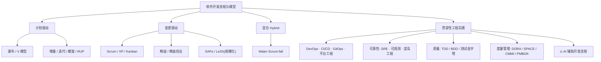

# 软件开发流程与模型 · 系列总览

> [!abstract] 速览
> 「软件开发流程与模型」系列,系统梳理软件工程方法论的**完整地图**:从**经典生命周期模型**→**敏捷 / 精益**→**DevOps 工程流程**→**可靠性与运维(SRE)**→**质量度量与管理**→**现代与产品流程**,共 **8 大板块、52 篇**(含速查大表与中英术语表)。
> 每篇统一配备:**Mermaid 图 · 对照表 · 工具链落地 · 真实案例与代码/配置示例 · 常见误区与面试要点 · 「对原文的修正」批判专题 · 双链导航 · 参考文献**。
> 阅读建议:先读 [[01.软件工程与软件过程导论]] 建立全局认知,再按板块推进;想直击某主题用下表"简介"定位;想横向对比直接看 [[46.模型对比速查大表]];术语不懂查 [[47.中英术语表]]。
> ✅ **全系列 52 篇已全部完成。**

## 一、基础与全景(地基)

| # | 章节 | 一句话简介 | 状态 |
| --- | --- | --- | --- |
| 01 | [[01.软件工程与软件过程导论]] | 软件过程是什么、4 大基本活动、为何需要过程模型 | ✅ |
| 02 | [[02.软件开发生命周期SDLC]] | 需求 → 设计 → 实现 → 测试 → 部署 → 维护 全阶段 | ✅ |

## 二、经典过程模型(计划驱动)

| # | 章节 | 一句话简介 | 状态 |
| --- | --- | --- | --- |
| 03 | [[03.瀑布模型]] | 线性顺序、阶段评审;一切模型的参照原点 | ✅ |
| 04 | [[04.V模型]] | 瀑布的"测试镜像",开发与验证一一对应 | ✅ |
| 05 | [[05.原型模型]] | 先做可抛弃 / 演进原型,快速澄清需求 | ✅ |
| 06 | [[06.增量模型]] | 分批交付可用增量,核心功能先上线 | ✅ |
| 07 | [[07.迭代模型]] | 逐轮精化同一产品,每轮都是完整闭环 | ✅ |
| 08 | [[08.螺旋模型]] | 风险驱动,迭代 + 原型 + 风险分析 | ✅ |
| 09 | [[09.快速应用开发RAD]] | 构件复用 + 工具加速,超短周期交付 | ✅ |
| 10 | [[10.统一过程RUP]] | 用例驱动、架构中心、迭代增量的过程框架 | ✅ |
| 11 | [[11.过程模型选型与Cynefin决策]] | 横向选型 + Cynefin 复杂度框架辅助决策 | ✅ |

## 三、敏捷与精益(变更驱动)

| # | 章节 | 一句话简介 | 状态 |
| --- | --- | --- | --- |
| 12 | [[12.敏捷宣言与原则]] | 4 大价值观、12 条原则;敏捷的总纲 | ✅ |
| 13 | [[13.Scrum框架]] | 3 角色 5 事件 3 工件的迭代交付框架 | ✅ |
| 14 | [[14.看板方法Kanban]] | 可视化 + 限制在制品(WIP) + 拉动式流动 | ✅ |
| 15 | [[15.极限编程XP]] | TDD / 结对 / 持续集成等工程实践集合 | ✅ |
| 16 | [[16.精益软件开发Lean]] | 消除浪费、放大学习、尽量延迟决策 | ✅ |
| 17 | [[17.规模化敏捷SAFe与LeSS]] | 多团队规模化敏捷的几种主流框架 | ✅ |
| 18 | [[18.敏捷估算与度量]] | 故事点、计划扑克、速度、燃尽 / 燃起图 | ✅ |
| 19 | [[19.混合模型与Water-Scrum-fall]] | 现实最常见:计划驱动与敏捷的混搭 | ✅ |

## 四、DevOps 与工程流程

| # | 章节 | 一句话简介 | 状态 |
| --- | --- | --- | --- |
| 20 | [[20.DevOps文化与体系]] | CALMS、三步工作法;研发运维一体化 | ✅ |
| 21 | [[21.持续集成与持续交付CICD]] | CI / CD(交付)/ CD(部署)三概念辨析 | ✅ |
| 22 | [[22.CICD流水线实践]] | Pipeline as Code、阶段设计与质量门禁 | ✅ |
| 23 | [[23.GitOps]] | 以 Git 为唯一事实源的声明式持续交付 | ✅ |
| 24 | [[24.DevSecOps与供应链安全]] | 安全左移 + SLSA / SBOM 供应链防护 | ✅ |
| 25 | [[25.Git分支工作流]] | Git Flow / GitHub Flow / Trunk-Based 对比 | ✅ |
| 26 | [[26.代码评审流程]] | PR / MR 评审流程与高效 Review 实践 | ✅ |
| 27 | [[27.发布与部署策略]] | 蓝绿、金丝雀、滚动、灰度、特性开关 | ✅ |
| 28 | [[28.平台工程与内部开发者平台]] | 🔥 IDP、黄金路径、自助式研发平台 | ✅ |

## 五、可靠性与运维(SRE)

| # | 章节 | 一句话简介 | 状态 |
| --- | --- | --- | --- |
| 29 | [[29.SRE与错误预算]] | 🔥 SLI/SLO/SLA、错误预算、消除琐务 | ✅ |
| 30 | [[30.可观测性与混沌工程]] | 日志/指标/追踪三支柱 + 主动注入故障 | ✅ |
| 31 | [[31.ITIL与变更管理]] | 运维侧服务管理与变更控制流程 | ✅ |

## 六、质量、度量与管理

| # | 章节 | 一句话简介 | 状态 |
| --- | --- | --- | --- |
| 32 | [[32.软件测试流程与测试金字塔]] | V&V、测试分层与金字塔 / 奖杯模型 | ✅ |
| 33 | [[33.测试驱动开发TDD]] | 红 - 绿 - 重构循环,测试先行 | ✅ |
| 34 | [[34.行为驱动开发BDD]] | Given-When-Then 与"活文档" | ✅ |
| 35 | [[35.需求工程流程]] | 获取 → 分析 → 规格 → 验证 → 管理 | ✅ |
| 36 | [[36.用户故事地图与影响地图]] | 把需求"画"出来:故事地图 / 影响地图 | ✅ |
| 37 | [[37.软件估算方法]] | 功能点、COCOMO、类比 / 参数化、故事点 | ✅ |
| 38 | [[38.软件度量DORA与SPACE]] | DORA 四指标 + SPACE + Flow 研发效能 | ✅ |
| 39 | [[39.CMMI能力成熟度模型]] | 5 级成熟度与过程改进 | ✅ |
| 40 | [[40.项目管理PMBOK与PRINCE2]] | 两大项管体系及其与敏捷的关系 | ✅ |
| 41 | [[41.配置管理与变更管理]] | SCM、版本控制策略、变更控制流程 | ✅ |

## 七、现代与产品流程

| # | 章节 | 一句话简介 | 状态 |
| --- | --- | --- | --- |
| 42 | [[42.精益创业LeanStartup与MVP]] | 构建 - 度量 - 学习循环、MVP、转向 | ✅ |
| 43 | [[43.设计冲刺DesignSprint]] | Google 5 天设计冲刺法 | ✅ |
| 44 | [[44.TeamTopologies团队拓扑]] | 康威定律、4 种团队 + 3 种交互模式 | ✅ |
| 45 | [[45.AI辅助开发流程]] | 🔥 AI 嵌入需求 / 编码 / 测试 / 评审 / 运维全流程 | ✅ |

## 八、架构设计与协作实践

| # | 章节 | 一句话简介 | 状态 |
| --- | --- | --- | --- |
| 48 | [[48.领域驱动设计DDD]] | 统一语言、限界上下文、聚合、战略/战术设计 | ✅ |
| 49 | [[49.事件风暴EventStorming]] | 领域事件驱动的协作式建模工作坊 | ✅ |
| 50 | [[50.C4架构模型]] | Context/Container/Component/Code 四层架构图 | ✅ |
| 51 | [[51.架构决策记录ADR]] | 记录架构决策的 why，Nygard/MADR 模板 | ✅ |
| 52 | [[52.契约测试ContractTesting]] | 消费者驱动契约、Pact、Pact Broker | ✅ |

## 附录 · 速查与工具

| # | 章节 | 一句话简介 | 状态 |
| --- | --- | --- | --- |
| 46 | [[46.模型对比速查大表]] | 一页横向对比所有模型 / 方法的 Cheat-Sheet | ✅ |
| 47 | [[47.中英术语表]] | 全系列中英文术语对照与速查 | ✅ |

## 谱系全景:一张图看懂分类

> 横轴本质是**对不确定性的态度**:需求越稳定越偏左(计划驱动),越易变越偏右(变更驱动),现实多落在中间的 **Hybrid**。详见 [[11.过程模型选型与Cynefin决策]] 与 [[19.混合模型与Water-Scrum-fall]]。

## 阅读路线建议

> [!tip] 按目标挑路线
> - 🧭 **建立认知**:[[01.软件工程与软件过程导论|01]] → [[02.软件开发生命周期SDLC|02]] → [[03.瀑布模型|03]] → [[11.过程模型选型与Cynefin决策|11]]
> - 🏃 **转型敏捷**:[[12.敏捷宣言与原则|12]] → [[13.Scrum框架|13]] → [[14.看板方法Kanban|14]] → [[18.敏捷估算与度量|18]] → [[19.混合模型与Water-Scrum-fall|19]]
> - 🚀 **工程落地**:[[20.DevOps文化与体系|20]] → [[21.持续集成与持续交付CICD|21]] → [[25.Git分支工作流|25]] → [[27.发布与部署策略|27]] → [[28.平台工程与内部开发者平台|28]]
> - 🛡️ **可靠性运维**:[[29.SRE与错误预算|29]] → [[30.可观测性与混沌工程|30]] → [[31.ITIL与变更管理|31]]
> - 🧪 **质量保障**:[[32.软件测试流程与测试金字塔|32]] → [[33.测试驱动开发TDD|33]] → [[38.软件度量DORA与SPACE|38]]
> - 🔮 **现代前沿**:[[28.平台工程与内部开发者平台|平台工程]] · [[29.SRE与错误预算|SRE]] · [[45.AI辅助开发流程|AI 辅助开发]]
> - 🎓 **面试突击**:[[03.瀑布模型|瀑布]] · [[08.螺旋模型|螺旋]] · [[13.Scrum框架|Scrum]] · [[21.持续集成与持续交付CICD|CI/CD]] · [[25.Git分支工作流|Git 工作流]] · [[38.软件度量DORA与SPACE|DORA]]

## 每篇统一结构(写作规范)

> [!note] 本系列每篇都遵循以下骨架
> 1. **frontmatter**(title / series / chapter / date / author / aliases / tags)
> 2. **`[!abstract]` 速览** — 一段抓住本质
> 3. **正文** — 编号大节 + Mermaid 图 + 对照表
> 4. **工具链落地** — 该方法 / 流程对应的主流工具与平台
> 5. **真实案例 / 落地示例** — 含代码、命令或配置片段(按篇适用)
> 6. **常见误区与面试要点**
> 7. **对原文 / 常见说法的修正** — 批判性核查
> 8. **一句话记忆**
> 9. **延伸阅读 + 参考文献**
> 10. **底部导航条** `⬅️ 上篇 ｜ 🏠 总览 ｜ 下篇 ➡️`

---

> 🏠 你正在阅读**系列总览(MOC)**。全系列 **52 篇已全部完成**,点击上表任意链接进入正文。
