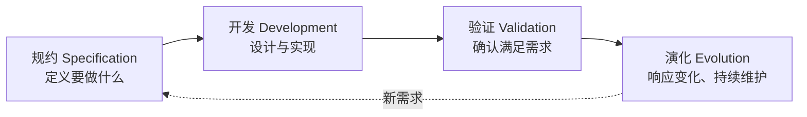
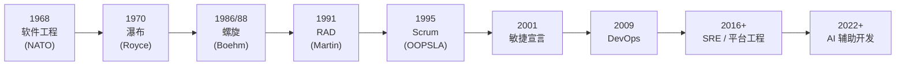

# 软件开发流程与模型(一)软件工程与软件过程导论

> [!abstract] 速览
> 本篇是整个系列的**地基**：讲清 **软件工程**为何诞生（软件危机与几起致命翻车）、**软件过程**是什么（活动 + 制品 + 角色 + 工具）、**过程模型**为何存在、以及它们 60 年来如何演进到今天的 [[45.AI辅助开发流程|AI 辅助开发]]。
> 一句话：**软件过程回答"做软件要经过哪些活动"，过程模型回答"这些活动怎么组织排列"**——后续所有模型（[[03.瀑布模型|瀑布]]、[[13.Scrum框架|Scrum]]…）都是对同一组基本活动的不同排法。

## 1. 软件危机：从三起著名"翻车"说起

1960 年代硬件飞涨，软件却频频**超期、超预算、质量低下、难以维护**——史称 **软件危机（Software Crisis）**。几起经典事故让世界看清"软件难"：

| 事故 | 年代 | 教训 |
| --- | --- | --- |
| **IBM OS/360** | 1960s | 史上最大软件项目之一，严重延期；Brooks 据此写下《人月神话》，提出"**向延期项目加人只会更晚**"的布鲁克斯定律 |
| **Therac-25** | 1985–87 | 放射治疗仪软件竞态缺陷导致**超剂量致死**——安全攸关软件的血泪教训 |
| **Ariane 5** | 1996 | 火箭发射后 37 秒爆炸：复用旧代码的 64 位浮点→16 位整数**转换溢出**未验证 |

这些事故的共性：**不是写不出代码，而是缺乏工程化的过程来保证正确性、可验证性与可维护性。**

## 2. 软件工程的诞生

1968 年 **NATO 在德国举办的会议**首次提出 **"软件工程(Software Engineering)"**，主张用**工程化**方法对抗危机。

> **IEEE 定义**：软件工程是将**系统化、规范化、可量化**的方法应用于软件的**开发、运行和维护**。

## 3. 软件的本质特性

软件为什么难？因为它有别于实体产品：

| 特性 | 含义 |
| --- | --- |
| **无形性** | 看不见摸不着，进度与质量难直观度量 |
| **易变性** | 需求与软件本身极易被要求修改 |
| **不磨损但会"退化"** | 不像零件磨损，但反复修改会让结构腐化（架构腐蚀） |
| **复杂性** | 状态空间巨大，难以穷尽测试 |
| **一致性难** | 要与现实业务、其他系统持续保持一致 |

## 4. 什么是软件过程

**软件过程(Software Process)** = 为开发软件而执行的一组**有序活动**及其产物。四要素：

| 要素 | 说明 | 例 |
| --- | --- | --- |
| **活动 Activities** | 要做的事 | 需求分析、编码、测试 |
| **制品 Artifacts** | 活动的产出 | SRS、设计文档、代码 |
| **角色 Roles** | 谁来做 | PO、架构师、开发、测试 |
| **工具 Tools** | 用什么做 | IDE、CI、缺陷库 |

## 5. 软件过程的四个基本活动（Sommerville）

无论哪种模型，都绕不开这四类基本活动：

| 活动 | 回答的问题 | 主要产物 |
| --- | --- | --- |
| **规约 Specification** | 软件该做什么、约束是什么 | 需求规格 |
| **开发 Development** | 怎么设计与实现 | 设计、代码 |
| **验证 Validation** | 是否做对了、做的是不是对的 | 测试结果 |
| **演化 Evolution** | 如何响应需求变化 | 变更、新版本 |

## 6. 过程模型：为何需要

**过程模型(Process Model)** 是软件过程的**抽象表示**——规定活动的**顺序、迭代方式、产出与里程碑**。需要它的原因：

- **可管理**：把混沌工作切成可计划、可跟踪的阶段；
- **可沟通**：团队对"现在在哪、接下来做什么"有共识；
- **可复用**：沉淀最佳实践，新项目照章办事降低风险。

## 7. 过程模型 60 年演进时间线

> 一条主线：**从"重前期规划"逐步走向"重快速反馈与持续交付"**，再到用 AI 加速全流程。本系列就是沿这条线逐站详解。

## 8. 两大阵营：计划驱动 vs 敏捷

| 维度 | 计划驱动（Plan-driven） | 敏捷（Agile） |
| --- | --- | --- |
| 关注 | 前期规划、文档 | 可工作软件、响应变化 |
| 代表 | [[03.瀑布模型\|瀑布]]、[[04.V模型\|V]]、[[08.螺旋模型\|螺旋]]、[[10.统一过程RUP\|RUP]] | [[13.Scrum框架\|Scrum]]、[[14.看板方法Kanban\|Kanban]]、[[15.极限编程XP\|XP]] |
| 适合 | 需求稳定、强合规 | 需求易变、需快速反馈 |

现实多为 **混合(Hybrid)**，见 [[19.混合模型与Water-Scrum-fall]]、[[11.过程模型选型与Cynefin决策]]。

## 9. 术语澄清：过程 / 模型 / 方法 / 方法论 / 框架

| 术语 | 含义 | 例 |
| --- | --- | --- |
| **过程 Process** | 活动的集合 | 软件开发过程 |
| **模型 Model** | 过程的组织方式（抽象） | 瀑布、迭代 |
| **方法 Method** | 做某活动的具体技术 | 用例分析、TDD |
| **方法论 Methodology** | 一整套方法 + 实践的体系 | RUP、XP |
| **框架 Framework** | 只给骨架、留白让团队填 | Scrum |

## 10. 软件过程改进（SPI）

过程不是定下就一成不变，而要**持续度量与改进（Software Process Improvement）**：

- **能力成熟度**：[[39.CMMI能力成熟度模型|CMMI]] 用 5 级衡量组织过程成熟度；
- **敏捷改进**：靠 [[13.Scrum框架|回顾会]] 持续微调；
- **数据驱动**：用 [[38.软件度量DORA与SPACE|DORA / SPACE]] 度量并优化。

## 11. "好过程"的特征（Sommerville）

| 特征 | 含义 |
| --- | --- |
| 可理解 / 可见 | 流程清晰、进展外部可见 |
| 可支持 / 可接受 | 有工具支撑、团队愿意用 |
| 可靠 / 健壮 | 能发现错误、能应对意外 |
| 可维护 / 快速 | 能随组织演进、能快速交付 |

## 12. 工具链与制品

| 活动 | 典型工具 | 典型制品 |
| --- | --- | --- |
| 规约 | Confluence、DOORS | 需求规格 SRS |
| 开发 | IDE、Git、PlantUML | 设计文档、代码 |
| 验证 | JUnit、Selenium、SonarQube | 测试报告、质量门禁 |
| 演化 | Jira、缺陷库、监控 | 变更记录、版本 |

## 13. 真实案例：不同规模项目如何选过程

| 项目类型 | 特征 | 合理过程 |
| --- | --- | --- |
| 心脏起搏器固件 | 安全攸关、需求稳定 | [[04.V模型\|V 模型]] + 合规 |
| 银行核心系统升级 | 大型、高风险 | [[08.螺旋模型\|螺旋]] / [[10.统一过程RUP\|RUP]] + 阶段门禁 |
| 互联网电商 App | 需求多变、快速试错 | [[13.Scrum框架\|Scrum]] + [[21.持续集成与持续交付CICD\|CI/CD]] |
| 创业 MVP | 验证商业假设 | [[42.精益创业LeanStartup与MVP\|精益创业]] |

> **没有"最好的过程"，只有"最适合本项目失败代价与不确定性的过程"。**

## 14. 常见误区与面试要点

> [!warning] 易错点
> - **"软件工程 = 编程"？** 不。编程只是开发活动的一部分；工程还含需求、设计、测试、维护、管理。
> - **"过程模型 = SDLC"？** SDLC 是**阶段集合**，过程模型是**组织这些阶段的方式**，见 [[02.软件开发生命周期SDLC]]。
> - **"有了流程就万事大吉"？** 流程是手段不是目的；僵化流程（[[13.Scrum框架|ScrumBut]]）反而有害。
> - **布鲁克斯定律**：向已延期的项目加人，往往使它**更晚**（沟通成本与上手成本）。

## 15. 对常见说法的修正

> [!note]
> "软件危机已经解决"是误解——大型软件的超期、超预算、维护困难**至今仍普遍存在**（每年仍有大量 IT 项目失败）。软件工程是**持续缓解**危机的学科，而非一劳永逸的终点。

## 16. 一句话记忆

> **软件工程**用工程化对抗软件危机；**软件过程**是"做软件的活动集合"；**过程模型**则是把这些活动**排列组合**的不同方式——这就是本系列要逐一拆解的对象。

## 延伸阅读

- 下一步：[[02.软件开发生命周期SDLC]]
- 经典起点：[[03.瀑布模型]]
- 选型与混合：[[11.过程模型选型与Cynefin决策]] · [[19.混合模型与Water-Scrum-fall]]
- 过程改进：[[39.CMMI能力成熟度模型]] · [[38.软件度量DORA与SPACE]]
- 横向速查：[[46.模型对比速查大表]]

## 参考文献

1. Sommerville, I. *Software Engineering*（第 10 版）。
2. Pressman, R. *Software Engineering: A Practitioner's Approach*.
3. Brooks, F. *The Mythical Man-Month*（人月神话）。
4. Naur, P. & Randell, B. (1969). *Software Engineering: Report on a NATO Conference (1968)*.
5. Leveson, N. *Therac-25 事故分析*；Lions, J. *Ariane 5 Flight 501 报告*。

---

> 🏠 [[00.软件开发流程与模型总览]] ｜ [[02.软件开发生命周期SDLC]] ➡️
