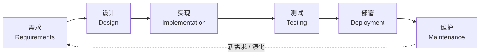
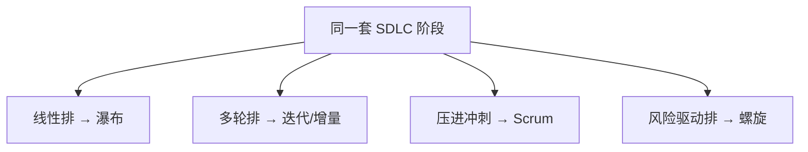

# 软件开发流程与模型(二)软件开发生命周期SDLC

> [!abstract] 速览
> **软件开发生命周期（SDLC, Software Development Life Cycle）** 描述一个软件从"想法"到"退役"要经历的**阶段集合**：需求 → 设计 → 实现 → 测试 → 部署 → 维护。国际标准 **ISO/IEC/IEEE 12207** 对其作了规范。
> 关键区分：**SDLC 是"阶段清单"，过程模型是"组织这些阶段的方式"**——同一套 SDLC 阶段，[[03.瀑布模型|瀑布]]把它排成线性、[[13.Scrum框架|Scrum]]把它压进每个迭代循环。理解 SDLC，就拿到了阅读后续所有模型的"坐标系"。

## 1. 什么是 SDLC

SDLC 把软件的"一生"切成有序阶段，让开发**可计划、可跟踪、可交接**。它是**阶段框架**，不绑定具体怎么排（那是过程模型的事）。国际标准 **ISO/IEC/IEEE 12207** 定义了软件生命周期过程的通用框架。

## 2. SDLC 全景



## 3. 各阶段：输入 / 活动 / 输出 / 角色

| 阶段 | 输入 | 主要活动 | 输出（制品） | 主导角色 |
| --- | --- | --- | --- | --- |
| **需求** | 业务目标、用户诉求 | 获取、分析、定义、确认 | 需求规格 SRS、需求基线 | BA / PO |
| **设计** | 需求规格 | 架构、模块 / 接口 / 数据库设计 | 架构与设计文档 | 架构师 |
| **实现** | 设计文档 | 编码、单元测试、评审 | 源代码、单元测试 | 开发 |
| **测试** | 代码、测试计划 | 集成 / 系统 / 验收测试 | 缺陷报告、测试报告 | 测试 |
| **部署** | 通过测试的版本 | 发布、配置、迁移、培训 | 上线系统、用户手册 | 运维 / DevOps |
| **维护** | 线上反馈、变更请求 | 纠错 / 适应 / 完善 / 预防 | 补丁、新版本 | 全体 |

## 4. 各阶段典型交付物清单

| 阶段 | 交付物 |
| --- | --- |
| 需求 | SRS、用户故事、用例图、验收标准 |
| 设计 | 架构图、ER 图、接口规约(API)、详细设计 |
| 实现 | 源代码、单元测试、代码评审记录 |
| 测试 | 测试计划、测试用例、缺陷报告、测试报告 |
| 部署 | 部署手册、发布说明、回滚预案 |
| 维护 | 变更请求、补丁记录、监控看板 |

## 5. SDLC ≠ 过程模型（核心区分）

> [!note] 一句话辨析
> **SDLC = 阶段（做什么）；过程模型 = 编排（怎么排）。**



## 6. 验证与确认（V&V）贯穿始终

- **验证 Verification**："**我们是否把产品做对了**？"（符合规格） → 评审、单元 / 集成测试。
- **确认 Validation**："**我们是否做了对的产品**？"（满足用户真实需求） → 验收测试、用户反馈。

V&V 贯穿整个 SDLC，详见 [[32.软件测试流程与测试金字塔]]。

## 7. 成本与缺陷分布

| 阶段 | 成本占比（经验） | 缺陷引入 vs 发现 |
| --- | --- | --- |
| 需求 | ~10% | **引入多、发现少**（最贵的漏网之鱼） |
| 设计 | ~15% | 引入中 |
| 实现 | ~20% | 引入多 |
| 测试 | ~15% | **集中发现** |
| 维护 | ~40%（最大头） | 残留缺陷暴露 |

> 缺陷"**引入早、发现晚**"是成本失控的根源——这正是 [[33.测试驱动开发TDD|TDD]]、[[21.持续集成与持续交付CICD|CI]] 主张"尽早测"的原因（参见 [[03.瀑布模型]] 第 9 节成本曲线）。

## 8. 安全左移：S-SDLC

传统 SDLC 把安全放在末尾，现代实践把安全**左移**到每个阶段——形成 **安全 SDLC（S-SDLC）**：需求阶段做威胁建模、设计阶段做安全设计、实现阶段做安全编码与 SAST、测试阶段做渗透测试。详见 [[24.DevSecOps与供应链安全]]。

## 9. 维护：最长也最贵的阶段

| 类型 | 目的 | 占比（经验） |
| --- | --- | --- |
| **纠错性 Corrective** | 修复缺陷 | ~20% |
| **适应性 Adaptive** | 适配新环境 / 平台 | ~25% |
| **完善性 Perfective** | 增强功能 / 性能 | ~50% |
| **预防性 Preventive** | 重构、防退化 | ~5% |

> 维护常占全生命周期成本 **60%~80%**，所以"可维护性"应在设计阶段就被重视。

## 10. 真实案例：一个"登录功能"走完 SDLC

| 阶段 | 该功能的具体产出 |
| --- | --- |
| 需求 | 用户故事："作为用户，我想用账号密码登录" + 验收标准（连错 5 次锁定） |
| 设计 | 接口 `POST /login`；用户表 `users(id, name, pwd_hash, fail_count, locked_until)` |
| 实现 | 校验输入 → 查库 → 比对哈希 → 失败计数 / 锁定（含单元测试） |
| 测试 | TC：正确登录、错误密码、锁定触发、锁定到期解锁 |
| 部署 | 金丝雀发布 5% 流量 → 观察错误率 → 全量（见 [[27.发布与部署策略]]） |
| 维护 | 监控登录失败率告警；后续加"短信验证码"作为新增量 |

```gherkin
场景: 连续失败锁定
  假如 我已连续输错密码 4 次
  当 我第 5 次输错
  那么 账号应被锁定 15 分钟
```

## 11. 工具链（按阶段）

| 阶段 | 常用工具 |
| --- | --- |
| 需求 | Confluence、Jira、DOORS、Figma（原型） |
| 设计 | PlantUML、draw.io、Enterprise Architect |
| 实现 | IDE、Git、[[21.持续集成与持续交付CICD\|CI]] |
| 测试 | JUnit/pytest、Selenium、[[32.软件测试流程与测试金字塔\|测试框架]] |
| 部署 | Docker、K8s、Ansible、[[27.发布与部署策略\|发布工具]] |
| 维护 | 监控告警、缺陷库、[[30.可观测性与混沌工程\|可观测性]] |

## 12. 常见误区与面试要点

> [!warning] 易错点
> - **SDLC 与具体模型混为一谈**：SDLC 是阶段，模型是编排（见第 5 节）。
> - **"上线即结束"**：维护才是最长的阶段。
> - **验证 vs 确认**：Verification 看"符不符合规格"，Validation 看"是不是用户要的"，面试常考。
> - **阶段是否必须串行？** 不。现代模型里阶段大量并行 / 迭代 / 持续进行。

## 13. 对常见说法的修正

> [!note]
> "SDLC 就是瀑布"是常见误解。瀑布只是 SDLC 的**一种线性编排**；敏捷、迭代、螺旋同样基于这套 SDLC 阶段，只是编排方式不同。

## 14. 一句话记忆

> **SDLC** = 软件从生到死的"阶段地图"（需求→设计→实现→测试→部署→维护）；**怎么走这张地图，由过程模型决定**。

## 延伸阅读

- 上一篇：[[01.软件工程与软件过程导论]]
- 第一种编排：[[03.瀑布模型]]
- V&V 详解：[[32.软件测试流程与测试金字塔]]
- 安全左移：[[24.DevSecOps与供应链安全]]
- 横向速查：[[46.模型对比速查大表]]

## 参考文献

1. ISO/IEC/IEEE 12207（软件生命周期过程标准）。
2. Sommerville, I. *Software Engineering*（第 10 版）。
3. Lientz, B. & Swanson, E. (1980). *Software Maintenance Management*.

---

> ⬅️ [[01.软件工程与软件过程导论]] ｜ 🏠 [[00.软件开发流程与模型总览]] ｜ [[03.瀑布模型]] ➡️
