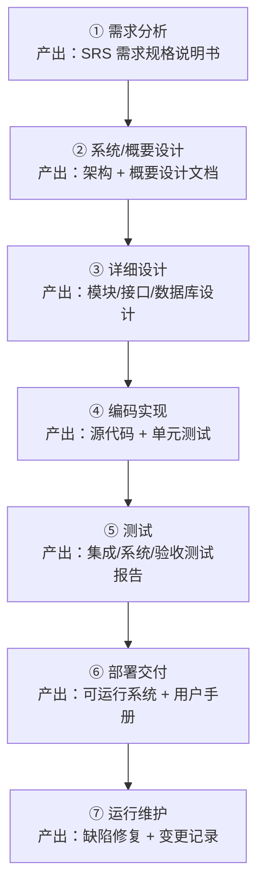
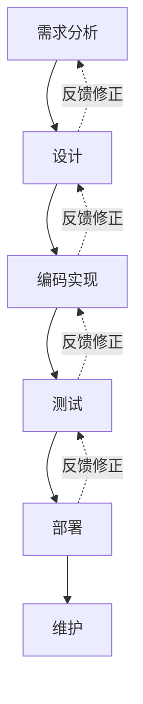
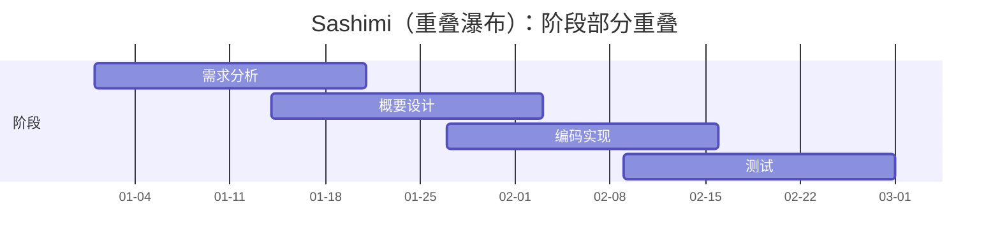
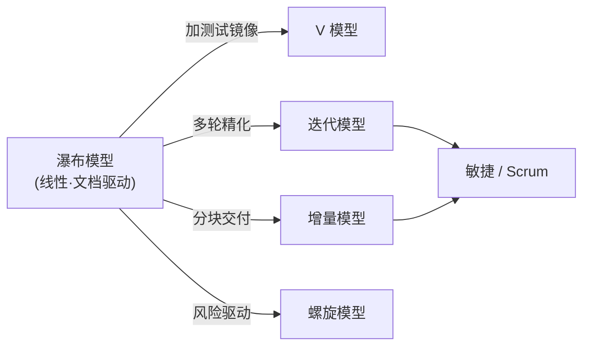
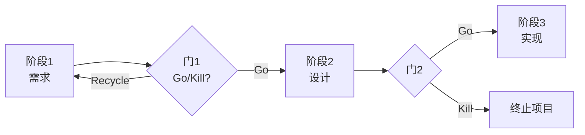

# 软件开发流程与模型(三)瀑布模型

> [!abstract] 速览
> **瀑布模型（Waterfall Model）** 是最早被系统描述的软件过程模型，源自 Winston W. Royce **1970 年**的论文《Managing the Development of Large Software Systems》。它把开发切成 **需求 → 设计 → 实现 → 测试 → 部署 → 维护** 若干**首尾相接、自上而下**的阶段，像瀑布之水**只向下流**：上一阶段的产出（文档）是下一阶段的输入，阶段之间设有评审"闸门"。
> 一句话：**瀑布 = 一次想清楚、按阶段顺序做、以文档驱动、变更代价高。** 它是理解后续一切模型（[[04.V模型|V 模型]]、[[06.增量模型|增量]]、[[07.迭代模型|迭代]]、[[08.螺旋模型|螺旋]]、[[13.Scrum框架|敏捷]]）的**参照原点**。本篇除原理外，还覆盖**变体(Sashimi)、IEEE 文档模板、Stage-Gate 门径管理，以及它在医疗 / 航空 / 汽车等合规行业的现代落地**。

## 1. 历史与来由：Royce 的"美丽误会"

提到瀑布，绕不开 **Winston W. Royce** 1970 年那篇论文。耐人寻味的是：**他画那张线性流程图，本意是为了批评它。**

- 论文里他先给出一个朴素的线性流程（需求→设计→编码→测试→运行），紧接着写下那句著名评价：**"I believe in this concept, but the implementation described above is risky and invites failure."（我认同这个概念，但上述实现方式有风险、会招致失败。）**
- 随后他提出多项改进：**做两遍（先做原型）、引入阶段间反馈回路、尽早让客户介入、强化文档**——这些更接近后来的**迭代**与**原型**思想。
- "Waterfall（瀑布）"这个名字**并非 Royce 所起**，普遍认为是 1970 年代中后期（如 Bell & Thayer 1976）才流传；后人只截取了他那张"反面教材"线性图，奉为标准范式。
- 真正把瀑布**制度化**的是工业与军方标准：美国国防部 **DoD-STD-2167（1985）/ 2167A（1988）** 等要求按阶段、按文档交付，使瀑布在大型 / 国防 / 合规项目中长期主导。

> [!note] 历史结论
> "瀑布是 Royce 发明并推荐的标准做法"是流传甚广的误解。准确说法是：**Royce 描述了纯线性流程并指出其风险，工业界却把被批评的那一版当成了范式。**

## 2. 阶段全景

经典瀑布通常划分为 6~7 个阶段，精髓是**单向向下、阶段间以评审为闸门**：

> 每条向下的箭头背后都隐含一道**阶段评审（Phase Gate / Stage Gate）**：当前阶段文档通过评审、签字确认（Sign-off）后，才允许进入下一阶段。这正是瀑布"重前期、重文档"的体现（详见第 12 节）。

## 3. 各阶段详解

| 阶段 | 主要活动 | 关键产出物 | 完成标志（出口准则） |
| --- | --- | --- | --- |
| **需求分析** | 获取并分析功能 / 非功能需求 | **SRS**（软件需求规格说明书）、需求基线 | 需求评审通过、客户签字冻结 |
| **概要设计** | 确定架构、模块划分、技术选型、对外接口 | 架构设计文档、概要设计说明书 | 架构评审通过 |
| **详细设计** | 设计模块内部逻辑、数据结构、数据库、接口 | 详细设计文档(**SDD**)、数据库设计 | 设计评审通过 |
| **编码实现** | 按设计编写源代码，完成**单元测试** | 源代码、单元测试用例与报告 | 代码走查通过、单测达标 |
| **测试** | 集成测试 → 系统测试 → 验收测试 | 测试计划、缺陷报告、测试报告 | 测试通过、验收达标 |
| **部署交付** | 上线部署、数据迁移、用户培训 | 可运行系统、部署手册、用户手册 | 客户验收、正式上线 |
| **运行维护** | 纠错性 / 适应性 / 完善性 / 预防性维护 | 维护记录、变更请求单 | 系统退役前持续进行 |

> [!tip] 维护占大头
> 软件全生命周期成本中，**运行维护**往往占 **60%~80%**（Boehm、Lientz & Swanson 等经典研究）。瀑布把维护放在最后一格，但它其实是耗时最久、花钱最多的阶段。

## 4. 核心特征

| 特征 | 含义 |
| --- | --- |
| **阶段顺序、线性不可逆** | 阶段首尾相接、自上而下，理想状态下不回头 |
| **文档驱动（Document-Driven）** | 每阶段以**正式文档**作为里程碑与交接物 |
| **阶段评审 / 质量门禁** | 阶段之间设 Phase Gate，评审签字后方可下流 |
| **大设计先行（BDUF）** | Big Design Up Front——编码前把需求和设计尽量定全定死 |

## 5. 带反馈的瀑布：Royce 的本意

纯线性瀑布几乎不可行。**带反馈的瀑布（Iterative Waterfall）** 允许发现问题时**回退到相邻上一阶段**修正，更接近 Royce 原意：

> [!note]
> 反馈**只回退到相邻上一阶段**，而非任意跨阶段跳跃——这是它与真正"迭代模型"的关键区别：瀑布的反馈是**纠错性回退**，[[07.迭代模型|迭代模型]]的循环是**计划内的逐轮精化**。

## 6. 瀑布的变体

纯瀑布太僵，工程上演化出几种缓解"阶段等待 / 一次交付"的变体：

| 变体 | 思路 | 解决的问题 |
| --- | --- | --- |
| **Sashimi 模型（生鱼片）** | 相邻阶段**部分重叠**（像生鱼片摆盘叠在一起），下一阶段在上一阶段未结束时即启动 | 减少阶段间等待，压缩工期 |
| **带子项目的瀑布** | 把系统拆成多个子系统**并行各跑瀑布**，最后集成 | 利用并行、缩短总周期 |
| **增量瀑布** | 把需求分批，每批跑一个小瀑布、分次交付 | 缓解"末期一次性交付"，通向 [[06.增量模型]] |

> Sashimi 由 Peter DeGrace 提出，名称取自日料摆盘——阶段像生鱼片一样**首尾交叠**。它能加速，但**牺牲了瀑布"阶段清晰、易管理"的最大优点**，并行协调成本上升。

## 7. 优点

| 优点 | 说明 |
| --- | --- |
| **简单、直观、易管理** | 阶段清晰、里程碑明确，便于排期与跟踪 |
| **文档完备** | 利于交接、审计、合规与长期维护 |
| **过程可度量、可预测** | 适合固定预算、固定范围的合同 |
| **职责分工明确** | 需求、设计、开发、测试可按阶段分工承接 |
| **适合需求稳定的领域** | 一次做对的代价最低 |

## 8. 缺点与风险

| 缺点 / 风险 | 说明 |
| --- | --- |
| **需求难以一次冻结** | 现实需求会变，而瀑布要求前期定死 |
| **反馈太晚（致命伤）** | 客户要到测试 / 交付才首次见到可运行系统 |
| **风险后置** | 集成与测试集中后期，"大爆炸"集成风险最后才爆发 |
| **变更成本高** | 越晚发现的缺陷，修复要回溯越多文档与代码 |
| **文档负担重** | 易出现"文档与代码不一致" |
| **不适应不确定性** | 探索型、创新型项目几乎无法套用 |

## 9. 变更成本：越晚发现，代价越高

Barry Boehm 在《Software Engineering Economics》（1981）给出被反复引用的经验趋势：

| 缺陷被发现的阶段 | 相对修复成本（经验值） |
| --- | --- |
| 需求阶段 | 1× |
| 设计阶段 | ~5× |
| 编码阶段 | ~10× |
| 测试阶段 | ~15×~40× |
| 生产 / 运维阶段 | ~30×~100× |

一个需求错误若到生产才发现，要回头改**需求 → 设计 → 代码 → 测试用例 → 已上线数据**，牵一发而动全身。这条"成本放大曲线"正是后来 **迭代 / 敏捷 / 持续集成** 主张"尽早、频繁反馈"的根本动机。

> [!warning] 对"1:100"数据的修正
> 曲线的**趋势（越晚越贵）成立且符合直觉**，但具体倍数（尤其"生产 100×"）的**实证基础其实很薄弱**。Laurent Bossavit 在《The Leprechauns of Software Engineering》中考证指出，许多教科书引用的精确倍数可追溯到样本有限、年代久远的二手数据。**记住趋势、慎引精确数字**。

## 10. 与其他模型的关系

| 模型 | 针对瀑布的哪个问题 | 改良思路 |
| --- | --- | --- |
| [[04.V模型\|V 模型]] | 测试游离 | 每个开发阶段**对应**一层测试 |
| [[06.增量模型\|增量模型]] | 上线太晚 | 系统**切成多个增量**分批交付 |
| [[07.迭代模型\|迭代模型]] | 一次做对不现实 | **多轮迭代**逐步精化 |
| [[08.螺旋模型\|螺旋模型]] | 风险后置 | 每轮先做**风险分析 + 原型** |
| [[13.Scrum框架\|敏捷 / Scrum]] | 反馈太晚 | 短迭代 + 可工作软件 + 持续协作 |

## 11. 适用与不适用场景

| ✅ 适合瀑布 | ❌ 不适合瀑布 |
| --- | --- |
| 需求**清晰、稳定、几乎不变** | 需求**模糊、频繁变化** |
| 技术成熟、风险可控 | 技术新颖、不确定性高 |
| 强**合规 / 审计 / 文档**要求 | 需快速试错的创新业务 |
| 固定预算 / 固定范围合同 | 需要持续交付、频繁上线 |
| 短期、小规模、边界明确 | 超大型、长周期、诉求多变 |

> [!tip] 现实多是"混合"
> 纯瀑布与纯敏捷都少见。常见做法是 **Hybrid（混合）**：用阶段门禁守合规里程碑，内部开发节奏用敏捷迭代。详见 [[19.混合模型与Water-Scrum-fall]] 与 [[11.过程模型选型与Cynefin决策]]。

## 12. 工具链与文档模板

瀑布"文档驱动"的落地，离不开标准文档模板与门径评审机制。

**各阶段的标准文档与工具：**

| 阶段 | 标准 / 模板 | 常用工具 |
| --- | --- | --- |
| 需求 | **IEEE 830 / ISO·IEC·IEEE 29148**（SRS） | IBM DOORS、Jama Connect、Confluence |
| 设计 | **IEEE 1016**（SDD） | Enterprise Architect、PlantUML、Visio |
| 计划排期 | 甘特图、WBS | MS Project、GanttProject、Jira(看板外) |
| 测试 | **IEEE 829 / 29119**（测试文档） | TestRail、Polarion、Zephyr |
| 配置 / 变更 | 基线 + 变更控制 | Git / SVN、ClearCase、配置库 |

**Stage-Gate（门径管理）**：瀑布的阶段评审本质就是 Robert Cooper 的 **Stage-Gate** 模型——每个"门(Gate)"是一次 **Go / Kill / Hold / Recycle** 决策：

## 13. 真实案例：为什么合规行业至今首选瀑布 / V

"瀑布已死"在互联网圈是政治正确，但在**安全攸关（safety-critical）行业**，瀑布 / [[04.V模型|V 模型]] 不是落后，而是**监管刚需**——核心诉求是**完整的需求可追溯性与审计证据**。

| 行业 | 标准 | 为何偏向瀑布 / V |
| --- | --- | --- |
| **医疗器械软件** | **IEC 62304** | 要求明确的开发计划、需求、架构、验证与可追溯，天然契合阶段化 |
| **航空机载软件** | **RTCA DO-178C** | 极严格的双向可追溯（需求↔设计↔代码↔测试），按 DAL 等级定证据 |
| **汽车功能安全** | **ISO 26262 / Automotive SPICE** | 以 V 模型为主干，强调验证(Verification)与确认(Validation) |

这些行业的核心产物之一是**需求可追溯性矩阵（RTM, Requirements Traceability Matrix）**——证明"每条需求都被设计、实现、测试覆盖"：

| 需求 ID | 需求描述 | 设计模块 | 代码单元 | 测试用例 | 状态 |
| --- | --- | --- | --- | --- | --- |
| REQ-001 | 用户须用账号密码登录 | DM-Auth | `auth.c::login()` | TC-012 | ✅ 通过 |
| REQ-002 | 连续失败 5 次锁定 | DM-Auth | `auth.c::lock()` | TC-013 | ✅ 通过 |
| REQ-003 | 密码须加密存储 | DM-Crypto | `crypto.c::hash()` | TC-021 | ⚠️ 阻塞 |

> [!note] 关键洞察
> 在这些领域，**"先想清楚、留全证据"不是僵化，而是出了事能追责、能召回、能过审**。选模型永远要看**领域的失败代价**：互联网改 bug 可热修，飞机 / 心脏起搏器的软件缺陷则人命关天。

## 14. 常见误区与面试要点

> [!warning] 易错点
> - **瀑布是 Royce 推荐的吗？** 不是。他描述线性流程并**指出其风险**，还提出反馈与原型改良。
> - **瀑布 = 完全没有反馈？** 不。带反馈瀑布允许**回退到相邻上一阶段**；只是反馈晚、代价大。
> - **瀑布 vs V 模型？** V 模型是瀑布的"测试增强版"：测试阶段与开发阶段**一一镜像**（单元↔详设、集成↔概设、系统↔需求），强调**测试设计随开发同步**。
> - **"瀑布已死"？** 言过其实。强合规、需求极稳定、硬件耦合领域，瀑布 / V 仍是合理甚至首选。
> - **BDUF 是什么？** Big Design Up Front——编码前把需求 / 设计尽量定全。敏捷主张"恰好够用的前期设计"。
> - **瀑布最适合大项目？** 误传。项目越大越长，需求变化与风险越多，纯瀑布"反馈太晚"的弊端反而被放大。

## 15. 对常见说法的修正

> [!note] 修正清单
> 1. **Royce ≠ 瀑布的拥护者**（见第 1 节）。
> 2. **"1:100 缺陷成本"慎引**（见第 9 节）。
> 3. **瀑布不等于"无迭代"**：增量瀑布、Sashimi 都带某种重叠 / 分批。
> 4. **合规行业用瀑布 / V 不是"技术落后"**，而是监管与失败代价决定的理性选择（见第 13 节）。

## 16. 一句话记忆

> **瀑布** = 把软件当成"盖楼"：先出全套图纸（需求 + 设计），再施工（编码），最后验收（测试 / 交付）。图纸定得越死，返工越贵——所以它怕"中途改需求"，却在"图纸必须留档备查"的合规工程里如鱼得水。

## 延伸阅读

- 上游基础：[[02.软件开发生命周期SDLC]]
- 测试增强版：[[04.V模型]]
- 对"反馈太晚"的回应：[[06.增量模型]] · [[07.迭代模型]] · [[08.螺旋模型]]
- 选型决策：[[11.过程模型选型与Cynefin决策]] · [[19.混合模型与Water-Scrum-fall]]
- 对照阅读：[[13.Scrum框架]]（理解"为什么要敏捷"）
- 横向速查：[[46.模型对比速查大表]]

## 参考文献

1. Royce, W. W. (1970). *Managing the Development of Large Software Systems*. Proc. IEEE WESCON.
2. Boehm, B. (1981). *Software Engineering Economics*. Prentice Hall.
3. Bossavit, L. (2015). *The Leprechauns of Software Engineering*.
4. IEEE Std 830-1998（SRS）；IEEE Std 1016（SDD）；ISO/IEC/IEEE 29148（需求工程）。
5. IEC 62304（医疗器械软件）；RTCA DO-178C（航空）；ISO 26262 / Automotive SPICE（汽车）。
6. Cooper, R. G. *Winning at New Products*（Stage-Gate 门径管理）。

---

> ⬅️ [[02.软件开发生命周期SDLC]] ｜ 🏠 [[00.软件开发流程与模型总览]] ｜ [[04.V模型]] ➡️
