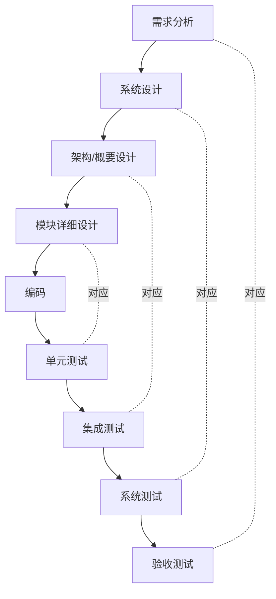
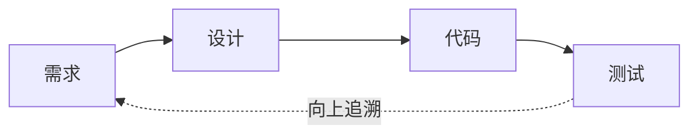

# 软件开发流程与模型(四)V模型

> [!abstract] 速览
> **V 模型（V-Model）** 是 [[03.瀑布模型|瀑布]]的"**测试增强版**"：把线性的瀑布在底部"折弯"成一个 V 字——**左臂是逐层细化的开发阶段（需求→系统设计→架构→详细设计），右臂是逐层对应的测试阶段（单元→集成→系统→验收）**，底部尖端是编码。
> 它纠正了瀑布最大的弊端之一：**测试不再被堆到末尾**，而是"每个开发阶段在动工时，就同步设计好将来验证它的测试"。
> 一句话：**V 模型 = 瀑布 + "开发与测试逐层照镜子" + "测试设计前移"。** 因为它强制建立**需求↔测试的双向可追溯**，至今仍是汽车(ISO 26262)、航空(DO-178C)、医疗(IEC 62304)等安全攸关软件的主流模型。本篇深入其结构、变体(W/双V)、测试类型映射、可追溯矩阵与三大合规行业落地。

## 1. 来由与历史：三条并行的源头

V 模型不是某一人某一天发明的，而是几条线汇流的结果：

- **德国政府线**：1980 年代由 IABG 为德国联邦国防与行政项目制定 **V-Modell**，后演进为通用、可裁剪的 **V-Modell XT**，是德语区软件工程的官方标准。
- **英美工程线**：系统工程界长期用 V 字表达"分解—集成"的对称关系，软件界自然借用。
- **测试改良线**：针对瀑布"测试太晚"的批评，把测试阶段与开发阶段一一对齐，形成今天教科书里的 V。

> [!note] 一句话定位
> V 模型本质是**瀑布的"测试维度升级版"**——它没有解决瀑布"不拥抱变化"的问题，但解决了"测试游离、缺陷发现太晚、缺乏可追溯"的问题。

## 2. V 字结构



左臂"**自顶向下逐层分解**"（从整体需求拆到模块细节），右臂"**自底向上逐层集成验证**"（从单元拼回整体）。每一层的左右两端**互为镜像**。

## 3. 左臂：开发阶段逐层拆解

| 阶段 | 关注粒度 | 主要活动 | 产出 |
| --- | --- | --- | --- |
| 需求分析 | 用户 / 系统级 | 明确"做什么"与约束 | 需求规格 SRS |
| 系统设计 | 系统级 | 划分子系统、定系统行为 | 系统设计文档 |
| 架构 / 概要设计 | 模块间 | 定模块划分与接口 | 架构与接口规约 |
| 模块详细设计 | 模块内 | 设计单个模块内部逻辑 | 详细设计 SDD |

> 越往下，抽象度越低、细节越多——这是"分解"的过程。

## 4. 右臂：测试阶段逐层拆解

| 测试层 | 验证对象 | 对照的左臂阶段 |
| --- | --- | --- |
| 单元测试 | 单个模块 / 函数 | 模块详细设计 |
| 集成测试 | 模块间接口与协作 | 架构 / 概要设计 |
| 系统测试 | 整个系统的功能 / 非功能 | 系统设计 |
| 验收测试 | 是否满足用户真实需求 | 需求分析 |

> 越往上，验证范围越大——这是"集成"的过程。

## 5. 核心：测试"设计"时机前移

V 模型最大的进步，是**右臂的测试用例在左臂对应阶段就开始设计**，而不是等代码写完才想测试：

| 在做（左臂） | 同时设计（右臂用例） | 带来的好处 |
| --- | --- | --- |
| 写需求 | 设计验收测试用例 | 倒逼需求"可验证"，暴露含糊需求 |
| 系统设计 | 设计系统测试用例 | 提前发现设计漏洞 |
| 架构设计 | 设计集成测试用例 | 接口契约更清晰 |
| 详细设计 | 设计单元测试用例 | 模块边界更明确 |

> [!tip] 关键洞察
> "**写需求时就被迫想清楚怎么验证它**"——这一条本身就能过滤掉大量"听起来对、实际没法测"的伪需求。这也是 [[33.测试驱动开发TDD|TDD]]"测试先行"思想在宏观层面的体现。

## 6. 验证 vs 确认（V&V）

V 模型的名字里就含 V&V：

- **验证 Verification（"做对了吗"）**：检查产物是否**符合规格**——单元 / 集成测试对照设计文档。
- **确认 Validation（"做的是对的吗"）**：检查是否**满足用户真实需求**——验收测试对照需求。

> 一个经典助记：**Verification 对图纸，Validation 对用户**。一个系统可能"完全符合规格(验证通过)"却"不是用户想要的(确认失败)"。

## 7. 测试类型在 V 中的位置

除四层主线，实际项目还有多种测试穿插其中：

| 测试类型 | 归属层 | 目的 |
| --- | --- | --- |
| 单元测试 | 单元 | 函数 / 类逻辑正确 |
| 集成测试 | 集成 | 接口、依赖协作正确 |
| 系统测试 | 系统 | 端到端功能 |
| 验收测试(UAT) | 验收 | 用户场景达标 |
| 回归测试 | 各层 | 变更未破坏既有功能 |
| 性能 / 压力测试 | 系统 | 非功能指标 |
| 安全测试 | 系统 / 集成 | 漏洞与攻击面（见 [[24.DevSecOps与供应链安全]]） |

详细的测试分层见 [[32.软件测试流程与测试金字塔]]。

## 8. 变体一：W 模型（开发与测试双线并行）

V 模型仍隐含"测试在开发之后"。**W 模型**（Andreas Spillner）认为应让测试活动**全程并行**：给每个开发阶段并排一条测试准备线，两条线交织成 W：

```mermaid
graph LR
    subgraph 开发线
    R[需求]-->D[设计]-->C[编码]
    end
    subgraph 测试线（并行）
    RT[需求评审+验收测试设计]-->DT[设计评审+集成测试设计]-->CT[单元/集成测试执行]
    end
    R -. 同步 .-> RT
    D -. 同步 .-> DT
    C -. 同步 .-> CT
```

> W 模型的口号是"**测试与开发同生**"——需求一出来，验收测试就开始设计，而不是等开发做完。

## 9. 变体二：双 V / 系统工程 V

在复杂系统工程（如汽车、航天）中，常用**双 V / 多 V**：一个 V 管**系统级**（整车 / 整机），下挂多个子 V 管**硬件、软件、机械**各自的开发与验证，再逐层集成确认。这呼应了"系统之系统(SoS)"的分解—集成思想。

## 10. V 模型与可追溯性（RTM）

安全攸关软件的命门是**可追溯**——必须证明"每条需求都被设计、实现、测试覆盖，且每个测试都能追回某条需求"。其核心产物是**需求可追溯性矩阵(RTM)**：



| 需求 ID | 需求描述 | 设计 | 代码单元 | 验证用例 | 状态 |
| --- | --- | --- | --- | --- | --- |
| SR-12 | 制动响应 < 100ms | SW-Brake | `brake.c::apply()` | TC-Brake-07 | ✅ 通过 |
| SR-13 | 失效进入安全状态 | SW-Safety | `safety.c::degrade()` | TC-Safe-03 | ⚠️ 阻塞 |

> 双向可追溯让审计者能回答两个问题：**"这条需求测了吗？"**（正向）和 **"这个测试为什么存在？"**（反向）。

## 11. 真实案例：汽车功能安全 ISO 26262

汽车电子按 **ASIL（A~D，D 最严）** 分级开发，几乎就是 V 模型的活教材：

| 左臂（开发） | 右臂（验证 / 确认） |
| --- | --- |
| 整车 / 相关项安全需求 | 整车级确认（实车测试） |
| 系统设计（软硬件划分） | 系统集成与测试 |
| 软件架构设计 | 软件集成测试 |
| 软件单元设计 | 软件单元验证 |

每条安全需求都要在 RTM 中追溯到设计、代码与验证证据，ASIL-D 项还要求**形式化方法 / MC-DC 覆盖**等更严证据。

## 12. 真实案例：航空 DO-178C 与医疗 IEC 62304

- **航空 DO-178C**：按 DAL（A~E）分级，A 级（失效致灾难）要求最严格的可追溯与结构覆盖（MC-DC）。典型采用 V / 双 V。
- **医疗 IEC 62304**：按软件安全等级(A/B/C)要求开发计划、需求、架构、单元到系统的验证与可追溯——同样契合 V 模型的阶段化与镜像验证。

> [!note]
> 这些行业选 V 模型不是"守旧"，而是**监管要求 + 失败代价**决定的理性选择：飞机 / 心脏起搏器的软件缺陷可能致命，"留全验证证据、可审计、可追溯"压倒"快速迭代"。

## 13. 工具链

| 用途 | 工具 |
| --- | --- |
| 需求 / 可追溯 | IBM DOORS、Polarion、Jama Connect |
| 测试管理 | TestRail、VectorCAST（嵌入式单元/覆盖）、Tessy |
| 建模 | Enterprise Architect、MATLAB/Simulink（模型化开发） |
| 覆盖率 | MC-DC 覆盖工具（航空 / 汽车强制） |

## 14. 优点与缺点

| 优点 | 缺点 |
| --- | --- |
| 测试**前置**，缺陷早发现 | 仍**线性僵硬**，不拥抱中途变更 |
| 需求↔测试**双向可追溯**，利于合规审计 | 需求一旦错，影响整条 V |
| 阶段清晰、里程碑明确 | 文档与前期投入重 |
| 强制"可测性"思考 | 不适合需求模糊 / 频繁变化 |

## 15. 适用与不适用

| ✅ 适合 | ❌ 不适合 |
| --- | --- |
| 安全攸关（汽车 / 航空 / 医疗 / 轨交 / 国防） | 需求模糊、需快速试错 |
| 强可追溯、强审计 | 互联网产品、频繁上线 |
| 需求相对稳定的嵌入式 | 创新探索型项目 |

## 16. 常见误区与面试要点

> [!warning] 易错点
> - **V 模型 = 瀑布吗？** 它是瀑布的**测试增强版**：测试与开发一一对应、测试设计前移；但灵活性问题与瀑布相同。
> - **测试只在右臂做？** 不。右臂是**执行**，测试**设计**在左臂对应阶段就启动。
> - **V 模型灵活吗？** 不。它和瀑布一样**抗拒中途变更**。
> - **W 模型解决了什么？** 让测试活动与开发**全程并行**，而非串在开发之后。
> - **V 模型适合敏捷吗？** 不直接适合；但其"测试前移、可追溯"思想被敏捷吸收（如 ATDD/BDD）。
> - **可追溯性为什么重要？** 合规审计要能双向追溯需求与测试（见第 10 节 RTM）。

## 17. 对常见说法的修正

> [!note] 修正清单
> 1. **"V 模型比瀑布更现代所以通用更好"**——它只在**测试维度**改进了瀑布，**灵活性问题依旧**，价值在强可追溯场景而非通用替代。
> 2. **"V 模型是德国人发明的"**——更准确说是**德国政府(V-Modell)将其标准化**，而 V 字的分解-集成思想在系统工程界更早存在。
> 3. **"安全攸关行业用 V 是因为落后"**——恰相反，是**监管与失败代价**使然，是理性选择。

## 18. 一句话记忆

> **V 模型** = 把瀑布折成 V：左边逐层"拆"(需求→设计)，右边逐层"测"(单元→验收)，每层照镜子、**测试用例在设计时就备好**；再用 RTM 把需求与测试双向拴死——这正是汽车/航空/医疗等"必须留全验证证据"的软件的首选。

## 延伸阅读

- 原型参照：[[03.瀑布模型]]（V 是它的测试增强版）
- 测试体系：[[32.软件测试流程与测试金字塔]] · [[33.测试驱动开发TDD]]
- 合规落地：[[03.瀑布模型]]（第 13 节）· [[24.DevSecOps与供应链安全]]
- 选型决策：[[11.过程模型选型与Cynefin决策]]
- 横向速查：[[46.模型对比速查大表]]

## 参考文献

1. Sommerville, I. *Software Engineering*（第 10 版）。
2. Spillner, A. *The W-Model — Strengthening the Bond Between Development and Test*.
3. IABG. *Das V-Modell XT*（德国联邦标准）。
4. ISO 26262（道路车辆功能安全）；RTCA DO-178C（航空机载软件）；IEC 62304（医疗器械软件）。
5. RTCA. *DO-178C 与 MC-DC 结构覆盖*。

---

> ⬅️ [[03.瀑布模型]] ｜ 🏠 [[00.软件开发流程与模型总览]] ｜ [[05.原型模型]] ➡️
