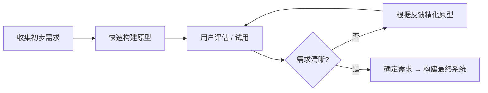
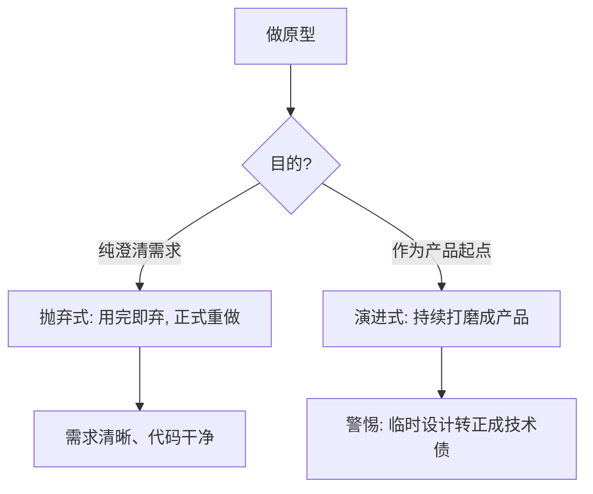
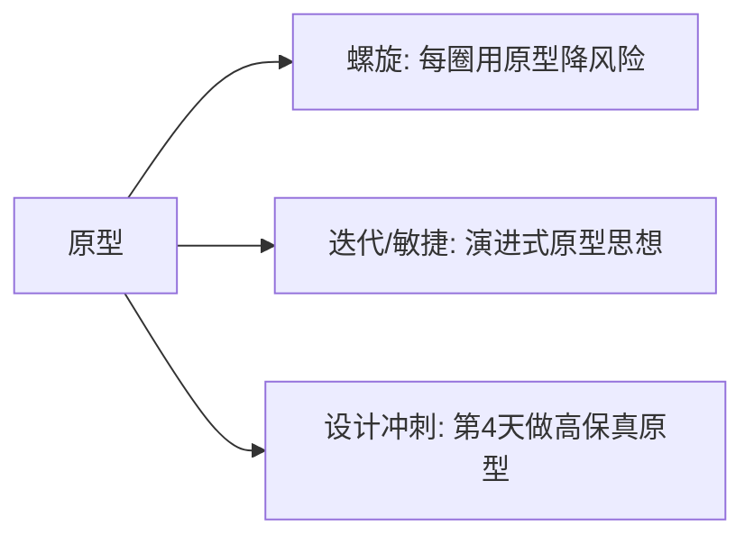

# 软件开发流程与模型(五)原型模型

> [!abstract] 速览
> **原型模型（Prototyping Model）** 直击软件开发的头号风险——**需求说不清**。它不在纸面上反复猜测需求，而是先快速做一个**可看可玩的原型**，让用户在真实交互中把模糊的、隐性的需求"逼"出来，再据此精化或重做。
> 它的底层逻辑是：**用户常常"看到了才知道自己要什么"**——访谈问不出来的需求，给个样品一点就出来了。
> 一句话：**与其纸上谈兵猜需求，不如先做个样品给用户拍板。** 原型很少单独构成完整过程，更多作为 [[08.螺旋模型|螺旋]]、[[07.迭代模型|迭代]]、[[13.Scrum框架|敏捷]]的需求澄清手段。本篇深入保真度层级、抛弃式/演进式两条路线、四大陷阱，以及与线框图/MVP/PoC 的边界。

## 1. 为什么需要原型：对抗需求不确定性

纯 [[03.瀑布模型|瀑布]]要求需求阶段就**冻结**需求，可现实是：

- 用户**说不清**自己要什么，只能"看到了再说";
- 很多需求是**隐性的**，要在交互中才浮现（如"这里要能批量导出""审批要能驳回到指定节点"）；
- 业务方与开发方对同一句话**理解不同**。

原型用一个**早期可见的产物**把这些不确定性显性化，把"做完才发现做错"的灾难，提前到"做之前就纠正"。

## 2. 原型法流程

核心是 **"构建—评估—精化"的快速循环**，直到需求收敛。

## 3. 保真度层级

原型不是越精越好，要按阶段选保真度：

| 保真度 | 形态 | 成本 | 适用阶段 | 工具 |
| --- | --- | --- | --- | --- |
| **低保真 Lo-Fi** | 纸面草图、线框图(Wireframe) | 极低 | 早期布局 / 流程讨论 | 纸笔、Balsamiq |
| **中保真 Mid-Fi** | 可点击的灰模 | 中 | 交互流验证 | Figma、墨刀 |
| **高保真 Hi-Fi** | 接近真实 UI、可演示 | 高 | 用户测试 / 向上汇报 | Figma、Axure、低代码 |

> [!tip]
> **越早越低保真**：早期方向未定，用低保真更省、更敢推翻；等方向稳了再做高保真。一上来就做精致高保真，改起来心疼，反而束缚探索。

## 4. 两种策略：抛弃式 vs 演进式

| 维度 | 抛弃式 Throwaway | 演进式 Evolutionary |
| --- | --- | --- |
| 原型命运 | 澄清需求后**丢弃**，正式重做 | 原型**逐步演化**为最终产品 |
| 代码质量 | 可粗糙（反正要扔） | 必须够好（要保留） |
| 风险 | 浪费一次开发 | 临时设计"转正"成**技术债** |
| 适合 | 需求探索、不确定性高 | 需求虽变但核心稳定 |

## 5. 原型的种类（按验证目标）

| 种类 | 验证什么 |
| --- | --- |
| **界面原型** | 布局、交互、用户体验 |
| **功能原型** | 关键业务流程是否走得通 |
| **数据原型** | 数据结构 / 报表是否满足 |
| **技术原型 (Spike)** | 某项技术 / 性能是否可行（见第 11 节） |

## 6. 原型在其他模型中的角色

- [[08.螺旋模型|螺旋]]：每一圈用原型来**降低当前最大风险**；
- [[07.迭代模型|迭代]] / [[13.Scrum框架|敏捷]]：演进式原型思想的延伸；
- [[43.设计冲刺DesignSprint|设计冲刺]]：专门用一天做高保真原型供用户测试。

## 7. 优点

| 优点 | 说明 |
| --- | --- |
| 早期澄清需求、大幅减少返工 | 把需求风险消灭在开发前 |
| 提升用户参与与满意度 | 用户"共创"，认同感强 |
| 直观、利于跨角色沟通 | 一图胜千言 |
| 降低技术 / 体验风险 | 技术原型可提前验证可行性 |

## 8. 缺点与四大陷阱

| 陷阱 | 表现 | 对策 |
| --- | --- | --- |
| **期望失控** | 用户看到原型以为"快做完了" | 提前说明"这是样品不是成品" |
| **范围蔓延** | 看到就想加功能 | 控制原型范围、记录需求待排期 |
| **技术债转正** | 演进式原型的临时设计被保留 | 转正前安排重构 |
| **过度打磨** | 在原型上雕花、浪费时间 | 够用即止，保真度匹配阶段 |

## 9. 适用与不适用

| ✅ 适合 | ❌ 不适合 |
| --- | --- |
| 需求模糊、交互密集（UI/表单/流程） | 需求已非常清晰 |
| 创新探索、用户体验关键 | 强合规、文档优先 |
| 技术可行性存疑（用技术原型） | 纯算法 / 后台批处理且需求明确 |

## 10. 真实案例：报销表单系统

某企业要做"在线报销"，需求方只会说"做个报销的"。团队不写长篇 SRS，而是：

1. 用 Figma 画**低保真**报销表单（字段、审批流）→ 给财务看；
2. 财务一看立刻提出："要多级审批""要能驳回到指定节点""金额超标要加签"——**这些访谈根本问不出来**；
3. 迭代到**中/高保真**可点原型，反复确认无误后，才正式开发。

> 原型把大量**隐性需求**在开发前逼了出来，省下的返工远超做原型的成本。

## 11. 真实案例：技术原型 Spike

团队要选实时通信方案（WebSocket vs SSE vs 轮询），谁也说不准性能。于是做一个**技术原型(Spike)**：用三种方案各搭最小 Demo，压测连接数与延迟，数据说话后选定 WebSocket。这正是 [[08.螺旋模型|螺旋]]"用原型降风险"的微观体现，也是 [[15.极限编程XP|XP]] 的 Spike 实践。

## 12. 原型 vs 线框图 vs MVP vs PoC（四者区分）

| 概念 | 本质 | 能否上线 | 目的 |
| --- | --- | --- | --- |
| **线框图 Wireframe** | 静态布局草图 | 否 | 定布局 |
| **原型 Prototype** | 可交互样品 | 通常否 | **澄清需求 / 验证交互** |
| **PoC 概念验证** | 技术可行性验证 | 否 | 验证"做不做得出" |
| **MVP 最小可行产品** | 能交付价值的最小产品 | **是** | 验证"市场要不要"（见 [[42.精益创业LeanStartup与MVP]]） |

## 13. 工具链

- 低保真：纸笔、Balsamiq、Excalidraw；
- 中 / 高保真：Figma、Axure、墨刀、即时设计；
- 可点 / 数据原型：低代码平台、前端脚手架。

## 14. 常见误区与面试要点

> [!warning] 易错点
> - **原型 = MVP？** 不同。原型多为**澄清需求的样品**（常不可上线）；MVP 是**能交付价值的最小可用产品**。
> - **原型 = PoC？** 不同。PoC 验证**技术可行性**，原型验证**需求 / 交互**。
> - **演进式原型一定更省？** 未必——临时设计转正会埋技术债。
> - **原型可代替需求文档？** 补充而非替代，关键需求仍需沉淀。
> - **高保真越早越好？** 不。早期低保真更省、更敢改。
> - **原型法能独立完成项目吗？** 通常不能，它是其他模型的需求澄清手段。

## 15. 对常见说法的修正

> [!note] 修正清单
> 1. **"原型法适合所有项目"**——夸大。它对需求模糊项目价值大，对需求清晰 / 强合规项目反增成本。
> 2. **"做了原型就不会返工"**——原型降低需求风险，但不消除技术与实现风险。
> 3. **"抛弃式原型是浪费"**——它用小成本买"需求确定性"，常比"做错重来"便宜得多。

## 16. 一句话记忆

> **原型模型** = "先做个样品给你看"——用可交互的早期产物把模糊、隐性需求逼出来；要先想清楚三件事：**做多真(保真度)、用完扔还是留(抛弃/演进)、验证的是需求还是技术(原型/PoC)**。

## 延伸阅读

- 风险驱动用原型：[[08.螺旋模型]]
- 演化方向：[[07.迭代模型]] · [[06.增量模型]]
- 产品近亲：[[42.精益创业LeanStartup与MVP]] · [[43.设计冲刺DesignSprint]]
- 工程实践 Spike：[[15.极限编程XP]]
- 横向速查：[[46.模型对比速查大表]]

## 参考文献

1. Sommerville, I. *Software Engineering*（第 10 版）。
2. Boehm, B. *A Spiral Model of Software Development and Enhancement*.
3. Nielsen, J. *Usability Engineering*（原型与可用性）。

---

> ⬅️ [[04.V模型]] ｜ 🏠 [[00.软件开发流程与模型总览]] ｜ [[06.增量模型]] ➡️
