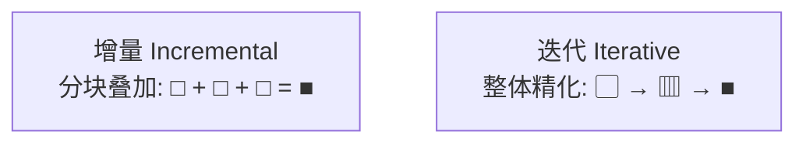

# 软件开发流程与模型(六)增量模型

> [!abstract] 速览
> **增量模型（Incremental Model）** 把系统**切成多个增量(Increment)**，每个增量像一个小 [[03.瀑布模型|瀑布]]（需求→设计→实现→测试→交付），**逐个累加、分批上线**。核心功能先做先交付，后续功能一块块叠上去，最终拼成完整系统。
> 它解决瀑布"末期一次性交付、上线太晚"的痛点——**先让用户用上核心，而不是等全做完**。
> 一句话：**化整为零、分批交付。** 但要分清它与 [[07.迭代模型|迭代]]的本质区别（分块叠加 vs 整体精化，见第 4 节），并理解它对架构前瞻性的高要求。

## 1. 增量模型是什么

不再"一次交付全部"，而是把需求**按优先级分块**，每块独立走完一轮开发并交付一个**可用增量**；增量叠加，逐步逼近完整系统。

```mermaid
graph LR
    subgraph 增量1·核心
    R1[需求]-->D1[设计]-->I1[实现]-->T1[测试]-->E1[交付核心]
    end
    subgraph 增量2
    R2[需求]-->D2[设计]-->I2[实现]-->T2[测试]-->E2[+功能集2]
    end
    subgraph 增量3
    R3[需求]-->D3[设计]-->I3[实现]-->T3[测试]-->E3[完整系统]
    end
    E1-->R2-->E2-->R3
```

## 2. 增量划分策略

增量怎么切，直接决定成败。常用优先级方法 **MoSCoW**：

| 级别 | 含义 | 放哪个增量 |
| --- | --- | --- |
| **Must have** | 必须有，否则不可用 | 增量 1（核心） |
| **Should have** | 重要但非致命 | 增量 2 |
| **Could have** | 锦上添花 | 增量 3 |
| **Won't have (this time)** | 本期不做 | 暂不排 |

其他切法：

- **按业务价值**：高 ROI 先做；
- **按风险**：高风险先做先验证（与 [[08.螺旋模型|螺旋]]思想相通）；
- **按依赖**：被依赖的基础模块先做。

## 3. 增量的两种风格

| 风格 | 做法 | 特点 |
| --- | --- | --- |
| **渐进交付** | 一个接一个增量，串行 | 简单、可控 |
| **并行增量** | 多个增量并行开发 | 快但需更强协调与架构 |

## 4. 增量 vs 迭代（经典考点）

> [!note] 蒙娜丽莎类比
> - **增量(Incremental)**：先画好头部，再画身体，再画背景——**每次完成一块、拼起来**（building）。
> - **迭代(Iterative，见 [[07.迭代模型]])**：先用草图勾出整幅画，再一遍遍加细节——**每轮精化整体**（refining）。



## 5. 增量 vs 迭代 vs 敏捷

| 概念 | 本质 | 关系 |
| --- | --- | --- |
| 增量 | **分块叠加**交付 | 交付方式 |
| 迭代 | **整体精化**轮次 | 推进方式 |
| 敏捷 | 价值观 + 框架 | **同时用增量 + 迭代** |

> 现实中三者**融合**：[[13.Scrum框架|Scrum]] 的每个冲刺既是一次"迭代"，又交付一个"增量"。

## 6. 优点

| 优点 | 说明 |
| --- | --- |
| 核心功能**早上线、早获益** | 抢占市场 / 早回款 |
| 风险分散到各增量 | 不再"一次性豪赌" |
| 用户早反馈、可调整后续增量 | 后续增量更贴近真实需求 |
| 资金 / 资源可**分期投入** | 现金流友好 |

## 7. 缺点

| 缺点 | 说明 |
| --- | --- |
| 需**良好的整体架构**支撑叠加 | 否则增量 3 推翻增量 1 |
| 增量划分不当会导致返工 | 切分需清晰优先级共识 |
| 集成复杂度随增量增加 | 需自动化集成测试兜底 |

## 8. 对架构的要求：演进式架构

增量叠加要求**架构有前瞻性**——核心增量就要预留扩展点，遵循开闭、模块化、接口隔离等原则；否则每加一个增量都要大改底座。这与"演进式架构(Evolutionary Architecture)"理念一致：架构本身也随增量演化，但要可控。

## 9. 适用与不适用

| ✅ 适合 | ❌ 不适合 |
| --- | --- |
| 核心功能明确、可分批上线 | 功能高度耦合、无法切分 |
| 需尽快上线核心抢市场 | 必须一次性整体交付（如某些合规） |
| 预算 / 资源分期到位 | 架构无法前瞻、底座不稳 |

## 10. 真实案例：电商系统分增量上线

| 增量 | 内容 | 价值 |
| --- | --- | --- |
| **增量 1（核心）** | 商品浏览 + 购物车 + 下单支付 | 最小可售卖闭环，先开张回款 |
| **增量 2** | 优惠券 + 评价 + 物流跟踪 | 提升转化与体验 |
| **增量 3** | 个性化推荐 + 会员体系 | 提升留存与客单价 |

> 增量 1 上线即可开始卖货赚钱，无需等推荐系统这种"锦上添花"做完。

## 11. 落地：与 CI/CD、特性开关配合

增量上线常配合**特性开关(Feature Flag)**：代码先合并进主干，功能按增量"开灯"：

```yaml
# 特性开关配置：按增量逐步放开
features:
  cart_checkout: true        # 增量1：已上线
  coupon: true               # 增量2：已上线
  recommendation: false      # 增量3：开发中，对用户隐藏
```

这样**部署与发布解耦**：未完成的增量代码可以安全地待在生产环境里"关着灯"。详见 [[27.发布与部署策略]] 与 [[21.持续集成与持续交付CICD]]。

## 12. 增量规模与节奏

- 增量不宜过大（退化成小瀑布）也不宜过碎（集成成本高）；
- 每个增量都应**可交付、可演示、可获益**；
- 配合自动化测试与 CI，让"频繁叠加"不引入回归。

## 13. 工具链

需求优先级：Jira / Azure Boards（MoSCoW 标签）；交付：[[21.持续集成与持续交付CICD|CI/CD]]、特性开关平台（LaunchDarkly、Unleash）；架构守护：架构适应度函数 / 依赖检查。

## 14. 常见误区与面试要点

> [!warning] 易错点
> - **增量 = 迭代？** 不。增量是**分块叠加**，迭代是**整体精化**（见第 4 节）。
> - **增量模型无需前期架构？** 恰恰相反——**架构要有前瞻性**。
> - **每个增量都要上线吗？** 不一定，但"可交付可用"是目标。
> - **增量 = 敏捷？** 增量是交付方式；敏捷通常采用增量交付，但二者不等价。
> - **MoSCoW 的 W 是什么？** Won't have（本期不做），常被忽略却很重要——明确"不做什么"。

## 15. 对常见说法的修正

> [!note] 修正清单
> 1. **"增量就是敏捷"**——敏捷通常采用增量交付，但增量模型本身可以是计划驱动的（增量内部走小瀑布）。增量是"交付方式"，敏捷是"价值观+框架"。
> 2. **"增量越多越好"**——切得过碎会让集成与协调成本飙升，要平衡。

## 16. 一句话记忆

> **增量模型** = 把大系统拆成几块，**核心先做先上线，其余一块块叠加**——切分用 MoSCoW、落地配特性开关、底座要前瞻；化整为零、分批见效。

## 延伸阅读

- 对照概念：[[07.迭代模型]]（整体精化）
- 落地配合：[[21.持续集成与持续交付CICD]] · [[27.发布与部署策略]]
- 敏捷交付：[[13.Scrum框架]]
- 风险切分：[[08.螺旋模型]]
- 横向速查：[[46.模型对比速查大表]]

## 参考文献

1. Sommerville, I. *Software Engineering*.
2. Pressman, R. *Software Engineering: A Practitioner's Approach*.
3. DSDM Consortium. *MoSCoW Prioritisation*.
4. Ford, N. 等. *Building Evolutionary Architectures*.

---

> ⬅️ [[05.原型模型]] ｜ 🏠 [[00.软件开发流程与模型总览]] ｜ [[07.迭代模型]] ➡️
