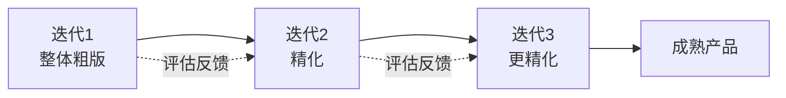
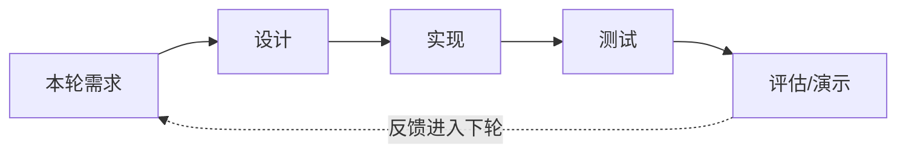
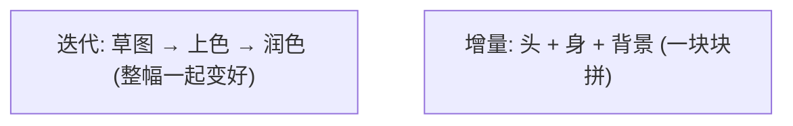
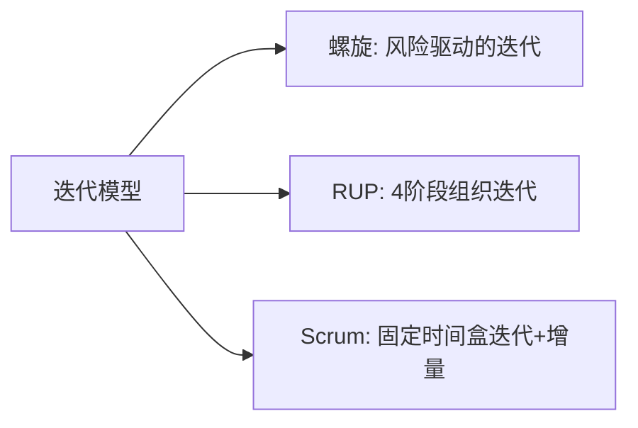

# 软件开发流程与模型(七)迭代模型

> [!abstract] 速览
> **迭代模型（Iterative Model）** 不追求"一次做对"，而是先做出一个**覆盖全局的粗糙版本**，再通过**多轮迭代逐步精化**——每轮都走一遍完整的需求→设计→实现→测试，产出一个更成熟的完整产品。
> 它的世界观是：**承认人无法一次想清，所以用反馈逐步逼近正确解。**
> 一句话：**先画整幅草图，再一遍遍加细节、上色、润色**——与 [[06.增量模型|增量]]"分块叠加"相对，迭代是"**整体精化**"。它是 [[10.统一过程RUP|RUP]] 与 [[13.Scrum框架|敏捷]]的思想内核。本篇讲透其内部循环、与增量的区别、迭代长度、反模式与真实案例。

## 1. 迭代模型是什么

把开发组织成若干**迭代(Iteration)**，**每轮都走一遍完整的 SDLC**，产出一个可评估版本；根据评估反馈，下一轮把它做得更好。

## 2. 一次迭代的内部（mini-SDLC）

每轮迭代都是一个**压缩的 [[02.软件开发生命周期SDLC|SDLC]]**——这正是 [[13.Scrum框架|Scrum]] 冲刺的雏形。

## 3. 核心理念：拥抱不完美、逐步逼近

迭代承认"第一版必然不完美"，把开发看作**逼近过程**：每轮用真实反馈纠偏，逐步收敛到正确解。这与 [[03.瀑布模型|瀑布]]"一次到位"的假设根本不同。

## 4. 迭代 vs 增量（经典考点）

| 维度 | 迭代 Iterative | 增量 Incremental |
| --- | --- | --- |
| 本质 | **整体精化**（refining） | **分块叠加**（building） |
| 每轮产出 | 全局更成熟的版本 | 新增一块完整功能 |
| 蒙娜丽莎 | 草图→反复加细节 | 先画头→再画身→再画背景 |
| 风险 | 早期版本"像但不好用" | 架构需前瞻 |

> 二者**不互斥**：敏捷既迭代又增量——每个迭代交付一个增量。

## 5. 迭代 vs 增量 vs 敏捷

| 概念 | 本质 | 关系 |
| --- | --- | --- |
| 迭代 | 整体精化轮次 | 推进方式 |
| 增量 | 分块叠加交付 | 交付方式 |
| 敏捷 | 价值观 + 框架 | 同时采用迭代 + 增量 |

## 6. 迭代长度与节奏

| 要点 | 说明 |
| --- | --- |
| **固定且较短** | 1~4 周，形成稳定节奏 |
| **每轮有可评估产物** | 否则无法获取反馈 |
| **每轮有反馈环节** | 演示 / 评审，驱动下轮 |

## 7. 优点

| 优点 | 说明 |
| --- | --- |
| 早出可见版本、早反馈 | 尽早暴露理解偏差 |
| 风险逐轮暴露、逐轮消化 | 不积压到末期 |
| 拥抱变化，需求可演进 | 适应不确定性 |
| 质量随轮次提升 | 持续打磨 |

## 8. 缺点

| 缺点 | 说明 |
| --- | --- |
| 需良好的迭代规划与管理 | 否则易失控 |
| 方向错时反复返工 | 需有效反馈纠偏 |
| 早期版本可能"看着像但不好用" | 需管理干系人预期 |

## 9. 适用与不适用

| ✅ 适合 | ❌ 不适合 |
| --- | --- |
| 需求会演进、需边做边学 | 需求极稳定且一次成型更省 |
| 大型系统逐步逼近正确解 | 强合规、需一次性完整交付 |
| 创新 / 体验密集型 | 反馈渠道缺失的环境 |

## 10. 与其他模型的关系

- [[08.螺旋模型|螺旋]]：每圈含风险分析的迭代；
- [[10.统一过程RUP|RUP]]：把迭代组织进初始/细化/构造/移交四阶段；
- [[13.Scrum框架|Scrum]]：把迭代固定为时间盒冲刺并加增量交付。

## 11. 真实案例：搜索功能逐轮精化

| 迭代 | 搜索能力 | 说明 |
| --- | --- | --- |
| **迭代 1** | 关键词精确匹配 | 能用，但"苹果手机"搜不到"iPhone" |
| **迭代 2** | + 分词 + 模糊匹配 | 召回提升 |
| **迭代 3** | + 排序 + 个性化 | 体验成熟 |

> 每轮交付的都是**完整可用的搜索**，只是一轮比一轮好——这就是"精化"。

## 12. 真实案例：机器学习模型迭代

ML 开发天然迭代：

| 迭代 | 做法 | 评估指标 |
| --- | --- | --- |
| 迭代 1 | 基线模型(简单算法) | 准确率 72% |
| 迭代 2 | 特征工程 + 数据清洗 | 准确率 81% |
| 迭代 3 | 调参 + 模型集成 | 准确率 88% |

> 每轮用指标驱动下一轮——"整体精化"在数据科学里体现得淋漓尽致。

## 13. 迭代的反模式

| 反模式 | 表现 | 危害 |
| --- | --- | --- |
| **迭代变小瀑布** | 每轮不交付可评估成果 | 退化成"延期的瀑布" |
| **无评估空转** | 迭代了但不收集反馈 | 失去迭代的意义 |
| **目标漂移** | 每轮目标不清 | 越迭代越乱 |

## 14. 工具链

迭代 / 冲刺管理：Jira、Azure Boards；演示与反馈：评审会 + 可运行环境；配合 [[21.持续集成与持续交付CICD|CI/CD]] 让每轮都能快速出可用版本。

## 15. 常见误区与面试要点

> [!warning] 易错点
> - **迭代 = 增量？** 不。迭代是**整体精化**，增量是**分块叠加**（见第 4 节）。
> - **迭代 = 重复返工？** 不。是**有计划的逐轮逼近**，不是无序重做。
> - **迭代越多越好？** 不。每轮要有明确目标与可评估产出，否则是空转。
> - **迭代 = 敏捷？** 迭代是推进方式，比敏捷出现更早（RUP 即迭代）。
> - **早期版本不好用是失败吗？** 不。早期粗糙是迭代的正常起点，关键是逐轮变好。

## 16. 对常见说法的修正

> [!note] 修正清单
> 1. **"迭代开发就是敏捷"**——迭代是推进方式，敏捷在其上加了价值观、增量交付与持续协作。
> 2. **"迭代一定比瀑布慢/浪费"**——对不确定需求，迭代靠早反馈反而省下大量末期返工。

## 17. 一句话记忆

> **迭代模型** = 先出"全貌粗版"，再一轮轮**整体精化**到成熟——草图→上色→润色，每轮都是完整作品、只是越来越好；切忌"迭代变小瀑布"（不交付、不反馈）。

## 延伸阅读

- 对照概念：[[06.增量模型]]（分块叠加）
- 风险驱动迭代：[[08.螺旋模型]]
- 工程化迭代：[[10.统一过程RUP]] · [[13.Scrum框架]]
- 横向速查：[[46.模型对比速查大表]]

## 参考文献

1. Larman, C. & Basili, V. (2003). *Iterative and Incremental Development: A Brief History*. IEEE Computer.
2. Sommerville, I. *Software Engineering*.

---

> ⬅️ [[06.增量模型]] ｜ 🏠 [[00.软件开发流程与模型总览]] ｜ [[08.螺旋模型]] ➡️
