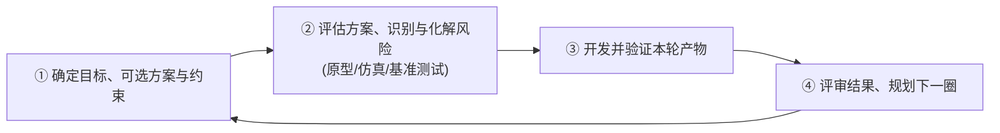
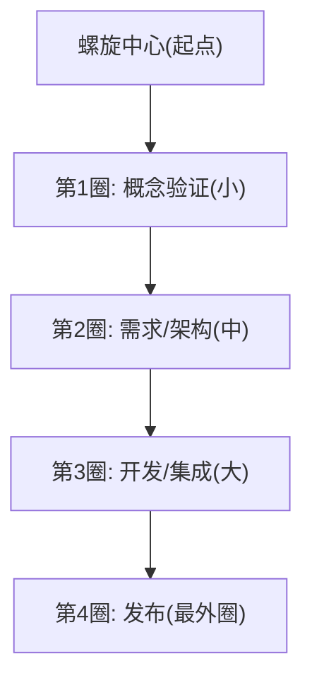

# 软件开发流程与模型(八)螺旋模型

> [!abstract] 速览
> **螺旋模型（Spiral Model）** 由 Barry Boehm 于 **1988 年**提出，核心是 **风险驱动（Risk-driven）**：把开发组织成一圈圈向外扩张的螺旋，**每绕一圈都先做风险分析与原型，再开发验证**——风险越大的部分越早暴露、越早化解，风险扛不住就**及时止损**。
> 它是 [[05.原型模型|原型]]、[[07.迭代模型|迭代]]与**风险管理**的集大成者，专为**大型、高风险**项目而生。
> 一句话：**螺旋 = 迭代 + 原型 + 风险分析**——每圈先问"最大的风险是什么、怎么用最小代价消除它"。本篇深入四象限、风险管理方法、WinWin 与 ICSM 变体，以及真实案例。

## 1. 螺旋模型是什么

Boehm 观察到：项目失败往往源于**风险失控**（需求不清、技术不成熟、进度乐观）。螺旋模型让每一轮迭代都**以"识别并降低最大风险"为首要目标**——这是它区别于普通 [[07.迭代模型|迭代]]的关键。

## 2. 四象限：每一圈的四个步骤

## 3. 螺旋的几何直觉

> 螺旋的**半径**代表累计成本，**角度**代表进度——越往外圈，投入越大、产品越完整。每圈成本递增，所以**越早的圈越要把不确定性消除掉**（此时改动便宜）。

## 4. 四象限详解

| 象限 | 做什么 | 关键产出 |
| --- | --- | --- |
| ① 目标设定 | 明确本轮目标、备选方案、约束 | 目标与方案清单 |
| ② 风险评估 | 识别风险，用**原型 / 实验**降低不确定性 | 风险清单 + 原型 |
| ③ 开发验证 | 实现并测试本轮内容 | 可验证的产物 |
| ④ 评审规划 | 评估是否继续、规划下一圈 | 下一圈计划 / 止损决策 |

## 5. 风险管理：螺旋的灵魂

每圈②的**风险管理**是核心，标准流程：

| 步骤 | 说明 |
| --- | --- |
| 风险识别 | 列出可能的风险（需求/技术/进度/人员/外部） |
| 风险分析 | 评估**概率 × 影响** = 风险暴露度 |
| 风险排序 | 优先处理高暴露度风险 |
| 风险应对 | 缓解 / 转移 / 接受 / 规避 |

**风险登记册(Risk Register)示例：**

| 风险 | 概率 | 影响 | 暴露度 | 应对 |
| --- | --- | --- | --- | --- |
| 中间件性能不达标 | 中 | 高 | 高 | 做性能原型压测 |
| 关键人员流失 | 低 | 高 | 中 | 知识共享、结对 |
| 第三方接口不稳定 | 高 | 中 | 高 | 加适配层 + 降级 |

## 6. 风险应对的四种策略

| 策略 | 含义 | 例 |
| --- | --- | --- |
| 缓解 Mitigate | 降低概率 / 影响 | 做原型验证技术 |
| 转移 Transfer | 转给第三方 | 买保险 / 外包 |
| 接受 Accept | 风险小，留预案 | 准备回滚 |
| 规避 Avoid | 改方案绕开 | 换成熟技术 |

## 7. 优点与缺点

| 优点 | 缺点 |
| --- | --- |
| **风险控制能力极强** | 成本高、流程复杂 |
| 适合大型、高风险项目 | 依赖**风险分析专家**，门槛高 |
| 原型化降低不确定性 | 螺旋圈数难以事先确定 |
| 可及时止损 | 对小项目是"杀鸡用牛刀" |

## 8. 适用与不适用

| ✅ 适合 | ❌ 不适合 |
| --- | --- |
| 大型、高成本、高风险系统 | 小型、低风险项目 |
| 技术不成熟、需求不确定 | 需求清晰、风险可控 |
| 国防 / 航天 / 银行核心 / 大平台 | 快速试错的轻量产品 |

## 9. 变体一：WinWin 螺旋

原版螺旋没说"谁来定目标"。Boehm 后来提出 **WinWin 螺旋**，在每圈开头加入**干系人协商**环节——让各方就目标达成"双赢(Win-Win)"，再进入风险分析。它弥补了"目标从何而来"的空白。

## 10. 变体二：ICSM（增量承诺螺旋模型）

Boehm 又提出 **ICSM（Incremental Commitment Spiral Model）**：在每个关键里程碑做**"承诺评审"**——基于已消解的风险，决定是否**增量地承诺**下一阶段资源（继续 / 调整 / 停止）。强调"**基于证据的决策**"。

## 11. 真实案例：大型政务平台螺旋推进

某大型政务平台技术选型不确定（自研 vs 商用中间件）：

1. **第 1 圈**：目标=验证技术可行性；风险=中间件性能未知 → 做**性能基准原型**；结果=确定选型。
2. **第 2 圈**：目标=核心业务闭环；风险=业务规则复杂 → 做**业务原型**给客户确认；结果=锁定核心需求。
3. **第 3 圈**：目标=全功能 + 上线；风险=并发与安全 → 压测 + 安全评估；结果=交付。

> 每圈都"花小钱买确定性"，避免一次性投入巨资却撞上大坑。

## 12. 螺旋 vs 迭代 vs 瀑布

| 维度 | 螺旋 | [[07.迭代模型\|迭代]] | [[03.瀑布模型\|瀑布]] |
| --- | --- | --- | --- |
| 驱动力 | **风险** | 反馈精化 | 阶段顺序 |
| 原型 | 核心手段 | 可选 | 无 |
| 适合规模 | 大型高风险 | 中大型 | 需求稳定 |
| 止损能力 | **强** | 中 | 弱 |

## 13. 工具链

风险登记册(Risk Register)、原型工具、决策评审会、[[42.精益创业LeanStartup与MVP|MVP/实验]]思路。

## 14. 常见误区与面试要点

> [!warning] 易错点
> - **螺旋 = 迭代？** 螺旋是**带风险分析的迭代**——风险驱动是其区别于普通迭代的关键。
> - **螺旋适合所有项目？** 不。它重、贵，**只适合大型高风险**项目。
> - **螺旋有固定圈数吗？** 没有，由风险消解情况决定。
> - **螺旋 vs 原型？** 原型是螺旋每圈降风险的**手段**之一。
> - **风险暴露度怎么算？** 概率 × 影响。
> - **WinWin 螺旋补了什么？** 加入干系人协商，解决"目标由谁定"。

## 15. 对常见说法的修正

> [!note] 修正清单
> 1. **"螺旋固定四圈"**——教材常这样画，但**圈数随风险动态决定**。
> 2. **"螺旋只是更复杂的迭代"**——核心差异在**风险驱动 + 可止损**，不是单纯多了几圈。
> 3. **"螺旋过时了"**——其风险驱动思想活在现代的 MVP、实验文化与 [[42.精益创业LeanStartup与MVP|精益创业]]中。

## 16. 一句话记忆

> **螺旋模型** = 迭代 + 原型 + **风险分析**：每绕一圈先问"最大的风险是什么、怎么用最小代价消除它"，风险扛不住就果断止损——大型高风险项目的"排雷式"开发。

## 延伸阅读

- 组成手段：[[05.原型模型]] · [[07.迭代模型]]
- 工程化迭代：[[10.统一过程RUP]]
- 风险与实验思维：[[42.精益创业LeanStartup与MVP]]
- 横向速查：[[46.模型对比速查大表]]

## 参考文献

1. Boehm, B. (1988). *A Spiral Model of Software Development and Enhancement*. IEEE Computer.
2. Boehm, B. et al. (1998). *Using the WinWin Spiral Model*.
3. Boehm, B. et al. *The Incremental Commitment Spiral Model (ICSM)*.
4. Sommerville, I. *Software Engineering*.

---

> ⬅️ [[07.迭代模型]] ｜ 🏠 [[00.软件开发流程与模型总览]] ｜ [[09.快速应用开发RAD]] ➡️
