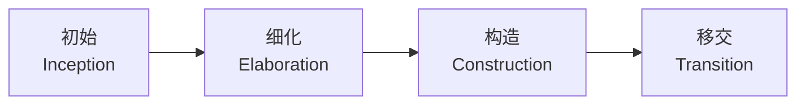
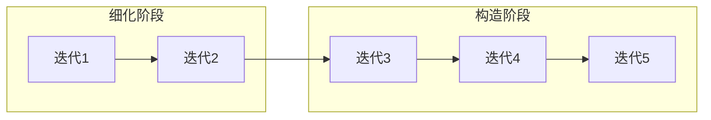

# 软件开发流程与模型(十)统一过程RUP

> [!abstract] 速览
> **统一过程（RUP, Rational Unified Process）** 由 Rational 公司（UML 三巨头 Booch、Jacobson、Rumbaugh）在 1990 年代末提出，是一套**迭代增量**的重量级、可裁剪过程框架。三大特征：**用例驱动、以架构为中心、迭代增量**。
> 它把 [[07.迭代模型|迭代]]工程化，用"**4 阶段 × 9 学科**"的二维结构组织开发，用 UML 可视化建模、用里程碑控风险。
> 一句话：**RUP = 有纪律的迭代**——大型企业级项目的经典，也是敏捷之外"重架构、重里程碑"的迭代代表。本篇深入二维结构、四阶段里程碑、九学科驼峰图、六实践，以及它的敏捷化变体。

## 1. RUP 是什么

RUP 既是过程，也是**可裁剪的过程框架**：提供阶段、学科、角色、制品、模板的完整体系，团队按项目规模**取舍裁剪**。它不是"一套必须照搬的流程"，而是"一个可定制的菜单"。

## 2. 二维结构：阶段 × 学科

RUP 的经典"驼峰图"是二维的：

- **横轴（时间）**：4 个阶段（上图）；
- **纵轴（内容）**：9 个学科（工作流，见第 4 节）。

每个学科在不同阶段的**工作量不同**，叠起来形成"驼峰"曲线。

## 3. 四个阶段与里程碑

| 阶段 | 目标 | 里程碑 |
| --- | --- | --- |
| **初始 Inception** | 确定范围、业务案例、可行性 | **LCO** 生命周期目标 |
| **细化 Elaboration** | 确定架构、消解主要风险 | **LCA** 生命周期架构 |
| **构造 Construction** | 实现大部分功能 | **IOC** 初始运行能力(Beta) |
| **移交 Transition** | 部署、调优、交付用户 | **PR** 产品发布 |

> 每个阶段可含**多次迭代**，每次迭代交付可评估增量——这是 RUP "迭代增量"的体现。

## 4. 九个学科

| 类别 | 学科 |
| --- | --- |
| **工程学科(6)** | 业务建模、需求、分析与设计、实现、测试、部署 |
| **支持学科(3)** | 配置与变更管理、项目管理、环境 |

## 5. 驼峰图：学科在各阶段的强度

各学科工作量随阶段变化（● 强 / ◐ 中 / ○ 弱）：

| 学科 \ 阶段 | 初始 | 细化 | 构造 | 移交 |
| --- | --- | --- | --- | --- |
| 业务建模 | ● | ◐ | ○ | ○ |
| 需求 | ◐ | ● | ○ | ○ |
| 分析与设计 | ○ | ● | ◐ | ○ |
| 实现 | ○ | ◐ | ● | ◐ |
| 测试 | ○ | ◐ | ● | ◐ |
| 部署 | ○ | ○ | ◐ | ● |

> 可见：需求 / 设计在**细化期**最强，实现 / 测试在**构造期**最强，部署在**移交期**最强——而每个学科都**贯穿始终**（只是强弱不同），这正是迭代的特征。

## 6. 六大最佳实践

| 实践 | 含义 |
| --- | --- |
| 迭代式开发 | 分轮逼近，逐轮降风险 |
| 管理需求 | 用例 + 需求追溯 |
| 基于构件的架构 | 可复用、可演进 |
| 可视化建模 | 用 **UML** 表达设计 |
| 持续验证质量 | 全程测试 |
| 控制变更 | 配置与变更管理（见 [[41.配置管理与变更管理]]） |

## 7. 三大特征

- **用例驱动 Use-Case Driven**：需求、设计、测试都围绕用例展开；
- **以架构为中心 Architecture-Centric**：细化期就锁定可执行架构基线；
- **迭代增量 Iterative & Incremental**：每轮交付增量。

## 8. 迭代如何组织

> 每个阶段含多次迭代，迭代数量按规模与风险定——大项目细化/构造期迭代更多。

## 9. 优点

| 优点 | 说明 |
| --- | --- |
| 迭代 + 风险控制 + 可裁剪 | 兼顾灵活与纪律 |
| 架构先行，利于大型系统 | 细化期锁架构基线 |
| UML 可视化、沟通清晰 | 跨团队对齐 |
| 里程碑明确，便于治理 | 适合企业级管控 |

## 10. 缺点

| 缺点 | 说明 |
| --- | --- |
| **重量级** | 文档、角色、制品多 |
| 学习与落地成本高 | 全套难掌握 |
| 小项目用不起 | 杀鸡用牛刀 |
| 易被"教条裁剪"成四不像 | 裁剪需经验 |

## 11. 适用场景

大型、长周期、企业级、多团队、需架构前瞻的项目。

## 12. 轻量化变体

RUP 太重，催生了轻量版：

| 变体 | 特点 |
| --- | --- |
| **AUP（Agile Unified Process）** | 精简学科、拥抱敏捷实践 |
| **OpenUP** | 开源的最小化 UP，迭代短、文档少 |
| **Disciplined Agile (DA)** | Jacobson 等推动的更敏捷演化，"过程工具箱" |

## 13. RUP vs 瀑布 vs 敏捷

| 维度 | RUP | [[03.瀑布模型\|瀑布]] | [[13.Scrum框架\|敏捷]] |
| --- | --- | --- | --- |
| 推进 | 迭代增量 | 线性 | 迭代增量 |
| 架构 | **强(中心)** | 前期一次 | 演进 |
| 文档 | 重(可裁剪) | 重 | 轻 |
| 规模 | 大型 | 中大型 | 中小为主 |

## 14. 真实案例：企业核心系统用 RUP

某银行新建信贷系统：

- **初始**：定范围与业务案例 → LCO；
- **细化**：用 UML 建模、搭可执行架构骨架、压掉技术风险 → LCA；
- **构造**：多迭代实现各业务模块、持续集成测试 → IOC(Beta)；
- **移交**：试运行、培训、上线 → PR。

> 架构在细化期就定型，避免大型系统后期"地基塌方"。

## 15. 工具链

UML 建模（Enterprise Architect、Rational Software Architect）、需求管理（DOORS）、[[41.配置管理与变更管理|配置管理]]。

## 16. 常见误区与面试要点

> [!warning] 易错点
> - **RUP = 瀑布？** 不。RUP 是**迭代增量**框架，与线性瀑布相反。
> - **四阶段 = 瀑布四步？** 不。阶段是**时间维度**，每阶段含多次迭代、跨多个学科。
> - **RUP 必须全套用？** 不。RUP 是**可裁剪框架**，按规模取舍。
> - **RUP 与敏捷互斥？** 不。OpenUP / DA 就是其敏捷化。
> - **LCA 里程碑意味着什么？** 生命周期架构确定（细化期出口），是 RUP 的关键关卡。

## 17. 对常见说法的修正

> [!note] 修正清单
> 1. **"RUP = 重量级过时方法"**——其**架构中心 + 迭代 + 里程碑**思想至今影响企业级开发；问题在全套落地太重，故多用裁剪 / 敏捷化变体。
> 2. **"RUP 和敏捷对立"**——二者都迭代增量，DA / OpenUP 正是 RUP 的敏捷演化。

## 18. 一句话记忆

> **RUP** = 有纪律的迭代：用"**4 阶段(初始/细化/构造/移交) × 9 学科**"的二维框架组织迭代，用例驱动、架构先行、里程碑控风险——大型企业项目的重量级经典，可裁剪、可敏捷化。

## 延伸阅读

- 思想基础：[[07.迭代模型]] · [[06.增量模型]]
- 敏捷对照：[[13.Scrum框架]] · [[12.敏捷宣言与原则]]
- 选型决策：[[11.过程模型选型与Cynefin决策]]
- 配置管理：[[41.配置管理与变更管理]]
- 横向速查：[[46.模型对比速查大表]]

## 参考文献

1. Kruchten, P. *The Rational Unified Process: An Introduction*.
2. Jacobson, I., Booch, G., Rumbaugh, J. *The Unified Software Development Process*.
3. Ambler, S. *Disciplined Agile Delivery*.

---

> ⬅️ [[09.快速应用开发RAD]] ｜ 🏠 [[00.软件开发流程与模型总览]] ｜ [[11.过程模型选型与Cynefin决策]] ➡️
