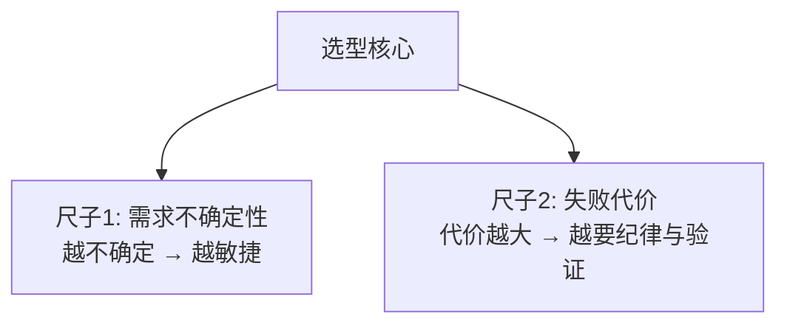
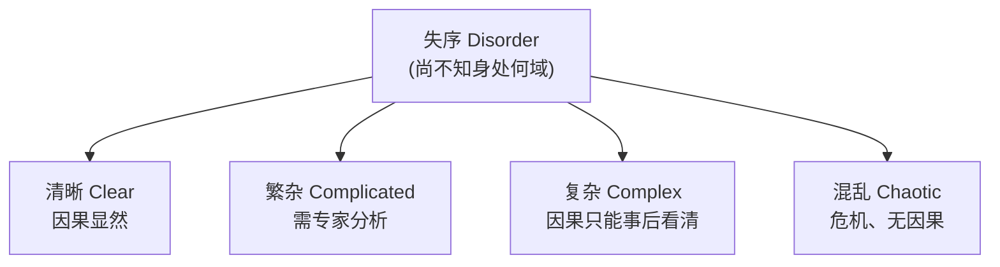
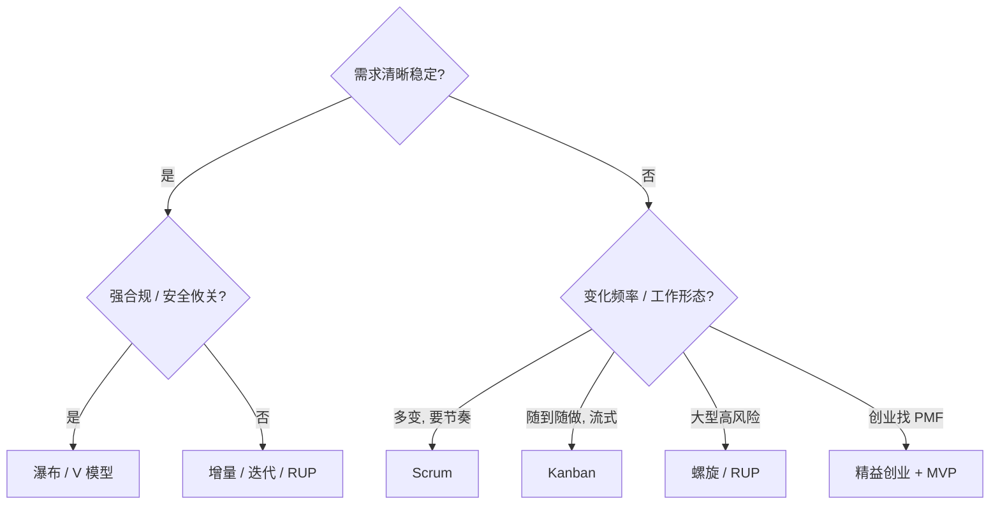

# 软件开发流程与模型(十一)过程模型选型与Cynefin决策

> [!abstract] 速览
> 学完经典模型，真正的问题是：**这个项目到底该用哪个？** 本篇给出选型的系统思维——核心是两把尺子：**需求的不确定性** 与 **失败的代价**；再借 **Cynefin 复杂度框架** 与 **Boehm-Turner 五因素** 把直觉变成可解释的决策。
> 一句话：**没有最好的模型，只有最匹配"不确定性 × 失败代价"的模型**；现实最常见的答案往往是 [[19.混合模型与Water-Scrum-fall|混合]]，而且会随项目阶段**动态演进**。本篇含决策树、五因素雷达、场景速查与三个真实选型案例。

## 1. 没有银弹

Fred Brooks《没有银弹》早就断言：没有任何单一方法能让生产力数量级提升。模型是工具，**匹配场景才有价值**。盲目跟风（"别人都敏捷我也敏捷"）是选型头号大忌。

## 2. 选型的两把尺子

- **需求越稳定** → 越偏 [[03.瀑布模型|计划驱动]]；**越易变** → 越偏 [[13.Scrum框架|敏捷]]。
- **失败代价越高**（人命 / 巨额 / 不可回滚）→ 越要 [[04.V模型|V 模型]]/纪律/可追溯；**越可承受** → 越可快速试错。

## 3. 选型的关键因素

| 因素 | 偏计划驱动 | 偏敏捷 |
| --- | --- | --- |
| **需求稳定性** | 稳定、清晰 | 模糊、易变 |
| **项目规模** | 大 | 中小 |
| **失败代价 / 关键性** | 高（人命 / 巨额） | 可承受、可回滚 |
| **合规要求** | 强（审计 / 认证） | 弱 |
| **客户参与度** | 低 / 阶段性 | 高 / 持续 |
| **团队成熟度** | 一般亦可 | 需自组织、高素养 |
| **技术成熟度** | 成熟 | 新颖 / 探索 |

## 4. Cynefin 框架：按"可预测性"分域

> 中心的"**失序 Disorder**"指"你还没搞清问题属于哪个域"——这本身是最危险的状态，第一步是先把问题归域。

## 5. 用 Cynefin 选过程

| 域 | 决策方式 | 推荐过程 |
| --- | --- | --- |
| **清晰 Clear** | 感知-归类-响应 | 标准流程 / [[14.看板方法Kanban\|看板]] |
| **繁杂 Complicated** | 感知-分析-响应 | [[03.瀑布模型\|瀑布]] / [[04.V模型\|V]] / [[10.统一过程RUP\|RUP]] |
| **复杂 Complex** | **探针-感知-响应** | **[[13.Scrum框架\|Scrum]] / 敏捷** |
| **混乱 Chaotic** | 行动-感知-响应 | 先救火稳住，再图方法 |

> 关键洞察：**软件开发大多落在"复杂域"**——需求会涌现、因果事后才清——所以敏捷/迭代成为主流；但**繁杂域**（如已知算法的工程实现）用计划驱动反而高效。

## 6. Boehm-Turner 五因素

《Balancing Agility and Discipline》用五因素判断"偏敏捷还是偏纪律"（画成雷达图，越往外越偏纪律）：

| 因素 | 偏敏捷 | 偏纪律（计划驱动） |
| --- | --- | --- |
| **规模 Size** | 小团队 | 大团队 |
| **关键性 Criticality** | 低（损失可控） | 高（人命 / 巨损） |
| **动态性 Dynamism** | 需求多变 | 需求稳定 |
| **人员 Personnel** | 高素养、自组织 | 普通 |
| **文化 Culture** | 拥抱自由(混沌) | 偏好秩序 |

## 7. 计划驱动 vs 敏捷 vs 混合

| 维度 | 计划驱动 | 敏捷 | 混合 Hybrid |
| --- | --- | --- | --- |
| 需求 | 前期冻结 | 持续演进 | 关键里程碑锁定 + 内部迭代 |
| 交付 | 末期一次 | 每迭代增量 | 阶段 + 迭代 |
| 治理 | 阶段门禁 | 经验主义 | 门禁 + 迭代 |
| 典型 | 国防 / 医疗 | 互联网 | 大型企业转型 |

## 8. 选型决策树

## 9. 场景 → 推荐速查

| 场景 | 推荐 |
| --- | --- |
| 需求稳定、强合规 | [[03.瀑布模型\|瀑布]] / [[04.V模型\|V]] |
| 安全攸关（医疗 / 航空 / 汽车） | [[04.V模型\|V 模型]] |
| 需求模糊、需探索 | [[05.原型模型\|原型]] / [[07.迭代模型\|迭代]] / [[13.Scrum框架\|Scrum]] |
| 大型高风险 | [[08.螺旋模型\|螺旋]] / [[10.统一过程RUP\|RUP]] |
| 互联网产品、快速试错 | [[13.Scrum框架\|Scrum]] / [[14.看板方法Kanban\|Kanban]] + [[21.持续集成与持续交付CICD\|CI/CD]] |
| 运维 / 支持 / 随到随做 | [[14.看板方法Kanban\|Kanban]] |
| 多团队大组织 | [[17.规模化敏捷SAFe与LeSS\|SAFe / LeSS]] |
| 创业找 PMF | [[42.精益创业LeanStartup与MVP\|精益创业]] |

## 10. 模型不是单选题

现实里常**组合使用**：

- 整体敏捷，但**安全模块用 V 模型**严格验证；
- **新功能用 Scrum，运维用 Kanban**（Scrumban）；
- 大型项目**阶段门禁(瀑布式里程碑) + 阶段内敏捷迭代**（[[19.混合模型与Water-Scrum-fall|混合]]）。

## 11. 真实案例：三个项目三种选择

| 项目 | 不确定性 | 失败代价 | 选择 |
| --- | --- | --- | --- |
| 医疗输液泵固件 | 低 | **极高（人命）** | [[04.V模型\|V 模型]] + 合规 |
| 银行新核心系统 | 中 | 高 | [[08.螺旋模型\|螺旋]] + 阶段门禁 + 内部迭代 |
| 社交 App 新功能 | **高** | 低（可回滚） | [[13.Scrum框架\|Scrum]] + [[21.持续集成与持续交付CICD\|CI/CD]] |

## 12. 选型是动态的

过程不是定下就不变——项目不同阶段不确定性不同：

- 早期探索期 → 偏敏捷 / 原型；
- 中期规模化 → 引入更多纪律与架构治理；
- 维护期 → 转向 [[14.看板方法Kanban|Kanban]] 流式。

> 定期用回顾会反思"当前过程是否还合适"，比一次选定更重要。

## 13. 常见误区与面试要点

> [!warning] 易错点
> - **"敏捷一定比瀑布好"？** 错。脱离场景谈优劣是耍流氓——安全攸关项目敏捷未必合适。
> - **选型是非黑即白？** 不。**混合(Hybrid)** 才是常态。
> - **选了就不能改？** 可以，且应随阶段演进。
> - **Cynefin 中心是什么？** 失序(Disorder)——还没搞清问题属于哪个域。
> - **软件开发多属哪个域？** 多属复杂域(Complex)，故敏捷主流。
> - **Boehm-Turner 五因素是哪五个？** 规模、关键性、动态性、人员、文化。

## 14. 对常见说法的修正

> [!note] 修正清单
> 1. **"现在都用敏捷了，瀑布已淘汰"**——幸存者偏差。航空、医疗、国防、大型基建软件仍大量用计划驱动，**选型看领域而非潮流**。
> 2. **"选一个模型从一而终"**——过程应随项目阶段动态演进。

## 15. 一句话记忆

> **选型** = 量两把尺子：**需求多不确定**（越不确定越敏捷）、**失败多大代价**（代价越大越要纪律与验证）；用 Cynefin / 五因素辅助归域，结论常是**混合**，而且会随阶段**动态调整**。

## 延伸阅读

- 混合现实：[[19.混合模型与Water-Scrum-fall]]
- 各模型详解：[[03.瀑布模型]] ~ [[10.统一过程RUP]]
- 敏捷阵营：[[12.敏捷宣言与原则]] · [[13.Scrum框架]]
- 横向速查：[[46.模型对比速查大表]]

## 参考文献

1. Boehm, B. & Turner, R. (2003). *Balancing Agility and Discipline*.
2. Snowden, D. & Boone, M. (2007). *A Leader's Framework for Decision Making*（Cynefin）.
3. Brooks, F. (1986). *No Silver Bullet — Essence and Accident in Software Engineering*.

---

> ⬅️ [[10.统一过程RUP]] ｜ 🏠 [[00.软件开发流程与模型总览]] ｜ [[12.敏捷宣言与原则]] ➡️
