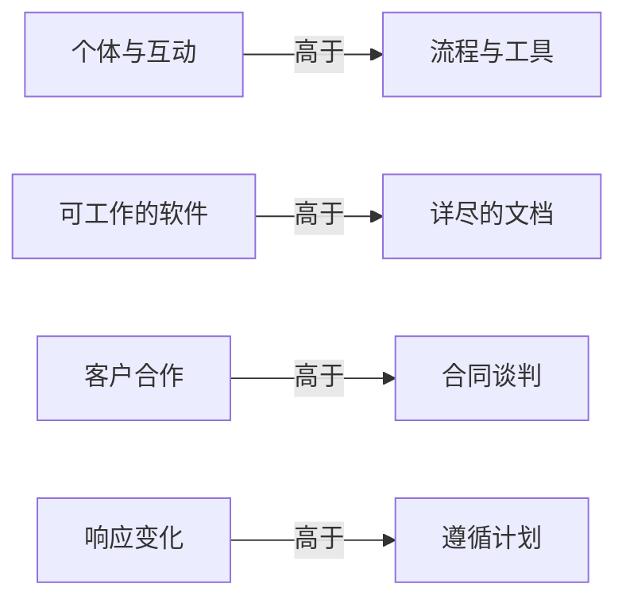
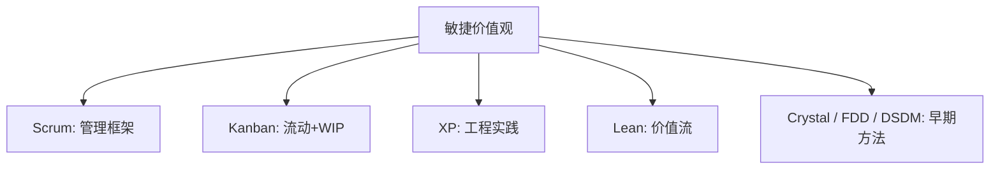

# 软件开发流程与模型(十二)敏捷宣言与原则

> [!abstract] 速览
> **敏捷（Agile）** 不是某个具体方法，而是一套**价值观与原则**。2001 年，17 位软件先驱在美国雪鸟(Snowbird)聚会，发布《**敏捷宣言**》——**4 条价值观 + 12 条原则**，成为 [[13.Scrum框架|Scrum]]、[[14.看板方法Kanban|Kanban]]、[[15.极限编程XP|XP]] 等一切敏捷方法的"宪法"。
> 一句话：**敏捷的核心是"拥抱变化、频繁交付可用软件、持续协作与改进"**——它是一种思维方式，定方向；具体落地靠各框架。本篇逐条解读价值观与原则，澄清"敏捷不是什么"，并剖析敏捷转型的常见陷阱。

## 1. 敏捷的诞生

2001 年前，重型方法（[[03.瀑布模型|瀑布]]、繁琐文档、僵化流程）饱受诟病。17 位实践者（含 Scrum、XP、DSDM、FDD 的创始人）在雪鸟会议求同存异，签署《敏捷软件开发宣言》，并成立敏捷联盟(Agile Alliance)。它不是某人发明，而是**一群人对"什么真正有效"的共识**。

## 2. 四大价值观

> [!note] "高于"≠"否定"
> 宣言原文紧接着写："**右项仍有价值，但我们更重视左项。**" 敏捷不是"不要文档 / 不要计划 / 不要流程"，而是**不被它们绑架**。

## 3. 四价值观逐条解读

| 价值观 | 真实含义 | 常见误读 |
| --- | --- | --- |
| 个体与互动 > 流程工具 | 人和沟通比工具更决定成败 | "不要流程"（错） |
| 可工作软件 > 详尽文档 | 用能跑的软件衡量进度 | "不写文档"（错） |
| 客户合作 > 合同谈判 | 持续协作胜过扯皮 | "不要合同"（错） |
| 响应变化 > 遵循计划 | 计划要能适应变化 | "不要计划"（错） |

## 4. 十二条原则

| # | 原则（精要） | 分组 |
| --- | --- | --- |
| 1 | 尽早持续交付**有价值的软件** | 交付 |
| 2 | **欢迎需求变化**，即使后期 | 变化 |
| 3 | **频繁交付**（数周到数月，越短越好） | 交付 |
| 4 | 业务与开发**每天协作** | 协作 |
| 5 | 围绕**有积极性的个体**建项目、给信任 | 人 |
| 6 | **面对面沟通**最高效 | 协作 |
| 7 | **可工作软件**是进度首要度量 | 度量 |
| 8 | 保持**可持续节奏** | 人 |
| 9 | 持续关注**技术卓越与良好设计** | 技术 |
| 10 | **简洁**——尽量少做不必要的事 | 技术 |
| 11 | 最好的架构 / 需求来自**自组织团队** | 人 |
| 12 | 团队定期**反思并调整** | 改进 |

## 5. 敏捷 vs 传统计划驱动

| 维度 | 敏捷 | 计划驱动 |
| --- | --- | --- |
| 计划 | 滚动、适应 | 前期一次定 |
| 交付 | 频繁增量 | 末期一次 |
| 文档 | 够用即可 | 详尽 |
| 变化 | 欢迎 | 抗拒 |
| 反馈 | 快 | 慢 |

## 6. 敏捷"不是什么"

| 误解 | 真相 |
| --- | --- |
| 敏捷 = 不写文档 | 写**够用**的文档 |
| 敏捷 = 没有计划 | 持续**滚动计划** |
| 敏捷 = 没有纪律 | 需要**高纪律**（CI、测试、回顾） |
| 敏捷 = 想到哪做到哪 | 有节奏、有优先级、有 DoD |
| 敏捷 = 更快 | 是更快**反馈与适应**，非单纯做得快 |

## 7. 敏捷方法谱系

## 8. 思维内核：经验主义

敏捷本质是**经验主义**——透明、检视、适应（见 [[13.Scrum框架]]）。不追求一次想全，而是小步快跑、用反馈纠偏。这与 [[16.精益软件开发Lean|精益]]的"放大学习"相通。

## 9. 敏捷的现代延伸

- **现代敏捷 Modern Agile**（Joshua Kerievsky）四原则：**让人卓越、安全是前提、快速实验与学习、持续交付价值**——更聚焦人与安全。
- **心理安全(Psychological Safety)**：Google 亚里士多德项目发现，它是高效团队的首要因素，与敏捷文化高度契合。

## 10. 敏捷转型的常见陷阱

| 陷阱 | 表现 |
| --- | --- |
| **形式主义** | 只学仪式（站会/看板），不变思维 |
| **伪敏捷 / [[13.Scrum框架\|ScrumBut]]** | "我们敏捷，但是不做回顾……" |
| **缺工程实践** | 只学 Scrum 管理，不学 [[15.极限编程XP\|XP]] 工程，代码越来越烂 |
| **自上而下命令式推行** | 强压敏捷，扼杀自组织 |

## 11. 真实案例：团队敏捷转型

某传统团队从瀑布转敏捷：先引入 Scrum 节奏(冲刺/站会/回顾)，但前三个月代码质量反而下降——因为只学了管理仪式、没上 [[33.测试驱动开发TDD|TDD]] 与 [[21.持续集成与持续交付CICD|CI]]。补齐工程实践后才真正提速。**教训：敏捷 = 管理框架 + 工程实践，缺一不可。**

## 12. 敏捷度量

敏捷反对"用产出量(代码行)考核"，主张度量**价值与流动**：交付的可用功能、[[38.软件度量DORA与SPACE|DORA / 流动效率]]、客户满意度。详见 [[18.敏捷估算与度量]] 与 [[38.软件度量DORA与SPACE]]。

## 13. 常见误区与面试要点

> [!warning] 易错点
> - **四价值观"高于"= 否定右项？** 不。右项仍有价值，只是更重视左项。
> - **敏捷 = Scrum？** 不。Scrum 是敏捷的一种实现；敏捷是价值观。
> - **敏捷不需要架构 / 文档？** 需要，只是"恰好够用"且持续演进。
> - **12 原则第 1 条强调什么？** 尽早、持续交付**有价值的软件**。
> - **敏捷 = 快？** 是快速**反馈与适应**，非单纯做得快。

## 14. 对常见说法的修正

> [!note] 修正清单
> 1. **"敏捷不重视工程质量"**——误解。[[15.极限编程XP|XP]] 正是工程实践集大成；很多"敏捷失败"恰恰是只学管理仪式、不学工程实践。
> 2. **"敏捷 = 没有纪律"**——相反，真敏捷需要极高纪律(CI/测试/回顾)。

## 15. 一句话记忆

> **敏捷** = 一份"宪法"：**4 价值观 + 12 原则**，核心是拥抱变化、频繁交付可用软件、持续协作与反思——它定方向，[[13.Scrum框架|Scrum]] / [[14.看板方法Kanban|Kanban]] / [[15.极限编程XP|XP]] 负责落地；管理仪式 + 工程实践缺一不可。

## 延伸阅读

- 落地框架：[[13.Scrum框架]] · [[14.看板方法Kanban]] · [[15.极限编程XP]]
- 思想源流：[[16.精益软件开发Lean]]
- 反面参照：[[03.瀑布模型]]
- 转型与规模化：[[17.规模化敏捷SAFe与LeSS]]
- 横向速查：[[46.模型对比速查大表]]

## 参考文献

1. Beck, K. 等 (2001). *Manifesto for Agile Software Development*（agilemanifesto.org）。
2. Kerievsky, J. *Modern Agile*.
3. Highsmith, J. *Agile Software Development Ecosystems*.

---

> ⬅️ [[11.过程模型选型与Cynefin决策]] ｜ 🏠 [[00.软件开发流程与模型总览]] ｜ [[13.Scrum框架]] ➡️
