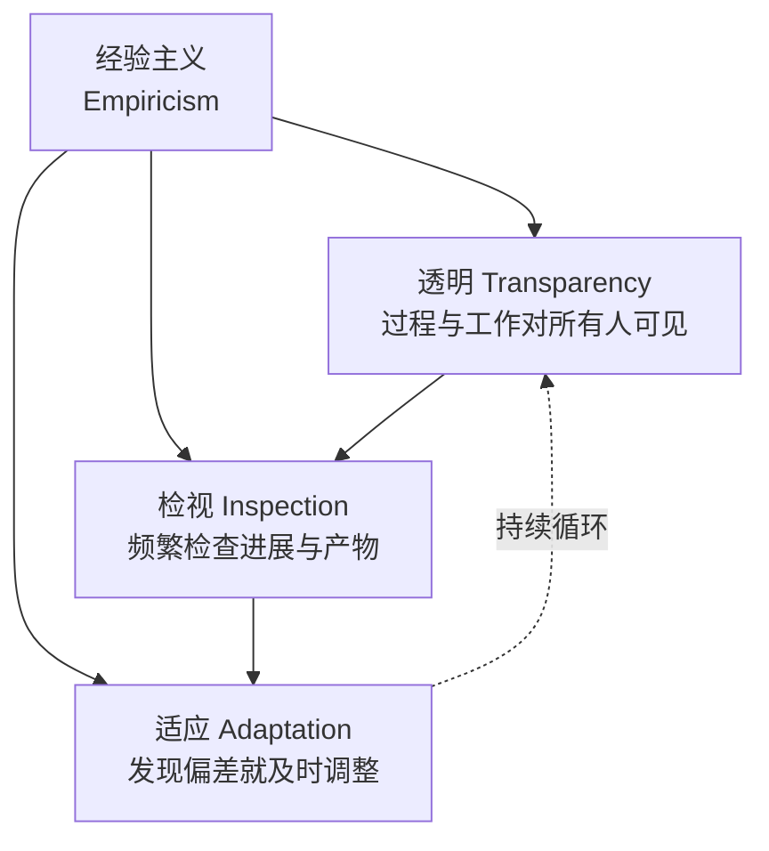
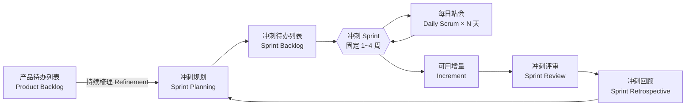
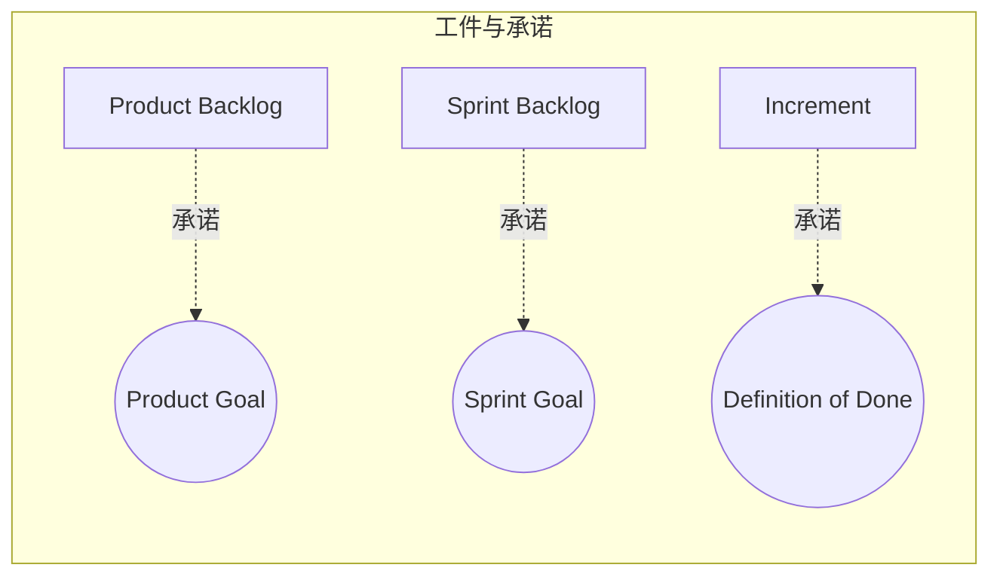
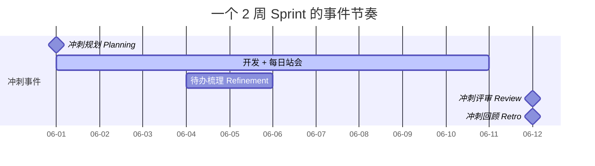

# 软件开发流程与模型(十三)Scrum框架

> [!abstract] 速览
> **Scrum** 是当今最流行的敏捷框架，由 **Jeff Sutherland 与 Ken Schwaber** 在 1990 年代提出，权威定义是《**Scrum Guide**》（最新 **2020 版**）。它用固定时长的**冲刺（Sprint）** 循环交付**可用增量**，由 **3 个角色、5 个事件、3 个工件**构成。
> 关键认知：**Scrum 是"框架"而非"方法论"**——只规定骨架，具体工程实践（TDD、CI、结对）需团队自行填充（见 [[15.极限编程XP]]）。它建立在**经验主义**之上，对照 [[03.瀑布模型]] 的"先想全再做"，Scrum 主张"**边做边学、持续检视与适应**"。
> 一句话：**Scrum = 把大目标切成一个个 1~4 周的冲刺，每个冲刺都产出可用增量，并用站会 / 评审 / 回顾不断检视和调整。** 本篇还覆盖**待办梳理、燃起图、Cynefin 选型、Scrum 反模式专题与工具链落地**。

## 1. Scrum 是什么：框架 ≠ 方法论

- **方法论**规定"具体怎么做每一步"；**框架**只给"骨架与规则"。Scrum 属后者——这也是它能跨行业通用的原因。
- 名字源自橄榄球"**争球（scrum）**"，借自 1986 年 Takeuchi & Nonaka 的经典文章《The New New Product Development Game》——强调像橄榄球队一样**整体协作、自组织地推进**。

Scrum 立足**经验主义（Empiricism）** 与**精益思想**，三大支柱：



并由**五个价值观**支撑：**承诺、专注、开放、尊重、勇气**（Commitment, Focus, Openness, Respect, Courage）。

## 2. Scrum 全景图



## 3. 三个角色（Scrum Team）

2020 版称为**担当（Accountabilities）**，统属一个 **Scrum Team**（通常 **10 人或更少**，**无子团队、无层级**）：

| 角色 | 核心职责 | 一句话定位 |
| --- | --- | --- |
| **产品负责人 PO** | 最大化产品价值；**管理产品待办列表**（排序、澄清、可见） | "**做什么、先做什么**"的决策者 |
| **Scrum Master SM** | 建立维护 Scrum；**移除障碍**；辅导团队与组织；服务型领导 | 团队的"**教练 + 障碍清道夫**" |
| **开发者 Developers** | 制定冲刺计划、灌输质量(守 DoD)、每日调整、互相担责；**跨职能、自管理** | "**怎么做、做出来**"的人 |

> [!note] 2020 版重要变化
> 旧版"开发团队(Development Team)"是子团队；**2020 版取消了这个概念**——整个 Scrum Team 是**一个团队**，共同对 Product Goal 负责。

## 4. 五个事件（Events）

所有事件都有**时间盒(Timebox)**，且都发生在**冲刺**这个"容器事件"内。下表以 **1 个月冲刺**为例（更短冲刺按比例缩短）：

| 事件 | 时间盒 | 目的 | 关键产出 |
| --- | --- | --- | --- |
| **冲刺 The Sprint** | **固定 1~4 周** | 承载其余所有事件；长度一旦定下**保持恒定** | 一个可用增量 |
| **冲刺规划 Planning** | ≤ 8 小时 | 确定 **Sprint Goal**、挑选待办、制定计划 | Sprint Goal + Sprint Backlog |
| **每日站会 Daily Scrum** | **15 分钟 / 天** | 开发者**同步进展、调整当日计划**、暴露障碍 | 更新后的计划 |
| **冲刺评审 Review** | ≤ 4 小时 | 向干系人**演示增量**、收集反馈、调整待办 | 反馈 + 调整后的待办 |
| **冲刺回顾 Retrospective** | ≤ 3 小时 | 检视**团队与过程**(人、关系、工具)，定改进 | 至少一条可执行改进 |

> [!tip] Review 与 Retro 的区别（高频考点）
> **Review 看"产品"**（做对了吗？面向干系人，对外）；**Retro 看"过程 / 团队"**（协作好吗？怎么更好，对内）。一个对外、一个对内，缺一不可。

## 5. 三个工件（Artifacts）与承诺

2020 版为**每个工件绑定一个"承诺(Commitment)"**：

| 工件 | 是什么 | 绑定的承诺 |
| --- | --- | --- |
| **产品待办列表 Product Backlog** | 产品所有待办的**有序清单**（动态演进），PO 维护 | **产品目标 Product Goal** |
| **冲刺待办列表 Sprint Backlog** | 本冲刺要做的待办 + 计划，开发者拥有 | **冲刺目标 Sprint Goal** |
| **增量 Increment** | 本冲刺产出的、**可用且达标**的成果（可累加） | **完成定义 Definition of Done (DoD)** |



## 6. Backlog Refinement：那个"不在 5 事件里"的关键活动

**产品待办梳理（Product Backlog Refinement）** 是**持续进行的活动**而非正式事件——但缺了它，冲刺规划必然低效。

- **做什么**：拆分大条目、补充细节与验收标准、重新估算、调整优先级。
- **何时做**：贯穿冲刺（常见做法是每冲刺花 ≤10% 的时间），让待办列表顶部始终保持"**就绪(Ready)**"。
- **DoR（就绪定义）**：一个待办项可进入冲刺的前置条件（如：有验收标准、可估算、无外部阻塞）。**注意 DoR 非官方概念**，是社区补充。

> 类比：Refinement 是"备菜"，Sprint Planning 是"下锅"。不备菜，规划会就会变成漫长的争论现场。

## 7. 关键概念速通

| 概念 | 含义 | 备注 |
| --- | --- | --- |
| **用户故事 User Story** | "**作为<角色>，我想<目标>，以便<价值>**" | 非 Scrum 强制，实践常用 |
| **INVEST 原则** | 独立 / 可协商 / 有价值 / 可估算 / 小 / 可测试 | Independent, Negotiable, Valuable, Estimable, Small, Testable |
| **验收标准 AC** | 单个故事"做对了"的可验证条件 | 针对**单故事**（区别于 DoD） |
| **完成定义 DoD** | 增量被视为"完成"的统一质量标准 | **官方工件承诺** |
| **故事点 Story Point** | 相对估算复杂度的无量纲单位 | **不是工时**，见 [[18.敏捷估算与度量]] |
| **速度 Velocity** | 团队每冲刺平均完成的故事点 | **不可跨团队比较、不应作 KPI** |

## 8. 燃尽图 vs 燃起图

两张图都看进度，但视角不同：

| 维度 | 燃尽图 Burndown | 燃起图 Burnup |
| --- | --- | --- |
| 纵轴 | **剩余**工作量（向下到 0） | **已完成**工作量（向上）+ 一条总范围线 |
| 看什么 | "还剩多少、来不来得及" | "完成了多少" + **范围是否在变** |
| 盲区 | **分不清"做得慢"还是"加了需求"** | 范围线上抬即**范围蔓延 Scope Creep**，一目了然 |
| 适用 | 冲刺内日常跟踪 | 版本 / 发布级、需向上汇报范围变化 |

> [!tip]
> 只看燃尽图容易被"中途加需求"误导——曲线降不下去，团队却背锅。**燃起图把"完成"与"范围"分两条线**，能直接暴露 PO 不断塞需求导致的范围蔓延。

## 9. 一个 Sprint 的节奏（以 2 周为例）



典型节奏：**第 1 天**开规划定 Sprint Goal → **每个工作日**15 分钟站会 → **冲刺中段**抽时间梳理下个冲刺的待办 → **最后一天**先评审（对外）再回顾（对内）→ 紧接着下一个规划，循环不息。

## 10. 何时该用 Scrum：Cynefin 框架

并非所有工作都适合 Scrum。借 **Cynefin（库尼文）** 框架按"问题的可预测性"分域：

| 域 | 特征 | 决策方式 | 更合适的方法 |
| --- | --- | --- | --- |
| **清晰 Clear** | 因果明显、有最佳实践 | 感知-归类-响应 | 标准流程 / [[14.看板方法Kanban\|看板]] |
| **繁杂 Complicated** | 需专家分析，因果可知 | 感知-分析-响应 | 计划驱动 / [[03.瀑布模型\|瀑布]]·[[04.V模型\|V]] 也可行 |
| **复杂 Complex** | 因果只能事后看清、需求涌现 | **探针-感知-响应** | **Scrum / 敏捷的主场** |
| **混乱 Chaotic** | 危机、无因果 | 行动-感知-响应 | 先救火，再图敏捷 |

> [!note]
> **Scrum 最擅长"复杂域"**——需求会涌现、无法一次想清、要靠小步快跑试探。对**清晰 / 繁杂**的可预测工作，硬套 Scrum 的仪式反而是负担。

## 11. Scrum vs 瀑布

呼应 [[03.瀑布模型]]：

| 维度 | Scrum（变更驱动） | [[03.瀑布模型\|瀑布]]（计划驱动） |
| --- | --- | --- |
| 交付 | 每冲刺交付**可用增量** | 末期**一次性**交付 |
| 需求 | **持续演进**、可重排 | 前期**冻结** |
| 反馈周期 | 1~4 周（短） | 测试 / 验收期（长） |
| 文档 | 恰好够用 | 完备、正式 |
| 拥抱变化 | 欢迎 | 抗拒 |
| 适用 | 需求模糊 / 易变 | 需求稳定、强合规 |

## 12. Scrum vs Kanban

呼应 [[14.看板方法Kanban]]，二者可合并为 **Scrumban**：

| 维度 | Scrum | [[14.看板方法Kanban\|Kanban]] |
| --- | --- | --- |
| 节奏 | **固定冲刺**（迭代） | **持续流动**，无固定迭代 |
| 角色 | 明确 3 角色 | 不规定角色 |
| 限制在制品 | 间接（冲刺范围） | **显式 WIP 限制**（核心） |
| 变更时机 | 冲刺内尽量不变 | **随时可调** |
| 核心度量 | 速度 Velocity | 周期时间 / 吞吐量 |
| 适合 | 需要节奏感的产品迭代 | 运维 / 支持等流式工作 |

## 13. Scrum 反模式专题

"用了 Scrum 却没效果"，往往是踩了下面这些坑：

| 反模式 | 表现 | 危害 | 解药 |
| --- | --- | --- | --- |
| **Water-Scrum-fall** | 中间用 Scrum，前期仍大需求冻结、后期集中测试发布 | 敏捷只剩中段形式 | 把需求与发布也敏捷化、上 [[21.持续集成与持续交付CICD\|CI/CD]] |
| **僵尸 Scrum (Zombie Scrum)** | 仪式齐全却毫无活力、不交付可用增量、回顾走过场 | 形似神不似 | 回归经验主义三支柱，聚焦可用增量 |
| **ScrumBut** | "我们用 Scrum，**但是**不开回顾 / Sprint 随意延长" | 砍掉检视与适应 | 恢复完整事件 |
| **黑暗 Scrum (Dark Scrum)** | 把 Scrum 当微观管理 / 压榨工具、速度 KPI 化 | 团队倦怠、刷点数 | SM 守护团队、速度不作考核 |
| **加固冲刺滥用** | 用 "Hardening Sprint" 掩盖技术债、Sprint 0 当长前期设计 | 变相瀑布 | 每冲刺内建质量、严守 DoD |

## 14. 工具链与落地示例

**主流工具**：Jira、Azure DevOps Boards、GitLab、Trello、青道(Worktile/PingCode 等国内工具)。看板列与 DoD 直接映射到工具的工作流状态：


**一个用户故事 + 验收标准（Gherkin）示例**——验收标准用 Gherkin 写，可直接对接 [[34.行为驱动开发BDD|BDD]] 自动化测试：

```gherkin
功能: 用户登录
  作为 注册用户
  我想 用账号密码登录
  以便 访问我的个人数据

  场景: 凭据正确
    假如 我在登录页
    当 我输入正确的账号和密码
    那么 我应进入个人主页

  场景: 连续失败锁定
    假如 我已连续输错密码 4 次
    当 我第 5 次输错
    那么 账号应被锁定 15 分钟
```

**一份「完成定义 DoD」清单示例**（团队共识，挂在看板上）：

```markdown
- [ ] 代码已合并主干且 CI 通过
- [ ] 单元测试覆盖新增逻辑（覆盖率 ≥ 80%）
- [ ] 通过 Code Review（≥ 1 人批准）
- [ ] 所有验收标准满足
- [ ] 无已知严重 / 阻塞缺陷
- [ ] 文档 / 变更日志已更新
```

## 15. 常见误区与面试要点

> [!warning] 易错点
> - **Scrum ≠ 没有计划 / 没有文档**：有规划会、Backlog、DoD，只是"恰好够用"。
> - **每日站会不是"向 SM / 老板汇报"**：是**开发者之间**同步与调整当日计划的会。
> - **Scrum Master 不是项目经理**：不分配任务、不发号施令，是**服务型领导 / 教练**。
> - **冲刺中途能改需求吗？** 为保护 **Sprint Goal**，原则上**不随意塞**；确有必要由 PO 与开发者**协商**。
> - **故事点 = 工时？** 不。是**相对**复杂度，换算工时是反模式。
> - **Velocity 是 KPI 吗？** 不应是。只用于**本团队预测**，跨团队比较会诱发刷点数。
> - **Sprint 长度该为赶功能延长吗？** 不该。**冲刺时长固定**是节拍器；没做完的退回 Backlog 重排。

## 16. 对常见说法的修正

> [!note] 关于"每日站会三个问题"
> "昨天做了什么 / 今天做什么 / 有什么障碍"三问，在 **2020 版 Scrum Guide 中已不再强制**——只是组织站会的**一种可选方式**。2020 版只要求开发者每天检视朝 Sprint Goal 的进展并调整计划，**形式不限**。

> [!note] 关于适用范围
> 2020 版刻意**去软件化**，使 Scrum 适用于任何复杂产品。但要清醒：**Scrum 擅长"复杂、需求易变"**（见第 10 节 Cynefin）；对简单重复（用 [[14.看板方法Kanban|Kanban]] 更合适）或需求极稳定 + 强合规（[[03.瀑布模型|瀑布]] 更省）的工作，硬套 Scrum 反而增加仪式负担。

## 17. 一句话记忆

> **Scrum** = 给团队装一个"**心跳**"：每 1~4 周跳一次（一个冲刺），每次心跳都产出能用的东西，并在跳动间隙不断**检视（站会 / 评审 / 回顾）与适应**——用稳定的节奏对抗需求的不确定。

## 延伸阅读

- 敏捷总纲：[[12.敏捷宣言与原则]]
- 对照框架：[[14.看板方法Kanban]] · [[15.极限编程XP]]（XP 补足 Scrum 缺失的工程实践）
- 估算与度量：[[18.敏捷估算与度量]]
- 反面参照：[[03.瀑布模型]]
- 混合现实：[[19.混合模型与Water-Scrum-fall]]
- 规模化：[[17.规模化敏捷SAFe与LeSS]]
- 横向速查：[[46.模型对比速查大表]]

## 参考文献

1. Schwaber, K. & Sutherland, J. (2020). *The Scrum Guide*.
2. Takeuchi, H. & Nonaka, I. (1986). *The New New Product Development Game*. HBR.
3. Snowden, D. & Boone, M. (2007). *A Leader's Framework for Decision Making*（Cynefin）. HBR.
4. Sutherland, J. (2014). *Scrum: The Art of Doing Twice the Work in Half the Time*.

---

> ⬅️ [[12.敏捷宣言与原则]] ｜ 🏠 [[00.软件开发流程与模型总览]] ｜ [[14.看板方法Kanban]] ➡️
