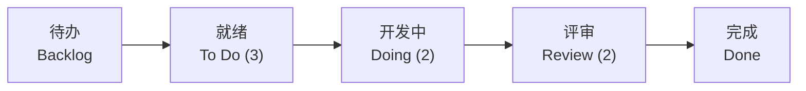

# 软件开发流程与模型(十四)看板方法Kanban

> [!abstract] 速览
> **看板方法（Kanban）** 源自丰田生产系统(TPS)的"看板"卡片，由 David J. Anderson 引入软件领域。它**不规定迭代、不规定角色**，而是通过 **可视化工作流 + 限制在制品(WIP) + 拉动式流动** 来持续优化交付，主张**渐进式改良**而非推倒重来。
> 一句话：**把工作画到板上、限制同时在做的数量、让任务像水一样顺畅流动**——它是"持续流"的代表，与 [[13.Scrum框架|Scrum]] 的"固定冲刺"形成鲜明对照，是 [[16.精益软件开发Lean|精益]]在软件的直接落地。本篇深入六实践、Little 定律、累积流图与服务类别。

## 1. Kanban 是什么

Kanban 是一种**演进式变更方法**：不推翻现有流程，而是把它**可视化**出来，再通过限制 WIP、优化流动来逐步改进。它的哲学是"**从现状开始，持续小步改良**"——这降低了变革阻力。

## 2. 四大原则（变革管理）

| 原则 | 含义 |
| --- | --- |
| **从现状开始** | 不推翻，先把现有流程画出来 |
| **渐进式改良** | 小步持续改进，避免剧烈变动 |
| **尊重现有角色** | 不强制改组织结构 / 头衔 |
| **鼓励各级领导力** | 人人可发起改进 |

## 3. 六大核心实践

| 实践 | 说明 |
| --- | --- |
| **可视化工作流** | 看板墙：每列一阶段，每卡一任务 |
| **限制在制品 WIP** | 每列设上限，防"同时干太多" |
| **管理流动** | 关注顺畅流动、消除阻塞 |
| **显式化流程规则** | 列的进出准则写清楚 |
| **建立反馈闭环** | 站会、补充会、复盘 |
| **协作式演进改进** | 用数据驱动持续优化 |

## 4. 看板墙

> 列名后的 **(数字)** 是该列 **WIP 上限**——开发中最多同时 2 个，满了就**不能再拉新活**，必须先把手头的推下去。这逼着团队"**先完成，再开始**(Stop Starting, Start Finishing)"。

## 5. 限制在制品(WIP)与 Little 定律

WIP 限制是 Kanban 的灵魂。其数学依据是 **Little 定律**：

> **平均周期时间 = 在制品数量(WIP) ÷ 平均吞吐率**

即吞吐率一定时，**WIP 越小，单个任务的周期时间越短**。这解释了"同时开十个任务结果一个都不快"的常识——并行越多，每件越慢、上下文切换越贵。

## 6. 拉动 vs 推动

| 方式 | 含义 | 问题 / 好处 |
| --- | --- | --- |
| **推动 Push** | 上游做完就塞给下游 | 下游积压、过载 |
| **拉动 Pull** | 下游有空才从上游拉 | 按能力接活、流动顺畅 |

Kanban 是**拉动式**——这正是精益的核心（见 [[16.精益软件开发Lean]]）。

## 7. 核心度量

| 指标 | 含义 |
| --- | --- |
| **前置时间 Lead Time** | 从需求提出到交付（客户视角） |
| **周期时间 Cycle Time** | 从开始做到完成（团队视角） |
| **吞吐量 Throughput** | 单位时间完成的任务数 |
| **累积流图 CFD** | 各状态任务量随时间堆叠，看瓶颈与积压 |

## 8. 累积流图（CFD）怎么看

CFD 把"各状态的累积任务数"随时间堆叠成色带：

| 读法 | 含义 |
| --- | --- |
| 某条色带**变宽** | 该阶段积压（瓶颈） |
| 色带**带宽** | 约等于该阶段的 WIP |
| 色带**斜率** | 约等于吞吐率 |
| 两线**水平距离** | 约等于周期时间 |

> 若"评审中"色带越来越宽，说明评审是瓶颈——该加评审人力或限制上游 WIP。

## 9. 服务类别(CoS)与服务级别期望(SLE)

成熟 Kanban 还会区分**服务类别(Class of Service)**：

| 类别 | 处理策略 |
| --- | --- |
| 加急 Expedite | 插队、最高优先 |
| 固定交付日期 | 按截止期倒排 |
| 标准 Standard | 正常 FIFO |
| 无形 Intangible | 不紧急但重要(如重构) |

**SLE（Service Level Expectation）**：如"85% 的任务在 5 天内完成"，用数据对客户承诺。

## 10. Kanban vs Scrum

| 维度 | Kanban | [[13.Scrum框架\|Scrum]] |
| --- | --- | --- |
| 节奏 | **持续流动**，无固定迭代 | 固定冲刺 |
| 角色 | 不规定 | PO / SM / Dev |
| WIP | **显式限制** | 间接（冲刺范围） |
| 变更 | **随时可调** | 冲刺内尽量不变 |
| 度量 | 周期时间 / 吞吐量 | 速度 |
| 适合 | 运维 / 支持 / 流式工作 | 产品迭代 |

## 11. Scrumban：二者融合

**Scrumban** = Scrum 的结构（角色 / 部分事件）+ Kanban 的流动与 WIP 限制。常用于：从 Scrum 向 Kanban 过渡、或维护型团队需要一点节奏又要灵活。

## 12. 真实案例：运维团队用 Kanban

运维 / 支持工单**随时到达、优先级多变**，不适合固定冲刺：

1. 工单全部上墙，区分服务类别（加急 / 标准）；
2. 限制"处理中"WIP=3，逼着先完成再开新；
3. 用 CFD 发现"等待审批"列长期积压 → 针对性优化审批环节；
4. 结果：周期时间下降、积压减少。

## 13. 工具链

Jira（看板视图）、Trello、GitHub / GitLab Projects、Azure Boards；物理白板 + 便利贴同样有效（甚至更直观）。

## 14. 常见误区与面试要点

> [!warning] 易错点
> - **Kanban = 一块看板？** 不。看板墙只是载体，**限制 WIP + 管理流动**才是核心。
> - **Kanban 没有 WIP 限制？** 错——WIP 限制是其灵魂。
> - **Kanban = Scrum 去掉冲刺？** 不准确。价值观不同：Kanban 重流动与渐进改良。
> - **Little 定律说明什么？** WIP 越小、周期越短——别贪多并行。
> - **CFD 色带变宽意味什么？** 该阶段积压、出现瓶颈。
> - **"Stop Starting, Start Finishing"？** Kanban 口号：先完成在手的，再开新的。

## 15. 对常见说法的修正

> [!note] 修正清单
> 1. **"Kanban 比 Scrum 更自由所以更好"**——自由的另一面是缺节奏与承诺；产品团队常更需要 Scrum 的节拍。选哪个看工作是"流式"还是"批式"。
> 2. **"Kanban 没有纪律"**——WIP 限制本身就是强纪律，违反它就失去意义。

## 16. 一句话记忆

> **Kanban** = 可视化 + 限制在制品 + 拉动流动：把活儿画上墙、限制同时在做的数量、让任务顺畅流过——靠 **Little 定律**（少并行=快交付）和**渐进改良**持续优化，特别适合流式工作。

## 延伸阅读

- 对照框架：[[13.Scrum框架]]（融合见 Scrumban）
- 思想源流：[[16.精益软件开发Lean]]（TPS / 精益 / 拉动）
- 度量延伸：[[38.软件度量DORA与SPACE]]（流动效率 / Flow）
- 横向速查：[[46.模型对比速查大表]]

## 参考文献

1. Anderson, D. J. (2010). *Kanban: Successful Evolutionary Change for Your Technology Business*.
2. 大野耐一. *丰田生产方式*（看板源头）。
3. Little, J. D. C. *Little's Law*.

---

> ⬅️ [[13.Scrum框架]] ｜ 🏠 [[00.软件开发流程与模型总览]] ｜ [[15.极限编程XP]] ➡️
