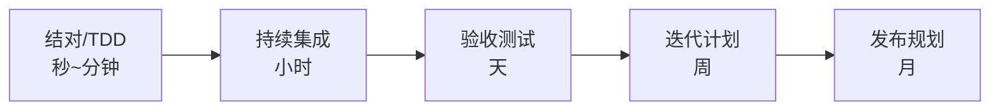

# 软件开发流程与模型(十五)极限编程XP

> [!abstract] 速览
> **极限编程（XP, Extreme Programming）** 由 Kent Beck 在 1990 年代末提出，是**最重视工程实践**的敏捷方法。它把已知的好实践"做到极致"：既然测试好，就**一直测**(TDD)；既然评审好，就**一直评**(结对)；既然集成好，就**一直集成**(CI)。
> 它补上了 [[13.Scrum框架|Scrum]] 缺失的部分——Scrum 教"怎么组织迭代"，XP 教"代码怎么写才不烂"。
> 一句话：**XP 用一组互相支撑的工程实践，让"频繁变更"在技术上变得安全。** 很多团队"Scrum 管节奏 + XP 管工程"。本篇深入五价值观、核心实践、多层反馈环、TDD/结对详解。

## 1. XP 是什么

[[13.Scrum框架|Scrum]] 不教代码怎么写，XP 正好补上：它聚焦**编码层面的纪律**，让代码库在持续变更下仍保持健康。XP 的"极限"指**把好实践推到极致频率**，而非"图快"。

## 2. 五大价值观

| 价值观 | 含义 |
| --- | --- |
| **沟通 Communication** | 面对面、信息透明 |
| **简单 Simplicity** | 做当下够用的最简方案(YAGNI) |
| **反馈 Feedback** | 用测试、客户、CI 持续获取反馈 |
| **勇气 Courage** | 敢重构、敢删代码、敢说真话 |
| **尊重 Respect** | 团队相互尊重 |

## 3. 核心实践

| 分组 | 实践 |
| --- | --- |
| **编码** | 简单设计、重构、编码规范、系统隐喻 |
| **测试** | **TDD 测试驱动开发**、持续测试 |
| **协作** | **结对编程**、集体代码所有权、现场客户 |
| **集成发布** | **持续集成 CI**、小步频繁发布、每日部署 |
| **计划** | 计划游戏(Planning Game)、可持续节奏(每周 ~40h) |

## 4. 关键实践详解

- **TDD（[[33.测试驱动开发TDD]]）**：先写测试再写实现，红-绿-重构（见第 6 节）。
- **结对编程**：两人一机，实时评审与知识共享（见第 7 节）。
- **持续集成（[[21.持续集成与持续交付CICD]]）**：频繁合并、自动构建测试，避免"集成地狱"。
- **重构**：在测试保护下持续改进代码结构，对抗架构腐蚀。
- **简单设计 / YAGNI**："You Aren't Gonna Need It"——不为臆想的未来过度设计。
- **集体代码所有权**：人人可改任意代码，配合 CI 与测试兜底。
- **现场客户**：客户在团队中随时答疑、定优先级。

## 5. XP 的多层反馈环

XP 的精髓是**不同时间尺度的反馈环层层嵌套**——尺度越小、纠错越便宜：



越靠左反馈越快——这与 [[03.瀑布模型|瀑布]]"反馈在末期"恰好相反，也是 XP 让"频繁变更安全"的底层机制。

## 6. TDD 示例（红-绿-重构）

```python
# 1) 红：先写一个会失败的测试
def test_add():
    assert add(2, 3) == 5      # add 尚不存在 → 失败

# 2) 绿：写最简实现让测试通过
def add(a, b):
    return a + b

# 3) 重构：在测试保护下优化（此处已足够简单）
```

> 测试先行倒逼"可测性"与"接口先想清楚"，详见 [[33.测试驱动开发TDD]]。

## 7. 结对编程详解

| 角色 | 职责 |
| --- | --- |
| **驾驶员 Driver** | 敲键盘，关注当下代码细节 |
| **领航员 Navigator** | 审视方向、想边界与设计、即时评审 |

- **Ping-Pong 结对**：一人写测试，另一人写实现，交替（TDD + 结对）。
- 好处：实时评审、减少缺陷、知识共享、降低"巴士因子"风险。
- 误区："两人一机=浪费一个人"——研究显示其降低缺陷、长期更划算。

## 8. 简单设计与 YAGNI

XP 主张"**做能通过当前测试的最简设计**"，反对为臆想需求过度设计。四条简单设计准则：通过所有测试、意图清晰、无重复(DRY)、元素最少。

## 9. XP vs Scrum

| 维度 | XP | [[13.Scrum框架\|Scrum]] |
| --- | --- | --- |
| 侧重 | **工程实践** | 管理框架 |
| 迭代 | 1~2 周 | 1~4 周 |
| 对代码的要求 | 明确(TDD/重构/CI) | 不规定 |
| 关系 | **常与 Scrum 互补** | 提供节奏与角色 |

## 10. XP 的计划：计划游戏与用户故事

- **用户故事**：写在卡片上的需求("作为…我想…以便…")；
- **计划游戏**：客户定优先级、开发估工作量，共同排本轮要做的故事；
- **小步发布**：尽快发出可用版本，频繁获取反馈。

## 11. 优点与缺点

| 优点 | 缺点 |
| --- | --- |
| 代码质量高、变更安全 | 实践纪律要求高，落地难 |
| 反馈快、缺陷早发现 | 结对、现场客户对组织有要求 |
| 拥抱变化 | 对大型 / 分布式团队挑战大 |

## 12. 适用场景

需求多变、对**代码质量与可维护性要求高**、团队愿意践行工程纪律的中小团队。

## 13. 真实案例：Scrum + XP 组合

某团队用 Scrum 管节奏(冲刺/站会/回顾)，但代码质量差。引入 XP 实践：强制 TDD、PR 必须结对或评审、搭 CI 流水线、每冲刺留重构时间。半年后缺陷率下降、交付提速——**Scrum 给节奏，XP 给质量**。

## 14. 常见误区与面试要点

> [!warning] 易错点
> - **XP = 写得快？** "极限"指把好实践做到极致，**不是图快**。
> - **结对编程 = 浪费一个人？** 研究表明降低缺陷、提升知识共享，长期更划算。
> - **XP 与 Scrum 二选一？** 不。二者**互补**：Scrum 管节奏、XP 管工程。
> - **YAGNI 是什么？** 别为臆想需求过度设计。
> - **TDD 三步？** 红(写失败测试)-绿(最简实现)-重构。
> - **集体代码所有权风险大吗？** 有 CI + 测试兜底则可控，且降低巴士因子。

## 15. 对常见说法的修正

> [!note] 修正清单
> 1. **"敏捷不重视工程质量"**——XP 正是反例，工程纪律是其核心。很多"敏捷失败"是只学 Scrum 仪式、没学 XP 工程。
> 2. **"XP 已经过时"**——其实践(TDD/CI/重构/结对)已成现代工程标配，只是不再单独打"XP"旗号。

## 16. 一句话记忆

> **XP** = 把好实践做到"极限"：一直测(TDD)、一直评(结对)、一直集成(CI)、一直重构——用工程纪律让"频繁变更"变得安全；它和 Scrum 是绝配（Scrum 给节奏，XP 给质量）。

## 延伸阅读

- 管理搭档：[[13.Scrum框架]]
- 工程实践：[[33.测试驱动开发TDD]] · [[21.持续集成与持续交付CICD]] · [[26.代码评审流程]]
- 价值观源流：[[12.敏捷宣言与原则]]
- 横向速查：[[46.模型对比速查大表]]

## 参考文献

1. Beck, K. (1999/2004). *Extreme Programming Explained: Embrace Change*.
2. Beck, K. *Test-Driven Development: By Example*.
3. Williams, L. & Kessler, R. *Pair Programming Illuminated*.

---

> ⬅️ [[14.看板方法Kanban]] ｜ 🏠 [[00.软件开发流程与模型总览]] ｜ [[16.精益软件开发Lean]] ➡️
