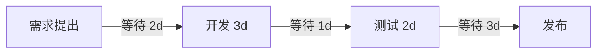

# 软件开发流程与模型(十六)精益软件开发Lean

> [!abstract] 速览
> **精益软件开发（Lean Software Development）** 把丰田生产系统(TPS)的**精益思想**引入软件，由 Mary 与 Tom Poppendieck 系统化为 **7 大原则 + 7 种浪费**。核心是 **消除浪费、放大学习、聚焦价值流**——只做对客户有价值的事，砍掉一切无价值环节。
> 一句话：**精益 = 识别价值流，干掉一切浪费，让价值快速顺畅流动。** 它是 [[14.看板方法Kanban|Kanban]] 的思想源头，为 [[13.Scrum框架|敏捷]]提供"为什么"，也是 [[42.精益创业LeanStartup与MVP|精益创业]]的根。本篇深入七浪费、价值流图、流动效率、自働化与延迟决策。

## 1. Lean 是什么

精益源自制造业：用最少资源、最短时间，交付客户真正需要的价值。搬到软件，就是**最大化价值、最小化浪费**——把"忙"和"有价值"区分开。

## 2. 七大原则

| 原则 | 含义 |
| --- | --- |
| **消除浪费** | 砍掉不产生价值的活动 |
| **放大学习** | 用短周期迭代与反馈快速学习 |
| **尽量延迟决策** | 在"最后责任时刻"再决策，保留灵活性 |
| **尽快交付** | 缩短前置时间、快速交付价值 |
| **授权团队** | 信任并赋能一线 |
| **内建质量** | 质量在过程中 built-in，而非事后检 |
| **看整体** | 优化整个价值流，而非局部最优 |

## 3. 软件中的七种浪费

| 制造业浪费 | 软件对应 | 例 |
| --- | --- | --- |
| 库存 | **部分完成的工作** | 一堆没上线的半成品分支 |
| 过度生产 | **额外特性** | 没人用的功能(YAGNI 反面) |
| 多余处理 | **额外过程 / 文档** | 没人看的报告 |
| 运输 | **交接 Handoff** | 部门间反复传递、信息丢失 |
| 动作 | **任务切换** | 频繁上下文切换 |
| 等待 | **延迟** | 等审批、等环境、等评审 |
| 缺陷 | **缺陷** | 返工 |

## 4. 价值流图（VSM）与流动效率

精益用**价值流图**找出"等待 / 浪费"在哪里：

> 上图真正"干活"只有 7 天，**等待却有 6 天**：
> **流动效率 = 增值时间 ÷ 总时间 = 7 ÷ 13 ≈ 54%**。
> 现实项目的流动效率常低至 **15% 以下**——大量时间花在排队等待。精益要砍的正是这些等待。

## 5. 拉动与限制在制品

精益主张**拉动式(Pull)**：下游有空闲才从上游拉活，而非上游硬推。这直接催生了 [[14.看板方法Kanban|Kanban]] 的 WIP 限制——少做并行、加快流动。

## 6. 内建质量与自働化(Jidoka)

精益强调**质量内建**而非事后检测。TPS 的 **自働化(Jidoka)**：一旦发现缺陷就**停线**(Andon 拉绳)、当场修复，绝不让缺陷流向下游。软件对应：CI 红了就停下修(见 [[21.持续集成与持续交付CICD]])、[[33.测试驱动开发TDD|TDD]] 把质量做进过程。

## 7. 放大学习与延迟决策

- **放大学习**：用短迭代 + 反馈快速试错学习（与 [[42.精益创业LeanStartup与MVP|精益创业]]的"构建-度量-学习"一致）。
- **延迟决策到"最后责任时刻"**：在信息最充分、又还来得及的那一刻再决策，避免过早锁定（如过早定技术栈）。**不是拖延，是保留可选性**。

## 8. Lean vs 敏捷

| 维度 | Lean | 敏捷 |
| --- | --- | --- |
| 视角 | **价值流 / 系统级** | 团队 / 交付级 |
| 关注 | 消除浪费、流动 | 拥抱变化、频繁交付 |
| 关系 | 提供"为什么" | 提供"怎么做" |

> 二者高度兼容，常合称 **Lean-Agile**（[[17.规模化敏捷SAFe与LeSS|SAFe]] 即自称 Lean-Agile）。

## 9. 与精益创业的关系

[[42.精益创业LeanStartup与MVP|精益创业]](Eric Ries) 把精益思想用于**创业**：用 MVP + 构建-度量-学习循环，最小化"做错东西"的浪费。可见精益是一条贯穿"开发→产品→创业"的主线。

## 10. 优点与缺点

| 优点 | 缺点 |
| --- | --- |
| 系统性消除浪费、提效 | 需要全局视角与数据 |
| 关注端到端价值流 | 文化转变难 |
| 与 Kanban / 敏捷天然契合 | 过度追求"精益"可能砍掉必要冗余 |

## 11. 真实案例：砍掉交接浪费

某团队需求要经过"产品→设计→开发→测试→运维"五次交接，每次排队数天。画价值流图后发现**等待占总时长 60%**；通过组建跨职能小队(减少交接，见 [[44.TeamTopologies团队拓扑]]) + Kanban 限制 WIP，前置时间砍半。

## 12. 工具链

价值流图工具、[[14.看板方法Kanban|看板]]、流动度量(周期时间/CFD)、[[38.软件度量DORA与SPACE|Flow Framework]]。

## 13. 常见误区与面试要点

> [!warning] 易错点
> - **精益 = 砍人省钱？** 不。精益砍的是**浪费**，不是必要投入与人。
> - **延迟决策 = 拖延？** 不。是在**最后责任时刻**(信息最足又来得及)决策。
> - **精益 = 敏捷？** 不同层次：精益是价值流/系统思维，敏捷是交付方法；互补。
> - **流动效率为何常很低？** 大量时间花在**等待**而非增值。
> - **七种浪费里最隐蔽的是？** "部分完成的工作"(在制品库存)和"任务切换"。
> - **Jidoka 是什么？** 自働化——发现缺陷就停线修，对应 CI 红了就停。

## 14. 对常见说法的修正

> [!note] 修正清单
> 1. **"精益只讲快"**——它同样强调**质量内建**(Jidoka)，快与质量并重，否则只是更快地把缺陷推给客户。
> 2. **"精益=Kanban"**——Kanban 是精益在软件的落地之一，精益是更广的思想体系。

## 15. 一句话记忆

> **精益** = 找出价值流、干掉七种浪费(尤其"等待"和"部分完成的工作")、让价值快速顺畅流动；同时**质量内建**(Jidoka)、**延迟决策**保留可选性——它是 Kanban 的灵魂，给敏捷提供"为什么"。

## 延伸阅读

- 直接落地：[[14.看板方法Kanban]]
- 规模化 Lean-Agile：[[17.规模化敏捷SAFe与LeSS]]
- 创业延伸：[[42.精益创业LeanStartup与MVP]]
- 团队与交接：[[44.TeamTopologies团队拓扑]]
- 度量流动：[[38.软件度量DORA与SPACE]]
- 横向速查：[[46.模型对比速查大表]]

## 参考文献

1. Poppendieck, M. & T. (2003). *Lean Software Development: An Agile Toolkit*.
2. 大野耐一. *丰田生产方式*.
3. Reinertsen, D. *The Principles of Product Development Flow*.

---

> ⬅️ [[15.极限编程XP]] ｜ 🏠 [[00.软件开发流程与模型总览]] ｜ [[17.规模化敏捷SAFe与LeSS]] ➡️
