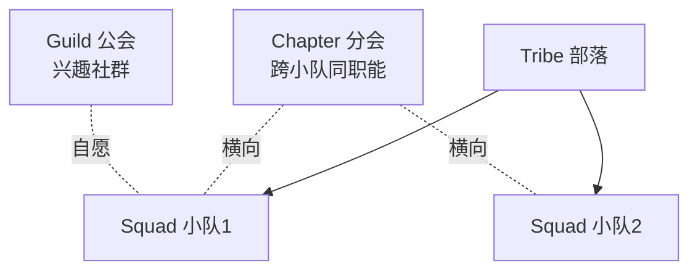

# 软件开发流程与模型(十七)规模化敏捷SAFe与LeSS

> [!abstract] 速览
> [[13.Scrum框架|Scrum]] 适合单个小团队，但当**几十上百个团队**协作同一个大产品时，就需要**规模化敏捷**。主流框架有 **SAFe**（最流行、最重）、**LeSS**（最小化、保持 Scrum 本质）、**Nexus**、**Scrum@Scale** 等。
> 一句话：**规模化敏捷解决"多团队如何对齐目标、协调依赖、统一节奏"**——SAFe 用结构换确定性(重)，LeSS 用克制保敏捷(轻)，没有标准答案。本篇深入 SAFe 四配置/ART/PI Planning、LeSS 规则、Spotify 模型迷思与选型建议。

## 1. 为什么需要规模化

- **康威定律**：系统结构会复刻组织沟通结构——多团队若不协调，架构必然割裂（见 [[44.TeamTopologies团队拓扑]]）。
- 单 Scrum 团队 ≤10 人，大产品需多团队**共享目标、管理依赖、统一发布节奏**，否则各自为政、集成灾难。

## 2. 主流框架概览

| 框架 | 特点 | 适用 |
| --- | --- | --- |
| **SAFe** | 重、结构完整、企业级 | 大型企业、强治理 |
| **LeSS** | 最小化、扩展 Scrum | 想保持敏捷纯度 |
| **Nexus** | Scrum.org 出品，3~9 团队 | 中等规模 |
| **Scrum@Scale** | Sutherland，模块化扩展 | 灵活扩展 |
| **Spotify 模型** | Squad/Tribe/Chapter/Guild | **是"快照"非框架**（见第 8 节） |

### 2.1 Nexus（Scrum.org）

**Nexus** 由 Scrum.org 制定（Ken Schwaber 主导），定位于 **3~9 个 Scrum 团队**协作同一产品，是 Scrum 的最小化规模化扩展。

**三层核心结构**

| 层级 | 内容 |
| --- | --- |
| **Nexus Integration Team（NIT）** | 核心协调角色，包含 Product Owner、Scrum Master 及若干集成专家；负责跨团队依赖、集成风险、技术实践指导；**不替代**各团队的 Scrum Master |
| **Nexus Sprint Backlog** | 将 Product Backlog 条目与负责团队、跨团队依赖关系可视化；是各团队 Sprint Backlog 的**汇总视图**，用于发现和管理依赖 |
| **Nexus Sprint Review** | 所有团队与 Stakeholder 一起审视**整个 Nexus 的集成增量**，而非各团队分别做 Review |

**跨团队依赖与集成机制**

1. **精化（Refinement）阶段识别依赖**：Product Owner 与 NIT 联合梳理，给 PBI 标注依赖团队，提前排序以减少阻塞。
2. **每日 Nexus Scrum**：各团队 Daily Scrum 后，NIT 及各团队代表召开 15 分钟集成协调会，暴露集成障碍。
3. **持续集成要求**：Nexus 明确要求所有团队每 Sprint 至少一次生成**集成完毕的可发布增量**；技术上依赖共享 CI/CD 流水线（见 [[21.持续集成与持续交付CICD]]）。

**Nexus vs LeSS 关键差异**

| 维度 | Nexus | LeSS |
| --- | --- | --- |
| 规模 | 3~9 团队（推荐上限） | LeSS 2~8 队 / LeSS Huge 8+ 队 |
| 协调角色 | **NIT**（专职集成团队） | 无专职协调层，依靠 PO + Scrum Master 网络 |
| Sprint Review | Nexus 级统一 Review | 团队级 + 全局 Sprint Review（可选合并） |
| 产品待办 | 共享一个 Product Backlog | 同，共享一个 Product Backlog |
| 哲学倾向 | 轻量治理，为集成提供结构 | 更激进地削减角色与流程 |
| 认证体系 | Scrum.org（PSM、SPS） | 无官方认证，但有 LeSS 公司培训 |

> 落地要点：Nexus 最适合已熟练 Scrum、需要多团队集成但不想引入 SAFe 重量的团队；NIT 成员应具备实际技术能力，而非仅做会议协调。

---

### 2.2 Scrum@Scale（Jeff Sutherland）

**Scrum@Scale（S@S）** 由 Scrum 联合创始人 Jeff Sutherland 设计，核心思想是**把 Scrum 本身作为扩展单元**——用 Scrum 的元素来协调 Scrum 团队，而非引入新角色。

**两条闭合环路**

S@S 将规模化活动分为两个互相独立、可并行演进的环路：

| 环路 | 关注点 | 核心机制 |
| --- | --- | --- |
| **Scrum Master 环路（执行层）** | 如何做事 / 消除障碍 / 持续改进 | Scrum of Scrums（SoS）→ Scrum of Scrum of Scrums（SoSoS）递归扩展 |
| **Product Owner 环路（价值层）** | 做什么 / 价值优先级 / 目标对齐 | MetaScrum / Executive MetaScrum（EMS） |

**Scrum of Scrums（SoS）运作**
- 每个 SoS 由 **2~8 个 Scrum 团队**的代表（通常是 SM 或指定代表）组成。
- 每日或隔日召开，类似 Daily Scrum，聚焦"哪些障碍需要跨团队解决"。
- 多组 SoS 可递归汇聚为 SoSoS，理论上可线性扩展至任意规模。

**Executive Action Team（EAT）与 Executive MetaScrum（EMS）**
- **EAT**：组织级障碍的终极解决者，类似 SAFe 的高管赞助层，但以 Scrum 方式运作（有 Sprint、Backlog、Retrospective）。
- **EMS**：战略 PO 集合，对齐组织级目标与优先级，确保不同产品/业务线的投资组合方向一致。

**Scrum@Scale vs SAFe 规模化路径对比**

| 维度 | Scrum@Scale | SAFe |
| --- | --- | --- |
| 设计理念 | 用 Scrum 扩展 Scrum，**模块化**按需组合 | 预定义层级结构，按配置整包采用 |
| 上手方式 | **渐进采纳**：先建一个 SoS，逐步扩展 | 通常从 Essential SAFe 整体导入 |
| 角色新增 | 极少（SoS Scrum Master、EAT 成员） | 多（RTE、System Architect、Business Owner 等） |
| 固定节奏 | 继承各团队 Sprint，SoS 节奏灵活 | 强制 PI（8~12 周）统一节奏 |
| 适用组织 | 希望有机生长、避免一次性大变革 | 需要快速建立企业级确定性与治理 |
| 批评 | 大规模时两条环路协调成本高 | 过重、易变换皮瀑布 |

> 落地要点：S@S 更适合已有 Scrum 文化、希望自底向上生长的组织；EAT 若缺乏真正决策权则形同虚设，是最常见失败原因。

---

### 2.3 Disciplined Agile Delivery（DAD）

**DAD（Disciplined Agile Delivery）** 由 Scott Ambler 与 Mark Lines 创建，2019 年被 PMI 收购并整合为 **DA（Disciplined Agile）** 工具箱。

**定义与定位**

> DAD 是一个**以目标为导向的混合敏捷工具箱**，它不规定"你必须做 X"，而是提供"面对场景 Y，可选方案有 A/B/C，各有权衡"的决策框架。

这一定位使其有别于其他框架：

| 框架 | 是否规定实践 | 定位 |
| --- | --- | --- |
| Scrum | 是（轻量） | 框架 |
| SAFe | 是（重） | 框架 |
| LeSS | 是（极简） | 框架 |
| **DAD** | **否，提供选项** | **工具箱 / 决策框架** |

**生命周期选项**

DAD 提供多种生命周期，团队可按上下文选择：

| 生命周期 | 适用场景 |
| --- | --- |
| Agile（基于 Scrum） | 小/中型团队，需求较清晰 |
| Lean（基于看板） | 运维 / 支持型工作流 |
| Continuous Delivery（精益） | DevOps 高频发布 |
| Exploratory（Lean Startup） | 探索性 / 创新产品 |
| Program（协调多团队） | 多 DAD 团队协作 |

**与 10.RUP / 19.混合模型的关系**

- DAD 继承了 RUP 的阶段思想（构思 → 基础 → 构建 → 过渡），但将每个阶段"敏捷化"；
- 它是[[19.混合模型与Water-Scrum-fall|混合模型]]中被明确提及的工具箱依据：既可纯敏捷，也可在初期采用瀑布式启动、中期迭代、末期用看板做运维。
- 被 PMI 收购后，DAD 与 PMBOK 治理体系的兼容性成为其卖点之一（见 [[40.项目管理PMBOK与PRINCE2]]）。

> 落地要点：DAD 的价值在于**情境决策**而非照单全收；最常见误用是把所有选项都列出来却不做取舍，反而造成流程失控。对中小组织，直接选 Agile 生命周期 + 少量 Lean 实践即可。

---

## 3. SAFe：四种配置

SAFe（Scaled Agile Framework）是当前**采用最广**的规模化框架，按规模分四配置：

| 配置 | 适用 |
| --- | --- |
| **Essential SAFe** | 基础，单个 ART |
| **Large Solution** | 多 ART 协作的大解决方案 |
| **Portfolio SAFe** | 加投资组合层(战略 / 预算) |
| **Full SAFe** | 全部层级 |

## 4. SAFe 核心概念

| 概念 | 含义 |
| --- | --- |
| **ART 敏捷发布火车** | 5~12 个团队组成的"火车"，统一节奏交付价值 |
| **PI（Program Increment / Planning Interval）** | 8~12 周的大迭代 |
| **PI Planning** | 全 ART 几百人**面对面大计划会**，对齐目标、理依赖 |
| **层级** | 团队层 → 项目群(ART) → 大解决方案 → 投资组合 |

> SAFe 的卖点是"结构 + 对齐"，批评者说它**太重、偏瀑布化**。

### 4.1 PI Planning 操作细节

**PI Planning** 是 SAFe 最核心、最有辨识度的实践——将整个 ART（几十到数百人）**集中两天**面对面对齐目标、分解特性、识别依赖、制定迭代计划。

**标准两天议程**

| 时段 | 内容 |
| --- | --- |
| **Day 1 上午** | 业务上下文（高管/Business Owner 讲战略方向）、产品/架构愿景（PM/SA 分享）、团队分组进入讨论 |
| **Day 1 下午** | 各团队拆解特性（Features）到 Story 级别，识别团队内迭代计划，并发现跨团队依赖 |
| **Day 1 晚上（草稿评审）** | 草稿计划 Review：各团队陈述初版计划；RTE/PM 汇总风险与依赖 |
| **Day 2 上午** | 调整计划（解决依赖冲突、接收管理层反馈）、补充 Program Board |
| **Day 2 下午** | 最终计划展示、**ROAM 风险**（Resolved/Owned/Accepted/Mitigated）、团队置信度投票（Fist of Five） |

**团队分组方式**

- 每个 Agile Team（5~11 人）独立成组，在各自区域同步工作。
- **Business Owner、PM、System Architect、RTE** 在团队间巡回，澄清需求、化解冲突。
- 同一 ART 通常 50~125 人，远程 PI Planning（虚拟）可用 Miro/MURAL + 分会议室实现，但效果弱于面对面。

**Program Board（依赖墙）**

Program Board 是 PI Planning 最重要的可视化产出，张贴在全 ART 可见的墙面（或数字白板）：

```
       迭代1   迭代2   迭代3   迭代4   IP迭代
Team A  ○──────────────→  (依赖 Team B 的接口)
Team B        □ ←────────  (提供接口 Sprint 2)
Team C  △            ○
                      ↑
              里程碑: Beta 发布
```

- **○ 圆形贴纸**：需交付的 Feature/Story。
- **→ 连线（线绳/标注）**：跨团队依赖，标明"谁需要谁在哪个迭代前完成什么"。
- **里程碑**：固定日期约束（合规审计、外部发布等）。
- **IP 迭代（Innovation & Planning Iteration）**：PI 末尾的缓冲迭代，用于集成验证、创新 Hackathon、下一 PI 准备；**不是拖延的避难所**。

**置信度投票（Confidence Vote / Fist of Five）**

PI Planning 结束前，每个团队举手投票（1~5 指）：
- **5 指**：完全有把握；**1 指**：完全没把握；**< 3 指**则该团队需当场解释并调整计划。
- 全 ART 平均 ≥ 3.5 通常被视为可接受，低于此需重排 PI 范围。

> 落地要点：PI Planning 成本高（差旅 + 人力），价值在于**面对面消除模糊**；远程执行需提前 1 周完成充分的 Pre-PI Planning（特性细化、架构评审），否则两天时间全花在澄清上。

## 5. LeSS：最小化规模化

LeSS（Large-Scale Scrum）信奉"**少即是多**"：尽量**只扩展 Scrum、不加额外角色与层级**。

| 要点 | 说明 |
| --- | --- |
| 规模 | LeSS（2~8 队）/ LeSS Huge（8+ 队） |
| **一个 Product Backlog** | 整个产品共享一个待办列表 |
| **一个 PO** | 一个产品负责人统筹 |
| **一个共同 Sprint** | 多团队同节奏，整体集成出一个增量 |
| 哲学 | 减少角色 / 制品，保持 Scrum 本质 |

## 6. LeSS 的原则

LeSS 强调：整体优化、以客户为中心、更少角色、更少制品、更少流程——**用更少的规则达成协调**，反对叠床架屋。

## 7. SAFe vs LeSS

| 维度 | SAFe | LeSS |
| --- | --- | --- |
| 重量 | **重**（角色 / 层级多） | **轻**（最小化） |
| 治理 | 强，企业友好 | 弱，团队自治 |
| 学习成本 | 高 | 中 |
| 风险 | 易变"换皮瀑布" | 对组织成熟度要求高 |
| 适合 | 大型传统企业转型 | 已较敏捷、想保纯度 |

## 8. Spotify 模型：是"快照"不是框架

Spotify 的 **Squad(小队) / Tribe(部落) / Chapter(分会) / Guild(公会)** 广为流传：



> [!warning]
> 它只是 Spotify 在**某时间点的组织快照**，连 Spotify 自己都说"我们已经不那样了、当时也没完全做到，别照抄"。把它当"标准框架"生搬硬套是常见错误。

## 9. 规模化的核心挑战

无论用哪个框架，要解决的本质是三件事：

| 挑战 | 说明 |
| --- | --- |
| **对齐 Alignment** | 多团队朝同一目标 |
| **依赖 Dependency** | 团队间依赖的识别与管理 |
| **集成 Integration** | 多团队成果持续集成成一个可用增量 |

## 10. 优点与缺点

| 优点 | 缺点 |
| --- | --- |
| 多团队对齐、管理依赖 | 易官僚化、变重 |
| 统一节奏与发布 | 可能削弱团队自治 |
| 企业级可治理(SAFe) | 学习与转型成本高 |

## 11. 选型建议

- 大型传统企业、需强治理与对齐 → **SAFe**；
- 已较敏捷、想保持轻量 → **LeSS / Nexus**；
- **前提**：无论哪种，先把单团队 Scrum 做好，否则只是放大混乱。

## 12. 真实案例：百人团队上 SAFe

某银行 IT 部 8 个 Scrum 团队各自为政、集成困难。引入 SAFe：组建一列 ART、每 10 周开一次 PI Planning 对齐目标与依赖、统一发布节奏。对齐改善，但也带来"会议变多、流程变重"的副作用——需持续精简。

## 13. 常见误区与面试要点

> [!warning] 易错点
> - **规模化 = 加流程加层级？** 危险。要解决的是**对齐与依赖**，不是堆官僚。
> - **Spotify 模型是框架？** 不。它是组织快照，别照抄。
> - **SAFe 一定比 LeSS 好？** 看组织：SAFe 重治理，LeSS 重纯度。
> - **PI Planning 是什么？** SAFe 的全 ART 大型面对面计划会。
> - **LeSS 的"一个"指什么？** 一个产品待办、一个 PO、一个共同 Sprint。
> - **规模化前提是什么？** 单团队已真敏捷。

## 14. 对常见说法的修正

> [!note] 修正清单
> 1. **"规模化敏捷 = 更敏捷"**——常常相反，SAFe 落地易变"换皮瀑布"(重计划重层级)。规模化前提是单团队已真敏捷。
> 2. **"照搬 Spotify 模型就能敏捷"**——它是快照非框架，照搬常水土不服。

## 15. 一句话记忆

> **规模化敏捷** = 让几十个团队像一个团队那样对齐目标、协调依赖、统一节奏：**SAFe 用结构换确定性(重)，LeSS 用克制保敏捷(轻)**；Spotify 模型只是快照别照搬；前提是单团队先做好 Scrum。

## 延伸阅读

- 基础框架：[[13.Scrum框架]]
- 组织与架构：[[44.TeamTopologies团队拓扑]]（康威定律）
- 思想源流：[[16.精益软件开发Lean]]（Lean-Agile）
- 横向速查：[[46.模型对比速查大表]]

## 参考文献

1. Leffingwell, D. *SAFe*（scaledagileframework.com）。
2. Larman, C. & Vodde, B. *Large-Scale Scrum (LeSS)*.
3. Scrum.org. *The Nexus Guide*.
4. Kniberg, H. & Ivarsson, A. *Scaling Agile @ Spotify*（原始"快照"文章）。

---

> ⬅️ [[16.精益软件开发Lean]] ｜ 🏠 [[00.软件开发流程与模型总览]] ｜ [[18.敏捷估算与度量]] ➡️
