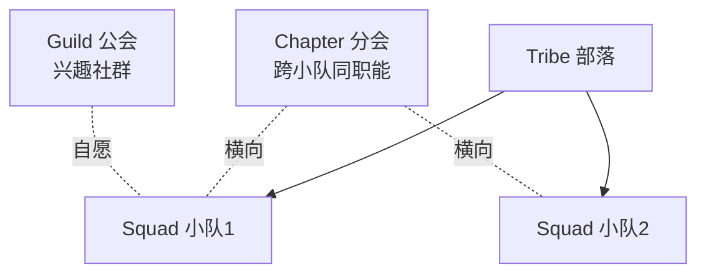

# 软件开发流程与模型(十七)规模化敏捷SAFe与LeSS

> [!abstract] 速览
> [[13.Scrum框架|Scrum]] 适合单个小团队，但当**几十上百个团队**协作同一个大产品时，就需要**规模化敏捷**。主流框架有 **SAFe**（最流行、最重）、**LeSS**（最小化、保持 Scrum 本质）、**Nexus**、**Scrum@Scale** 等。
> 一句话：**规模化敏捷解决"多团队如何对齐目标、协调依赖、统一节奏"**——SAFe 用结构换确定性(重)，LeSS 用克制保敏捷(轻)，没有标准答案。本篇深入 SAFe 四配置/ART/PI Planning、LeSS 规则、Spotify 模型迷思与选型建议。

## 1. 为什么需要规模化

- **康威定律**：系统结构会复刻组织沟通结构——多团队若不协调，架构必然割裂（见 [[44.TeamTopologies团队拓扑]]）。
- 单 Scrum 团队 ≤10 人，大产品需多团队**共享目标、管理依赖、统一发布节奏**，否则各自为政、集成灾难。

## 2. 主流框架概览

| 框架 | 特点 | 适用 |
| --- | --- | --- |
| **SAFe** | 重、结构完整、企业级 | 大型企业、强治理 |
| **LeSS** | 最小化、扩展 Scrum | 想保持敏捷纯度 |
| **Nexus** | Scrum.org 出品，3~9 团队 | 中等规模 |
| **Scrum@Scale** | Sutherland，模块化扩展 | 灵活扩展 |
| **Spotify 模型** | Squad/Tribe/Chapter/Guild | **是"快照"非框架**（见第 8 节） |

## 3. SAFe：四种配置

SAFe（Scaled Agile Framework）是当前**采用最广**的规模化框架，按规模分四配置：

| 配置 | 适用 |
| --- | --- |
| **Essential SAFe** | 基础，单个 ART |
| **Large Solution** | 多 ART 协作的大解决方案 |
| **Portfolio SAFe** | 加投资组合层(战略 / 预算) |
| **Full SAFe** | 全部层级 |

## 4. SAFe 核心概念

| 概念 | 含义 |
| --- | --- |
| **ART 敏捷发布火车** | 5~12 个团队组成的"火车"，统一节奏交付价值 |
| **PI（Program Increment / Planning Interval）** | 8~12 周的大迭代 |
| **PI Planning** | 全 ART 几百人**面对面大计划会**，对齐目标、理依赖 |
| **层级** | 团队层 → 项目群(ART) → 大解决方案 → 投资组合 |

> SAFe 的卖点是"结构 + 对齐"，批评者说它**太重、偏瀑布化**。

## 5. LeSS：最小化规模化

LeSS（Large-Scale Scrum）信奉"**少即是多**"：尽量**只扩展 Scrum、不加额外角色与层级**。

| 要点 | 说明 |
| --- | --- |
| 规模 | LeSS（2~8 队）/ LeSS Huge（8+ 队） |
| **一个 Product Backlog** | 整个产品共享一个待办列表 |
| **一个 PO** | 一个产品负责人统筹 |
| **一个共同 Sprint** | 多团队同节奏，整体集成出一个增量 |
| 哲学 | 减少角色 / 制品，保持 Scrum 本质 |

## 6. LeSS 的原则

LeSS 强调：整体优化、以客户为中心、更少角色、更少制品、更少流程——**用更少的规则达成协调**，反对叠床架屋。

## 7. SAFe vs LeSS

| 维度 | SAFe | LeSS |
| --- | --- | --- |
| 重量 | **重**（角色 / 层级多） | **轻**（最小化） |
| 治理 | 强，企业友好 | 弱，团队自治 |
| 学习成本 | 高 | 中 |
| 风险 | 易变"换皮瀑布" | 对组织成熟度要求高 |
| 适合 | 大型传统企业转型 | 已较敏捷、想保纯度 |

## 8. Spotify 模型：是"快照"不是框架

Spotify 的 **Squad(小队) / Tribe(部落) / Chapter(分会) / Guild(公会)** 广为流传：

> [!warning]
> 它只是 Spotify 在**某时间点的组织快照**，连 Spotify 自己都说"我们已经不那样了、当时也没完全做到，别照抄"。把它当"标准框架"生搬硬套是常见错误。

## 9. 规模化的核心挑战

无论用哪个框架，要解决的本质是三件事：

| 挑战 | 说明 |
| --- | --- |
| **对齐 Alignment** | 多团队朝同一目标 |
| **依赖 Dependency** | 团队间依赖的识别与管理 |
| **集成 Integration** | 多团队成果持续集成成一个可用增量 |

## 10. 优点与缺点

| 优点 | 缺点 |
| --- | --- |
| 多团队对齐、管理依赖 | 易官僚化、变重 |
| 统一节奏与发布 | 可能削弱团队自治 |
| 企业级可治理(SAFe) | 学习与转型成本高 |

## 11. 选型建议

- 大型传统企业、需强治理与对齐 → **SAFe**；
- 已较敏捷、想保持轻量 → **LeSS / Nexus**；
- **前提**：无论哪种，先把单团队 Scrum 做好，否则只是放大混乱。

## 12. 真实案例：百人团队上 SAFe

某银行 IT 部 8 个 Scrum 团队各自为政、集成困难。引入 SAFe：组建一列 ART、每 10 周开一次 PI Planning 对齐目标与依赖、统一发布节奏。对齐改善，但也带来"会议变多、流程变重"的副作用——需持续精简。

## 13. 常见误区与面试要点

> [!warning] 易错点
> - **规模化 = 加流程加层级？** 危险。要解决的是**对齐与依赖**，不是堆官僚。
> - **Spotify 模型是框架？** 不。它是组织快照，别照抄。
> - **SAFe 一定比 LeSS 好？** 看组织：SAFe 重治理，LeSS 重纯度。
> - **PI Planning 是什么？** SAFe 的全 ART 大型面对面计划会。
> - **LeSS 的"一个"指什么？** 一个产品待办、一个 PO、一个共同 Sprint。
> - **规模化前提是什么？** 单团队已真敏捷。

## 14. 对常见说法的修正

> [!note] 修正清单
> 1. **"规模化敏捷 = 更敏捷"**——常常相反，SAFe 落地易变"换皮瀑布"(重计划重层级)。规模化前提是单团队已真敏捷。
> 2. **"照搬 Spotify 模型就能敏捷"**——它是快照非框架，照搬常水土不服。

## 15. 一句话记忆

> **规模化敏捷** = 让几十个团队像一个团队那样对齐目标、协调依赖、统一节奏：**SAFe 用结构换确定性(重)，LeSS 用克制保敏捷(轻)**；Spotify 模型只是快照别照搬；前提是单团队先做好 Scrum。

## 延伸阅读

- 基础框架：[[13.Scrum框架]]
- 组织与架构：[[44.TeamTopologies团队拓扑]]（康威定律）
- 思想源流：[[16.精益软件开发Lean]]（Lean-Agile）
- 横向速查：[[46.模型对比速查大表]]

## 参考文献

1. Leffingwell, D. *SAFe*（scaledagileframework.com）。
2. Larman, C. & Vodde, B. *Large-Scale Scrum (LeSS)*.
3. Scrum.org. *The Nexus Guide*.
4. Kniberg, H. & Ivarsson, A. *Scaling Agile @ Spotify*（原始"快照"文章）。

---

> ⬅️ [[16.精益软件开发Lean]] ｜ 🏠 [[00.软件开发流程与模型总览]] ｜ [[18.敏捷估算与度量]] ➡️
