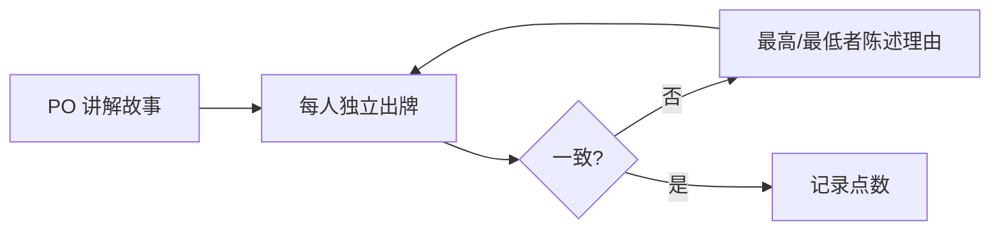

# 软件开发流程与模型(十八)敏捷估算与度量

> [!abstract] 速览
> 敏捷不靠"精确工时"，而靠**相对估算 + 经验度量**做预测。核心工具：**故事点(Story Point)** 做相对估算、**计划扑克(Planning Poker)** 做集体估算、**速度(Velocity)** 做预测、**燃尽 / 燃起图** 看进度。
> 一句话：**人不擅长绝对估算(几小时)，却擅长相对比较(谁更大)**——敏捷估算正是利用这一点，用相对值 + 历史速度做"够用的预测"，而非追求虚假的精确。本篇深入故事点、计划扑克、速度、燃尽/燃起图、CFD 与 #NoEstimates 之争。

## 1. 为什么用相对估算

人对"这个功能要几小时"极不准，但对"A 比 B 大约大一倍"判断较稳。敏捷据此**放弃绝对工时、改用相对大小**——把估算变成"比较"而非"预测时间"。

## 2. 故事点(Story Point)

故事点是**无量纲**的相对单位，综合体现：

| 维度 | 含义 |
| --- | --- |
| 复杂度 | 技术难度 |
| 工作量 | 要做多少 |
| 不确定性 / 风险 | 有多少未知 |

> 故事点**不是工时**。一个 3 点的故事不等于"3 小时"或"3 天"，只表示"约是 1 点故事的 3 倍大"。

## 3. 计划扑克(Planning Poker)

集体相对估算法，用**斐波那契数列**（1,2,3,5,8,13,20,40,100,∞,☕）：

- 用斐波那契是因为**越大越不确定**，间隔拉大避免"纠结 6 还是 7"；
- 独立出牌防"锚定效应"(被先发言者带偏)；
- 分歧本身**暴露理解差异**，讨论比数字更有价值。

## 4. 其他估算技术

| 技术 | 做法 | 适用 |
| --- | --- | --- |
| **T-shirt 尺码** | S/M/L/XL 粗估 | 早期、超粗粒度 |
| **亲和估算** | 把卡片按大小归堆 | 大批量故事快速估 |
| **理想人天** | 假设无干扰的纯工作天 | 需向上沟通工时时 |
| **#NoEstimates** | 干脆不估、只拆小 + 数数量 | 见第 11 节 |

## 5. 速度(Velocity)

**速度 = 团队每个冲刺平均完成的故事点**。它用于**预测**：

> 剩余 80 点 ÷ 平均速度 20 点/冲刺 ≈ 还需 4 个冲刺。

- 速度需几个冲刺才稳定；
- **只用于本团队预测**，不可跨团队比较（每队点的标准不同）。

## 6. 燃尽图(Burndown)

横轴时间、纵轴剩余工作量。理想线匀速降到 0；实际线在上方=偏慢，需在站会调整。

## 7. 燃起图(Burnup)

| 维度 | 燃尽 Burndown | 燃起 Burnup |
| --- | --- | --- |
| 纵轴 | 剩余工作(↓) | 已完成(↑) + 总范围线 |
| 盲区 | **分不清做得慢还是加了需求** | 范围线上抬即**范围蔓延**，一目了然 |
| 适用 | 冲刺内跟踪 | 版本级、需暴露范围变化 |

> 只看燃尽图易被"中途加需求"误导（曲线降不下去团队却背锅）；燃起图把"完成"与"范围"分两条线，能直接暴露范围蔓延。

## 8. 累积流图(CFD)

来自 [[14.看板方法Kanban|Kanban]]：各状态任务量随时间堆叠，色带变宽=瓶颈、带宽≈WIP、斜率≈吞吐、两线水平距≈周期时间。用于看流动健康。

## 9. 用速度做发布预测

| 方法 | 说明 |
| --- | --- |
| 乐观 / 悲观区间 | 用最近最高/最低速度算出"最快/最慢"完成区间 |
| 蒙特卡洛模拟 | 用历史吞吐分布模拟完成日期概率 |

> 预测应给**区间 + 概率**("80% 概率 5 个冲刺内完成")，而非虚假的精确单点。

## 10. 估算的陷阱

| 陷阱 | 危害 |
| --- | --- |
| **故事点换算工时** | 失去相对估算意义 |
| **跨团队比速度** | 诱发"点数膨胀"刷数据 |
| **把速度当 KPI 考核** | 团队虚报点数 |
| **过度估算** | 估算时间超过价值 |

## 11. #NoEstimates 思潮

部分实践者主张：**与其费力估点，不如把故事拆得足够小、均匀，然后只数"数量 + 历史吞吐"做预测**。争议在于：适合成熟、故事均匀的团队，不适合需对外承诺范围/预算的场景。它提醒我们：**估算是手段不是目的**。

## 12. 真实案例：用速度预测发布

某团队近 5 个冲刺速度为 22/18/25/20/20，平均约 21。Backlog 剩 105 点 → 约需 5 个冲刺。用最低(18)/最高(25)算区间：4.2~5.8 冲刺 → 对外承诺"5~6 个冲刺内交付"，留缓冲。

## 13. 工具链

Jira / Azure Boards（自动算速度、燃尽/燃起、CFD）、计划扑克工具(Planning Poker Online、Scrum Poker)。

## 14. 常见误区与面试要点

> [!warning] 易错点
> - **故事点 = 工时？** 不。是相对复杂度/工作量。
> - **速度可跨团队比？** 不可。每队点的标准不同。
> - **速度是 KPI 吗？** 不应是，会诱发刷点数。
> - **为什么用斐波那契？** 越大越不确定，间隔拉大避免纠结。
> - **燃尽 vs 燃起？** 燃起能暴露范围蔓延，燃尽不能。
> - **计划扑克为什么独立出牌？** 防锚定效应。

## 15. 对常见说法的修正

> [!note] 修正清单
> 1. **"估算越精确越好"**——敏捷追求"够用的预测"，过度追求精确本身是浪费(见 #NoEstimates)。
> 2. **"速度高=团队强"**——速度是预测工具不是绩效，跨团队/拿来考核都会扭曲。

## 16. 一句话记忆

> **敏捷估算与度量** = 用**相对故事点**(非工时) + **计划扑克**集体估，用**速度**预测、**燃尽/燃起图**看进度、**CFD**看流动；速度只用于本团队预测、绝不当 KPI——估算是手段，别为精确而精确。

## 延伸阅读

- 所属框架：[[13.Scrum框架]]
- 流动度量：[[14.看板方法Kanban]] · [[38.软件度量DORA与SPACE]]
- 价值观：[[12.敏捷宣言与原则]]
- 横向速查：[[46.模型对比速查大表]]

## 参考文献

1. Cohn, M. *Agile Estimating and Planning*.
2. Grenning, J. *Planning Poker*.
3. Vacanti, D. *Actionable Agile Metrics for Predictability*.

---

> ⬅️ [[17.规模化敏捷SAFe与LeSS]] ｜ 🏠 [[00.软件开发流程与模型总览]] ｜ [[19.混合模型与Water-Scrum-fall]] ➡️
