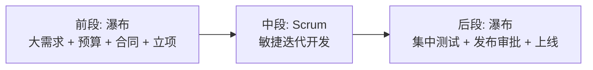
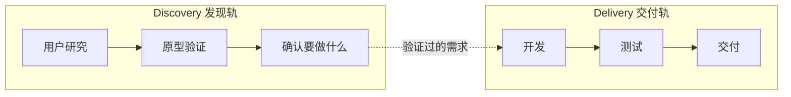

# 软件开发流程与模型(十九)混合模型与Water-Scrum-fall

> [!abstract] 速览
> 现实中**纯瀑布与纯敏捷都少见**，绝大多数组织跑的是**混合(Hybrid)**。其中最普遍的一种叫 **Water-Scrum-fall**（Forrester 提出）：**前段瀑布**(大需求/预算/合同) + **中段 Scrum**(敏捷开发) + **后段瀑布**(集中测试/发布审批)。
> 一句话：**混合不是"四不像"，而是组织约束(合规/预算/发布窗口)与敏捷理想的现实妥协**——关键是清醒地设计混合点，而不是无意识地退化。本篇剖析 Water-Scrum-fall 的成因、它是"反模式还是现实"的双面性、常见混合模式与演进路径。

## 1. 为什么混合是常态

| 现实约束 | 导致 |
| --- | --- |
| 合同 / 预算需前期定 | 前段被迫瀑布式 |
| 合规 / 审计需文档与门禁 | 阶段门禁保留 |
| 发布窗口 / 运维流程受限 | 后段集中发布 |
| 中间团队想敏捷 | 中段跑 Scrum |

于是"两头瀑布、中间敏捷"自然形成。

## 2. Water-Scrum-fall 是什么

由 Forrester 的 Dave West 提出，描述了"**敏捷只发生在开发中段，两头仍被传统流程包裹**"的普遍现实。

## 3. 成因分析

- **前段瀑布**：财务要先批预算、采购要签合同、需求要先冻结范围——这些都要求"先想清楚"。
- **后段瀑布**：测试团队独立、发布要走变更审批(ITIL)、运维有发布窗口——导致集中测试与发布。
- **中段敏捷**：开发团队学了 Scrum，在自己能控的范围内迭代。

## 4. 是反模式还是现实？（双面看）

| 视角 | 观点 |
| --- | --- |
| **反模式视角** | 敏捷价值被两头瀑布抵消：反馈仍慢、发布仍集中、前期仍冻结 |
| **务实视角** | 在组织无法一步到位时，它是**合理的过渡态**，比"假装全敏捷"诚实 |

> [!note]
> 关键不在"是不是 Water-Scrum-fall"，而在**你是否清醒地知道瓶颈在两头，并持续把瀑布段也敏捷化**(如 [[21.持续集成与持续交付CICD|CI/CD]] 改造后段发布)。无意识地停滞才是问题。

## 5. 常见混合模式

| 模式 | 做法 | 适用 |
| --- | --- | --- |
| **阶段门禁 + 敏捷迭代** | 大里程碑用门禁，阶段内敏捷 | 大型 / 合规项目 |
| **双轨敏捷 Dual-Track** | Discovery(验证做什么) ∥ Delivery(做出来) 并行 | 产品团队 |
| **敏捷 + 合规叠加** | 敏捷开发 + 合规文档/审计补齐 | 医疗 / 金融 |
| **前敏捷后瀑布** | 敏捷开发 + 受控发布 | 受发布窗口约束 |

## 6. 双轨敏捷(Dual-Track)详解

> 发现轨持续验证"该做什么"(降低做错风险)，交付轨持续"把验证过的做出来"——两轨并行，是产品型团队常用的健康混合。

## 7. 混合的设计原则

| 原则 | 说明 |
| --- | --- |
| 有意识设计 | 明确哪段瀑布、哪段敏捷、为什么 |
| 缩小瀑布段 | 持续把两头也敏捷化(CI/CD、滚动需求) |
| 守住反馈环 | 别让两头瀑布把反馈周期拉回数月 |
| 度量端到端 | 用 [[38.软件度量DORA与SPACE\|DORA]] 看真实交付效能 |

## 8. Disciplined Agile(DA)：混合工具箱

**Disciplined Agile（DA）**（现属 PMI）不强推单一方法，而是提供"**过程决策工具箱**"，让团队按情境**选择并裁剪**实践——本质就是"科学地做混合"。它承认"没有一种方法适合所有人"。

## 9. 优点与缺点

| 优点 | 缺点 |
| --- | --- |
| 贴合组织现实约束 | 易抵消敏捷价值(两头慢) |
| 平衡合规与灵活 | 反馈周期可能仍长 |
| 可作过渡态平稳转型 | 无意识则停滞、退化 |

## 10. 真实案例：传统企业的混合落地

某保险公司：前段保留立项/预算评审(瀑布)，开发用 Scrum 双周迭代，但测试与上线受合规与发布窗口限制仍是季度集中发布(瀑布)。识别出"后段发布"是最大瓶颈后，投入 [[21.持续集成与持续交付CICD|CI/CD]] + 自动化合规检查，把季度发布逐步缩短到双周——**Water-Scrum-fall 正在向真敏捷演进**。

## 11. 如何从 Water-Scrum-fall 进化

1. 先**度量**端到端前置时间，定位两头瀑布的浪费；
2. **后段**：上 [[21.持续集成与持续交付CICD|CI/CD]]、自动化测试与合规、[[27.发布与部署策略|渐进发布]]；
3. **前段**：滚动需求、小批量立项，替代一次性大冻结；
4. 持续缩小两头瀑布占比。

## 12. 工具链

DA 工具箱、[[21.持续集成与持续交付CICD|CI/CD]]、价值流度量、[[38.软件度量DORA与SPACE|DORA]]。

## 13. 常见误区与面试要点

> [!warning] 易错点
> - **混合 = 不专业 / 四不像？** 不。**混合是现实常态**，关键在有意识设计。
> - **Water-Scrum-fall 一定不好？** 是常见现实，可作过渡态；问题是无意识停滞。
> - **双轨敏捷是什么？** Discovery(验证做什么) 与 Delivery(做出来) 并行。
> - **混合的最大风险？** 两头瀑布把反馈周期拉回数月，抵消敏捷价值。
> - **DA 是什么？** 过程决策工具箱，科学做裁剪/混合。

## 14. 对常见说法的修正

> [!note] 修正清单
> 1. **"要么纯敏捷要么纯瀑布"**——非黑即白是误区，**混合才是绝大多数组织的真实状态**。
> 2. **"Water-Scrum-fall 是失败"**——它是转型途中的常见现实，清醒地持续改进才是正道。

## 15. 一句话记忆

> **混合模型** = 现实里的常态：最典型的 **Water-Scrum-fall**(前瀑布立项 + 中 Scrum 开发 + 后瀑布发布)是组织约束下的妥协——关键是**清醒设计混合点、持续把两头也敏捷化**(CI/CD/滚动需求)，而非无意识停滞。

## 延伸阅读

- 选型基础：[[11.过程模型选型与Cynefin决策]]
- 两端方法：[[03.瀑布模型]] · [[13.Scrum框架]]
- 后段改造：[[21.持续集成与持续交付CICD]] · [[27.发布与部署策略]]
- 效能度量：[[38.软件度量DORA与SPACE]]
- 横向速查：[[46.模型对比速查大表]]

## 参考文献

1. West, D. (Forrester). *Water-Scrum-Fall Is the Reality of Agile*.
2. Ambler, S. & Lines, M. *Disciplined Agile Delivery*.
3. Sedano, T. 等. *Dual-Track Development*.

---

> ⬅️ [[18.敏捷估算与度量]] ｜ 🏠 [[00.软件开发流程与模型总览]] ｜ [[20.DevOps文化与体系]] ➡️
