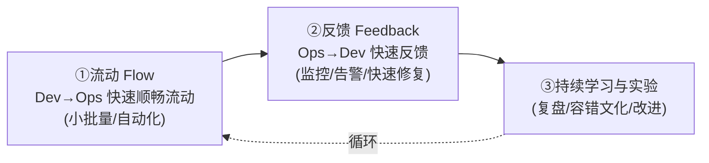
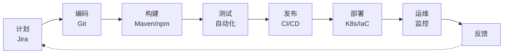

# 软件开发流程与模型(二十)DevOps文化与体系

> [!abstract] 速览
> **DevOps** = Development + Operations，旨在**打破开发与运维之间的墙**，让软件**快速、频繁、可靠**地交付。它首先是一种**文化**（协作、责任共担），其次才是自动化工具链。
> 一句话：**DevOps 让"写代码的人"和"运维系统的人"成为一个团队，用自动化把"提交→上线"的链路打通**——它是敏捷"频繁交付"理想在**部署/运维侧**的延伸。本篇深入 CALMS、三步工作法、工具链与 DORA。

## 1. DevOps 要解决什么

传统中开发求"快上线"、运维求"稳不动"，目标冲突形成"**部门墙**"：开发把代码"扔过墙"，出事互相甩锅。DevOps 让两者**共担端到端责任**——"**You build it, you run it**"（你构建你运维）。

## 2. 历史

- 2009 年 Velocity 大会，Flickr 的 John Allspaw & Paul Hammond 演讲《**10+ Deploys per Day**: Dev and Ops Cooperation》；
- 同年 Patrick Debois 发起 **DevOpsDays**，"DevOps"一词流行；
- Gene Kim 等的《凤凰项目》《DevOps Handbook》将其体系化。

## 3. CALMS 模型

DevOps 的五大支柱：

| 字母 | 含义 |
| --- | --- |
| **C — Culture** | 协作、责任共担（最核心） |
| **A — Automation** | 自动化构建 / 测试 / 部署 / 基础设施 |
| **L — Lean** | 精益，小批量、消除浪费(见 [[16.精益软件开发Lean]]) |
| **M — Measurement** | 度量一切(见 [[38.软件度量DORA与SPACE]]) |
| **S — Sharing** | 知识与责任共享 |

## 4. 三步工作法(The Three Ways)

| 工作法 | 核心 |
| --- | --- |
| **流动** | 让价值从开发顺畅流向生产(CI/CD、小批量) |
| **反馈** | 让生产问题快速反馈回开发(监控、可观测性) |
| **持续学习** | 营造容错与实验文化(无指责复盘) |

## 5. DevOps 与敏捷 / 精益的关系

| 关系 | 说明 |
| --- | --- |
| 敏捷 | 解决"开发到能交付"，DevOps 接力解决"交付到上线运维" |
| 精益 | DevOps 大量借用精益(小批量、流动、消除浪费) |
| 一句话 | **敏捷 + DevOps = 从想法到生产的端到端快速流动** |

## 6. DevOps 工具链(Toolchain)

涵盖：版本控制(Git)、[[21.持续集成与持续交付CICD|CI/CD]]、基础设施即代码(IaC: Terraform/Ansible)、容器与编排(Docker/K8s)、[[30.可观测性与混沌工程|监控可观测性]]。

## 7. 关键实践

| 实践 | 说明 |
| --- | --- |
| [[21.持续集成与持续交付CICD\|CI/CD]] | 自动化构建测试部署 |
| **基础设施即代码 IaC** | 用代码管理环境(Terraform)，可复现 |
| **配置管理** | Ansible/Chef/Puppet |
| **监控与可观测性** | 指标/日志/追踪(见 [[30.可观测性与混沌工程]]) |
| **自动化一切** | 减少手工、减少人为错误 |

## 8. 用 DORA 度量 DevOps

[[38.软件度量DORA与SPACE|DORA 四指标]]是 DevOps 效能的金标准：部署频率、变更前置时间、变更失败率、故障恢复时间(MTTR)。前两个量"快"，后两个量"稳"。

## 9. 文化：无指责与责任共担

- **无指责复盘(Blameless Postmortem)**：出事故复盘对事不对人，鼓励暴露问题；
- **责任共担**：开发也关心线上、运维也参与设计；
- 文化是 DevOps 的根——**工具好买，文化难建**。

## 10. 优点与挑战

| 优点 | 挑战 |
| --- | --- |
| 交付更快更频繁 | 文化转变最难 |
| 质量与稳定性提升 | 工具链复杂、学习成本 |
| 故障恢复更快 | 安全需同步左移([[24.DevSecOps与供应链安全]]) |
| 开发运维协作改善 | 组织结构需配合(见 [[44.TeamTopologies团队拓扑]]) |

## 11. 真实案例：从季度发布到每日发布

某团队原来季度发布、上线如临大敌。引入 DevOps：搭 CI/CD 流水线、基础设施 IaC 化、加监控告警、推行无指责复盘。一年后做到**每日多次发布**，变更失败率反而下降——小批量 + 自动化 + 快速回滚的胜利。

## 12. 常见误区与面试要点

> [!warning] 易错点
> - **DevOps = 工具 / 招个 DevOps 工程师？** 不。它首先是**文化**，不是买套工具或设个岗位。
> - **DevOps = 运维自动化？** 自动化只是 A，还有 C/L/M/S。
> - **DevOps 取代运维？** 不。是开发运维**协作共担**，不是消灭运维。
> - **三步工作法是哪三步？** 流动、反馈、持续学习。
> - **CALMS 哪个最核心？** Culture(文化)。

## 13. 对常见说法的修正

> [!note] 修正清单
> 1. **"DevOps 就是 CI/CD"**——CI/CD 是关键实践，但 DevOps 是文化+流程+工具的整体。
> 2. **"上了工具就是 DevOps"**——没有协作文化，再多工具也只是"自动化的部门墙"。

## 14. 一句话记忆

> **DevOps** = 拆开发与运维的墙、共担端到端责任：以 **文化(CALMS 的 C)** 为根、用 **三步工作法(流动→反馈→持续学习)** 驱动、靠自动化工具链落地、用 **DORA** 度量——敏捷在部署运维侧的延伸。

## 延伸阅读

- 核心实践：[[21.持续集成与持续交付CICD]] · [[22.CICD流水线实践]]
- 安全延伸：[[24.DevSecOps与供应链安全]]
- 可靠性：[[29.SRE与错误预算]] · [[30.可观测性与混沌工程]]
- 度量：[[38.软件度量DORA与SPACE]]
- 组织：[[44.TeamTopologies团队拓扑]]
- 横向速查：[[46.模型对比速查大表]]

## 参考文献

1. Kim, G., Humble, J., Debois, P., Willis, J. *The DevOps Handbook*.
2. Kim, G. *The Phoenix Project*（凤凰项目）。
3. Allspaw, J. & Hammond, P. (2009). *10+ Deploys per Day*.

---

> ⬅️ [[19.混合模型与Water-Scrum-fall]] ｜ 🏠 [[00.软件开发流程与模型总览]] ｜ [[21.持续集成与持续交付CICD]] ➡️
