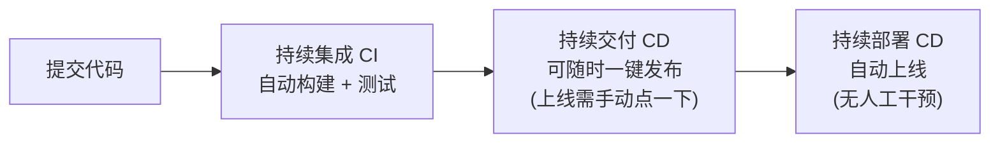
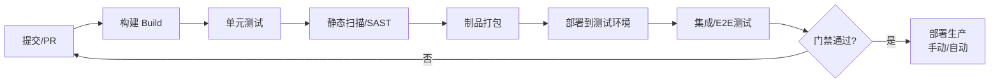

# 软件开发流程与模型(二十一)持续集成与持续交付CICD

> [!abstract] 速览
> **CI/CD** 是 [[20.DevOps文化与体系|DevOps]] 的技术核心，常被混为一谈，实则是**三个概念**：**持续集成 CI** → **持续交付 CD(Delivery)** → **持续部署 CD(Deployment)**。
> 一句话：**CI 保证"代码随时能合并且是健康的"，持续交付保证"随时能一键发布"，持续部署则"自动发布、无需人工"。** 三者层层递进，把"提交→上线"的链路自动化。本篇辨析三概念、流水线设计、质量门禁，并给出 YAML 示例。

## 1. 三个概念辨析（最高频考点）



| 概念 | 做到哪一步 | 人工介入 |
| --- | --- | --- |
| **持续集成 CI** | 自动构建 + 自动测试，频繁合并主干 | 合并由人 |
| **持续交付 CDelivery** | 任何时候都**能**一键部署到生产 | **上线需人工批准** |
| **持续部署 CDeployment** | 通过测试就**自动**部署到生产 | **全自动，无人工** |

> 区别核心：**持续交付"能发但人决定何时发"，持续部署"自动发"**。

## 2. 持续集成 CI 详解

CI（Martin Fowler 推广）要求开发者**频繁(每天多次)把代码合并到主干**，每次合并触发**自动构建 + 自动测试**，快速发现集成问题。

| CI 关键实践 | 说明 |
| --- | --- |
| 频繁提交 | 小步提交，避免大爆炸合并 |
| 自动化构建 | 一键可重复构建 |
| 自动化测试 | 提交即跑测试 |
| 快速反馈 | 构建失败立即通知、优先修复 |
| 主干保持可发布 | 红了就停下修(对应精益 Jidoka) |

## 3. CI/CD 流水线全景



## 4. 质量门禁(Quality Gate)

流水线各阶段设**门禁**，不达标就阻断：

| 门禁 | 检查 |
| --- | --- |
| 构建 | 能否编译 |
| 测试 | 通过率 + 覆盖率阈值 |
| 静态分析 | 代码异味、漏洞(SonarQube) |
| 安全 | SAST/依赖扫描(见 [[24.DevSecOps与供应链安全]]) |
| 人工评审 | [[26.代码评审流程\|Code Review]] 批准 |

## 5. 部署频率与批量大小

DevOps 核心信念：**小批量、频繁发布 比 大批量、偶尔发布更安全**。

- 大批量：风险叠加、出事难定位、回滚痛苦；
- 小批量：每次改动小、易测易回滚、问题易定位。

这呼应 [[06.增量模型|增量]]与 [[16.精益软件开发Lean|精益]]的"小批量流动"。

## 6. 与分支策略的关系

CI 偏爱**短命分支 / 主干开发(Trunk-Based)**——分支越久越难合并。详见 [[25.Git分支工作流]]。长命分支(如 Git Flow 的 develop)与"持续集成"理念有张力。

## 7. 与特性开关配合

未完成的功能可先合并主干但用**特性开关**关闭(见 [[27.发布与部署策略]])，从而既"持续集成"又不暴露半成品——解决"频繁合并"与"功能未完"的矛盾。

## 8. 工具链

| 类别 | 工具 |
| --- | --- |
| CI/CD 平台 | GitHub Actions、GitLab CI、Jenkins、CircleCI、Argo |
| 制品库 | Nexus、Artifactory、Harbor |
| 容器/编排 | Docker、Kubernetes |
| IaC | Terraform、Ansible |

## 9. 真实案例 + YAML 示例

一个最简 CI 流水线（GitHub Actions）：

```yaml
name: CI
on: [push, pull_request]
jobs:
  build-test:
    runs-on: ubuntu-latest
    steps:
      - uses: actions/checkout@v4
      - run: npm ci
      - run: npm run lint          # 代码规范门禁
      - run: npm test              # 单元测试门禁
      - run: npm run build         # 构建门禁
```

> 每次 push / PR 自动跑：装依赖 → Lint → 测试 → 构建，任一步失败即阻断合并——主干始终保持健康。

## 10. 优点与挑战

| 优点 | 挑战 |
| --- | --- |
| 集成问题早发现 | 需要扎实的自动化测试 |
| 发布快、风险小 | 流水线维护成本 |
| 主干始终可发布 | 文化上要"频繁提交"习惯 |
| 回滚容易 | 测试不稳(flaky)会拖垮信任 |

## 11. 常见误区与面试要点

> [!warning] 易错点
> - **CI = CD？** 不。CI 是集成测试自动化；CD 有"交付"和"部署"两义。
> - **持续交付 = 持续部署？** 不。交付"能一键发(人决定)"，部署"自动发"。
> - **CI 就是用了 Jenkins？** 工具≠实践。没有频繁提交 + 自动测试，装了也不是 CI。
> - **大批量发布更稳？** 相反，小批量频繁发布更安全。
> - **长命分支适合 CI 吗？** 不。CI 偏爱短命分支/主干开发。
> - **flaky 测试为何危险？** 让团队不信任流水线，进而绕过门禁。

## 12. 对常见说法的修正

> [!note] 修正清单
> 1. **"CI/CD 就是一套工具"**——它是**实践**：频繁提交 + 自动化 + 小批量，工具只是载体。
> 2. **"持续部署人人适用"**——强合规/高风险系统常止步于"持续交付"(保留人工批准关卡)。

## 13. 一句话记忆

> **CI/CD** = 三级递进：**CI**(频繁合并+自动构建测试，主干随时健康) → **持续交付**(随时能一键发，人决定何时发) → **持续部署**(测试过就自动上线)；配小批量、质量门禁、特性开关与短命分支，把"提交→上线"全自动化。

## 延伸阅读

- 上位文化：[[20.DevOps文化与体系]]
- 流水线实操：[[22.CICD流水线实践]]
- 分支策略：[[25.Git分支工作流]]
- 发布策略：[[27.发布与部署策略]]
- 安全门禁：[[24.DevSecOps与供应链安全]]
- 横向速查：[[46.模型对比速查大表]]

## 参考文献

1. Humble, J. & Farley, D. *Continuous Delivery*.
2. Fowler, M. *Continuous Integration*.
3. Forsgren, N., Humble, J., Kim, G. *Accelerate*.

---

> ⬅️ [[20.DevOps文化与体系]] ｜ 🏠 [[00.软件开发流程与模型总览]] ｜ [[22.CICD流水线实践]] ➡️
