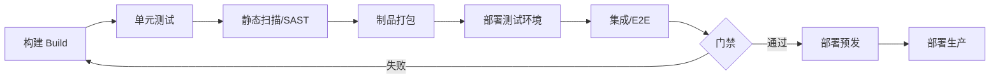
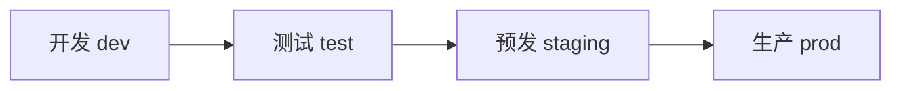

# 软件开发流程与模型(二十二)CICD流水线实践

> [!abstract] 速览
> [[21.持续集成与持续交付CICD|CI/CD]] 讲"是什么"，本篇讲"**怎么落地一条流水线**"：用 **Pipeline as Code(流水线即代码)** 把"构建→测试→扫描→打包→部署"的全过程写成版本化的配置，每次提交自动跑。
> 一句话：**流水线是 CI/CD 的执行引擎**——核心原则是"**一次构建、到处部署(Build Once, Deploy Anywhere)**"、阶段化质量门禁、环境逐级晋级。本篇含阶段设计、制品管理、最佳实践与 YAML 示例。

## 1. Pipeline as Code（流水线即代码）

把流水线定义写进仓库里的配置文件（`.gitlab-ci.yml`、`Jenkinsfile`、GitHub Actions workflow），与代码一起版本化：

| 好处 | 说明 |
| --- | --- |
| 版本化 | 流水线变更可追溯、可回滚 |
| 可复现 | 任何人 clone 即得同一流水线 |
| 可评审 | 流水线改动走 [[26.代码评审流程\|PR 评审]] |

## 2. 流水线阶段设计



## 3. 制品管理：一次构建，到处部署

> [!note] Build Once, Deploy Anywhere
> 同一个**制品(artifact)** 从测试一路晋级到生产，**绝不为不同环境重新构建**——否则"测过的"和"上线的"可能不是同一个二进制。环境差异由**配置**注入，而非重新编译。

## 4. 环境逐级晋级



同一制品逐级"晋级"，每级跑相应测试与门禁；越靠近生产，环境越接近真实。

## 5. 质量门禁详解

| 门禁 | 阻断条件 |
| --- | --- |
| 编译 | 构建失败 |
| 测试 | 通过率 / 覆盖率不达标 |
| 静态分析 | 严重代码异味 / 漏洞(SonarQube) |
| 安全 | SAST / 依赖漏洞(见 [[24.DevSecOps与供应链安全]]) |
| 人工 | [[26.代码评审流程\|Code Review]] 未批准 |

## 6. 流水线类型

| 类型 | 触发 | 用途 |
| --- | --- | --- |
| CI 流水线 | 每次 push / PR | 快速反馈(构建+测试) |
| CD 流水线 | 合并主干 / 打 tag | 部署到各环境 |
| 多分支流水线 | 按分支策略 | 配合 [[25.Git分支工作流]] |

## 7. 与部署策略集成

流水线最后一公里对接发布策略：蓝绿、金丝雀、滚动（见 [[27.发布与部署策略]]）。流水线负责"把制品安全地放上去"。

## 8. 流水线最佳实践

| 实践 | 说明 |
| --- | --- |
| **快** | 几分钟内出反馈；慢流水线 = 没人愿等 |
| **可靠** | 杜绝 flaky 测试，否则失去信任 |
| **幂等** | 同输入同结果，可重跑 |
| **可视化** | 每阶段状态清晰可见 |
| **快速失败** | 把快的检查(Lint/单测)放前面 |
| **并行化** | 独立阶段并行跑 |

## 9. 真实案例 + YAML 示例

GitLab CI 三阶段流水线：

```yaml
stages: [build, test, deploy]

build:
  stage: build
  script:
    - mvn -B package
  artifacts:
    paths: [target/*.jar]      # 制品传给后续阶段

test:
  stage: test
  script:
    - mvn -B test

deploy-staging:
  stage: deploy
  script:
    - kubectl apply -f k8s/      # 部署到预发
  environment: staging
  only: [main]                   # 仅主干触发
```

> 一次 `mvn package` 产出 jar，作为制品被 test、deploy 复用——体现"一次构建、到处部署"。

## 10. 工具链

GitHub Actions、GitLab CI、Jenkins、CircleCI、Argo Workflows、Tekton；制品库 Nexus/Artifactory/Harbor。

## 11. 常见误区与面试要点

> [!warning] 易错点
> - **每个环境重新构建？** 错。应"一次构建、到处部署"，否则测的和上线的不一致。
> - **流水线越长越好？** 不。要快、要快速失败(快检查在前)。
> - **flaky 测试无所谓？** 危险——会让团队绕过/不信任门禁。
> - **流水线配置不用评审？** 应像代码一样走 PR 评审(Pipeline as Code)。
> - **环境差异怎么处理？** 用配置注入，不重新编译。

## 12. 对常见说法的修正

> [!note] 修正清单
> 1. **"有流水线 = 有 CI/CD"**——若没频繁提交、没小批量、没自动门禁，流水线只是"自动化的瀑布"。
> 2. **"流水线越全越好"**——过长过慢的流水线没人愿等，反而促使绕过；快与可靠优先。

## 13. 一句话记忆

> **CI/CD 流水线** = 把"构建→测试→扫描→打包→逐级部署"写成**版本化的 Pipeline as Code**，遵循"**一次构建到处部署**"、阶段质量门禁、快速失败——它是 CI/CD 的执行引擎。

## 延伸阅读

- 概念基础：[[21.持续集成与持续交付CICD]]
- 声明式交付：[[23.GitOps]]
- 发布最后一公里：[[27.发布与部署策略]]
- 安全门禁：[[24.DevSecOps与供应链安全]]
- 横向速查：[[46.模型对比速查大表]]

## 参考文献

1. Humble, J. & Farley, D. *Continuous Delivery*.
2. Forsgren, N. 等. *Accelerate*.
3. 各 CI/CD 平台官方文档(GitHub Actions / GitLab CI)。

---

> ⬅️ [[21.持续集成与持续交付CICD]] ｜ 🏠 [[00.软件开发流程与模型总览]] ｜ [[23.GitOps]] ➡️
