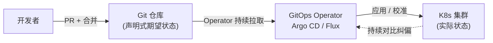

# 软件开发流程与模型(二十三)GitOps

> [!abstract] 速览
> **GitOps** 由 Weaveworks 于 2017 年提出，核心是 **以 Git 作为系统期望状态的唯一事实源(Single Source of Truth)**：把基础设施和应用的**声明式配置**全放进 Git，由 **Operator**(如 Argo CD、Flux) 自动把集群的**实际状态**持续校准到 Git 里的**期望状态**。
> 一句话：**想改生产？改 Git。** 部署变成"提交 + 合并 PR"，集群自己拉取并对齐——可审计、可回滚、声明式。本篇深入四原则、Pull 模型、与传统 CI/CD 的区别。

## 1. GitOps 是什么

传统部署是"**推(Push)**"——CI 流水线主动 `kubectl apply` 到集群。GitOps 反过来用"**拉(Pull)**"——集群里的 Operator 持续盯着 Git，发现期望状态变了就**自己拉下来应用**，并不断把漂移的实际状态**校准**回期望。

## 2. 四大原则（OpenGitOps）

| 原则 | 含义 |
| --- | --- |
| **声明式 Declarative** | 系统期望状态用声明式配置表达(如 K8s YAML) |
| **版本化且不可变** | 期望状态存于 Git，版本化、可审计 |
| **自动拉取应用** | Operator 自动从 Git 拉取并应用 |
| **持续校准 Reconciled** | 持续对比实际↔期望，自动纠正漂移 |

## 3. 工作流



## 4. Push vs Pull 部署模型

| 维度 | 传统 Push(CI 推) | GitOps Pull(集群拉) |
| --- | --- | --- |
| 谁发起部署 | CI 流水线 | 集群内 Operator |
| 凭证 | CI 需持有集群凭证(外泄风险) | 凭证留在集群内，更安全 |
| 漂移处理 | 不自动纠正 | **持续校准纠偏** |
| 事实源 | 流水线脚本 | **Git** |

## 5. 核心组件

| 组件 | 作用 |
| --- | --- |
| **Git 仓库** | 存声明式期望状态(唯一事实源) |
| **GitOps Operator** | Argo CD / Flux，持续校准 |
| **目标环境** | K8s 集群等 |

## 6. 一段声明式配置示例

```yaml
# deployment.yaml —— 提交到 Git，Operator 自动应用
apiVersion: apps/v1
kind: Deployment
metadata:
  name: web
spec:
  replicas: 3              # 期望 3 个副本
  template:
    spec:
      containers:
        - name: web
          image: myapp:v1.4.2   # 改这一行 + 合并 PR = 发布新版本
```

> 想从 v1.4.2 升级到 v1.5.0？改镜像 tag、提 PR、合并——Operator 自动滚动更新。**回滚 = git revert**。

## 7. 优点

| 优点 | 说明 |
| --- | --- |
| **可审计** | 每次变更都是一次 Git 提交，谁改的、改了啥一清二楚 |
| **可回滚** | `git revert` 即回滚到任意历史状态 |
| **一致性** | 自动纠正配置漂移，环境始终 = Git |
| **安全** | 集群凭证不外发给 CI |
| **声明式** | 描述"要什么"而非"怎么做" |

## 8. 缺点与挑战

| 挑战 | 说明 |
| --- | --- |
| 学习曲线 | 需掌握声明式 / K8s / Operator |
| 密钥管理 | 敏感信息不能明文进 Git(需 Sealed Secrets/Vault) |
| 主要面向云原生 | 非 K8s 场景适配成本高 |

## 9. GitOps vs 传统 CI/CD

GitOps 不取代 CI，而是**重塑 CD**：CI 仍负责构建测试出制品；**CD 改由 GitOps 完成**——CI 更新 Git 里的镜像 tag，Operator 负责部署。即 **CI 推制品到仓库，GitOps 拉配置到集群**。

## 10. 真实案例：用 Argo CD 管理多集群

某公司用 Argo CD 管理 dev/staging/prod 三套 K8s。所有部署配置在 Git，按目录分环境。发布新版本：CI 构建镜像 → 自动改 Git 里 staging 的镜像 tag → Argo 同步到 staging；验证 OK 后提 PR 改 prod tag → 合并 → Argo 同步到 prod。**全程可审计，回滚只需 revert。**

## 11. 工具链

Argo CD、Flux CD（GitOps Operator）；配套 Helm/Kustomize(配置模板)、Sealed Secrets/Vault(密钥)。

## 12. 常见误区与面试要点

> [!warning] 易错点
> - **GitOps = 把脚本放 Git？** 不。核心是**声明式 + Operator 持续校准**，不是单纯存脚本。
> - **GitOps 取代 CI/CD？** 不。它重塑的是 **CD**；CI 仍负责构建测试。
> - **GitOps = Push 部署？** 反了。GitOps 是 **Pull** 模型。
> - **密钥能直接进 Git 吗？** 不能，需加密(Sealed Secrets/外部 Vault)。
> - **怎么回滚？** git revert 到历史状态，Operator 自动校准。
> - **配置漂移怎么办？** Operator 持续校准自动纠偏。

## 13. 对常见说法的修正

> [!note] 修正清单
> 1. **"GitOps 只是把 YAML 放 Git"**——关键在 Operator 的**持续校准(reconciliation)**与 Pull 模型，而非存放位置。
> 2. **"GitOps 适合一切部署"**——它最契合**云原生/K8s 声明式**世界，传统虚机/物理机场景收益有限。

## 14. 一句话记忆

> **GitOps** = 以 **Git 为期望状态的唯一事实源**，用 **Operator(Argo/Flux) 持续把集群实际状态校准到 Git**：改生产=改 Git、回滚=git revert——声明式、可审计、Pull 模型，云原生时代的 CD 范式。

## 延伸阅读

- 上位概念：[[20.DevOps文化与体系]] · [[21.持续集成与持续交付CICD]]
- 流水线：[[22.CICD流水线实践]]
- 发布策略：[[27.发布与部署策略]]
- 平台化：[[28.平台工程与内部开发者平台]]
- 横向速查：[[46.模型对比速查大表]]

## 参考文献

1. Weaveworks. *GitOps — Operations by Pull Request*.
2. OpenGitOps. *GitOps Principles v1.0*.
3. Argo CD / Flux CD 官方文档。

---

> ⬅️ [[22.CICD流水线实践]] ｜ 🏠 [[00.软件开发流程与模型总览]] ｜ [[24.DevSecOps与供应链安全]] ➡️
