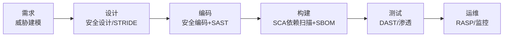

# 软件开发流程与模型(二十四)DevSecOps与供应链安全

> [!abstract] 速览
> **DevSecOps** = 在 [[20.DevOps文化与体系|DevOps]] 中把 **安全(Sec)** 嵌入全流程，核心是 **安全左移(Shift Left)**：不再等上线前做一次性渗透测试，而是从需求、编码到部署**每个阶段都内建安全**，且自动化。
> 一句话：**安全是每个人的责任、贯穿全流程、自动化兜底**。近年 SolarWinds、Log4Shell、xz 后门等事件还让**软件供应链安全**（依赖、SBOM、SLSA）成为重中之重。本篇深入安全左移、各类安全测试、供应链防护与 CI 安全门禁。

## 1. DevSecOps 要解决什么

传统安全是"**守门员**"——开发完了安全团队来审，发现问题已晚、改起来贵、还拖慢上线，形成"安全 vs 速度"的对立。DevSecOps 把安全**融入**流程：早做、常做、自动做。

## 2. 安全左移(Shift Left)



> "左移"= 把安全活动从右端(上线后)前移到左端(需求/编码)。越早发现漏洞越便宜(呼应 [[03.瀑布模型|缺陷成本曲线]])。

## 3. 各阶段安全活动

| 阶段 | 安全活动 |
| --- | --- |
| 需求 | **威胁建模(Threat Modeling)**、滥用案例 |
| 设计 | 安全设计、STRIDE 分析 |
| 编码 | 安全编码规范、**SAST** |
| 构建 | **SCA** 依赖扫描、生成 **SBOM** |
| 测试 | **DAST**、渗透测试 |
| 运维 | **RASP**、运行时监控、漏洞响应 |

## 4. 安全测试类型对比

| 类型 | 全称 | 方式 | 测什么 |
| --- | --- | --- | --- |
| **SAST** | 静态应用安全测试 | 白盒，扫源码 | 代码层漏洞(注入/越界) |
| **DAST** | 动态应用安全测试 | 黑盒，扫运行应用 | 运行时漏洞 |
| **SCA** | 软件成分分析 | 扫依赖清单 | 第三方库已知漏洞(CVE) |
| **IAST** | 交互式 | 运行时插桩 | 结合动静态 |
| **RASP** | 运行时自我保护 | 生产内嵌 | 实时拦截攻击 |

## 5. 软件供应链安全：血的教训

现代软件 80%+ 是第三方依赖，供应链成头号攻击面：

| 事件 | 年 | 教训 |
| --- | --- | --- |
| **SolarWinds** | 2020 | 构建系统被植入后门，波及上万客户 |
| **Log4Shell** | 2021 | Log4j 一个漏洞震动全球 Java 生态 |
| **xz-utils 后门** | 2024 | 开源维护者社会工程植入后门，险酿大祸 |

## 6. SBOM：软件物料清单

**SBOM（Software Bill of Materials）** = 软件的"成分表"，列出所有依赖及版本。出漏洞时能**秒查"我用没用到"**。标准格式：**SPDX、CycloneDX**。已成监管要求(如美国行政令 14028)。

## 7. SLSA：供应链完整性框架

**SLSA（Supply-chain Levels for Software Artifacts，Google 发起）** 用分级(L1~L4)要求构建过程的**可追溯与防篡改**：来源可验证、构建可复现、防止构建系统被污染。

## 8. 依赖与制品安全实践

| 实践 | 说明 |
| --- | --- |
| 依赖扫描 | SCA 工具持续扫 CVE(Dependabot/Snyk) |
| 锁定版本 | lockfile 固定依赖版本 |
| 制品签名 | 对制品签名验证(Sigstore/cosign) |
| 最小化依赖 | 减少攻击面 |

## 9. 密钥管理

绝不硬编码密钥；用 **Vault / KMS / Sealed Secrets** 管理；CI 用密钥扫描(gitleaks)防止泄露进仓库。

## 10. 真实案例 + CI 安全门禁

在流水线里加一道安全门禁：

```yaml
security-scan:
  stage: test
  script:
    - sast-scan ./src             # 静态代码扫描(SAST)
    - dependency-check ./          # 依赖漏洞扫描(SCA)
    - syft . -o cyclonedx > sbom.json   # 生成 SBOM
  allow_failure: false             # 发现高危漏洞即阻断合并
```

> 高危漏洞直接阻断流水线——把安全做成"过不去的关卡"，而非"上线前的建议"。

## 11. 工具链

SAST(SonarQube/Checkmarx/Semgrep)、SCA(Snyk/Dependabot/OWASP Dependency-Check)、DAST(OWASP ZAP)、密钥扫描(gitleaks)、SBOM(Syft/CycloneDX)、签名(cosign/Sigstore)。

## 12. 常见误区与面试要点

> [!warning] 易错点
> - **DevSecOps = 上线前做安全测试？** 反了。核心是**安全左移**，全流程内建。
> - **安全是安全团队的事？** 不。DevSecOps 强调**安全是每个人的责任**。
> - **SAST = DAST？** 不。SAST 白盒扫源码，DAST 黑盒扫运行应用。
> - **SBOM 有什么用？** 出漏洞时秒查"用没用到"该依赖。
> - **供应链安全为何重要？** 软件大半是第三方依赖，是头号攻击面。
> - **密钥能进 Git 吗？** 绝不能，用 Vault/KMS + 密钥扫描。

## 13. 对常见说法的修正

> [!note] 修正清单
> 1. **"安全拖慢交付"**——安全后置才拖慢；左移 + 自动化反而让安全"无感"地融入流水线。
> 2. **"用了 SAST 就安全了"**——单一手段不够，需 SAST+DAST+SCA+供应链多层防护。

## 14. 一句话记忆

> **DevSecOps** = 安全**左移**、全流程内建、自动化兜底：编码 SAST、依赖 SCA、运行 DAST，再加**供应链防护**(SBOM 查成分、SLSA 保完整、制品签名)——安全是每个人的责任，做成流水线里"过不去的关卡"。

## 延伸阅读

- 上位文化：[[20.DevOps文化与体系]]
- 门禁载体：[[21.持续集成与持续交付CICD]] · [[22.CICD流水线实践]]
- 缺陷成本：[[03.瀑布模型]]（越早越便宜）
- AI 安全：[[45.AI辅助开发流程]]（AI 生成代码的安全）
- 横向速查：[[46.模型对比速查大表]]

## 参考文献

1. OWASP. *DevSecOps Guideline*、*SAMM*.
2. Google. *SLSA Framework*（slsa.dev）。
3. NIST. *SSDF (SP 800-218)*；美国行政令 14028(SBOM)。

---

> ⬅️ [[23.GitOps]] ｜ 🏠 [[00.软件开发流程与模型总览]] ｜ [[25.Git分支工作流]] ➡️
