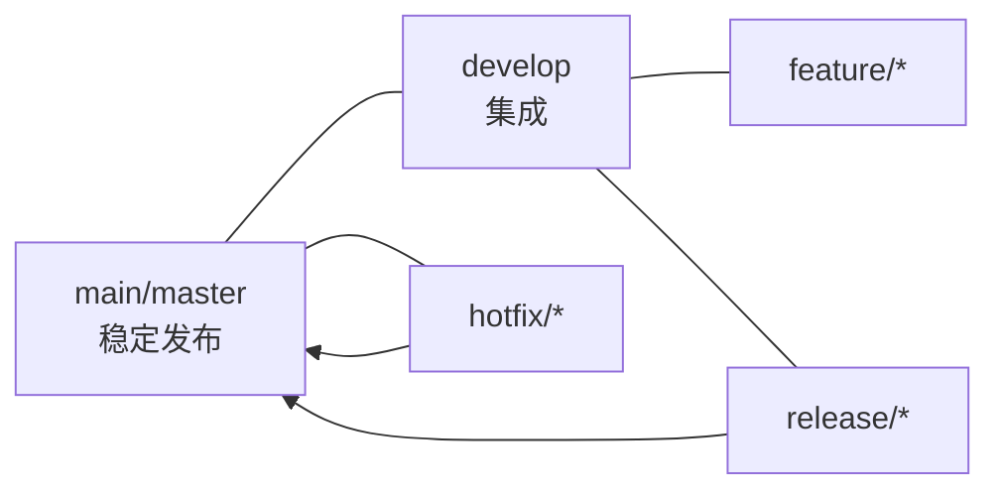
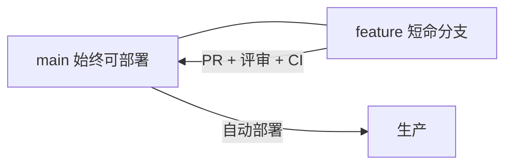
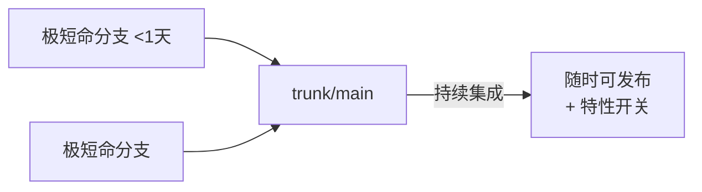

# 软件开发流程与模型(二十五)Git分支工作流

> [!abstract] 速览
> **分支工作流**决定团队"怎么用 Git 协作"。四种主流：**Git Flow**(重、版本化)、**GitHub Flow**(轻、持续部署)、**GitLab Flow**(环境分支)、**Trunk-Based Development**(主干开发，CI/CD 首选)。
> 一句话：**分支越长命，集成越痛苦**——所以现代 [[21.持续集成与持续交付CICD|CI/CD]] 偏爱**短命分支 / 主干开发**。本篇详解四种模型、对比选型，及其与 CI/CD、特性开关的关系。

## 1. 为什么分支策略重要

分支策略影响**集成频率、发布节奏、冲突多少**。选错会导致"合并地狱"或"主干不稳"。核心权衡：**隔离性(分支独立) vs 集成性(频繁合并)**。

## 2. Git Flow（重量级、版本化）

| 分支 | 用途 |
| --- | --- |
| main/master | 生产稳定版 |
| develop | 集成分支 |
| feature/* | 功能开发 |
| release/* | 发布准备 |
| hotfix/* | 紧急修复 |

> 适合**有明确版本发布**的产品(如客户端 App)。缺点：分支多、长命 develop 与"持续集成"有张力。

## 3. GitHub Flow（轻量、持续部署）

只有 main + 短命功能分支：开分支 → 提交 → PR 评审 + CI → 合并 → 部署。简单，适合 **Web 持续部署**。

## 4. GitLab Flow（环境分支）

在 GitHub Flow 基础上加**环境分支**(如 `production`、`pre-production`)或**发布分支**，让代码沿环境逐级晋级。适合需要**多环境对应**或受发布窗口约束的团队。

## 5. Trunk-Based Development（主干开发）

所有人**频繁(每天)提交到主干**，分支极短命(<1 天)甚至直接提交主干，未完成功能用**特性开关**藏起来。它是**高频 CI/CD 与 DevOps 成熟团队的首选**，也是 [[21.持续集成与持续交付CICD|持续集成]]的本义。

## 6. 四者对比

| 模型 | 分支结构 | 复杂度 | 发布方式 | 适合 |
| --- | --- | --- | --- | --- |
| **Git Flow** | 5 类分支 | 高 | 版本化发布 | 有明确版本、客户端 |
| **GitHub Flow** | main + 短命 | 低 | 持续部署 | Web / SaaS |
| **GitLab Flow** | main + 环境分支 | 中 | 多环境晋级 | 需环境对应 |
| **Trunk-Based** | 主干 + 极短命 | 低 | CI/CD 随时 | 高频交付、DevOps 成熟 |

## 7. 与 CI/CD 的关系

> [!note] 核心张力
> **持续集成的本义是"频繁合并主干"**——分支活得越久，离 CI 越远。Git Flow 的长命 develop / feature 与"持续集成"存在张力；**Trunk-Based 才是 CI 的天然搭档**。Google、Facebook 等大厂普遍用主干开发。

## 8. 选型建议

| 场景 | 推荐 |
| --- | --- |
| Web / SaaS 持续部署 | GitHub Flow / Trunk-Based |
| 有版本号的客户端 / 库 | Git Flow |
| 需多环境严格对应 | GitLab Flow |
| 追求高频 CI/CD、团队成熟 | **Trunk-Based** |

## 9. 特性开关：主干开发的关键

主干开发要"频繁合并"又"功能没做完"，靠**特性开关(Feature Flag)** 解决：未完成代码合并进主干但**开关关闭**，对用户不可见，做完再开灯。这样既持续集成又不暴露半成品(见 [[27.发布与部署策略]])。

## 10. 真实案例：从 Git Flow 迁到 Trunk-Based

某团队用 Git Flow，feature 分支常活两周，合并冲突严重、集成延迟。迁到 Trunk-Based：拆小任务、每天合并主干、上特性开关、强化 CI。冲突骤减、集成问题早发现、发布频率提升——**短命分支 + 频繁集成的胜利**。

## 11. 工具链

GitHub / GitLab(PR/MR + 保护分支 + CI)、特性开关平台(LaunchDarkly/Unleash)、分支保护规则(必过 CI + 评审才能合并)。

## 12. 常见误区与面试要点

> [!warning] 易错点
> - **Git Flow 是最佳实践？** 它适合版本化产品，但对持续部署偏重；不是万能。
> - **分支越多越规范？** 不。长命分支增加集成痛苦，与 CI 相悖。
> - **Trunk-Based = 不用分支？** 用，但**极短命**(<1 天)，且配特性开关。
> - **持续集成偏爱哪种？** 短命分支 / 主干开发。
> - **未完成功能怎么频繁合主干？** 用特性开关藏起来。
> - **GitHub Flow vs GitLab Flow？** 后者多了环境分支。

## 13. 对常见说法的修正

> [!note] 修正清单
> 1. **"Git Flow 是标准 / 最优"**——它是流行模型之一，但其长命分支与持续集成有张力；现代高频交付更推 Trunk-Based。
> 2. **"主干开发很乱很危险"**——配合特性开关 + 强 CI + 分支保护，主干开发反而更稳、集成更早。

## 14. 一句话记忆

> **Git 分支工作流** 四选一：**Git Flow**(重/版本化)、**GitHub Flow**(轻/持续部署)、**GitLab Flow**(环境分支)、**Trunk-Based**(主干开发/CI 首选)；铁律是**分支越短命、集成越顺**，未完功能用特性开关藏。

## 延伸阅读

- 集成基础：[[21.持续集成与持续交付CICD]]
- 发布与开关：[[27.发布与部署策略]]
- 评审流程：[[26.代码评审流程]]
- 横向速查：[[46.模型对比速查大表]]

## 参考文献

1. Driessen, V. *A successful Git branching model*（Git Flow）。
2. GitHub. *Understanding the GitHub flow*.
3. Hammant, P. *Trunk Based Development*（trunkbaseddevelopment.com）。

---

> ⬅️ [[24.DevSecOps与供应链安全]] ｜ 🏠 [[00.软件开发流程与模型总览]] ｜ [[26.代码评审流程]] ➡️
