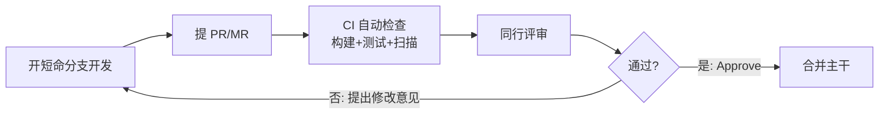

# 软件开发流程与模型(二十六)代码评审流程

> [!abstract] 速览
> **代码评审（Code Review）** 是合并前由同行检查代码的流程，现代多以 **PR(Pull Request) / MR(Merge Request)** 形式进行。它不只为找 bug，更是**知识共享、规范统一、集体代码所有权**的关键机制。
> 一句话：**评审的最大价值常不是抓缺陷，而是传播知识、对齐标准、让多人理解同一段代码**。本篇深入评审流程、评审清单、高效实践、反模式与礼仪。

## 1. 代码评审为什么重要

| 价值 | 说明 |
| --- | --- |
| **发现缺陷** | 第二双眼睛抓逻辑 / 边界问题 |
| **知识共享** | 评审者了解了这块代码(降低巴士因子) |
| **统一规范** | 风格、模式趋于一致 |
| **集体所有权** | 代码不是"某个人的" |
| **指导成长** | 资深带新人 |

> 研究(如 SmartBear)表明：评审的**知识传播与设计反馈**价值，往往超过单纯抓 bug。

## 2. PR / MR 评审流程

> CI 先把"机器能查的"(编译/测试/Lint/安全)挡掉，人只评审"机器查不了的"(设计/可读性/业务正确)。

## 3. 评审的几种形式

| 形式 | 说明 |
| --- | --- |
| **PR / MR 评审** | 异步、最主流 |
| **结对编程** | 实时评审(见 [[15.极限编程XP]]) |
| **正式审查 Fagan Inspection** | 重量级、有角色与会议，安全攸关领域用 |
| **工具辅助 / AI 评审** | SonarQube、CodeRabbit、[[45.AI辅助开发流程\|AI]] |

## 4. 评审什么（清单）

| 维度 | 检查点 |
| --- | --- |
| **正确性** | 逻辑、边界、并发、错误处理 |
| **可读性** | 命名、结构、是否易懂 |
| **设计** | 是否过度 / 不足设计、是否符合架构 |
| **测试** | 是否有测试、覆盖关键路径 |
| **安全** | 注入、越权、密钥、输入校验(见 [[24.DevSecOps与供应链安全]]) |
| **性能** | 明显低效、N+1 查询 |

## 5. 高效评审实践

| 实践 | 说明 |
| --- | --- |
| **小 PR** | < 400 行最佳；大 PR 评审质量骤降 |
| **快响应** | 数小时内回应，别阻塞队友 |
| **对事不对人** | 评论代码，不评论人 |
| **解释"为什么"** | 给理由而非命令 |
| **区分必须 / 建议** | 标注 blocking vs nit(小建议) |
| **自动化先行** | 风格 / 格式交给工具，人评审实质 |

## 6. 评审反模式

| 反模式 | 表现 | 危害 |
| --- | --- | --- |
| **橡皮图章 LGTM** | 不看就批准 | 评审形同虚设 |
| **吹毛求疵** | 纠结无关紧要的格式 | 打击士气、拖慢 |
| **拖延** | PR 挂好几天没人看 | 阻塞、分支变长命 |
| **超大 PR** | 几千行一起评 | 没人能认真看 |
| **权力游戏** | 借评审刁难 | 破坏协作 |

## 7. 评审礼仪

- **作者**：PR 要小、写清上下文与目的、自评一遍、回应每条评论。
- **评审者**：及时、友善、给理由、区分必须改与可选、肯定好的部分。
- 共识：**目标是让代码更好，不是证明谁更强**。

## 8. AI 辅助评审

[[45.AI辅助开发流程|AI]] 工具(CodeRabbit、Copilot Review)能自动抓常见缺陷与风格问题，作为**第一道补充**——但架构与业务正确性仍需人判断，AI 评审不替代人工评审。

## 9. 度量

| 指标 | 关注 |
| --- | --- |
| PR 大小 | 越小越好评 |
| 评审响应时长 | 越短越不阻塞 |
| 评审覆盖率 | 是否都被评审 |

> 注意：别把"评论数"当 KPI，会诱发为评而评。

## 10. 真实案例：用"小 PR + 快评审"提速

某团队 PR 动辄上千行、挂三四天，集成慢、评审走过场。改革：强制 PR < 400 行、4 小时内首次响应、模板写清上下文、CI 挡掉格式问题。结果评审质量与速度双升、缺陷率下降。

## 11. 工具链

GitHub / GitLab(PR/MR + 分支保护 + Required Reviews)、SonarQube(质量门禁)、CodeRabbit / Copilot(AI 评审)、Reviewable / Gerrit(专业评审)。

## 12. 常见误区与面试要点

> [!warning] 易错点
> - **评审只为找 bug？** 不。知识共享、规范统一、集体所有权常更重要。
> - **PR 越大越高效？** 相反，大 PR 评审质量骤降，应拆小。
> - **LGTM 秒批可以吗？** 橡皮图章是反模式，等于没评审。
> - **格式问题该人工挑吗？** 交给工具(Lint/Formatter)，人评审实质。
> - **AI 评审能替代人工？** 不。它是补充，业务/架构仍需人。
> - **Fagan Inspection 是什么？** 重量级正式审查，安全攸关领域用。

## 13. 对常见说法的修正

> [!note] 修正清单
> 1. **"评审主要是抓 bug"**——研究显示其知识传播与设计反馈价值常超过抓 bug。
> 2. **"评审越严越好"**——吹毛求疵 / 超大 PR / 拖延都会让评审变负担，关键是小批量 + 友善 + 自动化分担。

## 14. 一句话记忆

> **代码评审** = 合并前同行把关(PR/MR)：CI 先挡机器能查的，人专注设计/可读/业务/安全；铁律是 **小 PR + 快响应 + 对事不对人**——它的最大价值常是知识共享与规范统一，而非单纯抓 bug。

## 延伸阅读

- 实时评审：[[15.极限编程XP]]（结对编程）
- 集成门禁：[[21.持续集成与持续交付CICD]] · [[22.CICD流水线实践]]
- 安全评审：[[24.DevSecOps与供应链安全]]
- AI 评审：[[45.AI辅助开发流程]]
- 横向速查：[[46.模型对比速查大表]]

## 参考文献

1. SmartBear. *Best Practices for Code Review*.
2. Google. *Engineering Practices — Code Review Guidelines*.
3. Fagan, M. *Design and Code Inspections*.

---

> ⬅️ [[25.Git分支工作流]] ｜ 🏠 [[00.软件开发流程与模型总览]] ｜ [[27.发布与部署策略]] ➡️
