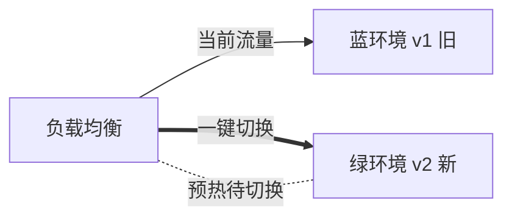
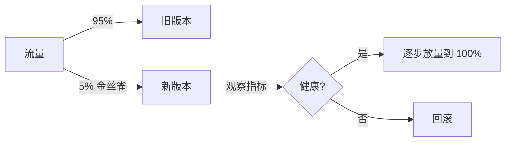
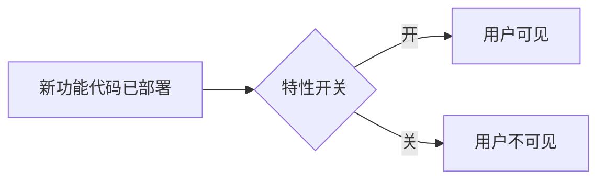

# 软件开发流程与模型(二十七)发布与部署策略

> [!abstract] 速览
> 把新版本安全送上生产，有多种策略：**蓝绿、金丝雀(灰度)、滚动、重建、特性开关、A/B、影子**。核心目标——**降低发布风险、能快速回滚、最好用户无感**。
> 一句话：**先区分"部署(Deploy)"与"发布(Release)"**——部署是"把代码放上去"，发布是"让用户看到"，二者解耦(靠特性开关)是现代发布的关键思想。本篇详解各策略、对比、渐进交付与回滚。

## 1. 部署 vs 发布（关键区分）

| 概念 | 含义 |
| --- | --- |
| **部署 Deploy** | 把新版本**装到生产环境**(可对用户不可见) |
| **发布 Release** | 让用户**真正用上**新功能 |

> 解耦二者：代码可先**部署**(关着特性开关)，择机再**发布**(开灯)——降低风险、随时可关。

## 2. 蓝绿部署(Blue-Green)

两套相同环境，新版部署到"绿"、验证 OK 后**流量一次性切过去**；出问题**切回蓝**即回滚。优点回滚极快，缺点需双倍资源。

## 3. 金丝雀发布(Canary / 灰度)

先放**一小撮流量**给新版(金丝雀)，盯监控指标，健康就逐步加量，异常就回滚。风险最小、最受欢迎。

## 4. 滚动部署(Rolling)

逐批替换实例(如每次 20%)，旧版逐步被新版替换。省资源，但发布期间**新旧版本并存**(需兼容),回滚需逐批退。

## 5. 重建部署(Recreate)

停掉所有旧实例再起新版——简单但**有停机**，仅适合可停机的场景。

## 6. 特性开关(Feature Flag)

代码级开关控制功能可见性，实现**部署与发布解耦**、**按人群灰度**、**瞬间回滚(关灯)**。是 [[25.Git分支工作流|主干开发]]与 [[06.增量模型|增量交付]]的关键。

## 7. A/B 测试与影子发布

| 策略 | 用途 |
| --- | --- |
| **A/B 测试** | 两版本对比，看哪个业务指标更好(产品实验) |
| **影子(Shadow)** | 把真实流量**复制**给新版但不返回结果，验证性能/正确性 |

## 8. 策略对比大表

| 策略 | 思路 | 资源 | 回滚速度 | 停机 | 风险 |
| --- | --- | --- | --- | --- | --- |
| 蓝绿 | 两套环境切换 | 双倍 | **极快** | 无 | 低 |
| 金丝雀 | 小流量逐步放量 | 少量额外 | 快 | 无 | **最低** |
| 滚动 | 逐批替换 | 省 | 中 | 无 | 中 |
| 重建 | 停旧起新 | 省 | 慢 | **有** | 高 |
| 特性开关 | 代码级开关 | 无额外 | **极快(关灯)** | 无 | 低 |

## 9. 渐进交付(Progressive Delivery)

金丝雀 + 特性开关 + 自动分析的组合，叫**渐进交付**：按"人群/地域/百分比"逐步放量，并用监控**自动**决定继续放量还是回滚。是发布策略的现代集大成。

## 10. 回滚策略

| 方式 | 说明 |
| --- | --- |
| 切回旧环境 | 蓝绿:切回蓝 |
| 关特性开关 | 瞬间隐藏新功能 |
| 重新部署旧版 | 重发上一个制品 |
| GitOps revert | git revert(见 [[23.GitOps]]) |

> **可回滚性**应在发布前就设计好——"能上"更要"能退"。

## 11. 真实案例：金丝雀 + 特性开关

某社交 App 发新推荐算法：先用特性开关对**内部员工**开放 → 再金丝雀放 5% 用户、盯留存与崩溃率 → 健康则逐步到 100%；中途发现某机型崩溃率升高，**秒关开关**回滚，修复后重来。**全程用户基本无感。**

## 12. 工具链

K8s(滚动/蓝绿原生支持)、Argo Rollouts / Flagger(金丝雀自动化)、特性开关平台(LaunchDarkly/Unleash)、服务网格(Istio 流量切分)。

## 13. 常见误区与面试要点

> [!warning] 易错点
> - **部署 = 发布？** 不。部署是放上去，发布是让用户看到；解耦靠特性开关。
> - **蓝绿 vs 金丝雀？** 蓝绿一次性切流量(双环境)，金丝雀逐步放量(小流量试)。
> - **滚动部署能瞬间回滚吗？** 不。需逐批退，比蓝绿/开关慢。
> - **特性开关只为灰度？** 还能解耦发布、瞬间回滚、A/B。
> - **渐进交付是什么？** 金丝雀+开关+自动分析的组合。
> - **回滚什么时候设计？** 发布前就要设计好。

## 14. 对常见说法的修正

> [!note] 修正清单
> 1. **"发布就是把代码部署上去"**——现代实践严格区分部署与发布，解耦带来安全与灵活。
> 2. **"蓝绿最好"**——金丝雀风险更低、资源更省，常是更优默认；选型看资源与风险偏好。

## 15. 一句话记忆

> **发布与部署策略** = 先解耦"**部署(放上去)**"与"**发布(让用户看到)**"；再选 **蓝绿(切环境)/ 金丝雀(小流量逐步放)/ 滚动(逐批换)/ 特性开关(开灯关灯)**——目标是低风险、快回滚、用户无感；组合起来就是**渐进交付**。

## 延伸阅读

- 流水线对接：[[22.CICD流水线实践]] · [[21.持续集成与持续交付CICD]]
- 增量交付：[[06.增量模型]]（特性开关配合）
- 声明式回滚：[[23.GitOps]]
- 可靠性：[[29.SRE与错误预算]]（错误预算控发布）
- 横向速查：[[46.模型对比速查大表]]

## 参考文献

1. Humble, J. & Farley, D. *Continuous Delivery*.
2. Fowler, M. *BlueGreenDeployment* / *FeatureToggle* / *CanaryRelease*.
3. Argo Rollouts / Flagger 官方文档。

---

> ⬅️ [[26.代码评审流程]] ｜ 🏠 [[00.软件开发流程与模型总览]] ｜ [[28.平台工程与内部开发者平台]] ➡️
