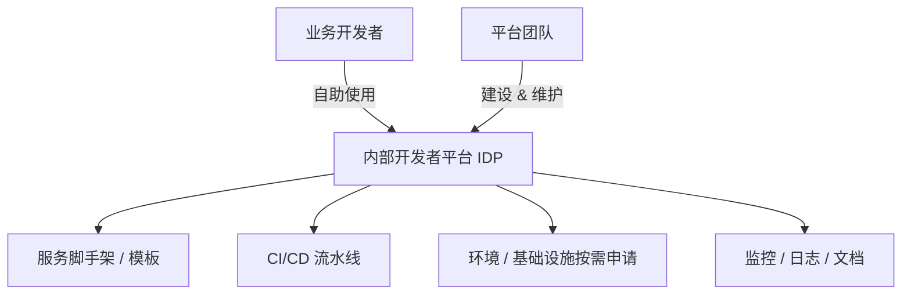

# 软件开发流程与模型(二十八)平台工程与内部开发者平台

> [!abstract] 速览
> **平台工程（Platform Engineering）** 是 2022 年起的热点：构建一个 **内部开发者平台(IDP, Internal Developer Platform)**，把基础设施、CI/CD、环境、监控等**抽象成自助服务**，让业务开发者沿**黄金路径(Golden Path)** 快速、自主地交付，而不必精通底层。
> 一句话：**它是对"DevOps 让每个开发者都要懂一切"的反思与纠偏**——把复杂度收敛进平台，降低开发者的**认知负荷**。本篇深入 IDP、黄金路径、平台即产品，及其与 DevOps/SRE 的关系。

## 1. 平台工程为什么兴起

DevOps 理想是"你构建你运维"，但现实是：K8s、Terraform、CI/CD、监控……**全栈复杂度压垮了业务开发者**。平台工程的回应：**别让每个人都重新学一遍底层，把它做成自助平台**。

## 2. 内部开发者平台(IDP)

IDP 把"开一个新服务要做的所有事"(建仓库、配流水线、申请环境、接监控)收敛成**自助、一键**的体验。

## 3. 黄金路径(Golden Path)

**黄金路径** = 平台团队**预先铺好的、内建最佳实践的推荐路径**：开发者照着走，就自动获得合规的 CI/CD、安全扫描、监控、日志。

> 不是强制唯一路，而是"**默认就对**的那条路"——偏离也可以，但要自担成本。

## 4. 平台即产品(Platform as a Product)

平台工程的核心心态转变：**把内部平台当产品做**，开发者是"客户"。

| 产品思维 | 体现 |
| --- | --- |
| 用户研究 | 了解开发者痛点 |
| 自助而非工单 | 别让人提工单等审批 |
| 文档与体验 | 像对外产品一样打磨 DX(开发者体验) |
| 度量采纳率 | 平台没人用就是失败 |

## 5. 平台工程 vs DevOps vs SRE

| 维度 | 平台工程 | [[20.DevOps文化与体系\|DevOps]] | [[29.SRE与错误预算\|SRE]] |
| --- | --- | --- | --- |
| 关注 | **降低开发者认知负荷** | 开发运维协作文化 | 服务可靠性 |
| 产出 | 自助平台(IDP) | 流程 + 文化 | SLO / 错误预算 |
| 关系 | DevOps 的**规模化落地方式** | 理念 | 可靠性工程实现 |

> 平台工程不取代 DevOps，而是**让 DevOps 在大组织里可规模化**——把"人人全栈"变成"平台兜底 + 开发专注业务"。

## 6. 认知负荷与团队拓扑

平台工程的理论支撑是 [[44.TeamTopologies团队拓扑]]：设**平台团队(Platform Team)** 为**流动赋能型团队**服务，降低**流式团队(Stream-aligned)** 的认知负荷，让其专注业务价值流。

## 7. 核心能力

| 能力 | 说明 |
| --- | --- |
| 自助式资源申请 | 一键拿环境 / 数据库 |
| 服务模板 / 脚手架 | 标准化新服务起步 |
| 内建 CI/CD | 黄金路径自带流水线 |
| 可观测性集成 | 自动接监控日志 |
| 服务目录 | 一处看清所有服务(Backstage) |

## 8. 优点与缺点

| 优点 | 缺点 / 风险 |
| --- | --- |
| 降低认知负荷、提速 | 平台本身需投入与维护 |
| 标准化、合规内建 | 做不好变"又一个官僚关卡" |
| 提升开发者体验 DX | 需产品思维与持续运营 |
| DevOps 可规模化 | 过度抽象会限制灵活性 |

## 9. 真实案例：Spotify Backstage

Spotify 开源的 **Backstage** 是知名 IDP 框架：提供**服务目录**(看清所有微服务及其负责人/文档/监控)、**软件模板**(一键脚手架新服务并自带黄金路径)、**插件生态**。许多公司基于它搭自己的 IDP。

## 10. 工具链

Backstage(服务目录/门户)、Crossplane / Terraform(基础设施抽象)、Humanitec / Port(IDP 平台)、Argo / Flux([[23.GitOps]])、Kubernetes。

## 11. 常见误区与面试要点

> [!warning] 易错点
> - **平台工程 = 运维换皮？** 不。核心是**产品化的自助平台 + 降低认知负荷**。
> - **平台工程取代 DevOps？** 不。是 DevOps 在大组织的**规模化落地**。
> - **黄金路径 = 强制唯一路径？** 不。是"默认就对"的推荐路径，可偏离但自担成本。
> - **IDP 是买个工具？** 不。要当产品持续运营、度量采纳率。
> - **平台工程的理论支撑？** Team Topologies 的认知负荷与平台团队。
> - **Backstage 是什么？** Spotify 开源的 IDP / 服务目录框架。

## 12. 对常见说法的修正

> [!note] 修正清单
> 1. **"平台工程否定了 DevOps"**——它纠正的是"人人全栈"的过度负荷，是 DevOps 的演进而非否定。
> 2. **"建个门户就是平台工程"**——没有产品思维、自助体验与采纳度量，门户只会沦为新官僚。

## 13. 一句话记忆

> **平台工程** = 把基础设施 / CI/CD / 监控抽象成**自助的内部开发者平台(IDP)**，铺好**黄金路径**，**像做产品一样运营平台**，降低开发者**认知负荷**——让 DevOps 在大组织可规模化，开发者专注业务。

## 延伸阅读

- 上位文化：[[20.DevOps文化与体系]]
- 理论支撑：[[44.TeamTopologies团队拓扑]]（认知负荷 / 平台团队）
- 可靠性搭档：[[29.SRE与错误预算]]
- 声明式底座：[[23.GitOps]]
- 横向速查：[[46.模型对比速查大表]]

## 参考文献

1. Skelton, M. & Pais, M. *Team Topologies*.
2. Spotify. *Backstage*（backstage.io）。
3. Humanitec. *Platform Engineering / Internal Developer Platform 报告*。

---

> ⬅️ [[27.发布与部署策略]] ｜ 🏠 [[00.软件开发流程与模型总览]] ｜ [[29.SRE与错误预算]] ➡️
